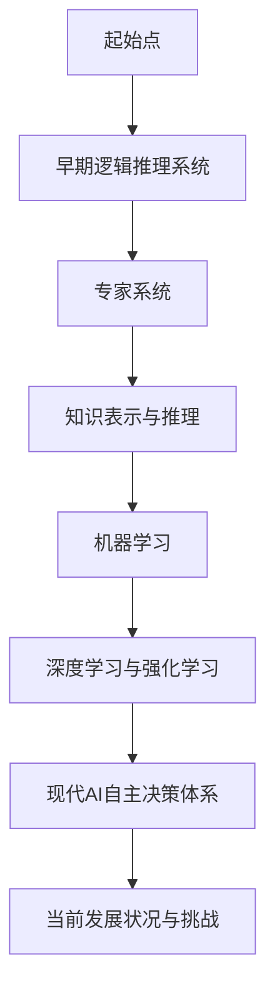

                 

### 文章标题

《AI自主决策的伦理考量》

### 关键词

人工智能，自主决策，伦理，道德规范，多准则优化，决策模型，案例研究

### 摘要

随着人工智能技术的飞速发展，AI自主决策已逐渐成为自动化系统中的核心模块。然而，AI自主决策的伦理问题也随之而来。本文深入探讨了AI自主决策的伦理考量，包括其背景与概述、技术基础、伦理框架构建、伦理规范制定、伦理教育以及案例研究。通过一步步的分析与推理，本文提出了针对AI自主决策的伦理框架和实践方法，为AI伦理研究提供了新的视角和思考。

## 第一部分：AI自主决策的背景与概述

### 1.1 AI自主决策的概念与历史发展

#### 核心概念与联系

AI自主决策是指人工智能系统在不依赖人类干预的情况下，根据环境信息和既定目标，自主地做出最优决策的过程。这一概念涉及多个核心组成部分：

1. **感知系统**：AI需要能够感知和理解其所在的环境。
2. **决策模型**：基于感知系统提供的信息，AI需要有一个决策模型来指导其行为。
3. **执行系统**：决策模型生成的决策需要通过执行系统来实施。

为了更好地理解AI自主决策的发展，我们可以使用Mermaid流程图来展示其关键节点和发展历程：



#### 核心算法原理讲解

在AI自主决策中，强化学习是一种常用的核心算法。以下是一个简单的Q-Learning算法的伪代码，用于展示如何通过迭代学习来优化决策过程：

```python
# 伪代码：Q-Learning算法
initialize Q(s, a)
for each episode do
    s <- environment.start()
    while not done do
        a <- policy(s) # 选择动作
        s', r <- environment.step(a) # 环境响应
        Q(s, a) <- Q(s, a) + alpha * (r + gamma * max(Q(s', a')) - Q(s, a))
        s <- s'
    end while
end for
```

#### 数学模型和数学公式详细讲解

在决策过程中，通常使用马尔可夫决策过程（MDP）来描述状态、动作和奖励之间的关系。以下是MDP的一个基本数学模型：

$$
V^*(s) = \max_{a} \sum_{s'} p(s' | s, a) \cdot \text{Reward}(s') + \gamma V^*(s')
$$

其中，$V^*(s)$是状态$s$的期望回报，$a$是采取的动作，$s'$是下一个状态，$p(s' | s, a)$是状态转移概率，$\text{Reward}(s')$是状态$s'$的即时奖励，$\gamma$是折扣因子。

#### 举例说明

以下是一个关于自动驾驶车辆路径规划的案例，展示如何应用上述算法和模型：

假设我们有一个自动驾驶车辆，需要在城市环境中从起点A到终点B。环境提供了当前道路状态（如交通灯颜色、路况等），车辆需要根据这些信息选择最优行驶路径。

1. **状态表示**：状态可以表示为当前车辆的位置和周围交通环境。
2. **动作表示**：动作可以是“直行”、“左转”、“右转”或“停车”。
3. **奖励函数**：奖励函数可以根据到达目的地的时间、行驶距离、道路利用率等因素进行设计。

通过Q-Learning算法，车辆可以学习到在不同的状态选择何种动作可以获得最大的长期奖励。最终，车辆能够自主地规划出从A到B的最优路径。

### 1.2 AI自主决策的技术基础

#### 数学模型和数学公式详细讲解

在AI自主决策中，多准则优化（MCDO）是一种重要的方法，用于处理具有多个相互冲突的目标的问题。一个典型的多准则优化问题可以用以下数学模型来描述：

$$
U(x) = \sum_{i=1}^{m} u_i(x) \cdot w_i
$$

其中，$U(x)$是目标函数，$u_i(x)$是第$i$个准则的值，$w_i$是准则$i$的权重。准则值可以是效用、成本、时间等，而权重表示各个准则的重要程度。

#### 举例说明

假设我们有一个无人机配送系统，需要在不同地点之间进行货物配送。这个系统的目标是同时最小化配送成本、最大化客户满意度、减少能源消耗等。

1. **状态表示**：状态可以表示为当前任务的位置、天气状况、交通情况等。
2. **动作表示**：动作可以是无人机当前的任务选择，如前往哪个地点。
3. **奖励函数**：奖励函数可以根据任务的完成时间、客户满意度、能源消耗等因素进行设计。

通过多准则优化算法，无人机可以学习到在不同状态下采取何种动作可以最大化整体目标函数。这有助于无人机在复杂的环境中做出最优决策。

### 1.3 AI自主决策的社会与伦理考量

AI自主决策不仅仅是一个技术问题，更是一个社会与伦理问题。它涉及到AI系统的公正性、透明性、责任归属等方面。以下是一些典型场景的伦理考量：

#### 自动化武器系统

自动化武器系统（AWS）是AI自主决策的一个极端应用场景。AWS可以在没有人类干预的情况下执行攻击任务。然而，这引发了严重的伦理问题：

1. **责任归属**：如果AWS误判或错误执行任务，责任应归咎于谁？
2. **伦理决策模型**：AWS的决策模型是否能够考虑到道德准则？
3. **透明性**：AWS的决策过程是否可解释？

#### 医疗诊断

在医疗领域，AI自主决策可以用于诊断疾病、推荐治疗方案等。然而，这也带来了伦理挑战：

1. **数据隐私**：患者的医疗数据是否得到充分保护？
2. **公平性**：AI诊断系统是否对所有患者公平，是否存在偏见？
3. **责任分配**：如果AI诊断错误导致患者受损，责任应如何分配？

#### 自动驾驶

自动驾驶汽车是AI自主决策的另一个重要应用场景。自动驾驶汽车需要在不依赖人类司机的情况下安全行驶。这涉及到以下伦理考量：

1. **伦理决策模型**：自动驾驶汽车的决策模型是否能够考虑到行人的安全和利益？
2. **事故责任**：如果自动驾驶汽车发生事故，责任应如何划分？
3. **社会影响**：自动驾驶汽车的出现将对交通、就业等产生深远影响。

#### 项目实战

为了更好地理解和解决AI自主决策的伦理问题，我们可以通过具体案例来进行分析和讨论。

**案例一：自动化武器系统**

一个自动化武器系统的伦理决策框架需要考虑以下因素：

1. **目标函数**：定义武器系统的目标，如打击敌方目标、保护己方士兵等。
2. **决策模型**：设计决策模型，使其在考虑军事策略的同时，也遵循道德准则，如区分平民与战斗人员。
3. **监督机制**：建立监督机制，确保武器系统的决策过程透明，便于审查和纠正。

**案例二：自动驾驶汽车**

自动驾驶汽车的伦理决策框架需要考虑以下方面：

1. **目标函数**：定义自动驾驶汽车的目标，如保证乘客安全、遵守交通规则等。
2. **决策模型**：设计决策模型，使其在面临紧急情况时，能够做出符合道德准则的决策，如权衡乘客与行人的安全。
3. **用户参与**：鼓励用户参与自动驾驶汽车的设计和决策过程，提高系统的透明度和用户信任。

### 小结

AI自主决策的伦理考量是一个复杂且多维度的问题。在技术发展的同时，我们需要关注其社会和伦理影响，并制定相应的伦理框架和规范。通过具体案例的分析和讨论，我们可以更好地理解和解决AI自主决策中的伦理挑战。在未来，随着技术的不断进步，AI自主决策的伦理考量将变得更加重要，我们需要共同努力，确保AI技术的可持续发展。

### 最佳实践 tips

1. **伦理框架设计**：在设计和开发AI自主决策系统时，应提前考虑伦理因素，将伦理考量融入系统的各个层面。
2. **透明性和可解释性**：提高系统的透明度和可解释性，使决策过程易于审查和纠正。
3. **多方参与**：鼓励政府、企业、学术界和公众等多方参与AI伦理规范的制定和执行。
4. **持续学习和改进**：AI系统应具备持续学习和改进的能力，以适应不断变化的伦理环境和需求。

### 小结

AI自主决策的伦理考量是一个复杂且多维度的问题。在技术发展的同时，我们需要关注其社会和伦理影响，并制定相应的伦理框架和规范。通过具体案例的分析和讨论，我们可以更好地理解和解决AI自主决策中的伦理挑战。在未来，随着技术的不断进步，AI自主决策的伦理考量将变得更加重要，我们需要共同努力，确保AI技术的可持续发展。持续关注和深入探讨AI自主决策的伦理问题，不仅对技术发展具有重要意义，也是对人类社会的一份责任。

### 注意事项

1. **政策法规**：了解并遵守相关国家和地区的法律法规，确保AI自主决策系统的合规性。
2. **伦理培训**：加强对AI工程师和相关人员的伦理培训，提高他们的伦理意识。
3. **风险评估**：在项目开发和部署过程中，进行全面的伦理风险评估，识别潜在的风险点。
4. **公众沟通**：积极与公众沟通，增强社会对AI自主决策技术的理解和信任。

### 拓展阅读

- [“AI自主决策：挑战与未来”](链接)
- [“伦理视角下的自动化武器系统”](链接)
- [“自动驾驶汽车的伦理考量”](链接)
- [“多准则优化在AI自主决策中的应用”](链接)

