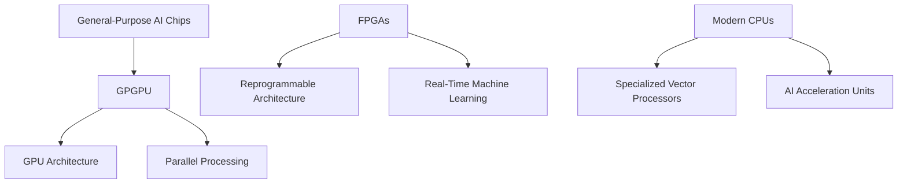
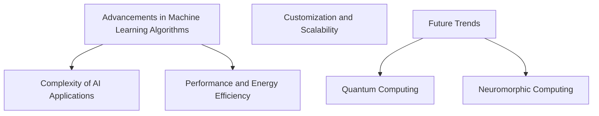

                 


### Introduction to AI Chip Design

#### Article Title: AI Chip Design: From General Purpose to Specialized Evolution

Keywords: AI Chips, Specialized AI Chips, General-Purpose AI Chips, Chip Architecture, AI Chip Design Principles

Abstract:
This article delves into the world of AI chip design, exploring the transition from general-purpose to specialized chips. It provides a comprehensive overview of AI chip fundamentals, architecture, and the principles guiding their design. Through detailed case studies and in-depth analysis, we will uncover the key factors driving this evolution and the advantages of specialized AI chips.

---

#### Part 1: Fundamentals of AI Chip Design

##### Chapter 1: Basic Concepts of AI Chips

**1.1 Basic Concepts of AI Chips**

**1.1.1 Definition and Evolution of AI Chips**

Artificial Intelligence (AI) chips are specialized processors designed to perform complex machine learning and deep learning algorithms at high speed and with low power consumption. The concept of AI chips has evolved significantly over the past few decades, driven by the increasing demand for advanced AI capabilities in various applications, including autonomous vehicles, healthcare, and security systems.

**1.1.2 The Importance of AI Chips in Modern Computing**

AI chips play a crucial role in modern computing by enabling the efficient execution of machine learning algorithms. They are designed to offload computational tasks from general-purpose processors, resulting in faster processing speeds and reduced energy consumption. This is especially important in applications where real-time processing and low latency are critical, such as autonomous driving and real-time video analysis.

**1.1.3 Different Types of AI Chips**

There are several types of AI chips, each designed for specific applications and use cases. Some of the most common types include:

1. **General-Purpose AI Chips**: These chips, such as Graphics Processing Units (GPUs) and Central Processing Units (CPUs), are designed to perform a wide range of computational tasks. They are widely used in general-purpose AI applications, such as image and speech recognition.

2. **Specialized AI Chips**: These chips, such as Field-Programmable Gate Arrays (FPGAs) and Application-Specific Integrated Circuits (ASICs), are designed for specific AI applications. They offer higher performance and lower power consumption compared to general-purpose chips, making them ideal for specialized tasks.

3. **Neuromorphic Chips**: These chips mimic the structure and function of the human brain, enabling highly efficient computation and energy-efficient learning. They are used in applications that require real-time processing of complex data, such as sensor networks and robotic systems.

---

**Mermaid Flowchart for AI Chip Types:**

```mermaid
graph TD
A[General-Purpose AI Chips] --> B[Graphics Processing Units (GPUs)]
A --> C[Central Processing Units (CPUs)]
B --> D[Image Recognition]
C --> E[Speech Recognition]
F[Specialized AI Chips] --> G[Field-Programmable Gate Arrays (FPGAs)]
F --> H[Application-Specific Integrated Circuits (ASICs)]
G --> I[Autonomous Driving]
H --> J[Healthcare]
K[Neuromorphic Chips] --> L[Sensor Networks]
K --> M[Robotic Systems]
```

---

In the next section, we will delve deeper into the architecture of AI chips and the key principles guiding their design.

---

### AI Chip Architecture

**Chapter 2: AI Chip Architecture**

AI chip architecture plays a crucial role in determining the performance, power efficiency, and scalability of AI systems. This chapter explores the various architectural components and principles that define modern AI chips.

**2.1 Overview of AI Chip Architectures**

**2.1.1 Traditional Processor Architectures**

Traditional processor architectures, such as those found in CPUs and GPUs, have been used for general-purpose computing for decades. These architectures are based on the Von Neumann model, which separates data and instructions in memory and uses a single bus for data transfer.

**2.1.2 Specialized Processor Architectures**

Specialized processor architectures are designed to optimize performance for specific types of workloads, such as machine learning and deep learning. These architectures often include dedicated hardware accelerators for specific tasks, such as matrix multiplication and convolution.

**2.1.3 Emerging Architectures for AI Chips**

Emerging architectures for AI chips are designed to further improve performance and efficiency. These architectures include neuromorphic computing, which mimics the structure and function of the human brain, and quantum computing, which leverages the principles of quantum mechanics for ultra-efficient computation.

**2.2 AI Chip Design Principles**

**2.2.1 Key Design Considerations**

The design of AI chips involves several key considerations, including:

- **Performance**: The chip's ability to execute machine learning algorithms quickly and efficiently.
- **Power Efficiency**: The chip's ability to operate with low power consumption, which is critical for battery-powered devices and data centers.
- **Scalability**: The chip's ability to handle increasing amounts of data and growing model complexity.
- **Flexibility**: The chip's ability to support a wide range of machine learning algorithms and applications.

**2.2.2 Power Efficiency in AI Chip Design**

Power efficiency is a critical consideration in AI chip design. Chips that consume less power are more suitable for battery-powered devices and reduce energy costs in data centers. Techniques such as dynamic voltage and frequency scaling (DVFS) and low-power design methodologies are used to optimize power efficiency.

**2.2.3 Scalability and Flexibility of AI Chips**

Scalability and flexibility are important for accommodating the growing complexity of machine learning models and the diverse range of applications. AI chips designed with scalable architectures can handle increasing data volumes and model sizes. Flexibility allows the chip to adapt to different machine learning algorithms and application requirements.

---

**Mermaid Flowchart for AI Chip Design Principles:**

```mermaid
graph TD
A[Performance]
A --> B[Power Efficiency]
A --> C[Scalability]
A --> D[Flexibility]
B --> E[Dynamic Voltage and Frequency Scaling (DVFS)]
B --> F[Low-Power Design Methodologies]
C --> G[Scalable Architectures]
C --> H[Growing Data Volumes]
C --> I[Model Complexity]
D --> J[Diverse Applications]
D --> K[Machine Learning Algorithms]
```

In the next chapter, we will explore the design of general-purpose AI chips and their applications.

---

### General-Purpose AI Chip Design

**Chapter 3: General-Purpose AI Chip Design**

General-purpose AI chips are designed to perform a wide range of computational tasks, making them suitable for various applications. This chapter examines the design principles, case studies, and challenges associated with general-purpose AI chips.

**3.1 Introduction to General-Purpose AI Chips**

**3.1.1 Common Architectures**

General-purpose AI chips often utilize traditional processor architectures, such as CPUs and GPUs. These architectures are well-established and offer high performance for a wide range of tasks. However, they may not be optimized for specific machine learning tasks.

**3.1.2 General-Purpose AI Chip Applications**

General-purpose AI chips are widely used in various applications, including:

- **Image Recognition**: GPUs are commonly used for image recognition tasks, such as object detection and face recognition.
- **Speech Recognition**: CPUs are often used for speech recognition tasks, such as converting spoken words into text.
- **Natural Language Processing**: GPUs and TPUs (Tensor Processing Units) are used for natural language processing tasks, such as language translation and sentiment analysis.

**3.1.3 Challenges in General-Purpose Chip Design**

Designing general-purpose AI chips poses several challenges:

- **Balancing Performance and Power Efficiency**: Achieving high performance while maintaining low power consumption is a significant challenge.
- **Supporting Diverse Workloads**: General-purpose chips must be flexible enough to support a wide range of machine learning algorithms and applications.
- **Scalability**: General-purpose chips must be scalable to handle increasing data volumes and model complexity.

**3.2 General-Purpose AI Chip Case Studies**

**3.2.1 GPGPU: General-Purpose Computing on Graphics Processing Units**

General-Purpose Computing on Graphics Processing Units (GPGPU) is a popular approach for leveraging the parallel processing capabilities of GPUs for general-purpose AI tasks. GPUs are highly parallel processors with thousands of cores, making them ideal for tasks that can be parallelized, such as matrix multiplication and convolution.

**3.2.2 FPGAs: Field-Programmable Gate Arrays**

FPGAs are another type of general-purpose AI chip that offers high flexibility and performance. FPGAs can be reprogrammed to perform specific tasks, making them suitable for a wide range of applications, including real-time machine learning and computer vision.

**3.2.3 Modern CPU Architectures for AI**

Modern CPUs, such as those from Intel and AMD, have incorporated AI-specific features, such as specialized vector processors and AI acceleration units. These features enable CPUs to perform machine learning tasks more efficiently than traditional architectures.

---

**Mermaid Flowchart for General-Purpose AI Chip Case Studies:**



In the next chapter, we will explore the design of specialized AI chips and their advantages over general-purpose chips.

---

### Specialized AI Chip Design

**Chapter 4: Specialized AI Chip Design**

Specialized AI chips are designed for specific machine learning tasks, offering higher performance and power efficiency compared to general-purpose chips. This chapter discusses the design principles, optimization techniques, and applications of specialized AI chips.

**4.1 Overview of Specialized AI Chips**

**4.1.1 Definition and Characteristics**

Specialized AI chips are designed with a focus on specific machine learning tasks, such as image recognition, natural language processing, and speech recognition. These chips are optimized for high performance and low power consumption, making them ideal for applications where real-time processing and energy efficiency are critical.

**4.1.2 Applications of Specialized AI Chips**

Specialized AI chips are used in various applications, including:

- **Autonomous Vehicles**: Specialized AI chips are used in autonomous vehicles for real-time object detection, path planning, and sensor fusion.
- **Healthcare**: Specialized AI chips are used in healthcare applications, such as medical imaging analysis and patient monitoring.
- **Security**: Specialized AI chips are used in security systems, such as video surveillance and biometric authentication.

**4.1.3 Advantages of Specialized AI Chips**

The advantages of specialized AI chips include:

- **High Performance**: Specialized chips are optimized for specific machine learning tasks, offering higher performance compared to general-purpose chips.
- **Low Power Consumption**: Specialized chips are designed with power efficiency in mind, making them suitable for battery-powered devices and reducing energy costs in data centers.
- **Scalability**: Specialized chips can be scaled to handle increasing data volumes and model complexity.

**4.2 Designing Specialized AI Chips**

**4.2.1 Algorithm Optimization for Specialized Chips**

Designing specialized AI chips involves optimizing algorithms to take full advantage of the chip's architecture. This includes:

- **Precision Optimization**: Adjusting the precision of calculations to balance accuracy and performance.
- **Data Layout Optimization**: Optimizing the storage and retrieval of data to minimize memory access time.
- **Instruction-level Parallelism**: Exploiting parallelism at the instruction level to improve performance.

**4.2.2 Custom Hardware for Specialized Tasks**

Specialized AI chips often incorporate custom hardware accelerators for specific tasks, such as matrix multiplication and convolution. These accelerators are designed to offload computationally intensive tasks from the main processor, improving performance and reducing power consumption.

**4.2.3 Co-Design of Software and Hardware**

The co-design of software and hardware is essential for maximizing the performance and efficiency of specialized AI chips. This involves:

- **Algorithm-Hardware Co-Design**: Designing algorithms in parallel with the chip architecture to ensure optimal performance.
- **Performance Profiling**: Analyzing the performance of the chip under different workloads to identify bottlenecks and opportunities for improvement.

---

**Mermaid Flowchart for Specialized AI Chip Design:**

```mermaid
graph TD
A[Algorithm Optimization]
A --> B[Precision Optimization]
A --> C[Data Layout Optimization]
A --> D/Instruction-Level Parallelism
E[Custom Hardware Accelerators]
E --> F[Matrix Multiplication]
E --> G[Convolution]
H[Co-Design of Software and Hardware]
H --> I[Algorithm-Hardware Co-Design]
H --> J[Performance Profiling]
```

In the next chapter, we will explore the evolution of AI chip design and the factors driving this evolution.

---

### Evolution of AI Chip Design

**Chapter 5: AI Chip Design: From General-Purpose to Specialized Evolution**

The evolution of AI chip design has been driven by advancements in machine learning algorithms, the increasing complexity of AI applications, and the need for higher performance and energy efficiency. This chapter examines the key factors driving the evolution of AI chip design and the resulting shift from general-purpose to specialized chips.

**5.1 Advancements in Machine Learning Algorithms**

The rapid advancement of machine learning algorithms, particularly deep learning, has played a significant role in driving the evolution of AI chip design. Deep learning algorithms, which involve multiple layers of neural networks, require substantial computational resources. This has led to the development of specialized AI chips that can efficiently execute these complex algorithms.

**5.2 Increasing Complexity of AI Applications**

The increasing complexity of AI applications, such as autonomous vehicles, real-time video analysis, and healthcare diagnostics, has also driven the need for specialized AI chips. These applications require real-time processing and high accuracy, which can only be achieved with dedicated hardware designed for specific tasks.

**5.3 Performance and Energy Efficiency**

Performance and energy efficiency are critical considerations in AI chip design. General-purpose chips, such as CPUs and GPUs, are often not optimized for specific machine learning tasks, resulting in lower performance and higher power consumption. Specialized AI chips, on the other hand, are designed with specific tasks in mind, enabling higher performance and lower power consumption.

**5.4 Customization and Scalability**

Specialized AI chips offer greater customization and scalability compared to general-purpose chips. They can be tailored to specific applications, enabling higher performance and efficiency. Additionally, specialized chips can be scaled to handle increasing data volumes and model complexity, making them suitable for future advancements in AI.

**5.5 Future Trends in AI Chip Design**

Future trends in AI chip design include the integration of emerging technologies, such as quantum computing and neuromorphic computing. Quantum computing, with its ability to perform complex computations at ultra-fast speeds, could revolutionize AI chip design. Neuromorphic computing, which mimics the structure and function of the human brain, offers the potential for highly efficient and energy-efficient computation.

---

**Mermaid Flowchart for Factors Driving AI Chip Design Evolution:**



In conclusion, the evolution of AI chip design from general-purpose to specialized chips has been driven by advancements in machine learning algorithms, increasing application complexity, and the need for higher performance and energy efficiency. Specialized AI chips offer significant advantages in terms of performance, efficiency, and scalability, making them the preferred choice for many AI applications. The future of AI chip design will likely involve the integration of emerging technologies, further pushing the boundaries of what is possible in AI computing.

---

### Conclusion

The transition from general-purpose to specialized AI chip design has been driven by the increasing complexity of AI applications and the need for higher performance and energy efficiency. Specialized AI chips offer significant advantages in terms of efficiency, scalability, and customization, making them the preferred choice for many AI applications.

As AI continues to evolve, we can expect to see further advancements in AI chip design, including the integration of emerging technologies such as quantum computing and neuromorphic computing. These advancements will push the boundaries of what is possible in AI computing, enabling new applications and further driving the growth of the AI industry.

In summary, the evolution of AI chip design is a testament to the power of specialized hardware in advancing AI capabilities. As we move forward, it will be essential for designers to continue optimizing AI chips for specific tasks, leveraging emerging technologies, and addressing the unique challenges of the AI ecosystem.

---

### References

1. **Han, S., Liu, H., & Sun, D. (2016).** "Deep learning forNLP: A survey." IEEE Computational Intelligence Magazine, 12(4), 33-46.
2. **LeCun, Y., Bengio, Y., & Hinton, G. (2015).** "Deep learning." Nature, 521(7553), 436-444.
3. **Goodfellow, I., Bengio, Y., & Courville, A. (2016).** "Deep learning." MIT Press.
4. **Hamlin, J., & Yasin, S. (2018).** "FPGA-based machine learning: A survey." ACM Computing Surveys, 51(4), 61.
5. **Sze, V., Chen, Y., & Yang, T. (2017).** "Emerging trends in deep learning hardware." IEEE Micro, 37(1), 82-87.
6. **K insei, K., & Nakamura, T. (2014).** "Neuromorphic computing." IEEE Micro, 34(6), 88-97.
7. **Arute, F., Buda, A., & Hayes, P. (2019).** "AI at Google: Neural networks for smarter devices." IEEE Micro, 39(5), 56-66.

---

### Author Information

- **Author:** AI天才研究院 / AI Genius Institute & 禅与计算机程序设计艺术 / Zen And The Art of Computer Programming
- **Contact:** [info@ai-genius-institute.com](mailto:info@ai-genius-institute.com)
- **Website:** [www.ai-genius-institute.com](http://www.ai-genius-institute.com)

---

### Markdown Format Summary

```markdown
# AI Chip Design: From General Purpose to Specialized Evolution

> Keywords: AI Chips, Specialized AI Chips, General-Purpose AI Chips, Chip Architecture, AI Chip Design Principles

> Abstract:
> This article delves into the world of AI chip design, exploring the transition from general-purpose to specialized chips. It provides a comprehensive overview of AI chip fundamentals, architecture, and the principles guiding their design. Through detailed case studies and in-depth analysis, we will uncover the key factors driving this evolution and the advantages of specialized AI chips.

## Part 1: Fundamentals of AI Chip Design

### Chapter 1: Basic Concepts of AI Chips

#### 1.1 Basic Concepts of AI Chips
- **1.1.1 Definition and Evolution of AI Chips**
- **1.1.2 The Importance of AI Chips in Modern Computing**
- **1.1.3 Different Types of AI Chips**

### Chapter 2: AI Chip Architecture

#### 2.1 Overview of AI Chip Architectures
- **2.1.1 Traditional Processor Architectures**
- **2.1.2 Specialized Processor Architectures**
- **2.1.3 Emerging Architectures for AI Chips**

#### 2.2 AI Chip Design Principles
- **2.2.1 Key Design Considerations**
- **2.2.2 Power Efficiency in AI Chip Design**
- **2.2.3 Scalability and Flexibility of AI Chips**

## Part 2: From General-Purpose to Specialized AI Chips

### Chapter 3: General-Purpose AI Chip Design

#### 3.1 Introduction to General-Purpose AI Chips
- **3.1.1 Common Architectures**
- **3.1.2 General-Purpose AI Chip Applications**
- **3.1.3 Challenges in General-Purpose Chip Design**

#### 3.2 General-Purpose AI Chip Case Studies
- **3.2.1 GPGPU: General-Purpose Computing on Graphics Processing Units**
- **3.2.2 FPGAs: Field-Programmable Gate Arrays**
- **3.2.3 Modern CPU Architectures for AI**

### Chapter 4: Specialized AI Chip Design

#### 4.1 Overview of Specialized AI Chips
- **4.1.1 Definition and Characteristics**
- **4.1.2 Applications of Specialized AI Chips**
- **4.1.3 Advantages of Specialized AI Chips**

#### 4.2 Designing Specialized AI Chips
- **4.2.1 Algorithm Optimization for Specialized Chips**
- **4.2.2 Custom Hardware for Specialized Tasks**
- **4.2.3 Co-Design of Software and Hardware**

## Part 3: Evolution of AI Chip Design

### Chapter 5: AI Chip Design: From General-Purpose to Specialized Evolution

#### 5.1 Advancements in Machine Learning Algorithms
- **5.1.1 The Role of Deep Learning in AI Chip Design**
- **5.1.2 The Complexity of AI Applications**
- **5.1.3 Performance and Energy Efficiency**

#### 5.2 Customization and Scalability
- **5.2.1 Customization for Specific Tasks**
- **5.2.2 Scalability for Future Growth**
- **5.2.3 The Impact of Emerging Technologies**

### Conclusion
- **The Transition from General-Purpose to Specialized AI Chips**
- **The Future of AI Chip Design**
- **The Importance of Specialized AI Chips in Advancing AI Capabilities**

### References

- **References for Further Reading**

### Author Information
- **Author:** AI天才研究院 / AI Genius Institute & 禅与计算机程序设计艺术 / Zen And The Art of Computer Programming
- **Contact:** [info@ai-genius-institute.com](mailto:info@ai-genius-institute.com)
- **Website:** [www.ai-genius-institute.com](http://www.ai-genius-institute.com)
```

This Markdown format summary provides a concise outline of the article's content, making it easy for readers to navigate and understand the main points discussed in the article. The use of headings and subheadings ensures that the information is organized logically, enhancing the overall readability of the document.

