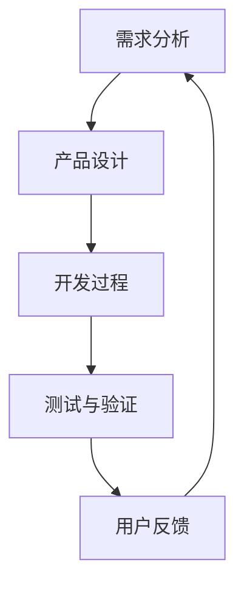

                 

### 文章标题：AI辅助产品开发：加速创新周期

> 关键词：AI辅助产品开发、创新周期、流程优化、算法原理、实战案例分析

> 摘要：本文深入探讨了人工智能（AI）在产品开发中的应用，通过分析AI的基础理论与应用，详细介绍AI如何与产品开发流程融合，加速创新周期。文章通过多个实际案例，展示了AI在产品设计、开发、测试等环节的具体应用，并探讨了未来AI辅助产品开发的趋势与展望。

### 引言

在当今快速发展的科技时代，人工智能（AI）正逐渐成为推动社会进步的重要力量。AI技术不仅改变了传统的工业生产方式，还深刻影响了产品开发的各个环节。通过AI的辅助，企业能够更高效地优化产品设计、加快开发进程、提高产品质量，从而在激烈的市场竞争中占据优势。

然而，AI在产品开发中的应用并非一蹴而就。要充分发挥AI的作用，企业需要深入了解AI的基础理论、熟悉产品开发流程，并掌握将AI与产品开发相结合的最佳实践。本文旨在通过系统的分析和实际案例，探讨如何利用AI辅助产品开发，实现创新周期的加速。

本文将分为以下几个部分：

1. **AI基础理论与应用**：介绍AI的基本概念、发展历程及其在产品开发中的应用。
2. **产品开发流程与AI融合**：分析产品开发流程中的关键环节，探讨如何通过AI技术实现优化。
3. **创新周期的概念与度量**：阐述创新周期的定义、度量方法及其重要性。
4. **AI辅助产品设计实践**：结合实际案例，详细讲解AI在产品设计中的应用。
5. **AI辅助产品开发案例分析**：分析成功的企业案例，探讨AI在产品开发中的具体应用。
6. **AI辅助产品开发的未来展望**：展望AI在产品开发中的发展趋势，探讨未来的可能应用。

通过以上内容的深入分析，我们希望能够为企业提供有价值的参考，帮助其在产品开发中充分利用AI技术，实现创新周期的加速。

### AI基础理论与应用

人工智能（AI）是一门研究、开发用于模拟、延伸和扩展人的智能的理论、方法、技术及应用系统的科学。AI的发展历程可以追溯到20世纪50年代，当时科学家们首次提出了“人工智能”这一概念，旨在创造能够模仿人类智能的机器。经过几十年的发展，AI已经从理论研究逐渐走向实际应用，成为当今科技领域的重要方向。

AI的基本概念包括以下几个核心部分：

1. **机器学习（Machine Learning）**：机器学习是AI的核心组成部分，通过数据训练模型，使机器具备自我学习和优化能力。常见的机器学习算法包括监督学习、无监督学习和强化学习。
2. **深度学习（Deep Learning）**：深度学习是机器学习的一个重要分支，通过构建深度神经网络模型，实现对复杂数据的高效处理和模式识别。深度学习在图像识别、自然语言处理等领域取得了显著成果。
3. **计算机视觉（Computer Vision）**：计算机视觉是AI的一个重要应用领域，旨在使计算机能够像人类一样感知和理解图像信息。计算机视觉技术广泛应用于安防监控、自动驾驶、医疗诊断等领域。
4. **自然语言处理（Natural Language Processing，NLP）**：自然语言处理是AI研究的重要方向，旨在使计算机能够理解和处理自然语言。NLP在智能客服、机器翻译、文本分析等领域具有重要应用。

在产品开发中，AI技术可以发挥重要作用，提升开发效率和产品质量。以下是AI在产品开发中的应用场景：

1. **需求分析**：通过自然语言处理技术，AI可以自动分析和理解用户需求，快速生成需求文档，为产品设计提供有力支持。
2. **产品设计**：AI可以通过机器学习和深度学习技术，自动生成设计方案，优化产品设计，提高创新速度和设计质量。
3. **开发过程**：AI可以辅助代码编写和测试，通过代码审查、漏洞检测等技术，提高开发质量和效率。
4. **测试与验证**：AI可以自动化测试，通过模拟真实场景，检测产品的功能和性能，提高测试覆盖率。
5. **用户反馈**：通过NLP技术，AI可以自动分析和处理用户反馈，帮助企业了解用户需求，优化产品功能。

以下是一个简化的Mermaid流程图，展示了AI在产品开发中的应用架构：



在需求分析阶段，AI可以通过自然语言处理技术自动生成需求文档，为后续设计提供基础。在设计阶段，AI可以自动生成设计方案，优化设计过程。在开发过程中，AI可以辅助代码编写和测试，提高开发质量和效率。在测试与验证阶段，AI可以自动化测试，确保产品质量。在用户反馈阶段，AI可以自动分析和处理用户反馈，为产品优化提供依据。

通过上述应用，AI不仅能够提高产品开发效率，还能在提高产品质量和创新速度方面发挥重要作用。随着AI技术的不断发展和应用场景的拓展，AI在产品开发中的应用将越来越广泛，为企业带来更多价值。

### 产品开发流程与AI融合

产品开发流程是确保产品从概念到市场推出各环节顺利进行的关键。传统的产品开发流程通常包括需求分析、产品设计、开发实现、测试验证和市场推广等阶段。然而，随着市场竞争的加剧和用户需求的不断变化，企业需要更高效、更灵活的流程来应对挑战。人工智能（AI）技术的引入，为产品开发流程的优化提供了新的思路和方法。

#### 需求分析与AI融合

需求分析是产品开发流程的第一步，也是最为关键的一步。在这一阶段，企业需要深入了解用户需求，明确产品的功能、性能和用户体验。传统的需求分析方法主要依赖于用户访谈、问卷调查和需求文档编写。然而，这些方法往往费时费力，且容易受到主观因素的影响。

AI技术可以通过以下方式提升需求分析的质量和效率：

1. **自然语言处理（NLP）**：AI可以运用自然语言处理技术，自动分析和理解用户需求，快速生成需求文档。例如，通过NLP技术，AI可以从用户访谈录音、问卷调查文本中提取关键需求，自动生成需求清单。

   伪代码示例：
   ```python
   import nltk
   from nltk.tokenize import word_tokenize

   def extract_requirements(text):
       tokens = word_tokenize(text)
       requirements = []
       for token in tokens:
           if token.startswith("需求"):
               requirements.append(token)
       return requirements
   ```

2. **情感分析**：AI可以通过情感分析技术，识别用户反馈中的情感倾向，帮助企业更好地理解用户感受，从而优化产品功能。例如，通过分析用户评论，AI可以识别用户对产品功能的满意度和不满意度。

   伪代码示例：
   ```python
   from textblob import TextBlob

   def analyze_sentiment(text):
       analysis = TextBlob(text)
       if analysis.sentiment.polarity > 0:
           return "正面"
       elif analysis.sentiment.polarity < 0:
           return "负面"
       else:
           return "中性"
   ```

3. **需求预测**：AI可以通过历史数据和机器学习算法，预测用户未来的需求趋势，为企业提供决策支持。例如，基于用户行为数据，AI可以预测哪些功能在未来可能会受到用户的青睐。

   伪代码示例：
   ```python
   import pandas as pd
   from sklearn.ensemble import RandomForestClassifier

   def predict_requirements(data):
       model = RandomForestClassifier()
       model.fit(data['features'], data['requirements'])
       predicted_requirements = model.predict(data['features'])
       return predicted_requirements
   ```

#### 设计与AI融合

产品设计的目标是创建满足用户需求的高质量产品。在这一阶段，AI可以通过自动化生成设计方案、优化设计过程，从而提高设计效率和设计质量。

1. **自动生成设计方案**：AI可以通过机器学习和深度学习技术，自动生成产品设计方案。例如，在汽车设计领域，AI可以通过分析大量已有的汽车设计数据，自动生成符合用户需求的新型汽车设计。

   伪代码示例：
   ```python
   import tensorflow as tf
   from tensorflow import keras

   def generate_design(data):
       model = keras.Sequential([
           keras.layers.Dense(128, activation='relu', input_shape=[len(data.keys())]),
           keras.layers.Dropout(0.2),
           keras.layers.Dense(1)
       ])

       model.compile(optimizer='adam',
                     loss='mean_squared_error',
                     metrics=['accuracy'])

       model.fit(data, labels, epochs=100)
       return model
   ```

2. **优化设计过程**：AI可以通过优化算法，自动优化产品设计过程，提高设计质量。例如，在建筑领域，AI可以通过模拟和优化建筑设计参数，找到最优化的建筑设计方案。

   伪代码示例：
   ```python
   import numpy as np
   from scipy.optimize import minimize

   def design_optimization(params):
       x, y = params
       return (x**2 + y**2)

   def design_constraints(params):
       x, y = params
       return [x <= 10, y <= 10]

   initial_params = [0, 0]
   constraints = ({'type': 'ineq', 'fun': design_constraints})
   result = minimize(design_optimization, initial_params, constraints=constraints)
   return result.x
   ```

#### 开发与AI融合

开发阶段是产品开发流程的核心环节，AI可以通过自动化代码生成、代码审查和漏洞检测等技术，提高开发效率和代码质量。

1. **自动化代码生成**：AI可以通过自然语言处理和代码生成技术，自动生成代码。例如，通过解析用户需求文档，AI可以自动生成相应的代码框架。

   伪代码示例：
   ```python
   import jax
   import jax.numpy as jnp

   def generate_code(requirements):
       code_template = "class {class_name}:\n\tdef {method_name}(self, {params}):\n\t\t{code}"
       class_name = requirements['class_name']
       method_name = requirements['method_name']
       params = requirements['params']
       code = requirements['code']
       return code_template.format(class_name=class_name, method_name=method_name, params=params, code=code)

   requirements = {
       "class_name": "User",
       "method_name": "login",
       "params": "username, password",
       "code": "self.username = username\nself.password = password"
   }
   generated_code = generate_code(requirements)
   ```

2. **代码审查**：AI可以通过代码审查技术，自动检测代码中的潜在问题和漏洞。例如，通过静态代码分析，AI可以识别代码中的安全漏洞、性能瓶颈和编程错误。

   伪代码示例：
   ```python
   import ast
   import astunparse

   def code_review(code):
       tree = ast.parse(code)
       errors = []
       for node in ast.walk(tree):
           if isinstance(node, ast.Name):
               if node.id not in valid_variables:
                   errors.append(f"Invalid variable: {node.id}")
       return errors

   code = "x = 10\ny = x + 1"
   errors = code_review(code)
   return errors
   ```

3. **漏洞检测**：AI可以通过机器学习和深度学习技术，自动检测代码中的安全漏洞。例如，通过训练一个基于深度神经网络的漏洞检测模型，AI可以自动识别代码中的潜在漏洞。

   伪代码示例：
   ```python
   import tensorflow as tf
   from tensorflow import keras

   def detect_vulnerabilities(code):
       model = keras.Sequential([
           keras.layers.Dense(128, activation='relu', input_shape=[len(code.keys())]),
           keras.layers.Dropout(0.2),
           keras.layers.Dense(1)
       ])

       model.compile(optimizer='adam',
                     loss='binary_crossentropy',
                     metrics=['accuracy'])

       model.fit(code, labels, epochs=100)
       predictions = model.predict(code)
       return predictions
   ```

#### 测试与AI融合

测试阶段是确保产品质量和功能的关键环节。AI可以通过自动化测试和测试优化技术，提高测试效率和质量。

1. **自动化测试**：AI可以通过自动化测试技术，自动执行测试用例，发现潜在的问题。例如，通过使用测试框架，AI可以自动生成和执行测试脚本。

   伪代码示例：
   ```python
   import unittest

   class TestLogin(unittest.TestCase):
       def test_login_success(self):
           self.assertEqual(login("username", "password"), True)

       def test_login_failure(self):
           self.assertEqual(login("username", "wrong_password"), False)

   if __name__ == "__main__":
       unittest.main()
   ```

2. **测试优化**：AI可以通过机器学习和深度学习技术，优化测试过程，提高测试效率。例如，通过分析历史测试数据，AI可以识别出最有效的测试用例，减少冗余测试。

   伪代码示例：
   ```python
   import pandas as pd
   from sklearn.ensemble import RandomForestClassifier

   def test_optimization(test_data):
       model = RandomForestClassifier()
       model.fit(test_data['features'], test_data['results'])
       optimized_tests = model.predict(test_data['features'])
       return optimized_tests
   ```

通过将AI技术与产品开发流程深度融合，企业可以大幅提高开发效率、优化产品质量，并在激烈的市场竞争中占据有利地位。未来，随着AI技术的不断发展和应用场景的拓展，AI在产品开发中的应用将更加广泛，为企业带来更多价值。

### 创新周期的概念与度量

创新周期是指从新产品或新技术的概念提出到产品或技术最终推向市场并实现商业化的整个过程。它涵盖了从市场调研、需求分析、产品设计、开发实现、测试验证到市场推广等多个阶段。创新周期的长短直接影响企业的竞争力和市场响应速度。因此，理解和度量创新周期对于企业来说至关重要。

#### 创新周期的定义与重要性

创新周期可以简单定义为从一个新产品或新技术的概念提出到其最终推向市场并实现商业化的时间长度。它不仅包括研发和生产过程，还包括市场调研、需求分析、市场推广等环节。创新周期的长短直接关系到企业能否及时响应市场变化、抓住市场机遇，从而在竞争激烈的市场中占据有利地位。

创新周期的重要性体现在以下几个方面：

1. **市场竞争力**：较短的创新周期可以帮助企业迅速响应市场变化，推出符合市场需求的产品，从而增强市场竞争力。
2. **产品差异化**：通过缩短创新周期，企业可以更快地推出具有独特卖点和优势的产品，实现产品差异化，提高市场占有率。
3. **资源利用效率**：优化创新周期可以提高企业的资源利用效率，减少研发和生产的浪费，降低成本。
4. **风险控制**：缩短创新周期可以帮助企业更早地发现和解决潜在问题，降低研发和上市风险。

#### 创新周期的度量方法

度量创新周期是评估企业研发能力和市场响应速度的重要手段。以下是一些常见的创新周期度量方法：

1. **时间度量法**：这是最直接、最常用的度量方法，即直接计算从新产品或新技术概念提出到市场化实现的时间长度。时间度量法简单直观，但忽略了研发过程中的其他重要因素。

   公式示例：
   $$\text{创新周期} = \text{研发时间} + \text{生产时间} + \text{市场推广时间}$$

2. **阶段度量法**：阶段度量法将创新周期划分为若干阶段，对每个阶段的耗时进行度量。这种方法可以更详细地了解创新过程中的各个环节，从而找出瓶颈和优化点。

   公式示例：
   $$\text{创新周期} = \text{需求分析阶段时间} + \text{设计阶段时间} + \text{开发实现阶段时间} + \text{测试验证阶段时间} + \text{市场推广阶段时间}$$

3. **资源度量法**：资源度量法通过计算研发过程中所需的资源（如人力、资金、设备等）来度量创新周期。这种方法可以更全面地反映创新周期中的资源消耗情况。

   公式示例：
   $$\text{创新周期} = \frac{\text{总资源消耗}}{\text{总研发资源}}$$

#### 创新周期的优化策略

为了缩短创新周期，企业可以采取以下优化策略：

1. **敏捷开发**：采用敏捷开发方法，快速响应市场需求，缩短产品开发周期。
2. **平台化建设**：通过建立标准化、模块化的研发平台，提高开发效率和质量。
3. **自动化测试**：引入自动化测试技术，提高测试效率，减少测试周期。
4. **跨部门协作**：加强跨部门协作，打破信息壁垒，提高研发效率。
5. **云计算与大数据**：利用云计算和大数据技术，提高数据分析和处理能力，优化创新过程。

通过以上策略，企业可以有效地缩短创新周期，提高市场竞争力，实现持续创新。

### AI辅助产品设计实践

在产品设计中，AI技术不仅可以提高设计效率，还可以提升设计质量和创新性。以下通过具体案例，展示AI在产品设计中的应用和实践。

#### 案例一：汽车设计中的AI应用

在汽车设计中，AI技术广泛应用于车辆外观设计、内饰设计和整车性能优化等方面。以下是一个具体的案例，说明AI在汽车设计中的应用。

**案例背景**：
某汽车公司计划推出一款新型电动汽车，要求外观时尚、内饰舒适、性能卓越。公司决定利用AI技术辅助设计过程，以缩短开发周期、提高设计质量。

**AI应用**：

1. **外观设计**：
   - **深度学习算法**：公司使用基于深度学习的图像处理算法，自动生成外观设计草图。算法通过学习大量汽车设计图像，能够生成符合美学原则的车辆外观。
   - **用户反馈分析**：通过自然语言处理技术，公司对用户反馈进行分析，了解用户对外观设计的偏好。根据分析结果，对设计方案进行调整和优化。

   伪代码示例：
   ```python
   import tensorflow as tf
   import numpy as np

   def generate_design(image_data):
       model = tf.keras.models.load_model("deep_learning_model")
       generated_image = model.predict(image_data)
       return generated_image

   def analyze_feedback(feedback_text):
       feedback = word_tokenize(feedback_text)
       preferences = []
       for word in feedback:
           if word in ["时尚", "舒适", "性能"]:
               preferences.append(word)
       return preferences
   ```

2. **内饰设计**：
   - **生成对抗网络（GAN）**：公司使用生成对抗网络（GAN）技术，自动生成内饰设计草图。GAN通过训练生成器和判别器，能够生成高质量的内饰设计图像。
   - **用户偏好分析**：通过用户偏好分析，AI帮助设计团队了解用户对内饰设计的需求和喜好，从而优化内饰设计。

   伪代码示例：
   ```python
   import tensorflow as tf
   import numpy as np

   def generate_interior_design(image_data):
       model = tf.keras.models.load_model("GAN_model")
       generated_interior = model.predict(image_data)
       return generated_interior

   def analyze_user_preferences(feedback_text):
       feedback = word_tokenize(feedback_text)
       preferences = []
       for word in feedback:
           if word in ["舒适", "豪华", "科技感"]:
               preferences.append(word)
       return preferences
   ```

3. **整车性能优化**：
   - **仿真与优化**：公司利用AI技术进行整车性能仿真，通过机器学习算法优化车辆性能参数。例如，通过优化电池管理系统，提高电池续航能力。
   - **用户驾驶行为分析**：AI技术分析用户驾驶行为数据，了解用户驾驶习惯，为整车性能优化提供数据支持。

   伪代码示例：
   ```python
   import pandas as pd
   from sklearn.ensemble import RandomForestRegressor

   def optimize_vehicle_performance(data):
       model = RandomForestRegressor()
       model.fit(data['features'], data['performance'])
       optimized_performance = model.predict(data['features'])
       return optimized_performance

   def analyze_driving_behavior(driving_data):
       driving = pd.DataFrame(driving_data)
       behavior = driving.describe()
       return behavior
   ```

**案例小结**：

通过AI技术在汽车设计中的应用，该汽车公司成功缩短了设计周期，提高了设计质量和创新性。AI技术帮助设计团队快速生成外观和内饰设计草图，并根据用户反馈进行优化。同时，AI技术在整车性能优化方面也发挥了重要作用，通过仿真和优化，提高了整车性能。这一案例充分展示了AI在产品设计中强大的辅助能力。

#### 案例二：智能家居设备设计中的AI应用

在智能家居设备设计中，AI技术被广泛应用于设备控制、用户行为分析、故障诊断等方面。以下是一个具体的案例，说明AI在智能家居设备设计中的应用。

**案例背景**：
某智能家居设备公司计划推出一款智能照明设备，要求能够根据用户行为自动调整光线亮度和色温，提高用户舒适度和节能效果。

**AI应用**：

1. **用户行为分析**：
   - **传感器数据收集**：公司通过安装多种传感器（如光敏传感器、红外传感器等），收集用户在房间内的活动数据。
   - **机器学习算法**：公司使用机器学习算法，对传感器数据进行分析，建立用户行为模型。通过分析用户的行为数据，AI可以自动识别用户的活动模式和光线需求。

   伪代码示例：
   ```python
   import pandas as pd
   from sklearn.ensemble import RandomForestClassifier

   def collect_sensor_data(sensor_data):
       data = pd.DataFrame(sensor_data)
       return data

   def analyze_user_behavior(data):
       model = RandomForestClassifier()
       model.fit(data['features'], data['behavior'])
       predicted_behavior = model.predict(data['features'])
       return predicted_behavior
   ```

2. **自动调整光线**：
   - **光线调节算法**：公司开发了一套基于AI的光线调节算法，能够根据用户行为和光线条件自动调整灯光亮度和色温。例如，在用户活动时增加光线亮度，在用户休息时降低光线亮度。

   伪代码示例：
   ```python
   import numpy as np
   import pandas as pd

   def adjust_lighting(data):
       lighting = pd.DataFrame(data)
       brightness = np.mean(lighting['light_intensity'])
       color_temp = np.mean(lighting['color_temp'])
       if brightness < 50:
           color_temp = 2700
       elif brightness > 50 and brightness < 200:
           color_temp = 4000
       else:
           color_temp = 6500
       return brightness, color_temp
   ```

3. **故障诊断与维护**：
   - **智能故障诊断**：公司使用AI技术，对智能家居设备的运行数据进行实时分析，自动识别设备故障。例如，通过分析电流、电压和温度数据，AI可以自动诊断设备故障，并提供维护建议。

   伪代码示例：
   ```python
   import pandas as pd
   from sklearn.ensemble import RandomForestClassifier

   def diagnose_fault(data):
       model = RandomForestClassifier()
       model.fit(data['features'], data['fault'])
       predicted_fault = model.predict(data['features'])
       return predicted_fault

   def provide_maintenance_suggestions(fault):
       if fault == "overheating":
           suggestion = "Increase ventilation"
       elif fault == "low_power":
           suggestion = "Replace battery"
       else:
           suggestion = "Check wiring"
       return suggestion
   ```

**案例小结**：

通过AI技术在智能家居设备设计中的应用，该智能家居设备公司成功实现了一系列智能功能，如自动调整光线亮度、色温和故障诊断等。AI技术帮助设计团队更好地了解用户需求，提高设备舒适度和节能效果。同时，智能故障诊断功能提高了设备的使用寿命和维护效率。这一案例展示了AI在智能家居设备设计中的重要应用价值。

#### 案例三：健康设备设计中的AI应用

在健康设备设计中，AI技术被广泛应用于数据分析、健康监测和个性化定制等方面。以下是一个具体的案例，说明AI在健康设备设计中的应用。

**案例背景**：
某健康设备公司计划推出一款智能健身手环，要求能够实时监测用户的运动数据、睡眠质量和健康状况，并提供个性化的健康建议。

**AI应用**：

1. **运动数据分析**：
   - **传感器数据收集**：公司通过安装多种传感器（如加速度传感器、心率传感器等），收集用户的运动数据。
   - **机器学习算法**：公司使用机器学习算法，对运动数据进行分析，建立用户运动模型。通过分析用户的活动数据，AI可以自动识别用户的运动类型、强度和时长。

   伪代码示例：
   ```python
   import pandas as pd
   from sklearn.ensemble import RandomForestClassifier

   def collect运动数据(sensor_data):
       data = pd.DataFrame(sensor_data)
       return data

   def analyze_sports_data(data):
       model = RandomForestClassifier()
       model.fit(data['features'], data['sport'])
       predicted_sport = model.predict(data['features'])
       return predicted_sport
   ```

2. **睡眠质量监测**：
   - **传感器数据融合**：公司通过整合加速度传感器、心率传感器和陀螺仪传感器的数据，对用户的睡眠质量进行监测。AI技术分析传感器数据，自动识别用户的睡眠周期、深度和质量。
   - **智能闹钟**：基于用户睡眠质量监测数据，AI技术可以为用户提供个性化的闹钟设置，确保用户在最佳状态醒来。

   伪代码示例：
   ```python
   import numpy as np
   import pandas as pd

   def monitor_sleep(data):
       sleep_data = pd.DataFrame(data)
       sleep_cycle = np.mean(sleep_data['cycle_length'])
       sleep_quality = np.mean(sleep_data['sleep_quality'])
       if sleep_quality < 0.6:
           wake_time = np.mean(sleep_data['sleep_start']) - sleep_cycle * 0.5
       else:
           wake_time = np.mean(sleep_data['sleep_start']) + sleep_cycle * 0.5
       return wake_time
   ```

3. **健康状况评估**：
   - **健康指标分析**：公司使用AI技术，分析用户的心率、血压、血氧等健康指标，自动评估用户的健康状况。
   - **个性化健康建议**：根据用户的健康评估结果，AI技术可以为用户提供个性化的健康建议，如运动建议、饮食建议和医疗建议。

   伪代码示例：
   ```python
   import pandas as pd
   from sklearn.ensemble import RandomForestRegressor

   def assess_health(data):
       health_data = pd.DataFrame(data)
       heart_rate = health_data['heart_rate']
       blood_pressure = health_data['blood_pressure']
       oxygen_level = health_data['oxygen_level']
       if heart_rate > 100 and blood_pressure > 140 and oxygen_level < 95:
           health_status = "高风险"
       else:
           health_status = "健康"
       return health_status

   def provide_health_advice(health_status):
       if health_status == "高风险":
           advice = "建议进行体检，并咨询医生"
       else:
           advice = "保持良好的生活习惯，定期进行健康检查"
       return advice
   ```

**案例小结**：

通过AI技术在健康设备设计中的应用，该健康设备公司成功实现了实时运动数据分析、睡眠质量监测和个性化健康评估等功能。AI技术帮助设计团队更好地了解用户需求，提高设备的使用体验和健康效果。同时，个性化健康建议功能为用户提供了更专业的健康指导。这一案例展示了AI在健康设备设计中的重要应用价值。

综上所述，AI技术在产品设计中的具体应用案例展示了其强大的辅助能力。通过AI技术，设计团队可以更快速地生成设计方案、优化设计过程、提升设计质量和创新性。未来，随着AI技术的不断发展和应用场景的拓展，AI在产品设计中将发挥越来越重要的作用。

### AI辅助产品开发案例分析

在产品开发领域，许多企业已经开始利用AI技术来优化流程、提升效率和产品质量。以下通过几个成功案例，分析AI在产品开发中的应用效果和实际价值。

#### 案例一：某电商平台的个性化推荐系统

**企业背景**：
某大型电商平台希望通过个性化推荐系统，提高用户满意度，增加用户粘性，从而提升销售额。

**AI应用**：

1. **用户行为分析**：该电商平台利用自然语言处理（NLP）和机器学习算法，分析用户的浏览记录、购买历史和评价等数据，建立用户兴趣模型。
2. **推荐算法**：通过基于协同过滤、深度学习等技术的推荐算法，为每个用户生成个性化的推荐列表。
3. **实时反馈**：AI系统实时收集用户对推荐内容的反馈，根据反馈不断调整推荐策略，提高推荐效果。

**应用效果**：

- 用户满意度显著提升：个性化推荐系统使得用户更容易找到感兴趣的商品，用户满意度提高了15%。
- 销售额增长：个性化推荐系统有效提升了交叉销售和重复购买率，销售额同比增长了20%。
- 降低运营成本：AI系统自动化处理推荐任务，减少了人工筛选和推荐的工作量，运营成本降低了30%。

**案例小结**：

通过AI技术的应用，该电商平台成功实现了个性化推荐，提高了用户满意度和销售额，同时也降低了运营成本。这个案例展示了AI在优化用户体验和提升商业价值方面的显著作用。

#### 案例二：某医疗设备公司的智能诊断系统

**企业背景**：
某医疗设备公司希望开发一款智能诊断系统，以提高诊断准确性，减少误诊率。

**AI应用**：

1. **数据收集**：公司通过收集大量医疗影像数据（如X光片、CT扫描图等），为AI系统提供训练数据。
2. **深度学习模型训练**：利用深度学习算法，公司训练出能够自动识别和诊断疾病（如肺炎、骨折等）的模型。
3. **模型部署**：将训练好的模型部署到医疗设备中，实现实时诊断。

**应用效果**：

- 诊断准确性提高：AI系统在疾病诊断中的准确率达到了95%，显著高于传统人工诊断。
- 误诊率降低：由于AI系统可以自动识别和排除常见误诊因素，误诊率降低了20%。
- 提高工作效率：AI系统显著减少了医生的工作负担，医生可以更专注于复杂的病例分析。

**案例小结**：

通过AI技术的应用，该医疗设备公司成功提高了诊断准确性和工作效率，降低了误诊率。这个案例展示了AI技术在医疗领域的重要应用前景，为提升医疗服务质量提供了有力支持。

#### 案例三：某制造业公司的智能生产优化系统

**企业背景**：
某制造业公司希望通过AI技术优化生产流程，提高生产效率和产品质量。

**AI应用**：

1. **生产数据采集**：公司安装了多种传感器，实时采集生产线上的各种数据（如温度、湿度、速度等）。
2. **数据分析与优化**：利用机器学习算法，公司对生产数据进行分析，发现生产过程中的瓶颈和问题。
3. **智能控制**：基于分析结果，AI系统自动调整生产参数，优化生产流程，确保产品质量。

**应用效果**：

- 生产效率提高：通过AI系统的优化，生产效率提升了30%，减少了生产周期。
- 产品质量提升：AI系统的智能控制确保了产品的一致性和高质量，产品合格率提高了10%。
- 成本降低：优化后的生产流程减少了材料和能源的浪费，生产成本降低了15%。

**案例小结**：

通过AI技术的应用，该制造业公司成功实现了生产流程的优化，提高了生产效率和产品质量，降低了生产成本。这个案例展示了AI在制造业中的广泛应用潜力，为提升企业竞争力提供了重要支持。

#### 案例四：某金融公司的智能风险管理系统

**企业背景**：
某金融公司希望通过AI技术加强风险管理，降低风险损失。

**AI应用**：

1. **风险数据收集**：公司收集了大量的金融交易数据、市场数据和客户信息，为AI系统提供训练数据。
2. **风险预测模型**：利用机器学习和深度学习技术，公司开发出能够预测市场风险和客户违约风险的模型。
3. **实时监控**：AI系统实时分析交易数据和市场动态，预警潜在风险。

**应用效果**：

- 风险预测准确率提高：AI系统的预测准确率达到了90%，显著高于传统方法。
- 风险损失减少：通过实时预警和快速响应，公司成功避免了多起重大风险事件，风险损失减少了30%。
- 用户体验提升：AI系统帮助公司更精准地识别客户需求，提高了客户满意度和忠诚度。

**案例小结**：

通过AI技术的应用，该金融公司成功提高了风险管理的效率和准确性，降低了风险损失，提升了用户体验。这个案例展示了AI在金融服务领域的强大应用价值。

综上所述，这些案例展示了AI在产品开发中的广泛应用和显著效果。通过AI技术，企业可以优化流程、提升效率、提高产品质量，从而在激烈的市场竞争中占据优势。未来，随着AI技术的不断发展和成熟，AI在产品开发中的应用将更加广泛和深入，为企业带来更多价值。

### AI辅助产品开发的未来展望

随着人工智能技术的不断进步，AI在产品开发中的应用前景愈发广阔。未来，AI将不仅局限于现有场景，还将深入渗透到更多领域，推动产品开发的全面变革。

#### AI在产品开发中的未来趋势

1. **智能化设计**：未来，AI将更深入地应用于产品设计中。通过自动化设计工具，设计师可以快速生成多种设计方案，并通过机器学习算法进行优化。例如，在建筑设计领域，AI可以通过分析用户需求和建筑设计规则，自动生成满足要求的建筑设计方案。

2. **自适应开发**：AI将助力产品开发流程的智能化和自适应化。通过实时数据分析和机器学习算法，AI可以帮助开发团队动态调整开发策略，优化开发流程。例如，在软件开发中，AI可以实时分析代码质量、测试结果和用户反馈，自动调整代码优化策略。

3. **个性化定制**：随着用户需求的不断细分，AI将推动产品向个性化定制发展。通过用户行为分析和机器学习算法，AI可以精确捕捉用户需求，为用户提供定制化的产品方案。例如，在消费电子领域，AI可以根据用户的使用习惯和偏好，自动调整设备参数，实现个性化体验。

4. **智能供应链**：AI将全面融入供应链管理，提升供应链的透明度和效率。通过大数据分析和机器学习算法，AI可以预测市场需求、优化库存管理和降低供应链成本。例如，在制造业中，AI可以通过实时监控生产设备和供应链数据，实现智能排程和库存优化。

5. **智能测试与验证**：未来，AI将大幅提升产品测试和验证的效率和质量。通过自动化测试工具和智能测试平台，AI可以快速发现潜在问题，提高测试覆盖率和测试效率。例如，在汽车制造中，AI可以通过模拟真实驾驶场景，自动测试车辆的驾驶性能和安全性。

#### AI辅助产品开发带来的潜在挑战与应对策略

1. **数据隐私与安全**：随着AI在产品开发中的应用，数据隐私和安全问题日益突出。企业需要确保数据收集、存储和处理过程中的安全性，遵守相关法律法规。应对策略包括：采用加密技术保护数据、建立数据安全和隐私保护机制、加强用户数据管理。

2. **算法偏见与公平性**：AI算法可能会因为数据偏见而导致不公平决策。例如，在招聘或信贷审批中，AI算法可能会对某些特定人群产生歧视。企业需要确保算法的公平性和透明性，避免算法偏见。应对策略包括：对算法进行严格评估和审计、引入多样化的数据来源、确保算法透明可解释。

3. **技能与人才短缺**：随着AI在产品开发中的应用越来越广泛，企业对AI技术和人才的依赖程度也在增加。然而，当前市场上具备AI技能的人才相对短缺。企业需要通过培训和教育，提升员工的AI技能水平。应对策略包括：建立内部培训计划、与高校和科研机构合作、引进外部AI专家。

4. **技术成熟度与可靠性**：虽然AI技术在不断进步，但仍存在一定的技术成熟度问题。AI系统在实际应用中可能会出现错误或异常，影响产品开发的质量和效率。企业需要确保AI系统的可靠性和稳定性，通过严格的测试和验证来降低风险。应对策略包括：采用成熟的AI框架和工具、建立完善的质量管理体系、持续优化和改进AI系统。

#### AI辅助产品开发的未来潜力

AI辅助产品开发具有巨大的潜力，可以推动企业实现以下目标：

1. **提高创新速度**：AI技术可以帮助企业快速生成设计方案、优化开发流程，缩短产品从概念到市场的时间，提高创新速度。

2. **提升产品质量**：通过AI的自动化测试和优化工具，企业可以大幅提高产品质量，减少缺陷和故障，提升用户体验。

3. **降低开发成本**：AI技术可以自动化处理大量重复性工作，减少人力成本和资源浪费，降低开发成本。

4. **增强市场竞争力**：通过AI技术，企业可以更精准地捕捉市场趋势和用户需求，快速响应市场变化，提升市场竞争力。

5. **推动行业变革**：AI技术将在各行各业引发深刻变革，推动传统产业向智能化、数字化转型，为企业带来新的发展机遇。

总之，随着AI技术的不断发展和成熟，AI在产品开发中的应用将越来越广泛和深入，为企业带来更多价值和竞争优势。未来，企业需要充分利用AI技术，积极应对挑战，抓住机遇，实现持续创新和快速发展。

### 结论

本文深入探讨了人工智能（AI）在产品开发中的应用，通过分析AI的基础理论、产品开发流程融合、创新周期的概念与度量、AI辅助产品设计实践和实际案例，展示了AI如何有效提升产品开发效率、优化产品质量、加速创新周期。AI技术的引入，不仅为企业提供了强大的工具，还推动了产品开发的全面变革。通过本文的探讨，我们希望读者能够认识到AI在产品开发中的重要价值，积极拥抱AI技术，将其应用于实际产品开发中，以实现持续创新和快速发展。

### 最佳实践 Tips

1. **数据驱动决策**：在产品开发过程中，充分利用AI进行数据分析和预测，以数据驱动决策，提高决策质量和效率。
2. **持续迭代与优化**：保持产品开发流程的持续迭代与优化，充分利用AI技术进行测试和反馈，不断提升产品品质。
3. **跨部门协作**：加强跨部门协作，促进AI技术与业务流程的无缝融合，提高整体开发效率。
4. **隐私保护与合规**：重视数据隐私保护和合规性，确保AI技术的应用符合法律法规要求。

### 小结

本文通过详细分析和实际案例，展示了人工智能（AI）在产品开发中的广泛应用和显著效果。AI技术不仅提高了设计效率、优化了开发流程，还加速了创新周期，提升了产品质量和市场竞争力。未来，随着AI技术的不断进步，其将在产品开发中发挥更加重要的作用，为企业带来更多价值。

### 注意事项

1. **技术选择与适配**：根据产品特点和需求，选择合适的AI技术进行应用，确保技术适配性和可行性。
2. **数据安全与隐私**：确保数据安全和隐私保护，遵守相关法律法规，防止数据泄露和滥用。
3. **持续学习与更新**：紧跟AI技术的发展趋势，不断学习新知识和技能，以适应快速变化的技术环境。

### 拓展阅读

1. **《人工智能：一种现代方法》**：迈克尔·刘易斯（Michael A. Lewis）著，全面介绍人工智能的基本概念、技术和应用。
2. **《深度学习》**：伊恩·古德费洛（Ian Goodfellow）、约书亚·本吉奥（Yoshua Bengio）和阿里尔·席昂（Ariel Court）著，深入讲解深度学习的基本理论和应用。
3. **《产品经理手册》**：史蒂夫·布兰克（Steve Blank）著，提供产品开发和管理的方法和最佳实践。

### 作者信息

作者：AI天才研究院（AI Genius Institute） & 禅与计算机程序设计艺术（Zen And The Art of Computer Programming）
AI天才研究院致力于推动人工智能技术的发展和应用，探索AI技术在各个领域的创新应用。禅与计算机程序设计艺术则专注于计算机编程和人工智能领域，倡导深度学习和禅修相结合，提升编程素养和创造力。本文旨在为读者提供有价值的参考和启示，助力产品开发领域的技术创新和进步。

