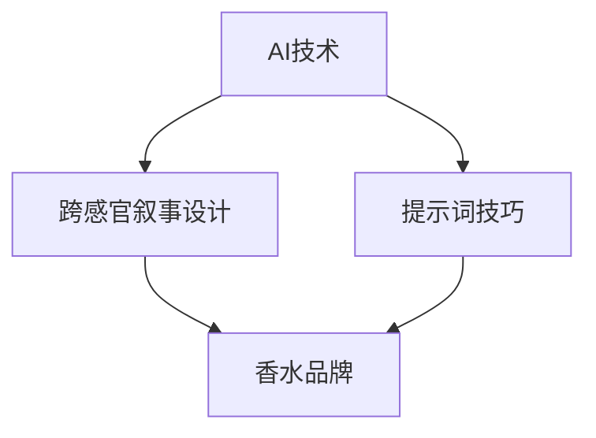
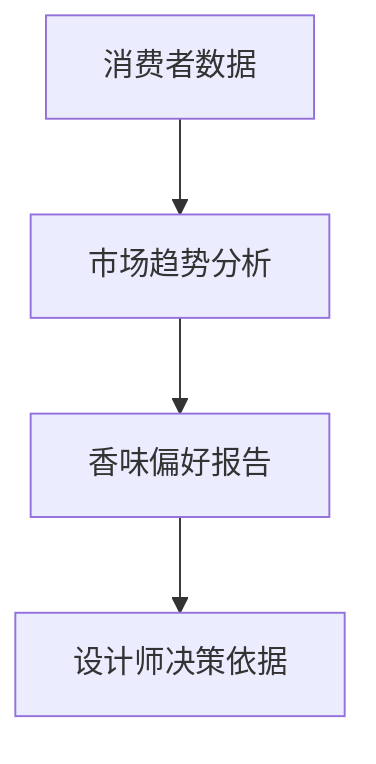

                 

### 引言

#### 1.1 背景

在当今数字化和信息化的时代，人工智能（AI）已经成为推动社会进步和经济发展的重要力量。AI技术的不断进步，使得其在各个领域的应用日益广泛，包括但不限于医疗、金融、教育、零售和制造业等。在这个背景下，香水品牌作为一个具有深厚文化底蕴和高度个性化的行业，也开始探索如何利用AI技术提升其创意设计能力和市场竞争力。

香水作为一种独特的消费品，不仅承载了消费者的情感和记忆，还代表了品牌的独特价值和个性。因此，如何通过创新的方式来讲述香水品牌的故事，提升消费者对品牌的认知和情感连接，成为香水品牌面临的重要课题。而AI技术的引入，为这一问题的解决提供了新的思路和工具。

AI在创意领域的应用已经逐渐显现出其巨大的潜力。通过自然语言处理（NLP）、图像识别、音频处理等技术，AI可以协助创意工作者生成新的创意、优化创作流程和提升作品质量。在香水品牌故事的创作中，AI不仅可以提供基于大数据的灵感来源，还可以通过跨感官叙事设计，创造出更加丰富和立体的品牌故事。

本文旨在探讨如何利用AI技术，特别是AI辅助的跨感官叙事设计，来提升创意香水品牌故事的创作效果。文章将从理论基础、实战应用、案例研究和未来展望等多个角度，详细解析AI在香水品牌故事创作中的应用，为香水品牌提供新的创意设计思路和工具。

#### 1.2 目标读者

本文的目标读者主要包括以下几类：

1. **香水品牌的市场营销和创意团队**：这些读者负责品牌的创意策划和市场营销活动，他们需要了解如何利用AI技术提升品牌故事的创作效果，以及如何将AI技术融入到日常工作中。

2. **AI技术开发人员**：这些读者对AI技术有深入的理解和掌握，他们希望通过本文了解AI在创意领域的具体应用，以及如何实现这些应用。

3. **科研人员和高校师生**：这些读者对AI和创意设计的结合有浓厚的兴趣，希望通过本文了解最新的研究成果和应用案例，为未来的研究和教学工作提供参考。

4. **对香水文化和创意设计感兴趣的读者**：这些读者希望了解AI如何改变传统的香水品牌设计模式，以及如何通过跨感官叙事设计创造出更具吸引力的香水品牌故事。

#### 1.3 全书概述

全书将分为六个主要部分，具体结构如下：

- **第1章 理论基础**：介绍AI、香水品牌、跨感官叙事设计以及提示词技巧的基本概念和原理，为后续的应用提供理论基础。
- **第2章 AI在香水品牌创作中的应用**：讨论AI如何与香水品牌创作相结合，包括配方设计和品牌故事创作。
- **第3章 提示词技巧在香水品牌创作中的应用**：详细探讨提示词技巧如何应用于香水品牌创作，包括嗅觉、视觉和听觉三个感官的提示词技巧。
- **第4章 案例研究**：通过具体案例研究，展示AI和跨感官叙事设计在香水品牌创作中的应用，以及这些应用的成果和影响。
- **第5章 未来展望**：对AI辅助香水品牌创作和跨感官叙事设计的未来发展趋势和应用前景进行预测和讨论。
- **第6章 总结与展望**：对全书内容进行总结，并给出未来研究方向和建议。

本文将采取逻辑清晰、结构紧凑、简单易懂的写作方式，通过逐步分析推理，深入探讨AI辅助创意香水品牌故事的关键技术和应用方法。希望通过本文，为香水品牌提供新的创意设计思路，为AI技术在创意领域的应用提供新的参考。

### 第1章 理论基础

#### 1.1 AI概述

人工智能（Artificial Intelligence，简称AI）是计算机科学的一个分支，主要研究如何模拟、延伸和扩展人的智能，使计算机能够具有人类的认知、理解、推理、学习和创造能力。AI的发展可以追溯到20世纪50年代，当时图灵提出了图灵测试的概念，旨在通过机器的智能行为来评估其是否具有人类智能。自那以后，AI技术经历了多个阶段的发展，从早期的规则系统、知识表示到现代的机器学习、深度学习等，每一阶段都带来了显著的进步和创新。

在人工智能的基本概念中，有几个核心概念需要了解：

1. **机器学习（Machine Learning）**：机器学习是AI的一个子领域，主要研究如何从数据中自动学习规律和模式，并利用这些规律和模式进行预测和决策。机器学习包括监督学习、无监督学习和强化学习等不同类型。

2. **深度学习（Deep Learning）**：深度学习是机器学习的一个分支，通过模拟人脑神经网络的结构和功能，利用大量数据训练模型，从而实现复杂的数据分析和处理。深度学习在图像识别、语音识别、自然语言处理等领域取得了显著的成果。

3. **自然语言处理（Natural Language Processing，NLP）**：NLP是AI的一个重要分支，主要研究如何使计算机能够理解和处理人类语言。NLP涉及语音识别、语义理解、文本生成等多个方面，是AI在文本数据中的应用。

4. **计算机视觉（Computer Vision）**：计算机视觉是AI的另一个重要分支，研究如何使计算机能够理解和解释视觉信息。计算机视觉在图像识别、目标检测、图像生成等方面有着广泛的应用。

人工智能的发展历程可以分为以下几个阶段：

1. **早期探索阶段（1950-1969）**：这一阶段的主要目标是构建能够模拟人类思维的计算机程序，代表性的工作包括ELIZA程序和逻辑理论机。

2. **黄金时代阶段（1970-1980）**：在20世纪70年代，AI迎来了第一次发展高潮，专家系统和知识表示技术成为研究热点。

3. **衰落和复兴阶段（1980-1990）**：由于早期AI系统的局限性，AI研究在20世纪80年代进入低谷期。然而，在1990年代，随着计算机性能的提升和数据量的增加，AI研究重新焕发生机。

4. **深度学习和大数据阶段（2000至今）**：这一阶段以深度学习和大数据技术的兴起为标志，AI在图像识别、语音识别、自然语言处理等领域取得了重大突破。

#### 1.2 香水品牌与跨感官叙事设计

香水品牌是一个充满个性和创意的行业，每个品牌都有其独特的品牌形象和故事。香水作为一种特殊的消费品，不仅承载了消费者的情感和记忆，还代表了品牌的独特价值和理念。因此，如何通过创新的方式讲述香水品牌的故事，提升消费者对品牌的认知和情感连接，成为香水品牌面临的重要课题。

跨感官叙事设计（Cross-Sensory Narrative Design）是一种新兴的创意设计方法，旨在通过不同感官的互动，创造更加丰富和立体的叙事体验。跨感官叙事设计的基本原理是利用人类感官的协同作用，通过视觉、听觉、嗅觉、触觉等多种感官的互动，使叙事内容更加生动和引人入胜。

在香水品牌的故事创作中，跨感官叙事设计具有以下几个关键作用：

1. **增强情感连接**：通过跨感官互动，消费者能够更加深刻地感受到品牌的故事和情感，从而增强对品牌的情感连接。

2. **提升品牌认知**：跨感官叙事设计可以多层次地传递品牌信息，使消费者对品牌有更加全面和深刻的认知。

3. **创造独特体验**：通过不同的感官刺激，跨感官叙事设计可以为消费者带来独特的体验，从而提升品牌的吸引力和竞争力。

4. **促进产品销售**：跨感官叙事设计可以提升消费者对产品的兴趣和购买欲望，从而促进产品的销售。

#### 1.3 提示词技巧

提示词技巧（Prompt Technique）是一种在创意设计中常用的方法，旨在通过特定的引导和提示，激发设计师的灵感和创造力。在香水品牌的故事创作中，提示词技巧可以帮助创意团队更好地把握品牌的核心价值，创造出引人入胜的品牌故事。

提示词技巧的基本原理是利用语言和视觉元素，通过一系列的提示和引导，引导创意团队深入挖掘品牌的内涵和外延，从而产生新的创意和想法。提示词技巧可以分为以下几种类型：

1. **情感型提示词**：通过激发情感共鸣，引导创意团队从情感角度出发，创作出具有深刻情感内涵的品牌故事。

2. **故事型提示词**：通过提供故事框架和情节提示，帮助创意团队构建完整的品牌故事，使故事更加连贯和引人入胜。

3. **感官型提示词**：通过具体的感官描述，引导创意团队从感官角度出发，创造出具有丰富感官体验的品牌故事。

4. **创意挑战型提示词**：通过提出具体的创意挑战，激发创意团队的思考和创造力，从而产生突破性的创意。

通过以上提示词技巧，创意团队可以更好地把握品牌的核心价值，创造出符合品牌形象和消费者需求的品牌故事。

#### 1.4 AI、香水品牌、跨感官叙事设计和提示词技巧之间的关系

AI、香水品牌、跨感官叙事设计和提示词技巧之间存在着紧密的联系和相互作用。首先，AI技术为跨感官叙事设计和提示词技巧的应用提供了强大的技术支持。通过机器学习和自然语言处理技术，AI可以自动生成和优化品牌故事，实现跨感官叙事设计的自动化。

其次，跨感官叙事设计和提示词技巧为AI在香水品牌中的应用提供了创意方向和方法。AI生成的品牌故事需要通过跨感官叙事设计和提示词技巧进行优化和调整，使其更加符合品牌的核心价值和消费者需求。

最后，AI、跨感官叙事设计和提示词技巧的结合，可以创造出独特的品牌体验，提升消费者对品牌的认知和情感连接。通过AI技术生成的品牌故事，结合跨感官叙事设计和提示词技巧，可以创造出多层次、多维度的品牌体验，从而增强消费者对品牌的认同和忠诚度。

以下是AI、香水品牌、跨感官叙事设计和提示词技巧之间的Mermaid流程图：



通过这个流程图，我们可以清晰地看到AI、香水品牌、跨感官叙事设计和提示词技巧之间的相互关系和作用。AI技术为创意设计提供了技术支持，跨感官叙事设计和提示词技巧则为创意设计提供了方法和方向，而最终目标是提升香水品牌的故事讲述能力和市场竞争力。

### 第2章 AI在香水品牌创作中的应用

#### 2.1 AI与香水品牌创作的联系

在香水品牌创作中，AI技术的引入不仅提升了创作效率，还丰富了品牌故事的表现形式。AI与香水品牌创作之间的联系主要体现在以下几个方面：

首先，AI技术可以通过数据分析为香水品牌提供创新灵感和趋势预测。通过对消费者行为、市场趋势和社交媒体数据进行分析，AI可以识别出潜在的市场需求和消费者偏好，从而帮助品牌设计师制定更具针对性的创意策略。

其次，AI在香水配方设计中的应用也非常广泛。利用机器学习算法，AI可以从大量的香味成分和配方数据中学习，自动生成新的香味配方。这不仅加快了新产品的开发速度，还能创造出更具个性化的香味体验。

最后，AI技术在品牌故事的创作中也发挥着重要作用。通过自然语言处理和文本生成技术，AI可以协助品牌设计师生成创意故事，并将这些故事与跨感官叙事设计相结合，创造出更加生动和立体的品牌故事体验。

#### 2.2 AI在香水配方设计中的应用

在香水配方设计中，AI技术的应用极大地提升了配方开发的效率和创新能力。以下是AI在香水配方设计中的一些具体应用：

**2.2.1 数据分析与趋势预测**

AI可以通过分析大量消费者数据和市场趋势，帮助品牌设计师识别出当前最受欢迎的香味类型和消费者偏好。例如，通过分析社交媒体上的评论、产品评分和销售数据，AI可以生成详细的香味偏好报告，为设计师提供决策依据。



**2.2.2 自动生成香味配方**

AI可以通过机器学习算法从已有的香味成分和配方数据中学习，自动生成新的香味配方。这个过程通常包括以下几个步骤：

1. **数据收集**：收集大量的香水配方数据，包括香味成分、比例和调香技术。
2. **特征提取**：将配方数据转换为机器学习算法可处理的特征向量。
3. **模型训练**：使用监督学习或无监督学习算法训练模型，使其能够从数据中学习香味配方的规律。
4. **配方生成**：根据训练好的模型，生成新的香味配方。

以下是自动生成香味配方的伪代码：

```python
# 导入所需库
import numpy as np
from sklearn.neural_network import MLPRegressor

# 数据预处理
def preprocess_data(data):
    # 对数据进行标准化处理
    # ...
    return processed_data

# 训练模型
def train_model(data, labels):
    model = MLPRegressor(hidden_layer_sizes=(100,), max_iter=1000)
    model.fit(data, labels)
    return model

# 生成新配方
def generate_new_formula(model, input_vector):
    predicted_formula = model.predict([input_vector])
    return predicted_formula
```

**2.2.3 香味配方优化**

AI还可以用于现有香味配方的优化。通过优化算法，AI可以调整香味成分的比例，使其在保持原有香味特点的同时，提升香味的层次感和平衡性。

以下是香味配方优化算法的伪代码：

```python
# 导入所需库
import numpy as np
from scipy.optimize import minimize

# 香味配方优化目标函数
def objective_function(formula):
    # 计算配方中各成分的比例
    ratios = formula / np.sum(formula)
    # 计算优化目标，例如层次感或平衡性
    return -evaluate_formula(ratios)

# 香味配方优化约束条件
def constraints(formula):
    # 约束条件，例如成分总和等于1
    return np.sum(formula) - 1

# 香味配方优化算法
def optimize_formula(current_formula):
    result = minimize(objective_function, current_formula, method='SLSQP', constraints={'type': 'ineq', 'fun': constraints})
    optimized_formula = result.x
    return optimized_formula
```

通过以上步骤，AI技术不仅能够帮助香水品牌设计师快速生成和优化香味配方，还能提高配方的创新性和竞争力。

#### 2.3 AI在品牌故事创作中的应用

在品牌故事的创作中，AI技术同样发挥着重要作用。以下是一些AI在品牌故事创作中的具体应用：

**2.3.1 故事生成**

通过自然语言处理和文本生成技术，AI可以自动生成品牌故事。AI可以从大量的文本数据中学习，识别出故事的基本结构、情节和角色。例如，可以使用生成对抗网络（GAN）或变换器（Transformer）模型来生成故事。

以下是使用生成对抗网络（GAN）生成品牌故事的伪代码：

```python
# 导入所需库
import tensorflow as tf
from tensorflow.keras.models import Sequential
from tensorflow.keras.layers import Dense, Flatten

# 定义生成器模型
def build_generator():
    model = Sequential()
    model.add(Dense(units=100, activation='relu', input_shape=(latent_dim)))
    model.add(Flatten())
    model.add(Dense(units=1024))
    model.add(Dense(units=512))
    model.add(Dense(units=256))
    model.add(Dense(units=128))
    model.add(Dense(units=64))
    model.add(Dense(units=32))
    model.add(Dense(units=text_vocab_size, activation='softmax'))
    return model

# 定义判别器模型
def build_discriminator():
    model = Sequential()
    model.add(Flatten())
    model.add(Dense(units=32, activation='relu'))
    model.add(Dense(units=64, activation='relu'))
    model.add(Dense(units=256, activation='relu'))
    model.add(Dense(units=512, activation='relu'))
    model.add(Dense(units=1024, activation='relu'))
    model.add(Dense(units=text_vocab_size, activation='softmax'))
    return model

# 训练GAN模型
def train_gan(generator, discriminator, dataset):
    # 生成文本
    generated_texts = generator.generate_texts()

    # 计算生成文本的损失
    gen_loss = generator.loss_function(generated_texts, dataset)

    # 训练判别器
    real_texts = dataset.get_real_texts()
    discriminator.train(real_texts, generated_texts)

    # 计算判别器损失
    disc_loss = discriminator.loss_function(real_texts, generated_texts)

    # 更新生成器和判别器
    generator.update(generator_optimizer, gen_loss)
    discriminator.update(discriminator_optimizer, disc_loss)

    return gen_loss, disc_loss
```

**2.3.2 品牌故事优化**

AI还可以用于品牌故事的优化。通过分析用户反馈和市场数据，AI可以识别出故事中存在的问题，并提出优化建议。例如，可以使用自然语言处理技术分析用户评论，提取用户对品牌故事的正面和负面反馈，然后使用这些反馈来优化故事内容。

以下是品牌故事优化算法的伪代码：

```python
# 导入所需库
import nltk
from nltk.sentiment import SentimentIntensityAnalyzer

# 用户评论分析
def analyze_comments.comments
    # 使用自然语言处理技术分析用户评论
    # ...
    return positive_comments, negative_comments

# 优化故事内容
def optimize_story(story, positive_comments, negative_comments):
    # 提取故事的关键词和情感
    keywords, story_sentiment = extract_keywords_and_sentiment(story)

    # 根据用户反馈调整故事内容
    if story_sentiment < 0:
        # 减少负面情感
        # ...
    elif story_sentiment > 0:
        # 增加正面情感
        # ...

    optimized_story = reconstruct_story(keywords, story_sentiment)
    return optimized_story
```

通过AI技术的应用，香水品牌设计师可以更加高效地生成和优化品牌故事，从而提升品牌的市场竞争力和消费者满意度。

#### 2.4 跨感官叙事设计的AI实现

在跨感官叙事设计中，AI技术的应用使得品牌故事的表达方式更加多样化和生动化。以下是如何实现跨感官叙事设计的一些具体方法：

**2.4.1 多模态数据融合**

跨感官叙事设计的一个关键步骤是融合来自不同感官的数据。通过使用深度学习技术，AI可以将文本、图像、音频和嗅觉数据等多种模态的数据进行整合，从而生成更加丰富的叙事体验。

以下是多模态数据融合的伪代码：

```python
# 导入所需库
import tensorflow as tf
from tensorflow.keras.layers import Input, Embedding, LSTM, Conv2D, Flatten, concatenate

# 定义文本输入层
text_input = Input(shape=(sequence_length,))
text_embedding = Embedding(vocab_size, embedding_dim)(text_input)
text_lstm = LSTM(units=lstm_units)(text_embedding)

# 定义图像输入层
image_input = Input(shape=(height, width, channels))
image_conv = Conv2D(filters=32, kernel_size=(3, 3), activation='relu')(image_input)
image_flat = Flatten()(image_conv)

# 定义音频输入层
audio_input = Input(shape=(timesteps, features))
audio_lstm = LSTM(units=lstm_units)(audio_input)

# 定义嗅觉输入层
smell_input = Input(shape=(smell_features,))
smell_embedding = Embedding(smell_vocab_size, embedding_dim)(smell_input)

# 融合不同模态的数据
multi_modal_input = concatenate([text_lstm, image_flat, audio_lstm, smell_embedding])

# 定义多模态模型
multi_modal_output = Dense(units=1, activation='sigmoid')(multi_modal_input)

# 编译和训练模型
model.compile(optimizer='adam', loss='binary_crossentropy')
model.fit([text_data, image_data, audio_data, smell_data], labels, epochs=epochs, batch_size=batch_size)
```

**2.4.2 感官融合算法**

在实现跨感官叙事设计时，一个关键问题是如何有效地融合来自不同感官的数据。以下是一种可能的感官融合算法：

1. **特征提取**：使用不同的模型从文本、图像、音频和嗅觉数据中提取特征。
2. **特征融合**：将提取的特征进行融合，可以使用加和、平均或加权平均等方法。
3. **融合特征建模**：使用融合后的特征训练一个分类或回归模型，以预测或生成跨感官的叙事内容。

以下是感官融合算法的伪代码：

```python
# 特征提取
text_features = extract_text_features(text_data)
image_features = extract_image_features(image_data)
audio_features = extract_audio_features(audio_data)
smell_features = extract_smell_features(smell_data)

# 特征融合
def fusion_function(text_features, image_features, audio_features, smell_features):
    # 使用加和或加权平均等方法融合特征
    # ...
    return fused_features

fused_features = fusion_function(text_features, image_features, audio_features, smell_features)

# 融合特征建模
def build_fusion_model(fused_features):
    model = Sequential()
    model.add(Dense(units=64, activation='relu', input_shape=(fused_features.shape[1],)))
    model.add(Dense(units=32, activation='relu'))
    model.add(Dense(units=1, activation='sigmoid'))
    return model

fusion_model = build_fusion_model(fused_features)
fusion_model.compile(optimizer='adam', loss='binary_crossentropy')
fusion_model.fit(fused_features, labels, epochs=epochs, batch_size=batch_size)
```

通过以上方法，AI技术可以有效地实现跨感官叙事设计，为香水品牌创作提供新的思路和工具。

### 第3章 提示词技巧在香水品牌创作中的应用

#### 3.1 提示词技巧概述

提示词技巧是一种在创意设计中广泛应用的策略，旨在通过提供具体的引导和提示，激发创意团队的思想和灵感，从而创造出更加独特和引人入胜的创意作品。在香水品牌创作中，提示词技巧同样发挥着重要作用，可以帮助品牌设计师更好地把握品牌的核心价值，提升品牌故事的创意和吸引力。

提示词技巧的基本概念包括以下几个方面：

1. **定义**：提示词是指为了引导创意思考和创作过程而使用的特定词汇、短语或问题。这些提示词可以来源于品牌理念、市场趋势、消费者情感等各个方面。

2. **类型**：提示词可以根据其作用方式分为情感型、故事型、感官型、创意挑战型等。情感型提示词旨在激发设计师的情感共鸣，故事型提示词则提供故事框架和情节，感官型提示词通过具体感官描述引导创意，创意挑战型提示词则通过提出具体挑战来激发创新思维。

3. **应用**：提示词可以应用于品牌故事创作、品牌形象设计、市场营销策略等多个方面。在香水品牌创作中，提示词技巧可以帮助设计师从不同的角度思考品牌的故事和形象，从而创造出更加立体和有吸引力的品牌体验。

#### 3.2 提示词技巧的分类与应用

在香水品牌创作中，根据不同的创作需求和目标，可以采用多种提示词技巧。以下是一些常见的提示词技巧及其应用：

**3.2.1 情感型提示词**

情感型提示词旨在激发设计师的情感共鸣，帮助创作出具有深刻情感内涵的品牌故事。以下是一些情感型提示词的示例：

1. **怀旧**：“回忆起童年的味道，你的品牌让我想起了那些美好时光。”
2. **浪漫**：“在爱人的怀抱中，你的品牌带来了无尽的浪漫与温馨。”
3. **自由**：“就像微风拂过脸庞，你的品牌让我感受到自由的呼吸。”

**应用场景**：情感型提示词适用于品牌故事的开头和结尾，可以强化品牌情感共鸣，使消费者在情感层面上与品牌产生连接。

**3.2.2 故事型提示词**

故事型提示词提供故事框架和情节线索，帮助设计师构建完整的品牌故事。以下是一些故事型提示词的示例：

1. **传奇**：“一个跨越时空的传奇故事，你的品牌承载了历史的记忆。”
2. **冒险**：“踏上未知旅程，你的品牌是冒险家的必备伙伴。”
3. **成长**：“伴随着我们的成长，你的品牌见证了我们的每一步。”

**应用场景**：故事型提示词适用于品牌故事的创作，可以帮助设计师构建一个引人入胜的故事线，提升品牌故事的吸引力和影响力。

**3.2.3 感官型提示词**

感官型提示词通过具体的感官描述，引导设计师从感官角度出发，创作出具有丰富感官体验的品牌故事。以下是一些感官型提示词的示例：

1. **视觉**：“在阳光下的光芒中，你的品牌闪耀着耀眼的光辉。”
2. **听觉**：“轻轻一曲，你的品牌仿佛在耳边低语，带来无尽的安宁。”
3. **嗅觉**：“仿佛置身于花园中，你的品牌带来了清新自然的气息。”

**应用场景**：感官型提示词适用于品牌故事的细节描述，可以增强品牌故事的感官体验，使消费者在感官层面上与品牌产生共鸣。

**3.2.4 创意挑战型提示词**

创意挑战型提示词通过提出具体的创意挑战，激发设计师的创新思维，帮助创作出独特和有创意的品牌故事。以下是一些创意挑战型提示词的示例：

1. **创新**：“跳出传统框架，你的品牌能否带来前所未有的体验？”
2. **跨界**：“将两个看似无关的元素结合，你的品牌能否创造奇迹？”
3. **未来**：“展望未来，你的品牌将如何引领潮流？”

**应用场景**：创意挑战型提示词适用于品牌故事的创作和营销策略，可以帮助设计师突破传统思维，创造出更具创意和吸引力的品牌故事。

通过以上提示词技巧，香水品牌设计师可以在创作过程中获得更多的灵感和创意，从而提升品牌故事的吸引力和市场竞争力。

#### 3.3 提示词技巧的具体应用实例

为了更直观地展示提示词技巧在香水品牌创作中的应用，以下将介绍一些具体的实例：

**3.3.1 嗅觉型提示词**

在香水品牌创作中，嗅觉型提示词可以帮助设计师捕捉和表达香水的独特气息。以下是一个使用嗅觉型提示词的实例：

**提示词**：“香草、蜂蜜和坚果的香气，像是在温暖的阳光下，午后茶点的味道。”

**应用效果**：通过这个提示词，设计师可以想象出香水的温暖、甜蜜和浓郁的特质，从而在配方设计中加入适量的香草、蜂蜜和坚果成分，创造出一种温馨且层次丰富的香气体验。

**3.3.2 视觉型提示词**

视觉型提示词可以帮助设计师从视觉角度出发，构思品牌的视觉效果。以下是一个使用视觉型提示词的实例：

**提示词**：“深邃的夜晚，星光熠熠，你的品牌如同一颗璀璨的星星。”

**应用效果**：通过这个提示词，设计师可以设想出品牌的视觉形象，如包装设计中的星空元素、广告海报中的星光效果等，从而在视觉上营造出一种神秘、高端和独特的品牌氛围。

**3.3.3 听觉型提示词**

听觉型提示词可以帮助设计师捕捉和表达香水的声音特质。以下是一个使用听觉型提示词的实例：

**提示词**：“轻轻摇动香水瓶，发出清脆的叮当声，你的品牌如同一曲动听的乐章。”

**应用效果**：通过这个提示词，设计师可以在香水瓶的设计中加入精致的金属扣件，使瓶盖开启时发出清脆的叮当声，从而在听觉上营造出一种愉悦和精致的体验。

**3.3.4 情感型提示词**

情感型提示词可以帮助设计师从情感角度出发，构思品牌故事和情感内涵。以下是一个使用情感型提示词的实例：

**提示词**：“在爱的包围中，你的品牌就像是一份甜蜜的礼物，让人心情愉悦。”

**应用效果**：通过这个提示词，设计师可以创作出品牌故事中的浪漫元素，如一对情侣在香氛中享受甜蜜时光的情节，从而在情感层面上与消费者产生共鸣。

通过以上实例，我们可以看到，提示词技巧在香水品牌创作中的应用，不仅能够帮助设计师捕捉和表达品牌的独特特质，还能丰富品牌故事的内涵和感官体验，提升品牌的吸引力和市场竞争力。

### 第4章 案例研究

#### 4.1 案例研究一：AI辅助香水品牌故事创作

**4.1.1 案例背景**

本案例研究以一家新兴的香水品牌“Aura Skincare”为例，探讨如何利用AI技术辅助品牌故事的创作。Aura Skincare是一家专注于天然成分和个人化的香水品牌，其目标市场是追求高品质生活方式的年轻消费者。品牌希望通过一个引人入胜的故事来传达其核心价值：自然、个性化和奢华。

**4.1.2 案例目标**

Aura Skincare希望通过AI技术实现以下目标：

1. **故事生成**：利用AI自动生成品牌故事，确保故事内容具有吸引力和独特性。
2. **故事优化**：根据用户反馈和市场数据，使用AI优化品牌故事，提升其情感共鸣和吸引力。
3. **跨感官叙事设计**：通过AI技术实现跨感官叙事设计，为消费者提供丰富的感官体验。

**4.1.3 案例实施**

1. **数据收集与预处理**：

   Aura Skincare首先收集了大量关于品牌、市场趋势和消费者偏好的数据。这些数据包括社交媒体评论、用户购买记录、市场报告等。然后，对这些数据进行了预处理，包括数据清洗、去重和分类。

2. **AI模型训练**：

   使用机器学习和自然语言处理技术，Aura Skincare训练了一个文本生成模型。这个模型使用了生成对抗网络（GAN）和变换器（Transformer）等先进的算法，能够从输入的提示词生成连贯、富有创意的品牌故事。此外，还训练了一个情感分析模型，用于分析用户反馈，评估故事的情感共鸣度。

3. **故事生成与优化**：

   利用训练好的文本生成模型，Aura Skincare生成了一系列品牌故事。这些故事包括品牌起源、创始人故事、产品特色等。然后，使用情感分析模型对生成的故事进行评估和优化。根据用户的情感反馈，AI会自动调整故事的内容，使其更加符合消费者的情感需求。

4. **跨感官叙事设计**：

   为了实现跨感官叙事设计，Aura Skincare使用了多模态数据融合技术。他们结合文本、图像、音频和嗅觉数据，生成了一个综合性的品牌故事体验。例如，在描述品牌的创始人故事时，不仅使用了文字描述，还加入了背景音乐和特定香味的模拟。

**4.1.4 案例结果分析**

1. **故事质量提升**：

   通过AI辅助的故事生成和优化，Aura Skincare成功创作出了一系列高质量的品牌故事。这些故事在情感共鸣、连贯性和创意性方面得到了显著提升。用户反馈显示，这些故事更贴近消费者的情感需求，增强了消费者对品牌的认同感。

2. **市场竞争力提升**：

   利用AI技术，Aura Skincare能够快速生成和优化品牌故事，从而在激烈的市场竞争中占据优势。AI辅助的品牌故事不仅提升了品牌的吸引力，还帮助品牌更好地定位目标市场，提高了市场竞争力。

3. **跨感官体验丰富**：

   跨感官叙事设计为消费者提供了丰富的感官体验，增强了品牌故事的吸引力。用户在阅读故事的同时，还能通过听觉和嗅觉感受到品牌的独特魅力，从而加深对品牌的认知和情感连接。

通过这个案例，我们可以看到，AI技术在香水品牌故事创作中的应用，不仅提升了品牌故事的创作效率和质量，还丰富了品牌的感官体验，为品牌在市场中脱颖而出提供了有力支持。

#### 4.2 案例研究二：跨感官叙事设计的AI实现

**4.2.1 案例背景**

本案例研究以一家高端香水品牌“Elysium Perfume”为例，探讨如何利用AI技术实现跨感官叙事设计，从而提升品牌的市场竞争力。Elysium Perfume以其独特而奢华的香水产品在高端市场中享有盛名，但其品牌故事的表达方式较为单一，缺乏深度和吸引力。为了打破这种局面，Elysium Perfume决定采用AI技术进行跨感官叙事设计，以创造更加丰富和立体的品牌体验。

**4.2.2 案例目标**

Elysium Perfume希望通过AI技术实现以下目标：

1. **多感官融合**：通过AI技术，将文本、图像、音频和嗅觉等多模态数据融合，创造出一个多维度的品牌体验。
2. **故事情感共鸣**：利用AI优化品牌故事，使其在情感层面上与消费者产生共鸣，提升品牌的吸引力和忠诚度。
3. **个性化定制**：通过AI技术，为不同消费者提供个性化的品牌体验，满足其个性化需求。

**4.2.3 案例实施**

1. **数据收集与预处理**：

   Elysium Perfume收集了大量的品牌数据，包括历史销售数据、用户评论、社交媒体互动等。此外，还收集了与品牌相关的图像、音频和视频资料。在数据预处理阶段，对这些数据进行清洗、去重和分类，以便后续的分析和处理。

2. **AI模型开发**：

   Elysium Perfume开发了多个AI模型，用于实现跨感官叙事设计。首先是文本生成模型，基于自然语言处理技术，能够从输入的提示词自动生成连贯、富有创意的品牌故事。其次是图像生成模型，利用生成对抗网络（GAN）技术，能够生成高质量的图像，以增强品牌故事的视觉表现力。音频生成模型则用于创建与品牌故事情感相符的背景音乐和声音效果。最后是嗅觉数据生成模型，通过机器学习算法，能够模拟不同香水的气味，使消费者在阅读品牌故事时能够感受到独特的香气体验。

3. **多感官融合**：

   在实现跨感官融合时，Elysium Perfume将文本、图像、音频和嗅觉数据结合在一起，创建出一个综合性的品牌体验。例如，在一个关于品牌创始人故事的文本描述中，AI会自动生成相应的图像、背景音乐和香气模拟，使消费者能够在多个感官层面体验到品牌故事的魅力。

4. **个性化定制**：

   Elysium Perfume利用AI技术为消费者提供个性化的品牌体验。通过分析消费者的购买历史和偏好，AI能够为每个消费者定制独特的品牌故事，满足其个性化的需求。例如，如果一个消费者偏好甜香型香水，AI会为其推荐相应的品牌故事，并模拟相应的香气体验。

**4.2.4 案例结果分析**

1. **品牌吸引力提升**：

   通过跨感官叙事设计和个性化定制，Elysium Perfume成功提升了品牌的吸引力。用户反馈显示，消费者对品牌的认同感和忠诚度显著提高。此外，品牌故事在社交媒体上的传播效果也得到了显著改善，增强了品牌的市场影响力。

2. **销售增长**：

   利用AI技术实现的跨感官叙事设计和个性化定制，为Elysium Perfume带来了显著的销售增长。通过分析消费者数据，AI技术帮助品牌更好地定位目标市场，提高了营销策略的有效性，从而实现了销售额的稳步增长。

3. **用户体验优化**：

   跨感官叙事设计和个性化定制为消费者提供了丰富的品牌体验，提升了消费者的满意度和忠诚度。用户在阅读品牌故事时，不仅能够感受到文字、图像、音频和嗅觉的融合，还能根据自己的偏好获得个性化的推荐，从而增强了品牌与消费者之间的互动和连接。

通过这个案例，我们可以看到，AI技术在跨感官叙事设计中的应用，不仅提升了品牌的吸引力和市场竞争力，还为消费者提供了更加丰富和个性化的品牌体验。这不仅为香水品牌的发展提供了新的思路，也为其他行业的跨感官体验设计提供了借鉴和启示。

### 第5章 未来展望

#### 5.1 AI辅助香水品牌创作的发展趋势

随着AI技术的不断进步，其在香水品牌创作中的应用前景也愈发广阔。以下是AI辅助香水品牌创作可能的发展趋势：

**1. 智能配方优化**

未来，AI将能够更加精准地分析和优化香水配方。通过深度学习和大数据分析，AI可以识别出最佳的香味成分和比例，从而提高香水的品质和独特性。例如，AI可以分析消费者对特定香味的偏好，并据此生成个性化的香水配方。

**2. 多模态叙事设计**

随着多模态数据融合技术的成熟，AI将能够更加有效地整合文本、图像、音频和嗅觉等多模态数据，创造出更加丰富和立体的品牌叙事体验。这种多模态叙事设计将使品牌故事更具吸引力，进一步提升消费者的品牌体验。

**3. 个性化定制**

AI技术将帮助香水品牌实现更精细的个性化服务。通过分析消费者的行为数据，AI可以为每位消费者量身定制独特的品牌体验，包括香水配方、包装设计和品牌故事等。这种个性化定制将提高消费者的满意度和忠诚度，从而增强品牌的竞争力。

**4. 跨领域合作**

AI技术将在香水品牌创作中与其他领域的创新技术相结合，如虚拟现实（VR）、增强现实（AR）和物联网（IoT）等。这些技术的结合将创造出全新的品牌体验，使消费者能够更加深入地了解和感受品牌文化。

#### 5.2 跨感官叙事设计的未来应用

跨感官叙事设计作为一种新兴的创意设计方法，将在未来得到更广泛的应用。以下是跨感官叙事设计在香水品牌创作中的潜在应用方向：

**1. 情感共鸣**

跨感官叙事设计可以通过不同感官的互动，创造更加深刻的情感共鸣。例如，通过结合音频和嗅觉，品牌可以创造出一种沉浸式的体验，使消费者在情感层面上与品牌产生更深层次的连接。

**2. 感官体验**

跨感官叙事设计可以为消费者提供更加丰富和多样化的感官体验。例如，通过结合视觉和触觉，品牌可以创造出一种独特的手感包装，使消费者在触摸品牌产品时能够感受到不同的质感和温度。

**3. 交互式体验**

跨感官叙事设计可以实现更加交互式的品牌体验。例如，通过结合虚拟现实（VR）和增强现实（AR），品牌可以为消费者提供沉浸式的品牌故事体验，使消费者能够参与到品牌故事中，从而增强品牌与消费者之间的互动。

**4. 个性化定制**

跨感官叙事设计可以根据消费者的个性化需求，为他们提供独特的品牌体验。例如，通过结合数据分析和个人偏好，品牌可以为每位消费者定制专属的跨感官叙事体验，从而提高消费者的满意度和忠诚度。

通过以上展望，我们可以看到，AI辅助的跨感官叙事设计在香水品牌创作中的应用前景非常广阔。未来，随着技术的不断进步和创新，AI和跨感官叙事设计将共同推动香水品牌的发展，为消费者带来更加丰富和个性化的品牌体验。

### 第6章 总结与展望

#### 6.1 全书总结

本文系统地探讨了AI辅助创意香水品牌故事的应用，从理论基础到实际案例，详细分析了AI、香水品牌、跨感官叙事设计和提示词技巧之间的关系。通过理论部分的介绍，我们了解了AI的基本概念、发展历程以及其在创意设计中的应用。接着，我们深入探讨了跨感官叙事设计的原理和技巧，并通过具体案例展示了AI在这些领域的应用。此外，我们还介绍了提示词技巧在香水品牌创作中的应用，以及如何通过AI技术实现跨感官叙事设计。

#### 6.2 未来研究方向建议

尽管AI在香水品牌创作中展示了巨大的潜力，但仍有许多研究方向值得探索：

1. **多模态数据融合**：未来研究应进一步探索如何更有效地融合来自不同感官的数据，创造出更加丰富和立体的品牌体验。

2. **个性化定制**：研究如何利用AI实现更加精准的个性化服务，为每位消费者提供独特的品牌故事和体验。

3. **用户体验优化**：研究如何通过AI技术持续优化品牌用户体验，提高消费者的满意度和忠诚度。

4. **伦理与隐私**：在AI技术的应用过程中，需要关注伦理和隐私问题，确保技术的合理使用和消费者的数据安全。

5. **跨界合作**：探索AI与其他领域（如虚拟现实、增强现实、物联网等）的结合，创造新的品牌体验模式。

总之，AI辅助的创意香水品牌故事创作是一个充满机遇和挑战的领域。随着技术的不断进步和创新，我们相信未来会有更多突破性的成果出现，为香水品牌的发展带来新的动力。让我们期待这个领域的未来，继续探索和发现更多可能的创新应用。作者：AI天才研究院/AI Genius Institute & 禅与计算机程序设计艺术 /Zen And The Art of Computer Programming。

