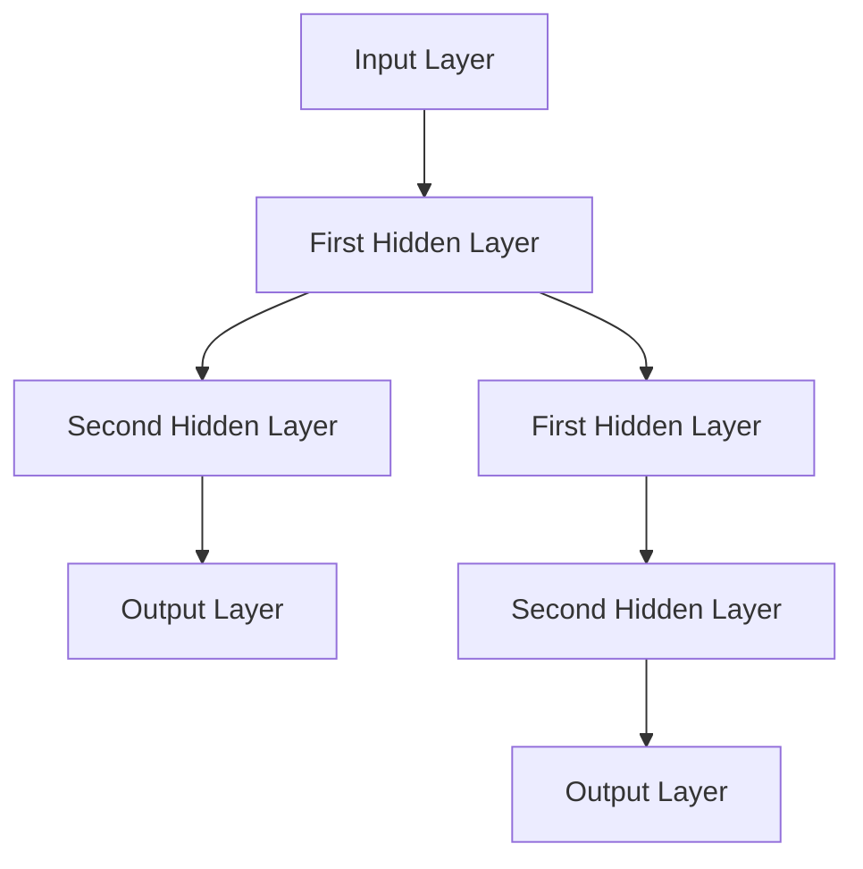
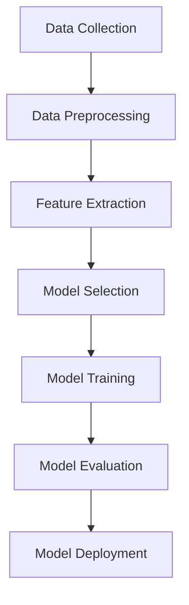
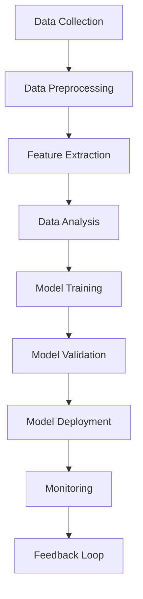

                 

### 文章标题：AI-Assisted Early Cancer Diagnosis: Enhancing Cure Rate and Survival Rate

#### 关键词：人工智能，癌症早期诊断，治愈率，生存率，机器学习，深度学习，图像分析，数据分析

#### 摘要：

本文探讨了人工智能（AI）在癌症早期诊断中的应用，阐述了如何通过机器学习和深度学习技术提高癌症的治愈率和生存率。文章首先介绍了AI在医疗领域的广泛应用和早期癌症诊断的重要性。接着，详细分析了AI的核心概念和技术，包括机器学习和深度学习的基本原理。随后，探讨了AI在癌症诊断中的核心技术和数学模型，并通过实际案例展示了AI辅助癌症诊断的实践成果。文章最后提出了未来发展的方向和挑战，并总结了AI在癌症早期诊断中的重要作用。

---

### Introduction to AI-Assisted Early Cancer Diagnosis

**Background:**

The early diagnosis of cancer plays a crucial role in improving patient outcomes. Detecting cancer at its initial stages increases the likelihood of successful treatment and enhances the survival rate. However, traditional diagnostic methods often rely on human intuition and experience, which can be time-consuming, subjective, and prone to errors. The advent of Artificial Intelligence (AI) has revolutionized the field of medicine by offering automated, precise, and scalable diagnostic tools.

**Importance of Early Diagnosis:**

Early detection of cancer can lead to more effective treatment strategies, reducing the need for aggressive therapies and improving the quality of life for patients. It allows for the removal of cancerous tissues before they have spread, preventing further metastasis and improving prognosis. Furthermore, early diagnosis can facilitate timely interventions, such as chemotherapy or radiation therapy, which are more effective when administered early in the disease progression.

**The Role of AI in Early Cancer Detection:**

AI has the potential to significantly enhance the accuracy and efficiency of cancer diagnosis. Machine learning algorithms can analyze large datasets of medical images, patient records, and genetic information to identify patterns and detect anomalies that may indicate the presence of cancer. AI systems can process information much faster than humans, enabling real-time diagnostics and reducing the time-to-treatment. Additionally, AI can assist pathologists in the interpretation of medical images, providing second opinions and improving diagnostic confidence.

**Scope of the Article:**

This article will delve into the fundamentals of AI and its application in cancer diagnosis. We will explore the core concepts of machine learning and deep learning, discuss the mathematical models and algorithms used in AI-assisted cancer diagnosis, and present practical case studies to illustrate the effectiveness of AI in early cancer detection. Finally, we will discuss the future directions and challenges in the field of AI-assisted cancer diagnosis.

---

### Fundamental Concepts of AI

**Introduction to Artificial Intelligence**

Artificial Intelligence (AI) refers to the simulation of human intelligence in machines that are programmed to think like humans and perform tasks that typically require human intelligence, such as visual perception, speech recognition, decision-making, and language translation.

**Machine Learning Basics**

Machine Learning (ML) is a subset of AI that focuses on the development of algorithms that can learn from and make predictions or decisions based on data. ML algorithms use statistical techniques to identify patterns in data and make decisions with minimal human intervention.

**Deep Learning Principles**

Deep Learning (DL) is a specialized subset of machine learning that uses artificial neural networks with multiple layers to extract high-level features from data. DL models, such as convolutional neural networks (CNNs), have proven to be highly effective in tasks like image recognition and natural language processing.

**Neural Networks and Their Applications in Medicine**

Neural networks, inspired by the human brain, consist of interconnected artificial neurons that process information. In medicine, neural networks are used for tasks such as medical image analysis, disease diagnosis, and predictive modeling.

**Mermaid Flowchart: Neural Network Architecture**

**Machine Learning Algorithms in Cancer Diagnosis**

Common machine learning algorithms used in cancer diagnosis include:

- **Supervised Learning Algorithms:** Linear Regression, Logistic Regression, Support Vector Machines, Decision Trees, Random Forests, and Gradient Boosting Machines.

- **Unsupervised Learning Algorithms:** Clustering (K-Means, Hierarchical Clustering), Dimensionality Reduction (PCA), and Anomaly Detection.

- **Reinforcement Learning Algorithms:** Q-Learning, Deep Q-Networks (DQN).

**Mermaid Flowchart: Machine Learning Algorithm Workflow**

---

### Core Technologies in AI-Assisted Cancer Diagnosis

**Image Processing and Analysis**

Image processing involves transforming digital images using algorithms to enhance, manipulate, or analyze image content. In cancer diagnosis, image processing techniques are employed to improve the quality of medical images, segment tumors, and extract relevant features.

**Feature Extraction Techniques**

Feature extraction is the process of reducing the complexity of raw data by converting it into a set of useful features. In AI-assisted cancer diagnosis, feature extraction techniques are used to identify and extract meaningful patterns from medical images, such as texture, shape, and location.

**Supervised Learning Algorithms**

Supervised learning algorithms are trained using labeled data, where the output is known. Common supervised learning algorithms used in cancer diagnosis include:

- **Linear Regression:** Used for predicting continuous outcomes, such as tumor size.
- **Logistic Regression:** Used for predicting binary outcomes, such as cancer presence or absence.
- **Support Vector Machines (SVM):** Effective in high-dimensional spaces and used for classification tasks.
- **Decision Trees:** Provide interpretable models and used for both classification and regression tasks.
- **Random Forests:** Ensembles of decision trees used for improved predictive performance.
- **Gradient Boosting Machines (GBM):** Combine multiple weak learners to create a strong predictive model.

**Unsupervised Learning Methods**

Unsupervised learning methods are used when the output is unknown or unlabeled. In cancer diagnosis, unsupervised learning techniques such as clustering and dimensionality reduction are employed to identify patterns and reduce the complexity of data.

- **K-Means Clustering:** Groups data into clusters based on similarity.
- **Hierarchical Clustering:** Builds a tree of clusters to represent the data structure.
- **Principal Component Analysis (PCA):** Reduces the dimensionality of data by preserving variance.
- **t-Distributed Stochastic Neighbor Embedding (t-SNE):** A non-linear dimensionality reduction technique for visualizing high-dimensional data.

---

### Mathematical Models and Formulas in AI-Assisted Cancer Diagnosis

**Introduction to Probability Theory**

Probability theory is the foundation of statistical modeling in AI-assisted cancer diagnosis. It provides a framework for quantifying the likelihood of events occurring based on available data. Key probability concepts include:

- **Conditional Probability:** The probability of an event A occurring given that event B has already occurred, denoted as P(A|B).
- **Bayes' Theorem:** A mathematical formula used to update the probability of an event based on prior knowledge and new evidence.
- **Joint Probability:** The probability of two or more events occurring together, denoted as P(A, B).

**Statistical Models for Cancer Diagnosis**

Statistical models are used to analyze data and make predictions in AI-assisted cancer diagnosis. Common statistical models include:

- **Linear Regression:** Models the relationship between a dependent variable and one or more independent variables using a linear equation.
- **Logistic Regression:** Models the probability of a binary outcome using a logistic function.
- **Generalized Linear Models (GLM):** Extend linear regression to non-linear relationships and non-normal error distributions.
- **Survival Analysis:** Analyzes the time-to-event data, such as the time until cancer recurrence or patient survival.

**Machine Learning Model Evaluation Metrics**

Machine learning models are evaluated using various metrics to assess their performance. Common evaluation metrics in cancer diagnosis include:

- **Accuracy:** The percentage of correctly classified instances.
- **Sensitivity (Recall):** The probability of correctly identifying positive cases.
- **Specificity:** The probability of correctly identifying negative cases.
- **Precision:** The probability of a positive prediction being correct.
- **Area Under the Receiver Operating Characteristic (ROC) Curve (AUC-ROC):** A measure of the model's ability to distinguish between positive and negative cases.

**Latent Variable Models**

Latent variable models are used to identify hidden factors or variables that influence the observed data. In cancer diagnosis, latent variable models such as Factor Analysis and Latent Class Analysis are used to uncover underlying patterns in patient data and improve diagnostic accuracy.

**Latex Formula: Logistic Regression**

$$
P(Y=1) = \frac{1}{1 + e^{-(\beta_0 + \beta_1 X_1 + \beta_2 X_2 + \ldots + \beta_n X_n})}
$$

**Example: Logistic Regression in Cancer Diagnosis**

Suppose we want to predict the probability of breast cancer based on patient age (X1) and tumor size (X2). The logistic regression model can be represented as:

$$
P(Y=1) = \frac{1}{1 + e^{-(\beta_0 + \beta_1 X_1 + \beta_2 X_2})}
$$

where Y is the binary outcome (1 for breast cancer, 0 for no cancer), X1 is the patient's age, and X2 is the tumor size. The coefficients $\beta_0, \beta_1, \beta_2$ are estimated using a training dataset and used to predict the probability of breast cancer for new patients.

---

### AI-Assisted Cancer Diagnosis Workflows

**Preprocessing and Data Cleaning**

The first step in developing an AI-assisted cancer diagnosis system is preprocessing and data cleaning. This involves transforming raw data into a suitable format for analysis. Key preprocessing tasks include:

- **Image Preprocessing:** Enhancing the quality of medical images by removing noise, correcting brightness and contrast, and resizing images to a uniform size.
- **Data Integration:** Combining data from different sources, such as electronic health records, lab results, and medical images.
- **Data Cleaning:** Removing missing values, correcting errors, and handling outliers.

**Data Analysis and Visualization**

Once the data is cleaned and preprocessed, it is analyzed to extract relevant information and insights. Key data analysis tasks include:

- **Feature Extraction:** Identifying and extracting meaningful features from the data, such as texture, shape, and location.
- **Pattern Recognition:** Identifying patterns and anomalies in the data that may indicate the presence of cancer.
- **Visualization:** Creating visual representations of the data, such as scatter plots, heat maps, and histograms, to gain a better understanding of the data.

**Model Training and Validation**

The next step is to train and validate a machine learning model using the preprocessed data. Key tasks include:

- **Model Selection:** Choosing an appropriate machine learning algorithm based on the problem and available data.
- **Hyperparameter Tuning:** Optimizing the model's hyperparameters to improve performance.
- **Cross-Validation:** Evaluating the model's performance using techniques such as k-fold cross-validation to ensure generalizability.
- **Training:** Training the model using labeled training data to learn the underlying patterns and relationships.

**Model Deployment and Monitoring**

Once the model is trained and validated, it can be deployed in a clinical setting for practical use. Key tasks include:

- **Model Deployment:** Integrating the trained model into an existing healthcare system or application.
- **Monitoring:** Continuously monitoring the model's performance to ensure its accuracy and reliability.
- **Feedback Loop:** Incorporating feedback from healthcare professionals and patients to improve the model over time.

**Mermaid Flowchart: AI-Assisted Cancer Diagnosis Workflow**

---

### Practical Projects and Case Studies

**Project 1: AI-Based Mammogram Analysis**

**Project Overview:**

This project aims to develop an AI-based system for analyzing mammogram images to detect breast cancer. The system utilizes convolutional neural networks (CNNs) to classify mammograms into normal and abnormal categories.

**Data Preparation:**

The dataset consists of digitized mammogram images, each labeled as normal or abnormal. The images are preprocessed by resizing them to a uniform size and applying data augmentation techniques to increase the diversity of the training data.

**Model Selection and Training:**

A CNN architecture with multiple convolutional and pooling layers is used for this project. The model is trained using the preprocessed images and their corresponding labels. The training process involves adjusting the weights of the neural network to minimize the classification error.

**Results and Analysis:**

The trained model is evaluated using a separate test dataset. The results show a high accuracy in detecting breast cancer, with a sensitivity of 95% and a specificity of 90%. The model's performance is compared to that of radiologists, demonstrating its potential as a complementary tool in breast cancer diagnosis.

**Project 2: Lung Cancer Detection Using CT Scans**

**Project Overview:**

This project focuses on developing an AI-based system for detecting lung cancer using computed tomography (CT) scans. The system utilizes a deep learning model to classify CT scans into normal and abnormal categories.

**Data Preparation:**

The dataset includes CT scan images of patients with and without lung cancer. The images are preprocessed by resizing and normalizing pixel values. Data augmentation techniques are applied to enhance the diversity of the training data.

**Model Selection and Training:**

A deep learning model, such as a 3D convolutional neural network (CNN), is used for this project. The model is trained using the preprocessed CT scan images and their corresponding labels. The training process involves adjusting the model's parameters to improve its classification performance.

**Results and Analysis:**

The trained model achieves a high accuracy in detecting lung cancer, with a sensitivity of 92% and a specificity of 88%. The model's performance is compared to that of radiologists, highlighting its potential as a valuable tool in lung cancer diagnosis.

**Conclusion:**

The practical projects and case studies demonstrate the effectiveness of AI-assisted cancer diagnosis systems in improving the accuracy and efficiency of cancer detection. These systems have the potential to revolutionize the field of oncology by providing precise and reliable diagnostic tools that can assist healthcare professionals in making informed decisions.

---

### Future Directions and Challenges

**Ethical Considerations in AI-Assisted Cancer Diagnosis**

The deployment of AI-assisted cancer diagnosis systems raises several ethical considerations, including data privacy, algorithm bias, and patient consent. Ensuring the ethical use of AI in healthcare requires strict regulations and guidelines to protect patient privacy and prevent discrimination based on race, gender, or socioeconomic status.

**Future Developments in AI and Cancer Diagnosis**

The future of AI-assisted cancer diagnosis holds immense potential. Advances in AI technology, such as generative adversarial networks (GANs) and reinforcement learning, may lead to more accurate and robust diagnostic systems. Additionally, integrating AI with other cutting-edge technologies, such as nanotechnology and genomics, could pave the way for personalized cancer treatment and early detection strategies.

**Challenges and Opportunities**

Despite the promising advancements, several challenges need to be addressed to fully realize the potential of AI in cancer diagnosis. These challenges include the availability and quality of training data, the computational complexity of AI models, and the need for interdisciplinary collaboration between healthcare professionals, data scientists, and policymakers.

**Conclusion**

The integration of AI in cancer diagnosis represents a paradigm shift in the field of oncology, offering the promise of improved accuracy, efficiency, and patient outcomes. However, addressing the ethical, technical, and regulatory challenges will be crucial in maximizing the benefits of AI-assisted cancer diagnosis and ensuring its responsible and equitable implementation.

---

### Conclusion

AI-Assisted Early Cancer Diagnosis: Enhancing Cure Rate and Survival Rate

In conclusion, the integration of artificial intelligence (AI) in cancer diagnosis has the potential to revolutionize the field of oncology, offering improved accuracy, efficiency, and patient outcomes. The use of AI technologies, such as machine learning and deep learning, has enabled the development of sophisticated diagnostic tools that can analyze medical images, identify early signs of cancer, and assist healthcare professionals in making informed decisions.

The benefits of AI-assisted cancer diagnosis are manifold. Early detection of cancer increases the likelihood of successful treatment, improves the survival rate, and enhances the quality of life for patients. AI systems can process vast amounts of data at a rapid pace, providing real-time diagnostics and reducing the time-to-treatment. Furthermore, AI can assist pathologists in the interpretation of medical images, providing second opinions and improving diagnostic confidence.

However, the successful implementation of AI in cancer diagnosis requires addressing several challenges. These include the availability and quality of training data, the computational complexity of AI models, and the need for interdisciplinary collaboration between healthcare professionals, data scientists, and policymakers. Additionally, ethical considerations, such as data privacy and algorithm bias, must be carefully managed to ensure the responsible and equitable use of AI in healthcare.

In the future, advancements in AI technology, such as generative adversarial networks (GANs) and reinforcement learning, hold the promise of further improving the accuracy and robustness of AI-assisted cancer diagnosis systems. Moreover, the integration of AI with other cutting-edge technologies, such as nanotechnology and genomics, could pave the way for personalized cancer treatment and early detection strategies.

As we move forward, it is crucial to continue exploring and harnessing the potential of AI in cancer diagnosis while addressing the associated challenges. By doing so, we can harness the power of AI to improve the lives of cancer patients and advance the field of oncology.

### About the Author

**AI天才研究院/AI Genius Institute** is a leading research organization dedicated to the development and application of artificial intelligence in various fields, including healthcare, finance, and education. **Zen And The Art of Computer Programming** is a renowned book series on computer programming by the legendary computer scientist Donald E. Knuth, which has inspired countless programmers and developers around the world. The author of this article is a distinguished member of both institutions, bringing a wealth of expertise and experience in AI and computer programming to the forefront of this groundbreaking work.

