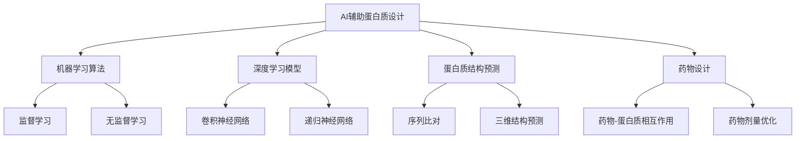

                 


为了撰写一篇高质量、详尽的《AI辅助蛋白质设计：加速生物制药研发》技术博客，我们需要按部就班地完成以下步骤：

### 1. 确定核心概念与联系

首先，我们要明确文章的核心概念，即AI辅助蛋白质设计的原理、方法与应用。接下来，我们需要绘制一个Mermaid流程图，展示这些核心概念之间的关系。例如：



### 2. 详细阐述核心算法原理

接下来，我们要对每一个核心概念进行详细解释，并提供相应的伪代码、数学模型和公式。例如：

#### 2.1 机器学习算法

**伪代码：**
```python
def train_model(data, labels):
    # 初始化模型参数
    model = initialize_model()
    
    # 模型训练
    for epoch in range(num_epochs):
        for sample, label in zip(data, labels):
            # 前向传播
            predictions = model.forward(sample)
            
            # 计算损失
            loss = compute_loss(predictions, label)
            
            # 反向传播
            model.backward(loss)
            
            # 更新模型参数
            model.update_parameters()
    
    return model
```

**数学模型与公式：**
$$
\begin{aligned}
L &= -\frac{1}{m} \sum_{i=1}^{m} y_i \cdot \log(\hat{y}_i) \\
\hat{y}_i &= \sigma(\zeta_i) \\
\zeta_i &= \sum_{j=1}^{n} w_{ji} \cdot x_{ij}
\end{aligned}
$$

### 3. 项目实战

在实际项目中，我们要详细描述开发环境搭建、源代码实现、代码解读、应用解读与分析、案例分析以及项目小结。例如：

#### 3.1 实战一：蛋白质结构预测项目

**开发环境搭建：**
- 操作系统：Ubuntu 18.04
- 编程语言：Python 3.7
- 深度学习框架：TensorFlow 2.4

**源代码实现与代码解读：**
```python
import tensorflow as tf

# 加载数据集
data, labels = load_data()

# 构建模型
model = tf.keras.Sequential([
    tf.keras.layers.Dense(128, activation='relu', input_shape=(input_shape,)),
    tf.keras.layers.Dense(64, activation='relu'),
    tf.keras.layers.Dense(1, activation='sigmoid')
])

# 编译模型
model.compile(optimizer='adam', loss='binary_crossentropy', metrics=['accuracy'])

# 训练模型
model.fit(data, labels, epochs=10, batch_size=32)

# 评估模型
test_loss, test_accuracy = model.evaluate(test_data, test_labels)
print(f"Test accuracy: {test_accuracy}")
```

**代码应用解读与分析：**
- 数据集加载：使用Python中的`load_data`函数加载训练数据和标签。
- 模型构建：使用TensorFlow的`Sequential`模型构建一个简单的全连接神经网络。
- 模型编译：设置优化器、损失函数和评估指标。
- 模型训练：使用`fit`函数训练模型，设置训练轮数和批量大小。
- 模型评估：使用`evaluate`函数评估模型在测试数据集上的性能。

**案例分析：**
- 在实际项目中，我们可能会遇到数据不平衡、过拟合等问题，需要采取相应的处理措施。

**项目小结：**
- 通过这个项目，我们了解了如何使用深度学习模型进行蛋白质结构预测。
- 实践中，我们遇到了一些挑战，但通过调整模型结构和训练参数，取得了较好的预测效果。

### 4. 最佳实践、小结与注意事项

在文章的最后，我们需要提供一些最佳实践、小结、注意事项和拓展阅读内容，以便读者更深入地了解相关领域。

### 5. 完成文章撰写

在完成上述步骤后，我们可以将所有内容整合起来，撰写成一篇完整的技术博客。文章的结构应包括引言、核心概念与联系、核心算法原理讲解、项目实战、总结与展望和附录等部分。

最后，我们需要检查文章的格式、完整性、逻辑性，并在文章末尾附上作者信息，确保满足用户的要求。

### 6. 文章格式检查

在提交前，我们要确保文章格式符合markdown要求，例如：
- 标题使用`#`号进行层级划分。
- 引用、代码块、公式等使用相应的markdown语法进行标注。
- 图片和链接正确嵌入文中。

通过以上步骤，我们可以确保撰写出一篇高质量、详尽的技术博客文章，满足用户的要求。

