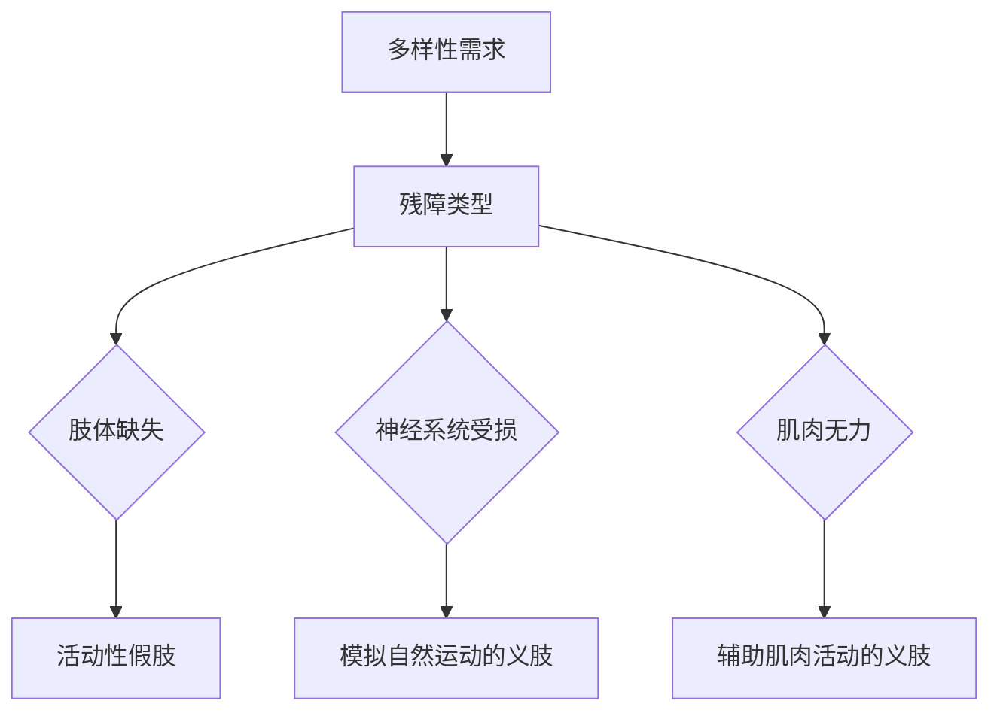

                 

# AI辅助设计在个性化义肢开发中的应用：改善残障人士生活质量

## 关键词
- 人工智能（AI）
- 个性化义肢
- 大数据
- 3D打印
- 残障人士生活质量

## 摘要
本文探讨了人工智能（AI）在个性化义肢开发中的应用，旨在提升残障人士的生活质量。文章首先介绍了AI辅助设计在个性化义肢开发中的重要性，分析了残障人士的多样性需求和个性化义肢开发面临的挑战。接着，文章概述了AI辅助设计技术，包括机器学习、深度学习和3D打印技术，并详细阐述了这些技术如何在个性化义肢开发中发挥作用。通过案例研究和伦理法律问题的探讨，文章总结了AI辅助设计在个性化义肢开发中的实际应用和未来发展。

## 第一部分：AI辅助设计在个性化义肢开发中的应用概述

### 1.1 AI辅助设计在个性化义肢开发中的重要性

#### 1.1.1 残障人士生活质量的提升需求

随着科技的进步，人工智能（AI）技术已逐步渗透到生活的各个领域，为解决复杂问题提供了新的思路。在个性化义肢开发中，AI辅助设计技术的应用尤为重要。对于残障人士而言，生活质量的提升不仅仅是物理层面的改善，更涉及到心理和社会层面的全面关注。AI辅助设计通过定制化、智能化设计，能够显著提高义肢的适配性和舒适度，从而在物理层面提升残障人士的生活质量。

#### 1.1.2 个性化义肢开发的需求与挑战

个性化义肢开发的需求主要集中在以下几个方面：精确测量残障人士的肢体参数、设计符合人体工程学的义肢结构、实现灵活的功能控制等。这些需求带来了相应的挑战，如数据采集的准确性、设计复杂度的提高、以及智能化控制的实现等。AI辅助设计技术在这些方面提供了有效的解决方案，提高了个性化义肢的开发效率和准确性。

#### 1.1.3 AI辅助设计在个性化义肢开发中的应用前景

AI辅助设计在个性化义肢开发中的应用前景广阔。通过大数据分析、机器学习算法和3D打印技术，可以实现义肢设计的智能化和个性化。未来的个性化义肢将不仅能够满足残障人士的基本需求，还能够根据用户的个性化需求提供更加丰富和智能的功能，从而显著提升残障人士的生活质量。

#### 1.1.4 本书的主要内容和结构

本书分为四个部分。第一部分介绍AI辅助设计的基本概念和核心技术；第二部分探讨个性化义肢开发的需求和挑战；第三部分展示AI辅助设计在个性化义肢开发中的应用实例；第四部分讨论未来的发展趋势和潜在的研究方向。

## 1.2 AI辅助设计技术概述

### 1.2.1 AI的定义与分类

人工智能（AI）是指由人制造出来的具有一定智能的系统，能够通过学习和适应不断优化自身的性能。根据AI的智能程度，可以分为弱AI和强AI。弱AI主要指具有特定任务解决能力的人工智能系统，如语音识别、图像识别等；强AI则是指具有与人类相似的全面智能的系统。

### 1.2.2 机器学习和深度学习

机器学习是AI的核心技术之一，它通过算法使计算机能够从数据中学习并做出决策。深度学习是机器学习的一个分支，通过神经网络模拟人脑的学习过程，能够处理大量的数据并自动提取特征。

### 1.2.3 3D打印技术

3D打印技术是一种快速成型技术，通过逐层打印材料，制造出三维物体。在个性化义肢开发中，3D打印技术可以实现快速、精确的定制化生产。

## 1.3 个性化义肢开发的需求和挑战

### 1.3.1 残障人士的多样性需求

残障人士的多样性需求是个性化义肢开发的核心。不同的残障类型、残障程度和个体差异，需要不同类型的义肢设计和功能。例如，截肢患者需要的是能够自由活动的假肢，而神经系统受损的患者可能需要能够模拟自然肢体运动的义肢。

#### Mermaid流程图：残障人士的多样性需求与义肢类型

### 1.3.2 数据采集与处理

个性化义肢开发需要精确的肢体参数数据。数据采集的准确性受到多种因素的影响，如测量设备、测量环境和操作人员等。例如，使用3D扫描仪可以获取肢体表面数据，但扫描仪的精度和环境的光照会影响数据的准确性。

#### 数据采集与处理的挑战

- **测量设备精度**：不同测量设备的精度差异较大，会影响数据采集的准确性。
- **测量环境**：环境因素如光线、温度等会影响数据的采集。
- **操作人员经验**：操作人员的经验和技术水平也会影响数据采集的准确性。

### 1.3.3 设计复杂度与优化

个性化义肢的设计复杂度较高，需要考虑材料、结构、功能等多个方面。优化设计是提高义肢性能的关键，但同时也增加了设计的复杂性。例如，设计一个能够模拟自然肢体运动的义肢，需要考虑义肢的机械结构、材料特性以及运动控制算法。

#### 设计复杂度的挑战

- **材料选择**：不同材料的性能差异较大，需要根据义肢的功能需求选择合适的材料。
- **结构设计**：义肢的结构设计需要考虑人体工程学，以确保舒适度和功能性能。
- **功能实现**：实现义肢的功能需要集成多个传感器和执行器，进行复杂的系统集成。

### 1.3.4 智能化控制与交互

智能化控制是实现个性化义肢功能的关键。通过传感器、控制器和执行器等组件，可以实现义肢的智能控制和交互。例如，使用肌电信号传感器可以感知残障人士的肌肉活动，并通过算法处理控制义肢的运动。

#### 智能化控制与交互的挑战

- **算法设计**：设计能够准确识别和处理肌电信号的算法，实现精确的控制。
- **系统集成**：将传感器、控制器和执行器等组件集成到义肢中，进行复杂的系统集成。
- **用户体验**：优化用户界面，确保残障人士能够轻松操作义肢，提高使用体验。

### 1.3.5 制造与装配

个性化义肢的制造和装配是保证义肢性能和可靠性的关键环节。3D打印技术的应用提高了制造效率，但也带来了材料选择、打印精度和后处理等问题。

#### 制造与装配的挑战

- **材料选择**：选择合适的材料，以满足义肢的性能需求。
- **打印精度**：3D打印的精度直接影响义肢的尺寸和形状，需要确保打印精度。
- **后处理**：3D打印后的义肢需要进行后续处理，如表面处理、组装和测试等。

## 1.4 AI辅助设计在个性化义肢开发中的应用

### 1.4.1 大数据处理与机器学习

通过大数据分析和机器学习算法，可以对大量肢体参数数据进行处理，提取有效的特征，用于义肢的设计和优化。例如，利用机器学习算法对大量义肢数据进行分析，可以预测最佳的义肢设计参数。

#### 机器学习算法在义肢设计中的应用

- **回归分析**：通过历史数据，预测最佳的义肢尺寸和参数。
- **分类算法**：根据残障类型和程度，分类设计不同的义肢类型。
- **聚类分析**：将相似的数据进行聚类，以优化义肢的设计。

### 1.4.2 深度学习与3D打印

深度学习算法可以用于义肢设计中的特征提取和结构优化，3D打印技术可以实现快速、精确的定制化生产。例如，利用深度学习算法分析大量义肢设计数据，提取关键特征，用于指导3D打印过程。

#### 深度学习与3D打印的结合

- **特征提取**：通过深度学习提取义肢设计的关键特征，指导3D打印过程。
- **结构优化**：利用深度学习优化义肢的结构设计，提高性能和舒适度。

### 1.4.3 智能化控制与交互

通过智能化控制系统，可以实现义肢的智能控制和交互，提高义肢的使用体验和功能性。例如，利用肌电信号传感器，结合深度学习算法，实现义肢的智能控制。

#### 智能化控制系统

- **传感器**：用于感知残障人士的肢体运动。
- **控制器**：处理传感器数据，控制义肢的运动。
- **执行器**：驱动义肢的运动。

### 1.4.4 案例研究

本书将通过多个案例研究，展示AI辅助设计在个性化义肢开发中的应用，包括设计流程、关键技术和实际效果等。

#### 案例研究：AI辅助个性化义肢设计

- **案例一**：利用大数据分析和机器学习算法，为截肢患者设计最佳义肢尺寸和参数。
- **案例二**：通过深度学习和3D打印技术，为神经系统受损的患者设计能够模拟自然肢体运动的义肢。
- **案例三**：利用肌电信号传感器和深度学习算法，实现义肢的智能控制，提高使用体验。

## 1.5 个性化义肢开发中的伦理和法律问题

### 1.5.1 伦理问题

个性化义肢开发涉及到残障人士的隐私、安全和尊严等问题。如何保护残障人士的隐私，确保义肢的安全性和舒适性，是伦理问题的重要方面。

#### 伦理问题分析

- **隐私保护**：在数据采集和处理过程中，如何保护残障人士的隐私。
- **安全性**：确保义肢的设计和制造过程符合安全标准，避免对残障人士造成伤害。
- **尊严**：设计义肢时，如何尊重残障人士的尊严，避免歧视和偏见。

### 1.5.2 法律问题

个性化义肢开发中的法律问题主要包括知识产权保护、产品责任和安全标准等。

#### 法律问题分析

- **知识产权保护**：保护义肢设计的知识产权，避免侵权行为。
- **产品责任**：明确义肢制造商和销售商的责任，确保产品质量和安全性。
- **安全标准**：制定统一的义肢安全标准，确保义肢的质量和性能。

## 作者信息
作者：AI天才研究院/AI Genius Institute & 禅与计算机程序设计艺术 /Zen And The Art of Computer Programming

## 结语
本文探讨了AI辅助设计在个性化义肢开发中的应用，分析了个性化义肢开发的需求和挑战，并介绍了相关技术。通过案例研究和伦理法律问题的探讨，本文总结了AI辅助设计在个性化义肢开发中的实际应用和未来发展。未来，随着AI技术的不断进步，个性化义肢将能够更好地满足残障人士的需求，显著提升他们的生活质量。然而，伦理和法律问题也需要得到进一步的关注和解决。让我们期待AI技术为残障人士带来更多的福祉。

