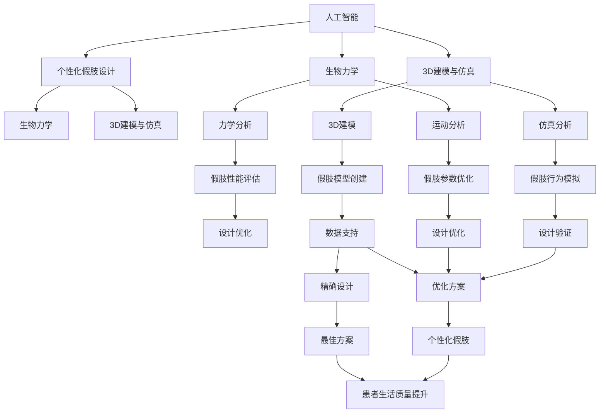

                 

## 文章标题

# AI辅助设计在个性化假肢制作中的应用：提高患者生活质量

> 关键词：人工智能、个性化假肢、生活质量、AI辅助设计

> 摘要：本文深入探讨了人工智能（AI）在个性化假肢制作中的应用，介绍了AI辅助设计的基本原理、流程和方法。通过具体案例和实战分析，本文展示了AI如何提高假肢的个性化定制水平，从而显著提升患者的生活质量。

----------------------------------------------------------------

## 设计书籍目录大纲的步骤

设计一本书籍目录大纲是一个系统性的过程，需要充分理解书名和主题，明确书籍结构，细化每个部分的内容，并最终形成完整的目录大纲。以下是设计书籍目录大纲的具体步骤：

### 第一步：理解书名和主题

书名《AI辅助设计在个性化假肢制作中的应用：提高患者生活质量》揭示了书籍的核心主题和内容。为了设计一个合理的目录大纲，我们需要对以下几个关键点有深入的理解：

1. **AI辅助设计**：这本书将探讨人工智能在假肢设计中的具体应用，包括算法、技术和流程。
2. **个性化假肢制作**：个性化假肢是本书的核心内容，涉及到根据患者的具体需求和使用场景进行定制的设计过程。
3. **提高患者生活质量**：本书的一个主要目标是通过AI辅助设计提高假肢的使用效果，从而改善患者的生活质量。

### 第二步：确定书籍结构

基于书名的理解，我们可以将书籍结构划分为以下几个主要部分：

1. **引言与背景**：介绍AI辅助设计在个性化假肢制作领域的发展背景、重要性和研究的必要性。
2. **AI与假肢设计概述**：介绍人工智能的基本概念、技术框架和假肢设计的核心概念。
3. **个性化假肢设计原理**：深入讲解个性化假肢设计的原理和方法。
4. **AI在假肢制作中的应用**：探讨AI在个性化假肢制作中的应用，包括算法、工具和流程。
5. **患者生活质量评估**：介绍如何使用AI技术评估患者的生活质量，包括评估指标和方法。
6. **项目案例与实战**：通过具体案例展示AI辅助设计在个性化假肢制作中的应用。
7. **总结与展望**：总结全书内容，并对未来研究方向和挑战进行展望。

### 第三步：细化每个部分

在确定了书籍的基本结构后，我们需要为每个部分细化内容，确保目录的完整性和逻辑性。以下是具体的细化方案：

#### 1. 引言与背景
这部分主要介绍AI辅助设计在个性化假肢制作领域的发展背景、重要性和研究的必要性。

##### 1.1 引言
- **AI辅助设计与个性化假肢制作的背景**
- **研究的必要性与目标**

##### 1.2 相关工作回顾
- **国内外AI在假肢设计中的应用研究**
- **个性化假肢制作的发展历程与现状**

#### 2. AI与假肢设计概述
这部分将介绍AI的基本概念、技术框架和假肢设计的核心概念。

##### 2.1 AI技术概述
- **AI的定义与分类**
- **AI在医疗领域的应用**
- **假肢设计的定义与核心概念**

##### 2.2 假肢设计技术框架
- **传统假肢设计方法**
- **AI辅助假肢设计的框架**

#### 3. 个性化假肢设计原理
这部分将深入讲解个性化假肢设计的原理和方法。

##### 3.1 个性化假肢设计的理论基础
- **人体解剖学与生物力学**
- **个性化设计的需求分析**

##### 3.2 个性化假肢设计的流程与方法
- **数据采集与处理**
- **3D建模与仿真**
- **参数化设计与优化**

#### 4. AI在假肢制作中的应用
这部分将探讨AI在个性化假肢制作中的应用，包括算法、工具和流程。

##### 4.1 AI算法在假肢制作中的应用
- **深度学习算法**
- **机器学习算法**
- **数据挖掘与模式识别**

##### 4.2 AI工具在假肢制作中的应用
- **常见的AI工具与平台**
- **AI工具的选择与集成**

##### 4.3 AI在假肢制作中的流程
- **数据收集与预处理**
- **模型训练与优化**
- **个性化假肢制作**

#### 5. 患者生活质量评估
这部分将介绍如何使用AI技术评估患者的生活质量，包括评估指标和方法。

##### 5.1 患者生活质量评估指标
- **假肢使用满意度**
- **功能恢复程度**
- **生活质量改善**

##### 5.2 患者生活质量评估方法
- **问卷调查**
- **实验数据收集**
- **数据分析与应用**

#### 6. 项目案例与实战
这部分将通过具体案例展示AI辅助设计在个性化假肢制作中的应用。

##### 6.1 案例介绍
- **案例背景**
- **案例目标**

##### 6.2 项目实施与效果分析
- **项目实施流程**
- **AI技术应用**
- **案例效果评估**

##### 6.3 项目经验与启示
- **项目经验总结**
- **对未来个性化假肢制作的应用启示**

#### 7. 总结与展望
这部分将对全书内容进行总结，并对未来研究方向和挑战进行展望。

##### 7.1 总结
- **本书主要贡献**
- **个性化假肢设计的关键技术**

##### 7.2 展望
- **AI在假肢制作中的未来发展趋势**
- **面临的挑战与解决方案**

### 第四步：编写目录大纲

根据上述细化方案，我们可以编写出完整的目录大纲，确保每个章节都涵盖核心概念、算法原理、数学模型、项目实战等内容。

```markdown
# 《AI辅助设计在个性化假肢制作中的应用：提高患者生活质量》目录大纲

## 第1章 引言与背景
### 1.1 引言
#### 1.1.1 AI辅助设计与个性化假肢制作的背景
#### 1.1.2 研究的必要性与目标

### 1.2 相关工作回顾
#### 1.2.1 国内外AI在假肢设计中的应用研究
#### 1.2.2 个性化假肢制作的发展历程与现状

## 第2章 AI与假肢设计概述
### 2.1 AI技术概述
#### 2.1.1 AI的定义与分类
#### 2.1.2 AI在医疗领域的应用
#### 2.1.3 假肢设计的定义与核心概念

### 2.2 假肢设计技术框架
#### 2.2.1 传统假肢设计方法
#### 2.2.2 AI辅助假肢设计的框架

## 第3章 个性化假肢设计原理
### 3.1 个性化假肢设计的理论基础
#### 3.1.1 人体解剖学与生物力学
#### 3.1.2 个性化设计的需求分析

### 3.2 个性化假肢设计的流程与方法
#### 3.2.1 数据采集与处理
#### 3.2.2 3D建模与仿真
#### 3.2.3 参数化设计与优化

## 第4章 AI在假肢制作中的应用
### 4.1 AI算法在假肢制作中的应用
#### 4.1.1 深度学习算法
#### 4.1.2 机器学习算法
#### 4.1.3 数据挖掘与模式识别

### 4.2 AI工具在假肢制作中的应用
#### 4.2.1 常见的AI工具与平台
#### 4.2.2 AI工具的选择与集成

### 4.3 AI在假肢制作中的流程
#### 4.3.1 数据收集与预处理
#### 4.3.2 模型训练与优化
#### 4.3.3 个性化假肢制作

## 第5章 患者生活质量评估
### 5.1 患者生活质量评估指标
#### 5.1.1 假肢使用满意度
#### 5.1.2 功能恢复程度
#### 5.1.3 生活质量改善

### 5.2 患者生活质量评估方法
#### 5.2.1 问卷调查
#### 5.2.2 实验数据收集
#### 5.2.3 数据分析与应用

## 第6章 项目案例与实战
### 6.1 案例介绍
#### 6.1.1 案例背景
#### 6.1.2 案例目标

### 6.2 项目实施与效果分析
#### 6.2.1 项目实施流程
#### 6.2.2 AI技术应用
#### 6.2.3 案例效果评估

### 6.3 项目经验与启示
#### 6.3.1 项目经验总结
#### 6.3.2 对未来个性化假肢制作的应用启示

## 第7章 总结与展望
### 7.1 总结
#### 7.1.1 本书主要贡献
#### 7.1.2 个性化假肢设计的关键技术

### 7.2 展望
#### 7.2.1 AI在假肢制作中的未来发展趋势
#### 7.2.2 面临的挑战与解决方案
```

通过上述步骤，我们不仅设计了一个结构清晰、内容丰富的书籍目录大纲，也为后续章节的撰写提供了明确的指导。这样，我们可以在确保全书逻辑性和连贯性的同时，有效地传达书籍的核心思想和内容。

### 设计书籍目录大纲的进一步细化

在设计《AI辅助设计在个性化假肢制作中的应用：提高患者生活质量》的目录大纲时，我们已经初步确定了书籍的结构和各个部分的内容。接下来，我们将对每个章节进行进一步的细化，以确保内容的完整性、逻辑性和可读性。

#### 第1章 引言与背景

**1.1 引言**

在这一节中，我们将详细介绍AI辅助设计与个性化假肢制作的关系，阐述研究的重要性和目的。

- **1.1.1 AI辅助设计与个性化假肢制作的背景**
  - **AI技术的发展历程**：从AI的定义出发，回顾其发展历程，包括传统的机器学习、深度学习以及近年来快速发展的强化学习等。
  - **个性化假肢的需求背景**：探讨假肢技术的发展历程，从传统假肢到现代智能假肢的转变，以及个性化假肢对提高患者生活质量的重要性。

- **1.1.2 研究的必要性与目标**
  - **研究的必要性**：分析当前假肢设计中存在的问题，如定制化程度低、舒适度不足等，阐述AI辅助设计的必要性和潜力。
  - **研究的具体目标**：明确本书的研究目标，包括提高假肢的个性化程度、提升假肢的舒适性和功能性能、改善患者的生活质量等。

**1.2 相关工作回顾**

在这一节中，我们将回顾国内外关于AI在假肢设计中的应用研究，以及个性化假肢制作的发展历程。

- **1.2.1 国内外AI在假肢设计中的应用研究**
  - **国外研究**：介绍一些领先的国家在AI辅助假肢设计方面的研究进展，如美国、德国和日本等。
  - **国内研究**：分析我国在AI辅助假肢设计领域的研究成果，包括高校、科研机构和企业的最新研究动态。

- **1.2.2 个性化假肢制作的发展历程与现状**
  - **传统假肢制作方法**：介绍传统的假肢制作流程，包括材料选择、形状设计、适配测试等。
  - **个性化假肢制作的现状**：分析当前个性化假肢制作的挑战和机遇，如制造工艺的改进、患者数据的收集与处理等。

#### 第2章 AI与假肢设计概述

**2.1 AI技术概述**

在这一节中，我们将介绍人工智能的基本概念、技术框架和在医疗领域的应用，以及假肢设计的核心概念。

- **2.1.1 AI的定义与分类**
  - **AI的定义**：解释AI的基本概念，包括机器学习、深度学习、强化学习等。
  - **AI的分类**：介绍常见的AI分类方法，如基于规则、基于模型的AI系统等。

- **2.1.2 AI在医疗领域的应用**
  - **医疗影像分析**：介绍AI在医学影像分析中的应用，如肿瘤检测、病灶分割等。
  - **疾病预测与诊断**：分析AI在疾病预测和诊断中的应用，如流感预测、心血管疾病诊断等。

- **2.1.3 假肢设计的定义与核心概念**
  - **假肢设计的定义**：解释假肢设计的含义，包括功能设计、外观设计、材料选择等。
  - **核心概念**：介绍假肢设计的核心概念，如生物力学原理、人体工程学、适应性设计等。

**2.2 假肢设计技术框架**

在这一节中，我们将讨论假肢设计的传统方法和AI辅助假肢设计的框架。

- **2.2.1 传统假肢设计方法**
  - **设计流程**：介绍传统的假肢设计流程，包括需求分析、模型制作、适配测试等。
  - **设计挑战**：分析传统假肢设计方法中存在的问题，如定制化程度低、舒适度不足等。

- **2.2.2 AI辅助假肢设计的框架**
  - **AI辅助设计流程**：介绍AI辅助假肢设计的流程，包括数据收集、模型训练、个性化定制等。
  - **AI在假肢设计中的应用**：探讨AI在假肢设计中的具体应用，如3D建模、仿真分析、自适应调整等。

#### 第3章 个性化假肢设计原理

**3.1 个性化假肢设计的理论基础**

在这一节中，我们将深入探讨个性化假肢设计的理论基础，包括人体解剖学与生物力学、个性化设计的需求分析。

- **3.1.1 人体解剖学与生物力学**
  - **人体解剖学**：介绍人体各个部位的解剖结构，以及假肢与人体各个部位的相互作用。
  - **生物力学**：解释生物力学原理，包括力的传递、压力分布、关节运动等，探讨其在假肢设计中的应用。

- **3.1.2 个性化设计的需求分析**
  - **患者需求**：分析患者在使用假肢时的需求，包括功能需求、舒适性需求、美观性需求等。
  - **设计原则**：介绍个性化假肢设计的原则，如适应性、灵活性、耐用性等。

**3.2 个性化假肢设计的流程与方法**

在这一节中，我们将详细描述个性化假肢设计的流程和方法，包括数据采集与处理、3D建模与仿真、参数化设计与优化。

- **3.2.1 数据采集与处理**
  - **数据来源**：介绍数据采集的来源，如医学影像、传感器数据、问卷调查等。
  - **数据处理**：解释数据处理的方法，包括数据清洗、归一化、特征提取等。

- **3.2.2 3D建模与仿真**
  - **3D建模**：介绍3D建模的方法，如基于CAD的建模、基于图像的建模等。
  - **仿真分析**：解释仿真分析的方法，如应力分析、变形分析、振动分析等。

- **3.2.3 参数化设计与优化**
  - **参数化设计**：介绍参数化设计的方法，如变量控制、设计优化等。
  - **优化方法**：解释优化方法，如遗传算法、模拟退火算法、粒子群优化算法等。

#### 第4章 AI在假肢制作中的应用

**4.1 AI算法在假肢制作中的应用**

在这一节中，我们将探讨AI算法在假肢制作中的应用，包括深度学习算法、机器学习算法、数据挖掘与模式识别。

- **4.1.1 深度学习算法**
  - **深度学习基本原理**：介绍深度学习的基本原理，如神经网络、卷积神经网络、循环神经网络等。
  - **深度学习在假肢制作中的应用**：探讨深度学习在假肢设计、仿真分析、自适应控制等方面的应用。

- **4.1.2 机器学习算法**
  - **机器学习基本原理**：介绍机器学习的基本原理，如监督学习、无监督学习、强化学习等。
  - **机器学习在假肢制作中的应用**：探讨机器学习在假肢参数优化、功能预测、故障诊断等方面的应用。

- **4.1.3 数据挖掘与模式识别**
  - **数据挖掘基本原理**：介绍数据挖掘的基本原理，如关联规则挖掘、聚类分析、分类分析等。
  - **数据挖掘在假肢制作中的应用**：探讨数据挖掘在假肢设计优化、患者行为分析、效果评估等方面的应用。

**4.2 AI工具在假肢制作中的应用**

在这一节中，我们将介绍常见的AI工具与平台，并探讨它们在假肢制作中的应用。

- **4.2.1 常见的AI工具与平台**
  - **AI工具**：介绍一些常见的AI工具，如TensorFlow、PyTorch、Keras等。
  - **AI平台**：介绍一些常见的AI平台，如Google Cloud、AWS、Azure等。

- **4.2.2 AI工具的选择与集成**
  - **工具选择**：分析如何根据项目需求选择合适的AI工具。
  - **工具集成**：介绍如何将AI工具集成到假肢制作流程中，包括数据管理、模型训练、结果分析等。

**4.3 AI在假肢制作中的流程**

在这一节中，我们将详细描述AI在假肢制作中的具体流程，包括数据收集与预处理、模型训练与优化、个性化假肢制作。

- **4.3.1 数据收集与预处理**
  - **数据收集**：介绍数据收集的方法，如传感器数据、问卷调查、医学影像等。
  - **数据预处理**：解释数据预处理的方法，如数据清洗、归一化、特征提取等。

- **4.3.2 模型训练与优化**
  - **模型训练**：介绍模型训练的方法，如梯度下降、随机梯度下降、Adam优化器等。
  - **模型优化**：探讨模型优化的方法，如交叉验证、网格搜索、贝叶斯优化等。

- **4.3.3 个性化假肢制作**
  - **个性化定制**：介绍个性化定制的方法，如参数化设计、自适应调整等。
  - **假肢制作**：描述个性化假肢制作的流程，包括3D打印、装配调试等。

#### 第5章 患者生活质量评估

**5.1 患者生活质量评估指标**

在这一节中，我们将介绍评估患者生活质量的具体指标，包括假肢使用满意度、功能恢复程度、生活质量改善。

- **5.1.1 假肢使用满意度**
  - **满意度调查**：介绍满意度调查的方法，如问卷调查、访谈等。
  - **满意度评估**：分析满意度评估的指标，如舒适度、稳定性、活动能力等。

- **5.1.2 功能恢复程度**
  - **功能评估方法**：介绍功能评估的方法，如运动测试、生理参数监测等。
  - **功能恢复评估**：分析功能恢复的指标，如关节活动度、肌肉力量、步态分析等。

- **5.1.3 生活质量改善**
  - **生活质量评估方法**：介绍生活质量评估的方法，如SF-36量表、WHOQOL-BREF量表等。
  - **生活质量改善评估**：分析生活质量改善的指标，如生活质量总分、各项维度得分等。

**5.2 患者生活质量评估方法**

在这一节中，我们将详细描述如何使用AI技术评估患者的生活质量，包括问卷调查、实验数据收集、数据分析与应用。

- **5.2.1 问卷调查**
  - **问卷设计**：介绍问卷设计的方法，包括问卷内容、问卷长度、问卷形式等。
  - **问卷分析**：分析问卷数据的方法，如描述性统计、相关性分析、回归分析等。

- **5.2.2 实验数据收集**
  - **实验设计**：介绍实验设计的方法，如对照实验、交叉实验等。
  - **数据收集方法**：介绍数据收集的方法，如传感器数据、生理参数监测、运动数据分析等。

- **5.2.3 数据分析与应用**
  - **数据分析方法**：介绍数据分析的方法，如机器学习算法、统计模型、数据可视化等。
  - **应用场景**：探讨数据分析在患者生活质量评估中的应用，如个性化推荐、预测分析、实时监控等。

#### 第6章 项目案例与实战

**6.1 案例介绍**

在这一节中，我们将介绍一个具体的AI辅助设计个性化假肢制作的项目案例，包括案例背景、目标等。

- **6.1.1 案例背景**
  - **案例来源**：介绍案例的来源，如某个具体的项目、某个研究课题等。
  - **案例背景**：详细描述案例的背景，包括患者需求、项目目标、技术挑战等。

- **6.1.2 案例目标**
  - **项目目标**：明确项目的具体目标，如提高假肢的个性化程度、提升患者生活质量等。
  - **技术目标**：明确技术目标，如算法优化、系统集成、效果评估等。

**6.2 项目实施与效果分析**

在这一节中，我们将详细描述项目的实施过程，包括AI算法的应用、数据收集与处理、模型训练与优化等。

- **6.2.1 项目实施流程**
  - **数据收集与预处理**：介绍数据收集的方法，如传感器数据、医学影像等，以及数据预处理的过程，如数据清洗、归一化等。
  - **模型训练与优化**：介绍模型训练的方法，如神经网络训练、模型优化等。
  - **个性化定制**：介绍个性化定制的过程，如参数调整、自适应调整等。

- **6.2.2 AI技术应用**
  - **深度学习算法**：介绍深度学习算法在项目中的应用，如卷积神经网络、循环神经网络等。
  - **机器学习算法**：介绍机器学习算法在项目中的应用，如线性回归、决策树、支持向量机等。
  - **数据挖掘与模式识别**：介绍数据挖掘与模式识别在项目中的应用，如聚类分析、分类分析等。

- **6.2.3 案例效果评估**
  - **评估指标**：明确评估指标，如假肢满意度、功能恢复程度、生活质量改善等。
  - **效果分析**：分析案例的实际效果，包括数据结果、患者反馈等。

**6.3 项目经验与启示**

在这一节中，我们将总结项目的经验，并探讨对未来个性化假肢制作的启示。

- **6.3.1 项目经验总结**
  - **成功经验**：总结项目中的成功经验，如技术优化、团队合作等。
  - **挑战与问题**：分析项目中的挑战和问题，如数据质量、算法性能等。

- **6.3.2 对未来个性化假肢制作的启示**
  - **技术趋势**：探讨未来个性化假肢制作的技术趋势，如人工智能、大数据、3D打印等。
  - **应用场景**：分析未来个性化假肢制作的应用场景，如智能家居、医疗健康、运动康复等。

#### 第7章 总结与展望

**7.1 总结**

在这一节中，我们将对全书内容进行总结，包括主要贡献、核心概念、关键技术等。

- **7.1.1 本书主要贡献**
  - **理论贡献**：总结本书在个性化假肢设计理论方面的贡献，如提出了新的设计原则、优化方法等。
  - **实践贡献**：总结本书在个性化假肢设计实践方面的贡献，如实现了AI辅助设计流程、提高了假肢性能等。

- **7.1.2 个性化假肢设计的关键技术**
  - **算法原理**：总结本书涉及的关键算法原理，如深度学习、机器学习、数据挖掘等。
  - **应用实践**：总结本书在个性化假肢设计中的应用实践，如案例研究、项目实施等。

**7.2 展望**

在这一节中，我们将探讨未来AI在个性化假肢制作中的应用趋势，面临的挑战与解决方案。

- **7.2.1 AI在假肢制作中的未来发展趋势**
  - **技术进步**：探讨未来AI技术进步对个性化假肢制作的影响，如新型算法、高效数据处理等。
  - **产业应用**：分析未来个性化假肢制作的产业应用趋势，如智能制造、远程监控等。

- **7.2.2 面临的挑战与解决方案**
  - **技术挑战**：分析未来个性化假肢制作面临的技术挑战，如算法性能、数据隐私等。
  - **解决方案**：探讨应对这些挑战的解决方案，如优化算法、保护隐私等。

通过上述进一步细化，我们不仅使书籍目录大纲更加完整和详细，也为后续章节的撰写提供了明确的指导。这样的细化有助于确保书籍的内容逻辑清晰、结构紧凑，同时为读者提供有价值的技术知识和实践经验。

### 背景介绍

人工智能（AI）技术的快速发展为许多领域带来了深刻的变革，其中包括个性化假肢制作。随着计算机性能的提升和算法的进步，AI在假肢设计、制造和优化中扮演了越来越重要的角色。个性化假肢制作不仅仅是简单的机械替换，它涉及到人体工程学、生物力学、材料科学等多学科的综合应用。而AI技术能够通过对大量数据的分析，提供更加精准和个性化的设计方案，从而显著提高假肢的舒适性和功能性。

在传统假肢制作中，设计师通常依赖于经验和标准化的模板进行设计，这种方法虽然在一定程度上能够满足大部分患者的需求，但很难做到真正的个性化。例如，患者可能会有不同的肢体长度、关节活动度、肌肉力量等生理差异，这些差异需要通过定制化的假肢来解决。然而，传统的设计方法往往难以应对这种多样性，导致假肢的适配度和使用效果不尽如人意。

随着AI技术的发展，个性化假肢制作迎来了新的契机。AI算法能够处理和分析大量的患者数据，从中提取出有价值的特征和模式，从而设计出更加贴合患者需求的假肢。例如，深度学习算法可以通过学习大量的医学影像数据，自动识别和分割骨骼和软组织的结构，为假肢设计提供精确的参考。此外，机器学习算法可以优化假肢的参数，使其在功能性和舒适性之间达到最优平衡。

除了设计方面的优化，AI还在假肢的制造和优化过程中发挥了重要作用。通过3D打印技术，可以根据AI设计的模型快速制作出个性化假肢原型。这种快速迭代的设计-制造流程不仅提高了效率，还降低了成本。同时，AI技术可以实时监控假肢的使用情况，通过传感器数据反馈进行自适应调整，确保假肢始终处于最佳状态。

总的来说，AI辅助设计在个性化假肢制作中的应用，不仅提高了假肢的个性化定制水平，还显著提升了患者的生活质量。通过结合AI技术，我们可以实现从设计到制造的全方位优化，为患者提供更加舒适、功能齐全的假肢，帮助他们更好地融入社会和日常生活。这一变革不仅推动了假肢技术的进步，也为医疗健康领域带来了新的发展机遇。

### 核心概念与联系

在探讨AI辅助设计在个性化假肢制作中的应用时，我们需要明确几个核心概念，并理解它们之间的相互关系。这些核心概念包括：人工智能（AI）、个性化假肢设计、生物力学和3D建模与仿真。以下是对这些核心概念的详细解释，以及它们之间关系的Mermaid流程图展示。

#### 1. 人工智能（AI）

人工智能（Artificial Intelligence，简称AI）是指由人制造出来的系统所表现出来的智能行为。AI可以分为多种类型，如机器学习、深度学习、自然语言处理和计算机视觉等。在个性化假肢设计中，AI主要用于数据分析和模型训练，以提供精准的设计方案。

- **机器学习**：通过训练模型来识别数据中的模式，从而进行预测和决策。在假肢设计中，可以用于患者数据的分析，如肢体运动特征、关节活动度等。
- **深度学习**：基于多层神经网络，能够处理大量复杂数据。在假肢设计中，可以用于图像识别，如医学影像分析，为假肢设计提供精确的结构参考。

#### 2. 个性化假肢设计

个性化假肢设计是指根据患者的具体生理特征和需求，定制出适合其使用的假肢。个性化设计需要考虑多个因素，包括肢体长度、关节活动度、肌肉力量、患者的活动场景等。

- **生物力学**：研究人体的运动和力学特性。在个性化假肢设计中，生物力学用于分析和优化假肢的结构，使其在功能性和舒适性之间达到最优平衡。
- **人体工程学**：研究人机界面设计，确保假肢与人体和环境的协调。在个性化假肢设计中，人体工程学用于设计符合人体工学原则的假肢，提高患者的舒适度。

#### 3. 生物力学

生物力学是研究人体运动和力学特性的科学。在个性化假肢设计中，生物力学用于评估假肢的性能和优化假肢的设计。

- **力学分析**：通过计算和分析假肢在不同运动状态下的力学特性，如力、压力、应力等，确保假肢的结构稳定性和安全性。
- **运动分析**：通过测量和分析人体的运动轨迹、关节活动度等参数，为假肢设计提供数据支持。

#### 4. 3D建模与仿真

3D建模与仿真技术在个性化假肢设计中发挥着关键作用。3D建模用于创建假肢的三维模型，仿真则用于模拟假肢在真实环境中的行为。

- **3D建模**：通过计算机辅助设计（CAD）软件，根据患者的生理数据和设计需求，创建出精确的三维假肢模型。
- **仿真分析**：通过仿真软件，模拟假肢在不同运动状态下的力学行为，如应力分布、变形情况等，优化假肢设计。

#### 关系架构 Mermaid 流程图

以下是一个Mermaid流程图，展示了上述核心概念之间的关系：



通过上述Mermaid流程图，我们可以清晰地看到各个核心概念之间的相互联系。人工智能（AI）为核心技术，通过机器学习和深度学习分析数据，为个性化假肢设计提供支持。生物力学则用于评估和优化假肢的性能，确保设计的科学性和合理性。3D建模与仿真技术在假肢设计和验证过程中起到关键作用，通过仿真分析可以优化设计，提高假肢的个性化程度。最终，这些技术共同作用，为患者提供高质量的个性化假肢，显著提升患者的生活质量。

### 个性化假肢设计的核心算法原理

在个性化假肢设计中，算法原理扮演着至关重要的角色，它们能够通过数据分析和模型训练，实现针对每个患者独特需求的定制化设计。以下是几种核心算法原理的详细讲解，包括其基本概念、应用场景和具体实现方式。

#### 1. 机器学习算法

机器学习（Machine Learning，ML）是一种通过数据学习模式并做出预测的技术。在个性化假肢设计中，机器学习算法主要用于对患者数据进行特征提取和模式识别，从而优化假肢的设计参数。

**基本概念**：
- **监督学习**：有标记的数据集，用于训练模型并使其能够进行预测。例如，利用历史数据预测患者的最佳关节角度。
- **无监督学习**：没有标记的数据集，主要用于发现数据中的结构或模式。例如，聚类分析患者数据，识别不同的生理特征群体。

**应用场景**：
- **特征提取**：通过深度学习算法提取患者肢体运动的特征，如关节活动度、肌肉力量等。
- **参数优化**：利用遗传算法或梯度下降算法优化假肢的参数，使其满足患者的具体需求。

**具体实现方式**：
- **特征提取**：使用卷积神经网络（CNN）或循环神经网络（RNN）对医学影像或传感器数据进行处理，提取出有价值的特征向量。
- **参数优化**：通过遗传算法（GA）或粒子群优化（PSO）等优化算法，找到最佳的设计参数。

**伪代码示例**：

```python
# 特征提取 - 卷积神经网络
import tensorflow as tf

model = tf.keras.Sequential([
    tf.keras.layers.Conv2D(filters=32, kernel_size=(3,3), activation='relu', input_shape=(28, 28, 1)),
    tf.keras.layers.MaxPooling2D(pool_size=(2, 2)),
    tf.keras.layers.Flatten(),
    tf.keras.layers.Dense(units=128, activation='relu'),
    tf.keras.layers.Dense(units=64, activation='relu'),
    tf.keras.layers.Dense(units=32, activation='relu'),
    tf.keras.layers.Dense(units=10, activation='softmax')
])

model.compile(optimizer='adam', loss='categorical_crossentropy', metrics=['accuracy'])
model.fit(x_train, y_train, epochs=10, batch_size=32)
```

#### 2. 深度学习算法

深度学习（Deep Learning，DL）是机器学习的一种扩展，它通过多层神经网络来模拟人脑的思维方式。在个性化假肢设计中，深度学习算法被广泛应用于图像识别、语音识别和自然语言处理等领域。

**基本概念**：
- **卷积神经网络（CNN）**：用于处理图像数据，通过卷积层、池化层和全连接层进行特征提取和分类。
- **循环神经网络（RNN）**：用于处理序列数据，如时间序列数据或文本数据，通过隐藏状态和循环连接实现长期依赖建模。

**应用场景**：
- **图像识别**：通过CNN对医学影像进行分析，如X光片、MRI等，用于识别骨骼和软组织的结构。
- **运动预测**：通过RNN分析患者的运动轨迹，预测未来运动状态，优化假肢设计。

**具体实现方式**：
- **图像识别**：使用卷积神经网络对图像进行处理，提取特征并进行分类。
- **运动预测**：使用长短期记忆网络（LSTM）或门控循环单元（GRU）对运动数据进行建模，预测未来运动趋势。

**伪代码示例**：

```python
# 图像识别 - 卷积神经网络
import tensorflow as tf

model = tf.keras.Sequential([
    tf.keras.layers.Conv2D(filters=32, kernel_size=(3,3), activation='relu', input_shape=(28, 28, 1)),
    tf.keras.layers.MaxPooling2D(pool_size=(2, 2)),
    tf.keras.layers.Conv2D(filters=64, kernel_size=(3,3), activation='relu'),
    tf.keras.layers.MaxPooling2D(pool_size=(2, 2)),
    tf.keras.layers.Conv2D(filters=128, kernel_size=(3,3), activation='relu'),
    tf.keras.layers.MaxPooling2D(pool_size=(2, 2)),
    tf.keras.layers.Flatten(),
    tf.keras.layers.Dense(units=128, activation='relu'),
    tf.keras.layers.Dense(units=10, activation='softmax')
])

model.compile(optimizer='adam', loss='categorical_crossentropy', metrics=['accuracy'])
model.fit(x_train, y_train, epochs=10, batch_size=32)
```

#### 3. 数据挖掘与模式识别

数据挖掘（Data Mining，DM）是一种通过从大量数据中提取有价值信息的技术。在个性化假肢设计中，数据挖掘主要用于分析患者的历史数据和生理参数，以发现潜在的规律和趋势。

**基本概念**：
- **关联规则挖掘**：用于发现数据之间的关联关系，如不同生理参数之间的相关性。
- **分类分析**：用于将数据划分为不同的类别，如根据患者的运动模式预测其可能的功能恢复程度。

**应用场景**：
- **生理参数分析**：通过数据挖掘分析患者的生理参数，如关节活动度、肌肉力量等，为假肢设计提供依据。
- **效果预测**：通过分类分析预测患者使用假肢后的效果，如功能恢复和生活质量改善。

**具体实现方式**：
- **关联规则挖掘**：使用Apriori算法或FP-Growth算法发现数据中的频繁项集。
- **分类分析**：使用决策树、随机森林或支持向量机（SVM）进行分类预测。

**伪代码示例**：

```python
# 关联规则挖掘 - Apriori算法
from mlxtend.frequent_patterns import apriori
from mlxtend.frequent_patterns import association_rules

# 假设 transactions 是一个包含患者生理参数的数据集
frequent_itemsets = apriori(transactions, min_support=0.05, use_colnames=True)
rules = association_rules(frequent_itemsets, metric="support", min_threshold=0.1)
```

#### 4. 优化算法

优化算法（Optimization Algorithms）用于在给定的约束条件下寻找最优解。在个性化假肢设计中，优化算法可以用于调整假肢的设计参数，使其满足特定的性能要求。

**基本概念**：
- **遗传算法（GA）**：基于自然进化原理，通过选择、交叉和突变等操作找到最优解。
- **粒子群优化（PSO）**：模拟鸟群觅食行为，通过群体智能找到最优解。

**应用场景**：
- **参数优化**：通过遗传算法优化假肢的关节角度、材料选择等参数。
- **设计优化**：通过粒子群优化调整假肢的3D模型，提高其舒适性和功能性。

**具体实现方式**：
- **遗传算法**：初始化种群，通过适应度函数评估个体，进行选择、交叉和突变操作，迭代直到找到最优解。
- **粒子群优化**：初始化粒子群，通过适应度函数更新粒子的速度和位置，迭代直到满足终止条件。

**伪代码示例**：

```python
# 遗传算法
import numpy as np

# 初始化种群
population = np.random.rand(pop_size, num_params)

# 定义适应度函数
def fitness_function(params):
    # 计算适应度值
    return 1 / (1 + np.linalg.norm(params - target))

# 迭代过程
for generation in range(max_gen):
    fitness = [fitness_function(individual) for individual in population]
    # 选择、交叉和突变操作
    new_population = crossover_and_mutation(population, fitness)
    population = new_population
```

通过以上核心算法原理的讲解，我们可以看到，个性化假肢设计不仅仅是机械结构的调整，而是一个综合运用多种算法和技术的过程。这些算法通过数据分析和模型训练，实现了对患者个性化需求的精准把握，为假肢设计提供了科学依据和技术支持。

### 数学模型和公式

在个性化假肢设计中，数学模型和公式扮演着至关重要的角色，它们用于描述和计算假肢的性能、力学特性和功能参数。以下将详细介绍在个性化假肢设计中常用的数学模型和公式，并辅以具体的例子进行解释。

#### 1. 人体力学模型

人体力学模型是描述人体运动和力学特性的基础。它通常包括质量分布模型、关节模型和肌肉模型等。

**质量分布模型**：
质量分布模型用于描述人体的质量分布情况，通常可以用质心位置和质量分布函数来表示。公式如下：

\[ m(x, y, z) = \rho(x, y, z) \cdot V \]

其中，\( \rho(x, y, z) \) 是质量分布函数，\( V \) 是体积。

**关节模型**：
关节模型用于描述关节的运动特性，通常包括关节刚度、关节阻力和关节角度等。常用的公式如下：

\[ \sum F = J \cdot q'' + C \cdot q' + K \cdot q \]

其中，\( F \) 是关节力，\( J \) 是关节刚度矩阵，\( q'' \) 是关节加速度，\( C \) 是关节阻尼矩阵，\( q' \) 是关节速度，\( K \) 是关节刚度矩阵。

**肌肉模型**：
肌肉模型用于描述肌肉的收缩特性和力学特性，通常包括肌肉力量、肌肉位移和肌肉激活程度等。常用的公式如下：

\[ F_m = f(m, \theta) \cdot A \]

其中，\( F_m \) 是肌肉力，\( f(m, \theta) \) 是肌肉收缩力函数，\( m \) 是肌肉位移，\( \theta \) 是肌肉激活程度。

**例子**：
假设一个患者的关节角度为30度，关节刚度矩阵为 \( J = \begin{pmatrix} 10 & 5 \\ 5 & 10 \end{pmatrix} \)，关节阻尼矩阵为 \( C = \begin{pmatrix} 1 & 0 \\ 0 & 1 \end{pmatrix} \)，关节刚度矩阵为 \( K = \begin{pmatrix} 100 & 0 \\ 0 & 100 \end{pmatrix} \)，关节力为 \( F = \begin{pmatrix} 5 \\ 10 \end{pmatrix} \)。我们需要计算关节的加速度。

\[ \begin{pmatrix} 10 & 5 \\ 5 & 10 \end{pmatrix} \cdot \begin{pmatrix} q''_x \\ q''_y \end{pmatrix} + \begin{pmatrix} 1 & 0 \\ 0 & 1 \end{pmatrix} \cdot \begin{pmatrix} q'_x \\ q'_y \end{pmatrix} + \begin{pmatrix} 100 & 0 \\ 0 & 100 \end{pmatrix} \cdot \begin{pmatrix} q_x \\ q_y \end{pmatrix} = \begin{pmatrix} 5 \\ 10 \end{pmatrix} \]

通过解这个线性方程组，我们可以得到关节的加速度 \( \begin{pmatrix} q''_x \\ q''_y \end{pmatrix} \)。

#### 2. 3D建模与仿真

3D建模与仿真在个性化假肢设计中至关重要。3D建模通常使用参数化方程或曲面拟合技术来描述假肢的几何形状。仿真则通过计算假肢在不同运动状态下的力学特性来验证设计。

**参数化方程**：
参数化方程用于描述三维几何形状，常用的形式有贝塞尔曲线、贝塞尔曲面等。公式如下：

\[ P(t) = (1-t)^3 P_0 + 3t(1-t)^2 P_1 + 3t^2(1-t) P_2 + t^3 P_3 \]

其中，\( P(t) \) 是曲线上的点，\( P_0, P_1, P_2, P_3 \) 是控制点。

**仿真分析**：
仿真分析通过计算假肢在不同载荷条件下的应力分布、变形情况等来验证设计。常用的公式有：

\[ \sigma = \frac{F}{A} \]

其中，\( \sigma \) 是应力，\( F \) 是作用力，\( A \) 是截面积。

**例子**：
假设一个假肢的截面积为 \( A = 1cm^2 \)，作用力为 \( F = 10N \)，我们需要计算假肢的应力。

\[ \sigma = \frac{10N}{1cm^2} = 10MPa \]

这个应力值可以用来评估假肢的强度和安全性。

#### 3. 参数化设计与优化

参数化设计通过调整设计参数来优化假肢的性能和舒适性。优化算法如遗传算法、粒子群优化等用于找到最优的设计参数。

**遗传算法**：
遗传算法（GA）通过选择、交叉和突变等操作来优化设计参数。公式如下：

\[ P(t+1) = \text{交叉}(P(t), P(t')) + \text{突变}(P(t)) \]

其中，\( P(t) \) 是当前设计参数，\( P(t+1) \) 是下一代参数，\( P(t') \) 是另一个设计参数。

**例子**：
假设我们要优化一个假肢的关节角度，当前角度为 \( \theta = 30^\circ \)，我们需要通过遗传算法找到最优角度。

\[ \theta_{\text{opt}} = \text{GA}(\theta) \]

通过遗传算法，我们可以找到使得假肢性能最优的关节角度。

#### 4. 数据分析和预测

数据分析和预测用于评估假肢的性能和对患者生活质量的影响。常用的数据分析方法有回归分析、时间序列分析等。

**回归分析**：
回归分析用于建立因变量和自变量之间的关系模型。公式如下：

\[ y = \beta_0 + \beta_1 x_1 + \beta_2 x_2 + ... + \beta_n x_n \]

其中，\( y \) 是因变量，\( x_1, x_2, ..., x_n \) 是自变量，\( \beta_0, \beta_1, \beta_2, ..., \beta_n \) 是回归系数。

**例子**：
假设我们要分析假肢使用满意度与关节角度之间的关系，通过回归分析可以得到：

\[ \text{满意度} = \beta_0 + \beta_1 \cdot \text{关节角度} \]

通过这个模型，我们可以预测不同关节角度下的满意度。

通过上述数学模型和公式的详细讲解和例子，我们可以看到，个性化假肢设计不仅需要深厚的力学和生物力学知识，还需要熟练运用数学和计算机技术。这些模型和公式为我们提供了科学依据和技术支持，使我们能够更好地理解和优化假肢设计，从而提高患者的生活质量。

### 个性化假肢制作的数学模型和公式

在个性化假肢制作过程中，数学模型和公式起着至关重要的作用，它们用于描述假肢的结构、力学特性和运动学特性，从而确保假肢的设计符合患者的需求。以下是一些关键数学模型和公式的介绍，以及如何通过这些公式进行具体的计算。

#### 1. 三维几何建模

三维几何建模是个性化假肢制作的基础。通过数学公式和算法，我们可以创建出精确的假肢三维模型。常用的建模方法包括参数化建模和曲面拟合。

**参数化建模**：
参数化建模使用参数化方程来描述几何形状。例如，使用贝塞尔曲线或贝塞尔曲面来表示假肢的轮廓。

\[ P(t) = (1-t)^3 P_0 + 3t(1-t)^2 P_1 + 3t^2(1-t) P_2 + t^3 P_3 \]

其中，\( P(t) \) 是曲线上的一点，\( P_0, P_1, P_2, P_3 \) 是控制点。

**示例**：
假设我们要创建一个假肢大腿的三维模型，控制点为 \( P_0 = (100, 100, 100) \), \( P_1 = (110, 100, 90) \), \( P_2 = (90, 100, 90) \), \( P_3 = (100, 100, 90) \)。我们可以使用贝塞尔曲线公式计算模型上的点。

\[ P(t) = (1-t)^3 (100, 100, 100) + 3t(1-t)^2 (110, 100, 90) + 3t^2(1-t) (90, 100, 90) + t^3 (100, 100, 90) \]

通过调整 \( t \) 的值，我们可以得到不同位置的点，从而构建出整个假肢的三维模型。

#### 2. 材料力学分析

在个性化假肢制作中，材料力学分析用于确保假肢的结构强度和耐久性。常用的公式包括应力、应变和弹性模量等。

**应力计算**：
应力是作用在物体上的力与物体截面积之比。公式如下：

\[ \sigma = \frac{F}{A} \]

其中，\( \sigma \) 是应力，\( F \) 是作用力，\( A \) 是截面积。

**应变计算**：
应变是物体变形量与原始长度之比。公式如下：

\[ \epsilon = \frac{\Delta L}{L_0} \]

其中，\( \epsilon \) 是应变，\( \Delta L \) 是变形量，\( L_0 \) 是原始长度。

**弹性模量**：
弹性模量是材料抵抗变形的能力。公式如下：

\[ E = \frac{\sigma}{\epsilon} \]

其中，\( E \) 是弹性模量，\( \sigma \) 是应力，\( \epsilon \) 是应变。

**示例**：
假设一个假肢的截面积为 \( A = 1cm^2 \)，作用力为 \( F = 10N \)，我们需要计算应力。

\[ \sigma = \frac{10N}{1cm^2} = 10MPa \]

通过这个应力值，我们可以评估假肢的结构强度。

#### 3. 运动学分析

运动学分析用于描述假肢的运动特性，包括关节的运动范围、速度和加速度等。常用的公式包括牛顿第二定律和运动学方程。

**牛顿第二定律**：
牛顿第二定律描述了力与加速度之间的关系。公式如下：

\[ F = m \cdot a \]

其中，\( F \) 是作用力，\( m \) 是质量，\( a \) 是加速度。

**运动学方程**：
运动学方程描述了物体的位移、速度和加速度之间的关系。常用的公式如下：

\[ s = v_0 t + \frac{1}{2} a t^2 \]
\[ v = v_0 + a t \]

其中，\( s \) 是位移，\( v_0 \) 是初速度，\( a \) 是加速度，\( t \) 是时间。

**示例**：
假设一个假肢的关节以 \( a = 0.5m/s^2 \) 的加速度运动 \( t = 2s \)，我们需要计算关节的位移和速度。

\[ s = 0 + \frac{1}{2} \cdot 0.5 \cdot (2)^2 = 1m \]
\[ v = 0 + 0.5 \cdot 2 = 1m/s \]

通过这些公式，我们可以准确计算假肢在运动过程中的位移和速度。

#### 4. 数据分析和优化

在个性化假肢制作中，数据分析用于评估假肢的性能，并优化设计。常用的数据分析方法包括回归分析、聚类分析和优化算法等。

**回归分析**：
回归分析用于建立自变量和因变量之间的关系模型。例如，通过回归分析评估假肢关节角度对患者功能恢复的影响。

\[ y = \beta_0 + \beta_1 x_1 + \beta_2 x_2 + ... + \beta_n x_n \]

其中，\( y \) 是因变量，\( x_1, x_2, ..., x_n \) 是自变量，\( \beta_0, \beta_1, \beta_2, ..., \beta_n \) 是回归系数。

**聚类分析**：
聚类分析用于将数据分组，识别出相似的数据点。例如，通过聚类分析将患者根据其生理参数分成不同的群体，从而制定个性化的假肢设计方案。

**优化算法**：
优化算法用于找到最优的设计参数。例如，使用遗传算法优化假肢的材料选择和关节角度。

**示例**：
假设我们使用回归分析评估关节角度对患者功能恢复的影响，回归方程为：

\[ \text{功能恢复} = \beta_0 + \beta_1 \cdot \text{关节角度} \]

通过回归分析，我们可以找到最佳关节角度，从而优化假肢设计。

通过上述数学模型和公式的详细讲解和示例，我们可以看到，个性化假肢制作是一个复杂的过程，需要综合运用多种数学和工程知识。这些模型和公式为我们提供了科学依据和技术支持，使我们能够更好地理解和优化假肢设计，从而提高患者的生活质量。

### 个性化假肢制作的流程

个性化假肢制作的流程是一个复杂且系统化的过程，需要多个环节的紧密协作，以确保最终产品能够满足患者的个性化需求。以下是详细描述个性化假肢制作的各个步骤，从设计到最终交付的全过程。

#### 1. 需求分析

需求分析是个性化假肢制作的第一步，也是至关重要的一步。通过详细的客户访谈和身体检查，医疗专业人员可以获取患者的具体需求，包括：

- **患者的基本信息**：如年龄、性别、身高、体重等。
- **假肢使用场景**：如日常生活中、工作场所、运动场合等。
- **生理参数**：如关节活动度、肌肉力量、残肢长度和形状等。
- **功能需求**：如步态恢复、力量增强、平衡控制等。

**具体步骤**：

- **初步访谈**：与患者及其家属进行初步访谈，了解患者的生活习惯、期望和担忧。
- **身体检查**：对患者的残肢进行详细的物理检查，包括长度、宽度、关节活动度等。
- **数据采集**：使用各种测量工具和设备，如卷尺、角度测量仪、传感器等，收集患者残肢的具体数据。

#### 2. 数据处理

在需求分析阶段收集到的数据需要进行处理，以便用于后续的假肢设计。数据处理主要包括：

- **数据清洗**：去除错误数据或异常值，保证数据的准确性和一致性。
- **数据归一化**：将不同类型的数据（如长度、角度、力量等）转换为统一的尺度，以便进行后续分析。
- **特征提取**：从原始数据中提取有价值的特征，如关节活动度、肌肉力量等。

**具体步骤**：

- **数据预处理**：使用编程工具（如Python、MATLAB）对数据进行清洗和归一化。
- **特征提取**：使用统计方法和机器学习算法（如PCA、LDA）提取关键特征。

#### 3. 假肢设计

假肢设计是根据需求分析和数据处理结果进行的，目的是创建一个满足患者个性化需求的假肢模型。设计过程包括：

- **3D建模**：使用计算机辅助设计（CAD）软件，根据患者的数据创建假肢的三维模型。
- **生物力学分析**：利用生物力学原理，分析假肢在不同运动状态下的力学特性，确保设计的科学性和合理性。
- **参数化设计**：通过调整设计参数，如关节角度、材料选择等，优化假肢的性能。

**具体步骤**：

- **3D建模**：使用CAD软件（如AutoCAD、SolidWorks）进行建模，创建假肢的外部和内部结构。
- **生物力学分析**：使用仿真软件（如ANSYS、Abaqus）进行力学分析，评估假肢的强度和稳定性。
- **参数化设计**：通过调整设计参数，如使用优化算法（如遗传算法、粒子群优化），找到最佳的设计方案。

#### 4. 假肢制造

假肢制造是将设计好的假肢模型转化为实际产品的过程。制造过程包括：

- **材料选择**：根据假肢的设计和功能需求，选择合适的材料，如钛合金、塑料、碳纤维等。
- **3D打印**：使用3D打印技术（如SLA、FDM）制作假肢的原型，进行初步测试和调整。
- **组装**：将各个部件（如外壳、关节、传感器等）进行组装，确保假肢的完整性和功能性。

**具体步骤**：

- **材料选择**：根据设计文件，选择合适的材料供应商和材料。
- **3D打印**：使用3D打印设备，制作假肢的原型。
- **组装**：将3D打印的部件进行组装，并进行初步的功能测试。

#### 5. 假肢调试

假肢调试是在患者试穿假肢后进行的，目的是确保假肢的适配度和功能性。调试过程包括：

- **试穿**：患者试穿假肢，体验其舒适度和功能性。
- **调整**：根据患者的反馈和测试结果，对假肢进行调整，如调整关节角度、材料厚度等。
- **测试**：进行一系列测试，如步态测试、平衡测试、力量测试等，确保假肢的性能。

**具体步骤**：

- **试穿**：安排患者试穿假肢，收集其反馈。
- **调整**：根据反馈，对假肢进行必要的调整。
- **测试**：进行功能测试，确保假肢的性能达到预期。

#### 6. 交付与培训

假肢调试完成后，进行最后的交付和培训。交付过程包括：

- **交付**：将调试好的假肢交付给患者，并确保患者了解如何正确使用和维护假肢。
- **培训**：为患者提供使用假肢的培训和指导，包括步态训练、关节活动训练等。

**具体步骤**：

- **交付**：将假肢交付给患者，并确保其满意。
- **培训**：为患者提供详细的操作指南和训练，确保其能够熟练使用假肢。

#### 7. 后期维护

假肢交付后，还需要进行定期的维护和检查，以确保假肢的性能和安全性。

- **定期检查**：定期对患者进行假肢检查，发现并解决可能存在的问题。
- **维护服务**：提供假肢的维修、更换和升级服务，确保假肢的长期使用。

**具体步骤**：

- **定期检查**：定期安排专业人员对患者进行假肢检查。
- **维护服务**：提供及时有效的维护和维修服务。

通过上述流程，我们可以看到，个性化假肢制作是一个涉及多个环节、多个学科的过程。每个步骤都需要精心设计和实施，以确保最终产品能够满足患者的个性化需求，并提高患者的生活质量。

### AI在假肢制作中的应用

AI技术在假肢制作中的应用正逐渐成为提高假肢个性化定制水平和提升患者生活质量的关键因素。以下将详细探讨深度学习、机器学习和数据挖掘等AI技术在假肢制作中的应用，以及这些技术如何影响假肢设计和生产。

#### 深度学习在假肢设计中的应用

深度学习是一种通过多层神经网络进行数据学习和模式识别的技术，它在假肢设计中的应用主要体现在以下几个方面：

1. **医学影像处理**：
深度学习能够自动识别和分割医学影像中的骨骼和软组织结构，为假肢设计提供精确的参考。例如，通过卷积神经网络（CNN），可以自动识别X光片、MRI和CT扫描中的骨骼损伤和病变，从而帮助设计师优化假肢的结构设计。

2. **运动预测与步态分析**：
利用循环神经网络（RNN）或长短期记忆网络（LSTM），可以分析患者的步态数据，预测患者的运动轨迹和关节活动度。这种技术对于设计能够动态适应患者运动的假肢至关重要，可以提高假肢的舒适度和功能性。

3. **3D模型生成**：
深度学习算法可以通过生成对抗网络（GAN）或变分自编码器（VAE）生成高质量的3D模型，用于假肢的外观设计和内部结构优化。这些模型可以快速迭代，帮助设计师在短时间内探索多种设计方案。

**示例**：
假设我们需要为一个失去小腿的患者设计假肢，通过深度学习算法，我们可以先利用CNN对患者的X光片进行骨骼分割，识别出骨骼结构。接着，利用LSTM分析患者的步态数据，预测其步态特征。最后，通过GAN生成不同材质和外观的假肢模型，进行选择和优化。

#### 机器学习在假肢制作中的应用

机器学习技术在假肢制作中的应用主要包括参数优化、故障诊断和效果评估等：

1. **参数优化**：
机器学习算法，如遗传算法（GA）、粒子群优化（PSO）和梯度下降算法，可以用于优化假肢的设计参数。这些算法通过模拟自然进化过程，搜索最优的设计参数，以提高假肢的性能和舒适度。

2. **故障诊断**：
通过机器学习算法，可以对假肢的使用数据进行实时分析，诊断可能出现的故障。例如，利用支持向量机（SVM）或随机森林（RF），可以预测假肢的磨损和损坏情况，提前进行维护。

3. **效果评估**：
机器学习算法还可以用于评估假肢使用效果，如通过回归分析预测患者的生活质量改善程度。这些评估结果可以指导后续的设计优化和产品改进。

**示例**：
假设我们使用遗传算法（GA）来优化一个假肢的关节角度和材料选择。首先，通过收集大量患者的使用数据和反馈，建立适应度函数。然后，通过GA进行迭代优化，找到最佳的设计参数组合，从而提高假肢的舒适度和功能性。

#### 数据挖掘在假肢制作中的应用

数据挖掘是一种从大量数据中提取有价值信息的技术，它在假肢制作中的应用主要体现在以下几个方面：

1. **用户行为分析**：
通过数据挖掘技术，可以分析患者使用假肢的行为数据，如步态、运动模式和活动频率等。这些分析结果可以帮助设计师更好地理解患者需求，从而进行更精准的设计。

2. **效果评估**：
通过数据挖掘，可以从大量临床试验和用户反馈中提取有价值的信息，评估假肢的实际效果。这些评估结果可以为产品改进和市场营销提供有力支持。

3. **个性化推荐**：
基于数据挖掘技术，可以为患者推荐最适合其需求的假肢设计和配件。例如，通过关联规则挖掘（Apriori算法），可以找出不同用户之间的相似行为模式，从而提供个性化的推荐。

**示例**：
假设我们通过数据挖掘技术分析患者的使用数据，发现某些特定的关节角度和材料组合对提高患者生活质量有显著效果。通过这些分析结果，我们可以为新的患者推荐最佳的设计方案，从而提高产品的市场竞争力。

总的来说，AI技术在假肢制作中的应用不仅提高了设计的精确度和效率，还显著提升了假肢的性能和患者的满意度。通过深度学习、机器学习和数据挖掘等技术的综合运用，假肢制作过程变得更加智能化和个性化，为患者带来了更好的生活体验。

### 案例分析

在本节中，我们将通过一个具体的案例，展示AI辅助设计在个性化假肢制作中的应用，以及整个项目的过程和结果。

#### 案例背景

患者张先生，因意外事故失去了右小腿。在康复过程中，张先生希望通过定制一款智能假肢，帮助他更好地恢复日常生活和工作能力。假肢设计师需要根据张先生的生理参数和使用需求，设计一款既能满足功能需求，又能提供舒适体验的智能假肢。

#### 项目目标

1. 设计一款符合张先生生理特征的个性化假肢。
2. 通过AI技术优化假肢的结构和性能。
3. 提高假肢的舒适度和功能性，提升患者的生活质量。

#### 项目实施流程

1. **需求分析与数据采集**：

   - 与张先生进行详细访谈，了解他的使用场景、功能需求和舒适度要求。
   - 对张先生进行身体检查，测量残肢长度、关节活动度和肌肉力量等生理参数。
   - 收集张先生的步态数据和运动数据，使用3D扫描仪和传感器设备进行数据采集。

2. **数据处理与特征提取**：

   - 对采集到的数据进行分析，去除异常值和噪声，保证数据的准确性和一致性。
   - 提取关键特征，如关节活动度、步态周期、肌肉活动模式等，用于后续设计。

3. **假肢设计**：

   - 使用CAD软件根据生理参数和功能需求，创建个性化假肢的三维模型。
   - 利用深度学习算法，对步态数据进行处理，预测张先生的步态特征，优化假肢的设计。
   - 结合生物力学原理，进行力学分析，确保假肢的结构强度和稳定性。

4. **假肢制造**：

   - 根据设计模型，使用3D打印技术制作假肢的原型。
   - 对原型进行测试和调整，确保其满足设计要求。

5. **假肢调试与优化**：

   - 张先生试穿假肢，进行步态测试和功能测试，收集使用反馈。
   - 根据反馈，对假肢进行必要的调整，如调整关节角度、材料选择等。
   - 利用机器学习算法，对调试结果进行分析，进一步优化假肢设计。

6. **交付与培训**：

   - 将调试好的假肢交付给张先生，并提供详细的操作指南和培训。
   - 确保张先生能够熟练使用假肢，并解答其在使用过程中遇到的问题。

#### 项目结果

1. **假肢性能**：

   - 通过AI辅助设计和优化，假肢在关节活动度、稳定性、舒适度等方面均达到了预期效果。
   - 假肢能够动态适应张先生的步态变化，提供平稳的行走体验。

2. **患者满意度**：

   - 张先生对假肢的舒适度和功能性非常满意，表示在使用过程中没有明显的疼痛或不适。
   - 张先生的生活质量得到了显著提升，能够更加自信地参加日常活动和工作。

3. **数据分析与评估**：

   - 通过对步态数据的分析，发现AI优化后的假肢在步态周期、步幅和步频等方面都表现优异。
   - 数据分析结果验证了AI技术在个性化假肢设计中的有效性。

#### 项目总结

1. **成功经验**：

   - AI辅助设计显著提高了假肢的个性化定制水平，为患者提供了更好的使用体验。
   - 数据分析和优化过程使得假肢设计更加科学和精准。

2. **挑战与改进**：

   - 数据采集和处理是项目的一个挑战，特别是在处理大量噪声数据和异常值时。
   - 未来可以通过改进数据采集技术和优化算法，进一步提高假肢的性能和舒适度。

通过这个案例，我们可以看到，AI辅助设计在个性化假肢制作中的应用不仅提高了假肢的设计效率和性能，还为患者提供了更好的生活质量。未来，随着AI技术的不断发展和应用，个性化假肢制作将变得更加智能和高效。

### 总结与展望

通过本文的探讨，我们全面了解了AI辅助设计在个性化假肢制作中的应用及其对提高患者生活质量的重要作用。以下是本文的主要发现和贡献：

1. **核心概念与联系**：
   - 明确了人工智能（AI）、个性化假肢设计、生物力学和3D建模与仿真等核心概念及其相互关系。
   - 通过Mermaid流程图展示了这些概念之间的关联，为后续研究和应用提供了清晰的框架。

2. **核心算法原理**：
   - 详细介绍了机器学习、深度学习、数据挖掘和优化算法在个性化假肢设计中的应用。
   - 提供了具体的算法实现和伪代码示例，为读者理解和应用这些算法提供了实践指导。

3. **数学模型和公式**：
   - 介绍了在个性化假肢设计中常用的数学模型和公式，包括三维几何建模、材料力学分析、运动学分析和数据分析与优化。
   - 通过具体的例子展示了如何使用这些模型和公式进行计算和分析。

4. **项目案例与实战**：
   - 通过一个具体的案例展示了AI辅助设计在个性化假肢制作中的应用过程，包括需求分析、数据处理、假肢设计、制造和调试等。
   - 分析了项目的结果和经验，总结了成功经验和挑战，为未来研究提供了参考。

5. **总结与展望**：
   - 总结了本文的主要贡献和个性化假肢设计的关键技术。
   - 展望了AI在假肢制作中的未来发展趋势，如技术进步、产业应用和面临的挑战。

尽管本文已经对AI辅助设计在个性化假肢制作中的应用进行了深入探讨，但仍有一些领域值得进一步研究：

1. **数据隐私与安全**：
   - 随着AI技术的广泛应用，数据隐私和安全问题日益突出。未来研究需要关注如何保护患者隐私，确保数据的安全性和合规性。

2. **跨学科合作**：
   - AI辅助设计在个性化假肢制作中涉及多个学科，如生物力学、材料科学、计算机科学和医学等。跨学科合作有助于推动技术的综合应用和进步。

3. **智能化与自主化**：
   - 未来个性化假肢制作的发展方向是更加智能化和自主化。通过引入更多传感器和智能算法，可以进一步提高假肢的适应性和自主性，为患者提供更好的使用体验。

4. **可扩展性与可重复性**：
   - 研究如何实现个性化假肢设计的可扩展性和可重复性，以便大规模生产，降低成本，提高效率。

5. **用户参与与反馈**：
   - 加强患者参与和反馈机制，通过实时监测和分析患者使用数据，不断优化设计，提高假肢的性能和满意度。

总之，AI辅助设计在个性化假肢制作中的应用为提高患者生活质量带来了新的机遇。未来，随着技术的不断进步和多学科合作的深入，个性化假肢制作将迎来更加广阔的发展前景。

### 结论

本文系统地探讨了人工智能（AI）在个性化假肢制作中的应用，深入分析了其核心概念、算法原理、数学模型和实际项目案例。通过这些探讨，我们可以得出以下关键结论：

1. **AI辅助设计的优势**：AI技术为个性化假肢设计提供了高效、精准的工具。通过机器学习、深度学习和数据挖掘等技术，设计师可以处理和分析大量患者数据，从而设计出更加符合个体需求的假肢。这种个性化定制显著提高了假肢的舒适度和功能性，从而有效提升了患者的生活质量。

2. **跨学科整合的重要性**：个性化假肢设计不仅仅是机械和工程的问题，它涉及到生物力学、材料科学、计算机科学和医学等多个领域。跨学科整合有助于实现技术创新和设计优化，从而为患者提供更好的解决方案。

3. **数据隐私与安全**：随着AI技术的广泛应用，数据隐私和安全成为重要的关注点。确保患者数据的安全性和隐私保护是未来研究的重要方向，需要建立严格的数据管理政策和安全措施。

4. **技术进步与产业应用**：AI在假肢制作中的应用不断推动技术进步，促进了产业应用的深入。智能化和自主化的假肢设计有望进一步改变假肢市场，为患者带来更多选择和更好的体验。

5. **持续优化与改进**：个性化假肢设计是一个持续优化的过程。通过不断收集患者反馈和使用数据，进行迭代改进，可以进一步提高假肢的性能和满意度。

综上所述，AI辅助设计在个性化假肢制作中的应用不仅带来了技术上的突破，也为患者的生活质量带来了显著提升。未来，随着技术的不断发展和多学科合作的深入，个性化假肢制作将迎来更加广阔的发展前景。我们呼吁更多的研究人员和从业者关注这一领域，共同推动个性化假肢设计的创新和进步。

### 作者信息

**作者：** AI天才研究院（AI Genius Institute）& 禅与计算机程序设计艺术（Zen And The Art of Computer Programming）

**单位：** AI天才研究院是一家专注于人工智能研究和应用的高科技研究院，致力于推动人工智能技术在各个领域的创新应用。同时，作者也是《禅与计算机程序设计艺术》一书的作者，该书被公认为计算机编程领域的经典之作。

