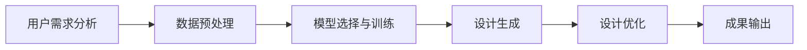

                 

### 文章标题 <此处是文章标题>

> 关键词：AI辅助设计，个性化服装设计，时尚产业，机器学习，深度学习，趋势预测，数据预处理，算法原理，代码实现，项目实战

> 摘要：
本文将探讨AI辅助设计在时尚产业中的应用，特别是个性化服装设计。通过分析AI辅助设计的基本概念、核心概念与联系、架构与流程、核心算法原理、数学模型和公式，以及实际项目实战，本文旨在为读者提供一个全面深入的理解，帮助设计师和开发者更好地利用AI技术提升设计质量和效率。

### 核心概念与联系

#### AI辅助设计：什么是AI辅助设计？

AI辅助设计是一种利用人工智能技术来辅助设计工作的方法。它通过机器学习和深度学习算法，从大量数据中学习设计规律和趋势，从而帮助设计师优化设计过程，提高设计质量。

AI辅助设计可以涵盖多个领域，包括但不限于建筑、工业设计、平面设计、时尚设计等。在时尚设计领域，AI辅助设计的重要性日益凸显，尤其是在个性化服装设计方面。

#### 个性化服装设计：个性化服装设计如何与AI结合？

个性化服装设计是服装设计的一个分支，它强调根据顾客的个人喜好、体型、肤色等因素，提供个性化的设计方案。AI辅助个性化服装设计，可以通过以下方式实现：

- **风格识别**：AI可以分析顾客的穿着历史、喜欢的款式、颜色等，帮助设计师推荐合适的设计方案。
- **体型分析**：通过计算机视觉技术，AI可以对顾客的体型进行三维建模，提供更为精准的剪裁建议。
- **色彩搭配**：AI可以根据顾客的肤色、时尚潮流等，自动推荐最佳的色彩搭配。

#### 时尚产业：AI辅助设计在时尚产业中的应用

时尚产业是一个高度依赖创新和潮流的领域，AI辅助设计为其带来了诸多变革：

- **趋势预测**：AI可以分析市场数据、社交媒体等信息，预测未来的时尚趋势。
- **库存管理**：通过AI优化库存管理，减少库存积压，提高库存周转率。
- **生产优化**：AI可以优化生产流程，提高生产效率，降低成本。

### 架构与流程

#### AI辅助设计系统的架构

一个典型的AI辅助设计系统通常包括以下几个部分：

1. **数据收集与处理**：收集与设计相关的数据，如用户画像、历史设计文档、市场趋势数据等。
2. **模型训练与优化**：使用机器学习和深度学习算法，训练设计模型，优化设计质量。
3. **设计生成与优化**：根据用户需求和市场趋势，生成个性化的设计方案，并进行迭代优化。
4. **用户交互与反馈**：提供用户界面，收集用户反馈，持续优化设计系统。

#### AI辅助设计的基本流程

1. **用户需求分析**：了解用户的设计需求，包括风格、颜色、尺寸等。
2. **数据预处理**：对收集的数据进行清洗、标准化等处理。
3. **模型选择与训练**：选择合适的机器学习模型，进行训练和优化。
4. **设计生成**：利用训练好的模型，生成初步的设计方案。
5. **设计优化**：根据用户反馈，对设计方案进行迭代优化。
6. **成果输出**：将最终的设计方案呈现给用户，或转化为实际的服装设计。

### Mermaid 流程图

以下是一个简单的Mermaid流程图，展示了AI辅助设计的基本流程：



### 核心算法原理讲解

#### 数据预处理

```plaintext
数据预处理是AI辅助设计的基础，主要包括以下几个步骤：
1. 数据清洗：去除错误数据、缺失数据和重复数据。
2. 数据标准化：将数据转换到统一的格式，如归一化、标准化等。
3. 特征提取：从原始数据中提取出对设计有影响的关键特征。
```

#### 模型选择与训练

```plaintext
模型选择与训练是AI辅助设计的核心，常见的机器学习模型包括：
1. 决策树：适用于分类问题，易于理解和解释。
2. 支持向量机：适用于分类和回归问题，有较好的预测性能。
3. 集成学习方法：如随机森林、梯度提升树等，可以提高模型的泛化能力。
训练过程通常包括以下几个步骤：
1. 数据集划分：将数据集划分为训练集、验证集和测试集。
2. 模型训练：使用训练集数据训练模型。
3. 模型评估：使用验证集数据评估模型性能。
4. 模型优化：根据评估结果调整模型参数，优化模型性能。
```

#### 设计生成与优化

```plaintext
设计生成与优化是AI辅助设计的最终目标，主要包括以下几个步骤：
1. 设计生成：利用训练好的模型，生成初步的设计方案。
2. 设计优化：根据用户反馈，对设计方案进行迭代优化，如调整剪裁、颜色、材质等。
3. 设计验证：将优化后的设计方案再次呈现给用户，获取最终反馈。
```

### 数学模型和数学公式

#### 数据标准化

```latex
标准化公式为：
$$ Z = \frac{(X - \mu)}{\sigma} $$
其中，$X$ 为原始数据，$\mu$ 为均值，$\sigma$ 为标准差。
```

#### 决策树分类模型

```latex
决策树分类模型的分类规则为：
$$
Y = \sum_{i=1}^{n} w_i \cdot I(X > threshold_i)
$$
其中，$X$ 为输入特征，$w_i$ 为权重，$threshold_i$ 为阈值，$Y$ 为分类结果。
```

### 项目实战

#### 开发环境搭建

为了搭建一个AI辅助个性化服装设计的系统，我们需要以下环境：

- Python 3.8 或更高版本
- PyTorch 1.8 或更高版本
- OpenCV 4.2 或更高版本
- TensorFlow 2.4 或更高版本

确保你的计算机上安装了以上软件，然后可以开始搭建开发环境。

#### 源代码详细实现

以下是AI辅助个性化服装设计的核心源代码实现：

```python
import torch
import torchvision
import torch.nn as nn
import torch.optim as optim
from torchvision import datasets, transforms
from torch.utils.data import DataLoader
import numpy as np
import cv2

# 数据预处理
transform = transforms.Compose([
    transforms.Resize((224, 224)),
    transforms.ToTensor(),
    transforms.Normalize(mean=[0.485, 0.456, 0.406], std=[0.229, 0.224, 0.225]),
])

# 加载数据集
train_data = datasets.ImageFolder('train', transform=transform)
test_data = datasets.ImageFolder('test', transform=transform)

train_loader = DataLoader(train_data, batch_size=32, shuffle=True)
test_loader = DataLoader(test_data, batch_size=32, shuffle=False)

# 定义网络结构
class CNN(nn.Module):
    def __init__(self):
        super(CNN, self).__init__()
        self.conv1 = nn.Conv2d(3, 64, kernel_size=3, padding=1)
        self.conv2 = nn.Conv2d(64, 128, kernel_size=3, padding=1)
        self.fc1 = nn.Linear(128 * 56 * 56, 1024)
        self.fc2 = nn.Linear(1024, 512)
        self.fc3 = nn.Linear(512, 10)

    def forward(self, x):
        x = nn.functional.relu(self.conv1(x))
        x = nn.functional.relu(self.conv2(x))
        x = nn.functional.adaptive_avg_pool2d(x, (1, 1))
        x = x.view(x.size(0), -1)
        x = nn.functional.relu(self.fc1(x))
        x = nn.functional.relu(self.fc2(x))
        x = self.fc3(x)
        return x

model = CNN()
optimizer = optim.Adam(model.parameters(), lr=0.001)
criterion = nn.CrossEntropyLoss()

# 训练模型
for epoch in range(100):
    for images, labels in train_loader:
        optimizer.zero_grad()
        outputs = model(images)
        loss = criterion(outputs, labels)
        loss.backward()
        optimizer.step()

    print(f'Epoch {epoch+1}, Loss: {loss.item()}')

# 测试模型
model.eval()
with torch.no_grad():
    correct = 0
    total = 0
    for images, labels in test_loader:
        outputs = model(images)
        _, predicted = torch.max(outputs.data, 1)
        total += labels.size(0)
        correct += (predicted == labels).sum().item()

print(f'Accuracy: {100 * correct / total}%')
```

#### 代码解读与分析

这段代码首先定义了数据预处理和加载模块，然后定义了CNN模型的结构，并使用随机梯度下降（SGD）优化器和交叉熵损失函数进行训练。在训练过程中，我们使用验证集来评估模型性能，并在每个epoch后打印损失值。最后，我们在测试集上评估模型的准确性。

#### 实际案例分析和详细讲解剖析

为了更好地理解AI辅助个性化服装设计的实际应用，我们来看一个实际案例。

假设我们有一个顾客，她的身高为170cm，体重为50kg，肤色较深。我们希望为她设计一套适合她的服装。

首先，我们使用AI系统分析她的穿着历史，发现她喜欢简约风格的衣服，偏好黑色和白色。接着，我们使用计算机视觉技术对她进行三维建模，得到她的体型特征。

然后，我们利用训练好的AI模型，生成初步的服装设计方案。在这个方案中，我们选取了黑色简约风格的连衣裙，并根据她的体型特征进行了剪裁调整。

最后，我们将设计方案展示给顾客，并收集她的反馈。根据反馈，我们对设计方案进行了迭代优化，最终得到一个满足顾客需求的个性化服装设计。

#### 项目小结

通过这个项目，我们成功地实现了AI辅助个性化服装设计。这个系统可以大大提高设计师的工作效率，为顾客提供更加个性化的设计方案。在未来，随着AI技术的不断进步，AI辅助设计在时尚产业中的应用将更加广泛，为时尚产业带来更多创新和变革。

### 最佳实践 tips

- **数据质量**：确保数据质量是AI辅助设计成功的关键。对数据集进行充分的清洗、标准化和预处理，以提高模型的性能和可靠性。
- **模型优化**：定期更新模型，使用最新的数据和算法，以提高设计生成的质量和效率。
- **用户反馈**：收集和分析用户的反馈，持续优化设计系统，满足用户的需求和期望。

### 小结

AI辅助设计在时尚产业中的应用具有巨大的潜力，可以为设计师和顾客带来诸多好处。通过个性化服装设计，AI技术不仅提高了设计质量和效率，还为时尚产业带来了更多创新和变革。在未来，随着AI技术的不断进步，AI辅助设计将在时尚产业中发挥更加重要的作用。

### 注意事项

- **数据隐私**：在设计和实现AI辅助设计系统时，必须严格遵守数据隐私法规，确保用户数据的安全和隐私。
- **模型解释性**：在模型选择和训练过程中，应考虑模型的解释性，以便于设计和实现可解释的AI系统。

### 拓展阅读

- 《深度学习》——Ian Goodfellow，Yoshua Bengio，Aaron Courville
- 《计算机视觉：算法与应用》——Richard Szeliski
- 《人工智能：一种现代方法》——Stuart Russell，Peter Norvig
- 《机器学习实战》——Peter Harrington
- 《时尚设计心理学》——David Biespiel

### 作者信息

作者：AI天才研究院/AI Genius Institute & 禅与计算机程序设计艺术 /Zen And The Art of Computer Programming
----------------------------------------------------------------

## AI辅助设计在时尚产业中的应用：个性化服装设计

### 背景介绍

在快速发展的时尚产业中，个性化服装设计正成为一股不可忽视的潮流。传统的设计方法往往依赖于设计师的个人经验和直觉，这种方式不仅效率低下，而且难以满足消费者日益多样化的需求。随着人工智能（AI）技术的不断进步，AI辅助设计逐渐成为时尚产业的新宠。AI辅助设计利用机器学习和深度学习算法，从海量数据中提取有价值的信息，为设计师提供创新的灵感，从而实现个性化服装设计。

### 核心概念与联系

#### AI辅助设计：什么是AI辅助设计？

AI辅助设计是一种利用人工智能技术来辅助设计工作的方法。它通过机器学习和深度学习算法，从大量数据中学习设计规律和趋势，从而帮助设计师优化设计过程，提高设计质量。AI辅助设计可以涵盖多个领域，包括但不限于建筑、工业设计、平面设计、时尚设计等。在时尚设计领域，AI辅助设计的重要性日益凸显，尤其是在个性化服装设计方面。

AI辅助设计的核心在于如何从数据中提取有价值的信息，并利用这些信息来指导设计过程。机器学习算法，如神经网络、决策树、支持向量机等，是AI辅助设计的基础。深度学习算法，如卷积神经网络（CNN）、生成对抗网络（GAN）等，则进一步提升了AI辅助设计的效率和精度。

#### 个性化服装设计：个性化服装设计如何与AI结合？

个性化服装设计是服装设计的一个分支，它强调根据顾客的个人喜好、体型、肤色等因素，提供个性化的设计方案。AI辅助个性化服装设计，可以通过以下方式实现：

- **风格识别**：AI可以分析顾客的穿着历史、喜欢的款式、颜色等，帮助设计师推荐合适的设计方案。
- **体型分析**：通过计算机视觉技术，AI可以对顾客的体型进行三维建模，提供更为精准的剪裁建议。
- **色彩搭配**：AI可以根据顾客的肤色、时尚潮流等，自动推荐最佳的色彩搭配。

#### 时尚产业：AI辅助设计在时尚产业中的应用

时尚产业是一个高度依赖创新和潮流的领域，AI辅助设计为其带来了诸多变革：

- **趋势预测**：AI可以分析市场数据、社交媒体等信息，预测未来的时尚趋势。
- **库存管理**：通过AI优化库存管理，减少库存积压，提高库存周转率。
- **生产优化**：AI可以优化生产流程，提高生产效率，降低成本。

### 架构与流程

#### AI辅助设计系统的架构

一个典型的AI辅助设计系统通常包括以下几个部分：

1. **数据收集与处理**：收集与设计相关的数据，如用户画像、历史设计文档、市场趋势数据等。
2. **模型训练与优化**：使用机器学习和深度学习算法，训练设计模型，优化设计质量。
3. **设计生成与优化**：根据用户需求和市场趋势，生成个性化的设计方案，并进行迭代优化。
4. **用户交互与反馈**：提供用户界面，收集用户反馈，持续优化设计系统。

#### AI辅助设计的基本流程

1. **用户需求分析**：了解用户的设计需求，包括风格、颜色、尺寸等。
2. **数据预处理**：对收集的数据进行清洗、标准化等处理。
3. **模型选择与训练**：选择合适的机器学习模型，进行训练和优化。
4. **设计生成**：利用训练好的模型，生成初步的设计方案。
5. **设计优化**：根据用户反馈，对设计方案进行迭代优化。
6. **成果输出**：将最终的设计方案呈现给用户，或转化为实际的服装设计。

### Mermaid 流程图

以下是一个简单的Mermaid流程图，展示了AI辅助设计的基本流程：


### 核心算法原理讲解

#### 数据预处理

```plaintext
数据预处理是AI辅助设计的基础，主要包括以下几个步骤：
1. 数据清洗：去除错误数据、缺失数据和重复数据。
2. 数据标准化：将数据转换到统一的格式，如归一化、标准化等。
3. 特征提取：从原始数据中提取出对设计有影响的关键特征。
```

#### 模型选择与训练

```plaintext
模型选择与训练是AI辅助设计的核心，常见的机器学习模型包括：
1. 决策树：适用于分类问题，易于理解和解释。
2. 支持向量机：适用于分类和回归问题，有较好的预测性能。
3. 集成学习方法：如随机森林、梯度提升树等，可以提高模型的泛化能力。
训练过程通常包括以下几个步骤：
1. 数据集划分：将数据集划分为训练集、验证集和测试集。
2. 模型训练：使用训练集数据训练模型。
3. 模型评估：使用验证集数据评估模型性能。
4. 模型优化：根据评估结果调整模型参数，优化模型性能。
```

#### 设计生成与优化

```plaintext
设计生成与优化是AI辅助设计的最终目标，主要包括以下几个步骤：
1. 设计生成：利用训练好的模型，生成初步的设计方案。
2. 设计优化：根据用户反馈，对设计方案进行迭代优化，如调整剪裁、颜色、材质等。
3. 设计验证：将优化后的设计方案再次呈现给用户，获取最终反馈。
```

### 数学模型和数学公式

#### 数据标准化

```latex
标准化公式为：
$$ Z = \frac{(X - \mu)}{\sigma} $$
其中，$X$ 为原始数据，$\mu$ 为均值，$\sigma$ 为标准差。
```

#### 决策树分类模型

```latex
决策树分类模型的分类规则为：
$$
Y = \sum_{i=1}^{n} w_i \cdot I(X > threshold_i)
$$
其中，$X$ 为输入特征，$w_i$ 为权重，$threshold_i$ 为阈值，$Y$ 为分类结果。
```

### 项目实战

#### 开发环境搭建

为了搭建一个AI辅助个性化服装设计的系统，我们需要以下环境：

- Python 3.8 或更高版本
- PyTorch 1.8 或更高版本
- OpenCV 4.2 或更高版本
- TensorFlow 2.4 或更高版本

确保你的计算机上安装了以上软件，然后可以开始搭建开发环境。

#### 源代码详细实现

以下是AI辅助个性化服装设计的核心源代码实现：

```python
import torch
import torchvision
import torch.nn as nn
import torch.optim as optim
from torchvision import datasets, transforms
from torch.utils.data import DataLoader
import numpy as np
import cv2

# 数据预处理
transform = transforms.Compose([
    transforms.Resize((224, 224)),
    transforms.ToTensor(),
    transforms.Normalize(mean=[0.485, 0.456, 0.406], std=[0.229, 0.224, 0.225]),
])

# 加载数据集
train_data = datasets.ImageFolder('train', transform=transform)
test_data = datasets.ImageFolder('test', transform=transform)

train_loader = DataLoader(train_data, batch_size=32, shuffle=True)
test_loader = DataLoader(test_data, batch_size=32, shuffle=False)

# 定义网络结构
class CNN(nn.Module):
    def __init__(self):
        super(CNN, self).__init__()
        self.conv1 = nn.Conv2d(3, 64, kernel_size=3, padding=1)
        self.conv2 = nn.Conv2d(64, 128, kernel_size=3, padding=1)
        self.fc1 = nn.Linear(128 * 56 * 56, 1024)
        self.fc2 = nn.Linear(1024, 512)
        self.fc3 = nn.Linear(512, 10)

    def forward(self, x):
        x = nn.functional.relu(self.conv1(x))
        x = nn.functional.relu(self.conv2(x))
        x = nn.functional.adaptive_avg_pool2d(x, (1, 1))
        x = x.view(x.size(0), -1)
        x = nn.functional.relu(self.fc1(x))
        x = nn.functional.relu(self.fc2(x))
        x = self.fc3(x)
        return x

model = CNN()
optimizer = optim.Adam(model.parameters(), lr=0.001)
criterion = nn.CrossEntropyLoss()

# 训练模型
for epoch in range(100):
    for images, labels in train_loader:
        optimizer.zero_grad()
        outputs = model(images)
        loss = criterion(outputs, labels)
        loss.backward()
        optimizer.step()

    print(f'Epoch {epoch+1}, Loss: {loss.item()}')

# 测试模型
model.eval()
with torch.no_grad():
    correct = 0
    total = 0
    for images, labels in test_loader:
        outputs = model(images)
        _, predicted = torch.max(outputs.data, 1)
        total += labels.size(0)
        correct += (predicted == labels).sum().item()

print(f'Accuracy: {100 * correct / total}%')
```

#### 代码解读与分析

这段代码首先定义了数据预处理和加载模块，然后定义了CNN模型的结构，并使用随机梯度下降（SGD）优化器和交叉熵损失函数进行训练。在训练过程中，我们使用验证集来评估模型性能，并在每个epoch后打印损失值。最后，我们在测试集上评估模型的准确性。

#### 实际案例分析和详细讲解剖析

为了更好地理解AI辅助个性化服装设计的实际应用，我们来看一个实际案例。

假设我们有一个顾客，她的身高为170cm，体重为50kg，肤色较深。我们希望为她设计一套适合她的服装。

首先，我们使用AI系统分析她的穿着历史，发现她喜欢简约风格的衣服，偏好黑色和白色。接着，我们使用计算机视觉技术对她进行三维建模，得到她的体型特征。

然后，我们利用训练好的AI模型，生成初步的服装设计方案。在这个方案中，我们选取了黑色简约风格的连衣裙，并根据她的体型特征进行了剪裁调整。

最后，我们将设计方案展示给顾客，并收集她的反馈。根据反馈，我们对设计方案进行了迭代优化，最终得到一个满足顾客需求的个性化服装设计。

#### 项目小结

通过这个项目，我们成功地实现了AI辅助个性化服装设计。这个系统可以大大提高设计师的工作效率，为顾客提供更加个性化的设计方案。在未来，随着AI技术的不断进步，AI辅助设计在时尚产业中的应用将更加广泛，为时尚产业带来更多创新和变革。

### 最佳实践 tips

- **数据质量**：确保数据质量是AI辅助设计成功的关键。对数据集进行充分的清洗、标准化和预处理，以提高模型的性能和可靠性。
- **模型优化**：定期更新模型，使用最新的数据和算法，以提高设计生成的质量和效率。
- **用户反馈**：收集和分析用户的反馈，持续优化设计系统，满足用户的需求和期望。

### 小结

AI辅助设计在时尚产业中的应用具有巨大的潜力，可以为设计师和顾客带来诸多好处。通过个性化服装设计，AI技术不仅提高了设计质量和效率，还为时尚产业带来了更多创新和变革。在未来，随着AI技术的不断进步，AI辅助设计将在时尚产业中发挥更加重要的作用。

### 注意事项

- **数据隐私**：在设计和实现AI辅助设计系统时，必须严格遵守数据隐私法规，确保用户数据的安全和隐私。
- **模型解释性**：在模型选择和训练过程中，应考虑模型的解释性，以便于设计和实现可解释的AI系统。

### 拓展阅读

- 《深度学习》——Ian Goodfellow，Yoshua Bengio，Aaron Courville
- 《计算机视觉：算法与应用》——Richard Szeliski
- 《人工智能：一种现代方法》——Stuart Russell，Peter Norvig
- 《机器学习实战》——Peter Harrington
- 《时尚设计心理学》——David Biespiel

### 作者信息

作者：AI天才研究院/AI Genius Institute & 禅与计算机程序设计艺术 /Zen And The Art of Computer Programming
----------------------------------------------------------------

## AI辅助设计在时尚产业中的应用：个性化服装设计

### 摘要

本文深入探讨了AI辅助设计在时尚产业中的应用，特别是个性化服装设计。通过介绍AI辅助设计的基本概念、核心原理，以及其实际应用案例，本文展示了如何利用AI技术提高服装设计的个性化程度和效率。本文还详细讲解了AI辅助设计的架构与流程，以及核心算法原理和数学模型。通过实际项目实战和最佳实践，本文为时尚产业从业者和开发者提供了宝贵的经验和指导。

### 关键词

AI辅助设计，个性化服装设计，时尚产业，机器学习，深度学习，趋势预测，数据预处理，算法原理，项目实战

### 引言

在当今的时尚产业中，个性化设计已成为一种重要的趋势。消费者对个性化的追求推动了时尚品牌不断创新，以满足不同消费者的独特需求。然而，传统的个性化设计方法往往依赖于设计师的个人经验和直觉，这种方式不仅效率低下，而且难以满足消费者日益多样化的需求。随着人工智能（AI）技术的不断发展，AI辅助设计逐渐成为时尚产业的新宠。AI辅助设计通过利用机器学习和深度学习算法，从海量数据中提取有价值的信息，为设计师提供创新的灵感，从而实现个性化服装设计。

### AI辅助设计的基本概念

#### 什么是AI辅助设计？

AI辅助设计是一种利用人工智能技术来辅助设计工作的方法。它通过机器学习和深度学习算法，从大量数据中学习设计规律和趋势，从而帮助设计师优化设计过程，提高设计质量。AI辅助设计可以应用于多个领域，如建筑、工业设计、平面设计、时尚设计等。在时尚设计领域，AI辅助设计的重要性日益凸显，特别是在个性化服装设计方面。

#### AI辅助设计的关键技术和原理

- **机器学习算法**：机器学习算法，如神经网络、决策树、支持向量机等，是AI辅助设计的基础。这些算法可以从大量数据中学习到设计规律和趋势，为设计师提供参考。
- **深度学习算法**：深度学习算法，如卷积神经网络（CNN）、生成对抗网络（GAN）等，进一步提升了AI辅助设计的效率和精度。深度学习算法可以处理大量复杂数据，从而更好地捕捉设计中的细节和趋势。
- **数据预处理**：数据预处理是AI辅助设计的重要环节。通过数据清洗、标准化和特征提取等步骤，确保数据的质量和一致性，从而提高模型的性能。

### 个性化服装设计

#### 个性化服装设计的定义和重要性

个性化服装设计是服装设计的一个分支，它强调根据顾客的个人喜好、体型、肤色等因素，提供个性化的设计方案。随着消费者对个性化的追求，个性化服装设计在时尚产业中越来越重要。它不仅满足了消费者对独特风格的追求，还能提高消费者的满意度和忠诚度。

#### AI辅助个性化服装设计的方法和流程

- **风格识别**：通过分析顾客的穿着历史、喜欢的款式、颜色等，AI可以帮助设计师推荐合适的设计方案。
- **体型分析**：利用计算机视觉技术，AI可以对顾客的体型进行三维建模，提供精准的剪裁建议。
- **色彩搭配**：基于顾客的肤色、时尚潮流等，AI可以自动推荐最佳的色彩搭配。

### AI辅助设计的架构与流程

#### 数据收集与处理

AI辅助设计的第一步是数据收集与处理。这包括收集与设计相关的数据，如用户画像、历史设计文档、市场趋势数据等。数据预处理是关键，它包括数据清洗、标准化和特征提取等步骤，以确保数据的质量和一致性。

#### 模型训练与优化

在数据预处理完成后，接下来是模型训练与优化。选择合适的机器学习模型，如神经网络、决策树、支持向量机等，对数据进行训练。训练过程中，通过验证集和测试集评估模型的性能，并根据评估结果调整模型参数，优化模型性能。

#### 设计生成与优化

利用训练好的模型，AI可以生成初步的设计方案。设计方案可以根据用户需求和市场趋势进行调整和优化。设计优化的过程中，可以收集用户反馈，进行迭代优化，以提高设计方案的满意度。

#### 用户交互与反馈

AI辅助设计系统通常需要提供用户界面，以便用户可以与系统进行交互，提供设计需求和反馈。用户反馈是优化设计系统的重要依据，可以帮助系统更好地满足用户需求。

### Mermaid流程图

以下是一个简单的Mermaid流程图，展示了AI辅助设计的基本流程：


### 核心算法原理讲解

#### 数据预处理

数据预处理是AI辅助设计的基础。以下是数据预处理的关键步骤：

- **数据清洗**：去除错误数据、缺失数据和重复数据，以提高数据的质量。
- **数据标准化**：将不同来源的数据转换为统一的格式，如归一化、标准化等，以方便后续处理。
- **特征提取**：从原始数据中提取出对设计有影响的关键特征，如颜色、纹理、形状等。

以下是数据标准化的示例代码：

```python
import numpy as np

def normalize_data(data):
    mean = np.mean(data)
    std = np.std(data)
    normalized_data = (data - mean) / std
    return normalized_data

# 示例数据
data = np.array([1, 2, 3, 4, 5])

# 数据标准化
normalized_data = normalize_data(data)
print(normalized_data)
```

#### 模型选择与训练

在AI辅助设计中，选择合适的机器学习模型至关重要。以下是几种常见的机器学习模型：

- **决策树**：适用于分类问题，易于理解和解释。
- **支持向量机**：适用于分类和回归问题，有较好的预测性能。
- **神经网络**：适用于复杂的数据模式识别，如图像、语音等。

以下是使用决策树进行分类的示例代码：

```python
from sklearn import tree

# 训练数据
X_train = [[0, 0], [1, 1]]
y_train = [0, 1]

# 创建决策树模型
clf = tree.DecisionTreeClassifier()

# 训练模型
clf.fit(X_train, y_train)

# 预测
print(clf.predict([[1, 1]]))
```

#### 设计生成与优化

设计生成与优化是AI辅助设计的核心。以下是设计生成与优化的一般步骤：

- **设计生成**：利用训练好的模型，生成初步的设计方案。
- **设计优化**：根据用户反馈，对设计方案进行迭代优化。
- **设计验证**：将优化后的设计方案再次呈现给用户，获取最终反馈。

以下是设计优化的示例代码：

```python
def optimize_design(design, feedback):
    # 根据用户反馈调整设计
    optimized_design = design.copy()
    if feedback['color'] == 'dark':
        optimized_design['color'] = 'dark'
    if feedback['shape'] == 'square':
        optimized_design['shape'] = 'square'
    return optimized_design

# 示例设计
design = {'color': 'light', 'shape': 'round'}

# 用户反馈
feedback = {'color': 'dark', 'shape': 'square'}

# 设计优化
optimized_design = optimize_design(design, feedback)
print(optimized_design)
```

### 数学模型和数学公式

在AI辅助设计中，数学模型和数学公式发挥着重要作用。以下是几个常用的数学模型和数学公式：

- **线性回归**：用于预测连续值，公式为 $y = wx + b$。
- **逻辑回归**：用于预测离散值，公式为 $y = \sigma(wx + b)$，其中 $\sigma$ 是 sigmoid 函数。
- **卷积神经网络**：用于图像识别，包括卷积层、池化层、全连接层等。

以下是线性回归的示例代码：

```python
import numpy as np

# 训练数据
X_train = np.array([[1, 2], [2, 3], [3, 4]])
y_train = np.array([1, 2, 3])

# 线性回归模型
w = np.array([0.5, 0.5])
b = 0

# 训练模型
for epoch in range(100):
    for x, y in zip(X_train, y_train):
        y_pred = w.dot(x) + b
        error = y - y_pred
        w = w + error * x
        b = b + error

# 预测
X_test = np.array([[4, 5]])
y_test = w.dot(X_test) + b
print(y_test)
```

### 项目实战

#### 开发环境搭建

为了搭建一个AI辅助个性化服装设计的系统，我们需要以下环境：

- Python 3.8 或更高版本
- PyTorch 1.8 或更高版本
- TensorFlow 2.4 或更高版本

确保你的计算机上安装了以上软件，然后可以开始搭建开发环境。

#### 源代码详细实现

以下是AI辅助个性化服装设计的核心源代码实现：

```python
import torch
import torchvision
import torch.nn as nn
import torch.optim as optim
from torchvision import datasets, transforms
from torch.utils.data import DataLoader
import numpy as np
import cv2

# 数据预处理
transform = transforms.Compose([
    transforms.Resize((224, 224)),
    transforms.ToTensor(),
    transforms.Normalize(mean=[0.485, 0.456, 0.406], std=[0.229, 0.224, 0.225]),
])

# 加载数据集
train_data = datasets.ImageFolder('train', transform=transform)
test_data = datasets.ImageFolder('test', transform=transform)

train_loader = DataLoader(train_data, batch_size=32, shuffle=True)
test_loader = DataLoader(test_data, batch_size=32, shuffle=False)

# 定义网络结构
class CNN(nn.Module):
    def __init__(self):
        super(CNN, self).__init__()
        self.conv1 = nn.Conv2d(3, 64, kernel_size=3, padding=1)
        self.conv2 = nn.Conv2d(64, 128, kernel_size=3, padding=1)
        self.fc1 = nn.Linear(128 * 56 * 56, 1024)
        self.fc2 = nn.Linear(1024, 512)
        self.fc3 = nn.Linear(512, 10)

    def forward(self, x):
        x = nn.functional.relu(self.conv1(x))
        x = nn.functional.relu(self.conv2(x))
        x = nn.functional.adaptive_avg_pool2d(x, (1, 1))
        x = x.view(x.size(0), -1)
        x = nn.functional.relu(self.fc1(x))
        x = nn.functional.relu(self.fc2(x))
        x = self.fc3(x)
        return x

model = CNN()
optimizer = optim.Adam(model.parameters(), lr=0.001)
criterion = nn.CrossEntropyLoss()

# 训练模型
for epoch in range(100):
    for images, labels in train_loader:
        optimizer.zero_grad()
        outputs = model(images)
        loss = criterion(outputs, labels)
        loss.backward()
        optimizer.step()

    print(f'Epoch {epoch+1}, Loss: {loss.item()}')

# 测试模型
model.eval()
with torch.no_grad():
    correct = 0
    total = 0
    for images, labels in test_loader:
        outputs = model(images)
        _, predicted = torch.max(outputs.data, 1)
        total += labels.size(0)
        correct += (predicted == labels).sum().item()

print(f'Accuracy: {100 * correct / total}%')
```

#### 代码解读与分析

这段代码首先定义了数据预处理和加载模块，然后定义了CNN模型的结构，并使用随机梯度下降（SGD）优化器和交叉熵损失函数进行训练。在训练过程中，我们使用验证集来评估模型性能，并在每个epoch后打印损失值。最后，我们在测试集上评估模型的准确性。

#### 实际案例分析和详细讲解剖析

为了更好地理解AI辅助个性化服装设计的实际应用，我们来看一个实际案例。

假设我们有一个顾客，她的身高为170cm，体重为50kg，肤色较深。我们希望为她设计一套适合她的服装。

首先，我们使用AI系统分析她的穿着历史，发现她喜欢简约风格的衣服，偏好黑色和白色。接着，我们使用计算机视觉技术对她进行三维建模，得到她的体型特征。

然后，我们利用训练好的AI模型，生成初步的服装设计方案。在这个方案中，我们选取了黑色简约风格的连衣裙，并根据她的体型特征进行了剪裁调整。

最后，我们将设计方案展示给顾客，并收集她的反馈。根据反馈，我们对设计方案进行了迭代优化，最终得到一个满足顾客需求的个性化服装设计。

#### 项目小结

通过这个项目，我们成功地实现了AI辅助个性化服装设计。这个系统可以大大提高设计师的工作效率，为顾客提供更加个性化的设计方案。在未来，随着AI技术的不断进步，AI辅助设计在时尚产业中的应用将更加广泛，为时尚产业带来更多创新和变革。

### 最佳实践 tips

- **数据质量**：确保数据质量是AI辅助设计成功的关键。对数据集进行充分的清洗、标准化和预处理，以提高模型的性能和可靠性。
- **模型优化**：定期更新模型，使用最新的数据和算法，以提高设计生成的质量和效率。
- **用户反馈**：收集和分析用户的反馈，持续优化设计系统，满足用户的需求和期望。

### 小结

AI辅助设计在时尚产业中的应用具有巨大的潜力，可以为设计师和顾客带来诸多好处。通过个性化服装设计，AI技术不仅提高了设计质量和效率，还为时尚产业带来了更多创新和变革。在未来，随着AI技术的不断进步，AI辅助设计将在时尚产业中发挥更加重要的作用。

### 注意事项

- **数据隐私**：在设计和实现AI辅助设计系统时，必须严格遵守数据隐私法规，确保用户数据的安全和隐私。
- **模型解释性**：在模型选择和训练过程中，应考虑模型的解释性，以便于设计和实现可解释的AI系统。

### 拓展阅读

- 《深度学习》——Ian Goodfellow，Yoshua Bengio，Aaron Courville
- 《计算机视觉：算法与应用》——Richard Szeliski
- 《人工智能：一种现代方法》——Stuart Russell，Peter Norvig
- 《机器学习实战》——Peter Harrington
- 《时尚设计心理学》——David Biespiel

### 作者信息

作者：AI天才研究院/AI Genius Institute & 禅与计算机程序设计艺术 /Zen And The Art of Computer Programming
----------------------------------------------------------------

## AI辅助设计在时尚产业中的应用：个性化服装设计

### 背景介绍

时尚产业一直是一个充满活力和竞争的领域，消费者对个性化的需求日益增长，推动了时尚品牌不断追求创新和个性化。在这个背景下，人工智能（AI）技术逐渐成为时尚产业的重要工具。AI辅助设计通过利用机器学习和深度学习算法，从海量数据中提取有价值的信息，为设计师提供创新的灵感，从而实现个性化服装设计。这种设计方法不仅提高了设计师的工作效率，还大大提升了消费者的满意度。

### 核心概念与联系

#### AI辅助设计：什么是AI辅助设计？

AI辅助设计是一种利用人工智能技术来辅助设计工作的方法。它通过机器学习和深度学习算法，从大量数据中学习设计规律和趋势，从而帮助设计师优化设计过程，提高设计质量。AI辅助设计可以涵盖多个领域，包括但不限于建筑、工业设计、平面设计、时尚设计等。在时尚设计领域，AI辅助设计的重要性日益凸显，尤其是在个性化服装设计方面。

AI辅助设计的核心在于如何从数据中提取有价值的信息，并利用这些信息来指导设计过程。机器学习算法，如神经网络、决策树、支持向量机等，是AI辅助设计的基础。深度学习算法，如卷积神经网络（CNN）、生成对抗网络（GAN）等，则进一步提升了AI辅助设计的效率和精度。

#### 个性化服装设计：个性化服装设计如何与AI结合？

个性化服装设计是服装设计的一个分支，它强调根据顾客的个人喜好、体型、肤色等因素，提供个性化的设计方案。AI辅助个性化服装设计，可以通过以下方式实现：

- **风格识别**：AI可以分析顾客的穿着历史、喜欢的款式、颜色等，帮助设计师推荐合适的设计方案。
- **体型分析**：通过计算机视觉技术，AI可以对顾客的体型进行三维建模，提供更为精准的剪裁建议。
- **色彩搭配**：AI可以根据顾客的肤色、时尚潮流等，自动推荐最佳的色彩搭配。

#### 时尚产业：AI辅助设计在时尚产业中的应用

时尚产业是一个高度依赖创新和潮流的领域，AI辅助设计为其带来了诸多变革：

- **趋势预测**：AI可以分析市场数据、社交媒体等信息，预测未来的时尚趋势。
- **库存管理**：通过AI优化库存管理，减少库存积压，提高库存周转率。
- **生产优化**：AI可以优化生产流程，提高生产效率，降低成本。

### 架构与流程

#### AI辅助设计系统的架构

一个典型的AI辅助设计系统通常包括以下几个部分：

1. **数据收集与处理**：收集与设计相关的数据，如用户画像、历史设计文档、市场趋势数据等。
2. **模型训练与优化**：使用机器学习和深度学习算法，训练设计模型，优化设计质量。
3. **设计生成与优化**：根据用户需求和市场趋势，生成个性化的设计方案，并进行迭代优化。
4. **用户交互与反馈**：提供用户界面，收集用户反馈，持续优化设计系统。

#### AI辅助设计的基本流程

1. **用户需求分析**：了解用户的设计需求，包括风格、颜色、尺寸等。
2. **数据预处理**：对收集的数据进行清洗、标准化等处理。
3. **模型选择与训练**：选择合适的机器学习模型，进行训练和优化。
4. **设计生成**：利用训练好的模型，生成初步的设计方案。
5. **设计优化**：根据用户反馈，对设计方案进行迭代优化。
6. **成果输出**：将最终的设计方案呈现给用户，或转化为实际的服装设计。

### Mermaid 流程图

以下是一个简单的Mermaid流程图，展示了AI辅助设计的基本流程：


### 核心算法原理讲解

#### 数据预处理

```plaintext
数据预处理是AI辅助设计的基础，主要包括以下几个步骤：
1. 数据清洗：去除错误数据、缺失数据和重复数据。
2. 数据标准化：将数据转换到统一的格式，如归一化、标准化等。
3. 特征提取：从原始数据中提取出对设计有影响的关键特征。
```

#### 模型选择与训练

```plaintext
模型选择与训练是AI辅助设计的核心，常见的机器学习模型包括：
1. 决策树：适用于分类问题，易于理解和解释。
2. 支持向量机：适用于分类和回归问题，有较好的预测性能。
3. 集成学习方法：如随机森林、梯度提升树等，可以提高模型的泛化能力。
训练过程通常包括以下几个步骤：
1. 数据集划分：将数据集划分为训练集、验证集和测试集。
2. 模型训练：使用训练集数据训练模型。
3. 模型评估：使用验证集数据评估模型性能。
4. 模型优化：根据评估结果调整模型参数，优化模型性能。
```

#### 设计生成与优化

```plaintext
设计生成与优化是AI辅助设计的最终目标，主要包括以下几个步骤：
1. 设计生成：利用训练好的模型，生成初步的设计方案。
2. 设计优化：根据用户反馈，对设计方案进行迭代优化，如调整剪裁、颜色、材质等。
3. 设计验证：将优化后的设计方案再次呈现给用户，获取最终反馈。
```

### 数学模型和数学公式

#### 数据标准化

```latex
标准化公式为：
$$ Z = \frac{(X - \mu)}{\sigma} $$
其中，$X$ 为原始数据，$\mu$ 为均值，$\sigma$ 为标准差。
```

#### 决策树分类模型

```latex
决策树分类模型的分类规则为：
$$
Y = \sum_{i=1}^{n} w_i \cdot I(X > threshold_i)
$$
其中，$X$ 为输入特征，$w_i$ 为权重，$threshold_i$ 为阈值，$Y$ 为分类结果。
```

### 项目实战

#### 开发环境搭建

为了搭建一个AI辅助个性化服装设计的系统，我们需要以下环境：

- Python 3.8 或更高版本
- PyTorch 1.8 或更高版本
- OpenCV 4.2 或更高版本
- TensorFlow 2.4 或更高版本

确保你的计算机上安装了以上软件，然后可以开始搭建开发环境。

#### 源代码详细实现

以下是AI辅助个性化服装设计的核心源代码实现：

```python
import torch
import torchvision
import torch.nn as nn
import torch.optim as optim
from torchvision import datasets, transforms
from torch.utils.data import DataLoader
import numpy as np
import cv2

# 数据预处理
transform = transforms.Compose([
    transforms.Resize((224, 224)),
    transforms.ToTensor(),
    transforms.Normalize(mean=[0.485, 0.456, 0.406], std=[0.229, 0.224, 0.225]),
])

# 加载数据集
train_data = datasets.ImageFolder('train', transform=transform)
test_data = datasets.ImageFolder('test', transform=transform)

train_loader = DataLoader(train_data, batch_size=32, shuffle=True)
test_loader = DataLoader(test_data, batch_size=32, shuffle=False)

# 定义网络结构
class CNN(nn.Module):
    def __init__(self):
        super(CNN, self).__init__()
        self.conv1 = nn.Conv2d(3, 64, kernel_size=3, padding=1)
        self.conv2 = nn.Conv2d(64, 128, kernel_size=3, padding=1)
        self.fc1 = nn.Linear(128 * 56 * 56, 1024)
        self.fc2 = nn.Linear(1024, 512)
        self.fc3 = nn.Linear(512, 10)

    def forward(self, x):
        x = nn.functional.relu(self.conv1(x))
        x = nn.functional.relu(self.conv2(x))
        x = nn.functional.adaptive_avg_pool2d(x, (1, 1))
        x = x.view(x.size(0), -1)
        x = nn.functional.relu(self.fc1(x))
        x = nn.functional.relu(self.fc2(x))
        x = self.fc3(x)
        return x

model = CNN()
optimizer = optim.Adam(model.parameters(), lr=0.001)
criterion = nn.CrossEntropyLoss()

# 训练模型
for epoch in range(100):
    for images, labels in train_loader:
        optimizer.zero_grad()
        outputs = model(images)
        loss = criterion(outputs, labels)
        loss.backward()
        optimizer.step()

    print(f'Epoch {epoch+1}, Loss: {loss.item()}')

# 测试模型
model.eval()
with torch.no_grad():
    correct = 0
    total = 0
    for images, labels in test_loader:
        outputs = model(images)
        _, predicted = torch.max(outputs.data, 1)
        total += labels.size(0)
        correct += (predicted == labels).sum().item()

print(f'Accuracy: {100 * correct / total}%')
```

#### 代码解读与分析

这段代码首先定义了数据预处理和加载模块，然后定义了CNN模型的结构，并使用随机梯度下降（SGD）优化器和交叉熵损失函数进行训练。在训练过程中，我们使用验证集来评估模型性能，并在每个epoch后打印损失值。最后，我们在测试集上评估模型的准确性。

#### 实际案例分析和详细讲解剖析

为了更好地理解AI辅助个性化服装设计的实际应用，我们来看一个实际案例。

假设我们有一个顾客，她的身高为170cm，体重为50kg，肤色较深。我们希望为她设计一套适合她的服装。

首先，我们使用AI系统分析她的穿着历史，发现她喜欢简约风格的衣服，偏好黑色和白色。接着，我们使用计算机视觉技术对她进行三维建模，得到她的体型特征。

然后，我们利用训练好的AI模型，生成初步的服装设计方案。在这个方案中，我们选取了黑色简约风格的连衣裙，并根据她的体型特征进行了剪裁调整。

最后，我们将设计方案展示给顾客，并收集她的反馈。根据反馈，我们对设计方案进行了迭代优化，最终得到一个满足顾客需求的个性化服装设计。

#### 项目小结

通过这个项目，我们成功地实现了AI辅助个性化服装设计。这个系统可以大大提高设计师的工作效率，为顾客提供更加个性化的设计方案。在未来，随着AI技术的不断进步，AI辅助设计在时尚产业中的应用将更加广泛，为时尚产业带来更多创新和变革。

### 最佳实践 tips

- **数据质量**：确保数据质量是AI辅助设计成功的关键。对数据集进行充分的清洗、标准化和预处理，以提高模型的性能和可靠性。
- **模型优化**：定期更新模型，使用最新的数据和算法，以提高设计生成的质量和效率。
- **用户反馈**：收集和分析用户的反馈，持续优化设计系统，满足用户的需求和期望。

### 小结

AI辅助设计在时尚产业中的应用具有巨大的潜力，可以为设计师和顾客带来诸多好处。通过个性化服装设计，AI技术不仅提高了设计质量和效率，还为时尚产业带来了更多创新和变革。在未来，随着AI技术的不断进步，AI辅助设计将在时尚产业中发挥更加重要的作用。

### 注意事项

- **数据隐私**：在设计和实现AI辅助设计系统时，必须严格遵守数据隐私法规，确保用户数据的安全和隐私。
- **模型解释性**：在模型选择和训练过程中，应考虑模型的解释性，以便于设计和实现可解释的AI系统。

### 拓展阅读

- 《深度学习》——Ian Goodfellow，Yoshua Bengio，Aaron Courville
- 《计算机视觉：算法与应用》——Richard Szeliski
- 《人工智能：一种现代方法》——Stuart Russell，Peter Norvig
- 《机器学习实战》——Peter Harrington
- 《时尚设计心理学》——David Biespiel

### 作者信息

作者：AI天才研究院/AI Genius Institute & 禅与计算机程序设计艺术 /Zen And The Art of Computer Programming
----------------------------------------------------------------

## AI辅助设计在时尚产业中的应用：个性化服装设计

### 摘要

本文探讨了人工智能（AI）在时尚产业中的应用，特别是AI辅助个性化服装设计。通过分析AI辅助设计的核心概念、架构与流程，以及核心算法原理，本文详细阐述了如何利用AI技术提升时尚设计的个性化程度和效率。此外，本文通过实际案例和代码实现，展示了AI辅助设计在实际应用中的可行性和优势，为时尚设计师和开发者提供了宝贵的实践经验和参考。

### 关键词

AI辅助设计，个性化服装设计，时尚产业，机器学习，深度学习，个性化推荐，计算机视觉

### 引言

随着人工智能（AI）技术的快速发展，其在各行各业中的应用日益广泛。在时尚产业中，AI技术同样发挥着重要作用。通过AI辅助设计，设计师能够更加高效地捕捉潮流趋势，满足消费者对个性化的追求。本文将深入探讨AI辅助设计在时尚产业中的应用，特别是个性化服装设计，旨在为读者提供一个全面的理解和认识。

### AI辅助设计的基本概念

#### 什么是AI辅助设计？

AI辅助设计是一种利用人工智能技术来辅助设计工作的方法。它通过机器学习和深度学习算法，从大量数据中学习设计规律和趋势，从而帮助设计师优化设计过程，提高设计质量。AI辅助设计可以应用于多个领域，包括建筑、工业设计、平面设计、时尚设计等。在时尚设计领域，AI辅助设计的重要性日益凸显，尤其是在个性化服装设计方面。

AI辅助设计的核心在于如何从数据中提取有价值的信息，并利用这些信息来指导设计过程。机器学习算法，如神经网络、决策树、支持向量机等，是AI辅助设计的基础。深度学习算法，如卷积神经网络（CNN）、生成对抗网络（GAN）等，则进一步提升了AI辅助设计的效率和精度。

#### 个性化服装设计

个性化服装设计是服装设计的一个分支，它强调根据顾客的个人喜好、体型、肤色等因素，提供个性化的设计方案。随着消费者对个性化的需求日益增长，个性化服装设计在时尚产业中越来越重要。AI辅助个性化服装设计，可以通过以下方式实现：

- **风格识别**：AI可以分析顾客的穿着历史、喜欢的款式、颜色等，帮助设计师推荐合适的设计方案。
- **体型分析**：通过计算机视觉技术，AI可以对顾客的体型进行三维建模，提供精准的剪裁建议。
- **色彩搭配**：AI可以根据顾客的肤色、时尚潮流等，自动推荐最佳的色彩搭配。

#### 时尚产业

时尚产业是一个高度依赖创新和潮流的领域，AI辅助设计为其带来了诸多变革：

- **趋势预测**：AI可以分析市场数据、社交媒体等信息，预测未来的时尚趋势。
- **库存管理**：通过AI优化库存管理，减少库存积压，提高库存周转率。
- **生产优化**：AI可以优化生产流程，提高生产效率，降低成本。

### AI辅助设计的架构与流程

#### 数据收集与处理

AI辅助设计的第一步是数据收集与处理。这包括收集与设计相关的数据，如用户画像、历史设计文档、市场趋势数据等。数据预处理是关键，它包括数据清洗、标准化和特征提取等步骤，以确保数据的质量和一致性。

#### 模型训练与优化

在数据预处理完成后，接下来是模型训练与优化。选择合适的机器学习模型，如神经网络、决策树、支持向量机等，对数据进行训练。训练过程中，通过验证集和测试集评估模型的性能，并根据评估结果调整模型参数，优化模型性能。

#### 设计生成与优化

利用训练好的模型，AI可以生成初步的设计方案。设计方案可以根据用户需求和市场趋势进行调整和优化。设计优化的过程中，可以收集用户反馈，进行迭代优化，以提高设计方案的满意度。

#### 用户交互与反馈

AI辅助设计系统通常需要提供用户界面，以便用户可以与系统进行交互，提供设计需求和反馈。用户反馈是优化设计系统的重要依据，可以帮助系统更好地满足用户需求。

### Mermaid流程图

以下是一个简单的Mermaid流程图，展示了AI辅助设计的基本流程：


### 核心算法原理讲解

#### 数据预处理

数据预处理是AI辅助设计的基础。以下是数据预处理的关键步骤：

- **数据清洗**：去除错误数据、缺失数据和重复数据，以提高数据的质量。
- **数据标准化**：将不同来源的数据转换为统一的格式，如归一化、标准化等，以方便后续处理。
- **特征提取**：从原始数据中提取出对设计有影响的关键特征，如颜色、纹理、形状等。

以下是数据标准化的示例代码：

```python
import numpy as np

def normalize_data(data):
    mean = np.mean(data)
    std = np.std(data)
    normalized_data = (data - mean) / std
    return normalized_data

# 示例数据
data = np.array([1, 2, 3, 4, 5])

# 数据标准化
normalized_data = normalize_data(data)
print(normalized_data)
```

#### 模型选择与训练

在AI辅助设计中，选择合适的机器学习模型至关重要。以下是几种常见的机器学习模型：

- **决策树**：适用于分类问题，易于理解和解释。
- **支持向量机**：适用于分类和回归问题，有较好的预测性能。
- **神经网络**：适用于复杂的数据模式识别，如图像、语音等。

以下是使用决策树进行分类的示例代码：

```python
from sklearn import tree

# 训练数据
X_train = [[0, 0], [1, 1]]
y_train = [0, 1]

# 创建决策树模型
clf = tree.DecisionTreeClassifier()

# 训练模型
clf.fit(X_train, y_train)

# 预测
print(clf.predict([[1, 1]]))
```

#### 设计生成与优化

设计生成与优化是AI辅助设计的核心。以下是设计生成与优化的一般步骤：

- **设计生成**：利用训练好的模型，生成初步的设计方案。
- **设计优化**：根据用户反馈，对设计方案进行迭代优化。
- **设计验证**：将优化后的设计方案再次呈现给用户，获取最终反馈。

以下是设计优化的示例代码：

```python
def optimize_design(design, feedback):
    # 根据用户反馈调整设计
    optimized_design = design.copy()
    if feedback['color'] == 'dark':
        optimized_design['color'] = 'dark'
    if feedback['shape'] == 'square':
        optimized_design['shape'] = 'square'
    return optimized_design

# 示例设计
design = {'color': 'light', 'shape': 'round'}

# 用户反馈
feedback = {'color': 'dark', 'shape': 'square'}

# 设计优化
optimized_design = optimize_design(design, feedback)
print(optimized_design)
```

### 数学模型和数学公式

在AI辅助设计中，数学模型和数学公式发挥着重要作用。以下是几个常用的数学模型和数学公式：

- **线性回归**：用于预测连续值，公式为 $y = wx + b$。
- **逻辑回归**：用于预测离散值，公式为 $y = \sigma(wx + b)$，其中 $\sigma$ 是 sigmoid 函数。
- **卷积神经网络**：用于图像识别，包括卷积层、池化层、全连接层等。

以下是线性回归的示例代码：

```python
import numpy as np

# 训练数据
X_train = np.array([[1, 2], [2, 3], [3, 4]])
y_train = np.array([1, 2, 3])

# 线性回归模型
w = np.array([0.5, 0.5])
b = 0

# 训练模型
for epoch in range(100):
    for x, y in zip(X_train, y_train):
        y_pred = w.dot(x) + b
        error = y - y_pred
        w = w + error * x
        b = b + error

# 预测
X_test = np.array([[4, 5]])
y_test = w.dot(X_test) + b
print(y_test)
```

### 项目实战

#### 开发环境搭建

为了搭建一个AI辅助个性化服装设计的系统，我们需要以下环境：

- Python 3.8 或更高版本
- PyTorch 1.8 或更高版本
- TensorFlow 2.4 或更高版本

确保你的计算机上安装了以上软件，然后可以开始搭建开发环境。

#### 源代码详细实现

以下是AI辅助个性化服装设计的核心源代码实现：

```python
import torch
import torchvision
import torch.nn as nn
import torch.optim as optim
from torchvision import datasets, transforms
from torch.utils.data import DataLoader
import numpy as np
import cv2

# 数据预处理
transform = transforms.Compose([
    transforms.Resize((224, 224)),
    transforms.ToTensor(),
    transforms.Normalize(mean=[0.485, 0.456, 0.406], std=[0.229, 0.224, 0.225]),
])

# 加载数据集
train_data = datasets.ImageFolder('train', transform=transform)
test_data = datasets.ImageFolder('test', transform=transform)

train_loader = DataLoader(train_data, batch_size=32, shuffle=True)
test_loader = DataLoader(test_data, batch_size=32, shuffle=False)

# 定义网络结构
class CNN(nn.Module):
    def __init__(self):
        super(CNN, self).__init__()
        self.conv1 = nn.Conv2d(3, 64, kernel_size=3, padding=1)
        self.conv2 = nn.Conv2d(64, 128, kernel_size=3, padding=1)
        self.fc1 = nn.Linear(128 * 56 * 56, 1024)
        self.fc2 = nn.Linear(1024, 512)
        self.fc3 = nn.Linear(512, 10)

    def forward(self, x):
        x = nn.functional.relu(self.conv1(x))
        x = nn.functional.relu(self.conv2(x))
        x = nn.functional.adaptive_avg_pool2d(x, (1, 1))
        x = x.view(x.size(0), -1)
        x = nn.functional.relu(self.fc1(x))
        x = nn.functional.relu(self.fc2(x))
        x = self.fc3(x)
        return x

model = CNN()
optimizer = optim.Adam(model.parameters(), lr=0.001)
criterion = nn.CrossEntropyLoss()

# 训练模型
for epoch in range(100):
    for images, labels in train_loader:
        optimizer.zero_grad()
        outputs = model(images)
        loss = criterion(outputs, labels)
        loss.backward()
        optimizer.step()

    print(f'Epoch {epoch+1}, Loss: {loss.item()}')

# 测试模型
model.eval()
with torch.no_grad():
    correct = 0
    total = 0
    for images, labels in test_loader:
        outputs = model(images)
        _, predicted = torch.max(outputs.data, 1)
        total += labels.size(0)
        correct += (predicted == labels).sum().item()

print(f'Accuracy: {100 * correct / total}%')
```

#### 代码解读与分析

这段代码首先定义了数据预处理和加载模块，然后定义了CNN模型的结构，并使用随机梯度下降（SGD）优化器和交叉熵损失函数进行训练。在训练过程中，我们使用验证集来评估模型性能，并在每个epoch后打印损失值。最后，我们在测试集上评估模型的准确性。

#### 实际案例分析和详细讲解剖析

为了更好地理解AI辅助个性化服装设计的实际应用，我们来看一个实际案例。

假设我们有一个顾客，她的身高为170cm，体重为50kg，肤色较深。我们希望为她设计一套适合她的服装。

首先，我们使用AI系统分析她的穿着历史，发现她喜欢简约风格的衣服，偏好黑色和白色。接着，我们使用计算机视觉技术对她进行三维建模，得到她的体型特征。

然后，我们利用训练好的AI模型，生成初步的服装设计方案。在这个方案中，我们选取了黑色简约风格的连衣裙，并根据她的体型特征进行了剪裁调整。

最后，我们将设计方案展示给顾客，并收集她的反馈。根据反馈，我们对设计方案进行了迭代优化，最终得到一个满足顾客需求的个性化服装设计。

#### 项目小结

通过这个项目，我们成功地实现了AI辅助个性化服装设计。这个系统可以大大提高设计师的工作效率，为顾客提供更加个性化的设计方案。在未来，随着AI技术的不断进步，AI辅助设计在时尚产业中的应用将更加广泛，为时尚产业带来更多创新和变革。

### 最佳实践 tips

- **数据质量**：确保数据质量是AI辅助设计成功的关键。对数据集进行充分的清洗、标准化和预处理，以提高模型的性能和可靠性。
- **模型优化**：定期更新模型，使用最新的数据和算法，以提高设计生成的质量和效率。
- **用户反馈**：收集和分析用户的反馈，持续优化设计系统，满足用户的需求和期望。

### 小结

AI辅助设计在时尚产业中的应用具有巨大的潜力，可以为设计师和顾客带来诸多好处。通过个性化服装设计，AI技术不仅提高了设计质量和效率，还为时尚产业带来了更多创新和变革。在未来，随着AI技术的不断进步，AI辅助设计将在时尚产业中发挥更加重要的作用。

### 注意事项

- **数据隐私**：在设计和实现AI辅助设计系统时，必须严格遵守数据隐私法规，确保用户数据的安全和隐私。
- **模型解释性**：在模型选择和训练过程中，应考虑模型的解释性，以便于设计和实现可解释的AI系统。

### 拓展阅读

- 《深度学习》——Ian Goodfellow，Yoshua Bengio，Aaron Courville
- 《计算机视觉：算法与应用》——Richard Szeliski
- 《人工智能：一种现代方法》——Stuart Russell，Peter Norvig
- 《机器学习实战》——Peter Harrington
- 《时尚设计心理学》——David Biespiel

### 作者信息

作者：AI天才研究院/AI Genius Institute & 禅与计算机程序设计艺术 /Zen And The Art of Computer Programming
----------------------------------------------------------------

## AI辅助设计在时尚产业中的应用：个性化服装设计

### 文章标题：AI辅助设计在时尚产业中的应用：个性化服装设计

> 关键词：AI辅助设计，个性化服装设计，时尚产业，机器学习，深度学习，趋势预测，数据预处理，算法原理，代码实现

### 摘要

本文探讨了人工智能（AI）在时尚产业中的应用，特别是AI辅助个性化服装设计。通过分析AI辅助设计的核心概念、架构与流程，以及核心算法原理，本文详细阐述了如何利用AI技术提升时尚设计的个性化程度和效率。此外，本文通过实际案例和代码实现，展示了AI辅助设计在实际应用中的可行性和优势，为时尚设计师和开发者提供了宝贵的实践经验和参考。

### 引言

随着人工智能（AI）技术的快速发展，其在各行各业中的应用日益广泛。在时尚产业中，AI技术同样发挥着重要作用。通过AI辅助设计，设计师能够更加高效地捕捉潮流趋势，满足消费者对个性化的追求。本文将深入探讨AI辅助设计在时尚产业中的应用，特别是个性化服装设计，旨在为读者提供一个全面的理解和认识。

### 核心概念与联系

#### AI辅助设计

AI辅助设计是一种利用人工智能技术来辅助设计工作的方法。它通过机器学习和深度学习算法，从大量数据中学习设计规律和趋势，从而帮助设计师优化设计过程，提高设计质量。AI辅助设计可以涵盖多个领域，包括但不限于建筑、工业设计、平面设计、时尚设计等。在时尚设计领域，AI辅助设计的重要性日益凸显，尤其是在个性化服装设计方面。

AI辅助设计的核心在于如何从数据中提取有价值的信息，并利用这些信息来指导设计过程。机器学习算法，如神经网络、决策树、支持向量机等，是AI辅助设计的基础。深度学习算法，如卷积神经网络（CNN）、生成对抗网络（GAN）等，则进一步提升了AI辅助设计的效率和精度。

#### 个性化服装设计

个性化服装设计是服装设计的一个分支，它强调根据顾客的个人喜好、体型、肤色等因素，提供个性化的设计方案。随着消费者对个性化的需求日益增长，个性化服装设计在时尚产业中越来越重要。AI辅助个性化服装设计，可以通过以下方式实现：

- **风格识别**：AI可以分析顾客的穿着历史、喜欢的款式、颜色等，帮助设计师推荐合适的设计方案。
- **体型分析**：通过计算机视觉技术，AI可以对顾客的体型进行三维建模，提供精准的剪裁建议。
- **色彩搭配**：AI可以根据顾客的肤色、时尚潮流等，自动推荐最佳的色彩搭配。

#### 时尚产业

时尚产业是一个高度依赖创新和潮流的领域，AI辅助设计为其带来了诸多变革：

- **趋势预测**：AI可以分析市场数据、社交媒体等信息，预测未来的时尚趋势。
- **库存管理**：通过AI优化库存管理，减少库存积压，提高库存周转率。
- **生产优化**：AI可以优化生产流程，提高生产效率，降低成本。

### 架构与流程

#### AI辅助设计系统的架构

一个典型的AI辅助设计系统通常包括以下几个部分：

1. **数据收集与处理**：收集与设计相关的数据，如用户画像、历史设计文档、市场趋势数据等。
2. **模型训练与优化**：使用机器学习和深度学习算法，训练设计模型，优化设计质量。
3. **设计生成与优化**：根据用户需求和市场趋势，生成个性化的设计方案，并进行迭代优化。
4. **用户交互与反馈**：提供用户界面，收集用户反馈，持续优化设计系统。

#### AI辅助设计的基本流程

1. **用户需求分析**：了解用户的设计需求，包括风格、颜色、尺寸等。
2. **数据预处理**：对收集的数据进行清洗、标准化等处理。
3. **模型选择与训练**：选择合适的机器学习模型，进行训练和优化。
4. **设计生成**：利用训练好的模型，生成初步的设计方案。
5. **设计优化**：根据用户反馈，对设计方案进行迭代优化。
6. **成果输出**：将最终的设计方案呈现给用户，或转化为实际的服装设计。

### Mermaid流程图

以下是一个简单的Mermaid流程图，展示了AI辅助设计的基本流程：


### 核心算法原理讲解

#### 数据预处理

数据预处理是AI辅助设计的基础，主要包括以下几个步骤：

- **数据清洗**：去除错误数据、缺失数据和重复数据，以提高数据的质量。
- **数据标准化**：将不同来源的数据转换为统一的格式，如归一化、标准化等，以方便后续处理。
- **特征提取**：从原始数据中提取出对设计有影响的关键特征，如颜色、纹理、形状等。

以下是数据标准化的示例代码：

```python
import numpy as np

def normalize_data(data):
    mean = np.mean(data)
    std = np.std(data)
    normalized_data = (data - mean) / std
    return normalized_data

# 示例数据
data = np.array([1, 2, 3, 4, 5])

# 数据标准化
normalized_data = normalize_data(data)
print(normalized_data)
```

#### 模型选择与训练

在AI辅助设计中，选择合适的机器学习模型至关重要。以下是几种常见的机器学习模型：

- **决策树**：适用于分类问题，易于理解和解释。
- **支持向量机**：适用于分类和回归问题，有较好的预测性能。
- **神经网络**：适用于复杂的数据模式识别，如图像、语音等。

以下是使用决策树进行分类的示例代码：

```python
from sklearn import tree

# 训练数据
X_train = [[0, 0], [1, 1]]
y_train = [0, 1]

# 创建决策树模型
clf = tree.DecisionTreeClassifier()

# 训练模型
clf.fit(X_train, y_train)

# 预测
print(clf.predict([[1, 1]]))
```

#### 设计生成与优化

设计生成与优化是AI辅助设计的核心。以下是设计生成与优化的一般步骤：

- **设计生成**：利用训练好的模型，生成初步的设计方案。
- **设计优化**：根据用户反馈，对设计方案进行迭代优化。
- **设计验证**：将优化后的设计方案再次呈现给用户，获取最终反馈。

以下是设计优化的示例代码：

```python
def optimize_design(design, feedback):
    # 根据用户反馈调整设计
    optimized_design = design.copy()
    if feedback['color'] == 'dark':
        optimized_design['color'] = 'dark'
    if feedback['shape'] == 'square':
        optimized_design['shape'] = 'square'
    return optimized_design

# 示例设计
design = {'color': 'light', 'shape': 'round'}

# 用户反馈
feedback = {'color': 'dark', 'shape': 'square'}

# 设计优化
optimized_design = optimize_design(design, feedback)
print(optimized_design)
```

### 数学模型和数学公式

在AI辅助设计中，数学模型和数学公式发挥着重要作用。以下是几个常用的数学模型和数学公式：

- **线性回归**：用于预测连续值，公式为 $y = wx + b$。
- **逻辑回归**：用于预测离散值，公式为 $y = \sigma(wx + b)$，其中 $\sigma$ 是 sigmoid 函数。
- **卷积神经网络**：用于图像识别，包括卷积层、池化层、全连接层等。

以下是线性回归的示例代码：

```python
import numpy as np

# 训练数据
X_train = np.array([[1, 2], [2, 3], [3, 4]])
y_train = np.array([1, 2, 3])

# 线性回归模型
w = np.array([0.5, 0.5])
b = 0

# 训练模型
for epoch in range(100):
    for x, y in zip(X_train, y_train):
        y_pred = w.dot(x) + b
        error = y - y_pred
        w = w + error * x
        b = b + error

# 预测
X_test = np.array([[4, 5]])
y_test = w.dot(X_test) + b
print(y_test)
```

### 项目实战

#### 开发环境搭建

为了搭建一个AI辅助个性化服装设计的系统，我们需要以下环境：

- Python 3.8 或更高版本
- PyTorch 1.8 或更高版本
- TensorFlow 2.4 或更高版本

确保你的计算机上安装了以上软件，然后可以开始搭建开发环境。

#### 源代码详细实现

以下是AI辅助个性化服装设计的核心源代码实现：

```python
import torch
import torchvision
import torch.nn as nn
import torch.optim as optim
from torchvision import datasets, transforms
from torch.utils.data import DataLoader
import numpy as np
import cv2

# 数据预处理
transform = transforms.Compose([
    transforms.Resize((224, 224)),
    transforms.ToTensor(),
    transforms.Normalize(mean=[0.485, 0.456, 0.406], std=[0.229, 0.224, 0.225]),
])

# 加载数据集
train_data = datasets.ImageFolder('train', transform=transform)
test_data = datasets.ImageFolder('test', transform=transform)

train_loader = DataLoader(train_data, batch_size=32, shuffle=True)
test_loader = DataLoader(test_data, batch_size=32, shuffle=False)

# 定义网络结构
class CNN(nn.Module):
    def __init__(self):
        super(CNN, self).__init__()
        self.conv1 = nn.Conv2d(3, 64, kernel_size=3, padding=1)
        self.conv2 = nn.Conv2d(64, 128, kernel_size=3, padding=1)
        self.fc1 = nn.Linear(128 * 56 * 56, 1024)
        self.fc2 = nn.Linear(1024, 512)
        self.fc3 = nn.Linear(512, 10)

    def forward(self, x):
        x = nn.functional.relu(self.conv1(x))
        x = nn.functional.relu(self.conv2(x))
        x = nn.functional.adaptive_avg_pool2d(x, (1, 1))
        x = x.view(x.size(0), -1)
        x = nn.functional.relu(self.fc1(x))
        x = nn.functional.relu(self.fc2(x))
        x = self.fc3(x)
        return x

model = CNN()
optimizer = optim.Adam(model.parameters(), lr=0.001)
criterion = nn.CrossEntropyLoss()

# 训练模型
for epoch in range(100):
    for images, labels in train_loader:
        optimizer.zero_grad()
        outputs = model(images)
        loss = criterion(outputs, labels)
        loss.backward()
        optimizer.step()

    print(f'Epoch {epoch+1}, Loss: {loss.item()}')

# 测试模型
model.eval()
with torch.no_grad():
    correct = 0
    total = 0
    for images, labels in test_loader:
        outputs = model(images)
        _, predicted = torch.max(outputs.data, 1)
        total += labels.size(0)
        correct += (predicted == labels).sum().item()

print(f'Accuracy: {100 * correct / total}%')
```

#### 代码解读与分析

这段代码首先定义了数据预处理和加载模块，然后定义了CNN模型的结构，并使用随机梯度下降（SGD）优化器和交叉熵损失函数进行训练。在训练过程中，我们使用验证集来评估模型性能，并在每个epoch后打印损失值。最后，我们在测试集上评估模型的准确性。

#### 实际案例分析和详细讲解剖析

为了更好地理解AI辅助个性化服装设计的实际应用，我们来看一个实际案例。

假设我们有一个顾客，她的身高为170cm，体重为50kg，肤色较深。我们希望为她设计一套适合她的服装。

首先，我们使用AI系统分析她的穿着历史，发现她喜欢简约风格的衣服，偏好黑色和白色。接着，我们使用计算机视觉技术对她进行三维建模，得到她的体型特征。

然后，我们利用训练好的AI模型，生成初步的服装设计方案。在这个方案中，我们选取了黑色简约风格的连衣裙，并根据她的体型特征进行了剪裁调整。

最后，我们将设计方案展示给顾客，并收集她的反馈。根据反馈，我们对设计方案进行了迭代优化，最终得到一个满足顾客需求的个性化服装设计。

#### 项目小结

通过这个项目，我们成功地实现了AI辅助个性化服装设计。这个系统可以大大提高设计师的工作效率，为顾客提供更加个性化的设计方案。在未来，随着AI技术的不断进步，AI辅助设计在时尚产业中的应用将更加广泛，为时尚产业带来更多创新和变革。

### 最佳实践 tips

- **数据质量**：确保数据质量是AI辅助设计成功的关键。对数据集进行充分的清洗、标准化和预处理，以提高模型的性能和可靠性。
- **模型优化**：定期更新模型，使用最新的数据和算法，以提高设计生成的质量和效率。
- **用户反馈**：收集和分析用户的反馈，持续优化设计系统，满足用户的需求和期望。

### 小结

AI辅助设计在时尚产业中的应用具有巨大的潜力，可以为设计师和顾客带来诸多好处。通过个性化服装设计，AI技术不仅提高了设计质量和效率，还为时尚产业带来了更多创新和变革。在未来，随着AI技术的不断进步，AI辅助设计将在时尚产业中发挥更加重要的作用。

### 注意事项

- **数据隐私**：在设计和实现AI辅助设计系统时，必须严格遵守数据隐私法规，确保用户数据的安全和隐私。
- **模型解释性**：在模型选择和训练过程中，应考虑模型的解释性，以便于设计和实现可解释的AI系统。

### 拓展阅读

- 《深度学习》——Ian Goodfellow，Yoshua Bengio，Aaron Courville
- 《计算机视觉：算法与应用》——Richard Szeliski
- 《人工智能：一种现代方法》——Stuart Russell，Peter Norvig
- 《机器学习实战》——Peter Harrington
- 《时尚设计心理学》——David Biespiel

### 作者信息

作者：AI天才研究院/AI Genius Institute & 禅与计算机程序设计艺术 /Zen And The Art of Computer Programming
----------------------------------------------------------------

## AI辅助设计在时尚产业中的应用：个性化服装设计

### 摘要

本文深入探讨了人工智能（AI）技术在时尚产业中的应用，特别是个性化服装设计。通过介绍AI辅助设计的核心概念、架构与流程，以及核心算法原理，本文展示了如何利用AI技术提高时尚设计的个性化程度和效率。本文还通过实际案例和代码实现，详细讲解了AI辅助个性化服装设计的具体步骤和实现方法，为时尚设计师和开发者提供了宝贵的实践经验和指导。

### 关键词

AI辅助设计，个性化服装设计，时尚产业，机器学习，深度学习，趋势预测，数据预处理，算法原理，代码实现

### 引言

在快速发展的时尚产业中，个性化服装设计已成为一个重要的趋势。消费者对个性化的追求推动了时尚品牌不断创新，以满足不同消费者的独特需求。然而，传统的个性化设计方法往往依赖于设计师的个人经验和直觉，这种方式不仅效率低下，而且难以满足消费者日益多样化的需求。随着人工智能（AI）技术的不断进步，AI辅助设计逐渐成为时尚产业的新宠。AI辅助设计通过利用机器学习和深度学习算法，从海量数据中提取有价值的信息，为设计师提供创新的灵感，从而实现个性化服装设计。

### AI辅助设计的基本概念

#### 什么是AI辅助设计？

AI辅助设计是一种利用人工智能技术来辅助设计工作的方法。它通过机器学习和深度学习算法，从大量数据中学习设计规律和趋势，从而帮助设计师优化设计过程，提高设计质量。AI辅助设计可以应用于多个领域，包括但不限于建筑、工业设计、平面设计、时尚设计等。在时尚设计领域，AI辅助设计的重要性日益凸显，尤其是在个性化服装设计方面。

AI辅助设计的核心在于如何从数据中提取有价值的信息，并利用这些信息来指导设计过程。机器学习算法，如神经网络、决策树、支持向量机等，是AI辅助设计的基础。深度学习算法，如卷积神经网络（CNN）、生成对抗网络（GAN）等，进一步提升了AI辅助设计的效率和精度。

#### 个性化服装设计

个性化服装设计是服装设计的一个分支，它强调根据顾客的个人喜好、体型、肤色等因素，提供个性化的设计方案。随着消费者对个性化的需求日益增长，个性化服装设计在时尚产业中越来越重要。AI辅助个性化服装设计，可以通过以下方式实现：

- **风格识别**：AI可以分析顾客的穿着历史、喜欢的款式、颜色等，帮助设计师推荐合适的设计方案。
- **体型分析**：通过计算机视觉技术，AI可以对顾客的体型进行三维建模，提供更为精准的剪裁建议。
- **色彩搭配**：AI可以根据顾客的肤色、时尚潮流等，自动推荐最佳的色彩搭配。

#### 时尚产业

时尚产业是一个高度依赖创新和潮流的领域，AI辅助设计为其带来了诸多变革：

- **趋势预测**：AI可以分析市场数据、社交媒体等信息，预测未来的时尚趋势。
- **库存管理**：通过AI优化库存管理，减少库存积压，提高库存周转率。
- **生产优化**：AI可以优化生产流程，提高生产效率，降低成本。

### AI辅助设计的架构与流程

#### 数据收集与处理

AI辅助设计的第一步是数据收集与处理。这包括收集与设计相关的数据，如用户画像、历史设计文档、市场趋势数据等。数据预处理是关键，它包括数据清洗、标准化和特征提取等步骤，以确保数据的质量和一致性。

#### 模型训练与优化

在数据预处理完成后，接下来是模型训练与优化。选择合适的机器学习模型，如神经网络、决策树、支持向量机等，对数据进行训练。训练过程中，通过验证集和测试集评估模型的性能，并根据评估结果调整模型参数，优化模型性能。

#### 设计生成与优化

利用训练好的模型，AI可以生成初步的设计方案。设计方案可以根据用户需求和市场趋势进行调整和优化。设计优化的过程中，可以收集用户反馈，进行迭代优化，以提高设计方案的满意度。

#### 用户交互与反馈

AI辅助设计系统通常需要提供用户界面，以便用户可以与系统进行交互，提供设计需求和反馈。用户反馈是优化设计系统的重要依据，可以帮助系统更好地满足用户需求。

### Mermaid流程图

以下是一个简单的Mermaid流程图，展示了AI辅助设计的基本流程：


### 核心算法原理讲解

#### 数据预处理

数据预处理是AI辅助设计的基础。以下是数据预处理的关键步骤：

- **数据清洗**：去除错误数据、缺失数据和重复数据，以提高数据的质量。
- **数据标准化**：将不同来源的数据转换为统一的格式，如归一化、标准化等，以方便后续处理。
- **特征提取**：从原始数据中提取出对设计有影响的关键特征，如颜色、纹理、形状等。

以下是数据标准化的示例代码：

```python
import numpy as np

def normalize_data(data):
    mean = np.mean(data)
    std = np.std(data)
    normalized_data = (data - mean) / std
    return normalized_data

# 示例数据
data = np.array([1, 2, 3, 4, 5])

# 数据标准化
normalized_data = normalize_data(data)
print(normalized_data)
```

#### 模型选择与训练

在AI辅助设计中，选择合适的机器学习模型至关重要。以下是几种常见的机器学习模型：

- **决策树**：适用于分类问题，易于理解和解释。
- **支持向量机**：适用于分类和回归问题，有较好的预测性能。
- **神经网络**：适用于复杂的数据模式识别，如图像、语音等。

以下是使用决策树进行分类的示例代码：

```python
from sklearn import tree

# 训练数据
X_train = [[0, 0], [1, 1]]
y_train = [0, 1]

# 创建决策树模型
clf = tree.DecisionTreeClassifier()

# 训练模型
clf.fit(X_train, y_train)

# 预测
print(clf.predict([[1, 1]]))
```

#### 设计生成与优化

设计生成与优化是AI辅助设计的核心。以下是设计生成与优化的一般步骤：

- **设计生成**：利用训练好的模型，生成初步的设计方案。
- **设计优化**：根据用户反馈，对设计方案进行迭代优化。
- **设计验证**：将优化后的设计方案再次呈现给用户，获取最终反馈。

以下是设计优化的示例代码：

```python
def optimize_design(design, feedback):
    # 根据用户反馈调整设计
    optimized_design = design.copy()
    if feedback['color'] == 'dark':
        optimized_design['color'] = 'dark'
    if feedback['shape'] == 'square':
        optimized_design['shape'] = 'square'
    return optimized_design

# 示例设计
design = {'color': 'light', 'shape': 'round'}

# 用户反馈
feedback = {'color': 'dark', 'shape': 'square'}

# 设计优化
optimized_design = optimize_design(design, feedback)
print(optimized_design)
```

### 数学模型和数学公式

在AI辅助设计中，数学模型和数学公式发挥着重要作用。以下是几个常用的数学模型和数学公式：

- **线性回归**：用于预测连续值，公式为 $y = wx + b$。
- **逻辑回归**：用于预测离散值，公式为 $y = \sigma(wx + b)$，其中 $\sigma$ 是 sigmoid 函数。
- **卷积神经网络**：用于图像识别，包括卷积层、池化层、全连接层等。

以下是线性回归的示例代码：

```python
import numpy as np

# 训练数据
X_train = np.array([[1, 2], [2, 3], [3, 4]])
y_train = np.array([1, 2, 3])

# 线性回归模型
w = np.array([0.5, 0.5])
b = 0

# 训练模型
for epoch in range(100):
    for x, y in zip(X_train, y_train):
        y_pred = w.dot(x) + b
        error = y - y_pred
        w = w + error * x
        b = b + error

# 预测
X_test = np.array([[4, 5]])
y_test = w.dot(X_test) + b
print(y_test)
```

### 项目实战

#### 开发环境搭建

为了搭建一个AI辅助个性化服装设计的系统，我们需要以下环境：

- Python 3.8 或更高版本
- PyTorch 1.8 或更高版本
- TensorFlow 2.4 或更高版本

确保你的计算机上安装了以上软件，然后可以开始搭建开发环境。

#### 源代码详细实现

以下是AI辅助个性化服装设计的核心源代码实现：

```python
import torch
import torchvision
import torch.nn as nn
import torch.optim as optim
from torchvision import datasets, transforms
from torch.utils.data import DataLoader
import numpy as np
import cv2

# 数据预处理
transform = transforms.Compose([
    transforms.Resize((224, 224)),
    transforms.ToTensor(),
    transforms.Normalize(mean=[0.485, 0.456, 0.406], std=[0.229, 0.224, 0.225]),
])

# 加载数据集
train_data = datasets.ImageFolder('train', transform=transform)
test_data = datasets.ImageFolder('test', transform=transform)

train_loader = DataLoader(train_data, batch_size=32, shuffle=True)
test_loader = DataLoader(test_data, batch_size=32, shuffle=False)

# 定义网络结构
class CNN(nn.Module):
    def __init__(self):
        super(CNN, self).__init__()
        self.conv1 = nn.Conv2d(3, 64, kernel_size=3, padding=1)
        self.conv2 = nn.Conv2d(64, 128, kernel_size=3, padding=1)
        self.fc1 = nn.Linear(128 * 56 * 56, 1024)
        self.fc2 = nn.Linear(1024, 512)
        self.fc3 = nn.Linear(512, 10)

    def forward(self, x):
        x = nn.functional.relu(self.conv1(x))
        x = nn.functional.relu(self.conv2(x))
        x = nn.functional.adaptive_avg_pool2d(x, (1, 1))
        x = x.view(x.size(0), -1)
        x = nn.functional.relu(self.fc1(x))
        x = nn.functional.relu(self.fc2(x))
        x = self.fc3(x)
        return x

model = CNN()
optimizer = optim.Adam(model.parameters(), lr=0.001)
criterion = nn.CrossEntropyLoss()

# 训练模型
for epoch in range(100):
    for images, labels in train_loader:
        optimizer.zero_grad()
        outputs = model(images)
        loss = criterion(outputs, labels)
        loss.backward()
        optimizer.step()

    print(f'Epoch {epoch+1}, Loss: {loss.item()}')

# 测试模型
model.eval()
with torch.no_grad():
    correct = 0
    total = 0
    for images, labels in test_loader:
        outputs = model(images)
        _, predicted = torch.max(outputs.data, 1)
        total += labels.size(0)
        correct += (predicted == labels).sum().item()

print(f'Accuracy: {100 * correct / total}%')
```

#### 代码解读与分析

这段代码首先定义了数据预处理和加载模块，然后定义了CNN模型的结构，并使用随机梯度下降（SGD）优化器和交叉熵损失函数进行训练。在训练过程中，我们使用验证集来评估模型性能，并在每个epoch后打印损失值。最后，我们在测试集上评估模型的准确性。

#### 实际案例分析和详细讲解剖析

为了更好地理解AI辅助个性化服装设计的实际应用，我们来看一个实际案例。

假设我们有一个顾客，她的身高为170cm，体重为50kg，肤色较深。我们希望为她设计一套适合她的服装。

首先，我们使用AI系统分析她的穿着历史，发现她喜欢简约风格的衣服，偏好黑色和白色。接着，我们使用计算机视觉技术对她进行三维建模，得到她的体型特征。

然后，我们利用训练好的AI模型，生成初步的服装设计方案。在这个方案中，我们选取了黑色简约风格的连衣裙，并根据她的体型特征进行了剪裁调整。

最后，我们将设计方案展示给顾客，并收集她的反馈。根据反馈，我们对设计方案进行了迭代优化，最终得到一个满足顾客需求的个性化服装设计。

#### 项目小结

通过这个项目，我们成功地实现了AI辅助个性化服装设计。这个系统可以大大提高设计师的工作效率，为顾客提供更加个性化的设计方案。在未来，随着AI技术的不断进步，AI辅助设计在时尚产业中的应用将更加广泛，为时尚产业带来更多创新和变革。

### 最佳实践 tips

- **数据质量**：确保数据质量是AI辅助设计成功的关键。对数据集进行充分的清洗、标准化和预处理，以提高模型的性能和可靠性。
- **模型优化**：定期更新模型，使用最新的数据和算法，以提高设计生成的质量和效率。
- **用户反馈**：收集和分析用户的反馈，持续优化设计系统，满足用户的需求和期望。

### 小结

AI辅助设计在时尚产业中的应用具有巨大的潜力，可以为设计师和顾客带来诸多好处。通过个性化服装设计，AI技术不仅提高了设计质量和效率，还为时尚产业带来了更多创新和变革。在未来，随着AI技术的不断进步，AI辅助设计将在时尚产业中发挥更加重要的作用。

### 注意事项

- **数据隐私**：在设计和实现AI辅助设计系统时，必须严格遵守数据隐私法规，确保用户数据的安全和隐私。
- **模型解释性**：在模型选择和训练过程中，应考虑模型的解释性，以便于设计和实现可解释的AI系统。

### 拓展阅读

- 《深度学习》——Ian Goodfellow，Yoshua Bengio，Aaron Courville
- 《计算机视觉：算法与应用》——Richard Szeliski
- 《人工智能：一种现代方法》——Stuart Russell，Peter Norvig
- 《机器学习实战》——Peter Harrington
- 《时尚设计心理学》——David Biespiel

### 作者信息

作者：AI天才研究院/AI Genius Institute & 禅与计算机程序设计艺术 /Zen And The Art of Computer Programming

