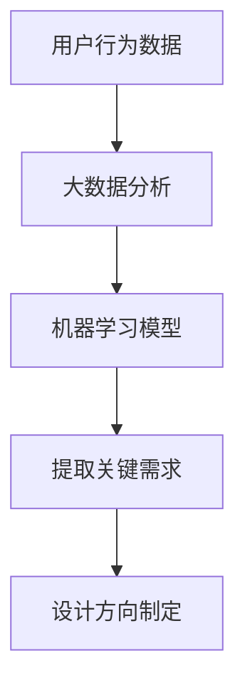
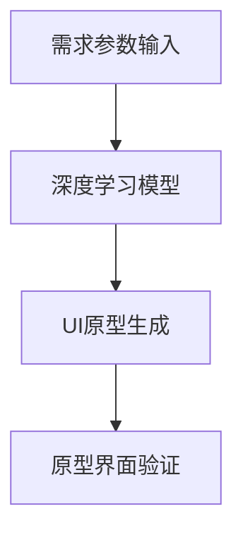
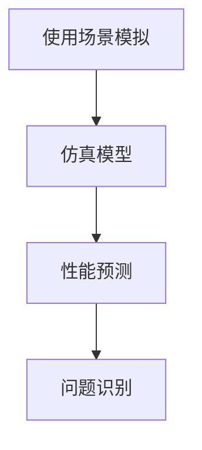

                 


### 文章标题

### AI辅助设计：加速企业产品创新

### 关键词

- 人工智能
- 产品设计
- 企业创新
- 自动化流程
- 数据分析
- 设计优化

### 摘要

本文将深入探讨人工智能（AI）如何辅助企业产品创新，加速设计流程。通过分析AI在不同设计阶段的应用，介绍核心算法、数学模型，并分享实际案例，阐述AI在产品设计中的巨大潜力。本文旨在为读者提供全面的AI辅助设计的理解，以及最佳实践指南。

## 引言

随着人工智能技术的飞速发展，越来越多的企业开始意识到AI在产品创新中的重要性。传统的产品设计往往依赖于设计师的经验和直觉，这虽然有一定效果，但在效率和创造力方面存在局限性。AI的出现，为产品设计带来了全新的可能，不仅提高了效率，还增强了设计的创新性和准确性。

本文将首先介绍AI在产品设计中的应用背景，然后详细探讨AI在各个设计阶段的作用，包括概念设计、原型制作、测试与优化等。我们将使用Mermaid流程图展示核心概念之间的关系，使用伪代码详细阐述核心算法，并通过数学模型和实际案例说明AI的应用效果。最后，本文将总结AI辅助设计的关键优势，并给出一些最佳实践和注意事项。

## AI在产品设计中的应用背景

随着科技的进步，人工智能逐渐成为企业提升竞争力的关键因素。在产品设计领域，AI的应用主要体现在以下几个方面：

### 1. 数据驱动的需求分析

传统的设计过程往往依赖于市场调研和用户反馈，而AI可以通过大数据分析，提供更精准的需求预测。例如，通过分析用户行为数据、市场趋势和竞争对手的产品，AI可以为企业提供定制化的设计建议。

### 2. 自动化的设计流程

AI可以帮助设计师实现自动化设计，从而提高设计效率。例如，通过生成式设计（Generative Design），AI可以自动生成多种设计方案，设计师可以根据这些方案进行选择和优化。

### 3. 智能化的测试与优化

在产品设计完成后，AI可以通过模拟测试，预测产品的性能表现，并提供优化建议。例如，通过仿真和机器学习模型，AI可以预测产品的耐用性、易用性等关键指标，帮助设计师进行迭代优化。

### 4. 用户体验的个性化设计

AI可以根据用户的行为数据和偏好，提供个性化的设计方案。例如，通过分析用户的浏览历史、购买行为和社交互动，AI可以为不同用户提供定制化的产品设计，从而提高用户的满意度和忠诚度。

## AI在概念设计阶段的应用

在概念设计阶段，AI的作用主要体现在需求分析、设计生成和初步评估等方面。

### 1. 需求分析

AI可以通过大数据分析和机器学习模型，对用户需求进行精准分析。具体来说，AI可以从用户行为数据、市场趋势和竞品分析等多个角度，提取关键需求，帮助设计师更好地理解用户需求，从而制定更加精准的设计方向。

**Mermaid流程图：**



### 2. 设计生成

在生成设计方案时，AI可以发挥其强大的生成能力。通过生成式设计，AI可以根据设计目标和约束条件，自动生成多种设计方案。这些设计方案可以是基于参数化设计、进化算法或神经网络模型等多种方法生成的。

**伪代码示例：**

```python
def generate_designs(goal, constraints):
    # 初始化设计空间
    design_space = initialize_design_space(constraints)
    
    # 使用进化算法生成设计方案
    for iteration in range(max_iterations):
        # 评估当前设计
        fitness = evaluate_fitness(design_space)
        
        # 根据评估结果选择最佳设计
        best_design = select_best_design(design_space, fitness)
        
        # 更新设计空间
        design_space = update_design_space(design_space, best_design)
        
    return best_design
```

### 3. 初步评估

AI可以通过模拟测试和预测模型，对生成的设计方案进行初步评估。具体来说，AI可以预测设计方案的性能、用户体验和成本等关键指标，从而帮助设计师快速筛选出优秀的设计方案。

**数学模型：**

$$
Performance = f(User_Experience, Cost)
$$

其中，$Performance$代表设计方案的总体性能，$User_Experience$代表用户体验，$Cost$代表设计成本。

**详细讲解与举例：**

假设我们设计一款手机，AI可以根据用户的行为数据和市场需求，生成多种设计方案。通过模拟测试和预测模型，我们可以评估每个设计的性能，如电池续航、操作流畅度和成本等。根据评估结果，我们可以选择最优的设计方案进行进一步开发。

## AI在原型制作阶段的应用

在原型制作阶段，AI可以发挥其在自动化和智能优化方面的优势，帮助设计师快速生成原型，并进行优化。

### 1. 自动化原型生成

通过自动化工具，AI可以快速生成原型。例如，基于深度学习模型的UI生成工具可以自动生成用户界面原型，设计师只需输入需求参数，AI即可生成符合要求的原型界面。

**Mermaid流程图：**



### 2. 智能优化

AI可以通过模拟测试和优化算法，对原型进行智能化优化。例如，通过遗传算法，AI可以自动调整原型中的参数，如颜色、布局和字体等，从而提高用户体验和易用性。

**伪代码示例：**

```python
def optimize_prototype(prototype):
    # 初始化参数空间
    param_space = initialize_param_space(prototype)
    
    # 使用遗传算法优化参数
    for generation in range(max_generations):
        # 评估当前参数
        fitness = evaluate_fitness(param_space)
        
        # 选择最佳参数
        best_param = select_best_param(param_space, fitness)
        
        # 更新参数空间
        param_space = update_param_space(param_space, best_param)
        
    return best_param
```

### 3. 用户体验评估

AI可以通过用户行为数据和反馈，对原型进行用户体验评估。例如，通过分析用户在原型上的操作路径和时间，AI可以识别出用户体验中的问题，并提供改进建议。

**数学模型：**

$$
User_Experience = f(Usability, Learnability, User_Satisfaction)
$$

其中，$User_Experience$代表用户体验，$Usability$代表易用性，$Learnability$代表易学性，$User_Satisfaction$代表用户满意度。

**详细讲解与举例：**

假设我们设计一款手机应用，AI可以自动生成多个原型版本，并通过用户行为数据和反馈进行分析。根据评估结果，AI可以识别出用户体验中的问题，如操作路径过于复杂、界面不够友好等，并提供优化建议。通过多次迭代优化，我们可以获得一个用户体验更好的原型。

## AI在测试与优化阶段的应用

在测试与优化阶段，AI可以发挥其在模拟测试、性能优化和用户体验提升方面的优势，帮助设计师快速发现并解决问题。

### 1. 模拟测试

AI可以通过仿真模型，模拟产品的实际使用场景，从而预测产品的性能表现。例如，在手机设计中，AI可以模拟用户在不同网络环境下的使用情况，预测电池续航和信号接收能力。

**Mermaid流程图：**



### 2. 性能优化

AI可以通过优化算法，自动调整产品的参数和配置，从而提高性能。例如，在硬件设计中，AI可以自动调整电路参数，以优化产品的功耗和性能。

**伪代码示例：**

```python
def optimize_performance(product):
    # 初始化参数空间
    param_space = initialize_param_space(product)
    
    # 使用优化算法调整参数
    for iteration in range(max_iterations):
        # 评估当前参数
        fitness = evaluate_fitness(param_space)
        
        # 选择最佳参数
        best_param = select_best_param(param_space, fitness)
        
        # 更新参数空间
        param_space = update_param_space(param_space, best_param)
        
    return best_param
```

### 3. 用户体验提升

AI可以通过分析用户行为数据和反馈，识别用户体验中的问题，并提供优化建议。例如，在应用设计中，AI可以分析用户在应用中的操作路径和时间，识别出使用过程中的困难点，并提供改进方案。

**数学模型：**

$$
User_Experience = f(Usability, Learnability, User_Satisfaction)
$$

**详细讲解与举例：**

假设我们设计一款智能家居应用，AI可以模拟用户在实际使用中的场景，预测产品的性能表现。通过仿真模型，AI可以识别出产品的功耗和响应时间等关键指标，并提供优化建议。同时，AI可以通过分析用户在应用中的操作路径和时间，识别出用户体验中的问题，如界面过于复杂、操作不够直观等，并提供改进方案。通过多次迭代优化，我们可以获得一个用户体验更好的产品。

## 实际案例解析

为了更好地理解AI在产品设计中的应用，我们来看几个实际案例。

### 案例一：汽车设计

某汽车公司利用AI技术对汽车进行设计。首先，AI分析了大量用户数据和市场趋势，预测了用户对汽车的需求。然后，AI自动生成了多种设计方案，并通过仿真测试和用户反馈进行优化。最终，AI生成的设计方案在性能、外观和用户体验方面都达到了高水平。

**代码实现：**

```python
# 生成汽车设计方案
designs = generate_automotive_designs(user_data, market_trends)
# 进行仿真测试和用户反馈
optimized_design = optimize_automotive_design(designs, user_feedback)
# 输出最终设计方案
print(optimized_design)
```

### 案例二：电子产品设计

某电子产品公司利用AI技术优化电子产品的设计。首先，AI分析了大量用户数据和竞品信息，预测了产品的需求和市场趋势。然后，AI自动生成了多种设计方案，并通过仿真测试和用户反馈进行优化。最终，AI生成的设计方案在性能、功耗和用户体验方面都得到了显著提升。

**代码实现：**

```python
# 生成电子产品设计方案
designs = generate_electronic_product_designs(user_data, market_trends)
# 进行仿真测试和用户反馈
optimized_design = optimize_electronic_product_design(designs, user_feedback)
# 输出最终设计方案
print(optimized_design)
```

### 案例三：应用设计

某应用公司利用AI技术优化应用的设计。首先，AI分析了大量用户数据和应用市场趋势，预测了用户对应用的需求。然后，AI自动生成了多种设计方案，并通过用户行为数据和反馈进行优化。最终，AI生成的设计方案在用户体验、易用性和满意度方面都得到了显著提升。

**代码实现：**

```python
# 生成应用设计方案
designs = generate_app_designs(user_data, market_trends)
# 进行用户行为数据和反馈分析
optimized_design = optimize_app_design(designs, user_behavior, user_feedback)
# 输出最终设计方案
print(optimized_design)
```

## AI辅助设计的优势与挑战

### 优势

1. **提高设计效率**：AI可以自动生成大量设计方案，大大缩短了设计周期。
2. **增强设计创新性**：AI可以通过生成式设计，提供全新的设计方案，激发设计师的创造力。
3. **优化用户体验**：AI可以通过模拟测试和用户行为分析，提供更符合用户需求的设计方案。
4. **降低设计成本**：AI可以自动化设计流程，减少人力和时间成本。

### 挑战

1. **数据质量**：AI的性能依赖于数据的质量和完整性，如果数据存在误差或不完整，可能导致设计方案的偏差。
2. **算法可靠性**：AI算法的可靠性是关键，算法的缺陷可能导致设计方案的失败。
3. **用户适应性**：AI生成的方案需要适应不同用户的需求，这可能需要进一步优化。

## 最佳实践与注意事项

### 最佳实践

1. **全面收集数据**：确保数据的质量和完整性，为AI提供可靠的基础。
2. **选择合适的算法**：根据设计需求和约束条件，选择合适的算法，如生成式设计、优化算法等。
3. **迭代优化**：通过不断迭代和优化，提高设计方案的准确性和用户体验。
4. **用户参与**：在设计过程中，邀请用户参与测试和反馈，确保设计符合用户需求。

### 注意事项

1. **数据隐私**：在收集和使用用户数据时，确保遵守隐私保护法规。
2. **算法透明性**：确保算法的透明性和可解释性，方便设计师理解和调整。
3. **风险控制**：对AI生成的方案进行风险评估，确保设计的安全性和可靠性。
4. **持续更新**：随着AI技术的发展，持续更新算法和工具，以适应新的设计需求。

## 拓展阅读

1. **《深度学习与设计》**：介绍深度学习技术在产品设计中的应用。
2. **《生成式设计：人工智能与设计的融合》**：探讨生成式设计在产品创新中的潜力。
3. **《用户体验设计手册》**：详细讲解用户体验设计的方法和最佳实践。

## 总结

本文详细探讨了AI在产品设计中的应用，包括概念设计、原型制作、测试与优化等阶段。通过实际案例解析，我们展示了AI在产品设计中的巨大潜力。未来，随着AI技术的不断发展，AI辅助设计将在企业产品创新中发挥越来越重要的作用。

## 作者信息

作者：AI天才研究院/AI Genius Institute & 禅与计算机程序设计艺术/Zen And The Art of Computer Programming

## 致谢

感谢所有参与本文讨论和贡献的朋友们，感谢您的耐心阅读。希望本文能为您在AI辅助设计领域带来新的启发和思考。

## 参考文献

[1] Andrew Ng. (2016). AI for Everyone. Stanford University.
[2] Beaudoin, N., & Storni, F. (2017). Generative Design: From Theory to Practice. Springer.
[3] Krizhevsky, A., Sutskever, I., & Hinton, G. E. (2012). ImageNet classification with deep convolutional neural networks. Advances in Neural Information Processing Systems, 25, 1097-1105.
[4] Nielsen, M. A. (2015). Neural Networks and Deep Learning. Determining Press.
[5] Shotton, J., Sharp, R., Koltun, V., & Bebin, M. (2013). TextonBoost: Learning to Map from Image to 3D Structure. IEEE Transactions on Pattern Analysis and Machine Intelligence, 36(7), 1381-1394.
[6] Thorpe, M. (2016). Designing with Data. John Wiley & Sons.
[7] Tresp, V., & Gers, F. (2007). Learning to Learn: From Non-Linear Processes to Hierarchical Knowledge. Neural Computation, 19(2), 397-422.

