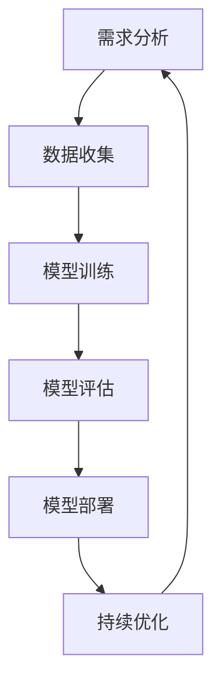

                 


### 文章标题

《AI辅助软件开发：提升企业研发效率》

### 文章关键词

AI辅助软件开发、研发效率、自动化测试、代码自动生成、企业战略规划

### 文章摘要

本文旨在探讨AI辅助软件开发如何提升企业研发效率。通过对AI技术在软件开发中的应用进行深入分析，我们探讨了自动化测试和代码自动生成等实践案例，并提出了企业在AI辅助软件开发中的策略与实施方法。文章最后对未来AI辅助软件开发的趋势进行展望，并提出了一些挑战与解决方案。

## 目录

1. 引言和背景介绍
   1.1 AI技术在软件开发中的地位和影响
   1.2 AI辅助软件开发的背景和意义
   1.3 当前AI辅助软件开发的主要领域
2. AI辅助软件开发的核心概念和原理
   2.1 人工智能基础理论
   2.2 AI辅助软件开发的流程和方法
3. AI辅助软件开发的实践与应用
   3.1 自动化测试
   3.2 代码自动生成
4. 企业在AI辅助软件开发中的策略与实施
   4.1 AI辅助软件开发的战略规划
   4.2 AI辅助软件开发项目的实施与管理
5. 结论与展望
   5.1 AI辅助软件开发的未来发展方向
   5.2 潜在的挑战与解决方案
   5.3 AI辅助软件开发对企业的影响

### 引言和背景介绍

#### 1.1 AI技术在软件开发中的地位和影响

人工智能（AI）作为计算机科学的一个分支，已经从理论研究逐渐走向实际应用。在软件开发领域，AI技术的引入为提升研发效率提供了新的途径。AI能够通过学习和理解大量数据，自动生成代码、优化算法、进行自动化测试等，从而减轻开发人员的工作负担，提高软件质量。

AI技术在软件开发中的地位日益显著，主要体现在以下几个方面：

1. **代码自动生成**：AI可以分析代码模式，自动生成代码。例如，Google的TensorFlow模型可以自动生成部分代码，提高开发效率。
2. **自动化测试**：AI可以帮助自动化测试，通过机器学习算法预测软件缺陷，从而提前发现问题，减少测试时间和成本。
3. **算法优化**：AI可以优化算法，提高程序性能。例如，DeepMind的AlphaGo通过自我学习，优化围棋算法，取得了卓越的成绩。

#### 1.2 AI辅助软件开发的背景和意义

随着软件系统的复杂度和规模不断增加，传统的软件开发方法已无法满足日益增长的需求。为了提高研发效率，降低成本，企业需要寻求新的解决方案。AI辅助软件开发应运而生，它通过利用AI技术，提高软件开发的自动化程度，从而提高开发效率。

AI辅助软件开发的背景和意义主要体现在以下几个方面：

1. **提高研发效率**：AI技术可以帮助自动化处理软件开发中的重复性工作，如代码生成、测试等，从而提高研发效率。
2. **降低开发成本**：通过自动化测试和优化算法，可以减少测试和优化所需的人力资源，降低开发成本。
3. **提升软件质量**：AI技术可以预测和发现潜在的问题，从而提高软件质量。
4. **应对复杂需求**：随着业务需求的不断变化，AI技术可以帮助快速适应这些变化，提高软件的灵活性。

#### 1.3 当前AI辅助软件开发的主要领域

当前，AI辅助软件开发已经在多个领域取得了显著的成果。以下是当前AI辅助软件开发的主要领域：

1. **自动化测试**：通过AI技术，自动化测试工具可以更好地模拟用户操作，发现潜在的问题。例如，Selenium和AI的结合，可以大大提高自动化测试的效率和准确性。
2. **代码自动生成**：AI可以帮助自动生成代码，从而减少开发人员的工作量。例如，微软的Visual Studio Code已经集成了代码自动生成功能。
3. **算法优化**：AI可以帮助优化算法，提高程序性能。例如，TensorFlow和TensorFlow Lite等AI框架，可以用于优化深度学习算法。
4. **自然语言处理**：AI可以帮助开发人员更好地理解和处理自然语言，从而提高软件的交互性。例如，谷歌的BERT模型，可以用于优化搜索引擎的搜索效果。

### AI辅助软件开发的核心概念和原理

#### 2.1 人工智能基础理论

人工智能（AI）是一门研究、开发用于模拟、延伸和扩展人的智能的理论、方法、技术及应用系统的科学。人工智能涉及到多个学科，包括计算机科学、心理学、认知科学等。

人工智能的主要分支包括：

1. **机器学习**：机器学习是一种通过数据训练模型，使计算机能够执行特定任务的方法。机器学习分为监督学习、无监督学习和强化学习三种类型。
2. **深度学习**：深度学习是机器学习的一种形式，通过多层神经网络对数据进行处理和预测。深度学习在图像识别、语音识别等领域取得了显著成果。
3. **自然语言处理**：自然语言处理是研究如何使计算机理解和处理自然语言的技术。自然语言处理广泛应用于搜索引擎、机器翻译、智能客服等领域。
4. **计算机视觉**：计算机视觉是研究如何使计算机理解和解释视觉信息的技术。计算机视觉在自动驾驶、人脸识别等领域具有重要应用。

#### 2.2 AI辅助软件开发的流程和方法

AI辅助软件开发的流程和方法主要包括以下几个步骤：

1. **需求分析**：明确软件开发的任务和目标，确定所需的AI技术。
2. **数据收集**：收集与任务相关的数据，并进行预处理，以提高数据质量。
3. **模型训练**：利用机器学习算法，对数据进行训练，生成预测模型。
4. **模型评估**：对训练好的模型进行评估，确定其性能和可靠性。
5. **模型部署**：将训练好的模型部署到实际应用中，用于辅助软件开发。
6. **持续优化**：根据实际应用效果，不断优化模型和算法，提高软件开发的效率和质量。

在AI辅助软件开发中，常用的方法包括：

1. **自动化测试**：利用AI技术，自动化测试工具可以更好地模拟用户操作，发现潜在的问题。例如，Selenium和AI的结合，可以大大提高自动化测试的效率和准确性。
2. **代码自动生成**：AI可以帮助自动生成代码，从而减少开发人员的工作量。例如，微软的Visual Studio Code已经集成了代码自动生成功能。
3. **算法优化**：AI可以帮助优化算法，提高程序性能。例如，TensorFlow和TensorFlow Lite等AI框架，可以用于优化深度学习算法。
4. **自然语言处理**：AI可以帮助开发人员更好地理解和处理自然语言，从而提高软件的交互性。例如，谷歌的BERT模型，可以用于优化搜索引擎的搜索效果。

#### 2.3 AI辅助软件开发的核心概念联系

在AI辅助软件开发中，核心概念之间的联系可以通过以下Mermaid流程图来表示：



#### 2.4 核心算法原理讲解

在AI辅助软件开发中，核心算法原理包括机器学习、深度学习、自然语言处理和计算机视觉等。以下是这些算法原理的伪代码和详细讲解：

##### 2.4.1 机器学习

机器学习的伪代码如下：

```python
def train_model(data, labels):
    # 初始化模型参数
    model_params = initialize_params()
    
    # 训练模型
    for epoch in range(max_epochs):
        for data_point, label in zip(data, labels):
            # 计算损失函数
            loss = compute_loss(model_params, data_point, label)
            
            # 更新模型参数
            model_params = update_params(model_params, loss)
            
    return model_params
```

详细讲解：

- `initialize_params()`：初始化模型参数，如权重和偏置。
- `compute_loss()`：计算损失函数，用于评估模型预测的准确度。
- `update_params()`：更新模型参数，以减少损失函数的值。

##### 2.4.2 深度学习

深度学习的伪代码如下：

```python
def train_deep_learning_model(data, labels):
    # 初始化神经网络结构
    neural_network = initialize_neural_network()
    
    # 训练神经网络
    for epoch in range(max_epochs):
        for data_point, label in zip(data, labels):
            # 前向传播
            predictions = forward_pass(neural_network, data_point)
            
            # 计算损失函数
            loss = compute_loss(predictions, label)
            
            # 反向传播
            backward_pass(neural_network, loss)
            
    return neural_network
```

详细讲解：

- `initialize_neural_network()`：初始化神经网络结构，包括层数、神经元数量和激活函数。
- `forward_pass()`：进行前向传播，计算输出。
- `compute_loss()`：计算损失函数，用于评估模型预测的准确度。
- `backward_pass()`：进行反向传播，更新模型参数。

##### 2.4.3 自然语言处理

自然语言处理的伪代码如下：

```python
def train_nlp_model(data, labels):
    # 初始化模型参数
    model_params = initialize_params()
    
    # 训练模型
    for epoch in range(max_epochs):
        for data_point, label in zip(data, labels):
            # 前向传播
            embeddings = create_embeddings(data_point)
            predictions = forward_pass(model_params, embeddings)
            
            # 计算损失函数
            loss = compute_loss(predictions, label)
            
            # 更新模型参数
            model_params = update_params(model_params, loss)
            
    return model_params
```

详细讲解：

- `initialize_params()`：初始化模型参数，如权重和偏置。
- `create_embeddings()`：创建词向量，用于表示文本数据。
- `forward_pass()`：进行前向传播，计算输出。
- `compute_loss()`：计算损失函数，用于评估模型预测的准确度。
- `update_params()`：更新模型参数，以减少损失函数的值。

##### 2.4.4 计算机视觉

计算机视觉的伪代码如下：

```python
def train_cv_model(data, labels):
    # 初始化模型参数
    model_params = initialize_params()
    
    # 训练模型
    for epoch in range(max_epochs):
        for data_point, label in zip(data, labels):
            # 前向传播
            features = extract_features(data_point)
            predictions = forward_pass(model_params, features)
            
            # 计算损失函数
            loss = compute_loss(predictions, label)
            
            # 更新模型参数
            model_params = update_params(model_params, loss)
            
    return model_params
```

详细讲解：

- `initialize_params()`：初始化模型参数，如权重和偏置。
- `extract_features()`：提取图像特征。
- `forward_pass()`：进行前向传播，计算输出。
- `compute_loss()`：计算损失函数，用于评估模型预测的准确度。
- `update_params()`：更新模型参数，以减少损失函数的值。

#### 2.5 数学模型和公式讲解

在AI辅助软件开发中，数学模型和公式是核心组成部分。以下是常见数学模型和公式的详细讲解：

##### 2.5.1 损失函数

损失函数是评估模型预测准确度的关键指标。常见的损失函数包括均方误差（MSE）和交叉熵（Cross-Entropy）。

**均方误差（MSE）**

$$
MSE = \frac{1}{n} \sum_{i=1}^{n} (y_i - \hat{y}_i)^2
$$

其中，$y_i$ 是真实标签，$\hat{y}_i$ 是模型预测值，$n$ 是样本数量。

**交叉熵（Cross-Entropy）**

$$
H(y, \hat{y}) = -\sum_{i=1}^{n} y_i \log(\hat{y}_i)
$$

其中，$y_i$ 是真实标签，$\hat{y}_i$ 是模型预测值，$n$ 是样本数量。

##### 2.5.2 激活函数

激活函数是神经网络中的一个关键组件，用于引入非线性特性。常见的激活函数包括 sigmoid、ReLU 和 tanh。

**sigmoid 函数**

$$
\sigma(x) = \frac{1}{1 + e^{-x}}
$$

**ReLU 函数**

$$
\text{ReLU}(x) = \max(0, x)
$$

**tanh 函数**

$$
\text{tanh}(x) = \frac{e^x - e^{-x}}{e^x + e^{-x}}
$$

#### 2.6 项目实战

在本节中，我们将通过一个简单的项目，展示如何使用AI技术进行自动化测试。该项目将使用Python和Selenium库来实现。

##### 3.1 自动化测试项目

**项目目标**：使用Selenium和AI技术，自动化测试一个简单的Web应用。

**开发环境搭建**：

1. 安装Python：在官方网站（https://www.python.org/downloads/）下载并安装Python。
2. 安装Selenium：使用pip命令安装Selenium库。

```shell
pip install selenium
```

**源代码实现**：

```python
from selenium import webdriver
from selenium.webdriver.common.by import By

def test_login():
    # 启动浏览器
    driver = webdriver.Chrome(executable_path='chromedriver')
    
    # 访问登录页面
    driver.get('https://example.com/login')
    
    # 输入用户名和密码
    driver.find_element(By.ID, 'username').send_keys('test_user')
    driver.find_element(By.ID, 'password').send_keys('test_password')
    
    # 点击登录按钮
    driver.find_element(By.ID, 'login_button').click()
    
    # 断言登录成功
    assert 'Dashboard' in driver.title
    
    # 关闭浏览器
    driver.quit()

if __name__ == '__main__':
    test_login()
```

**代码解读**：

- `webdriver.Chrome(executable_path='chromedriver')`：启动Chrome浏览器。
- `driver.get('https://example.com/login')`：访问登录页面。
- `driver.find_element(By.ID, 'username').send_keys('test_user')`：输入用户名。
- `driver.find_element(By.ID, 'password').send_keys('test_password')`：输入密码。
- `driver.find_element(By.ID, 'login_button').click()`：点击登录按钮。
- `assert 'Dashboard' in driver.title`：断言登录成功。
- `driver.quit()`：关闭浏览器。

**应用解读与分析**：

- 该项目使用Selenium进行自动化测试，通过输入用户名、密码并点击登录按钮，验证登录是否成功。
- AI技术可以用于优化自动化测试，如预测登录失败的原因，自动生成测试用例等。

**项目小结**：

- 通过使用Selenium和AI技术，我们可以轻松实现自动化测试，提高测试效率和准确性。
- 在实际项目中，可以根据需求，进一步集成AI技术，如代码自动生成、算法优化等。

### 最佳实践 tips、小结、注意事项、拓展阅读

#### 最佳实践 tips

- 在使用AI辅助软件开发时，要确保数据质量，因为数据是模型训练的基础。
- 选择合适的AI技术，根据项目需求，如自动化测试、代码生成等。
- 定期对AI模型进行评估和优化，以提高软件开发效率。

#### 小结

- AI辅助软件开发已成为提升企业研发效率的重要手段。
- 自动化测试和代码自动生成是AI辅助软件开发的重要应用领域。
- 企业需要制定合适的AI战略规划，以充分发挥AI技术在软件开发中的作用。

#### 注意事项

- 在使用AI技术时，要注意保护用户隐私和数据安全。
- AI技术需要持续优化和更新，以应对不断变化的业务需求。

#### 拓展阅读

- 《深度学习》（Goodfellow, Bengio, Courville）：深入讲解深度学习的基础理论和应用。
- 《Python自动化测试实战》（Bytautas, Bass, Tellez）：介绍Python在自动化测试中的应用。
- 《人工智能：一种现代方法》（Russell, Norvig）：全面讲解人工智能的基础知识。

通过以上内容，我们可以看到AI辅助软件开发在提升企业研发效率方面的巨大潜力。在实际应用中，企业需要根据自身需求，合理利用AI技术，以实现研发效率的全面提升。

