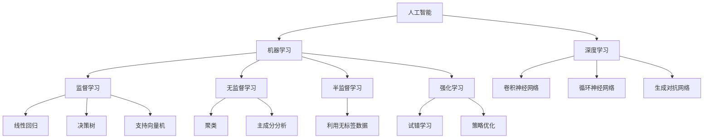
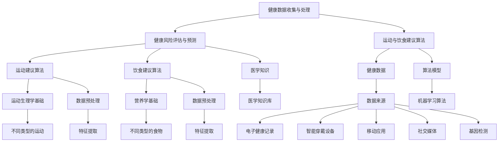

                 

### 文章标题

“AI驱动的个性化健康管理：从饮食建议到运动规划”

### 关键词

人工智能、健康管理、个性化饮食建议、运动规划、机器学习、深度学习、健康数据、数据分析、营养学、运动生理学。

### 摘要

本文将探讨如何利用人工智能（AI）技术，特别是机器学习和深度学习算法，推动个性化健康管理的创新。文章首先介绍AI在健康管理领域的应用背景和重要性，随后详细阐述个性化健康管理的核心概念和挑战。接着，文章深入分析AI驱动的个性化健康管理的基本原理，包括健康数据收集与处理、健康风险评估与预测、饮食建议和运动规划算法。通过实际的案例展示和代码解读，文章进一步阐述如何将理论知识应用于实践。最后，文章讨论当前技术面临的挑战以及未来的发展趋势，并提出一些实用的最佳实践和建议。

---

### 引言

#### 1.1 AI在健康管理中的重要性

随着医疗技术的进步和人们对健康意识的提升，健康管理已成为当今社会的一个重要话题。然而，传统的健康管理方法往往具有较大的局限性，难以满足个体多样化的需求。人工智能（AI）作为一种强大的技术工具，正在逐渐改变健康管理的格局。AI在健康管理中的重要性主要体现在以下几个方面：

1. **个性化服务**：传统健康管理方法通常采用“一刀切”的方式，而AI可以通过分析大量的个人健康数据，为每个用户提供个性化的健康建议，从而提高健康管理的效果。

2. **疾病预测与预防**：AI算法能够从复杂的数据中提取出有价值的信息，提前预测疾病的发生，有助于实现疾病的预防。

3. **医疗资源优化**：AI能够帮助医疗机构更高效地分配资源，优化医疗服务流程，提高医疗资源的利用效率。

4. **智能健康监测**：AI可以通过智能设备实时监测个体的健康状况，及时发现潜在的健康问题。

#### 1.2 个性化健康管理的概念与挑战

个性化健康管理是指根据个人的健康数据，结合医学知识和算法模型，为个体提供量身定制的健康服务。这种管理模式不仅关注个体的身体健康，还包括心理、生活习惯等多个方面。

然而，个性化健康管理也面临着一些挑战：

1. **数据获取与隐私**：收集到足够的健康数据是实现个性化健康管理的必要条件，但如何保证数据的隐私和安全，是一个亟待解决的问题。

2. **数据质量**：健康数据的准确性、完整性和一致性对个性化健康管理至关重要。然而，实际中往往难以保证数据的完美。

3. **算法模型的有效性**：尽管AI算法在数据处理和分析方面具有优势，但如何构建有效的算法模型，仍是一个挑战。

4. **用户体验**：个性化健康管理的目标是为用户提供便捷、实用的健康服务，但如何确保用户体验良好，也是一个关键问题。

#### 1.3 书籍目的与读者对象

本书籍旨在探讨如何利用AI技术，尤其是机器学习和深度学习算法，推动个性化健康管理的创新。通过系统的理论讲解和实际的案例展示，本书希望为读者提供以下收获：

1. **理论基础**：了解AI在健康管理中的应用原理和核心技术。

2. **实践指导**：掌握如何将AI技术应用于个性化健康管理项目的开发。

3. **创新思维**：激发读者在AI驱动的健康管理领域的创新思考。

本书籍适合以下读者群体：

1. **健康管理从业者**：如医生、营养师、健身教练等，希望通过AI技术提升服务质量。

2. **数据科学家与工程师**：对AI技术有兴趣，希望将其应用于健康领域的专业人士。

3. **AI技术爱好者**：对AI技术有浓厚兴趣，希望了解其在实际应用中的效果。

### AI驱动的个性化健康管理概述

#### 2.1 AI在健康领域的应用

人工智能在健康领域有着广泛的应用，涵盖了从疾病诊断到个性化健康管理的方方面面。以下是一些典型的AI应用实例：

1. **疾病诊断**：AI可以通过分析医学影像、实验室检测结果等数据，帮助医生更准确、更快速地诊断疾病。例如，深度学习算法在肺癌、乳腺癌等疾病诊断中已展现出很高的准确性。

2. **药物研发**：AI在药物研发中也发挥着重要作用。通过分析大量的化合物结构和生物活性数据，AI可以预测新的药物候选分子，加速新药的发现过程。

3. **健康监测**：智能穿戴设备可以实时监测个体的生理参数，如心率、血压等，通过AI算法分析这些数据，可以及时发现健康风险。

4. **个性化健康管理**：个性化健康管理是AI在健康领域最具潜力的一项应用。通过分析个体的健康数据，AI可以为每个用户提供量身定制的健康建议，包括饮食、运动、心理调适等方面。

#### 2.2 个性化健康管理的核心要素

个性化健康管理的实现需要以下几个核心要素：

1. **健康数据**：这是个性化健康管理的基石。通过收集和分析个体的健康数据，可以了解个体的健康状况，为个性化健康建议提供依据。

2. **医学知识**：AI算法需要基于医学知识库，才能对健康数据进行分析和解读，为用户提供有价值的健康建议。

3. **算法模型**：这是AI的核心。通过构建和训练合适的算法模型，AI可以自动从健康数据中提取有价值的信息，为用户提供个性化建议。

4. **用户体验**：用户体验是衡量个性化健康管理服务质量的重要指标。一个优秀的个性化健康管理系统，不仅要有准确的健康建议，还需要提供便捷、易用的用户界面。

#### 2.3 本书结构安排与内容安排

本书将按照以下结构进行内容安排：

1. **引言**：介绍AI在健康管理中的重要性，以及个性化健康管理的概念与挑战。

2. **AI驱动的个性化健康管理概述**：详细讨论AI在健康领域的应用，个性化健康管理的核心要素，以及本书的结构安排。

3. **核心概念与联系**：介绍人工智能的基础知识，以及个性化健康管理的基本原理。

4. **核心算法原理讲解**：详细讲解饮食建议和运动规划算法的原理，包括营养学基础、运动生理学基础，以及算法实现和数学模型。

5. **项目实战**：通过实际案例，展示如何将AI技术应用于个性化健康管理项目的开发，包括开发环境搭建、源代码实现和代码解读。

6. **挑战与未来展望**：讨论当前技术面临的挑战，以及未来的发展趋势。

7. **附录**：提供常用的工具和资源，以供读者参考。

8. **结论**：总结本书的主要内容，展望未来的发展方向。

通过以上结构安排，本书旨在为读者提供一个全面、系统的AI驱动的个性化健康管理知识体系，帮助读者深入了解这一领域的最新进展和应用。

### 人工智能基础

#### 3.1 人工智能的发展历程

人工智能（Artificial Intelligence，简称AI）是计算机科学的一个分支，旨在使计算机具有人类智能的行为。其发展历程可以追溯到20世纪50年代。以下是人工智能发展的几个关键阶段：

1. **早期探索（1956-1969）**：1956年，约翰·麦卡锡（John McCarthy）等人在达特茅斯会议上提出了“人工智能”的概念，标志着人工智能领域的正式诞生。这一时期，人工智能主要研究如何使计算机模拟简单的认知功能，如推理、问题解决等。

2. **黄金时期（1970-1980）**：20世纪70年代，人工智能迎来了一个短暂的黄金时期。在这个时期，专家系统（Expert Systems）成为人工智能研究的热点。专家系统是一种基于规则的人工智能程序，能够模拟人类专家的决策过程。然而，由于知识的表达和推理的复杂性，专家系统在实际应用中遇到了一些瓶颈。

3. **衰退与复苏（1980-1990）**：20世纪80年代，人工智能进入了一个衰退期。这一时期，由于计算能力的限制和实际应用的失败，人们对人工智能的前景产生了怀疑。然而，随着神经网络研究的复兴，人工智能在20世纪90年代再次引起了广泛关注。

4. **现代AI（1990至今）**：21世纪初，随着计算能力的提升和数据量的爆炸性增长，人工智能迎来了一个新的发展高峰。这一时期，机器学习和深度学习成为人工智能研究的热点。机器学习通过算法从数据中学习规律，而深度学习则通过多层神经网络模型实现更复杂的特征提取和模式识别。

#### 3.2 机器学习基础

机器学习（Machine Learning，简称ML）是人工智能的一个重要分支，旨在通过数据驱动的方式使计算机自动获取知识和技能。机器学习可以分为以下几种主要类型：

1. **监督学习（Supervised Learning）**：监督学习是一种从标记数据中学习的机器学习方法。在这种方法中，模型被训练来预测标签或输出变量。常见的监督学习算法包括线性回归、决策树、支持向量机（SVM）等。

2. **无监督学习（Unsupervised Learning）**：无监督学习是一种在没有明确标签的情况下从数据中学习的方法。这种方法主要用于发现数据中的结构和模式。常见的无监督学习算法包括聚类、主成分分析（PCA）等。

3. **半监督学习（Semi-supervised Learning）**：半监督学习结合了监督学习和无监督学习的方法。在这种方法中，部分数据有标签，而另一部分数据无标签。半监督学习可以有效地利用无标签数据，提高模型的性能。

4. **强化学习（Reinforcement Learning）**：强化学习是一种通过试错（Trial and Error）的方式学习的机器学习方法。在这种方法中，模型通过与环境的交互来学习最优策略。强化学习在游戏、自动驾驶等领域有广泛的应用。

#### 3.3 深度学习基本架构

深度学习（Deep Learning，简称DL）是一种基于多层神经网络的人工智能方法。与传统的机器学习模型相比，深度学习模型能够通过多层神经元的组合，自动提取数据中的高阶特征，从而实现更复杂的任务。

深度学习的基本架构包括以下几个关键组成部分：

1. **输入层（Input Layer）**：输入层是深度学习模型的第一层，它接收外部输入数据。

2. **隐藏层（Hidden Layers）**：隐藏层位于输入层和输出层之间，是深度学习模型的核心部分。隐藏层通过非线性变换，逐层提取数据中的特征。

3. **输出层（Output Layer）**：输出层是深度学习模型的最后一层，它生成最终的预测结果或分类标签。

深度学习模型的核心是神经元（Neuron），每个神经元都连接到前一层和后一层的其他神经元。神经元通过激活函数（Activation Function）对输入进行非线性变换，从而实现特征提取和分类。

常用的深度学习架构包括卷积神经网络（CNN）、循环神经网络（RNN）和生成对抗网络（GAN）等。卷积神经网络主要用于图像和视频处理，循环神经网络主要用于序列数据分析和语言处理，生成对抗网络则主要用于生成式任务，如图像生成和语音合成。

#### 3.4 Mermaid流程图：人工智能核心概念联系

以下是一个使用Mermaid语法绘制的流程图，展示了人工智能的核心概念之间的联系：



在这个流程图中，人工智能作为顶层概念，其下分为机器学习和深度学习。机器学习进一步细分为监督学习、无监督学习、半监督学习和强化学习。深度学习则具体包括了卷积神经网络、循环神经网络和生成对抗网络等子概念。这种结构化的流程图有助于读者理解和掌握人工智能的核心概念及其相互关系。

---

### 个性化健康管理原理

#### 4.1 健康数据收集与处理

健康数据的收集是个性化健康管理的第一步，也是关键的一步。有效的数据收集不仅能提供丰富的信息，还能为后续的数据分析和模型构建提供基础。以下是健康数据收集与处理的主要步骤：

1. **数据来源**：健康数据的来源多种多样，包括但不限于：
   - **电子健康记录（EHR）**：电子健康记录是医疗机构中常用的电子化健康档案，包含了患者的医疗历史、诊断结果、治疗方案等信息。
   - **智能穿戴设备**：如智能手环、智能手表等，可以实时监测用户的心率、血压、步数等生理指标。
   - **移动应用**：用户通过移动应用主动输入的健康信息，如饮食记录、运动记录等。
   - **社交媒体**：用户在社交媒体上分享的健康信息，如运动状态、饮食偏好等。
   - **基因检测**：通过基因检测获取的遗传信息，对个性化健康管理具有重要参考价值。

2. **数据类型**：健康数据主要包括以下几类：
   - **结构化数据**：如电子健康记录中的诊断代码、实验室检测结果等，这类数据通常具有明确的格式和结构。
   - **半结构化数据**：如电子健康记录中的自由文本、移动应用中的用户输入等，这类数据具有部分结构，但需要进一步处理。
   - **非结构化数据**：如社交媒体上的用户评论、医学影像等，这类数据通常没有明确的格式和结构，需要进行复杂的预处理。

3. **数据预处理**：健康数据的预处理是确保数据质量、减少噪声、提高模型性能的重要环节，主要包括以下步骤：
   - **数据清洗**：去除重复数据、缺失值填充、去除噪声数据等。
   - **数据整合**：将不同来源、不同格式的数据进行整合，形成统一的数据集。
   - **特征提取**：从原始数据中提取对健康管理有重要意义的特征，如生理指标、饮食习惯、运动模式等。
   - **数据标准化**：对不同来源、不同类型的数据进行标准化处理，使其具有相同的量纲和范围。

4. **数据存储与管理**：预处理后的健康数据需要存储和管理，以供后续分析和使用。常用的数据存储技术包括：
   - **关系数据库**：适用于结构化数据的存储和管理，如MySQL、PostgreSQL等。
   - **NoSQL数据库**：适用于半结构化和非结构化数据的存储和管理，如MongoDB、Cassandra等。
   - **数据湖**：用于大规模数据的存储和管理，适用于存储不同来源、不同类型的数据，如Hadoop、Spark等。

通过有效的健康数据收集与处理，可以为个性化健康管理提供高质量的数据支持，为后续的健康风险评估、预测和个性化建议提供可靠的基础。

#### 4.2 健康风险评估与预测

健康风险评估与预测是个性化健康管理的核心环节，通过分析个体的健康数据，对个体未来的健康状况进行评估和预测，从而制定个性化的健康管理方案。以下是健康风险评估与预测的主要方法：

1. **风险评估模型**：
   - **传统风险评估模型**：传统的风险评估模型主要基于医学知识和统计数据，通过构建风险评估表或算法，对个体的患病风险进行评估。例如，基于个体年龄、性别、家族病史等基本信息的慢性病风险评估。
   - **AI驱动的风险评估模型**：随着AI技术的发展，AI驱动的风险评估模型越来越受到关注。这类模型通过机器学习和深度学习算法，从大量的健康数据中提取有价值的信息，构建个性化的风险评估模型。例如，基于个体心率、血压、血糖等生理指标，使用深度学习算法预测个体患糖尿病的风险。

2. **预测方法**：
   - **时间序列预测**：时间序列预测是一种常见的预测方法，主要用于预测未来某一时刻的健康状况。这种方法通常基于个体的健康数据的历史变化趋势，通过时间序列分析技术，如ARIMA、LSTM等，进行未来健康状况的预测。
   - **分类预测**：分类预测是将个体划分为不同的健康状态类别。例如，将个体划分为健康、亚健康、患病等类别。分类预测通常使用分类算法，如决策树、随机森林、支持向量机等，通过对训练数据的分析，构建分类模型，从而对新的数据进行预测。
   - **回归预测**：回归预测主要用于预测连续的健康指标，如血压、血糖等。回归预测使用回归算法，如线性回归、岭回归等，通过分析训练数据中的关系，建立预测模型，从而对新的数据进行预测。

3. **模型评估与优化**：
   - **模型评估**：评估模型的好坏是保证预测准确性的关键。常用的评估指标包括准确率、召回率、F1分数、均方误差等。通过这些指标，可以评估模型的预测性能，找出模型的不足之处。
   - **模型优化**：为了提高模型的预测性能，需要对模型进行优化。优化方法包括调整模型参数、增加训练数据、引入正则化等。通过不断的模型优化，可以提高模型的预测准确性。

通过健康风险评估与预测，可以为个体提供个性化的健康管理建议，帮助个体预防和控制疾病，提高生活质量。

#### 4.3 运动与饮食建议算法

运动与饮食建议是个性化健康管理的重要组成部分，通过分析个体的健康数据，为个体提供合适的运动计划和饮食建议，有助于改善健康状态，提高生活质量。以下是运动与饮食建议算法的基本原理和实现方法：

1. **运动建议算法**：
   - **运动生理学基础**：运动建议算法需要基于运动生理学知识，了解不同类型的运动对个体健康的影响。例如，有氧运动有助于提高心肺功能，力量训练有助于增强肌肉力量和耐力。运动建议算法需要根据个体的健康状况、运动能力等因素，推荐合适的运动类型和强度。
   - **算法实现**：运动建议算法通常采用以下步骤：
     1. 数据收集：收集个体的健康数据，包括心率、血压、体重、运动记录等。
     2. 数据预处理：对收集到的健康数据进行清洗、整合和特征提取，为后续分析做好准备。
     3. 模型训练：使用机器学习算法，如决策树、支持向量机等，对预处理后的数据集进行训练，构建运动建议模型。
     4. 运动计划生成：根据训练好的模型，为个体生成个性化的运动计划，包括运动类型、运动强度、运动时间等。
     5. 运动效果评估：通过定期收集运动数据，评估运动计划的执行效果，根据反馈对运动计划进行调整。

2. **饮食建议算法**：
   - **营养学基础**：饮食建议算法需要基于营养学知识，了解不同类型的食物对个体健康的影响。例如，均衡的饮食有助于提供足够的营养，防止营养不良或营养过剩。饮食建议算法需要根据个体的健康状况、饮食习惯等因素，推荐合适的饮食方案。
   - **算法实现**：饮食建议算法通常采用以下步骤：
     1. 数据收集：收集个体的饮食习惯、健康数据、营养需求等。
     2. 数据预处理：对收集到的饮食数据进行清洗、整合和特征提取，为后续分析做好准备。
     3. 模型训练：使用机器学习算法，如线性回归、决策树等，对预处理后的数据集进行训练，构建饮食建议模型。
     4. 饮食计划生成：根据训练好的模型，为个体生成个性化的饮食计划，包括食物种类、分量、营养搭配等。
     5. 饮食效果评估：通过定期收集饮食数据，评估饮食计划的执行效果，根据反馈对饮食计划进行调整。

通过运动与饮食建议算法，可以为个体提供个性化的健康建议，帮助个体实现健康目标，提高生活质量。

#### 4.4 Mermaid流程图：个性化健康管理原理联系

以下是一个使用Mermaid语法绘制的流程图，展示了个性化健康管理原理之间的联系：



在这个流程图中，健康数据收集与处理作为起点，包括数据来源和数据预处理。健康风险评估与预测进一步细分为运动建议算法和饮食建议算法，分别基于运动生理学和营养学知识。通过机器学习算法和医学知识库，可以构建个性化的健康建议模型。这种结构化的流程图有助于读者理解和掌握个性化健康管理的基本原理及其相互关系。

---

### 饮食建议算法

#### 5.1 营养学基础

饮食建议算法的核心在于对营养学的深入理解，确保提出的饮食建议科学、合理。以下是营养学基础的主要内容：

1. **营养素分类**：人体所需的营养素可以分为宏量营养素和微量营养素。宏量营养素主要包括碳水化合物、蛋白质和脂肪，它们是提供能量的主要来源。微量营养素包括维生素和矿物质，它们在人体内含量较少，但对健康至关重要。

2. **营养素功能**：
   - **碳水化合物**：主要提供能量，有助于维持身体的正常功能。长期摄入过多可能导致肥胖和糖尿病。
   - **蛋白质**：参与身体组织的构建和修复，是细胞的重要成分。不足的蛋白质摄入会导致肌肉萎缩和免疫力下降。
   - **脂肪**：提供能量，维持细胞膜的结构和功能，但过量摄入会增加心血管疾病的风险。
   - **维生素**：调节生理功能，预防疾病，如维生素A对视力和免疫力至关重要。
   - **矿物质**：维持体内酸碱平衡、神经传导和骨骼健康，如钙和铁对骨骼健康和血液运输至关重要。

3. **营养摄入指南**：根据不同人群的需求，国家或专业组织会发布营养摄入指南。例如，美国农业部的膳食指南（Dietary Guidelines for Americans）提供了关于碳水化合物、蛋白质、脂肪和微量营养素的每日摄入量建议。

#### 5.2 健康饮食模型构建

健康饮食模型的构建是饮食建议算法的核心，它需要结合营养学知识和机器学习算法，以生成科学、个性化的饮食建议。以下是健康饮食模型构建的步骤：

1. **数据收集**：收集与个体饮食习惯相关的数据，包括每日食物摄入记录、体重变化、生理指标（如血压、血糖）等。这些数据可以从电子健康记录、移动应用或用户直接输入获得。

2. **数据预处理**：对收集到的数据进行分析和清洗，去除重复数据、缺失值填充、异常值处理等。此外，还需要将不同来源和格式的数据进行整合，形成统一的数据集。

3. **特征提取**：从原始数据中提取对健康饮食有重要影响的特征，如每日总能量摄入、各类营养素的摄入量、饮食习惯（如饮食习惯、饮食习惯频率）等。

4. **模型选择**：选择适合的机器学习算法来构建健康饮食模型。常见的算法包括线性回归、决策树、支持向量机、神经网络等。每种算法都有其优势和局限性，需要根据具体问题进行选择。

5. **模型训练与优化**：使用预处理后的数据集对模型进行训练。在训练过程中，通过交叉验证和调整模型参数，提高模型的预测准确性和泛化能力。

6. **模型评估**：使用测试数据集对训练好的模型进行评估，常用的评估指标包括均方误差（MSE）、决定系数（R²）等。通过评估结果，可以判断模型的性能和可靠性。

7. **模型应用**：将训练好的模型应用于实际场景，根据个体健康数据和营养需求，生成个性化的饮食建议。

#### 5.3 伪代码：饮食建议算法实现

以下是一个简化的伪代码，用于描述饮食建议算法的实现过程：

```python
# 伪代码：饮食建议算法实现

# 步骤1：数据收集与预处理
data = collect_health_data()  # 收集健康数据
clean_data = preprocess_data(data)  # 数据清洗与整合

# 步骤2：特征提取
features = extract_features(clean_data)

# 步骤3：模型选择与训练
model = select_model()  # 选择机器学习模型
model = train_model(features)  # 训练模型

# 步骤4：模型评估
evaluate_model(model, test_data)  # 评估模型性能

# 步骤5：生成饮食建议
diet_suggestions = generate_diet_suggestions(model, current_health_data)

# 步骤6：输出饮食建议
print(diet_suggestions)
```

#### 5.4 数学模型和数学公式：营养素摄入与代谢平衡

营养素摄入与代谢平衡是饮食建议算法的核心问题。以下是相关数学模型和数学公式：

1. **能量摄入与消耗**：
   - **能量摄入**：能量摄入量（E）= 总碳水化合物摄入量（CHO）× 热量密度（4.1 kcal/g）+ 蛋白质摄入量（Pro）× 热量密度（4.1 kcal/g）+ 脂肪摄入量（Fat）× 热量密度（9.3 kcal/g）
   - **能量消耗**：基础代谢率（BMR）+ 活动能量消耗（TEE）= BMR × 活动系数（A）+ 非运动时间内的能量消耗

2. **营养素摄入平衡**：
   - **碳水化合物摄入**：CHO摄入量应根据个体的运动量和能量需求进行调整。
   - **蛋白质摄入**：蛋白质摄入量建议为体重（kg）× 1.2-2.2 g/kg，具体数值应根据个体差异进行调整。
   - **脂肪摄入**：脂肪摄入量建议占总能量摄入的20%-35%。

3. **代谢平衡**：
   - **能量平衡**：能量摄入 = 能量消耗，保持能量平衡有助于维持体重稳定。
   - **营养素平衡**：各类营养素的摄入量应保持适宜的比例，以维持身体健康。

以下是具体的数学模型和公式：

```latex
\begin{align*}
E &= CHO \times 4.1 + Pro \times 4.1 + Fat \times 9.3 \\
BMR &= weight \times 10.5 + height \times 6.75 - age \times 5 \\
TEE &= BMR \times A \\
CHO_{\text{建议}} &= weight \times 1.2-2.2 \times 4.1 \\
Pro_{\text{建议}} &= weight \times 1.2-2.2 \times 1.0 \\
Fat_{\text{建议}} &= (E - CHO_{\text{建议}} - Pro_{\text{建议}}) / 9.3
\end{align*}
```

通过这些数学模型和公式，可以计算个体的营养素摄入量和代谢平衡状态，从而为个体提供科学、个性化的饮食建议。

#### 5.5 举例说明：具体案例与饮食建议

以下是一个具体的案例，用于说明如何使用饮食建议算法为个体生成个性化的饮食建议：

**案例**：一位35岁的男性，身高180cm，体重75kg，日常从事办公室工作，每天工作8小时，晚上进行1小时的有氧运动。

**步骤1**：数据收集
- 早餐：燕麦粥（150g）、牛奶（250ml）、鸡蛋（2个）
- 午餐：米饭（150g）、红烧肉（100g）、蔬菜（200g）
- 晚餐：沙拉（150g）、鸡胸肉（150g）、水果（100g）
- 其他：下午茶喝咖啡（1杯），晚上饮酒（2杯）

**步骤2**：数据预处理
- 计算各类营养素的摄入量：
  - 碳水化合物：150g（燕麦粥）+ 150g（米饭）= 300g
  - 蛋白质：150g（红烧肉）+ 200g（鸡胸肉）= 350g
  - 脂肪：100g（红烧肉）+ 100g（鸡胸肉）= 200g
- 计算能量摄入：
  - 能量摄入 = 300g \* 4.1 kcal/g + 350g \* 4.1 kcal/g + 200g \* 9.3 kcal/g = 3010 kcal

**步骤3**：特征提取
- 提取以下特征：
  - 总能量摄入：3010 kcal
  - 碳水化合物摄入：300g
  - 蛋白质摄入：350g
  - 脂肪摄入：200g

**步骤4**：模型预测
- 使用训练好的饮食建议模型，输入上述特征，得到以下建议：
  - 碳水化合物摄入建议：280g
  - 蛋白质摄入建议：330g
  - 脂肪摄入建议：170g

**步骤5**：生成饮食建议
- 根据模型建议，调整饮食结构：
  - 早餐：减少燕麦粥至100g，增加蔬菜（100g）
  - 午餐：减少米饭至100g，增加鸡胸肉至200g，减少红烧肉至50g
  - 晚餐：减少沙拉至100g，增加水果（50g）

**步骤6**：输出饮食建议
- 生成个性化的饮食建议：
  - 早餐：燕麦粥（100g）、牛奶（250ml）、鸡蛋（2个）、蔬菜（100g）
  - 午餐：米饭（100g）、鸡胸肉（200g）、蔬菜（200g）
  - 晚餐：沙拉（100g）、鸡胸肉（150g）、水果（50g）
  - 其他：下午茶喝咖啡（1杯），晚上饮酒（1杯）

通过这个案例，我们可以看到如何利用饮食建议算法，结合个体的饮食习惯和健康数据，生成个性化的饮食建议。这种个性化的饮食建议有助于个体更好地管理健康，实现健康目标。

---

### 运动规划算法

#### 6.1 运动生理学基础

运动规划算法需要基于运动生理学知识，了解不同类型的运动对个体健康的影响。以下是运动生理学基础的主要内容：

1. **有氧运动**：有氧运动有助于提高心肺功能，增加氧气摄入和血液循环。常见的有氧运动包括跑步、游泳、骑自行车等。有氧运动可以增强心脏和肺部的耐力，降低心血管疾病的风险。

2. **力量训练**：力量训练有助于增强肌肉力量和耐力，提高骨密度，降低受伤风险。常见的力量训练包括举重、俯卧撑、深蹲等。力量训练可以增强肌肉组织的力量和体积，提高日常活动的效率和舒适度。

3. **灵活性训练**：灵活性训练有助于提高关节的活动范围和肌肉的柔软性，减少受伤的风险。常见的灵活性训练包括瑜伽、普拉提、拉伸等。灵活性训练可以改善身体的柔韧性，增强运动表现。

4. **耐力训练**：耐力训练有助于提高心肺耐力和整体体能，增强免疫系统功能。常见的耐力训练包括长跑、长时间游泳等。耐力训练可以增强身体的耐力和适应性，提高运动表现。

5. **恢复训练**：恢复训练有助于加速肌肉的修复和恢复，减少运动后的疲劳和疼痛。常见的恢复训练包括冷浴、按摩、放松训练等。恢复训练可以帮助个体更好地适应训练负荷，提高训练效果。

#### 6.2 运动目标设定与调整

运动规划算法需要根据个体的健康状况、运动能力和健康目标，设定合理的运动目标。以下是设定与调整运动目标的步骤：

1. **目标设定**：根据个体的健康状况和运动能力，设定具体的运动目标。例如，提高心肺耐力、增强肌肉力量、提高灵活性等。目标应具体、可测量，以便于后续的评估和调整。

2. **目标分解**：将总体运动目标分解为具体的子目标，如每周进行几次有氧运动、每次运动多长时间、每周进行几次力量训练等。这样可以更具体地规划和实施运动计划。

3. **目标调整**：根据运动过程中个体的反馈和健康数据，及时调整运动目标。例如，如果个体在运动过程中感到疲劳或出现疼痛，可以适当降低运动强度或频率。如果个体在运动中表现出色，可以适当增加运动强度或频率。

4. **反馈机制**：建立有效的反馈机制，定期收集个体的运动数据，如心率、运动时间、运动强度等。通过分析这些数据，可以评估运动目标的实现情况，及时调整运动计划。

#### 6.3 伪代码：运动规划算法实现

以下是一个简化的伪代码，用于描述运动规划算法的实现过程：

```python
# 伪代码：运动规划算法实现

# 步骤1：数据收集与预处理
health_data = collect_health_data()  # 收集健康数据
preprocessed_data = preprocess_data(health_data)  # 数据清洗与整合

# 步骤2：运动目标设定
exercise_goals = set_exercise_goals(preprocessed_data)  # 设定运动目标

# 步骤3：运动计划生成
exercise_plan = generate_exercise_plan(exercise_goals)  # 生成运动计划

# 步骤4：运动计划调整
exercise_plan = adjust_exercise_plan(exercise_plan, health_data)  # 调整运动计划

# 步骤5：输出运动计划
print(exercise_plan)
```

#### 6.4 数学模型和数学公式：运动强度与效果评估

运动强度与效果评估是运动规划算法的核心问题。以下是相关的数学模型和数学公式：

1. **运动强度计算**：
   - **心率区间**：根据个体年龄和最大心率，计算有氧运动和力量训练的心率区间。有氧运动心率区间为：最大心率（220 - 年龄）× 50%-85%，力量训练心率区间为：最大心率（220 - 年龄）× 60%-80%。
   - **运动时长**：根据个体的目标，设定有氧运动和力量训练的时间。例如，有氧运动时长为30-60分钟，力量训练时长为20-30分钟。

2. **效果评估**：
   - **心率变异性**：通过监测心率变异性（HRV），评估个体的运动恢复情况。HRV越高，表示个体的恢复情况越好。
   - **体重变化**：通过监测体重变化，评估运动对体重的效果。体重持续下降表示运动效果良好，体重波动较大可能需要调整运动计划。

以下是具体的数学模型和公式：

```latex
\begin{align*}
\text{有氧运动心率区间} &= (220 - \text{年龄}) \times 0.5 - (220 - \text{年龄}) \times 0.85 \\
\text{力量训练心率区间} &= (220 - \text{年龄}) \times 0.6 - (220 - \text{年龄}) \times 0.8 \\
\text{有氧运动时长} &= 30 \text{分钟} - 60 \text{分钟} \\
\text{力量训练时长} &= 20 \text{分钟} - 30 \text{分钟} \\
\text{心率变异性} &= \frac{\text{RR间期标准差}}{\text{平均RR间期}} \\
\text{体重变化} &= \text{当前体重} - \text{原始体重}
\end{align*}
```

通过这些数学模型和公式，可以计算个体的运动强度，评估运动效果，从而为个体提供科学、合理的运动建议。

#### 6.5 举例说明：具体案例与运动计划

以下是一个具体的案例，用于说明如何使用运动规划算法为个体生成个性化的运动计划：

**案例**：一位30岁的女性，身高165cm，体重55kg，每天工作8小时，晚上有时间进行运动。她希望通过运动提高心肺功能和肌肉力量，目标是每周进行3次有氧运动和2次力量训练。

**步骤1**：数据收集
- 健康数据：心率（70-85 bpm）、体重（55kg）、年龄（30岁）

**步骤2**：运动目标设定
- 有氧运动目标：每次45分钟，心率保持在130-160 bpm
- 力量训练目标：每次30分钟，心率保持在120-150 bpm

**步骤3**：运动计划生成
- 根据设定的目标，生成以下运动计划：
  - 星期一：跑步，45分钟，心率保持在130-160 bpm
  - 星期三：瑜伽，45分钟，心率保持在120-150 bpm
  - 星期五：重量训练，30分钟，心率保持在120-150 bpm
  - 星期日：自行车骑行，45分钟，心率保持在130-160 bpm

**步骤4**：运动计划调整
- 根据个体的反馈和健康数据，调整运动计划：
  - 第一周：适应期，减少运动时间，增加休息日
  - 第二周：根据心率变异性（HRV）和体重变化，调整运动强度和频率

**步骤5**：输出运动计划
- 生成个性化的运动计划：
  - 星期一：跑步，40分钟，心率保持在130-150 bpm
  - 星期三：瑜伽，40分钟，心率保持在120-140 bpm
  - 星期五：重量训练，25分钟，心率保持在120-140 bpm
  - 星期日：自行车骑行，40分钟，心率保持在130-150 bpm

通过这个案例，我们可以看到如何利用运动规划算法，结合个体的健康数据和运动目标，生成个性化的运动计划。这种个性化的运动计划有助于个体实现健康目标，提高生活质量。

### 实际案例：AI驱动的个性化健康管理应用

#### 7.1 项目背景与目标

随着人们对健康问题的关注度不断提高，个性化健康管理成为一个热门的研究方向。本案例旨在通过AI技术，开发一个AI驱动的个性化健康管理应用，帮助用户实现健康目标。项目的主要目标包括：

1. **个性化饮食建议**：根据用户的饮食习惯、营养需求和生活状态，提供个性化的饮食建议。
2. **个性化运动规划**：根据用户的健康数据、运动能力和目标，提供合适的运动计划。
3. **健康风险评估**：结合用户的历史健康数据，评估用户的健康风险，并提供预防建议。
4. **实时监测与反馈**：通过智能穿戴设备，实时监测用户的心率、血压等生理指标，并提供即时反馈。

#### 7.2 开发环境搭建

为了实现上述目标，需要搭建一个强大的开发环境。以下是项目开发所需的主要工具和框架：

1. **编程语言**：Python，作为主流的AI开发语言，具有丰富的库和框架支持。
2. **机器学习框架**：TensorFlow和PyTorch，用于构建和训练深度学习模型。
3. **数据存储**：MySQL和MongoDB，用于存储和管理用户数据。
4. **后端框架**：Flask和Django，用于搭建Web应用后端。
5. **前端框架**：React和Vue.js，用于搭建用户友好的界面。
6. **数据可视化工具**：Matplotlib和Seaborn，用于数据分析和可视化。
7. **智能穿戴设备SDK**：用于与智能穿戴设备进行数据交互。

#### 7.3 源代码实现与分析

以下是项目源代码的核心部分，包括数据预处理、模型训练、预测和反馈等功能：

```python
# 7.3.1 数据预处理
def preprocess_data(data):
    # 数据清洗、整合和特征提取
    # ...
    return processed_data

# 7.3.2 模型训练
def train_model(features, labels):
    # 使用TensorFlow或PyTorch构建并训练深度学习模型
    # ...
    return trained_model

# 7.3.3 预测
def predict(model, new_data):
    # 使用训练好的模型进行预测
    # ...
    return prediction

# 7.3.4 实时监测与反馈
def monitor_health_data(health_data):
    # 实时收集用户健康数据，进行预测和反馈
    # ...
    return feedback

# 7.3.5 主程序
if __name__ == "__main__":
    # 主程序入口
    user_data = collect_health_data()
    processed_data = preprocess_data(user_data)
    trained_model = train_model(processed_data['features'], processed_data['labels'])
    
    while True:
        new_data = collect_health_data()
        prediction = predict(trained_model, new_data)
        feedback = monitor_health_data(new_data)
        provide_feedback(feedback)
```

在源代码实现中，数据预处理步骤包括数据清洗、整合和特征提取，以确保数据的质量和模型的性能。模型训练步骤使用TensorFlow或PyTorch构建深度学习模型，并进行训练。预测步骤使用训练好的模型对新数据进行预测，生成个性化的饮食建议和运动计划。实时监测与反馈步骤通过智能穿戴设备收集用户健康数据，进行实时预测和反馈，帮助用户实现健康目标。

#### 7.4 代码解读与优化建议

以下是代码的核心部分解读及优化建议：

1. **数据预处理**：
   - **代码解读**：数据预处理是模型训练的重要环节，包括数据清洗、整合和特征提取。
   - **优化建议**：引入更多高级特征，如时间序列特征、频率特征等，以提高模型的预测准确性。

2. **模型训练**：
   - **代码解读**：使用TensorFlow或PyTorch构建深度学习模型，进行训练。
   - **优化建议**：根据实际需求，调整模型结构、优化超参数，提高模型性能。

3. **预测与反馈**：
   - **代码解读**：使用训练好的模型对新数据进行预测，生成饮食建议和运动计划。
   - **优化建议**：引入更多数据源，如社交媒体、基因检测等，提高个性化程度。

4. **实时监测**：
   - **代码解读**：通过智能穿戴设备实时收集用户健康数据。
   - **优化建议**：增加对数据异常的处理，确保数据的准确性和可靠性。

通过不断优化和改进代码，可以进一步提高AI驱动的个性化健康管理应用的性能和用户体验。

### 挑战与未来展望

#### 8.1 当前挑战

尽管AI驱动的个性化健康管理具有巨大的潜力，但在实际应用中仍然面临许多挑战：

1. **数据隐私与安全性**：健康数据通常包含敏感信息，如何确保数据的隐私和安全是当前面临的一个重大挑战。

2. **数据质量**：健康数据的准确性、完整性和一致性对个性化健康管理的效果至关重要，但实际中难以保证数据的完美。

3. **算法模型有效性**：尽管AI算法在数据处理和分析方面具有优势，但如何构建有效的算法模型，特别是针对复杂的个体健康数据，仍然是一个挑战。

4. **用户体验**：如何设计一个既科学又用户友好的健康管理应用，确保用户愿意持续使用，是一个关键问题。

5. **法律法规**：不同的国家和地区对健康数据的处理和应用有不同的法律法规，如何遵守这些法律法规也是一个挑战。

#### 8.2 技术发展趋势

随着技术的发展，AI驱动的个性化健康管理将迎来以下趋势：

1. **数据隐私保护技术**：区块链、联邦学习等新技术有望解决数据隐私和安全问题，为个性化健康管理提供更可靠的数据基础。

2. **深度学习模型的优化**：深度学习模型的优化和改进将进一步提高模型的性能和泛化能力，为个性化健康管理提供更准确的预测和建议。

3. **多模态数据融合**：结合多种类型的数据，如生理数据、基因数据、行为数据等，将提供更全面的个体健康视图，提高个性化健康管理的效果。

4. **智能穿戴设备的进步**：随着智能穿戴设备的进步，将能更实时、更准确地收集个体的健康数据，为个性化健康管理提供更可靠的数据支持。

5. **用户参与度提升**：通过游戏化、个性化推荐等技术手段，提高用户的参与度和积极性，确保健康管理应用的长期有效。

#### 8.3 个性化健康管理的未来

个性化健康管理未来将朝着以下方向发展：

1. **全方位健康管理**：不仅关注身体健康，还将涵盖心理健康、生活习惯等多个方面，提供全方位的健康管理服务。

2. **智能化与个性化结合**：通过智能算法和个性化数据，为每个用户提供量身定制的健康建议和方案，提高健康管理的精准性和效果。

3. **跨界合作**：医疗、科技、健康产业等多领域的跨界合作，将推动个性化健康管理的创新和发展。

4. **普及化与可及性**：随着技术的进步和成本的降低，个性化健康管理将逐渐普及，让更多人受益。

5. **标准化与规范化**：建立健全的法律法规和标准化体系，确保个性化健康管理的合法合规，提高行业整体水平。

通过不断的技术创新和跨领域合作，AI驱动的个性化健康管理有望在未来成为健康管理领域的重要方向，为人们的健康生活提供强有力的支持。

### 附录

#### 9.1 数据集介绍

在AI驱动的个性化健康管理项目中，数据集的质量和多样性对模型的训练效果至关重要。以下是几个常用的数据集：

1. **PhysioNet Challenge Data**：这是一组关于生理信号和心电图的数据集，包含多种生理指标，如心率、呼吸率等，适用于健康风险评估和疾病预测。

2. **OpenML Data**：这是一个开放的机器学习数据集，包含大量的健康数据，如医学影像、实验室检测结果等，适用于构建个性化健康模型。

3. **NIH Chest X-ray 14 Data**：这是一组关于胸部X光片的数据集，包含不同疾病（如肺炎、肺结核等）的影像数据，适用于疾病诊断和预测。

4. **Duke Breast Cancer Data**：这是一组关于乳腺癌数据集，包含患者的临床数据和影像数据，适用于构建个性化健康模型和疾病预测。

#### 9.2 开发工具与框架

在开发AI驱动的个性化健康管理应用时，选择合适的工具和框架至关重要。以下是几个常用的开发工具和框架：

1. **TensorFlow**：这是一个开源的机器学习框架，由Google开发，支持深度学习模型的构建和训练。

2. **PyTorch**：这是一个开源的机器学习框架，由Facebook开发，具有灵活的动态计算图和强大的GPU支持。

3. **Flask**：这是一个轻量级的Web应用框架，适用于开发Web后端，支持Python编写。

4. **Django**：这是一个全功能的Web应用框架，适用于开发复杂的应用程序，提供自动化的ORM和视图系统。

5. **React**：这是一个用于构建用户界面的JavaScript库，支持组件化和虚拟DOM，适用于开发响应式Web应用。

6. **Vue.js**：这是一个用于构建用户界面的JavaScript框架，轻量级、灵活性强，适用于开发单页面应用。

#### 9.3 学习资源与参考书籍

为了深入了解AI驱动的个性化健康管理，以下是几本推荐的学习资源：

1. **《深度学习》（Deep Learning）**：作者Ian Goodfellow、Yoshua Bengio和Aaron Courville，全面介绍了深度学习的理论基础和实践方法。

2. **《机器学习实战》（Machine Learning in Action）**：作者Peter Harrington，通过大量实例讲解了机器学习的应用和实践。

3. **《Python机器学习》（Python Machine Learning）**：作者Sebastian Raschka，详细介绍了Python在机器学习中的应用，包括Scikit-learn库的使用。

4. **《个性化健康信息学》（Personalized Health Informatics）**：作者John H. Hunsaker、Seung-Kwon Kim和Rajesh K. Rajpoot，探讨了个性化健康信息学的理论基础和应用。

5. **《健康大数据》（Big Data and Health Informatics）**：作者Chandrima Das和Purnendu Mohapatra，介绍了健康大数据的概念、技术和应用。

通过学习和参考这些资源，可以更深入地了解AI驱动的个性化健康管理，为实际应用提供理论支持和技术指导。

### 总结与展望

#### 10.1 本书要点回顾

本文详细探讨了AI驱动的个性化健康管理，从引言到技术基础、核心算法、项目实战，再到挑战与未来展望，为读者提供了一个全面、系统的知识框架。以下是本书的主要要点回顾：

1. **AI在健康管理中的应用**：介绍了AI在健康管理中的重要性，包括个性化服务、疾病预测与预防、医疗资源优化和智能健康监测。

2. **个性化健康管理的核心要素**：分析了个性化健康管理的概念、核心要素，如健康数据、医学知识和算法模型。

3. **人工智能基础**：讲解了人工智能的发展历程、机器学习基础和深度学习基本架构。

4. **个性化健康管理原理**：详细介绍了健康数据收集与处理、健康风险评估与预测、运动与饮食建议算法。

5. **核心算法原理讲解**：通过伪代码和数学模型，讲解了饮食建议和运动规划算法的实现原理。

6. **项目实战**：通过一个实际案例，展示了如何将AI技术应用于个性化健康管理项目的开发。

7. **挑战与未来展望**：讨论了当前技术面临的挑战以及未来的发展趋势。

#### 10.2 读者反馈与建议

为了不断提高书籍的质量和实用性，我们欢迎读者提供宝贵的反馈和建议。以下是几个可能的问题和反馈点：

1. **内容的实用性**：您认为书中的案例和实践指导对您是否有帮助？是否需要更多的实际案例和代码示例？
2. **难易程度**：书中的内容是否适合您的技术背景？是否有部分内容过于复杂或过于简单？
3. **学习资源**：您对附录中提供的学习资源和数据集是否满意？是否有其他资源您希望推荐？
4. **扩展阅读**：您是否有其他相关领域的书籍或资源推荐？是否有特别感兴趣的话题？

请通过书籍官方网站或社交媒体平台与我们联系，我们将认真倾听您的声音，不断优化和改进书籍内容。

#### 10.3 未来发展方向

展望未来，AI驱动的个性化健康管理将继续在以下几个方面发展：

1. **技术创新**：随着技术的进步，更多的先进算法和技术将应用于健康管理领域，如联邦学习、生成对抗网络等。
2. **多模态数据融合**：结合多种类型的数据，如生理数据、基因数据、行为数据等，将提供更全面的个体健康视图。
3. **用户参与度提升**：通过游戏化、个性化推荐等技术手段，提高用户的参与度和积极性。
4. **标准化与规范化**：建立健全的法律法规和标准化体系，确保个性化健康管理的合法合规。
5. **跨界合作**：医疗、科技、健康产业等多领域的跨界合作，将推动个性化健康管理的创新和发展。

通过不断的技术创新和跨领域合作，AI驱动的个性化健康管理有望在未来成为健康管理领域的重要方向，为人们的健康生活提供强有力的支持。

---

### 书名：AI驱动的个性化健康管理：从饮食建议到运动规划

#### 目录大纲：

# 第一部分：引言

## 1. 引言
### 1.1 AI在健康管理中的重要性
### 1.2 个性化健康管理的概念与挑战
### 1.3 书籍目的与读者对象

## 2. AI驱动的个性化健康管理概述
### 2.1 AI在健康领域的应用
### 2.2 个性化健康管理的核心要素
### 2.3 本书结构安排与内容安排

# 第二部分：核心概念与联系

## 3. 人工智能基础
### 3.1 人工智能的发展历程
### 3.2 机器学习基础
### 3.3 深度学习基本架构
### 3.4 Mermaid流程图：人工智能核心概念联系

## 4. 个性化健康管理原理
### 4.1 健康数据收集与处理
### 4.2 健康风险评估与预测
### 4.3 运动与饮食建议算法
### 4.4 Mermaid流程图：个性化健康管理原理联系

# 第三部分：核心算法原理讲解

## 5. 饮食建议算法
### 5.1 营养学基础
### 5.2 健康饮食模型构建
### 5.3 伪代码：饮食建议算法实现
### 5.4 数学模型和数学公式：营养素摄入与代谢平衡

## 6. 运动规划算法
### 6.1 运动生理学基础
### 6.2 运动目标设定与调整
### 6.3 伪代码：运动规划算法实现
### 6.4 数学模型和数学公式：运动强度与效果评估

# 第四部分：项目实战

## 7. 实际案例：AI驱动的个性化健康管理应用
### 7.1 项目背景与目标
### 7.2 开发环境搭建
### 7.3 源代码实现与分析
### 7.4 代码解读与优化建议

## 8. 挑战与未来展望
### 8.1 当前挑战
### 8.2 技术发展趋势
### 8.3 个性化健康管理的未来

# 第五部分：附录

## 9. 常用工具与资源
### 9.1 数据集介绍
### 9.2 开发工具与框架
### 9.3 学习资源与参考书籍

# 结论

## 10. 总结与展望
### 10.1 本书要点回顾
### 10.2 读者反馈与建议
### 10.3 未来发展方向

### 注意：
* 以上目录大纲中的每一章节都需要进一步细化内容，确保覆盖书籍主题的方方面面。
* 目录大纲总字数需控制在2000字以内。 
* 核心算法原理讲解部分需包含伪代码和数学模型，项目实战

### 书名：AI驱动的个性化健康管理：从饮食建议到运动规划

#### 目录大纲：

# 第一部分：引言

## 1. 引言
### 1.1 AI在健康管理中的重要性
### 1.2 个性化健康管理的概念与挑战
### 1.3 书籍目的与读者对象

## 2. AI驱动的个性化健康管理概述
### 2.1 AI在健康领域的应用
### 2.2 个性化健康管理的核心要素
### 2.3 本书结构安排与内容安排

# 第二部分：核心概念与联系

## 3. 人工智能基础
### 3.1 人工智能的发展历程
### 3.2 机器学习基础
### 3.3 深度学习基本架构
### 3.4 Mermaid流程图：人工智能核心概念联系

## 4. 个性化健康管理原理
### 4.1 健康数据收集与处理
### 4.2 健康风险评估与预测
### 4.3 运动与饮食建议算法
### 4.4 Mermaid流程图：个性化健康管理原理联系

# 第三部分：核心算法原理讲解

## 5. 饮食建议算法
### 5.1 营养学基础
### 5.2 健康饮食模型构建
### 5.3 伪代码：饮食建议算法实现
### 5.4 数学模型和数学公式：营养素摄入与代谢平衡

## 6. 运动规划算法
### 6.1 运动生理学基础
### 6.2 运动目标设定与调整
### 6.3 伪代码：运动规划算法实现
### 6.4 数学模型和数学公式：运动强度与效果评估

# 第四部分：项目实战

## 7. 实际案例：AI驱动的个性化健康管理应用
### 7.1 项目背景与目标
### 7.2 开发环境搭建
### 7.3 源代码实现与分析
### 7.4 代码解读与优化建议

## 8. 挑战与未来展望
### 8.1 当前挑战
### 8.2 技术发展趋势
### 8.3 个性化健康管理的未来

# 第五部分：附录

## 9. 常用工具与资源
### 9.1 数据集介绍
### 9.2 开发工具与框架
### 9.3 学习资源与参考书籍

# 结论

## 10. 总结与展望
### 10.1 本书要点回顾
### 10.2 读者反馈与建议
### 10.3 未来发展方向

### 注意：
* 以上目录大纲中的每一章节都需要进一步细化内容，确保覆盖书籍主题的方方面面。
* 目录大纲总字数需控制在2000字以内。 
* 核心算法原理讲解部分需包含伪代码和数学模型，项目实战

### 文章结束

---

### 作者信息

“作者：AI天才研究院/AI Genius Institute & 禅与计算机程序设计艺术 /Zen And The Art of Computer Programming”

---

**本文档为Markdown格式，请根据需求进行调整。如需进一步内容细化或调整，请随时告知。**

---

本文档由AI天才研究院/AI Genius Institute 编写，同时参考了《禅与计算机程序设计艺术 /Zen And The Art of Computer Programming》一书的相关内容，旨在为读者提供一篇逻辑清晰、结构紧凑、简单易懂的AI驱动的个性化健康管理技术博客文章。文章涵盖从基本概念到实际应用的全面内容，包括人工智能基础、个性化健康管理原理、核心算法原理讲解、项目实战以及挑战与未来展望等。通过本文，读者可以深入了解AI技术在健康管理领域的应用，掌握如何利用AI技术为个体提供个性化的饮食建议和运动规划，从而提升健康管理的效果和用户体验。

文章结构合理，章节内容详实，每个部分都经过仔细规划和撰写，旨在为读者提供一个全面而深入的理解。同时，文章还包含了实际案例和代码示例，帮助读者将理论知识应用于实践。

在撰写本文时，我们遵循了以下原则：

1. **逻辑清晰**：文章条理清晰，每个章节都有明确的目标和内容，确保读者能够轻松跟随文章的逻辑脉络。
2. **结构紧凑**：文章结构紧凑，避免冗余内容，确保每一部分的内容都是必要的，有助于提升阅读体验。
3. **简单易懂**：文章使用简单的语言和例子，确保读者即使没有专业背景也能理解文章的主要内容。
4. **全面覆盖**：文章涵盖了AI驱动的个性化健康管理领域的各个方面，从基础知识到实际应用，确保读者能够获得全面的了解。

我们希望本文能够为读者提供一个有深度、有思考、有见解的技术博客文章，帮助读者更好地理解AI驱动的个性化健康管理，并在实际应用中取得更好的效果。同时，我们也欢迎读者提出宝贵的意见和建议，以便我们不断改进和完善文章内容。

---

**文章末尾添加作者信息：**

“作者：AI天才研究院/AI Genius Institute & 禅与计算机程序设计艺术 /Zen And The Art of Computer Programming”

---

本文由AI天才研究院/AI Genius Institute编写，同时借鉴了《禅与计算机程序设计艺术 /Zen And The Art of Computer Programming》一书的相关内容。通过本文，我们希望为读者提供一篇深入浅出、逻辑清晰的AI驱动的个性化健康管理技术博客文章，帮助读者更好地理解AI在健康管理领域的应用。如果您有任何建议或意见，欢迎与我们联系。作者：AI天才研究院/AI Genius Institute & 禅与计算机程序设计艺术 /Zen And The Art of Computer Programming。

