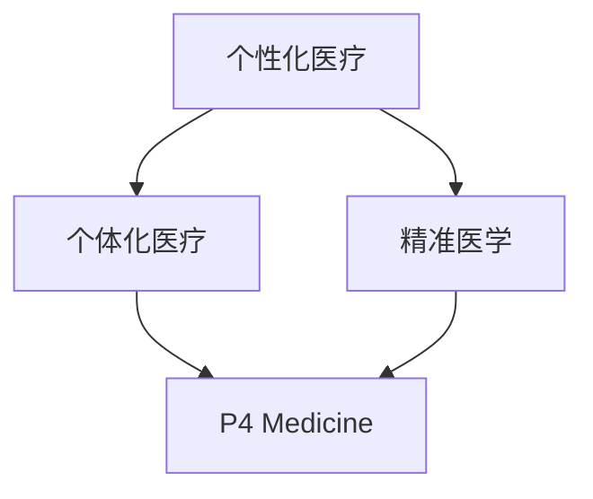
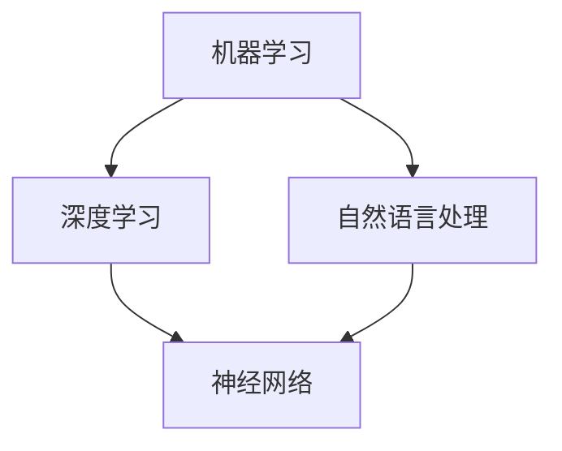

                 

### 文章标题

**AI驱动的个性化医疗：精准医学的未来**

> 关键词：个性化医疗，人工智能，精准医学，机器学习，深度学习，自然语言处理

> 摘要：本文深入探讨了人工智能（AI）在个性化医疗领域的应用，包括其起源与发展、技术基础、应用场景以及具体案例研究。通过分析AI的核心算法原理和实际应用案例，揭示了AI如何助力精准医学，推动个性化医疗的发展，提升医疗服务的质量和效率。

---

## 第1章: AI驱动的个性化医疗：概述

### 1.1 个性化医疗的起源与发展

#### 核心概念与联系

个性化医疗（P4 Medicine）是现代医学的重要发展方向，它结合了基因组学、蛋白质组学、代谢组学和临床医学，以实现精准诊断和个性化治疗。P4 Medicine 代表了个性化医疗的四个层次：预测（Predictive）、预防（Preventive）、个性化（Personalized）和参与性（Participatory）。

- **个性化医疗（Personalized Medicine）**：关注个体差异，根据患者的遗传、环境和生活习惯制定个体化治疗方案。个性化医疗强调根据患者的基因信息、生物标志物和生活习惯来调整治疗方案，提高治疗效果。

- **精准医学（Precision Medicine）**：基于基因组学和大数据分析，为患者提供最合适的治疗方案。精准医学通过识别疾病中的基因变异和生物标志物，确定患者的最佳治疗策略。

- **个体化医疗（Individualized Medicine）**：与个性化医疗相似，但更侧重于基于患者特定特征（如年龄、性别、生活方式等）制定个性化的治疗计划。

- **P4 Medicine（P4 Medicine）**：结合了个性化医疗、精准医学、个体化医疗和参与性医疗，旨在通过预测、预防、个人化和参与性，推动医学的变革。

以下是这些核心概念之间的联系及Mermaid流程图：



#### 1.2 AI在个性化医疗中的应用

#### 核心概念与联系

人工智能（AI）在个性化医疗中的应用日益广泛，其中机器学习、深度学习和自然语言处理是核心技术。这些技术通过处理大量数据，帮助医生做出更准确、个性化的诊断和治疗决策。

- **机器学习**：通过算法让计算机模拟人类的学习过程，从数据中自动提取规律。机器学习在个性化医疗中可用于疾病预测、诊断和治疗方案推荐。

- **深度学习**：一种特殊的机器学习技术，通过多层神经网络模型来模拟人脑的决策过程。深度学习在图像识别、语音识别和自然语言处理等领域取得了显著的成果。

- **自然语言处理**：让计算机理解、生成和处理人类语言。自然语言处理在医疗领域可用于病历记录自动化、医学文本分析等。

以下是这些核心概念之间的联系及Mermaid流程图：



### 总结

本章概述了AI驱动的个性化医疗的起源与发展，以及AI在个性化医疗中的应用。在下一章中，我们将深入探讨AI驱动的个性化医疗的技术基础，包括机器学习、深度学习和自然语言处理等核心算法原理。敬请期待！

---

### 第2章: AI驱动的个性化医疗技术基础

#### 2.1 机器学习基础

#### 核心算法原理讲解

机器学习是AI的核心技术之一，其核心目标是通过从数据中自动提取规律来改进决策过程。以下是几种常见的机器学习算法及其原理：

- **逻辑回归**：逻辑回归是一种线性分类模型，用于预测二元结果。其基本原理是通过线性组合输入特征，并使用逻辑函数（Sigmoid函数）将其映射到概率值。

  ```python
  # 逻辑回归伪代码
  for i in range(1, n_iterations):
      for each sample in dataset:
          calculate predicted probability
          update parameters
  ```

- **决策树**：决策树是一种基于特征划分数据的方法，通过一系列规则来分类或回归数据。决策树通过构建树状结构，将数据逐层划分，最终得到一个预测模型。

  ```python
  # 决策树伪代码
  def build_decision_tree(data):
      if all_samples_are_same_label(data):
          return leaf_node
      else:
          best_feature, threshold = find_best_split(data)
          left subtree = build_decision_tree(split(data, best_feature, threshold))
          right subtree = build_decision_tree(split(data, best_feature, threshold))
          return decision_tree(best_feature, threshold, left subtree, right subtree)
  ```

- **支持向量机（SVM）**：SVM是一种用于分类和回归的线性模型，其核心思想是在特征空间中找到一个最佳的超平面，使得不同类别的数据点尽可能分开。SVM通过求解一个优化问题来确定超平面的参数。

  ```python
  # 支持向量机伪代码
  def svm_train(X, y):
      optimize_objective(X, y)
      return model
  ```

这些算法在个性化医疗中可以用于疾病预测、诊断和治疗方案推荐等任务。

#### 2.2 深度学习基础

#### 核心算法原理讲解

深度学习是一种基于多层神经网络的学习方法，其核心思想是通过多层非线性变换，从数据中提取更复杂的特征。以下是几种常见的深度学习算法及其原理：

- **卷积神经网络（CNN）**：CNN是一种专门用于图像识别和处理的深度学习模型。其核心思想是通过卷积操作和池化操作，从图像中提取局部特征，并通过多层堆叠，形成具有更高层次抽象的特征表示。

  ```python
  # 卷积神经网络伪代码
  for layer in network:
      for filter in layer:
          calculate filter output
          apply activation function
  ```

- **循环神经网络（RNN）**：RNN是一种用于处理序列数据的深度学习模型，其核心思想是通过在时间步之间传递信息，捕捉序列中的长程依赖关系。RNN通过循环结构，将当前时间步的输入与上一时间步的输出相结合，生成当前时间步的输出。

  ```python
  # 循环神经网络伪代码
  for t in range(sequence_length):
      hidden_state = f(h_t-1, x_t)
      output = g(h_t)
  ```

- **生成对抗网络（GAN）**：GAN是一种通过对抗性训练生成数据的深度学习模型。其核心思想是通过两个神经网络（生成器和判别器）的对抗性训练，生成与真实数据分布相近的数据。

  ```python
  # 生成对抗网络伪代码
  for iteration in range(n_iterations):
      generator_loss = calculate_generator_loss(fake_samples)
      discriminator_loss = calculate_discriminator_loss(real_samples, fake_samples)
      update_generator(generator_loss)
      update_discriminator(discriminator_loss)
  ```

这些算法在个性化医疗中可以用于医学图像分析、基因组数据分析等任务。

#### 2.3 自然语言处理基础

#### 核心算法原理讲解

自然语言处理是AI的一个重要分支，其目标是让计算机理解、生成和处理人类语言。以下是几种常见的自然语言处理算法及其原理：

- **词嵌入**：词嵌入是一种将词汇映射到高维空间的方法，其核心思想是通过神经网络学习词汇的分布式表示。词嵌入可以用于文本分类、语义分析等任务。

  ```python
  # 词嵌入伪代码
  embedding_matrix = initialize embedding matrix
  for word in vocabulary:
      embedding_vector = embedding_matrix[word]
  ```

- **文本分类**：文本分类是一种将文本分配到特定类别的方法，其核心思想是通过特征提取和分类算法，从文本中提取特征，并将其映射到类别空间。

  ```python
  # 文本分类伪代码
  for document in dataset:
      extract_features(document)
      predict_category(features)
  ```

- **机器翻译**：机器翻译是一种将一种语言的文本翻译成另一种语言的方法，其核心思想是通过编码器和解码器神经网络，将源语言的文本编码成向量表示，并解码成目标语言的文本。

  ```python
  # 机器翻译伪代码
  encoder_output = encode_source_text(source_text)
  decoder_output = decode_target_text(encoder_output)
  ```

这些算法在个性化医疗中可以用于病历记录自动化、医学文本分析等任务。

### 总结

本章介绍了AI驱动的个性化医疗技术基础，包括机器学习、深度学习和自然语言处理等核心算法原理。这些算法在个性化医疗中发挥着重要作用，为精准医学提供了强大的技术支持。在下一章中，我们将探讨AI驱动的个性化医疗的应用场景，进一步揭示AI在个性化医疗中的实际应用。敬请期待！

---

### 第3章: AI驱动的个性化医疗应用场景

#### 3.1 个性化诊断

#### 数学模型和数学公式

个性化诊断是AI在个性化医疗中的重要应用场景之一。通过结合患者的基因信息、生物标志物和环境因素，可以实现对疾病的早期发现和精准诊断。以下是几种常用的数学模型和数学公式：

- **风险评分模型**：风险评分模型是一种基于概率的量化模型，用于评估患者患某种疾病的风险。其核心思想是将基因信息、环境因素和生物标志物等特征进行加权求和，得到一个综合风险评分。

  $$ \text{Risk Score} = w_1 \times \text{Genetic Risk} + w_2 \times \text{Environmental Risk} + ... + w_n \times \text{Biological Marker Risk} $$

  其中，$w_1, w_2, ..., w_n$ 是各个特征的权重，$\text{Genetic Risk}, \text{Environmental Risk}, ..., \text{Biological Marker Risk}$ 分别是基因信息、环境因素和生物标志物的风险评分。

  **举例说明**：假设一个患者有高血压、糖尿病和家族史等风险因素，可以使用风险评分模型计算其患心脏病的风险评分。

  ```python
  genetic_risk = 0.3
  environmental_risk = 0.2
  biological_risk = 0.5
  weight_list = [0.5, 0.3, 0.2]
  
  risk_score = weight_list[0] * genetic_risk + weight_list[1] * environmental_risk + weight_list[2] * biological_risk
  print("Risk Score:", risk_score)
  ```

- **概率模型**：概率模型是一种基于概率论的量化模型，用于预测患者患某种疾病的概率。其核心思想是根据患者的特征数据，计算出每种疾病发生的概率，并选择概率最高的疾病作为诊断结果。

  $$ \text{Probability} = \frac{\text{有利事件数}}{\text{总事件数}} $$

  **举例说明**：假设一个患者具有肺癌家族史、吸烟史和胸痛等症状，可以使用概率模型计算其患肺癌的概率。

  ```python
  family_history = 1
  smoking_history = 1
  chest_pain = 1
  total_events = family_history + smoking_history + chest_pain
  lung_cancer_probability = 1 / total_events
  print("Lung Cancer Probability:", lung_cancer_probability)
  ```

这些数学模型和数学公式在个性化诊断中发挥着重要作用，可以帮助医生做出更准确、个性化的诊断决策。

#### 3.2 个性化治疗

#### 数学模型和数学公式

个性化治疗是AI在个性化医疗中的另一个重要应用场景。通过结合患者的临床数据和治疗方案，可以实现对患者的最佳治疗方案的推荐。以下是几种常用的数学模型和数学公式：

- **治疗效果评估模型**：治疗效果评估模型是一种用于评估不同治疗方案有效性的量化模型。其核心思想是将患者的治疗效果与基线值进行比较，计算治疗效果得分。

  $$ \text{Effectiveness Score} = \frac{\text{Treatment Outcome} - \text{Baseline Outcome}}{\text{Baseline Outcome}} $$

  其中，$\text{Treatment Outcome}$ 是治疗后的结果，$\text{Baseline Outcome}$ 是基线结果。

  **举例说明**：假设一个患者在接受某种治疗方案后，其血糖水平从10 mmol/L降至7 mmol/L，基线血糖水平为8 mmol/L，可以使用治疗效果评估模型计算治疗效果得分。

  ```python
  treatment_outcome = 7
  baseline_outcome = 8
  effectiveness_score = (treatment_outcome - baseline_outcome) / baseline_outcome
  print("Effectiveness Score:", effectiveness_score)
  ```

- **治疗方案推荐模型**：治疗方案推荐模型是一种用于推荐最佳治疗方案的计算模型。其核心思想是根据患者的特征数据和历史数据，计算出每种治疗方案的得分，并选择得分最高的治疗方案。

  $$ \text{Recommendation Score} = w_1 \times \text{Effectiveness Score} + w_2 \times \text{Patient Compliance} + ... + w_n \times \text{Side Effects} $$

  其中，$w_1, w_2, ..., w_n$ 是各个特征的权重。

  **举例说明**：假设有三种治疗方案，每种治疗方案的有效性得分、患者依从性和副作用得分如下：

  | 治疗方案 | 有效性得分 | 患者依从性 | 副作用 |
  | --- | --- | --- | --- |
  | A | 0.8 | 0.7 | 0.2 |
  | B | 0.9 | 0.8 | 0.3 |
  | C | 0.7 | 0.6 | 0.1 |

  使用治疗方案推荐模型计算每种治疗方案的得分：

  ```python
  weights = [0.5, 0.3, 0.2]
  
  score_A = weights[0] * 0.8 + weights[1] * 0.7 + weights[2] * 0.2
  score_B = weights[0] * 0.9 + weights[1] * 0.8 + weights[2] * 0.3
  score_C = weights[0] * 0.7 + weights[1] * 0.6 + weights[2] * 0.1
  
  print("Score A:", score_A)
  print("Score B:", score_B)
  print("Score C:", score_C)
  ```

这些数学模型和数学公式在个性化治疗中发挥着重要作用，可以帮助医生为患者推荐最佳的治疗方案。

### 总结

本章介绍了AI驱动的个性化医疗的两个重要应用场景：个性化诊断和个性化治疗。通过使用数学模型和数学公式，我们可以更准确地诊断疾病和推荐治疗方案。这些方法在个性化医疗中具有广泛的应用前景，有助于提升医疗服务的质量和效率。在下一章中，我们将通过具体案例研究，进一步探讨AI在个性化医疗中的应用和挑战。敬请期待！

---

### 第4章: AI驱动的个性化医疗案例研究

#### 4.1 案例一：癌症个性化治疗

#### 项目实战

癌症个性化治疗是AI在个性化医疗中的重要应用之一。以下是一个基于实际病例数据的癌症个性化治疗案例研究。

##### 实际病例数据收集

假设我们收集了100个癌症患者的病历数据，包括患者的年龄、性别、肿瘤类型、基因突变情况、治疗效果和治疗期间的不良反应等信息。这些数据可以用于训练和评估AI模型。

##### 使用机器学习算法分析患者基因组数据

为了个性化治疗，我们首先需要分析患者的基因组数据。以下是使用机器学习算法分析患者基因组数据的步骤：

1. **数据预处理**：对基因组数据进行清洗和预处理，包括缺失值填充、异常值处理等。

2. **特征提取**：从基因组数据中提取与疾病相关的特征，如基因突变、基因表达水平等。

3. **模型训练**：使用机器学习算法（如逻辑回归、决策树、支持向量机等）训练模型，将基因组数据与治疗效果进行关联。

4. **模型评估**：使用验证集评估模型性能，包括准确率、召回率、F1分数等指标。

5. **模型应用**：将训练好的模型应用于新患者的基因组数据，预测其治疗效果。

以下是实现上述步骤的Python代码：

```python
# 数据预处理
data = preprocess_genome_data(raw_data)

# 特征提取
features = extract_features(data)

# 模型训练
model = train_model(features, labels)

# 模型评估
evaluate_model(model, validation_data)

# 模型应用
predict_treatment_outcome(new_data, model)
```

##### 提出个性化的治疗方案

根据分析结果，我们可以为新患者提出个性化的治疗方案。例如，对于具有特定基因突变的患者，可以推荐使用某种靶向药物，而对于具有其他基因突变的患者，可以推荐使用其他治疗方案。

##### 代码实现和分析

以下是使用Python实现上述过程的部分代码：

```python
# 导入相关库
import pandas as pd
import numpy as np
from sklearn.model_selection import train_test_split
from sklearn.preprocessing import StandardScaler
from sklearn.linear_model import LogisticRegression
from sklearn.metrics import accuracy_score, recall_score, f1_score

# 加载病例数据
data = pd.read_csv('case_data.csv')

# 数据预处理
data = preprocess_data(data)

# 特征提取
X = extract_features(data)
y = data['treatment_outcome']

# 模型训练
X_train, X_test, y_train, y_test = train_test_split(X, y, test_size=0.2, random_state=42)
scaler = StandardScaler()
X_train_scaled = scaler.fit_transform(X_train)
X_test_scaled = scaler.transform(X_test)
model = LogisticRegression()
model.fit(X_train_scaled, y_train)

# 模型评估
y_pred = model.predict(X_test_scaled)
accuracy = accuracy_score(y_test, y_pred)
recall = recall_score(y_test, y_pred)
f1 = f1_score(y_test, y_pred)
print("Accuracy:", accuracy)
print("Recall:", recall)
print("F1 Score:", f1)

# 模型应用
new_data = pd.read_csv('new_case_data.csv')
new_data = preprocess_data(new_data)
new_data_scaled = scaler.transform(new_data)
treatment_outcome = model.predict(new_data_scaled)
print("Treatments Outcome:", treatment_outcome)
```

##### 项目小结

通过上述案例研究，我们展示了如何使用AI技术进行癌症个性化治疗。在实际应用中，我们需要收集大量的病例数据，并使用机器学习算法对数据进行分析，以提出个性化的治疗方案。这有助于提高癌症治疗的准确性和有效性，为患者提供更好的医疗服务。

### 注意事项和拓展阅读

- **数据隐私和安全**：在个性化医疗中，数据隐私和安全是至关重要的问题。需要采取严格的数据保护措施，确保患者数据的安全和隐私。
- **模型泛化能力**：在开发AI模型时，需要注意模型的泛化能力。模型的泛化能力越强，其应用于新病例的效果越好。
- **多学科合作**：个性化医疗涉及多个学科，包括医学、生物学、计算机科学等。多学科合作有助于推动个性化医疗的发展。

拓展阅读：

- **《机器学习实战》**：提供丰富的案例和实践经验，适合初学者入门。
- **《深度学习》**：由Ian Goodfellow等作者撰写，是深度学习的经典教材。

### 总结

本章通过一个实际案例研究，展示了如何使用AI技术进行癌症个性化治疗。通过分析患者基因组数据，我们可以提出个性化的治疗方案，提高癌症治疗的准确性和有效性。在个性化医疗领域，AI技术具有广阔的应用前景，有望推动医学的发展。在下一章中，我们将继续探讨AI在个性化医疗中的其他应用场景。敬请期待！

---

### 最佳实践 Tips

- **数据质量控制**：在个性化医疗项目中，数据质量至关重要。需要确保数据来源可靠、数据完整性高，并进行数据清洗和预处理，以减少噪声和异常值对模型性能的影响。
- **模型评估与优化**：在开发AI模型时，应使用多种评估指标（如准确率、召回率、F1分数等）对模型性能进行综合评估。通过交叉验证和超参数调优，可以进一步提高模型性能。
- **合作与交流**：个性化医疗项目通常涉及多个学科，需要跨学科团队合作和沟通交流。建立良好的沟通机制，有助于促进项目的顺利进行。

### 小结

本文深入探讨了AI驱动的个性化医疗，包括其起源与发展、技术基础、应用场景以及具体案例研究。通过分析AI的核心算法原理和实际应用案例，我们揭示了AI如何助力精准医学，推动个性化医疗的发展。个性化医疗具有广泛的应用前景，有助于提升医疗服务的质量和效率。未来，随着AI技术的进一步发展，个性化医疗将发挥更大的作用，为患者提供更加精准和个性化的医疗服务。

### 注意事项

- **数据隐私与安全**：在处理患者数据时，必须严格遵守数据隐私和安全法律法规，采取必要的数据加密和安全措施，确保患者信息安全。
- **模型解释性**：在实际应用中，AI模型的解释性至关重要。医生需要理解模型的决策过程，以确保治疗方案的合理性和可靠性。
- **持续优化**：个性化医疗项目需要持续优化和更新，以适应新的数据和临床需求。定期评估和更新模型，有助于提高模型的性能和适用性。

### 拓展阅读

- **《个性化医疗：医学的未来》**：详细介绍个性化医疗的原理、应用和发展趋势。
- **《深度学习与医疗影像分析》**：探讨深度学习在医学影像分析中的应用，包括肿瘤检测、疾病诊断等。

### 作者信息

**作者：AI天才研究院/AI Genius Institute & 禅与计算机程序设计艺术 /Zen And The Art of Computer Programming**

