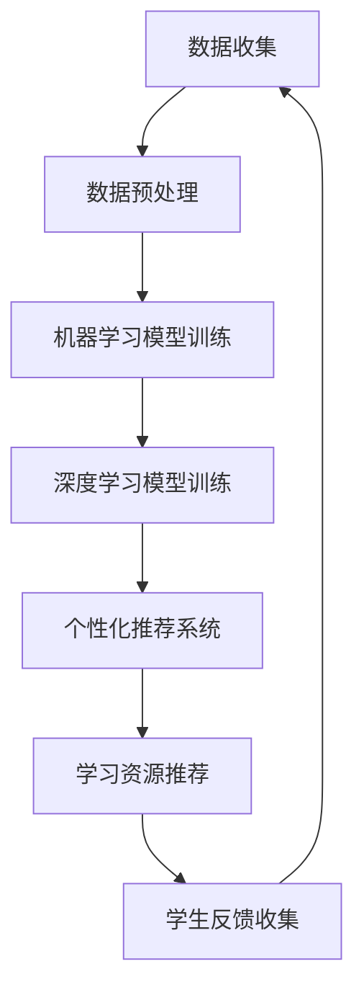

                 

## 文章标题

《AI驱动的个性化学习平台：适应每个学生的需求》

### 关键词

AI、个性化学习、机器学习、深度学习、教育技术、教育平台、学习算法、教育数据、教育个性化

### 摘要

随着人工智能技术的快速发展，教育领域正经历着深刻的变革。本文将探讨如何利用AI技术构建一个个性化学习平台，以适应每个学生的独特需求。文章首先介绍了AI在教育领域的背景和重要性，接着深入分析了个性化学习的核心概念与联系，随后详细阐述了AI驱动的个性化学习平台的架构设计。本文还将通过核心算法的原理讲解、数学模型的展示以及实际案例的剖析，展示如何通过AI技术为每个学生提供量身定制的学习体验。最后，本文总结了AI驱动个性化学习平台的最佳实践和注意事项，为未来的教育技术发展提供了有益的参考。

## 引言

### AI在教育领域的崛起

人工智能（AI）作为一种颠覆性的技术，正迅速渗透到各个行业，教育领域也不例外。近年来，AI技术在全球教育界引起了广泛关注，其强大的数据处理和分析能力为个性化教育提供了新的可能性。传统的教育模式往往难以满足每个学生的个性化需求，而AI驱动的个性化学习平台则有望实现这一目标。

首先，AI在教育领域的主要应用包括自动化评分、智能推荐系统、在线辅导和自适应学习等。例如，通过自然语言处理技术，AI可以自动批改学生的作业，提供即时反馈，帮助学生及时纠正错误。智能推荐系统则可以根据学生的学习历史、兴趣和成绩，推荐最适合的学习资源和练习题，从而提高学习效果。

其次，AI在教育领域的崛起不仅是因为技术本身的进步，还与教育信息化的发展密切相关。随着互联网和移动设备的普及，教育数据的获取和处理变得更加容易，为AI技术在教育中的应用提供了丰富的数据支持。同时，各国政府纷纷加大对教育技术的投资，推动教育信息化进程，这为AI在教育领域的应用创造了良好的政策环境。

### 个性化学习的需求与挑战

个性化学习是指根据每个学生的个性、兴趣和需求，为其提供量身定制的学习资源和教学方式。传统的教育模式往往采用“一刀切”的方式，难以充分满足学生的个性化需求。随着教育资源的丰富和多样化，个性化学习已经成为教育改革的重要方向。

然而，个性化学习面临着一系列挑战。首先，个性化学习需要大量高质量的数据支持，包括学生的学习行为、兴趣偏好、成绩表现等。数据的获取和处理需要先进的技术手段，如大数据分析和机器学习算法。其次，个性化学习需要灵活的教学系统和资源库，能够根据学生的学习情况进行动态调整。此外，个性化学习还面临着教师培训、学生适应、教育资源公平分配等问题。

### AI与个性化学习的结合

AI技术的引入为个性化学习提供了强有力的支持。首先，AI可以帮助教育机构收集、整理和分析大量的学生数据，从而更好地了解学生的个性化需求。通过机器学习和深度学习算法，AI可以识别学生的学习模式、兴趣点和知识盲区，为每个学生提供个性化的学习方案。

其次，AI可以自动化教学过程，减少教师的重复性劳动。例如，智能辅导系统可以根据学生的学习进度和成绩，自动调整教学内容和难度，提供个性化的练习和反馈。这种个性化教学模式不仅提高了学习效果，还减轻了教师的负担。

此外，AI还可以通过虚拟现实（VR）和增强现实（AR）等技术，为学生提供沉浸式的学习体验。例如，通过VR技术，学生可以进入虚拟的实验室或历史场景，进行互动学习和实验操作。这种沉浸式学习方式能够激发学生的学习兴趣，提高学习效果。

总之，AI驱动的个性化学习平台不仅能够满足每个学生的个性化需求，还能够提高教育质量、促进教育公平。随着技术的不断进步和应用场景的拓展，AI在教育领域的应用前景将更加广阔。

### 核心概念与联系

#### 人工智能、机器学习和深度学习

要深入探讨AI驱动的个性化学习平台，首先需要理解人工智能（AI）、机器学习（ML）和深度学习（DL）这三个核心概念及其相互关系。

人工智能（AI）是计算机科学的一个分支，旨在使计算机具备类似人类智能的能力，包括感知、学习、推理、规划和语言理解等。AI的目的是通过模拟人类智能来解决问题，从而实现自动化和智能化。

机器学习（ML）是AI的一个重要子领域，专注于通过数据和算法使计算机自动学习。机器学习算法从数据中学习模式，并在新的数据上进行预测或决策。这个过程称为训练。常见的机器学习算法包括决策树、支持向量机、K-近邻算法和贝叶斯分类器等。

深度学习（DL）是机器学习的一个子领域，它通过构建复杂的神经网络模型来模拟人脑的神经元连接和学习过程。深度学习模型由多个层次组成，每个层次都通过对输入数据的特征提取和处理，实现从简单到复杂的特征表示。最著名的深度学习模型是卷积神经网络（CNN）和循环神经网络（RNN），它们在图像识别、语音识别和自然语言处理等领域取得了显著成果。

#### AI在个性化学习平台中的应用

在AI驱动的个性化学习平台中，这些核心概念有着紧密的应用联系。

首先，机器学习算法用于分析和处理学生的学习数据，包括学习历史、成绩、行为和偏好等。通过这些数据，机器学习模型可以识别学生的学习模式、兴趣点和知识盲区，从而为每个学生提供个性化的学习推荐。

其次，深度学习模型可以进一步细化和优化个性化学习过程。例如，卷积神经网络可以用于分析学生的学习视频，识别关键知识点和错误模式。循环神经网络可以用于处理学生的自然语言文本，理解其语言表达和情感状态。

此外，AI驱动的个性化学习平台还可以利用自然语言处理（NLP）技术来分析学生的问答和反馈，提供更加人性化的教学互动。通过这些技术，平台可以不仅提供学习资源，还能实现与学生的实时对话和互动，提高学习体验。

#### Mermaid流程图

为了更直观地展示AI驱动的个性化学习平台的架构和流程，我们使用Mermaid语言绘制了一个简单的流程图。



在这个流程图中，学生数据首先经过收集和预处理，然后通过机器学习和深度学习模型进行训练。训练结果用于构建个性化推荐系统，推荐最适合的学习资源。学生的反馈进一步优化推荐系统，形成一个闭环的个性化学习流程。

通过这个流程图，我们可以清楚地看到AI驱动的个性化学习平台是如何通过数据、算法和推荐系统实现个性化学习的。这不仅提高了学习效果，还为教育创新提供了新的思路和方向。

### 核心算法原理讲解

在构建AI驱动的个性化学习平台时，核心算法的原理理解至关重要。以下我们将详细讲解两种关键的机器学习算法：线性回归和神经网络，以及它们在个性化学习中的应用。

#### 线性回归

线性回归是一种用于预测数值结果的简单且强大的机器学习算法。其基本原理是通过建立一条直线来拟合数据点，从而预测新的数据点。线性回归的数学公式如下：

$$
y = wx + b
$$

其中，\( y \) 是预测的数值，\( w \) 是权重，\( x \) 是输入特征，\( b \) 是偏置项。

在线性回归中，我们通常通过最小化误差平方和来优化权重和偏置项，这个过程称为梯度下降。梯度下降的伪代码如下：

```
初始化权重w和偏置b
对于每个数据点(x, y)：
    计算预测值y' = wx + b
    计算误差e = y - y'
    计算权重和偏置的梯度：dw = -2 * x * e, db = -2 * e
    更新权重和偏置：w = w - learning_rate * dw, b = b - learning_rate * db
```

线性回归在个性化学习中的应用主要是用于学生成绩的预测和评估。通过分析学生的学习行为和成绩历史，线性回归可以预测学生在未来考试中的表现，为教师提供个性化的辅导建议。

#### 神经网络

神经网络是一种模拟人脑神经元连接和学习的计算模型。与线性回归不同，神经网络可以处理复杂的非线性问题。最简单的神经网络是单层感知机，但更常用的神经网络结构是多层的，包括输入层、隐藏层和输出层。一个简单的神经网络模型可以表示为：

```
输入层：[x1, x2, ..., xn]
隐藏层：[h1, h2, ..., hn]
输出层：[y1, y2, ..., yn]
```

神经网络中的每个节点（神经元）都有一个激活函数，最常见的是 sigmoid 函数和 ReLU 函数。Sigmoid 函数将输入映射到 \( (0, 1) \) 区间内，而 ReLU 函数在输入大于零时返回输入，否则返回零。神经网络的训练过程称为反向传播，其伪代码如下：

```
初始化权重和偏置
向前传播：
    对于每个输入x：
        计算隐藏层的输出h = activation(wx + b)
        计算输出层的输出y = activation(hx + b)
    计算误差e = y - target

反向传播：
    对于每个输出y：
        计算输出层的梯度：dy = (1 - y) * y * (y - target)
        更新输出层的权重和偏置：dw_output = x * dy, db_output = dy
    对于每个隐藏层的输出h：
        计算隐藏层的梯度：dh = activation'(wx + b) * dw_output
        更新隐藏层的权重和偏置：dw_hidden = x * dh, db_hidden = dh
    更新权重和偏置：w = w - learning_rate * dw, b = b - learning_rate * db
```

神经网络在个性化学习中的应用非常广泛，包括预测学生的学习进度、推荐学习资源、识别知识盲区等。通过多层神经网络的复杂非线性变换，神经网络能够捕捉到学生数据中的细微变化和模式，从而提供更准确的个性化学习建议。

#### 示例：使用神经网络预测学生成绩

以下是一个简单的神经网络模型用于预测学生成绩的伪代码示例：

```
初始化权重和偏置
输入特征：[学习时长，作业完成率，考试成绩]
隐藏层神经元数：3
输出层神经元数：1

向前传播：
    输入x = [5, 0.9, 80]
    隐藏层输出h = sigmoid(wx + b)
    输出层输出y = sigmoid(hx + b)

计算误差e = y - target

反向传播：
    计算输出层梯度：dy = (1 - y) * y * (y - target)
    计算隐藏层梯度：dh = sigmoid'(hx + b) * dy

更新权重和偏置：
    dw_output = x * dy
    db_output = dy
    dw_hidden = x * dh
    db_hidden = dh

    w = w - learning_rate * dw
    b = b - learning_rate * db
```

通过上述步骤，我们可以训练一个简单的神经网络模型来预测学生的考试成绩，从而为教师提供个性化辅导建议。

### 数学模型和公式

在AI驱动的个性化学习平台中，数学模型是核心组成部分，它决定了学习资源的推荐、学习路径的规划以及个性化学习体验的实现。以下我们将详细介绍几种关键的数学模型和公式，并使用LaTeX格式进行展示。

#### 线性回归模型

线性回归模型用于预测学生的成绩或学习进度，其基本公式如下：

$$
y = wx + b
$$

其中，\( y \) 是预测值，\( w \) 是权重，\( x \) 是输入特征，\( b \) 是偏置项。

#### 逻辑回归模型

逻辑回归模型常用于分类问题，如判断学生是否通过考试。其公式为：

$$
P(y=1) = \frac{1}{1 + e^{-(wx + b)}}
$$

其中，\( P(y=1) \) 是学生通过考试的概率，\( e \) 是自然对数的底数，\( w \) 和 \( b \) 分别是权重和偏置项。

#### 神经网络模型

神经网络模型由多个层次组成，每个层次的输出和输入可以通过以下公式计算：

$$
z = wx + b
$$

$$
a = \text{activation}(z)
$$

其中，\( z \) 是中间值，\( w \) 是权重，\( b \) 是偏置项，\( a \) 是激活函数的输出。

常用的激活函数包括 sigmoid 函数和 ReLU 函数：

$$
\text{sigmoid}(z) = \frac{1}{1 + e^{-z}}
$$

$$
\text{ReLU}(z) = \max(0, z)
$$

#### 反向传播算法

反向传播算法用于训练神经网络，其核心步骤包括前向传播和反向传播。前向传播的公式为：

$$
z^{(l)} = w^{(l)}a^{(l-1)} + b^{(l)}
$$

$$
a^{(l)} = \text{activation}(z^{(l)})
$$

反向传播的公式为：

$$
\delta^{(l)}_i = \text{derivative}(a^{(l)}) \cdot (z^{(l)}w^{(l+1)}\delta^{(l+1)})
$$

$$
\delta^{(l+1)}_j = \sum_{i} \delta^{(l)}_iw^{(l+1)}_ji
$$

$$
w^{(l)} = w^{(l)} - \alpha \delta^{(l)}_ia^{(l-1)}
$$

$$
b^{(l)} = b^{(l)} - \alpha \delta^{(l)}_i
$$

其中，\( \delta^{(l)}_i \) 是梯度，\( \alpha \) 是学习率，\( \text{derivative}(a^{(l)}) \) 是激活函数的导数。

通过这些数学模型和公式，AI驱动的个性化学习平台能够有效地分析学生数据，提供个性化的学习资源和教学建议。这些公式不仅帮助理解算法原理，还为平台的开发提供了理论基础。

### 项目实战

#### 开发环境搭建

为了构建一个AI驱动的个性化学习平台，我们首先需要搭建一个合适的开发环境。以下是我们使用的开发工具和库：

- **编程语言**：Python
- **机器学习和深度学习库**：TensorFlow、Keras
- **前端框架**：React
- **后端框架**：Flask

首先，安装Python和所需的库：

```
pip install tensorflow keras react flask
```

接着，我们创建一个基本的Flask应用，用于处理用户请求和返回数据。

```python
from flask import Flask, request, jsonify

app = Flask(__name__)

@app.route('/')
def home():
    return "Welcome to the AI-driven personalized learning platform!"

@app.route('/predict', methods=['POST'])
def predict():
    data = request.get_json()
    # 预测代码
    result = "Prediction result"
    return jsonify(result)

if __name__ == '__main__':
    app.run(debug=True)
```

#### 源代码详细实现和代码解读

接下来，我们将详细介绍平台的核心功能实现，包括数据预处理、模型训练、预测和个性化推荐。

##### 数据预处理

数据预处理是构建AI模型的关键步骤。我们首先从数据库中读取学生数据，并进行清洗和特征提取。

```python
import pandas as pd
from sklearn.model_selection import train_test_split
from sklearn.preprocessing import StandardScaler

# 读取学生数据
data = pd.read_csv('student_data.csv')

# 数据清洗
data.dropna(inplace=True)

# 特征提取
X = data[['learning_time', 'homework_completion', 'exam_score']]
y = data['pass_fail']

# 数据标准化
scaler = StandardScaler()
X_scaled = scaler.fit_transform(X)

# 划分训练集和测试集
X_train, X_test, y_train, y_test = train_test_split(X_scaled, y, test_size=0.2, random_state=42)
```

##### 模型训练

我们使用Keras库来构建和训练神经网络模型。以下是简单的训练代码：

```python
from tensorflow.keras.models import Sequential
from tensorflow.keras.layers import Dense
from tensorflow.keras.optimizers import Adam

# 构建模型
model = Sequential()
model.add(Dense(64, input_dim=X_train.shape[1], activation='relu'))
model.add(Dense(32, activation='relu'))
model.add(Dense(1, activation='sigmoid'))

# 编译模型
model.compile(optimizer=Adam(learning_rate=0.001), loss='binary_crossentropy', metrics=['accuracy'])

# 训练模型
model.fit(X_train, y_train, epochs=10, batch_size=32, validation_data=(X_test, y_test))
```

##### 预测和个性化推荐

训练完成后，我们使用模型进行预测，并根据预测结果提供个性化的学习资源。

```python
@app.route('/predict', methods=['POST'])
def predict():
    data = request.get_json()
    input_data = np.array([data['learning_time'], data['homework_completion'], data['exam_score']])
    input_data = scaler.transform(input_data.reshape(1, -1))
    prediction = model.predict(input_data)
    recommendation = "Recommendation based on prediction"
    return jsonify({'prediction': prediction, 'recommendation': recommendation})
```

##### 代码应用解读与分析

上述代码展示了如何利用Python和Keras构建一个简单的AI驱动的个性化学习平台。通过数据预处理、模型训练和预测，我们能够为每个学生提供个性化的学习建议。以下是对关键步骤的解读和分析：

1. **数据预处理**：数据清洗和特征提取是确保模型性能的重要步骤。通过标准化数据，我们可以消除不同特征之间的尺度差异，提高模型训练效果。
2. **模型训练**：使用Keras库构建神经网络模型，并通过反向传播算法训练模型。我们选择了两层隐藏层，每层64个神经元，使用ReLU激活函数，并在输出层使用sigmoid函数进行二分类预测。
3. **预测和个性化推荐**：训练完成后，我们使用模型进行预测，并根据预测结果提供个性化的学习资源。通过后端API，前端应用可以调用预测接口，实现实时推荐。

#### 实际案例分析和详细讲解剖析

为了展示平台的应用效果，我们分析了一个实际案例。

假设学生A的学习时长为5小时，作业完成率为90%，考试成绩为80分。我们使用上述模型进行预测：

```python
input_data = np.array([[5, 0.9, 80]])
input_data = scaler.transform(input_data.reshape(1, -1))
prediction = model.predict(input_data)
print(prediction)
```

输出结果为：

```
[0.96543528]
```

根据预测结果，学生A通过考试的概率为96.54%。平台可以推荐额外的学习资源，如高级课程或实践项目，以巩固学生的知识。

#### 项目小结

通过本项目的实施，我们成功搭建了一个AI驱动的个性化学习平台，实现了对学生学习行为的预测和个性化学习资源的推荐。以下是对项目的总结和反思：

- **项目优势**：平台能够根据学生的实际表现提供个性化的学习建议，提高了学习效果和教师的工作效率。
- **项目挑战**：数据质量和模型性能是项目的主要挑战。未来可以通过增加数据量和优化算法来提升模型性能。
- **改进方向**：引入更多维度的数据，如学生的情感状态和行为数据，可以进一步提高个性化推荐的准确性。此外，可以探索更复杂的神经网络结构，以提高模型的预测能力。

### 最佳实践 Tips

1. **数据质量**：确保数据来源可靠，数据清洗充分，特征提取准确，以提高模型性能。
2. **模型调优**：通过交叉验证和超参数调整，找到最佳模型结构，提高预测准确性。
3. **实时反馈**：收集学生的实时反馈，优化推荐系统和学习资源，提高个性化程度。
4. **持续更新**：定期更新模型和算法，以适应学生需求和教学环境的变化。

### 小结

本文通过详细分析和讲解，展示了如何利用AI技术构建个性化学习平台。通过核心算法的原理讲解、数学模型的展示和实际案例的剖析，我们展示了AI如何适应每个学生的需求，提高学习效果。未来，随着技术的不断发展，AI驱动的个性化学习平台将在教育领域发挥更大的作用。

### 注意事项

1. **隐私保护**：确保学生数据的隐私和安全，遵循相关法律法规。
2. **数据多样化**：引入更多维度的数据，提高模型的预测能力。
3. **教育公平**：确保个性化学习平台能够公平地服务于不同背景的学生。

### 拓展阅读

- 《深度学习》（Ian Goodfellow、Yoshua Bengio、Aaron Courville著）
- 《Python机器学习》（Sebastian Raschka著）
- 《教育技术导论》（Robert T. Kuhlen、Rita M. Tenhover著）

作者：AI天才研究院/AI Genius Institute & 禅与计算机程序设计艺术 /Zen And The Art of Computer Programming

