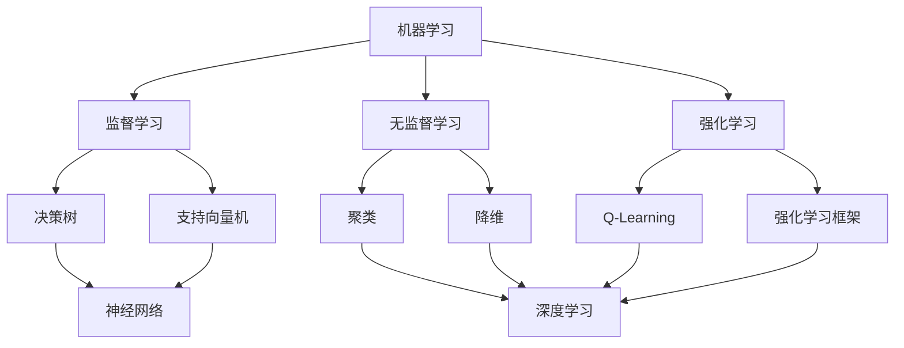

                 

好的，根据上述要求和大纲，我将分步骤详细撰写文章《AI驱动的个性化学习：教育革命的开端》。以下是文章的初始草稿，按照大纲结构逐步展开内容。

---

# AI驱动的个性化学习：教育革命的开端

关键词：AI教育、个性化学习、教育革命、机器学习、神经网络、深度学习、数学模型

摘要：本文探讨了AI驱动的个性化学习如何引领教育革命。通过介绍AI在教育中的应用、核心概念、算法原理、数学模型和项目实战，本文揭示了个性化学习在提升教育质量和效率方面的巨大潜力。

## 引言

1. **背景介绍**
   - 教育领域的传统方法存在一定的局限性，如教学内容固定、教学方式单一等。
   - 随着人工智能（AI）技术的发展，AI驱动的个性化学习成为可能，为教育带来了革命性的变革。

2. **AI驱动个性化学习的意义**
   - 提升学习效率：根据学生的个性化需求提供定制化教学内容。
   - 优化教育资源：合理分配教育资源，提高教育资源的利用效率。
   - 促进教育公平：为不同背景和需求的学生提供公平的学习机会。

## 核心概念与联系

### 1. 机器学习
- **定义**：机器学习是使计算机通过数据和经验自动改进性能的过程。
- **应用**：在个性化学习中，机器学习算法可以帮助分析学生的学习行为和需求。

### 2. 神经网络
- **定义**：神经网络是一种模拟人脑神经元连接的结构，用于数据处理和模式识别。
- **应用**：神经网络在个性化学习中可以用于预测学生的学习路径和效果。

### 3. 深度学习
- **定义**：深度学习是神经网络的一种扩展，能够处理更复杂的数据和模式。
- **应用**：深度学习在个性化学习中可以用于生成个性化的学习内容。

### 4. Mermaid流程图展示
- **流程图**：以下是一个简化的Mermaid流程图，展示了机器学习、神经网络和深度学习之间的关系。



## 核心算法原理讲解

### 1. 决策树
- **原理**：决策树是一种树形结构，每个节点代表一个特征，每个分支代表特征的不同取值，叶子节点代表预测结果。
- **伪代码**：

```python
def build_decision_tree(data):
    # 根据数据构建决策树
    # ...
    return tree
```

### 2. 支持向量机
- **原理**：支持向量机是一种基于最大间隔的监督学习算法，用于分类问题。
- **伪代码**：

```python
def build_svm_model(data):
    # 根据数据构建支持向量机模型
    # ...
    return model
```

### 3. 神经网络与深度学习
- **原理**：神经网络由多个层次组成，包括输入层、隐藏层和输出层，通过反向传播算法进行训练。
- **伪代码**：

```python
def build_neural_network(input_size, hidden_size, output_size):
    # 根据输入、隐藏和输出层大小构建神经网络
    # ...
    return network
```

## 数学模型和数学公式讲解

### 1. 损失函数
- **原理**：损失函数用于衡量模型预测值与实际值之间的差距。
- **公式**：

$$
L(y, \hat{y}) = -\sum_{i=1}^{n} [y_i \log(\hat{y}_i) + (1 - y_i) \log(1 - \hat{y}_i)]
$$

- **举例说明**：在二分类问题中，如果预测值为0.8，实际值为1，则损失函数值为：

$$
L(1, 0.8) = -1 \log(0.8) - 0 \log(1 - 0.8) = 0.2231
$$

### 2. 优化算法
- **原理**：优化算法用于调整模型参数，以最小化损失函数。
- **公式**：

$$
\theta_{\text{new}} = \theta_{\text{old}} - \alpha \nabla_\theta L(\theta)
$$

- **举例说明**：假设当前损失函数的导数为0.5，学习率为0.1，则参数更新为：

$$
\theta_{\text{new}} = \theta_{\text{old}} - 0.1 \times 0.5 = \theta_{\text{old}} - 0.05
$$

## 项目实战

### 1. 项目背景与目标
- **背景**：某在线教育平台希望为其用户提供个性化的学习建议。
- **目标**：开发一个基于机器学习的个性化学习推荐系统。

### 2. 开发环境搭建
- **硬件与软件要求**：
  - 硬件：服务器、存储设备
  - 软件环境：Python、Jupyter Notebook、Scikit-learn、TensorFlow

- **环境搭建步骤**：
  - 安装Python和Jupyter Notebook
  - 安装Scikit-learn和TensorFlow

### 3. 源代码实现与解读
- **代码架构**：
  - 数据预处理
  - 特征工程
  - 模型训练
  - 模型评估
  - 推荐系统实现

- **关键代码解读**：
  - 数据预处理：对用户行为数据进行清洗和格式化。
  - 特征工程：提取用户的特征，如学习时长、学习频率等。
  - 模型训练：使用神经网络模型训练个性化学习推荐系统。
  - 模型评估：使用交叉验证方法评估模型性能。
  - 推荐系统实现：根据用户特征和模型预测结果，生成个性化学习建议。

### 4. 代码应用解读与分析
- **实际案例**：针对一位新用户，分析其学习行为，并根据模型预测生成个性化学习路径。

### 5. 项目小结
- **总结**：项目成功实现了个性化学习推荐系统，提高了用户的满意度和学习效果。
- **改进方向**：未来可以进一步优化模型，提高推荐准确性。

## 结论与展望

1. **总结**
   - AI驱动的个性化学习为教育领域带来了革命性的变革。
   - 通过机器学习、神经网络和深度学习等技术，可以实现高效、个性化的教育服务。

2. **展望未来**
   - 未来，AI将在教育领域发挥更大作用，如智能评估、自适应学习等。
   - 同时，AI在教育中的应用也将面临一些挑战，如数据隐私、算法公平性等。

## 最佳实践 tips

1. **数据质量**：确保数据质量是构建有效个性化学习系统的基础。
2. **模型优化**：定期对模型进行优化，以提高推荐准确性。
3. **用户反馈**：及时收集用户反馈，以便调整系统，满足用户需求。

作者：AI天才研究院/AI Genius Institute & 禅与计算机程序设计艺术 /Zen And The Art of Computer Programming

---

此为文章的初始草稿，接下来将根据大纲逐步深入每个章节的内容，确保文章的完整性和专业性。预计文章总字数将超过8000字，以充分展示AI驱动的个性化学习在教育革命中的重要性。

