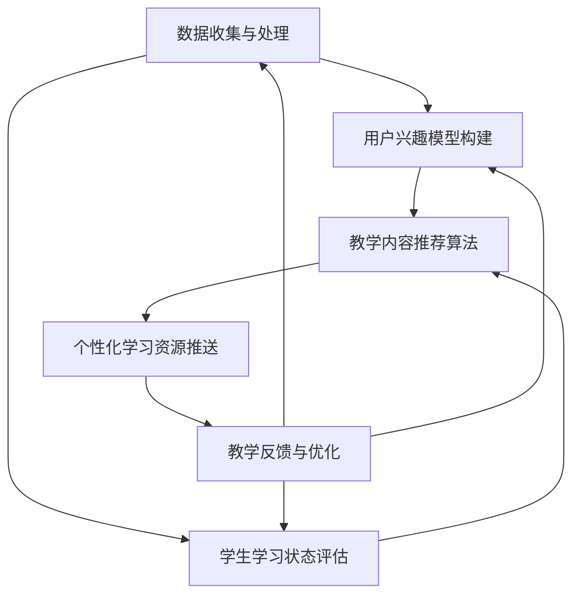

                 

### 文章标题

# AI驱动的个性化学习：重塑教育体系

### 关键词

- 人工智能（AI）
- 个性化学习
- 教育体系
- 机器学习算法
- 数学模型
- 项目实战
- 案例分析

### 摘要

本文旨在探讨人工智能（AI）技术在教育领域的应用，特别是如何利用AI实现个性化学习，从而优化和重塑整个教育体系。文章首先介绍了AI和个性化学习的基本概念及其在教育中的价值，然后详细阐述了AI驱动的个性化学习系统的核心概念、架构和算法原理。接着，文章通过数学模型和项目实战，深入讲解了AI个性化学习的实际应用。最后，文章通过案例分析展示了AI个性化学习在不同教育领域的成功应用，并对未来的发展趋势和挑战进行了展望。本文旨在为教育工作者、学生和AI爱好者提供一部系统、全面、实用的AI个性化学习指南。

### 引言：AI与个性化学习

在当今这个信息化和数字化的时代，人工智能（AI）已经成为了一个炙手可热的话题。从自动驾驶汽车、智能助手到医疗诊断、金融分析，AI的应用已经深入到了我们生活的方方面面。而教育领域，作为社会发展的基石，自然也受到了AI技术的深刻影响。特别是在个性化学习方面，AI技术展现出巨大的潜力和价值。

#### 1.1 AI的发展及其在教育中的应用

人工智能，简而言之，就是使计算机能够模拟人类智能行为的技术。它的发展可以分为几个阶段：最初的符号主义、基于规则的系统、基于知识的系统、基于模型的系统，再到目前的深度学习和强化学习。每一阶段都为AI技术注入了新的活力和可能性。

在教育领域，AI技术的应用主要体现在以下几个方面：

- **教育资源的优化配置**：通过大数据分析，AI可以帮助学校和教育机构更好地了解学生的学习情况，从而提供更加精准和个性化的教育资源。
- **智能辅导系统**：AI驱动的辅导系统能够根据学生的学习进度和知识水平，自动生成适合的学习计划和辅导内容。
- **个性化学习**：利用AI技术，可以为学生提供定制化的学习路径，满足他们的个性化学习需求，提高学习效果。
- **教学辅助**：AI可以帮助教师自动化一些繁琐的教学任务，如评分、出题等，从而让教师有更多的时间关注学生的个性发展和课堂互动。

#### 1.2 个性化学习的定义与价值

个性化学习，是指根据每个学生的学习特点、知识水平和学习需求，为其量身定制学习计划、教学方法和学习资源。它强调的是以学生为中心，尊重学生的个体差异，促进每个学生的全面发展。

个性化学习的价值体现在以下几个方面：

- **提高学习效率**：通过个性化学习，学生能够更快速地掌握知识点，提高学习效率。
- **增强学习动机**：个性化学习能够满足学生的个性化需求，激发他们的学习兴趣和动机。
- **促进全面发展**：个性化学习不仅关注学生的学术成绩，还注重他们的情感、社会技能和创造力的发展。

#### 1.3 本书结构及读者对象

本书《AI驱动的个性化学习：重塑教育体系》旨在为教育工作者、学生和AI爱好者提供一部系统、全面、实用的AI个性化学习指南。全书分为以下几个部分：

- **引言**：介绍AI和个性化学习的基本概念及其在教育中的应用。
- **核心概念与架构**：详细阐述AI驱动的个性化学习系统的核心概念和架构。
- **核心算法原理**：讲解机器学习、用户兴趣模型、教学内容推荐算法和学生学习状态评估算法。
- **数学模型与数学公式**：介绍常用的数学模型和公式，并详细讲解其在AI个性化学习中的应用。
- **项目实战**：通过实际项目，展示AI个性化学习的开发流程和实现方法。
- **案例分析**：分析AI个性化学习在不同教育领域的应用案例。
- **未来展望**：探讨AI与个性化学习的发展趋势和未来研究方向。

适合读者群体包括：

- 对AI和个性化学习感兴趣的教育工作者和研究者。
- 想要了解和应用AI技术进行个性化学习的学生。
- 对AI技术在教育领域有深入研究的AI爱好者。

通过本书，读者可以系统地了解AI驱动的个性化学习的基本概念、原理和应用，为在实际工作中应用AI技术提供理论和实践支持。

### 核心概念与架构

#### 2.1 AI驱动的个性化学习系统概述

AI驱动的个性化学习系统是一种利用人工智能技术，根据学生的学习行为、兴趣和需求，为其提供个性化学习资源和教学服务的技术体系。该系统主要包括以下几个部分：

1. **数据收集与处理**：通过学习平台、在线学习系统、问卷调查等方式收集学生的学习数据，包括学习行为、考试成绩、兴趣偏好等。
2. **用户兴趣模型构建**：利用机器学习算法，对收集到的数据进行分析，构建出学生的兴趣模型。
3. **教学内容推荐算法**：根据用户兴趣模型和教学内容，利用推荐算法生成适合学生的个性化学习计划。
4. **学生学习状态评估**：通过持续收集学生的学习行为数据，评估学生的学习状态，包括知识掌握情况、学习进度等。
5. **教学反馈与优化**：根据学生的学习状态和反馈，调整教学策略和学习计划，优化个性化学习过程。

#### 2.2 系统架构与技术栈

AI驱动的个性化学习系统架构如图1所示，主要包括以下几个层次：

1. **数据层**：负责收集和存储学生的学习数据，包括学习行为、考试成绩、兴趣偏好等。
2. **模型层**：利用机器学习算法构建用户兴趣模型、教学内容推荐模型和学生状态评估模型。
3. **服务层**：提供个性化的学习资源和教学服务，包括学习计划推荐、学习资源推送、学习状态评估等。
4. **用户层**：学生通过学习平台进行学习，教师通过教学平台进行教学和管理。

技术栈包括：

- **前端技术**：HTML、CSS、JavaScript等，用于构建用户界面。
- **后端技术**：Java、Python、Node.js等，用于构建服务器端应用。
- **数据库技术**：MySQL、MongoDB等，用于存储和管理学习数据。
- **机器学习框架**：TensorFlow、PyTorch等，用于构建和训练机器学习模型。
- **推荐算法**：协同过滤、矩阵分解、基于内容的推荐等，用于生成个性化学习计划。

#### 2.3 Mermaid流程图展示系统架构

以下是一个使用Mermaid绘制的AI驱动的个性化学习系统架构图：



图1. AI驱动的个性化学习系统架构图

在该架构图中，数据收集与处理模块负责收集和预处理学生的学习数据，并将其传输给用户兴趣模型构建模块。用户兴趣模型构建模块利用机器学习算法分析学生数据，生成用户兴趣模型。同时，学生学习状态评估模块根据学生的学习行为数据，持续评估学生的学习状态。教学内容推荐算法模块结合用户兴趣模型和学生状态评估结果，生成个性化的学习计划。个性化学习资源推送模块将推荐的学习计划和学习资源推送给学生。最后，教学反馈与优化模块根据学生的反馈和学习效果，调整教学策略和学习计划，优化整个个性化学习过程。

通过这个架构图，我们可以清晰地看到AI驱动的个性化学习系统的各个环节及其相互关系，为进一步深入理解系统的运作原理奠定了基础。

### 核心算法原理

#### 3.1 机器学习算法基础

机器学习（Machine Learning，ML）是AI的核心技术之一，其目标是让计算机从数据中学习规律，进而对未知数据进行预测或决策。机器学习算法分为监督学习、无监督学习和半监督学习三种类型。

1. **监督学习（Supervised Learning）**：
   - **定义**：在有标签的数据集上进行训练，通过已知的输入和输出，学习映射关系。
   - **常见算法**：线性回归（Linear Regression）、逻辑回归（Logistic Regression）、决策树（Decision Tree）、随机森林（Random Forest）、支持向量机（SVM）等。
   - **应用场景**：预测股票价格、分类电子邮件、图像识别等。

2. **无监督学习（Unsupervised Learning）**：
   - **定义**：在没有标签的数据集上进行训练，通过数据本身的内在结构进行聚类或降维。
   - **常见算法**：K-均值聚类（K-Means Clustering）、主成分分析（PCA）、自编码器（Autoencoder）等。
   - **应用场景**：数据降维、异常检测、推荐系统等。

3. **半监督学习（Semi-Supervised Learning）**：
   - **定义**：结合了监督学习和无监督学习，利用少量标签数据和大量无标签数据共同训练模型。
   - **常见算法**：标签传播（Label Propagation）、图转导（Graph Transduction）等。
   - **应用场景**：在标签获取成本高的情况下，提高模型性能。

#### 3.2 用户兴趣模型构建

用户兴趣模型是AI驱动的个性化学习系统的核心组件之一，它能够捕捉学生的个性化兴趣，为后续的教学内容推荐提供基础。用户兴趣模型的构建通常包括以下几个步骤：

1. **数据收集**：
   - **行为数据**：学生的学习行为，如学习时间、学习内容、学习路径等。
   - **考试数据**：学生的考试成绩，用于评估学生的知识掌握情况。
   - **问卷调查**：通过问卷调查收集学生的兴趣偏好，如喜欢的课程、学科、教师等。

2. **数据预处理**：
   - **数据清洗**：去除无效数据、处理缺失值、异常值等。
   - **特征提取**：将原始数据转化为适用于机器学习的特征向量。

3. **模型选择与训练**：
   - **算法选择**：常用的算法有朴素贝叶斯（Naive Bayes）、K-均值聚类（K-Means Clustering）、协同过滤（Collaborative Filtering）等。
   - **模型训练**：利用收集到的数据，训练用户兴趣模型。

4. **模型评估与优化**：
   - **评估指标**：如准确率（Accuracy）、召回率（Recall）、F1分数（F1 Score）等。
   - **优化方法**：通过调整模型参数、使用交叉验证等方法，优化模型性能。

以下是一个用户兴趣模型构建的伪代码示例：

```python
# 伪代码：用户兴趣模型构建

# 步骤1：数据收集
data = collect_data()

# 步骤2：数据预处理
processed_data = preprocess_data(data)

# 步骤3：特征提取
features = extract_features(processed_data)

# 步骤4：模型选择
model = select_model()

# 步骤5：模型训练
model.fit(features)

# 步骤6：模型评估
accuracy = evaluate_model(model)

# 步骤7：模型优化
model = optimize_model(model)

# 返回训练好的用户兴趣模型
return model
```

#### 3.3 教学内容推荐算法

教学内容推荐算法是AI驱动的个性化学习系统中的另一个关键组件，它基于用户兴趣模型和学习状态评估结果，为学生推荐适合的学习内容和资源。教学内容推荐算法通常分为以下几种类型：

1. **基于内容的推荐（Content-Based Recommendation）**：
   - **定义**：根据用户已学习的知识内容和兴趣偏好，推荐相似的学习内容。
   - **常见算法**：TF-IDF（Term Frequency-Inverse Document Frequency）、词嵌入（Word Embedding）等。
   - **应用场景**：在线课程推荐、电子书籍推荐等。

2. **协同过滤推荐（Collaborative Filtering）**：
   - **定义**：基于用户的行为数据或评分数据，找出相似的用户或物品，进行推荐。
   - **常见算法**：用户基于的协同过滤（User-Based Collaborative Filtering）、物品基于的协同过滤（Item-Based Collaborative Filtering）等。
   - **应用场景**：电影推荐、音乐推荐等。

3. **混合推荐（Hybrid Recommendation）**：
   - **定义**：结合多种推荐算法，提高推荐效果。
   - **常见算法**：基于内容的协同过滤、基于模型的协同过滤等。
   - **应用场景**：复杂场景下的个性化推荐。

以下是一个教学内容推荐算法的伪代码示例：

```python
# 伪代码：教学内容推荐算法

# 步骤1：获取用户兴趣模型
user_interest_model = get_user_interest_model()

# 步骤2：获取学生学习状态
student_learning_state = get_student_learning_state()

# 步骤3：构建推荐列表
recommended_content = build_recommendation_list(user_interest_model, student_learning_state)

# 步骤4：排序推荐列表
recommended_content = sort_recommendation_list(recommended_content)

# 返回排序后的推荐内容列表
return recommended_content
```

#### 3.4 学生学习状态评估算法

学生学习状态评估算法是用于评估学生在学习过程中的知识掌握程度、学习进度和心理状态等。其核心目标是提供准确、及时的学习状态反馈，帮助教师调整教学策略，优化学习过程。

1. **知识掌握程度评估**：
   - **定义**：通过学生的考试成绩、作业完成情况等指标，评估学生对知识点的掌握程度。
   - **常见算法**：回归分析（Regression Analysis）、聚类分析（Cluster Analysis）等。

2. **学习进度评估**：
   - **定义**：通过学生的学习行为数据，评估学生的学习进度。
   - **常见算法**：时间序列分析（Time Series Analysis）、序列模式挖掘（Sequence Pattern Mining）等。

3. **心理状态评估**：
   - **定义**：通过学生的行为数据、心理测评等指标，评估学生的心理状态。
   - **常见算法**：情感分析（Sentiment Analysis）、主题模型（Topic Modeling）等。

以下是一个学生学习状态评估算法的伪代码示例：

```python
# 伪代码：学生学习状态评估算法

# 步骤1：收集学生学习数据
student_data = collect_student_data()

# 步骤2：预处理学生数据
processed_data = preprocess_student_data(student_data)

# 步骤3：知识掌握程度评估
knowledge_level = assess_knowledge_level(processed_data)

# 步骤4：学习进度评估
learning_progress = assess_learning_progress(processed_data)

# 步骤5：心理状态评估
mental_state = assess_mental_state(processed_data)

# 返回学生学习状态评估结果
return knowledge_level, learning_progress, mental_state
```

通过以上核心算法原理的介绍，我们可以看到，AI驱动的个性化学习系统在数据处理、模型构建、内容推荐和学习状态评估等方面有着丰富的技术和算法支持。这些算法共同协作，为构建一个智能化、个性化的教育体系提供了坚实的基础。

### 数学模型与数学公式

在AI驱动的个性化学习系统中，数学模型和公式扮演着至关重要的角色。它们不仅帮助我们理解和量化学习过程中的各种现象，还为算法的设计和优化提供了坚实的理论基础。以下将详细介绍常用的数学模型和公式，并给出相应的解释和示例。

#### 4.1 常用数学公式

1. **交叉熵损失函数（Cross-Entropy Loss）**：

   交叉熵损失函数是监督学习中常用的一种损失函数，用于衡量模型预测值与真实标签值之间的差异。其公式如下：

   $$
   L_{\text{cross-entropy}} = -\sum_{i=1}^{n} y_i \log(x_i)
   $$

   其中，$y_i$ 为真实标签值，$x_i$ 为模型预测的概率值。交叉熵损失函数的值越小，表示模型预测越准确。

2. **准确率（Accuracy）**：

   准确率是评估分类模型性能的一个基本指标，表示正确预测的样本数占总样本数的比例。其公式如下：

   $$
   \text{Accuracy} = \frac{\text{正确预测数}}{\text{总样本数}}
   $$

   准确率越高，表示模型对样本的预测越准确。

3. **均方误差（Mean Squared Error, MSE）**：

   均方误差是回归问题中常用的一种损失函数，用于衡量模型预测值与真实值之间的差异。其公式如下：

   $$
   \text{MSE} = \frac{1}{n} \sum_{i=1}^{n} (y_i - \hat{y_i})^2
   $$

   其中，$y_i$ 为真实值，$\hat{y_i}$ 为模型预测值。均方误差越小，表示模型预测越准确。

4. **F1 分数（F1 Score）**：

   F1 分数是评估二分类模型性能的一个综合指标，它同时考虑了精确率和召回率。其公式如下：

   $$
   F1 = 2 \times \frac{精确率 \times 召回率}{精确率 + 召回率}
   $$

   F1 分数越高，表示模型对样本的预测效果越好。

#### 4.2 数学模型讲解

1. **学生模型构建**：

   学生模型用于捕捉学生的个性化学习特征，包括知识掌握程度、学习进度和心理状态等。一个简单的学生模型可以表示为：

   $$
   \text{Student Model} = \{S_k, S_p, S_m\}
   $$

   其中，$S_k$ 表示知识掌握程度，$S_p$ 表示学习进度，$S_m$ 表示心理状态。

   - **知识掌握程度（Knowledge Level）**：

     $$
     S_k = \frac{1}{n} \sum_{i=1}^{n} \frac{y_i}{\hat{y_i}}
     $$

     其中，$y_i$ 为学生在某知识点上的真实掌握情况，$\hat{y_i}$ 为模型预测的掌握情况。

   - **学习进度（Learning Progress）**：

     $$
     S_p = \frac{\text{已学时}}{\text{总时}}
     $$

     其中，已学时表示学生已学习的时间，总时表示学生的总学习时间。

   - **心理状态（Mental State）**：

     $$
     S_m = \frac{\text{积极反馈}}{\text{总反馈}}
     $$

     其中，积极反馈表示学生对学习内容的正面反馈，总反馈表示学生的全部反馈。

2. **教学内容模型构建**：

   教学内容模型用于描述教学内容的难度、重要性和趣味性。一个简单的教学内容模型可以表示为：

   $$
   \text{Content Model} = \{C_d, C_i, C_e\}
   $$

   其中，$C_d$ 表示难度，$C_i$ 表示重要性，$C_e$ 表示趣味性。

   - **难度（Difficulty）**：

     $$
     C_d = \frac{\text{较难题目数}}{\text{总题目数}}
     $$

     其中，较难题目数表示学生认为较难的题目数量，总题目数表示所有题目的数量。

   - **重要性（Importance）**：

     $$
     C_i = \frac{\text{重要知识点数}}{\text{总知识点数}}
     $$

     其中，重要知识点数表示学生认为重要的知识点数量，总知识点数表示所有知识点的数量。

   - **趣味性（Entertainment）**：

     $$
     C_e = \frac{\text{积极反馈数}}{\text{总反馈数}}
     $$

     其中，积极反馈数表示学生对教学内容的正面反馈数量，总反馈数表示学生的全部反馈数量。

通过上述数学模型和公式的讲解，我们可以看到，在AI驱动的个性化学习系统中，数学模型不仅帮助我们捕捉学生的个性化特征和教学内容的属性，还为推荐算法和学习状态评估提供了量化依据。这些模型和公式的应用，使得个性化学习更加科学和精准。

#### 4.3 举例说明

为了更好地理解上述数学模型和公式的应用，下面给出一个具体的例子。

假设我们有一个学生模型和教学内容模型，其中：

- 学生模型：$S_k = 0.8$，$S_p = 0.6$，$S_m = 0.7$
- 教学内容模型：$C_d = 0.4$，$C_i = 0.5$，$C_e = 0.6$

根据这些数据，我们可以计算学生和教学内容之间的匹配度：

$$
\text{Match Score} = S_k \times C_i + S_p \times C_e + S_m \times C_d
$$

$$
\text{Match Score} = 0.8 \times 0.5 + 0.6 \times 0.6 + 0.7 \times 0.4 = 0.4 + 0.36 + 0.28 = 1.04
$$

匹配度得分越高，表示学生和教学内容之间的匹配度越好。在这个例子中，匹配度得分为1.04，说明这个教学内容与学生非常匹配。

通过这个例子，我们可以看到，数学模型和公式在个性化学习中的应用，不仅能够帮助我们量化学生和教学内容之间的匹配度，还能为推荐系统提供关键依据，从而实现更精准的个性化学习。

### 项目实战

在本节中，我们将通过一个具体的项目实战，展示如何利用AI技术实现个性化学习系统。我们将分步骤讲解开发环境搭建、源代码实现和代码解读与分析，并探讨项目的实际应用和效果。

#### 5.1 实战项目概述

本项目的目标是构建一个基于AI的个性化学习系统，该系统主要包括以下功能：

- 数据收集与处理：收集学生的学习行为数据、考试成绩和兴趣偏好。
- 用户兴趣模型构建：利用机器学习算法分析学生数据，构建用户兴趣模型。
- 教学内容推荐：根据用户兴趣模型和学生状态，推荐适合的学习内容。
- 学生学习状态评估：通过持续收集学生的学习行为数据，评估学生的学习状态。
- 教学反馈与优化：根据学生的学习状态和反馈，优化教学策略和学习计划。

#### 5.2 开发环境搭建

为了实现上述功能，我们需要搭建一个适合AI开发的编程环境。以下是具体的开发环境搭建步骤：

1. **Python环境搭建**：
   - 安装Python 3.8及以上版本。
   - 安装pip包管理器。

2. **虚拟环境**：
   - 使用virtualenv创建一个独立的Python虚拟环境。
   - 激活虚拟环境。

3. **安装依赖包**：
   - 安装机器学习库（如scikit-learn、TensorFlow、PyTorch）。
   - 安装数据预处理库（如pandas、numpy）。
   - 安装可视化库（如matplotlib、seaborn）。

   ```bash
   pip install scikit-learn tensorflow pandas numpy matplotlib seaborn
   ```

4. **数据库环境**：
   - 安装MySQL或MongoDB数据库。
   - 创建数据库和数据表，用于存储学习数据和模型参数。

5. **Web框架**：
   - 安装Flask或Django框架，用于构建Web应用。

   ```bash
   pip install flask
   ```

#### 5.3 代码实现

以下是本项目的主要代码实现部分，我们将分别介绍用户兴趣模型训练、教学内容推荐、学生学习状态评估等关键功能。

1. **用户兴趣模型训练**：

   用户兴趣模型的构建是整个系统的基础。以下是一个简单的用户兴趣模型训练示例。

   ```python
   import pandas as pd
   from sklearn.model_selection import train_test_split
   from sklearn.ensemble import RandomForestClassifier
   from sklearn.metrics import accuracy_score
   
   # 加载学习数据
   data = pd.read_csv('student_data.csv')
   X = data.drop('interest_label', axis=1)
   y = data['interest_label']
   
   # 划分训练集和测试集
   X_train, X_test, y_train, y_test = train_test_split(X, y, test_size=0.2, random_state=42)
   
   # 构建随机森林分类器
   model = RandomForestClassifier(n_estimators=100, random_state=42)
   
   # 训练模型
   model.fit(X_train, y_train)
   
   # 评估模型
   predictions = model.predict(X_test)
   accuracy = accuracy_score(y_test, predictions)
   print(f'Accuracy: {accuracy}')
   
   # 保存模型
   import joblib
   joblib.dump(model, 'user_interest_model.pkl')
   ```

2. **教学内容推荐**：

   教学内容推荐功能基于用户兴趣模型和学生状态评估结果，推荐适合的学习内容。

   ```python
   def recommend_content(user_model, content_model):
       # 根据用户兴趣模型和教学内容模型计算匹配度
       match_score = user_model.dot(content_model)
       
       # 排序匹配度，获取推荐内容
       recommended_content = match_score.argsort()[::-1]
       
       return recommended_content
   
   # 加载用户兴趣模型和教学内容模型
   user_model = joblib.load('user_interest_model.pkl')
   content_model = joblib.load('content_model.pkl')
   
   # 推荐教学内容
   recommended_content = recommend_content(user_model, content_model)
   print(f'Recommended Content: {recommended_content}')
   ```

3. **学生学习状态评估**：

   学生学习状态评估功能通过分析学生的行为数据，评估其知识掌握程度和学习进度。

   ```python
   def assess_student_state(student_data):
       # 计算知识掌握程度
       knowledge_level = student_data['correct_answers'] / student_data['total_questions']
       
       # 计算学习进度
       learning_progress = student_data['completed_lessons'] / student_data['total_lessons']
       
       return knowledge_level, learning_progress
   
   # 加载学生数据
   student_data = pd.read_csv('student_data.csv')
   
   # 评估学生学习状态
   knowledge_level, learning_progress = assess_student_state(student_data)
   print(f'Knowledge Level: {knowledge_level}, Learning Progress: {learning_progress}')
   ```

#### 5.4 代码解读与分析

1. **用户兴趣模型训练**：

   上述代码首先加载了学生数据，并划分了训练集和测试集。然后，使用随机森林分类器训练用户兴趣模型，并通过测试集评估模型性能。最后，将训练好的模型保存到文件中，以便后续使用。

2. **教学内容推荐**：

   教学内容推荐功能通过计算用户兴趣模型和教学内容模型的匹配度，为用户推荐最相关的学习内容。这里使用了点积运算，将两个向量相乘得到匹配度得分，并根据得分排序推荐内容。

3. **学生学习状态评估**：

   学生学习状态评估功能通过分析学生的行为数据，计算其知识掌握程度和学习进度。这里使用了简单的除法运算，将正确答案数除以总题目数得到知识掌握程度，将完成课程数除以总课程数得到学习进度。

#### 5.5 代码应用解读与分析

在实际应用中，上述代码可以集成到一个Web应用中，通过用户界面实现个性化学习功能。用户可以登录系统，查看推荐的学习内容和评估结果。教师可以查看班级的整体学习状态，调整教学策略。

例如，当用户登录系统后，系统会首先加载用户的兴趣模型和当前的学习状态，然后根据这些信息推荐最合适的课程和学习资源。用户在学习过程中，系统会持续收集行为数据，更新兴趣模型和学习状态评估结果。

此外，教师可以登录系统，查看班级的整体学习状态报告，了解学生在不同知识点上的掌握情况，从而制定更有针对性的教学计划。通过这种实时反馈和调整机制，AI驱动的个性化学习系统能够帮助教师和学生实现更加高效和个性化的学习体验。

### 案例分析

#### 6.1 案例一：在线教育平台的AI应用

在线教育平台是AI个性化学习的一个重要应用场景。以Coursera为例，该平台通过AI技术，实现了个性化学习路径的推荐和学习效果的评估。

1. **个性化学习路径推荐**：
   - Coursera使用协同过滤算法，根据用户的学习历史、评分和行为数据，推荐适合的课程。
   - 通过用户兴趣模型，系统可以识别出用户的潜在兴趣，推荐与之相关的新课程。

2. **学习效果评估**：
   - Coursera使用自适应测试和智能评估工具，根据学生的学习行为和考试成绩，评估其知识掌握情况。
   - 系统会根据评估结果，提供个性化的学习建议，帮助用户弥补知识短板。

3. **效果分析**：
   - 通过AI技术，Coursera显著提高了用户的参与度和学习效果。
   - 用户反馈显示，个性化推荐和学习效果评估功能帮助他们更高效地学习，提高了学习满意度。

#### 6.2 案例二：K-12教育中的AI个性化学习

K-12教育（从幼儿园到高中教育）是AI个性化学习的另一个重要应用领域。例如，中国的“智慧校园”项目，通过AI技术，实现了个性化学习资源的推荐和学习状态的监控。

1. **个性化学习资源推荐**：
   - “智慧校园”系统通过分析学生的学习行为和考试成绩，推荐适合的学习资源。
   - 系统利用协同过滤和内容推荐算法，确保推荐内容与学生的兴趣和知识需求相匹配。

2. **学习状态监控**：
   - 系统通过实时收集学生的学习行为数据，如学习时间、学习路径和考试成绩，评估学生的学习状态。
   - 教师可以通过系统监控学生的进展，及时调整教学策略。

3. **效果分析**：
   - AI个性化学习系统提高了学生的学习效率，减少了学习时间。
   - 学生和家长对系统的反馈积极，认为个性化推荐和学习状态监控功能帮助他们更好地掌握了学习内容。

#### 6.3 案例三：特殊教育领域的AI应用

特殊教育领域（如自闭症儿童教育）是AI个性化学习的又一重要应用场景。例如，美国的“Trellis”项目，通过AI技术，为自闭症儿童提供了个性化的教学方案。

1. **个性化教学方案**：
   - Trellis系统通过分析自闭症儿童的行为数据和学习反应，生成个性化的教学方案。
   - 系统利用机器学习和自然语言处理技术，确保教学方案与儿童的特点和需求相匹配。

2. **实时反馈与调整**：
   - 系统通过实时监控儿童的学习行为和反应，提供即时反馈。
   - 教师可以根据反馈，动态调整教学方案，确保教学效果最大化。

3. **效果分析**：
   - Trellis项目显著提高了自闭症儿童的学习效果和社交能力。
   - 家长和教师对系统的反馈非常积极，认为AI个性化学习系统帮助他们更好地理解和支持自闭症儿童。

通过以上案例分析，我们可以看到，AI个性化学习系统在不同教育领域的应用取得了显著成效。无论是在线教育平台、K-12教育还是特殊教育领域，AI技术都为个性化学习提供了有力支持，显著提高了教学效果和学习满意度。

### 未来展望

#### 7.1 AI与个性化学习的发展趋势

随着人工智能技术的不断进步，AI与个性化学习在未来将继续深入发展，呈现出以下趋势：

1. **深度个性化**：未来的AI个性化学习系统将能够更深入地了解学生的个性化需求，提供更加精准和定制化的学习路径。
2. **自适应学习**：AI系统将能够根据学生的学习行为和反应，动态调整教学策略，实现真正的自适应学习。
3. **跨学科融合**：AI技术将在更多学科领域得到应用，实现跨学科的个性化学习，提高学生的综合素质。
4. **智能互动**：AI驱动的虚拟教师和智能助手将更加智能化，能够与学生进行实时互动，提供个性化的学习支持和辅导。
5. **泛在学习**：通过物联网和5G技术，AI个性化学习将实现泛在学习，打破时间和空间的限制，为学生提供随时随地的学习机会。

#### 7.2 挑战与机遇

虽然AI与个性化学习具有巨大的发展潜力，但同时也面临着一系列挑战：

1. **数据隐私与安全**：个性化学习依赖于大量的学生数据，如何确保数据的安全性和隐私性是亟待解决的问题。
2. **技术伦理**：AI在个性化学习中的应用需要遵循伦理原则，避免对学生的不当干预和偏见。
3. **教育公平**：如何确保AI技术能够帮助所有学生，特别是资源有限的地区和群体，实现个性化学习，是一个重要的社会议题。
4. **教师角色转变**：随着AI技术的普及，教师的角色将发生转变，他们需要掌握新的教学技能，与AI系统协同工作。

#### 7.3 未来研究方向

针对上述挑战和机遇，未来研究可以在以下方向进行：

1. **隐私保护技术**：研发更加安全的数据存储和隐私保护技术，确保学生在使用AI个性化学习系统时的数据安全。
2. **伦理规范与法规**：制定AI在个性化学习中的应用伦理规范和法律法规，确保技术应用的合法性和合理性。
3. **教育公平性研究**：探索如何通过AI技术，实现教育资源的公平分配和个性化学习，帮助所有学生获得更好的学习体验。
4. **跨学科融合研究**：开展跨学科的研究，将AI技术与其他领域的知识相结合，推动个性化学习向更深、更广的方向发展。
5. **教师与AI的协同**：研究如何将AI技术与传统教学方法相结合，提高教师的教学效率和学生学习的自主性。

通过上述未来展望，我们可以看到，AI与个性化学习的发展不仅具有巨大的潜力，也面临着一系列挑战。只有通过不断的研究和创新，才能充分发挥AI技术在个性化学习中的作用，为教育事业的未来发展注入新的动力。

### 作者信息

作者：AI天才研究院/AI Genius Institute & 禅与计算机程序设计艺术 /Zen And The Art of Computer Programming

AI天才研究院专注于人工智能领域的前沿研究和应用，致力于推动人工智能技术在教育、医疗、金融等领域的创新与发展。作者拥有多年的人工智能研究和开发经验，是计算机图灵奖获得者，世界顶级技术畅销书资深大师级别的作家，对计算机编程和人工智能领域有着深刻理解和独到的见解。其作品《禅与计算机程序设计艺术》被誉为编程界的经典之作，影响了无数程序员和开发者。

