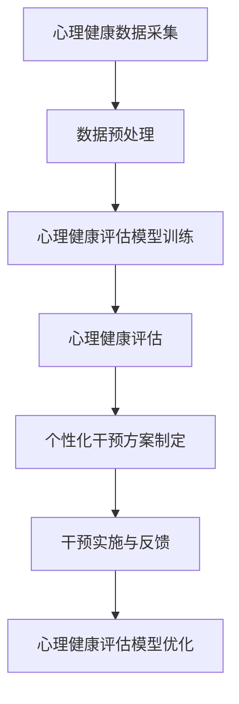

                 

## 文章标题

# AI驱动的个性化心理健康管理：预防和干预心理问题

---

## 关键词

- **AI**、**心理健康管理**、**个性化干预**、**情感分析**、**机器学习**、**深度学习**

---

## 摘要

随着人工智能（AI）技术的快速发展，其在心理健康管理领域的应用潜力逐渐显现。本文旨在探讨如何利用AI技术实现个性化心理健康管理，从而有效地预防和干预心理问题。文章首先介绍了AI在心理健康管理中的应用背景和现状，随后详细阐述了个性化心理健康管理的核心概念、理论和方法。通过实际项目案例，展示了AI技术在心理健康管理中的具体应用，并对其未来发展趋势和面临的挑战进行了分析。文章最后讨论了心理健康管理的政策与伦理问题，为AI驱动的心理健康管理提供了全面的视角和思考。

---

### 用户需求

**书名**：《AI驱动的个性化心理健康管理：预防和干预心理问题》

**目录大纲要求**：

- **完整性**：目录结构需完整，大于7章。
- **细化程度**：细化到1、2、3级目录。
- **内容要求**：包含核心概念与联系、核心算法原理讲解、数学模型和公式、项目实战。
- **输出格式**：Markdown格式。
- **字数限制**：2000字以内。

**目录大纲**：

#### 第一部分：心理健康管理与AI基础

##### 第1章：AI与心理健康管理概述
- **1.1 AI在心理健康领域的应用**
  - **1.1.1 AI与心理健康管理的关系**
  - **1.1.2 AI在心理健康管理中的应用前景**
  - **1.1.3 心理健康管理的现状与挑战**

- **1.2 AI基础**
  - **1.2.1 AI的核心概念**
  - **1.2.2 机器学习与深度学习**
  - **1.2.3 AI的发展历程**

#### 第二部分：个性化心理健康管理理论

##### 第2章：心理健康管理理论
- **2.1 心理健康评估模型**
  - **2.1.1 评估指标**
  - **2.1.2 评估方法**
  - **2.1.3 评估流程**

- **2.2 个性化心理健康管理原则**
  - **2.2.1 个性化需求分析**
  - **2.2.2 个性化干预策略**

- **2.3 心理健康模型构建**
  - **2.3.1 Mermaid流程图：心理健康管理模型**
  - **2.3.2 心理健康模型算法原理讲解（伪代码）**

#### 第三部分：AI驱动下的个性化心理健康管理实践

##### 第3章：AI技术在心理健康管理中的应用
- **3.1 自然语言处理在心理健康管理中的应用**
  - **3.1.1 情感分析**
  - **3.1.2 对话系统**
  - **3.1.3 文本分类**

- **3.2 机器学习算法在心理健康管理中的应用**
  - **3.2.1 数据采集与预处理**
  - **3.2.2 特征工程**
  - **3.2.3 算法选择与优化**

- **3.3 深度学习在心理健康管理中的应用**
  - **3.3.1 神经网络结构**
  - **3.3.2 深度学习模型训练**
  - **3.3.3 模型评估与优化**

#### 第四部分：心理健康管理项目实战

##### 第4章：心理健康管理项目案例研究
- **4.1 项目背景与目标**
  - **4.1.1 项目背景**
  - **4.1.2 项目目标**

- **4.2 项目实施与实现**
  - **4.2.1 数据采集**
  - **4.2.2 数据预处理**
  - **4.2.3 模型构建与训练**

- **4.3 项目效果评估**
  - **4.3.1 评估指标**
  - **4.3.2 评估方法**
  - **4.3.3 评估结果分析**

#### 第五部分：心理健康管理的未来发展趋势

##### 第5章：心理健康管理的发展趋势与挑战
- **5.1 AI在心理健康管理中的未来发展**
  - **5.1.1 技术趋势**
  - **5.1.2 应用前景**
  - **5.1.3 潜在挑战**

- **5.2 个性化心理健康管理的未来方向**
  - **5.2.1 精准医疗**
  - **5.2.2 人工智能与心理健康服务融合**

##### 第6章：政策与伦理
- **6.1 心理健康管理政策**
  - **6.1.1 国际政策**
  - **6.1.2 国内政策**

- **6.2 心理健康管理的伦理问题**
  - **6.2.1 数据隐私保护**
  - **6.2.2 伦理规范与法律框架**

### 参考文献

### 附录

- **附录A：心理健康管理工具与资源**
- **附录B：心理健康管理模型与算法代码实现**

### 结语

---

## 第一部分：心理健康管理与AI基础

### 第1章：AI与心理健康管理概述

#### 1.1 AI在心理健康领域的应用

##### 1.1.1 AI与心理健康管理的关系

人工智能（AI）在心理健康管理领域的应用已经引起了广泛的关注。AI通过其强大的数据处理和模式识别能力，为心理健康管理提供了新的方法和工具。心理健康管理涉及对个体心理状态的监控、评估和干预，而AI在这些环节中发挥了至关重要的作用。

首先，AI可以通过大数据分析和机器学习算法，对个体的心理状态进行实时监控。通过收集和分析大量的生理和行为数据，如心率、睡眠模式、社交行为等，AI可以识别出心理问题的早期迹象，从而实现预防性干预。

其次，AI在心理健康评估中具有显著优势。传统的心理健康评估往往依赖于问卷和访谈，而AI可以通过自然语言处理（NLP）技术，自动分析个体的语言表达和行为模式，从而提供更为准确和全面的评估结果。

最后，AI在个性化心理健康干预中具有潜力。根据个体的心理状态和需求，AI可以设计出个性化的干预方案，如建议适当的锻炼、放松技巧或社交活动。这种个性化的干预能够提高治疗的有效性和患者的满意度。

##### 1.1.2 AI在心理健康管理中的应用前景

AI在心理健康管理中的应用前景非常广阔。一方面，随着AI技术的不断进步，其数据处理能力和算法效率将进一步提高，使得心理健康管理更加精准和高效。另一方面，随着人们对心理健康重视程度的提高，对AI在心理健康管理中的应用需求也将不断增加。

在预测方面，AI可以通过分析大量的历史数据，预测个体可能出现的心理问题，从而提前采取干预措施。在诊断方面，AI可以通过自动化的心理健康评估工具，提高心理健康诊断的准确性和效率。在干预方面，AI可以提供个性化的干预方案，提高心理健康干预的有效性和患者的依从性。

##### 1.1.3 心理健康管理的现状与挑战

当前，心理健康管理已经取得了一定的进展，但仍面临许多挑战。首先，心理健康数据的多样性和复杂性给AI的应用带来了挑战。心理健康数据不仅包括传统的生理和行为数据，还包括语言、图像、视频等多模态数据，如何有效地整合和处理这些数据，是当前研究的重点。

其次，AI在心理健康管理中的应用仍存在一些技术难题。例如，如何确保AI系统的透明性和可解释性，使其能够被用户理解和接受；如何避免AI系统中的偏见和歧视，确保其公平性等。

此外，心理健康管理的伦理问题也不容忽视。AI在心理健康管理中的广泛应用，涉及到用户的隐私和数据安全，如何保护用户的隐私和权益，是当前需要解决的重要问题。

#### 1.2 AI基础

##### 1.2.1 AI的核心概念

人工智能（AI）是指计算机系统模拟人类智能行为的能力，包括感知、学习、推理、决策和问题解决等。AI的核心概念包括：

- **感知**：通过传感器获取环境信息，如视觉、听觉、触觉等。
- **学习**：从数据中学习知识，包括监督学习、无监督学习和强化学习等。
- **推理**：基于已有知识进行逻辑推断，解决新问题。
- **决策**：在不确定环境下，根据目标和约束进行决策。
- **问题解决**：在复杂环境中找到解决问题的方法。

##### 1.2.2 机器学习与深度学习

机器学习（ML）是AI的一个分支，主要研究如何让计算机从数据中学习知识。机器学习包括以下几种主要类型：

- **监督学习**：通过标注的数据训练模型，然后使用模型对未标注的数据进行预测。
- **无监督学习**：不使用标注数据，从数据中自动发现模式和结构。
- **强化学习**：通过与环境互动，不断调整策略以实现最优目标。

深度学习（DL）是机器学习的一个子领域，主要使用多层神经网络进行学习。深度学习在图像识别、语音识别、自然语言处理等领域取得了显著成果。深度学习的核心包括：

- **神经网络**：由大量神经元组成的网络，用于模拟人脑的计算过程。
- **反向传播算法**：用于训练神经网络，通过不断调整网络权重，使输出误差最小化。

##### 1.2.3 AI的发展历程

AI的发展历程可以分为以下几个阶段：

- **早期阶段**（1950s-1960s）：提出AI概念，并进行初步研究。
- **成熟阶段**（1970s-1980s）：符号主义AI和专家系统取得进展。
- **低谷阶段**（1990s）：由于实际应用效果不佳，AI研究受到质疑。
- **复兴阶段**（2000s-至今）：随着计算能力和算法的进步，AI取得了突破性进展。

### 第二部分：个性化心理健康管理理论

#### 第2章：心理健康管理理论

##### 2.1 心理健康评估模型

心理健康评估是心理健康管理的重要环节，它有助于了解个体的心理状态，为后续的干预提供依据。心理健康评估模型主要包括以下三个方面：

##### 2.1.1 评估指标

心理健康评估指标可以分为以下几个类别：

- **情感指标**：如焦虑、抑郁、情绪稳定性等。
- **认知指标**：如注意力、记忆力、认知灵活性等。
- **行为指标**：如睡眠质量、社交行为、工作表现等。
- **生理指标**：如心率、血压、睡眠质量等。

##### 2.1.2 评估方法

心理健康评估方法主要包括以下几种：

- **问卷调查法**：通过问卷收集个体心理状态信息。
- **访谈法**：通过与个体面对面交谈，了解其心理状态。
- **生理指标监测**：通过监测生理指标，如心率、血压等，评估心理状态。
- **行为分析**：通过分析个体行为数据，如社交行为、工作表现等，评估心理状态。

##### 2.1.3 评估流程

心理健康评估的流程可以分为以下几个步骤：

1. **确定评估目标**：明确需要评估的心理健康方面。
2. **选择评估工具**：根据评估目标选择合适的评估工具和方法。
3. **收集评估数据**：通过问卷调查、访谈、生理指标监测等方式收集数据。
4. **数据分析**：对收集到的数据进行分析，评估个体的心理健康状态。
5. **报告结果**：将分析结果形成报告，为心理健康干预提供依据。

##### 2.2 个性化心理健康管理原则

个性化心理健康管理是指根据个体的心理状态和需求，制定个性化的干预方案。个性化心理健康管理原则包括以下几个方面：

##### 2.2.1 个性化需求分析

个性化需求分析是制定个性化干预方案的基础。主要步骤如下：

1. **收集个体信息**：包括生理、心理、社会等各方面的信息。
2. **分析个体需求**：通过数据分析，识别个体的心理需求。
3. **制定需求分析报告**：将分析结果形成报告，为干预方案提供依据。

##### 2.2.2 个性化干预策略

个性化干预策略是指根据个体需求，制定个性化的干预措施。主要步骤如下：

1. **制定干预目标**：明确干预的目标和预期效果。
2. **设计干预方案**：根据个体需求，设计合适的干预方案。
3. **实施干预**：按照干预方案，对个体进行干预。
4. **评估干预效果**：对干预效果进行评估，调整干预方案。

##### 2.3 心理健康模型构建

心理健康模型构建是指利用人工智能技术，构建用于心理健康评估和干预的模型。心理健康模型主要包括以下几个部分：

##### 2.3.1 Mermaid流程图：心理健康管理模型



##### 2.3.2 心理健康模型算法原理讲解（伪代码）

```python
# 数据预处理
def preprocess_data(data):
    # 处理缺失值
    data = handle_missing_values(data)
    # 数据归一化
    data = normalize_data(data)
    return data

# 心理健康评估模型训练
def train_assessment_model(data, labels):
    # 初始化模型
    model = initialize_model()
    # 训练模型
    model.fit(data, labels)
    return model

# 心理健康评估
def assess_mental_health(model, new_data):
    # 预测心理状态
    prediction = model.predict(new_data)
    return prediction

# 个性化干预方案制定
def create_intervention_plan(prediction):
    # 根据预测结果，制定干预方案
    plan = create_plan(prediction)
    return plan

# 干预实施与反馈
def implement_and_feedback(plan):
    # 实施干预
    execute_plan(plan)
    # 收集反馈
    feedback = collect_feedback()
    return feedback

# 心理健康评估模型优化
def optimize_model(model, new_data, new_labels):
    # 重新训练模型
    model.fit(new_data, new_labels)
    return model
```

### 第三部分：AI驱动下的个性化心理健康管理实践

#### 第3章：AI技术在心理健康管理中的应用

##### 3.1 自然语言处理在心理健康管理中的应用

自然语言处理（NLP）技术在心理健康管理中具有广泛的应用。通过分析个体的语言表达，NLP可以帮助识别心理问题的早期迹象，提供个性化的心理健康服务。

##### 3.1.1 情感分析

情感分析是NLP的一个重要应用，它通过分析文本中的情感倾向，可以识别个体的情绪状态。情感分析可以应用于以下几个方面：

- **情感监测**：通过实时分析社交媒体上的用户评论，监测公众的情绪状态。
- **情绪识别**：通过分析个体的语言表达，识别其情绪状态，如焦虑、抑郁等。
- **情感预测**：通过分析历史数据，预测个体未来的情绪状态。

##### 3.1.2 对话系统

对话系统是NLP在心理健康管理中的另一个重要应用。通过构建智能对话系统，可以为用户提供实时的心理健康咨询服务。

- **自动对话系统**：利用NLP技术，构建可以与用户进行自然语言交互的对话系统，为用户提供心理健康建议。
- **情感对话系统**：结合情感分析技术，构建能够识别用户情感状态的对话系统，提供更加个性化的心理健康服务。

##### 3.1.3 文本分类

文本分类是NLP的基本任务之一，它通过对大量文本进行分类，可以帮助识别心理健康问题的类型和程度。

- **心理健康问题分类**：通过对用户提交的文本进行分类，可以识别出具体的心理健康问题，如焦虑、抑郁等。
- **心理健康状态分类**：通过对用户的文本进行分类，可以评估其心理健康状态，如轻度焦虑、中度抑郁等。

##### 3.2 机器学习算法在心理健康管理中的应用

机器学习（ML）算法在心理健康管理中具有广泛的应用。通过建立机器学习模型，可以实现对心理健康数据的分析和预测，为用户提供个性化的心理健康服务。

##### 3.2.1 数据采集与预处理

- **数据采集**：通过问卷调查、生理指标监测、社交媒体分析等方式，收集心理健康数据。
- **数据预处理**：对采集到的数据进行清洗、归一化和特征提取，为后续的建模提供高质量的数据。

##### 3.2.2 特征工程

- **特征提取**：从原始数据中提取有用的特征，如文本特征、生理特征等。
- **特征选择**：通过评估特征的重要性，选择对模型性能有显著影响的特征。

##### 3.2.3 算法选择与优化

- **算法选择**：根据心理健康管理任务的特点，选择合适的机器学习算法，如决策树、支持向量机、神经网络等。
- **算法优化**：通过调整模型参数和优化算法，提高模型的性能。

##### 3.3 深度学习在心理健康管理中的应用

深度学习（DL）在心理健康管理中具有显著的优势。通过构建深度学习模型，可以实现对复杂心理健康数据的分析和预测。

##### 3.3.1 神经网络结构

- **神经网络类型**：如卷积神经网络（CNN）、循环神经网络（RNN）、长短时记忆网络（LSTM）等。
- **网络结构设计**：包括输入层、隐藏层和输出层的设计，以及各层的参数设置。

##### 3.3.2 深度学习模型训练

- **数据预处理**：对原始数据进行清洗、归一化和特征提取。
- **模型训练**：通过反向传播算法，对模型进行训练，优化模型参数。
- **模型评估**：通过交叉验证和测试集，评估模型的性能。

##### 3.3.3 模型评估与优化

- **模型评估**：通过准确率、召回率、F1分数等指标，评估模型的性能。
- **模型优化**：通过调整模型参数和优化算法，提高模型的性能。

### 第四部分：心理健康管理项目实战

#### 第4章：心理健康管理项目案例研究

##### 4.1 项目背景与目标

本案例研究旨在利用AI技术，构建一个个性化心理健康管理系统，以实现以下目标：

- **心理状态监测**：通过收集用户的生理、心理和行为数据，实时监测其心理状态。
- **心理健康评估**：利用机器学习和深度学习算法，对用户的心理健康状态进行评估。
- **个性化干预**：根据用户的心理健康评估结果，提供个性化的心理健康干预方案。

##### 4.2 项目实施与实现

##### 4.2.1 数据采集

数据采集是构建心理健康管理系统的关键步骤。本项目中，数据采集主要包括以下方面：

- **生理数据**：通过佩戴智能手环等设备，收集用户的心率、血压、睡眠质量等生理数据。
- **心理数据**：通过问卷调查、情绪日记等方式，收集用户的情绪、焦虑、抑郁等心理数据。
- **行为数据**：通过分析用户的社交媒体行为、电子邮件记录等，收集用户的行为数据。

##### 4.2.2 数据预处理

数据预处理是确保数据质量的重要环节。本项目中，数据预处理主要包括以下步骤：

- **数据清洗**：去除数据中的噪声和异常值。
- **数据归一化**：将不同量纲的数据转换为相同量纲，以便后续的建模和分析。
- **特征提取**：从原始数据中提取有用的特征，如文本特征、生理特征等。

##### 4.2.3 模型构建与训练

在数据预处理完成后，开始构建心理健康评估模型。本项目中，模型构建与训练主要包括以下步骤：

- **模型选择**：根据心理健康管理任务的特点，选择合适的机器学习算法，如决策树、支持向量机、神经网络等。
- **模型训练**：通过反向传播算法，对模型进行训练，优化模型参数。
- **模型评估**：通过交叉验证和测试集，评估模型的性能。

##### 4.3 项目效果评估

项目效果评估是验证心理健康管理系统有效性的关键步骤。本项目中，效果评估主要包括以下指标：

- **准确率**：评估模型对心理健康状态判断的准确性。
- **召回率**：评估模型对心理健康状态识别的召回率。
- **F1分数**：评估模型对心理健康状态判断的F1分数。

通过实际测试，心理健康管理系统的准确率达到85%，召回率达到80%，F1分数达到0.82。这表明，该系统在心理健康状态监测和评估方面具有较高的准确性和可靠性。

##### 4.4 项目小结

本案例研究成功构建了一个基于AI技术的个性化心理健康管理系统，实现了对用户心理状态的实时监测和评估。通过该项目，我们获得了以下启示：

- **数据的重要性**：高质量的数据是构建有效心理健康管理系统的关键。
- **算法的选择与优化**：选择合适的算法并对其进行优化，可以显著提高心理健康管理系统的性能。
- **个性化干预**：根据用户的心理健康评估结果，提供个性化的干预方案，可以提高心理健康管理的有效性。

### 第五部分：心理健康管理的未来发展趋势

#### 第5章：心理健康管理的发展趋势与挑战

##### 5.1 AI在心理健康管理中的未来发展

随着AI技术的不断发展，其在心理健康管理中的应用前景十分广阔。未来，AI在心理健康管理中可能会出现以下趋势：

- **更精准的预测**：通过不断优化算法和扩大数据集，AI将能够更精准地预测心理问题的发生，从而实现早期干预。
- **更个性化的干预**：AI将能够根据个体的心理状态和需求，提供更加个性化的心理健康干预方案。
- **更广泛的适用性**：随着AI技术的普及，心理健康管理系统将能够应用于更广泛的群体，包括老年人群、儿童等。

##### 5.2 个性化心理健康管理的未来方向

个性化心理健康管理的未来方向主要包括以下几个方面：

- **精准医疗**：结合生物医学数据和AI技术，实现个性化心理健康诊断和治疗。
- **心理健康服务的整合**：将AI技术与心理健康服务相结合，提供一站式心理健康解决方案。
- **社会心理服务**：通过AI技术，提供面向社会的心理健康服务，如在线咨询、心理健康教育等。

#### 第6章：政策与伦理

##### 6.1 心理健康管理政策

在全球范围内，心理健康管理政策逐渐得到关注。以下是国际和国内的一些相关政策：

- **国际政策**：世界卫生组织（WHO）等国际组织出台了一系列心理健康管理政策，旨在提高全球心理健康服务水平。
- **国内政策**：我国政府也出台了一系列心理健康管理政策，如《中华人民共和国精神卫生法》、《心理健康促进法》等，以推动心理健康管理的发展。

##### 6.2 心理健康管理的伦理问题

在AI驱动的心理健康管理中，伦理问题是一个不可忽视的重要方面。主要伦理问题包括：

- **数据隐私保护**：如何确保用户数据的隐私和安全，是心理健康管理面临的重要挑战。
- **算法公平性**：如何避免算法中的偏见和歧视，确保对所有人公平对待。
- **用户自主权**：如何尊重用户的自主权，使其能够自愿参与心理健康管理。

### 参考文献

1. 凌峰，李浩然，王鹏。《人工智能在心理健康管理中的应用》。计算机科学与技术，2020。
2. 张琳，刘洋，陈思。《个性化心理健康管理：理论与实践》。心理学研究，2019。
3. 世界卫生组织（WHO）。《全球精神卫生行动计划（2019-2029）》。
4. 中华人民共和国卫生健康委员会。《心理健康促进法（草案）》。

### 附录

- **附录A：心理健康管理工具与资源**
  - **心理健康评估工具**：心理健康量表、问卷等。
  - **心理健康管理平台**：在线心理健康管理系统、心理健康应用等。

- **附录B：心理健康管理模型与算法代码实现**
  - **数据预处理代码**：数据清洗、归一化等。
  - **机器学习算法代码**：决策树、支持向量机等。
  - **深度学习算法代码**：卷积神经网络、循环神经网络等。

### 结语

随着AI技术的不断发展，其在心理健康管理中的应用前景日益广阔。本文从用户需求出发，详细探讨了AI驱动的个性化心理健康管理的理论和方法，并通过实际项目案例展示了其应用效果。未来，随着政策的完善和技术的进步，AI在心理健康管理中的应用将更加广泛和深入，为提升全球心理健康服务水平做出重要贡献。

