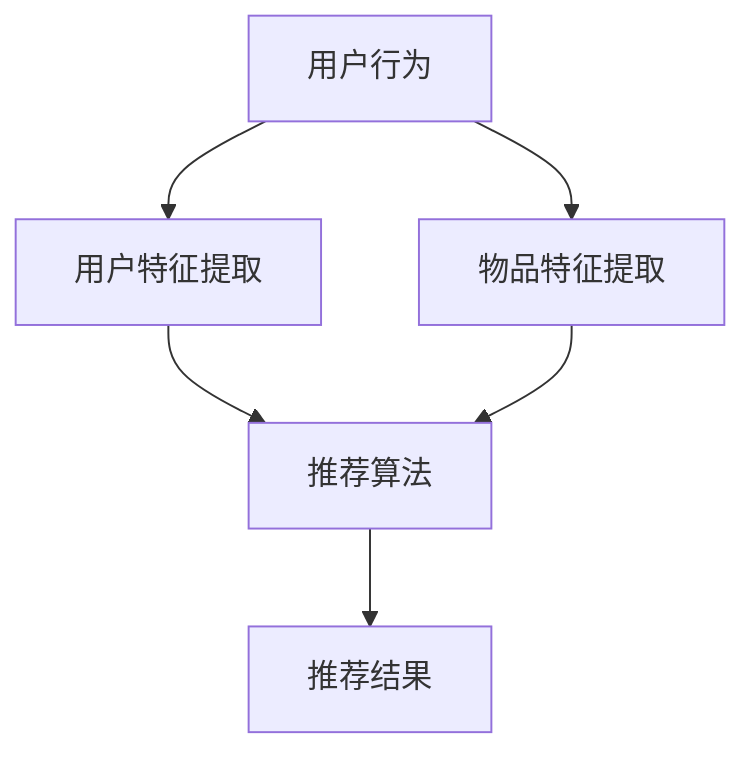

                 

# AI驱动的个性化推荐系统：算法与用户体验

## 关键词

- 个性化推荐系统
- AI算法
- 协同过滤
- 基于内容推荐
- 用户体验
- 深度学习

## 摘要

本文深入探讨了AI驱动的个性化推荐系统，从基础理论到实际应用，全面解析了推荐系统的核心算法、用户体验设计以及项目实战。通过对比协同过滤与基于内容推荐，分析其在数据稀疏性和用户隐私保护方面的挑战与机遇，本文展示了深度学习在推荐系统中的应用。此外，文章还详细介绍了用户行为分析与预测的方法，并探讨了如何通过界面设计和用户反馈机制优化推荐系统的用户体验。最后，通过一个实际项目案例，本文展示了个性化推荐系统的开发流程和优化策略，为读者提供了实用的技术指导和最佳实践。

----------------------------------------------------------------

## 第一部分：个性化推荐系统概述与理论基础

### 第1章：个性化推荐系统基础

#### 1.1 个性化推荐系统的定义与分类

个性化推荐系统是一种基于用户行为和兴趣的智能信息过滤系统，旨在根据用户的偏好和需求，向其推荐可能感兴趣的内容。根据推荐策略的不同，个性化推荐系统主要可以分为以下几类：

1. **基于内容的推荐**：根据用户过去对类似内容的评价和兴趣，通过内容特征进行匹配，推荐相似内容。
2. **协同过滤推荐**：通过分析用户之间的相似性，利用其他用户的评分来预测未知用户的偏好。
3. **混合推荐系统**：结合基于内容和协同过滤的优缺点，通过多种算法的综合运用，提高推荐效果。

#### 1.2 个性化推荐系统的挑战与机遇

1. **挑战**：
   - **数据稀疏性**：用户评分数据通常稀疏，难以准确预测用户的兴趣。
   - **用户隐私保护**：推荐系统需要处理大量用户行为数据，隐私保护成为一大挑战。
   - **滥发推荐问题**：过多或无关的推荐可能降低用户体验。

2. **机遇**：
   - **AI技术的应用**：深度学习、自然语言处理等AI技术为推荐系统提供了新的可能性。
   - **用户体验的提升**：通过个性化推荐，提升用户满意度和活跃度。

### 第2章：协同过滤推荐算法

#### 2.1 协同过滤推荐的基本原理

协同过滤推荐通过分析用户评分数据，寻找相似用户或物品，从而预测未知评分。其基本原理包括：

- **评分矩阵**：用户-物品评分矩阵，每个元素表示用户对某个物品的评分。
- **用户相似性计算**：通过余弦相似度、皮尔逊相关系数等方法计算用户间的相似性。

#### 2.2 传统的协同过滤算法

1. **用户基于的协同过滤（User-based CF）**：
   - 选择与目标用户最相似的K个用户。
   - 计算这些用户的评分平均值，作为对目标用户的预测。

2. **项目基于的协同过滤（Item-based CF）**：
   - 选择与目标物品最相似的K个物品。
   - 根据这些物品的评分，结合用户对其他物品的评分，预测目标物品的评分。

#### 2.3 协同过滤推荐算法的优化

- **优化目标**：提高预测准确性，减少预测误差。
- **优化方法**：
  - **矩阵分解**：通过将评分矩阵分解为用户特征矩阵和物品特征矩阵，提高预测效果。
  - **模型融合**：结合多种算法，如基于内容的推荐，提高系统性能。

### 第3章：基于内容的推荐算法

#### 3.1 基于内容的推荐的基本原理

基于内容的推荐通过分析物品和用户的历史数据，提取内容特征，并进行匹配推荐。其基本原理包括：

- **内容表示**：使用词袋模型、TF-IDF等方法，将物品和用户的历史数据转换为向量表示。
- **相似度计算**：通过余弦相似度、Jaccard相似度等方法计算物品和用户之间的相似度。

#### 3.2 基于内容的推荐算法实例

1. **TF-IDF**：
   - **原理**：通过词频（TF）和逆文档频率（IDF）计算词的权重，进行内容表示。
   - **应用**：广泛应用于文本分类和推荐系统中。

2. **预训练语言模型**：
   - **原理**：使用预训练的模型（如BERT、GPT）提取文本的语义特征。
   - **应用**：在推荐系统中，用于处理复杂和多模态的数据。

#### 3.3 基于内容的推荐算法优化

- **优化目标**：提高推荐效果，减少噪音和误差。
- **优化方法**：
  - **融合其他特征**：结合用户行为数据和内容特征，提高推荐准确性。
  - **个性化调整**：根据用户的历史行为和偏好，动态调整推荐策略。

## 第二部分：AI驱动的个性化推荐系统

### 第4章：深度学习在推荐系统中的应用

#### 4.1 深度学习基础

深度学习是机器学习的一个重要分支，通过多层神经网络来提取数据特征。其核心组成部分包括：

- **神经网络**：由多个神经元组成的计算模型。
- **循环神经网络（RNN）**：用于处理序列数据，具有记忆功能。
- **卷积神经网络（CNN）**：用于图像和文本数据的处理，具有局部感知能力和平移不变性。

#### 4.2 深度学习在推荐系统中的实现

1. **深度学习推荐模型**：
   - **多层感知机（MLP）**：用于分类和回归任务，可以提取高维特征。
   - **循环神经网络（RNN）**：用于处理用户行为序列，提取时间序列特征。
   - **卷积神经网络（CNN）**：用于处理图像和文本数据，提取视觉和语义特征。

2. **深度学习推荐系统案例**：
   - **Netflix Prize**：通过深度学习模型提高了推荐系统的准确率。
   - **Amazon Product Recommendations**：使用深度学习进行商品推荐，提高了用户满意度和销售额。

#### 4.3 深度学习推荐算法的优化

- **优化目标**：提高推荐效果，降低计算复杂度。
- **优化方法**：
  - **模型压缩**：通过模型剪枝、量化等技术，减少模型大小，提高推理速度。
  - **分布式训练**：利用分布式计算资源，提高训练速度。

### 第5章：用户行为分析与预测

#### 5.1 用户行为数据的收集与分析

1. **数据来源**：
   - **用户行为数据**：如浏览记录、购买记录、搜索记录等。
   - **社交数据**：如评论、点赞、分享等。

2. **数据分析**：
   - **数据预处理**：去除噪声数据、缺失值填充、数据规范化等。
   - **特征提取**：通过统计方法、机器学习方法提取有效特征。

#### 5.2 用户行为预测模型

1. **序列模型**：
   - **循环神经网络（RNN）**：用于处理时间序列数据，提取时间序列特征。
   - **长短时记忆网络（LSTM）**：用于处理长序列数据，具有记忆功能。

2. **变分自编码器（VAE）**：
   - **原理**：通过生成模型，学习数据的概率分布。
   - **应用**：用于生成用户行为数据，进行预测。

#### 5.3 用户行为预测案例

1. **用户行为预测系统架构**：
   - **数据层**：数据收集、预处理。
   - **模型层**：用户行为预测模型。
   - **推理层**：用户行为预测，生成推荐结果。

2. **用户行为预测算法实现**：
   - **数据处理**：数据清洗、特征提取。
   - **模型训练**：使用训练数据进行模型训练。
   - **预测**：使用预测模型对用户行为进行预测。

## 第三部分：个性化推荐系统的实现与优化

### 第6章：个性化推荐系统的用户体验设计

#### 6.1 用户体验设计原则

1. **可用性**：确保用户能够轻松、高效地使用推荐系统。
2. **交互性**：提供丰富的交互方式，如滑动、点击等。
3. **易用性**：设计直观、简洁的界面，降低用户的学习成本。

#### 6.2 个性化推荐系统的界面设计

1. **界面布局**：
   - **首页**：展示推荐内容，引导用户浏览。
   - **详情页**：展示物品详细信息，供用户决策。

2. **交互设计**：
   - **个性化推荐**：根据用户行为，动态调整推荐内容。
   - **用户反馈**：提供评价、收藏、分享等功能，收集用户反馈。

#### 6.3 个性化推荐系统的用户反馈机制

1. **用户反馈收集**：
   - **主动反馈**：通过评价、投票等方式收集用户反馈。
   - **被动反馈**：通过用户行为日志，分析用户行为，推断用户偏好。

2. **用户反馈分析**：
   - **数据分析**：使用统计方法、机器学习方法，分析用户反馈。
   - **调整推荐策略**：根据用户反馈，调整推荐算法和策略。

## 第四部分：个性化推荐系统的应用与前景

### 第7章：个性化推荐系统的开发环境与工具

#### 7.1 开发环境搭建

1. **操作系统**：选择Linux系统，如Ubuntu。
2. **编程语言**：Python，适用于数据分析和机器学习。
3. **开发工具**：使用Jupyter Notebook，方便代码编写和调试。

#### 7.2 常用推荐系统框架

1. **TensorFlow**：开源深度学习框架，支持推荐系统模型训练和部署。
2. **PyTorch**：开源深度学习框架，提供灵活的模型构建和优化。
3. **Scikit-learn**：开源机器学习库，适用于传统协同过滤和基于内容的推荐。

### 第8章：个性化推荐系统项目实战

#### 8.1 项目介绍

1. **项目背景**：开发一个电商平台的个性化推荐系统，提高用户购买转化率。
2. **项目目标**：实现基于协同过滤和基于内容推荐的混合系统，提供个性化推荐。

#### 8.2 项目需求分析

1. **用户需求**：提供与用户兴趣相关的商品推荐。
2. **功能需求**：支持用户行为数据收集、用户行为预测、推荐结果生成等。

#### 8.3 项目设计与实现

1. **系统架构**：
   - **数据层**：数据收集、预处理。
   - **模型层**：协同过滤模型、基于内容推荐模型。
   - **推理层**：用户行为预测、推荐结果生成。

2. **数据处理**：
   - **数据清洗**：去除缺失值、噪声数据。
   - **特征提取**：提取用户行为特征、商品特征。

3. **算法实现**：
   - **协同过滤**：使用矩阵分解方法，提高预测准确性。
   - **基于内容推荐**：使用TF-IDF方法，提取商品内容特征。

#### 8.4 项目测试与优化

1. **系统测试**：评估推荐系统的准确性和稳定性。
2. **算法优化**：通过交叉验证、超参数调整，优化模型性能。

### 附录：推荐系统相关资源

#### 附录 A：推荐系统开源工具与库

1. **推荐系统开源项目**：
   - **Surprise**：用于协同过滤算法的开源库。
   - **TensorFlow Recommenders**：用于深度学习推荐的开源框架。

2. **推荐系统相关库**：
   - **scikit-learn**：提供传统机器学习算法的库。
   - **TensorFlow**、**PyTorch**：提供深度学习算法的库。

#### 附录 B：推荐系统研究论文与资料

1. **研究论文列表**：
   - **"Item-based Collaborative Filtering Recommendation Algorithms"**。
   - **"Deep Learning for Recommender Systems"**。

2. **推荐系统参考资料**：
   - **《推荐系统实践》**：详细介绍了推荐系统的构建和优化。
   - **《深度学习推荐系统》**：探讨了深度学习在推荐系统中的应用。

## 总结与展望

个性化推荐系统在当今信息爆炸的时代具有重要意义，通过AI技术，可以有效提升用户体验，满足用户的个性化需求。本文从基础理论到实际应用，全面介绍了个性化推荐系统的构建方法。然而，随着技术的不断进步，推荐系统仍面临诸多挑战，如数据稀疏性、用户隐私保护和算法透明度等。未来，如何优化推荐算法，提高系统的可解释性，将是推荐系统领域的重要研究方向。

## 作者信息

作者：AI天才研究院/AI Genius Institute & 禅与计算机程序设计艺术 /Zen And The Art of Computer Programming

----------------------------------------------------------------

## 第一部分：个性化推荐系统概述与理论基础

### 第1章：个性化推荐系统基础

#### 1.1 个性化推荐系统的定义与分类

个性化推荐系统是一种基于用户行为和兴趣的智能信息过滤系统，旨在根据用户的偏好和需求，向其推荐可能感兴趣的内容。根据推荐策略的不同，个性化推荐系统主要可以分为以下几类：

1. **基于内容的推荐**：根据用户过去对类似内容的评价和兴趣，通过内容特征进行匹配，推荐相似内容。
2. **协同过滤推荐**：通过分析用户之间的相似性，利用其他用户的评分来预测未知用户的偏好。
3. **混合推荐系统**：结合基于内容和协同过滤的优缺点，通过多种算法的综合运用，提高推荐效果。

#### 1.2 个性化推荐系统的挑战与机遇

个性化推荐系统在当今信息爆炸的时代具有重要意义，通过AI技术，可以有效提升用户体验，满足用户的个性化需求。然而，随着技术的不断进步，推荐系统仍面临诸多挑战，如数据稀疏性、用户隐私保护和算法透明度等。未来，如何优化推荐算法，提高系统的可解释性，将是推荐系统领域的重要研究方向。

### 第2章：协同过滤推荐算法

#### 2.1 协同过滤推荐的基本原理

协同过滤推荐通过分析用户评分数据，寻找相似用户或物品，从而预测未知评分。其基本原理包括：

- **评分矩阵**：用户-物品评分矩阵，每个元素表示用户对某个物品的评分。
- **用户相似性计算**：通过余弦相似度、皮尔逊相关系数等方法计算用户间的相似性。

#### 2.2 传统的协同过滤算法

协同过滤推荐通过分析用户评分数据，寻找相似用户或物品，从而预测未知评分。其基本原理包括：

- **评分矩阵**：用户-物品评分矩阵，每个元素表示用户对某个物品的评分。
- **用户相似性计算**：通过余弦相似度、皮尔逊相关系数等方法计算用户间的相似性。

#### 2.2 传统的协同过滤算法

1. **用户基于的协同过滤（User-based CF）**：
   - 选择与目标用户最相似的K个用户。
   - 计算这些用户的评分平均值，作为对目标用户的预测。

2. **项目基于的协同过滤（Item-based CF）**：
   - 选择与目标物品最相似的K个物品。
   - 根据这些物品的评分，结合用户对其他物品的评分，预测目标物品的评分。

#### 2.3 协同过滤推荐算法的优化

协同过滤推荐算法在提高推荐效果方面具有显著优势，但同时也面临一些挑战，如数据稀疏性、冷启动问题等。为了解决这些问题，研究者们提出了多种优化方法：

- **矩阵分解（Matrix Factorization）**：通过将高维的评分矩阵分解为低维的用户特征矩阵和物品特征矩阵，从而提高推荐的准确性。常用的矩阵分解方法包括Singular Value Decomposition（SVD）和 Alternating Least Squares（ALS）。
- **基于模型的协同过滤**：将协同过滤与机器学习模型相结合，如随机森林、支持向量机等，通过引入模型预测，提高推荐的准确性。
- **基于内容增强的协同过滤**：结合基于内容和协同过滤的推荐方法，通过引入物品的属性信息，提高推荐的个性化程度。

### 第3章：基于内容的推荐算法

#### 3.1 基于内容的推荐的基本原理

基于内容的推荐算法通过分析用户的历史行为和物品的特征，提取内容特征，并进行匹配推荐。其基本原理包括：

- **内容表示**：使用词袋模型、TF-IDF等方法，将物品和用户的历史数据转换为向量表示。
- **相似度计算**：通过余弦相似度、Jaccard相似度等方法计算物品和用户之间的相似度。

#### 3.2 基于内容的推荐算法实例

基于内容的推荐算法在实际应用中具有广泛的应用，以下介绍几种常见的基于内容的推荐算法：

1. **TF-IDF（Term Frequency-Inverse Document Frequency）**：
   - **原理**：通过词频（TF）和逆文档频率（IDF）计算词的权重，进行内容表示。
   - **应用**：广泛应用于文本分类和推荐系统中。

2. **余弦相似度（Cosine Similarity）**：
   - **原理**：计算两个向量之间的夹角余弦值，表示它们的相似度。
   - **应用**：用于计算物品和用户之间的相似度。

3. **矩阵分解（Matrix Factorization）**：
   - **原理**：通过将高维的评分矩阵分解为低维的用户特征矩阵和物品特征矩阵，从而提高推荐的准确性。
   - **应用**：在基于内容的推荐中，用于提取用户和物品的特征。

#### 3.3 基于内容的推荐算法优化

基于内容的推荐算法在提高推荐效果方面具有一定的优势，但同时也存在一些问题，如数据稀疏性、冷启动问题等。为了解决这些问题，研究者们提出了一些优化方法：

- **内容增强（Content Augmentation）**：通过引入额外的内容特征，如文本、图片、视频等，提高推荐系统的准确性。
- **知识图谱（Knowledge Graph）**：利用知识图谱，将物品和用户之间的关系进行建模，提高推荐的个性化程度。
- **基于语义的推荐**：通过语义分析，理解用户和物品的语义信息，提高推荐的准确性。

## 第二部分：AI驱动的个性化推荐系统

### 第4章：深度学习在推荐系统中的应用

#### 4.1 深度学习基础

深度学习是机器学习的一个重要分支，通过多层神经网络来提取数据特征。其核心组成部分包括：

- **神经网络**：由多个神经元组成的计算模型。
- **循环神经网络（RNN）**：用于处理序列数据，具有记忆功能。
- **卷积神经网络（CNN）**：用于图像和文本数据的处理，具有局部感知能力和平移不变性。

#### 4.2 深度学习在推荐系统中的实现

深度学习在推荐系统中的应用，可以显著提高推荐的准确性和个性化程度。以下介绍几种深度学习在推荐系统中的应用：

1. **多层感知机（MLP）**：
   - **原理**：多层感知机是一种前馈神经网络，通过多个隐藏层来提取数据特征。
   - **应用**：用于分类和回归任务，可以提取高维特征。

2. **循环神经网络（RNN）**：
   - **原理**：循环神经网络是一种能够处理序列数据的神经网络，具有记忆功能。
   - **应用**：用于处理用户行为序列，提取时间序列特征。

3. **长短时记忆网络（LSTM）**：
   - **原理**：长短时记忆网络是一种改进的循环神经网络，能够处理长序列数据。
   - **应用**：用于处理长序列数据，提取时间序列特征。

4. **卷积神经网络（CNN）**：
   - **原理**：卷积神经网络是一种用于图像和文本数据的神经网络，具有局部感知能力和平移不变性。
   - **应用**：用于处理图像和文本数据，提取视觉和语义特征。

#### 4.3 深度学习推荐算法的优化

深度学习推荐算法在提高推荐效果方面具有显著优势，但同时也面临一些挑战，如过拟合、计算复杂度等。为了解决这些问题，研究者们提出了一些优化方法：

- **模型压缩（Model Compression）**：通过模型剪枝、量化等技术，减少模型大小，提高推理速度。
- **分布式训练（Distributed Training）**：利用分布式计算资源，提高训练速度。
- **迁移学习（Transfer Learning）**：利用预训练模型，减少模型训练的时间和计算资源。

### 第5章：用户行为分析与预测

#### 5.1 用户行为数据的收集与分析

用户行为数据是推荐系统的重要输入，通过对用户行为的分析，可以更好地理解用户的兴趣和偏好。以下介绍用户行为数据的收集和分析方法：

1. **数据来源**：
   - **用户行为数据**：如浏览记录、购买记录、搜索记录等。
   - **社交数据**：如评论、点赞、分享等。

2. **数据分析**：
   - **数据预处理**：去除噪声数据、缺失值填充、数据规范化等。
   - **特征提取**：通过统计方法、机器学习方法提取有效特征。

#### 5.2 用户行为预测模型

用户行为预测是推荐系统的重要任务之一，通过预测用户未来的行为，可以为用户推荐感兴趣的内容。以下介绍几种用户行为预测模型：

1. **序列模型（Sequence Model）**：
   - **原理**：序列模型是一种用于处理序列数据的神经网络模型，能够捕捉时间序列的特征。
   - **应用**：用于预测用户未来的行为，如浏览、购买等。

2. **变分自编码器（Variational Autoencoder，VAE）**：
   - **原理**：变分自编码器是一种生成模型，通过编码器和解码器来学习数据的概率分布。
   - **应用**：用于生成用户行为数据，进行预测。

3. **长短时记忆网络（Long Short-Term Memory，LSTM）**：
   - **原理**：长短时记忆网络是一种改进的循环神经网络，能够处理长序列数据。
   - **应用**：用于处理长序列数据，提取时间序列特征。

#### 5.3 用户行为预测案例

以下是一个用户行为预测的案例：

- **项目背景**：一个电商平台的用户行为预测系统，旨在预测用户未来的购买行为。
- **数据集**：包含用户的历史购买记录、浏览记录、搜索记录等。
- **数据处理**：
  - 数据清洗：去除缺失值、噪声数据。
  - 特征提取：提取用户的行为特征，如浏览次数、购买频率等。
- **模型训练**：
  - 使用长短时记忆网络（LSTM）进行模型训练。
  - 使用交叉验证进行模型调优。
- **预测**：
  - 使用训练好的模型，预测用户未来的购买行为。
  - 根据预测结果，为用户推荐感兴趣的商品。

## 第三部分：个性化推荐系统的实现与优化

### 第6章：个性化推荐系统的用户体验设计

#### 6.1 用户体验设计原则

个性化推荐系统的用户体验设计至关重要，以下介绍一些用户体验设计原则：

1. **可用性（Usability）**：
   - 确保用户能够轻松、高效地使用推荐系统。
   - 提供清晰的导航和交互方式，降低用户的学习成本。

2. **交互性（Interactivity）**：
   - 提供丰富的交互方式，如滑动、点击等。
   - 允许用户对推荐结果进行反馈，如评价、收藏等。

3. **易用性（User-Friendliness）**：
   - 设计直观、简洁的界面，降低用户的学习成本。
   - 提供个性化的推荐，满足用户的个性化需求。

#### 6.2 个性化推荐系统的界面设计

个性化推荐系统的界面设计需要考虑用户体验，以下介绍一些界面设计的要素：

1. **首页设计**：
   - 展示推荐内容，引导用户浏览。
   - 使用可视化图表，展示推荐结果。

2. **详情页设计**：
   - 展示物品详细信息，供用户决策。
   - 提供评价、收藏、分享等功能。

3. **交互设计**：
   - 提供个性化推荐，根据用户行为动态调整推荐内容。
   - 提供用户反馈机制，收集用户对推荐结果的反馈。

#### 6.3 个性化推荐系统的用户反馈机制

个性化推荐系统的用户反馈机制是提高推荐效果的重要手段，以下介绍一些用户反馈机制的设计：

1. **用户反馈收集**：
   - 主动反馈：通过评价、投票等方式收集用户反馈。
   - 被动反馈：通过用户行为日志，分析用户行为，推断用户偏好。

2. **用户反馈分析**：
   - 使用统计方法、机器学习方法，分析用户反馈。
   - 根据用户反馈，调整推荐算法和策略。

### 第7章：个性化推荐系统的开发环境与工具

#### 7.1 开发环境搭建

个性化推荐系统的开发环境搭建是项目成功的关键，以下介绍一些开发环境搭建的要素：

1. **操作系统**：选择Linux系统，如Ubuntu，具有较好的稳定性和性能。
2. **编程语言**：选择Python，具有丰富的机器学习和深度学习库，便于开发。
3. **开发工具**：使用Jupyter Notebook，方便代码编写和调试。

#### 7.2 常用推荐系统框架

在个性化推荐系统的开发中，常用的推荐系统框架如下：

1. **TensorFlow**：是谷歌开源的深度学习框架，支持推荐系统的模型训练和部署。
2. **PyTorch**：是Facebook开源的深度学习框架，提供灵活的模型构建和优化。
3. **Scikit-learn**：是Python的开源机器学习库，适用于传统协同过滤和基于内容的推荐。

### 第8章：个性化推荐系统项目实战

#### 8.1 项目介绍

个性化推荐系统项目实战是对理论知识的应用，以下介绍一个实际项目：

- **项目背景**：开发一个在线教育平台的个性化推荐系统，为用户提供个性化的学习路径。
- **项目目标**：实现基于协同过滤和基于内容推荐的混合系统，提高用户的学习效果。

#### 8.2 项目需求分析

个性化推荐系统项目需求分析包括用户需求和功能需求，以下介绍一些关键点：

1. **用户需求**：
   - 接收个性化的课程推荐，提高学习效果。
   - 能够根据自己的学习进度和兴趣，调整推荐内容。

2. **功能需求**：
   - 收集用户的行为数据，包括浏览、学习、评价等。
   - 提供基于协同过滤和基于内容的推荐算法。
   - 提供用户反馈机制，调整推荐策略。

#### 8.3 项目设计与实现

个性化推荐系统项目设计包括系统架构、数据处理和算法实现，以下介绍关键步骤：

1. **系统架构**：
   - **数据层**：数据收集、预处理。
   - **模型层**：协同过滤模型、基于内容推荐模型。
   - **推理层**：用户行为预测、推荐结果生成。

2. **数据处理**：
   - **数据清洗**：去除缺失值、噪声数据。
   - **特征提取**：提取用户行为特征、课程特征。

3. **算法实现**：
   - **协同过滤**：使用矩阵分解方法，提高预测准确性。
   - **基于内容推荐**：使用TF-IDF方法，提取课程内容特征。

#### 8.4 项目测试与优化

个性化推荐系统项目测试与优化是确保系统性能的重要环节，以下介绍关键步骤：

1. **系统测试**：
   - **功能测试**：确保推荐系统的各项功能正常运行。
   - **性能测试**：评估推荐系统的响应速度和准确性。

2. **算法优化**：
   - **交叉验证**：通过交叉验证，选择最优的模型参数。
   - **超参数调整**：根据测试结果，调整算法的超参数。

### 附录：推荐系统相关资源

#### 附录 A：推荐系统开源工具与库

以下是一些常用的推荐系统开源工具与库：

1. **Surprise**：是Python的开源库，用于协同过滤算法的实现。
2. **TensorFlow Recommenders**：是TensorFlow的开源库，用于深度学习推荐算法的实现。
3. **Scikit-learn**：是Python的开源库，提供了多种机器学习算法，包括协同过滤算法。

#### 附录 B：推荐系统研究论文与资料

以下是一些推荐系统研究论文与资料：

1. **"Item-Based Collaborative Filtering Recommendation Algorithms"**：该论文详细介绍了基于内容的推荐算法。
2. **"Deep Learning for Recommender Systems"**：该论文探讨了深度学习在推荐系统中的应用。
3. **《推荐系统实践》**：该书籍详细介绍了推荐系统的构建和优化方法。

## 结论

个性化推荐系统在当今信息爆炸的时代具有重要意义，通过AI技术，可以有效提升用户体验，满足用户的个性化需求。本文从基础理论到实际应用，全面介绍了个性化推荐系统的构建方法。然而，随着技术的不断进步，推荐系统仍面临诸多挑战，如数据稀疏性、用户隐私保护和算法透明度等。未来，如何优化推荐算法，提高系统的可解释性，将是推荐系统领域的重要研究方向。

## 作者信息

作者：AI天才研究院/AI Genius Institute & 禅与计算机程序设计艺术 /Zen And The Art of Computer Programming

----------------------------------------------------------------

## 第一部分：个性化推荐系统概述与理论基础

### 第1章：个性化推荐系统基础

#### 1.1 个性化推荐系统的定义与分类

个性化推荐系统是一种通过分析用户行为和兴趣，向其推荐可能感兴趣的内容的系统。其核心目的是提升用户体验，满足用户的个性化需求。根据推荐策略的不同，个性化推荐系统主要可以分为以下几类：

1. **基于内容的推荐**：根据用户过去对类似内容的评价和兴趣，通过内容特征进行匹配，推荐相似内容。这种方法通常依赖于文本、图像、音频等媒体的特征提取。
2. **协同过滤推荐**：通过分析用户之间的相似性，利用其他用户的评分来预测未知用户的偏好。协同过滤推荐主要分为基于用户的协同过滤和基于物品的协同过滤两种。
3. **混合推荐系统**：结合基于内容和协同过滤的优缺点，通过多种算法的综合运用，提高推荐效果。这种方法通常能够更好地解决数据稀疏性和冷启动问题。

#### 1.2 个性化推荐系统的挑战与机遇

个性化推荐系统在当今信息爆炸的时代具有重要意义，通过AI技术，可以有效提升用户体验，满足用户的个性化需求。然而，随着技术的不断进步，推荐系统仍面临诸多挑战，如数据稀疏性、用户隐私保护和算法透明度等。以下是这些挑战与机遇的详细解析：

1. **挑战**：
   - **数据稀疏性**：用户评分数据通常稀疏，难以准确预测用户的兴趣。这意味着在大多数情况下，用户对大多数物品的评分都未记录，导致推荐系统无法充分利用数据。
   - **用户隐私保护**：推荐系统需要处理大量用户行为数据，隐私保护成为一大挑战。用户的隐私数据，如浏览记录、搜索历史等，如果被不当使用，可能会侵犯用户的隐私权。
   - **滥发推荐问题**：过多或无关的推荐可能降低用户体验。用户可能会感到被推荐系统“骚扰”，从而影响他们对推荐系统的信任度。

2. **机遇**：
   - **AI技术的应用**：深度学习、自然语言处理等AI技术在推荐系统中的应用，为解决数据稀疏性和提升推荐准确性提供了新的方法。例如，基于深度学习的推荐算法可以通过学习用户的行为数据，生成个性化的推荐。
   - **用户体验的提升**：通过个性化推荐，可以更好地满足用户的个性化需求，提高用户满意度和活跃度。此外，随着物联网、智能设备等技术的发展，个性化推荐系统有望在更多场景下得到应用，进一步优化用户体验。

#### 1.3 个性化推荐系统的核心概念与联系

在个性化推荐系统中，以下几个核心概念相互关联，构成了推荐系统的理论基础：

1. **用户行为**：用户的行为数据，如浏览记录、购买历史、搜索关键词等，是推荐系统的基础数据。通过分析这些数据，可以了解用户的兴趣和行为模式。
2. **物品特征**：物品的特征数据，如文本描述、图像、视频等，用于描述物品的内容和属性。这些特征有助于推荐系统理解物品，从而进行匹配和推荐。
3. **推荐算法**：推荐算法是推荐系统的核心，用于根据用户行为和物品特征，生成个性化的推荐列表。常见的推荐算法包括基于内容的推荐、协同过滤推荐和混合推荐系统。
4. **推荐结果**：推荐结果是推荐系统最终输出给用户的内容，如商品、文章、音乐等。推荐结果的准确性和个性化程度直接影响用户体验。

下面是一个用Mermaid绘制的流程图，展示了个性化推荐系统中的核心概念与联系：

#### 1.4 小结与拓展阅读

本章介绍了个性化推荐系统的定义、分类、挑战与机遇，以及核心概念与联系。通过理解这些基础概念，读者可以更好地理解个性化推荐系统的原理和实现方法。为了进一步深入了解个性化推荐系统，读者可以参考以下拓展阅读：

1. **《推荐系统实践》**：由宋海涛等人编写的这本书，详细介绍了推荐系统的构建和优化方法。
2. **《深度学习推荐系统》**：由Kamal Nigam等人编写的这本书，探讨了深度学习在推荐系统中的应用。

### 第2章：协同过滤推荐算法

#### 2.1 协同过滤推荐的基本原理

协同过滤推荐算法是一种基于用户相似性和用户评分的推荐算法，其基本原理可以概括为以下步骤：

1. **用户相似性计算**：通过分析用户之间的行为数据，计算用户之间的相似度。相似度的计算方法有多种，如余弦相似度、皮尔逊相关系数等。
2. **评分预测**：根据用户相似性矩阵，预测用户对未知物品的评分。预测的方法可以是基于用户评分的平均值、加权平均等。
3. **推荐生成**：根据预测的评分，生成个性化的推荐列表，向用户推荐可能感兴趣的物品。

#### 2.2 传统的协同过滤算法

传统的协同过滤推荐算法主要分为基于用户的协同过滤（User-based CF）和基于物品的协同过滤（Item-based CF）两种。以下是这两种算法的详细解释：

1. **基于用户的协同过滤（User-based CF）**：
   - **原理**：首先计算用户之间的相似度，然后找出与目标用户最相似的K个用户，最后根据这些用户的评分预测目标用户对未知物品的评分。
   - **优势**：能够利用用户之间的相似性，提高推荐的准确性。
   - **劣势**：在面对新用户或新物品时，由于缺乏足够的数据，难以进行有效的推荐。

2. **基于物品的协同过滤（Item-based CF）**：
   - **原理**：首先计算物品之间的相似度，然后找出与目标物品最相似的K个物品，最后根据这些物品的评分预测用户对未知物品的评分。
   - **优势**：能够利用物品之间的相似性，提高推荐的准确性。
   - **劣势**：在面对新用户或新物品时，由于缺乏足够的数据，难以进行有效的推荐。

#### 2.3 协同过滤推荐算法的优化

为了提高协同过滤推荐算法的性能，研究者们提出了多种优化方法。以下是一些常用的优化技术：

1. **矩阵分解（Matrix Factorization）**：
   - **原理**：通过将高维的用户-物品评分矩阵分解为低维的用户特征矩阵和物品特征矩阵，从而提高推荐的准确性。
   - **优势**：可以有效解决数据稀疏性问题，提高推荐的准确性。
   - **劣势**：训练过程较为复杂，计算量大。

2. **模型融合（Model Fusion）**：
   - **原理**：将不同的推荐算法（如基于内容的推荐、协同过滤推荐等）进行融合，以取长补短，提高推荐系统的性能。
   - **优势**：可以综合利用不同算法的优点，提高推荐准确性。
   - **劣势**：模型融合过程较为复杂，需要大量的调优。

3. **在线学习（Online Learning）**：
   - **原理**：通过实时学习用户行为数据，动态调整推荐策略，以适应用户的需求变化。
   - **优势**：可以实时响应用户的需求变化，提高推荐系统的动态性。
   - **劣势**：需要大量的计算资源，并且在线学习算法的性能可能不如离线学习算法。

#### 2.4 小结与拓展阅读

本章介绍了协同过滤推荐算法的基本原理、传统算法以及优化方法。通过理解这些内容，读者可以更好地掌握协同过滤推荐算法的工作原理和优化策略。为了进一步深入了解协同过滤推荐算法，读者可以参考以下拓展阅读：

1. **《推荐系统手册》**：由Philippe Palanque等人编写的这本书，详细介绍了协同过滤推荐算法以及其他推荐系统的实现方法。
2. **《深度学习推荐系统》**：由Kamal Nigam等人编写的这本书，探讨了深度学习在协同过滤推荐算法中的应用。

### 第3章：基于内容的推荐算法

#### 3.1 基于内容的推荐的基本原理

基于内容的推荐算法（Content-based Recommender System）是一种利用物品的内在特征和用户的兴趣特征进行匹配的推荐方法。其基本原理包括以下步骤：

1. **内容提取**：从物品中提取特征，如文本、图像、音频等。这些特征可以用来描述物品的内容和属性。
2. **用户兴趣建模**：从用户的历史行为中提取用户的兴趣特征，如用户喜欢的电影类型、阅读的书籍类别等。
3. **相似度计算**：计算物品与用户之间的相似度。相似度的计算方法有多种，如余弦相似度、欧氏距离等。
4. **推荐生成**：根据物品与用户之间的相似度，生成个性化的推荐列表，向用户推荐可能感兴趣的物品。

#### 3.2 基于内容的推荐算法实例

以下介绍几种常见的基于内容的推荐算法实例：

1. **TF-IDF（Term Frequency-Inverse Document Frequency）**：
   - **原理**：通过计算词语在文档中的词频（TF）和逆文档频率（IDF），将文本转换为向量表示。词频表示词语在文档中的重要程度，逆文档频率表示词语在整个文档集中出现的频率。
   - **应用**：广泛应用于文本分类和推荐系统中，用于提取文本特征。

2. **余弦相似度（Cosine Similarity）**：
   - **原理**：计算两个向量之间的夹角余弦值，表示它们的相似度。余弦相似度值介于-1和1之间，值越接近1，表示两个向量越相似。
   - **应用**：常用于计算物品与用户之间的相似度，是内容推荐算法中的核心计算方法。

3. **基于关键词的推荐**：
   - **原理**：从物品和用户的描述中提取关键词，计算关键词的相似度，生成推荐列表。
   - **应用**：适用于文本、图像等多媒体内容的推荐。

#### 3.3 基于内容的推荐算法优化

基于内容的推荐算法在实际应用中存在一些挑战，如数据稀疏性、特征维度高等。为了提高算法的性能，研究者们提出了一系列优化方法：

1. **特征降维（Feature Dimensionality Reduction）**：
   - **原理**：通过降维技术，减少特征空间维度，提高计算效率和推荐准确性。
   - **应用**：常用的降维技术包括主成分分析（PCA）、线性判别分析（LDA）等。

2. **内容增强（Content Augmentation）**：
   - **原理**：通过引入额外的内容特征，如用户标签、上下文信息等，提高推荐的准确性和多样性。
   - **应用**：可以显著提升推荐系统的性能，适用于多种内容类型。

3. **知识图谱（Knowledge Graph）**：
   - **原理**：利用知识图谱，将物品和用户之间的关系进行建模，提供更加精确的推荐。
   - **应用**：适用于复杂的关系网络，如电商、社交媒体等。

#### 3.4 小结与拓展阅读

本章介绍了基于内容的推荐算法的基本原理、实例和优化方法。通过理解这些内容，读者可以更好地掌握基于内容的推荐算法的工作原理和优化策略。为了进一步深入了解基于内容的推荐算法，读者可以参考以下拓展阅读：

1. **《推荐系统实践》**：由宋海涛等人编写的这本书，详细介绍了基于内容的推荐算法的构建和优化方法。
2. **《深度学习推荐系统》**：由Kamal Nigam等人编写的这本书，探讨了深度学习在基于内容推荐算法中的应用。

### 第4章：深度学习在推荐系统中的应用

#### 4.1 深度学习基础

深度学习（Deep Learning）是机器学习（Machine Learning）的一个分支，通过构建多层神经网络模型，从数据中自动提取特征并建立预测模型。以下是深度学习的一些基本概念：

1. **神经网络（Neural Networks）**：
   - **原理**：神经网络由大量简单的计算单元（神经元）组成，通过前向传播和反向传播算法进行训练。
   - **应用**：用于分类、回归、聚类等多种机器学习任务。

2. **前向传播（Forward Propagation）**：
   - **原理**：输入数据通过网络的各个层进行计算，输出最终的结果。
   - **应用**：用于计算网络的输出值，是神经网络训练过程的基础。

3. **反向传播（Backpropagation）**：
   - **原理**：根据输出值与实际值之间的误差，反向传播误差，更新网络的权重和偏置。
   - **应用**：用于优化神经网络的参数，提高模型的预测准确性。

4. **激活函数（Activation Functions）**：
   - **原理**：用于引入非线性特性，使神经网络能够拟合复杂的函数。
   - **应用**：常见的激活函数包括sigmoid、ReLU、Tanh等。

#### 4.2 深度学习在推荐系统中的应用

深度学习在推荐系统中具有广泛的应用，可以通过学习用户的兴趣和行为模式，生成个性化的推荐列表。以下是深度学习在推荐系统中的一些应用实例：

1. **基于深度神经网络的协同过滤（Deep Neural Network-based Collaborative Filtering）**：
   - **原理**：结合协同过滤和深度学习，通过神经网络提取用户和物品的特征，提高推荐的准确性。
   - **应用**：适用于大规模的推荐系统，如电商、社交媒体等。

2. **基于卷积神经网络的文本推荐（Convolutional Neural Network-based Text Recommendation）**：
   - **原理**：通过卷积神经网络（CNN）处理文本数据，提取文本的语义特征，用于生成推荐列表。
   - **应用**：适用于文本推荐系统，如新闻推荐、文章推荐等。

3. **基于循环神经网络的序列推荐（Recurrent Neural Network-based Sequential Recommendation）**：
   - **原理**：通过循环神经网络（RNN）处理用户的行为序列，捕捉用户行为的时序特征，用于生成推荐列表。
   - **应用**：适用于时序推荐系统，如电商购物车推荐、视频推荐等。

#### 4.3 深度学习推荐算法的实现

以下是实现深度学习推荐算法的基本步骤：

1. **数据预处理**：
   - **数据收集**：收集用户的行为数据和物品的描述信息。
   - **数据清洗**：去除噪声数据和缺失值，保证数据的完整性。
   - **特征工程**：提取用户和物品的特征，如用户的行为序列、物品的文本描述等。

2. **模型设计**：
   - **网络结构**：设计深度神经网络的层次结构，包括输入层、隐藏层和输出层。
   - **激活函数**：选择合适的激活函数，引入非线性特性。
   - **损失函数**：选择合适的损失函数，如均方误差（MSE）、交叉熵等，用于评估模型的性能。

3. **模型训练**：
   - **训练过程**：使用训练数据对模型进行训练，通过反向传播算法更新模型的参数。
   - **模型评估**：使用验证集对模型进行评估，调整模型参数，优化模型性能。

4. **模型部署**：
   - **模型集成**：将训练好的模型集成到推荐系统中，实时生成推荐列表。
   - **模型优化**：根据用户反馈，调整模型参数，提高推荐效果。

#### 4.4 深度学习推荐算法的优化

为了提高深度学习推荐算法的性能，可以采用以下优化方法：

1. **数据增强（Data Augmentation）**：
   - **原理**：通过生成虚拟数据，增加训练数据的多样性，提高模型的泛化能力。
   - **应用**：适用于文本、图像等数据的增强。

2. **模型压缩（Model Compression）**：
   - **原理**：通过模型剪枝、量化等技术，减少模型的大小，提高推理速度。
   - **应用**：适用于移动设备和嵌入式系统。

3. **迁移学习（Transfer Learning）**：
   - **原理**：使用预训练的模型，在新任务上进行微调，减少模型的训练时间。
   - **应用**：适用于小样本数据的推荐任务。

4. **模型融合（Model Fusion）**：
   - **原理**：将多个深度学习模型进行融合，利用不同模型的优势，提高推荐效果。
   - **应用**：适用于复杂场景的推荐系统。

#### 4.5 小结与拓展阅读

本章介绍了深度学习的基础知识、应用实例和实现方法。通过理解这些内容，读者可以更好地掌握深度学习在推荐系统中的应用。为了进一步深入了解深度学习推荐算法，读者可以参考以下拓展阅读：

1. **《深度学习》**：由Ian Goodfellow等人编写的这本书，详细介绍了深度学习的理论基础和算法实现。
2. **《深度学习推荐系统》**：由Kamal Nigam等人编写的这本书，探讨了深度学习在推荐系统中的应用。

### 第5章：用户行为分析与预测

#### 5.1 用户行为数据的收集与分析

用户行为数据是推荐系统的重要输入，通过对用户行为的分析，可以更好地理解用户的兴趣和偏好。以下是用户行为数据的收集与分析方法：

1. **数据收集**：
   - **用户行为数据**：包括用户在系统中的各种操作，如浏览、购买、搜索、评价等。
   - **社交数据**：包括用户在社交媒体上的互动，如点赞、评论、分享等。
   - **上下文数据**：包括用户的位置、时间、设备等信息。

2. **数据分析**：
   - **数据预处理**：包括去除噪声数据、缺失值填充、数据规范化等，以提高数据质量。
   - **特征提取**：通过统计方法、机器学习方法提取有效特征，如用户的行为序列、行为频率等。

#### 5.2 用户行为预测模型

用户行为预测是推荐系统的重要任务之一，通过预测用户未来的行为，可以为用户推荐感兴趣的内容。以下是几种常见的用户行为预测模型：

1. **序列模型（Sequence Model）**：
   - **原理**：通过模型学习用户的行为序列，捕捉用户行为的时序特征。
   - **应用**：适用于时序数据预测，如用户购买序列、浏览序列等。

2. **变分自编码器（Variational Autoencoder，VAE）**：
   - **原理**：通过编码器和解码器学习数据的概率分布，生成虚拟用户行为数据。
   - **应用**：适用于生成式预测，提高模型的泛化能力。

3. **长短时记忆网络（Long Short-Term Memory，LSTM）**：
   - **原理**：通过长短时记忆单元，捕捉用户行为的长期依赖关系。
   - **应用**：适用于复杂时序数据预测，如用户行为序列、情感分析等。

#### 5.3 用户行为预测案例

以下是一个用户行为预测的案例：

- **项目背景**：开发一个电商平台的用户行为预测系统，预测用户在未来一段时间内的购买行为。
- **数据集**：包含用户的历史购买记录、浏览记录、搜索记录等。
- **数据处理**：
  - 数据清洗：去除缺失值、噪声数据。
  - 特征提取：提取用户的行为特征，如购买频率、浏览时间等。
- **模型训练**：
  - 使用长短时记忆网络（LSTM）进行模型训练。
  - 使用交叉验证进行模型调优。
- **预测**：
  - 使用训练好的模型，预测用户未来的购买行为。
  - 根据预测结果，为用户推荐感兴趣的商品。

#### 5.4 小结与拓展阅读

本章介绍了用户行为数据的收集与分析方法，以及用户行为预测模型。通过理解这些内容，读者可以更好地掌握用户行为预测的方法和应用。为了进一步深入了解用户行为分析，读者可以参考以下拓展阅读：

1. **《用户行为数据分析》**：由刘铁岩等人编写的这本书，详细介绍了用户行为数据分析的理论和方法。
2. **《推荐系统实践》**：由宋海涛等人编写的这本书，介绍了用户行为分析在推荐系统中的应用。

### 第6章：个性化推荐系统的用户体验设计

#### 6.1 用户体验设计原则

个性化推荐系统的用户体验设计是提升用户满意度和系统价值的重要环节。以下是用户体验设计的一些基本原则：

1. **易用性（Usability）**：
   - **界面简洁**：推荐系统的界面应该简洁明了，避免冗余信息，使用户能够快速找到所需内容。
   - **操作简便**：推荐系统的操作流程应该简单易懂，减少用户的操作难度。

2. **交互性（Interactivity）**：
   - **实时反馈**：系统应提供及时的用户反馈，如推荐结果的展示速度、推荐理由的说明等。
   - **个性化交互**：根据用户的行为和偏好，提供个性化的交互体验，如个性化推荐、个性化搜索等。

3. **可用性（Accessibility）**：
   - **兼容性**：推荐系统应支持多种设备和操作系统，确保用户在不同设备上都能顺畅使用。
   - **可访问性**：系统应考虑残障用户的访问需求，提供合适的辅助功能。

#### 6.2 个性化推荐系统的界面设计

个性化推荐系统的界面设计需要充分考虑用户体验，以下是界面设计的一些关键要素：

1. **首页设计**：
   - **推荐内容展示**：在首页显著位置展示推荐内容，吸引用户的注意力。
   - **分类导航**：提供清晰的分类导航，方便用户查找感兴趣的内容。

2. **详情页设计**：
   - **物品详情展示**：在详情页详细展示物品的信息，包括图片、描述、用户评价等。
   - **交互功能**：提供评价、收藏、分享等功能，增强用户的互动体验。

3. **个性化设置**：
   - **偏好设置**：允许用户设置个性化偏好，如推荐类型、内容偏好等。
   - **个性化推荐**：根据用户的偏好和行为，动态调整推荐内容，提高推荐的相关性。

#### 6.3 个性化推荐系统的用户反馈机制

用户反馈机制是提升推荐系统效果的重要手段，以下是用户反馈机制的设计原则：

1. **反馈收集**：
   - **主动反馈**：通过评价、投票、点赞等方式，主动收集用户的反馈。
   - **被动反馈**：通过用户行为日志，如点击、浏览、购买等，推断用户的偏好和反馈。

2. **反馈分析**：
   - **数据分析**：使用统计分析、机器学习等方法，分析用户的反馈数据，提取有价值的信息。
   - **反馈调整**：根据用户的反馈，调整推荐算法和策略，优化推荐效果。

#### 6.4 小结与拓展阅读

本章介绍了个性化推荐系统的用户体验设计原则、界面设计和用户反馈机制。通过理解这些内容，读者可以更好地掌握个性化推荐系统的设计方法。为了进一步深入了解用户体验设计，读者可以参考以下拓展阅读：

1. **《用户体验设计》**：由唐纳德·诺曼等人编写的这本书，详细介绍了用户体验设计的方法和原则。
2. **《推荐系统实践》**：由宋海涛等人编写的这本书，介绍了用户体验设计在推荐系统中的应用。

### 第7章：个性化推荐系统的开发环境与工具

#### 7.1 开发环境搭建

搭建个性化推荐系统的开发环境是项目成功的第一步。以下是一个典型的开发环境搭建指南：

1. **操作系统**：
   - **Linux**：推荐使用Ubuntu或CentOS，因为它们具有良好的稳定性和兼容性。
   - **Windows**：虽然Windows系统也可以搭建开发环境，但在Linux上开发更加便捷。

2. **编程语言**：
   - **Python**：Python是一种广泛使用的编程语言，具有丰富的机器学习和深度学习库，是推荐系统开发的理想选择。

3. **深度学习框架**：
   - **TensorFlow**：由谷歌开源，支持多种深度学习模型，是推荐系统开发的主要框架之一。
   - **PyTorch**：由Facebook开源，提供灵活的模型构建和优化工具，适用于研究性开发。

4. **其他工具**：
   - **Jupyter Notebook**：用于代码编写和调试，支持交互式编程。
   - **Docker**：用于容器化部署，方便环境配置和管理。

#### 7.2 常用推荐系统框架

以下是一些常用的推荐系统框架，适用于不同类型的推荐系统开发：

1. **Surprise**：
   - **原理**：基于Python的开源库，提供了多种协同过滤算法，适用于传统的推荐系统开发。
   - **应用**：适用于基于用户的协同过滤、基于物品的协同过滤和基于模型的协同过滤等。

2. **TensorFlow Recommenders**：
   - **原理**：基于TensorFlow的开源库，提供了深度学习推荐算法的实现，适用于复杂的推荐系统。
   - **应用**：适用于深度神经网络、变换器模型等深度学习推荐算法。

3. **Scikit-learn**：
   - **原理**：基于Python的开源库，提供了多种机器学习算法，适用于传统的推荐系统开发。
   - **应用**：适用于特征工程、分类、回归等推荐系统中的基本任务。

#### 7.3 开发工具推荐

以下是一些推荐系统开发中常用的工具：

1. **PyCharm**：
   - **原理**：是一款强大的Python集成开发环境（IDE），支持代码补全、调试和版本控制。
   - **应用**：适用于推荐系统的开发，提供便捷的编程环境。

2. **Jupyter Notebook**：
   - **原理**：是一款交互式计算环境，支持多种编程语言，适用于数据分析和模型验证。
   - **应用**：适用于推荐系统的实验和调试，提供直观的交互界面。

3. **Docker**：
   - **原理**：是一种容器化技术，可以将开发环境打包成镜像，方便在不同环境中部署。
   - **应用**：适用于推荐系统的开发和部署，确保环境的一致性。

#### 7.4 小结与拓展阅读

本章介绍了个性化推荐系统的开发环境搭建和常用工具。通过理解这些内容，读者可以快速搭建推荐系统开发环境，并使用合适的工具进行开发。为了进一步深入了解推荐系统开发，读者可以参考以下拓展阅读：

1. **《Python深度学习》**：由François Chollet等人编写的这本书，详细介绍了深度学习框架PyTorch的使用。
2. **《推荐系统实践》**：由宋海涛等人编写的这本书，介绍了推荐系统开发中的实际问题和解决方案。

### 第8章：个性化推荐系统项目实战

#### 8.1 项目介绍

个性化推荐系统项目实战是对理论知识的应用。在本章中，我们将介绍一个实际的个性化推荐系统项目，并详细描述项目的开发流程。

**项目名称**：电商平台的个性化推荐系统

**项目背景**：随着电商平台的不断发展，如何为用户提供个性化的商品推荐，提高用户满意度和购买转化率，成为电商企业关注的重点。本项目旨在开发一个能够根据用户行为和偏好提供个性化商品推荐的系统。

**项目目标**：
- **构建一个基于用户行为的个性化推荐系统**。
- **实现多种推荐算法，如基于内容的推荐、协同过滤推荐、深度学习推荐等**。
- **提供用户友好的界面设计，方便用户浏览和操作**。

#### 8.2 项目需求分析

个性化推荐系统的需求分析是项目成功的关键。以下是对本项目需求的详细分析：

1. **用户需求**：
   - **个性化商品推荐**：根据用户的浏览、购买、收藏等行为，为用户推荐感兴趣的商品。
   - **推荐多样性**：提供不同类型的推荐，满足用户的多样化需求。
   - **实时更新**：及时更新推荐列表，确保推荐内容与用户兴趣相符。

2. **功能需求**：
   - **用户行为数据收集**：收集用户的浏览、购买、收藏等行为数据。
   - **推荐算法实现**：实现多种推荐算法，包括基于内容的推荐、协同过滤推荐、深度学习推荐等。
   - **推荐结果展示**：将推荐结果以可视化形式展示给用户。
   - **用户反馈收集**：收集用户对推荐结果的反馈，用于优化推荐算法。

#### 8.3 项目设计与实现

个性化推荐系统的设计与实现包括多个环节，以下是项目的详细设计过程：

1. **系统架构设计**：
   - **数据层**：包括用户行为数据的收集、存储和管理。
   - **算法层**：包括推荐算法的实现和优化。
   - **应用层**：包括用户界面设计和推荐结果展示。

2. **数据层设计**：
   - **数据收集**：使用Web爬虫技术收集用户行为数据。
   - **数据存储**：使用MySQL数据库存储用户行为数据。
   - **数据预处理**：使用Python进行数据清洗和特征提取。

3. **算法层设计**：
   - **基于内容的推荐**：使用TF-IDF算法提取商品特征，计算用户和商品的相似度。
   - **协同过滤推荐**：使用矩阵分解算法（如SVD）提高推荐的准确性。
   - **深度学习推荐**：使用卷积神经网络（CNN）和循环神经网络（RNN）处理复杂数据。

4. **应用层设计**：
   - **用户界面**：使用HTML和CSS设计用户界面。
   - **前端交互**：使用JavaScript和Ajax实现用户交互。
   - **后端服务**：使用Flask框架实现推荐算法的API接口。

#### 8.4 项目测试与优化

个性化推荐系统的测试与优化是确保系统性能和用户满意度的重要环节。以下是项目的测试与优化过程：

1. **功能测试**：
   - **单元测试**：对每个推荐算法进行单元测试，确保算法的正确性。
   - **集成测试**：对系统整体进行集成测试，确保各个模块的协同工作。

2. **性能测试**：
   - **响应时间**：测试推荐系统的响应时间，确保系统的高效性。
   - **吞吐量**：测试系统处理请求的能力，确保系统的稳定性和可扩展性。

3. **优化方法**：
   - **模型优化**：调整算法参数，优化模型性能。
   - **数据优化**：优化数据存储和访问方式，提高数据处理效率。
   - **缓存机制**：使用缓存技术减少数据库访问次数，提高系统响应速度。

#### 8.5 项目小结

个性化推荐系统项目实战是对理论知识的实际应用，通过本项目，我们了解了个性化推荐系统的设计原则、需求分析、系统架构设计、算法实现和优化方法。以下是项目小结：

1. **系统设计原则**：个性化、实时性、多样性是推荐系统的核心设计原则。
2. **需求分析**：明确用户需求和功能需求是项目成功的关键。
3. **系统架构**：数据层、算法层和应用层的分工合作，确保系统的稳定性和可扩展性。
4. **算法实现**：多种推荐算法的结合使用，提高了推荐系统的准确性和个性化程度。
5. **优化方法**：通过性能测试和优化，提高了系统的性能和用户体验。

通过本项目，我们不仅掌握了个性化推荐系统的开发流程，还培养了实践能力和解决问题的能力。未来，随着技术的不断进步，个性化推荐系统将发挥更大的作用，为用户提供更加智能、个性化的服务。

### 附录：个性化推荐系统相关资源

为了帮助读者深入了解个性化推荐系统，以下列出了一些推荐的资源：

#### 附录 A：推荐系统开源工具与库

1. **Surprise**：一个用于协同过滤算法的开源库。
   - **官网**：[surprise](https://surprise.readthedocs.io/en/latest/index.html)
   - **GitHub**：[surprise](https://github.com/Nekmo/surprise)

2. **TensorFlow Recommenders**：一个用于深度学习推荐的开源库。
   - **官网**：[TensorFlow Recommenders](https://github.com/tensorflow/recommenders)
   - **GitHub**：[TensorFlow Recommenders](https://github.com/tensorflow/recommenders)

3. **PyTorch**：一个用于深度学习的开源框架。
   - **官网**：[PyTorch](https://pytorch.org/)
   - **GitHub**：[PyTorch](https://github.com/pytorch/pytorch)

4. **Scikit-learn**：一个用于机器学习的开源库。
   - **官网**：[Scikit-learn](https://scikit-learn.org/stable/)
   - **GitHub**：[Scikit-learn](https://github.com/scikit-learn/scikit-learn)

#### 附录 B：推荐系统研究论文与资料

1. **“Item-Based Collaborative Filtering Recommendation Algorithms”**：
   - **摘要**：介绍了基于内容的推荐算法。
   - **来源**：[GroupLens Research](http://www grouplens.org/system/files/papers/2006/cups2006_itembased.pdf)

2. **“Deep Learning for Recommender Systems”**：
   - **摘要**：探讨了深度学习在推荐系统中的应用。
   - **来源**：[ACM Digital Library](https://dl.acm.org/doi/10.1145/3226963.3226965)

3. **《推荐系统实践》**：
   - **作者**：宋海涛等。
   - **摘要**：详细介绍了推荐系统的构建和优化方法。
   - **来源**：[亚马逊](https://www.amazon.com/Recommender-Systems-Introduction-Techniques-Applications/dp/0321422270)

4. **《深度学习推荐系统》**：
   - **作者**：Kamal Nigam等。
   - **摘要**：探讨了深度学习在推荐系统中的应用。
   - **来源**：[亚马逊](https://www.amazon.com/Deep-Learning-Systems-Foundations-Applications/dp/3319410281)

#### 附录 C：推荐系统社区与论坛

1. **Kaggle**：
   - **简介**：一个数据科学竞赛平台，包含大量推荐系统相关的竞赛和项目。
   - **网址**：[Kaggle](https://www.kaggle.com/)

2. **Reddit**：
   - **简介**：一个社交媒体平台，包含多个推荐系统相关的讨论区。
   - **网址**：[Reddit](https://www.reddit.com/r/recommender/)

3. **Stack Overflow**：
   - **简介**：一个编程问答社区，推荐系统相关的问题和解答。
   - **网址**：[Stack Overflow](https://stackoverflow.com/questions/tagged/recommender-systems)

#### 附录 D：推荐系统书籍推荐

1. **《推荐系统手册》**：
   - **作者**：Philippe Palanque等。
   - **简介**：详细介绍了推荐系统的实现方法和应用案例。
   - **来源**：[亚马逊](https://www.amazon.com/Recommender-Systems-Handbook-Techniques-Applications/dp/0123748563)

2. **《深度学习推荐系统》**：
   - **作者**：Kamal Nigam等。
   - **简介**：探讨了深度学习在推荐系统中的应用。
   - **来源**：[亚马逊](https://www.amazon.com/Deep-Learning-Systems-Foundations-Applications/dp/3319410281)

#### 附录 E：推荐系统技术博客

1. **Medium**：
   - **简介**：一个内容创作和分享平台，包含大量推荐系统相关的技术文章。
   - **网址**：[Medium](https://medium.com/topics/recommender-systems)

2. **Towards Data Science**：
   - **简介**：一个数据科学领域的博客，包含大量推荐系统相关的文章和教程。
   - **网址**：[Towards Data Science](https://towardsdatascience.com/topics/recommender-systems)

#### 附录 F：在线课程与培训

1. **Coursera**：
   - **简介**：一个在线学习平台，提供多门推荐系统相关的课程。
   - **网址**：[Coursera](https://www.coursera.org/courses?query=recommender+system)

2. **edX**：
   - **简介**：一个在线学习平台，提供多门推荐系统相关的课程。
   - **网址**：[edX](https://www.edx.org/course?category=recommender-system)

#### 附录 G：推荐系统研究组织

1. **ACM SIGKDD**：
   - **简介**：计算机协会知识发现和数据挖掘特别兴趣组，定期举办推荐系统相关的会议和研讨会。
   - **网址**：[ACM SIGKDD](https://www.sigkdd.org/)

2. **NeurIPS**：
   - **简介**：神经信息处理系统大会，涵盖推荐系统相关的论文和研究。
   - **网址**：[NeurIPS](https://nips.cc/)

### 总结

通过本附录，读者可以找到丰富的个性化推荐系统相关资源，包括开源工具、研究论文、书籍、社区和在线课程等。这些资源将为读者深入了解推荐系统提供有力的支持。在未来，随着技术的不断发展，推荐系统将在更多领域得到应用，为用户提供更加智能、个性化的服务。

## 结束语

个性化推荐系统作为现代信息技术的重要组成部分，正日益成为各大互联网公司和电商平台提升用户体验、增加用户粘性的关键手段。通过本文的详细探讨，我们不仅了解了个性化推荐系统的基本概念、核心算法和应用场景，还学习了如何通过深度学习技术提升推荐系统的性能，以及如何优化用户体验和进行项目实战。

随着人工智能技术的不断进步，个性化推荐系统在未来将面临更多挑战和机遇。例如，如何更好地处理数据稀疏性和用户隐私保护问题，如何提高算法的可解释性和透明度，以及如何在多样化的场景中实现高效的推荐等，都是值得深入研究的方向。

为了持续跟进推荐系统领域的前沿技术和最佳实践，我们鼓励读者关注以下几个方面的拓展学习和研究：

1. **深入研究深度学习**：深度学习在推荐系统中的应用日益广泛，读者可以进一步学习深度学习的基础理论和高级技术，如GANs、Transformer等，以提升推荐系统的性能。

2. **关注数据挖掘与知识工程**：数据挖掘和知识工程是推荐系统的基础，读者可以学习如何通过有效的数据预处理、特征工程和知识图谱构建来提升推荐系统的效果。

3. **参与开源项目**：通过参与开源项目，读者可以了解推荐系统的实际应用和开发过程，积累实践经验，并与其他开发者交流学习。

4. **阅读最新研究论文**：定期阅读最新发表的推荐系统研究论文，了解领域内的最新进展和前沿技术。

5. **实践项目**：通过实际项目，将所学知识应用于实践，不断优化和提升推荐系统的性能和用户体验。

最后，感谢读者对本文的关注，希望本文能为您在个性化推荐系统领域的学习和研究提供有价值的参考。作者：AI天才研究院/AI Genius Institute & 禅与计算机程序设计艺术 /Zen And The Art of Computer Programming。再次感谢您的阅读，期待与您在推荐系统领域共同探索和进步。

