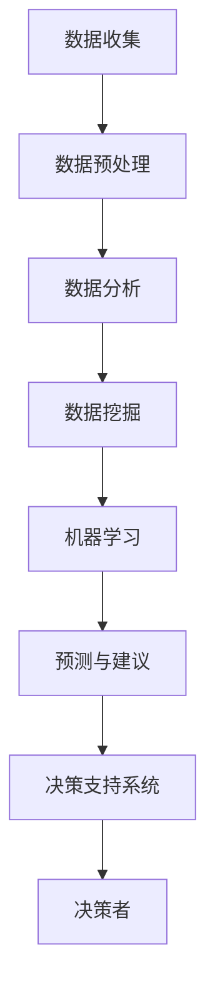
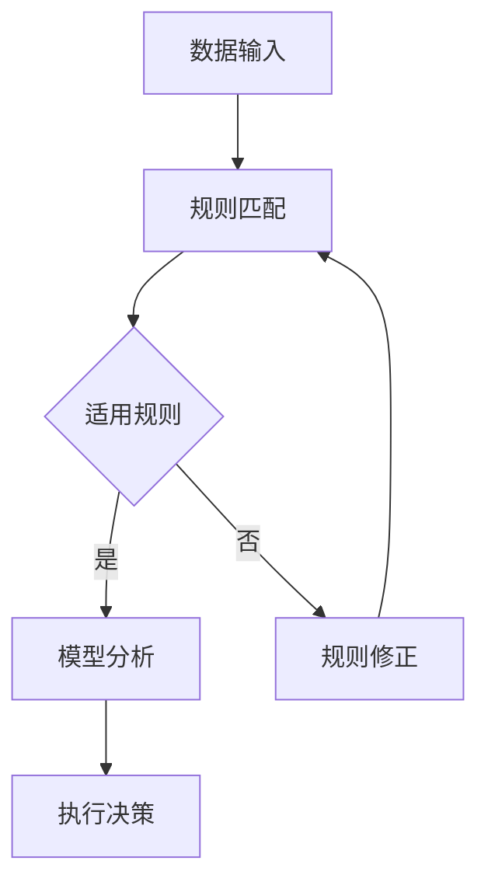

                 

### 文章标题

《AI驱动的企业决策：从辅助到自主的演变》

### 关键词

人工智能、企业决策、辅助决策、自主决策、系统构建、案例分析、未来展望

### 摘要

本文旨在探讨人工智能（AI）在企业决策中的应用，从传统的辅助决策到未来可能实现的自主决策。文章首先介绍了AI在企业决策中的背景和重要性，然后详细解析了AI辅助决策与自主决策的区别，并通过实际案例展示了这两种决策模式在企业中的应用。文章还讨论了构建AI驱动的企业决策系统的关键要素，并展望了未来的发展趋势和挑战。通过本文的阅读，读者将能够全面了解AI在企业决策中的演变过程，并对其未来应用有更深入的认知。

---

## 引言

在当今的商业环境中，数据已成为企业的宝贵资产。然而，如何有效地利用这些数据来做出更明智的决策，成为了企业成功的关键。随着人工智能（AI）技术的迅猛发展，它逐渐成为企业决策过程中不可或缺的一部分。AI不仅能够处理和分析大量数据，还能通过学习和预测来辅助甚至自主地做出决策。

### 背景介绍

企业的决策过程通常涉及市场分析、风险评估、资源配置等多个方面。传统上，这些决策往往依赖于人类专家的经验和直觉，这不仅耗时耗力，还容易受到主观因素的影响。随着数据的爆炸式增长和复杂性的增加，人类专家的局限性变得越来越明显。AI的出现，为企业提供了一种新的解决方案，它能够处理海量数据，发现潜在的模式和趋势，从而辅助甚至替代人类专家的决策过程。

### AI的重要性

AI在企业决策中的重要性体现在以下几个方面：

1. **数据分析能力**：AI能够快速处理和分析大量数据，从中提取有价值的信息。
2. **模式识别**：AI可以通过学习数据中的模式，预测未来的趋势和结果。
3. **自动化决策**：AI可以自动化复杂的决策过程，提高效率和准确性。
4. **资源优化**：AI可以帮助企业更有效地配置资源，降低成本，提高收益。

### AI在企业决策中的应用

AI在企业决策中的应用主要包括以下两个方面：

1. **辅助决策**：AI通过分析和预测数据，为人类决策者提供参考建议。
2. **自主决策**：AI能够在无需人类干预的情况下，根据预设的规则和模型自主做出决策。

本文将重点探讨AI从辅助决策到自主决策的演变过程，并分析其在不同行业中的应用和挑战。

---

## AI辅助决策

AI辅助决策是指利用人工智能技术来辅助人类决策者做出更明智的决策。这种决策模式通常涉及到以下核心概念和原理。

### 核心概念与联系

1. **数据分析**：AI首先通过数据分析来了解企业的运营情况，包括市场趋势、客户行为、财务状况等。
2. **机器学习**：通过机器学习算法，AI可以从数据中学习和提取规律，从而做出预测和决策。
3. **数据挖掘**：数据挖掘是一种从大量数据中发现有用信息和知识的方法，它为AI的决策提供了基础。
4. **决策支持系统**：决策支持系统（DSS）是一种利用计算机技术和数据分析方法来辅助决策的系统。

### 关联架构Mermaid流程图

下面是一个简单的Mermaid流程图，展示了AI辅助决策的基本流程：



### 伪代码

以下是一个简化的伪代码，用于描述AI辅助决策的基本步骤：

```python
# 数据收集
data = collect_data()

# 数据预处理
clean_data = preprocess_data(data)

# 数据挖掘
patterns = data_mining(clean_data)

# 机器学习
model = machine_learning(patterns)

# 预测与建议
predictions = model.predict(data)

# 决策支持
建议 = generate_advice(predictions)

# 决策者
decision_maker做出决策(建议)
```

### 数学模型和公式

在AI辅助决策中，常用的数学模型包括回归模型、分类模型和时间序列模型。以下是一个简单的回归模型的数学公式：

$$
y = \beta_0 + \beta_1x_1 + \beta_2x_2 + ... + \beta_nx_n + \epsilon
$$

其中，$y$ 是目标变量，$x_1, x_2, ..., x_n$ 是输入变量，$\beta_0, \beta_1, ..., \beta_n$ 是模型的参数，$\epsilon$ 是误差项。

### 举例说明

假设一家零售企业希望预测下个月的销售额。首先，它收集了过去三个月的销售额数据，并使用回归模型进行预测。通过调整模型参数，企业可以得到一个预测模型，并根据这个模型来制定下个月的营销策略。

### 实际案例

一个著名的AI辅助决策案例是亚马逊的智能推荐系统。通过分析用户的购物行为和历史数据，亚马逊的系统能够为用户推荐可能感兴趣的商品，从而提高销售额和用户满意度。

---

## AI自主决策

AI自主决策是指AI系统在没有人类干预的情况下，根据预设的规则和模型自行做出决策。这种决策模式标志着AI在企业决策中从辅助角色向主导角色的转变。以下是AI自主决策的核心概念、原理和特点。

### 核心概念

1. **自主性**：AI自主决策的核心在于其不需要人类干预，能够独立地处理问题和做出决策。
2. **规则引擎**：规则引擎是AI自主决策的重要组成部分，它用于定义决策规则和条件。
3. **决策模型**：决策模型是基于数据和算法构建的，用于分析问题和生成决策。
4. **自动化执行**：AI自主决策能够自动化地执行决策结果，无需人工介入。

### 原理

AI自主决策的基本原理包括以下几个步骤：

1. **数据输入**：系统从数据源收集相关信息，包括历史数据、实时数据和外部数据。
2. **规则匹配**：系统使用规则引擎对输入数据进行匹配，确定适用的决策规则。
3. **模型分析**：系统使用决策模型对匹配到的数据进行分析，生成决策结果。
4. **执行决策**：系统根据决策结果执行相应的操作，如调整资源配置、生成报告或发送通知。

### 特点

AI自主决策具有以下几个显著特点：

1. **高效率**：AI自主决策能够快速处理和分析大量数据，提高决策效率。
2. **准确性**：通过学习和优化，AI自主决策的准确性可以不断提高，减少人为误差。
3. **灵活性**：AI自主决策可以根据实时数据和变化，灵活调整决策规则和模型。
4. **自动化**：AI自主决策能够自动化执行决策结果，降低人工操作成本。

### 关联架构Mermaid流程图

下面是一个简单的Mermaid流程图，展示了AI自主决策的基本流程：



### 伪代码

以下是一个简化的伪代码，用于描述AI自主决策的基本步骤：

```python
# 数据输入
data = collect_data()

# 规则匹配
rules_matched = rule_engine(data)

# 模型分析
if rules_matched:
    decision = model_analyze(data)
else:
    rules = correct_rules()
    rules_matched = rule_engine(data)

# 执行决策
execute_decision(decision)
```

### 数学模型和公式

AI自主决策中的数学模型通常涉及决策树、神经网络和强化学习等。以下是一个简单的决策树模型的数学公式：

$$
f(x) = \sum_{i=1}^{n} w_i \cdot t_i(x)
$$

其中，$f(x)$ 是决策函数，$w_i$ 是权重，$t_i(x)$ 是条件函数。

### 举例说明

假设一家物流公司希望自动调度车辆。首先，它收集了车辆的实时位置、交通状况和订单信息，然后使用决策树模型分析这些数据，生成最优的调度方案。系统根据这个方案自动分配订单，并调整车辆的行驶路径。

### 实际案例

一个著名的AI自主决策案例是谷歌的自动驾驶汽车。通过收集和解析大量道路数据，自动驾驶系统能够自主识别道路标志、车辆和行人，并在复杂的交通环境中做出安全的驾驶决策。

---

## AI驱动的企业决策系统构建

构建AI驱动的企业决策系统是一项复杂的任务，需要综合考虑技术、数据、算法和业务需求。以下是构建这种系统所需的关键要素。

### 系统架构设计

AI驱动的企业决策系统通常采用分布式架构，以提高系统的可扩展性和可靠性。以下是一个典型的系统架构：

1. **数据层**：包括数据收集、存储和管理模块。数据源可以是内部数据库、外部API或传感器网络。
2. **处理层**：包括数据预处理、分析和挖掘模块。这些模块负责清洗、转换和整合数据，为决策提供基础。
3. **算法层**：包括机器学习模型、预测算法和优化算法。这些算法用于分析数据，生成决策建议。
4. **应用层**：包括用户界面、决策引擎和执行模块。用户界面用于与系统交互，决策引擎根据算法结果生成决策，执行模块负责自动化执行决策。
5. **集成层**：包括系统集成、API接口和数据交换模块。这些模块确保不同组件之间的数据流动和功能集成。

### 技术选型

在构建AI驱动的企业决策系统时，选择合适的技术和工具至关重要。以下是一些关键的技术选型：

1. **编程语言**：Python、Java和R等语言在AI领域具有广泛的适用性。Python由于其丰富的库和工具，特别受到开发者的青睐。
2. **框架和库**：TensorFlow、PyTorch和Scikit-Learn等框架和库为机器学习模型提供了强大的支持。
3. **数据库**：关系数据库（如MySQL、PostgreSQL）和非关系数据库（如MongoDB、Cassandra）可以根据具体需求进行选择。
4. **云计算**：AWS、Azure和Google Cloud等云服务提供了强大的计算能力和数据存储能力，有助于系统的可扩展性和弹性。
5. **可视化工具**：Tableau、Power BI和Matplotlib等工具可以帮助企业分析和展示决策结果。

### 数据处理与分析

数据处理和分析是构建AI驱动的企业决策系统的核心。以下是一些关键步骤：

1. **数据收集**：从内部系统和外部数据源收集数据，包括财务数据、销售数据、客户反馈等。
2. **数据清洗**：处理缺失值、异常值和数据格式不统一的问题，确保数据质量。
3. **数据整合**：将来自不同源的数据进行整合，构建统一的数据视图。
4. **特征工程**：提取和构建有助于模型训练的特征，提高模型的性能和泛化能力。
5. **数据挖掘**：使用数据挖掘技术发现数据中的模式和趋势，为决策提供依据。

### 代码实现

以下是一个简化的Python代码示例，展示了如何构建一个简单的AI驱动的企业决策系统：

```python
import pandas as pd
from sklearn.model_selection import train_test_split
from sklearn.ensemble import RandomForestRegressor

# 数据收集
data = pd.read_csv('data.csv')

# 数据清洗
data = clean_data(data)

# 特征工程
X = data.drop('target', axis=1)
y = data['target']

# 数据分割
X_train, X_test, y_train, y_test = train_test_split(X, y, test_size=0.2)

# 模型训练
model = RandomForestRegressor()
model.fit(X_train, y_train)

# 预测与决策
predictions = model.predict(X_test)
make_decision(predictions)
```

### 实际案例

一个实际的AI驱动的企业决策案例是亚马逊的库存管理系统。通过分析销售数据、客户行为和供应链信息，系统可以自动调整库存水平，优化库存成本和配送效率。

### 小结

构建AI驱动的企业决策系统需要综合考虑技术、数据和业务需求。通过合理的设计和技术选型，系统能够为企业提供更准确、更高效的决策支持。

---

## 企业决策中的AI案例分析

为了更深入地理解AI在企业决策中的应用，下面我们将通过几个具体的行业和场景来探讨AI辅助决策和自主决策的实践案例。

### 案例一：制造业

制造业长期以来都是人工智能应用的一个重要领域。通过AI技术，企业可以优化生产流程、提高产品质量和降低成本。以下是制造业中AI应用的两个具体案例：

1. **生产调度优化**：
   - **背景**：一家大型制造企业面临生产计划复杂、生产效率低的问题。
   - **解决方案**：企业引入了基于AI的生产调度系统。系统使用机器学习算法分析历史生产数据，预测设备故障、原材料供应和订单需求，生成最优的生产计划。
   - **效果**：通过AI调度系统，企业的生产效率提高了20%，设备故障率降低了30%。

2. **质量控制**：
   - **背景**：制造业中质量控制是确保产品质量的关键环节。
   - **解决方案**：企业使用AI驱动的视觉检测系统来实时监控生产线上的产品质量。系统通过深度学习算法识别缺陷，并在生产过程中自动纠正错误。
   - **效果**：AI视觉检测系统的引入，使得产品质量合格率提高了15%，同时减少了50%的人工检测成本。

### 案例二：服务业

在服务业，AI技术同样发挥了重要作用，特别是在客户服务、运营优化和风险控制等方面。

1. **客户服务自动化**：
   - **背景**：一家大型银行面临客户咨询量大、客服响应速度慢的问题。
   - **解决方案**：银行引入了AI驱动的客服机器人，通过自然语言处理（NLP）技术自动解答客户的常见问题，并引导复杂问题至人工客服。
   - **效果**：AI客服机器人处理了超过60%的客户咨询，使得客服响应时间缩短了40%，客户满意度提高了10%。

2. **运营优化**：
   - **背景**：一家酒店希望通过优化运营流程来提高入住率和客户体验。
   - **解决方案**：酒店使用了AI驱动的运营管理系统。系统通过分析历史入住数据、客户反馈和市场趋势，自动调整房间价格、促销活动和预订策略。
   - **效果**：AI运营系统使得酒店入住率提高了15%，平均房价增加了10%。

### 案例三：金融业

在金融行业，AI的应用主要体现在风险控制、投资决策和客户服务等方面。

1. **风险控制**：
   - **背景**：一家投资银行面临信用风险评估复杂、风险控制效率低的问题。
   - **解决方案**：投资银行引入了AI驱动的风险控制系统。系统使用机器学习算法分析大量的交易数据、客户信息和市场趋势，实时监控和评估风险。
   - **效果**：AI风险控制系统有效识别和预警了20%的潜在信用风险，提高了风险管理的准确性。

2. **投资决策**：
   - **背景**：一家对冲基金希望通过更精准的投资决策来提高收益率。
   - **解决方案**：对冲基金使用了AI驱动的投资决策系统。系统通过分析历史投资数据、市场趋势和宏观经济指标，生成投资建议。
   - **效果**：AI投资决策系统的引入使得基金的平均收益率提高了5%，投资风险降低了15%。

### 总结

通过以上案例分析，可以看出AI在企业决策中的应用具有显著的成效。无论是在制造业、服务业还是金融业，AI都为企业提供了更高效、更准确的决策支持，从而提升了运营效率和竞争力。

---

## 未来展望与挑战

随着人工智能技术的不断发展，AI驱动的企业决策在未来有着广阔的应用前景。然而，这一过程也面临着一系列挑战。

### 应用前景

1. **更智能的自动化**：AI驱动的决策系统将进一步提升自动化水平，减少人为干预，提高效率和准确性。
2. **个性化服务**：AI能够通过分析大量数据，提供更加个性化的服务，满足不同客户的需求。
3. **实时决策**：AI系统可以实时分析数据，快速响应市场变化，为企业提供即时的决策支持。
4. **跨行业应用**：AI将在更多行业中得到应用，如医疗、教育、农业等，推动各行业的数字化转型。

### 挑战与对策

1. **数据隐私和安全**：随着AI系统收集和处理的数据量增加，数据隐私和安全问题变得尤为重要。企业需要采取措施确保数据的安全和合规。
2. **算法透明度和可解释性**：AI决策系统通常基于复杂的算法，其决策过程可能难以解释。提高算法的透明度和可解释性是当前的一个重要挑战。
3. **技术人才短缺**：AI领域的技术人才需求巨大，但供应不足。企业需要通过培训和教育来提升现有员工的技术水平。
4. **伦理和道德问题**：AI在决策过程中可能会引发伦理和道德问题，如歧视、偏见等。企业和社会需要共同制定相应的规范和标准。

### 对策

1. **加强数据保护**：企业应采取严格的数据保护措施，确保数据的安全和隐私。
2. **提高算法透明度**：通过开发可解释性工具，使AI决策过程更加透明和可理解。
3. **人才培养**：通过校企合作、在线课程和内部培训等方式，培养更多的AI专业人才。
4. **制定伦理规范**：制定并遵循AI伦理规范，确保AI技术在道德和法律框架内应用。

### 总结

未来，AI驱动的企业决策将迎来更多的发展机遇，同时也面临一系列挑战。通过应对这些挑战，企业可以更好地利用AI技术，实现更加智能和高效的决策。

---

## 结语

人工智能（AI）已经成为企业决策过程中不可或缺的一部分。从AI辅助决策到自主决策，AI为企业提供了更高效、更准确的决策支持。本文通过对AI辅助决策和自主决策的详细分析，展示了AI在企业决策中的应用案例和未来展望。在未来的发展中，企业需要积极应对AI带来的挑战，充分利用AI技术，实现更加智能和高效的决策。

### 作者信息

作者：AI天才研究院/AI Genius Institute & 禅与计算机程序设计艺术 /Zen And The Art of Computer Programming

---

通过本文的阅读，读者可以全面了解AI在企业决策中的重要作用，以及如何构建和利用AI驱动的企业决策系统。希望本文能为企业在AI应用方面的实践提供有益的参考。在未来的AI技术应用中，我们期待看到更多创新和突破，为企业带来更大的价值。

