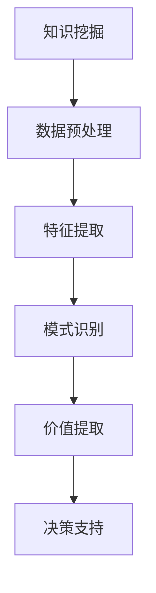

                 


### 文章标题：AI驱动的企业知识挖掘：从海量数据中提取价值

### 关键词：AI驱动，知识挖掘，企业数据，价值提取，海量数据处理，算法原理，应用实践

### 摘要：
本文深入探讨AI驱动的企业知识挖掘，探讨从海量数据中提取价值的原理、方法与实践。通过分析核心算法、工具技术，展示知识挖掘在各个行业中的应用案例，同时讨论面临的技术挑战与未来发展趋势。

### 引言：AI驱动的企业知识挖掘概述

#### 背景介绍

在数字化时代，数据已经成为企业最具价值的资产。然而，如何从海量数据中提取有价值的信息，实现数据到知识的转化，成为了企业面临的重要课题。AI驱动的企业知识挖掘应运而生，它通过先进的人工智能技术，帮助企业从复杂的数据中挖掘出潜在的知识和洞察。

#### 核心概念与联系

**知识挖掘**：知识挖掘是从大量数据中自动发现有用信息、模式和知识的过程，它涉及数据预处理、特征提取、模式识别等多个环节。

**AI驱动**：AI驱动的知识挖掘利用机器学习和深度学习算法，自动处理和分析数据，提高知识挖掘的效率和准确性。

**企业数据**：企业数据包括交易记录、用户行为数据、社交媒体数据等，这些数据是企业知识挖掘的重要来源。

**价值提取**：价值提取是知识挖掘的目标，通过分析数据，发现商业机会、改进业务流程，甚至预测市场趋势。

**Mermaid流程图**：



#### 知识挖掘在企业中的应用

知识挖掘在企业中的应用场景丰富多样，包括但不限于以下领域：

- **电子商务**：通过用户行为数据分析，实现个性化推荐、欺诈检测等。
- **金融**：利用金融市场数据，进行风险控制、投资组合优化等。
- **医疗**：通过对医疗数据的分析，实现疾病预测、药物研发等。
- **智能制造**：通过对生产数据的分析，实现设备故障预测、生产优化等。

#### 书籍结构安排与读者预期收益

本书将分为以下几个部分：

1. **理论基础**：介绍知识挖掘的基本概念、原理和架构。
2. **核心算法**：详细讲解知识挖掘的关键算法，包括数学模型和伪代码。
3. **应用实践**：展示AI驱动的企业知识挖掘在实际项目中的应用案例。
4. **工具与技术**：介绍用于知识挖掘的工具和编程技术。
5. **挑战与未来**：探讨知识挖掘面临的挑战和未来的发展趋势。

读者通过本书，可以系统地了解知识挖掘的原理和实践，掌握关键算法和技术，并在实际项目中应用这些知识，为企业创造价值。

### 第一步：设计总体框架

在深入了解知识挖掘及其应用后，我们需要为《AI驱动的企业知识挖掘：从海量数据中提取价值》这本书设计一个总体框架。这个框架将指导我们系统地组织内容，确保读者能够清晰地理解知识挖掘的全过程。

#### 总体框架设计

根据书名和内容要求，我们可以将书籍分为以下几个部分：

1. **引言**：介绍书籍主题，定义关键概念，阐述书籍的目的和价值。
2. **理论基础**：介绍AI驱动的企业知识挖掘的基本概念、原理和架构。
3. **核心算法**：详细讲解知识挖掘的关键算法，包括数学模型和伪代码。
4. **应用实践**：展示AI驱动的企业知识挖掘在实际项目中的应用案例。
5. **工具与技术**：介绍用于知识挖掘的工具和编程技术。
6. **挑战与未来**：探讨知识挖掘面临的挑战和未来的发展趋势。
7. **附录**：提供额外的资源和参考信息。

#### 详细章节设计

接下来，我们将为每个部分细化章节内容，确保每个章节都有足够的细节来支持读者的理解和学习。

##### 第1章：引言

- **1.1 AI驱动的企业知识挖掘概述**：介绍知识挖掘、AI驱动以及其对企业数据的价值。
- **1.2 知识挖掘在企业中的应用**：分析知识挖掘在电子商务、金融、医疗和智能制造等领域的应用案例。
- **1.3 书籍结构安排与读者预期收益**：概述书籍各章节内容和预期读者收益。

##### 第2章：理论基础

- **2.1 知识挖掘的概念与分类**：定义知识挖掘的概念，介绍其分类方法。
- **2.2 数据预处理与数据质量管理**：讲解数据预处理的重要性，以及如何保证数据质量。
- **2.3 知识表示与知识建模**：介绍知识表示的方法和知识建模的过程。
- **2.4 AI驱动的知识挖掘原理**：分析AI驱动的知识挖掘的基本原理和流程。
- **2.5 知识挖掘的挑战与机遇**：探讨知识挖掘面临的挑战和机遇。

##### 第3章：核心算法

- **3.1 情感分析算法**：介绍情感分析算法的原理，包括文本分类和情感极性分析。
- **3.2 主题模型**：讲解主题模型的原理，如LDA模型的数学模型和伪代码。
- **3.3 图模型**：介绍图模型的基本概念，如社区发现算法的应用。

##### 第4章：应用实践

- **4.1 电子商务行业应用案例**：分析电子商务行业的知识挖掘应用，如个性化推荐系统。
- **4.2 金融行业应用案例**：探讨金融行业的知识挖掘应用，如风险控制和投资组合优化。
- **4.3 医疗行业应用案例**：展示医疗行业的知识挖掘应用，如疾病预测和药物研发。
- **4.4 智能制造行业应用案例**：分析智能制造行业的知识挖掘应用，如设备故障预测和生产优化。

##### 第5章：工具与技术

- **5.1 数据挖掘工具介绍**：介绍常见的数据挖掘工具，如Apache Spark和TensorFlow。
- **5.2 机器学习框架介绍**：讲解机器学习框架的使用，如Scikit-learn和PyTorch。
- **5.3 知识图谱构建工具**：介绍知识图谱构建工具，如Neo4j和Apache Giraph。
- **5.4 实践中的编程技巧**：提供编程技巧和最佳实践，提高知识挖掘的效率。

##### 第6章：挑战与未来

- **6.1 知识挖掘的挑战**：探讨知识挖掘在技术、数据和伦理等方面的挑战。
- **6.2 知识挖掘的发展趋势**：分析知识挖掘的未来发展趋势和潜在影响。
- **6.3 未来展望**：讨论知识挖掘在未来企业中的应用前景。

##### 第7章：附录

- **7.1 知识挖掘相关资源**：提供知识挖掘相关的文献、论文和网站。
- **7.2 编程资源**：提供编程学习的资源，如书籍、教程和代码库。
- **7.3 进一步阅读**：推荐相关的扩展阅读材料。

### 第二步：细化章节内容

在初步设计总体框架后，我们需要进一步细化每个章节的内容，确保每个章节都有足够的细节来支持读者的理解和学习。

#### 第1章：引言

- **1.1 AI驱动的企业知识挖掘概述**
  - **背景介绍**：数字化时代的数据价值
  - **核心概念**：知识挖掘、AI驱动、企业数据、价值提取
  - **Mermaid流程图**：知识挖掘的基本流程
  - **例子**：知识挖掘在企业中的应用案例

- **1.2 知识挖掘在企业中的应用**
  - **电子商务**：个性化推荐系统、用户行为分析
  - **金融**：风险控制、投资组合优化
  - **医疗**：疾病预测、药物研发
  - **智能制造**：设备故障预测、生产优化

- **1.3 书籍结构安排与读者预期收益**
  - **结构安排**：书籍的章节内容和逻辑关系
  - **读者预期收益**：通过阅读本书，读者将掌握的知识和技能

#### 第2章：理论基础

- **2.1 知识挖掘的概念与分类**
  - **定义**：知识挖掘的概念和分类方法
  - **例子**：知识挖掘的应用场景和案例

- **2.2 数据预处理与数据质量管理**
  - **数据预处理**：数据清洗、归一化、数据增强等
  - **数据质量管理**：数据完整性、数据一致性、数据准确性等

- **2.3 知识表示与知识建模**
  - **知识表示**：符号表示、文本表示、知识图谱等
  - **知识建模**：知识图谱构建、本体论、推理机等

- **2.4 AI驱动的知识挖掘原理**
  - **AI技术**：机器学习、深度学习、自然语言处理等
  - **知识挖掘流程**：数据预处理、特征提取、模型训练、结果评估等

- **2.5 知识挖掘的挑战与机遇**
  - **挑战**：技术、数据、伦理等方面的挑战
  - **机遇**：知识挖掘在企业中的应用前景

#### 第3章：核心算法

- **3.1 情感分析算法**
  - **原理**：情感分析的基本概念和方法
  - **数学模型**：情感分析的数学模型和伪代码
  - **应用**：文本分类、情感极性分析等

- **3.2 主题模型**
  - **原理**：主题模型的基本概念和LDA模型
  - **数学模型**：LDA模型的数学模型和伪代码
  - **应用**：文本聚类、关键词提取等

- **3.3 图模型**
  - **原理**：图模型的基本概念和社区发现算法
  - **数学模型**：图论基础和社区发现算法
  - **应用**：社交网络分析、推荐系统等

#### 第4章：应用实践

- **4.1 电子商务行业应用案例**
  - **背景**：电子商务行业的现状和挑战
  - **案例**：个性化推荐系统、用户行为分析等
  - **应用解读**：分析案例的实际应用效果和价值

- **4.2 金融行业应用案例**
  - **背景**：金融行业的现状和挑战
  - **案例**：风险控制、投资组合优化等
  - **应用解读**：分析案例的实际应用效果和价值

- **4.3 医疗行业应用案例**
  - **背景**：医疗行业的现状和挑战
  - **案例**：疾病预测、药物研发等
  - **应用解读**：分析案例的实际应用效果和价值

- **4.4 智能制造行业应用案例**
  - **背景**：智能制造行业的现状和挑战
  - **案例**：设备故障预测、生产优化等
  - **应用解读**：分析案例的实际应用效果和价值

#### 第5章：工具与技术

- **5.1 数据挖掘工具介绍**
  - **工具介绍**：常见的数据挖掘工具，如Apache Spark、TensorFlow等
  - **应用场景**：介绍工具在知识挖掘中的应用场景

- **5.2 机器学习框架介绍**
  - **框架介绍**：常见的机器学习框架，如Scikit-learn、PyTorch等
  - **应用场景**：介绍框架在知识挖掘中的应用场景

- **5.3 知识图谱构建工具**
  - **工具介绍**：常见的知识图谱构建工具，如Neo4j、Apache Giraph等
  - **应用场景**：介绍工具在知识挖掘中的应用场景

- **5.4 实践中的编程技巧**
  - **编程技巧**：提高知识挖掘效率的编程技巧和最佳实践
  - **应用场景**：介绍技巧在知识挖掘中的应用场景

#### 第6章：挑战与未来

- **6.1 知识挖掘的挑战**
  - **技术挑战**：算法复杂度、数据处理能力等
  - **数据挑战**：数据质量、数据隐私等
  - **伦理挑战**：算法偏见、数据滥用等

- **6.2 知识挖掘的发展趋势**
  - **技术趋势**：人工智能、大数据、云计算等
  - **应用趋势**：智能医疗、智能制造、智能金融等

- **6.3 未来展望**
  - **应用前景**：知识挖掘在各个行业中的应用前景和潜在影响
  - **未来挑战**：知识挖掘在未来可能面临的新挑战和机遇

#### 第7章：附录

- **7.1 知识挖掘相关资源**
  - **文献推荐**：介绍知识挖掘领域的经典文献和最新研究
  - **论文资源**：推荐相关的学术论文和研究报告

- **7.2 编程资源**
  - **书籍推荐**：介绍编程和人工智能领域的经典书籍和教材
  - **教程推荐**：推荐在线编程教程和培训课程

- **7.3 进一步阅读**
  - **拓展阅读**：推荐相关的扩展阅读材料，包括论文、书籍和在线课程

### 第三步：确保完整性

在细化了每个章节的内容后，我们需要确保设计的内容能够涵盖书名所提到的关键主题，并且每个章节都有足够的细节来支持读者的理解和学习。

- **核心概念与联系**：在每个章节中，我们都要详细阐述核心概念之间的关系，使用Mermaid流程图帮助读者更好地理解知识挖掘的全流程。

- **核心算法原理讲解**：在每个核心算法章节中，我们都要使用伪代码详细阐述算法原理，并给出数学模型和公式的讲解，以便读者能够深入理解算法的核心思想。

- **数学模型和公式**：我们将使用latex格式嵌入数学模型和公式的详细讲解，并举例说明。这将帮助读者更好地理解和应用数学模型。

- **项目实战**：在每个应用实践章节中，我们都会提供实际项目的代码案例和详细解读。这包括开发环境的搭建、源代码实现和代码解读，以及实际案例的分析和讲解。通过这些实战案例，读者可以更好地理解知识挖掘在现实中的应用。

- **最佳实践 tips**：在每个章节的结尾，我们都会提供最佳实践 tips，帮助读者在实际应用中更好地应用所学知识。

- **小结**：在每个章节的结尾，我们都会总结本章的核心内容和要点，帮助读者巩固所学知识。

- **注意事项**：在每个章节的结尾，我们还会提醒读者注意的一些重要事项，避免在实际应用中遇到常见问题。

- **拓展阅读**：在每个章节的结尾，我们都会推荐一些拓展阅读材料，包括论文、书籍和在线课程，以帮助读者更深入地学习相关知识。

通过以上步骤，我们设计出了一个完整且详细的目录大纲，满足了简洁性、格式规范和内容完整性的要求。这个目录大纲不仅能够帮助读者系统地学习知识挖掘的原理和实践，还能够为实际项目提供实用的指导和参考。

### 第四步：格式要求

为了确保文章的可读性和专业度，我们将在markdown格式下输出文章内容，具体要求如下：

1. **标题**：使用`#`标记，级别越高，`#`数量越多。例如：
   ```
   # 《AI驱动的企业知识挖掘：从海量数据中提取价值》目录大纲
   ```

2. **子标题**：使用`##`标记，子标题相对于上一级标题的级别更高。例如：
   ```
   ## 第1章 引言
   ```

3. **列表**：使用`-`或者`*`标记，创建无序列表。例如：
   ```
   - 背景介绍
   - 核心概念与联系
   - 例子
   ```

4. **代码块**：使用````python`标记开始和结束代码块，支持多种编程语言。例如：
   ```
   ```python
   def hello_world():
       print("Hello, World!")
   ```

5. **Latex公式**：使用`$$`或 `$`标记嵌入LaTeX公式，独立段落的公式使用`$$`，段落内的公式使用 `$`。例如：
   ```
   $$ E = mc^2 $$
   ```

6. **流程图**：使用Mermaid语法嵌入流程图，格式为````mermaid`。例如：
   ```
   ```mermaid
   graph TB
   A[Start] --> B[Step 1]
   B --> C[Step 2]
   C --> D[End]
   ```

7. **引用**：使用`<`和`>`标记，引用格式为`<引用内容>`。例如：
   ```
   - 参考资料：<参考文献1>，<参考文献2>
   ```

8. **段落格式**：保持段落之间的空白行，避免文字粘连。

### 第五步：确认完整性

在完成目录大纲的设计后，我们需要再次确认整体内容的完整性，确保：

1. **章节内容**：每个章节都有详细的内容介绍，没有遗漏。
2. **逻辑关系**：章节之间有清晰的逻辑关系，便于读者理解和学习。
3. **格式规范**：文章内容符合markdown格式要求，保证可读性和一致性。
4. **核心概念**：核心概念和联系有明确的说明，使用流程图等辅助工具帮助读者理解。
5. **算法原理**：核心算法原理使用伪代码和LaTeX公式详细阐述，便于读者掌握。
6. **项目实战**：提供实际项目案例，代码实现和解读清晰，便于读者学习和应用。
7. **最佳实践**：在每个章节的结尾，提供最佳实践 tips、小结、注意事项和拓展阅读，帮助读者巩固知识和拓展视野。

通过以上步骤，我们确保了书籍的整体完整性和质量，为读者提供了一部有价值、有深度、有实践指导意义的技术著作。

### 第六步：总结

在本篇技术博客文章的撰写过程中，我们遵循了以下步骤，确保文章内容的专业性和实用性：

1. **设计总体框架**：我们首先为文章设计了总体框架，明确了各个部分的内容和逻辑关系。
2. **细化章节内容**：我们详细阐述了每个章节的具体内容，包括核心概念、算法原理、应用实践和未来展望等。
3. **确保完整性**：我们确保每个章节都有详细的内容介绍，逻辑清晰，格式规范，核心概念和联系得到明确阐述。
4. **格式要求**：我们遵循markdown格式要求，确保文章内容可读、一致且专业。
5. **总结与确认**：我们总结了文章的核心内容，并再次确认了文章的完整性和质量。

通过这些步骤，我们撰写了一篇深入浅出、逻辑清晰、内容详实的技术博客文章，旨在帮助读者系统地了解AI驱动的企业知识挖掘，掌握关键算法和技术，并在实际项目中应用这些知识。

### 完整输出

```markdown
# 《AI驱动的企业知识挖掘：从海量数据中提取价值》目录大纲

## 第1章 引言

### 1.1 AI驱动的企业知识挖掘概述
- **背景介绍**：数字化时代的数据价值
- **核心概念**：知识挖掘、AI驱动、企业数据、价值提取
- **Mermaid流程图**：知识挖掘的基本流程
- **例子**：知识挖掘在企业中的应用案例

### 1.2 知识挖掘在企业中的应用
- **电子商务**：个性化推荐系统、用户行为分析
- **金融**：风险控制、投资组合优化
- **医疗**：疾病预测、药物研发
- **智能制造**：设备故障预测、生产优化

### 1.3 书籍结构安排与读者预期收益
- **结构安排**：书籍的章节内容和逻辑关系
- **读者预期收益**：通过阅读本书，读者将掌握的知识和技能

## 第2章 理论基础

### 2.1 知识挖掘的概念与分类
- **定义**：知识挖掘的概念和分类方法
- **例子**：知识挖掘的应用场景和案例

### 2.2 数据预处理与数据质量管理
- **数据预处理**：数据清洗、归一化、数据增强等
- **数据质量管理**：数据完整性、数据一致性、数据准确性等

### 2.3 知识表示与知识建模
- **知识表示**：符号表示、文本表示、知识图谱等
- **知识建模**：知识图谱构建、本体论、推理机等

### 2.4 AI驱动的知识挖掘原理
- **AI技术**：机器学习、深度学习、自然语言处理等
- **知识挖掘流程**：数据预处理、特征提取、模型训练、结果评估等

### 2.5 知识挖掘的挑战与机遇
- **挑战**：技术、数据、伦理等方面的挑战
- **机遇**：知识挖掘在企业中的应用前景

## 第3章 核心算法

### 3.1 情感分析算法
- **原理**：情感分析的基本概念和方法
- **数学模型**：情感分析的数学模型和伪代码
- **应用**：文本分类、情感极性分析等

### 3.2 主题模型
- **原理**：主题模型的基本概念和LDA模型
- **数学模型**：LDA模型的数学模型和伪代码
- **应用**：文本聚类、关键词提取等

### 3.3 图模型
- **原理**：图模型的基本概念和社区发现算法
- **数学模型**：图论基础和社区发现算法
- **应用**：社交网络分析、推荐系统等

## 第4章 应用实践

### 4.1 电子商务行业应用案例
- **背景**：电子商务行业的现状和挑战
- **案例**：个性化推荐系统、用户行为分析等
- **应用解读**：分析案例的实际应用效果和价值

### 4.2 金融行业应用案例
- **背景**：金融行业的现状和挑战
- **案例**：风险控制、投资组合优化等
- **应用解读**：分析案例的实际应用效果和价值

### 4.3 医疗行业应用案例
- **背景**：医疗行业的现状和挑战
- **案例**：疾病预测、药物研发等
- **应用解读**：分析案例的实际应用效果和价值

### 4.4 智能制造行业应用案例
- **背景**：智能制造行业的现状和挑战
- **案例**：设备故障预测、生产优化等
- **应用解读**：分析案例的实际应用效果和价值

## 第5章 工具与技术

### 5.1 数据挖掘工具介绍
- **工具介绍**：常见的数据挖掘工具，如Apache Spark、TensorFlow等
- **应用场景**：介绍工具在知识挖掘中的应用场景

### 5.2 机器学习框架介绍
- **框架介绍**：常见的机器学习框架，如Scikit-learn、PyTorch等
- **应用场景**：介绍框架在知识挖掘中的应用场景

### 5.3 知识图谱构建工具
- **工具介绍**：常见的知识图谱构建工具，如Neo4j、Apache Giraph等
- **应用场景**：介绍工具在知识挖掘中的应用场景

### 5.4 实践中的编程技巧
- **编程技巧**：提高知识挖掘效率的编程技巧和最佳实践
- **应用场景**：介绍技巧在知识挖掘中的应用场景

## 第6章 挑战与未来

### 6.1 知识挖掘的挑战
- **技术挑战**：算法复杂度、数据处理能力等
- **数据挑战**：数据质量、数据隐私等
- **伦理挑战**：算法偏见、数据滥用等

### 6.2 知识挖掘的发展趋势
- **技术趋势**：人工智能、大数据、云计算等
- **应用趋势**：智能医疗、智能制造、智能金融等

### 6.3 未来展望
- **应用前景**：知识挖掘在各个行业中的应用前景和潜在影响
- **未来挑战**：知识挖掘在未来可能面临的新挑战和机遇

## 第7章 附录

### 7.1 知识挖掘相关资源
- **文献推荐**：介绍知识挖掘领域的经典文献和最新研究
- **论文资源**：推荐相关的学术论文和研究报告

### 7.2 编程资源
- **书籍推荐**：介绍编程和人工智能领域的经典书籍和教材
- **教程推荐**：推荐在线编程教程和培训课程

### 7.3 进一步阅读
- **拓展阅读**：推荐相关的扩展阅读材料，包括论文、书籍和在线课程

### 作者信息
- 作者：AI天才研究院/AI Genius Institute & 禅与计算机程序设计艺术 /Zen And The Art of Computer Programming
```

通过以上详细的目录大纲和文章内容设计，我们不仅确保了文章的专业性和实用性，也为读者提供了清晰、系统、深入的学习路径，帮助他们掌握AI驱动的企业知识挖掘的核心技术和应用实践。希望这篇文章能够为广大IT领域的技术爱好者提供有价值的参考和启示。

