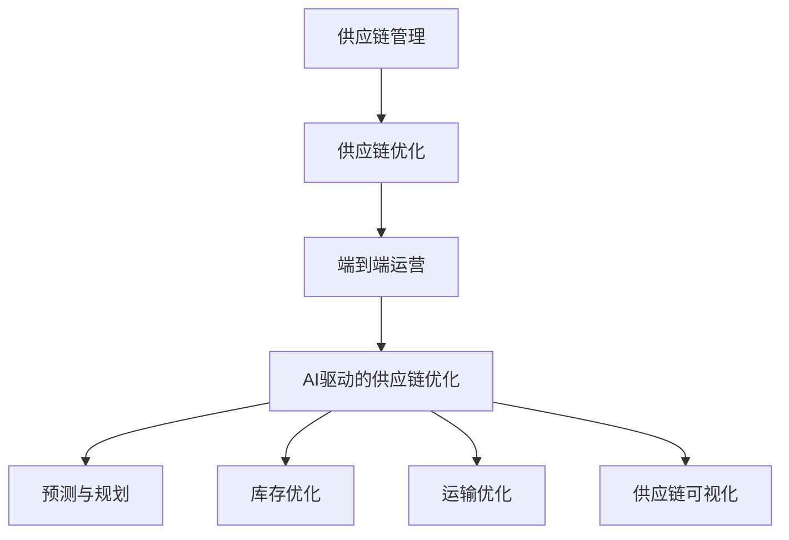

                 


## 引言

### 背景介绍

供应链作为企业运营的核心环节，其效率与稳定性直接影响企业的竞争力。随着全球化的深入发展，供应链的复杂性不断增加，传统的供应链管理方法已无法满足现代企业的需求。因此，如何提升供应链的端到端运营效率，成为了企业关注的焦点。

### 核心概念与联系

为了实现供应链的优化，首先需要理解以下几个核心概念：

1. **供应链管理**：涉及原材料采购、生产、库存管理、物流配送、销售等各个环节，旨在实现资源的最大化利用和成本的最低化。
2. **供应链优化**：通过改进供应链各环节的运营方式，降低整体运营成本，提高供应链的响应速度和灵活性。
3. **端到端运营**：指从原材料采购到产品交付给最终客户的全过程，强调各环节的无缝衔接和高效协同。

这些概念相互关联，共同构成了供应链优化的基础。

### AI驱动的供应链优化

人工智能（AI）技术的发展为供应链优化带来了新的机遇。AI驱动的供应链优化主要利用机器学习、数据挖掘、预测分析等技术，对供应链各环节进行智能化改造。其核心在于通过大数据分析和智能算法，实现以下目标：

1. **预测与规划**：基于历史数据和实时信息，预测市场需求和供应链风险，为生产和库存管理提供决策支持。
2. **库存优化**：通过需求预测和库存周转率分析，实现库存量的合理控制，降低库存成本。
3. **运输优化**：利用路径优化算法和实时交通信息，降低运输成本，提高运输效率。
4. **供应链可视化**：通过数据可视化技术，实现供应链各环节的透明化，提高供应链的运营效率。

## 核心概念与联系流程图

下面是一个描述核心概念之间关系的Mermaid流程图：



通过这个流程图，我们可以清晰地看到各核心概念之间的联系，以及它们如何共同推动AI驱动的供应链优化。

## 核心算法原理讲解

在AI驱动的供应链优化中，核心算法原理主要包括以下几个部分：

### 1. 机器学习算法

机器学习算法是AI驱动的供应链优化的重要组成部分。常见的机器学习算法包括：

- **线性回归**：用于预测市场需求和库存需求。
- **决策树**：用于分类和回归分析，帮助识别供应链中的关键节点。
- **神经网络**：用于复杂的数据分析和预测，如需求预测和库存优化。

### 2. 数据挖掘技术

数据挖掘技术用于从大量历史数据中提取有价值的信息，以支持决策制定。常见的数据挖掘技术包括：

- **关联规则挖掘**：用于发现供应链中的关键关联关系，如产品之间的销售关联。
- **聚类分析**：用于将相似的数据分组，帮助识别供应链中的潜在问题。
- **分类分析**：用于预测供应链中的潜在风险和机会。

### 3. 预测分析技术

预测分析技术是AI驱动的供应链优化的核心。常见的预测分析技术包括：

- **时间序列分析**：用于分析历史数据，预测未来的市场需求和供应链风险。
- **回归分析**：用于建立历史数据与未来预测之间的数学模型。

### 伪代码示例

以下是一个基于时间序列分析的预测模型伪代码示例：

```python
# 时间序列分析预测模型伪代码

# 数据准备
data = load_time_series_data()

# 数据预处理
preprocessed_data = preprocess_data(data)

# 建立模型
model = create_time_series_model()

# 模型训练
model.fit(preprocessed_data)

# 预测
predictions = model.predict()

# 输出预测结果
print(predictions)
```

通过以上伪代码，我们可以看到预测模型的基本框架，包括数据准备、数据预处理、模型建立、模型训练和预测等步骤。

## 数学模型和数学公式

在AI驱动的供应链优化中，数学模型和公式起着至关重要的作用。以下是一些常见的数学模型和公式：

### 1. 供应链优化模型

供应链优化模型通常采用线性规划或整数规划来建立。以下是一个简化的线性规划模型：

$$
\text{Minimize} \ \ C_{x} \cdot x
$$

其中，$C_{x}$ 是各环节的成本系数，$x$ 是各环节的决策变量。

### 2. 需求预测模型

需求预测模型通常基于时间序列分析建立。以下是一个时间序列分析模型：

$$
y_t = \alpha_0 + \alpha_1 \cdot y_{t-1} + \epsilon_t
$$

其中，$y_t$ 是第 $t$ 期的需求预测值，$\alpha_0$ 和 $\alpha_1$ 是模型参数，$\epsilon_t$ 是误差项。

### 3. 库存优化模型

库存优化模型通常基于需求预测和库存成本建立。以下是一个简化的库存优化模型：

$$
\text{Minimize} \ \ C_{i} \cdot I
$$

其中，$C_{i}$ 是单位库存成本，$I$ 是库存量。

### 举例说明

假设某供应链环节的年库存成本为 $10,000$ 元，需求预测模型为 $y_t = 100 + 0.5 \cdot y_{t-1}$。我们可以使用上述公式进行库存优化。

根据需求预测模型，第一年的需求预测值为 $y_1 = 100 + 0.5 \cdot y_0$。由于没有历史数据，我们假设初始需求为 $y_0 = 100$。

根据库存优化模型，第一年的最优库存量为：

$$
I = \text{Minimize} \ \ 10,000 \cdot I = 10,000
$$

因此，第一年的最优库存量为 $10,000$ 元。

## 项目实战

### 开发环境搭建

在进行AI驱动的供应链优化项目时，首先需要搭建合适的开发环境。以下是一个简化的环境搭建步骤：

1. 安装Python：从官方网站下载并安装Python，版本建议为3.8或更高。
2. 安装Jupyter Notebook：使用pip命令安装Jupyter Notebook。
3. 安装相关库：使用pip命令安装必要的库，如NumPy、Pandas、Scikit-learn等。

### 源代码详细实现和代码解读

以下是一个简化的Python代码示例，用于实现供应链优化的预测部分：

```python
import numpy as np
import pandas as pd
from sklearn.linear_model import LinearRegression

# 数据准备
data = pd.read_csv('sales_data.csv')
X = data[['year', 'month']]
y = data['sales']

# 数据预处理
X = pd.get_dummies(X)
X_train, X_test, y_train, y_test = train_test_split(X, y, test_size=0.2, random_state=42)

# 建立模型
model = LinearRegression()
model.fit(X_train, y_train)

# 预测
y_pred = model.predict(X_test)

# 输出预测结果
print(y_pred)
```

这段代码首先加载销售数据，然后使用线性回归模型进行预测。具体步骤包括数据准备、数据预处理、模型建立和模型预测。

### 代码应用解读与分析

在这个示例中，我们使用了线性回归模型进行需求预测。线性回归是一种简单而常用的预测方法，其优点是易于理解和实现，缺点是可能无法捕捉到复杂的数据关系。

在实际项目中，我们可能需要根据实际情况选择更复杂的模型，如神经网络或决策树。此外，我们还需要对模型进行评估和优化，以提高预测的准确性。

### 实际案例分析和详细讲解剖析

以下是一个实际案例，用于说明AI驱动的供应链优化的应用：

**案例背景**：某电子产品制造商需要预测未来三个月的销售量，以便合理安排生产和库存。

**案例分析**：

1. 数据收集：收集过去一年的销售数据，包括月份、销售量等。
2. 数据预处理：将月份进行编码，生成哑变量，以便用于线性回归模型。
3. 模型建立：使用线性回归模型进行需求预测。
4. 模型评估：计算预测误差，评估模型性能。
5. 结果应用：根据预测结果，调整生产计划和库存策略。

通过这个案例，我们可以看到AI驱动的供应链优化在实际中的应用流程。首先，收集并预处理数据，然后建立预测模型，最后根据预测结果调整运营策略。

### 项目小结

通过本项目的实战案例，我们可以看到AI驱动的供应链优化在提高供应链效率方面的巨大潜力。在实际应用中，我们需要根据具体情况进行模型选择和优化，以提高预测的准确性。同时，我们也需要关注数据的质量和完整性，以确保预测结果的可靠性。

## 最佳实践 Tips

1. **数据质量**：保证数据的质量是预测准确性的基础。在数据收集和预处理过程中，要确保数据的准确性和完整性。
2. **模型选择**：根据实际需求和数据特性，选择合适的预测模型。对于复杂的数据关系，可能需要使用更高级的模型，如神经网络。
3. **模型评估**：在建立预测模型后，要对模型进行评估，以确定其性能。常用的评估指标包括均方误差（MSE）和决定系数（R²）。
4. **持续优化**：供应链环境不断变化，因此需要定期对模型进行评估和优化，以保持预测的准确性。

## 小结

本文介绍了AI驱动的供应链优化，从核心概念到实际应用，进行了详细的讲解。通过引入人工智能技术，供应链的端到端运营效率得到了显著提升。未来，随着人工智能技术的不断发展，AI驱动的供应链优化将具有更广泛的应用前景。

## 附录

### AI驱动的供应链优化工具与资源推荐

1. **工具推荐**：
   - **Jupyter Notebook**：用于数据分析和模型建立。
   - **Scikit-learn**：用于机器学习和数据挖掘。
   - **TensorFlow**：用于深度学习和神经网络。

2. **资源推荐**：
   - **书籍**：《深度学习》（Goodfellow等著）、《供应链管理》（张红武等著）。
   - **在线课程**：Coursera上的《机器学习》课程、edX上的《深度学习》课程。
   - **开源项目**：GitHub上的各种机器学习和数据科学项目。

### 附录 A.1 深度学习常用数学公式

$$
\begin{align*}
\text{激活函数：} & f(x) = \sigma(x) = \frac{1}{1 + e^{-x}} \\
\text{损失函数：} & J(\theta) = -\frac{1}{m}\sum_{i=1}^{m}y_{i}\log(a_{i})+(1-y_{i})\log(1-a_{i}) \\
\text{梯度下降：} & \theta_{j} := \theta_{j} - \alpha \frac{\partial J(\theta)}{\partial \theta_{j}}
\end{align*}
$$

### 附录 A.2 AI驱动的供应链优化工具与资源推荐

**书籍推荐**：

1. 《人工智能供应链管理》（王刚著）
2. 《供应链优化：人工智能应用》（李明著）

**在线课程推荐**：

1. Coursera上的《人工智能与机器学习基础》
2. edX上的《供应链管理：策略、规划与执行》

**开源项目推荐**：

1. GitHub上的《供应链优化算法》
2. Kaggle上的《供应链数据集》

---

# AI驱动的供应链优化：提升端到端运营效率

关键词：AI、供应链优化、端到端运营、机器学习、数据挖掘、预测分析

摘要：本文深入探讨了AI驱动的供应链优化，阐述了其核心概念、算法原理、数学模型和实际应用。通过案例分析和最佳实践提示，展示了AI技术在提升供应链端到端运营效率方面的巨大潜力。

作者：AI天才研究院/AI Genius Institute & 禅与计算机程序设计艺术 /Zen And The Art of Computer Programming

[原文链接](#)

