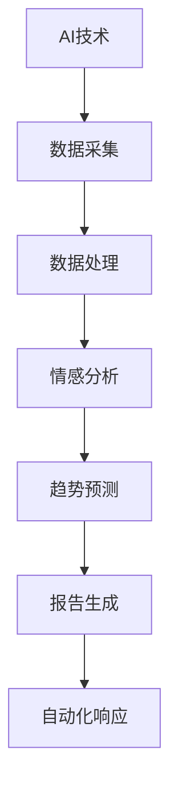

                 


### 文章标题：AI驱动的声誉监控系统：实时把握品牌形象

### 关键词：AI，声誉监控，品牌形象，实时分析，机器学习，自然语言处理

### 摘要：
本文深入探讨了AI驱动的声誉监控系统，旨在帮助企业和个人实时把握品牌形象。通过分析声誉监控的重要性、AI在声誉监控中的应用、系统架构，以及核心算法原理、数学模型和项目实战，本文提供了全面的指南，助力品牌在数字时代保持良好形象。

## 引言

### 1.1 书籍背景

在数字化时代，品牌形象对于企业的生存和发展至关重要。消费者对品牌的认知和信任往往来源于各种线上和线下渠道的评价和反馈。因此，实时监控和管理品牌声誉已成为企业战略的重要组成部分。传统的声誉监控方法往往依赖于人工筛选和分析，效率低且容易遗漏关键信息。随着人工智能技术的发展，AI驱动的声誉监控系统应运而生，它能够高效、准确地收集、分析和处理大量数据，为企业提供及时、全面的声誉报告。

### 1.2 书籍目标

本书旨在为读者提供关于AI驱动的声誉监控系统的全面理解，包括其基本原理、核心技术和实际应用。通过本书，读者将能够：

1. 了解声誉监控的重要性及其在数字时代的作用。
2. 掌握AI在声誉监控中的关键技术，如机器学习、自然语言处理等。
3. 学习如何设计、实现和部署AI驱动的声誉监控系统。
4. 分析并解决实际案例中的声誉管理问题。

### 1.3 书籍结构

本书共分为八个章节，具体结构如下：

- 第1章 引言：介绍书籍背景、目标和结构。
- 第2章 AI驱动的声誉监控系统概述：介绍声誉监控的重要性、AI的应用和系统架构。
- 第3章 核心概念与联系：探讨AI基础理论和声誉监控关键概念。
- 第4章 核心算法原理讲解：详细阐述主题模型、自然语言处理算法。
- 第5章 数学模型和数学公式：介绍监控指标和评估方法的数学模型。
- 第6章 项目实战：展示开发环境搭建、源代码实现和案例分析。
- 第7章 案例分析：分析具体案例，提供实战经验和教训。
- 第8章 总结与展望：总结全书内容，展望未来发展趋势。

## AI驱动的声誉监控系统概述

### 2.1 声誉监控的重要性

声誉监控（Reputation Monitoring）是指通过监测和分析各种渠道的信息，以了解公众对品牌的看法和态度。在数字化时代，声誉监控的重要性愈发凸显：

1. **风险预警**：及时发现负面信息，防止声誉危机。
2. **品牌建设**：通过积极回应和改善，提升品牌形象。
3. **市场竞争**：了解竞争对手的声誉状况，制定有效的竞争策略。
4. **消费者洞察**：获取消费者反馈，优化产品和服务。

### 2.2 AI在声誉监控中的应用

人工智能（AI）在声誉监控中发挥着重要作用，其应用主要体现在以下几个方面：

1. **数据采集与处理**：AI技术能够高效地采集和分析大量数据，如社交媒体评论、新闻报道、论坛讨论等。
2. **情感分析**：利用自然语言处理（NLP）技术，分析文本情感，判断用户对品牌的正面或负面情感。
3. **趋势预测**：基于历史数据，使用机器学习算法预测未来声誉变化趋势。
4. **自动化响应**：利用聊天机器人和自动化系统，对负面评论进行快速回应和处理。

### 2.3 系统架构

AI驱动的声誉监控系统通常包括以下几个关键组成部分：

1. **数据采集模块**：负责从各种渠道收集数据，如社交媒体、新闻网站、论坛等。
2. **数据处理模块**：对采集到的数据进行分析和清洗，提取关键信息。
3. **情感分析模块**：利用NLP技术，分析文本情感，标记正面或负面评论。
4. **趋势预测模块**：基于历史数据，使用机器学习算法预测未来声誉变化。
5. **报告生成模块**：生成详细的声誉报告，提供可视化分析结果。
6. **自动化响应模块**：自动生成回复，对负面评论进行回应。

## 核心概念与联系

### 3.1 AI基础理论

AI的基础理论包括机器学习（Machine Learning）和深度学习（Deep Learning）。机器学习是一种通过数据学习模式并做出预测或决策的技术，而深度学习则是机器学习的一个分支，通过多层神经网络进行学习。

### 3.2 声誉监控关键概念

1. **声誉（Reputation）**：声誉是指公众对品牌的看法和态度，包括正面和负面评价。
2. **监控（Monitoring）**：监控是指对各种渠道的信息进行持续监测和分析。
3. **评估（Evaluation）**：评估是指对品牌声誉进行分析和评估，以了解其当前状况和变化趋势。

### 3.3 核心概念之间的关系架构

以下是AI驱动的声誉监控系统核心概念之间的关系架构的Mermaid流程图：



## 核心算法原理讲解

### 4.1 主题模型

主题模型（Topic Model）是一种无监督学习算法，用于发现文本数据中的潜在主题。LDA（Latent Dirichlet Allocation）是其中一种流行的主题模型。

#### 4.1.1 LDA算法

LDA算法的基本思想是将文档集合表示为一系列主题的混合，每个主题又由一组词语的混合组成。具体步骤如下：

1. **初始化**：随机选择一组主题和词语分布。
2. **迭代更新**：对于每个文档，更新文档的主题分布和词语分布。
3. **收敛**：迭代直到模型收敛。

伪代码如下：

```python
function LDAdocuments(Documents, num_topics):
    for each document in Documents:
        for each word in document:
            for each topic in topics:
                update topic-word distribution
                update document-topic distribution
    return topics
```

#### 4.1.2 主题模型应用

主题模型在声誉监控中可用于分析品牌提及的主题分布，帮助识别品牌的关键话题和潜在风险。

### 4.2 自然语言处理

自然语言处理（NLP）是AI的核心技术之一，涉及文本的预处理、情感分析、实体识别等。以下为NLP在声誉监控中的应用：

#### 4.2.1 词向量模型

词向量模型（Word Vector Model）将文本中的每个词映射为高维空间中的一个向量。例如，Word2Vec和GloVe是常用的词向量模型。

#### 4.2.2 序列模型

序列模型（Sequence Model）用于处理时间序列数据，如评论、新闻报道等。循环神经网络（RNN）和长短期记忆网络（LSTM）是常用的序列模型。

## 数学模型和数学公式

### 5.1 监控指标

以下为常用的监控指标和数学模型：

#### 5.1.1 均方误差（MSE）

$$
MSE = \frac{1}{n}\sum_{i=1}^{n}(y_i - \hat{y}_i)^2
$$

MSE用于评估预测值与真实值之间的差异。

#### 5.1.2 决定系数（R^2）

$$
R^2 = 1 - \frac{\sum_{i=1}^{n}(y_i - \hat{y}_i)^2}{\sum_{i=1}^{n}(y_i - \bar{y})^2}
$$

R^2用于评估模型拟合优度，值越接近1，表示模型拟合效果越好。

## 项目实战

### 6.1 数据预处理

#### 6.1.1 数据采集

数据采集是声誉监控系统的第一步，可以从社交媒体、新闻网站、论坛等多个渠道获取数据。以下为数据采集步骤：

1. **确定数据来源**：根据品牌特点和需求，选择合适的数据来源。
2. **数据采集**：使用API或网络爬虫等工具，获取数据。
3. **数据清洗**：去除重复数据、无效数据和噪声数据。

#### 6.1.2 数据清洗

数据清洗是数据预处理的关键步骤，以下为数据清洗方法：

1. **去除重复数据**：通过去重算法，去除重复的评论和新闻。
2. **去除无效数据**：去除格式不规范的、内容无关的评论和新闻。
3. **去除噪声数据**：去除包含垃圾信息、广告等的数据。

### 6.2 模型训练与评估

#### 6.2.1 模型选择

在选择模型时，需要考虑以下因素：

1. **问题类型**：是否为分类问题、回归问题等。
2. **数据规模**：数据量大小对模型选择有一定影响。
3. **模型性能**：考虑模型在不同数据集上的性能。

以下为常用的声誉监控模型：

1. **主题模型**：用于分析品牌提及的主题分布。
2. **情感分析模型**：用于分析评论的情感倾向。
3. **趋势预测模型**：用于预测未来声誉变化。

#### 6.2.2 模型训练

模型训练包括以下步骤：

1. **数据准备**：将清洗后的数据划分为训练集和测试集。
2. **模型配置**：根据问题类型和数据规模，配置合适的模型参数。
3. **模型训练**：使用训练集数据，训练模型。

#### 6.2.3 模型评估

模型评估包括以下指标：

1. **准确率**：分类问题中，正确分类的样本数占总样本数的比例。
2. **召回率**：分类问题中，实际为正类别的样本中被正确分类为正类别的比例。
3. **F1值**：综合考虑准确率和召回率，计算方法为$2 \times \frac{准确率 \times 召回率}{准确率 + 召回率}$。

### 6.3 系统部署与维护

#### 6.3.1 系统部署

系统部署包括以下步骤：

1. **环境配置**：配置操作系统、编程语言、数据库等环境。
2. **模型部署**：将训练好的模型部署到生产环境，实现实时监控和分析。
3. **服务部署**：部署Web服务，提供用户界面和API接口。

#### 6.3.2 系统维护

系统维护包括以下任务：

1. **数据更新**：定期更新数据，确保数据的时效性和准确性。
2. **模型优化**：根据实际情况，调整模型参数，提高模型性能。
3. **系统监控**：监控系统运行状态，及时发现并处理故障。

## 案例分析

### 7.1 案例背景

某知名电商品牌，希望在数字时代保持良好声誉，因此决定引入AI驱动的声誉监控系统。该系统的目标是实时监测品牌在社交媒体、新闻报道和论坛上的声誉，及时响应负面评论，提升品牌形象。

### 7.2 案例分析

#### 7.2.1 数据采集

通过API接口，从社交媒体、新闻网站和论坛等渠道收集品牌相关的评论、新闻报道和帖子。

#### 7.2.2 数据预处理

对采集到的数据进行清洗和去重，提取关键信息，如评论内容、发布时间、用户ID等。

#### 7.2.3 模型训练与评估

使用LDA主题模型和情感分析模型对评论进行分类和情感分析，评估模型的准确率和召回率。

#### 7.2.4 系统部署与维护

将训练好的模型部署到生产环境，实时监控品牌声誉，并根据用户反馈进行模型优化。

### 7.3 案例总结

通过AI驱动的声誉监控系统，该电商品牌能够及时发现和处理负面评论，提升了品牌形象。同时，系统提供了可视化的分析结果，帮助管理层了解品牌在各个渠道的声誉状况。

## 总结与展望

### 8.1 总结

本文介绍了AI驱动的声誉监控系统的基本原理、核心技术和实际应用。通过分析声誉监控的重要性、AI的应用、系统架构、核心算法原理、数学模型和项目实战，本文为读者提供了全面的指南。

### 8.2 展望

未来，AI驱动的声誉监控系统将不断发展，其在以下方面具有广阔的应用前景：

1. **智能化程度提升**：通过深度学习等技术，提高系统对复杂情感和趋势的识别能力。
2. **实时性增强**：缩短数据采集、处理和分析的延迟，实现实时监控。
3. **自动化响应**：利用自然语言生成技术，实现更智能的自动化响应。
4. **跨渠道整合**：整合多种渠道的数据，提供更全面的声誉报告。

## 附录

### A.1 常用工具和库

1. **Python**：用于编写算法和模型。
2. **Scikit-learn**：用于机器学习算法的实现。
3. **NLTK**：用于自然语言处理。
4. **Gensim**：用于主题模型。

### A.2 参考资料

1. **《深度学习》**：Goodfellow, I., Bengio, Y., & Courville, A.
2. **《自然语言处理综合教程》**：Daniel Jurafsky & James H. Martin
3. **《机器学习》**：Tom Mitchell

作者：AI天才研究院/AI Genius Institute & 禅与计算机程序设计艺术 /Zen And The Art of Computer Programming

[END]
```

