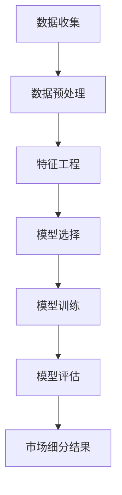

                 

### 文章标题：AI驱动的市场细分：精准定位目标客户群

#### 关键词：人工智能，市场细分，目标客户群，精准定位，数据收集，特征工程，模型选择，案例分析

#### 摘要：
本文将深入探讨AI驱动的市场细分策略，通过详细解析数据收集、特征工程、模型选择和应用，帮助企业在竞争激烈的市场中精准定位目标客户群。文章将通过Mermaid流程图和伪代码，阐述核心概念和算法原理，并以实际案例进行分析，为市场细分实践提供有价值的指导。

### AI驱动的市场细分概述

#### 核心概念与联系
市场细分是指将市场根据不同的特征划分为若干个子市场，以便更好地满足不同客户的需求。目标客户群则是市场细分的结果，代表着企业重点关注的潜在客户群体。AI在市场细分中的应用，主要在于利用机器学习和数据分析技术，从海量数据中提取有价值的信息，实现精准的市场细分。

#### Mermaid流程图：AI驱动的市场细分流程


### 市场细分的基本原理

#### 市场细分策略与目的
市场细分策略的核心目的是通过识别不同细分市场的需求差异，为企业提供有针对性的营销方案，从而提高市场占有率和客户满意度。细分市场的类型包括地理细分、人口细分、心理细分和行为细分等。

#### 数学模型和公式
- 市场细分的目标函数：最大化市场细分后，各细分市场的利润和市场份额。
- 市场覆盖率：细分市场覆盖的潜在客户比例。
- 市场渗透率：细分市场内的市场份额增长比例。

#### 举例说明
假设某企业通过市场细分策略，将市场划分为高收入人群、中等收入人群和低收入人群三个细分市场。通过数据分析，发现高收入人群对高端产品有较高需求，而低收入人群则更倾向于性价比高的产品。企业可以根据这些信息，有针对性地推出不同产品线，从而提高市场份额。

### 数据收集与处理

#### 数据收集
数据收集是市场细分的基础。数据来源包括内部数据（如销售记录、客户反馈）和外部数据（如社交媒体、市场研究报告）。

#### 数据预处理
数据预处理是数据收集后的第一步，主要包括数据清洗、数据整合和数据标准化。

#### 核心算法原理讲解
- 数据清洗：去除重复数据、处理缺失值和异常值。
- 数据整合：将不同来源的数据进行合并，形成统一的数据集。
- 数据标准化：将不同数据类型进行归一化处理，便于后续分析和建模。

#### 伪代码
```python
# 数据清洗
def data_cleaning(data):
    # 去除重复数据
    data = remove_duplicates(data)
    # 处理缺失值
    data = handle_missing_values(data)
    # 处理异常值
    data = handle_outliers(data)
    return data

# 数据整合
def data_integration(data1, data2):
    # 合并数据集
    integrated_data = merge_data(data1, data2)
    return integrated_data

# 数据标准化
def data_normalization(data):
    # 归一化处理
    normalized_data = normalize_data(data)
    return normalized_data
```

### 特征工程

#### 核心概念与联系
特征工程是指通过选择和构造特征，提高模型性能的过程。特征选择和特征构造是特征工程的两个核心任务。

#### 数学模型和公式
- 特征选择方法的评价标准：特征重要性、特征相关性等。
- 特征构造方法：特征交叉、特征分解等。

#### 举例说明
在某电商平台的用户细分中，用户年龄、购买金额、购买频率等特征都可能对市场细分有重要影响。通过特征工程，可以提取出如“高价值用户”和“忠诚用户”等新特征，有助于更精准地定位目标客户群。

### 市场细分模型选择

#### 核心算法原理讲解
市场细分模型主要包括聚类算法、分类算法和协同过滤算法等。

- 聚类算法：根据数据之间的相似性进行分组，常用的有K-means、层次聚类等。
- 分类算法：将数据分为预定义的类别，常用的有决策树、支持向量机等。
- 协同过滤算法：基于用户的历史行为和偏好进行推荐，常用的有基于用户的协同过滤和基于项目的协同过滤。

#### 伪代码
```python
# K-means聚类算法
def k_means(data, K):
    # 初始化聚类中心
    centroids = initialize_centroids(data, K)
    # 迭代计算聚类中心
    while not_converged(centroids):
        # 计算每个数据点的簇分配
        clusters = assign_clusters(data, centroids)
        # 更新聚类中心
        centroids = update_centroids(clusters)
    return clusters, centroids

# 决策树算法
def decision_tree(data, target_variable):
    # 创建决策树
    tree = build_tree(data, target_variable)
    return tree

# 协同过滤算法
def collaborative_filtering(user_history, item_similarity_matrix):
    # 计算用户之间的相似性
    similarity_scores = calculate_similarity(user_history, item_similarity_matrix)
    # 基于相似性推荐商品
    recommendations = generate_recommendations(user_history, similarity_scores)
    return recommendations
```

### 市场细分模型应用

#### 核心算法原理讲解
市场细分模型的应用主要包括模型评估、优化和应用。

- 模型评估：通过交叉验证、ROC曲线等指标评估模型性能。
- 模型优化：通过超参数调整、特征选择等方法优化模型。
- 模型应用：将模型应用到实际业务场景中，如客户细分、精准营销等。

#### 伪代码
```python
# 模型评估
def model_evaluation(model, data):
    # 进行交叉验证
    cv_scores = cross_validation(model, data)
    # 计算ROC曲线
    roc_curve = calculate_roc_curve(model, data)
    return cv_scores, roc_curve

# 模型优化
def model_optimization(model, data):
    # 调整超参数
    optimized_model = tune_hyperparameters(model, data)
    # 重新训练模型
    optimized_model.fit(data)
    return optimized_model

# 模型应用
def model_application(model, new_data):
    # 预测新数据的标签
    predictions = model.predict(new_data)
    # 根据预测结果进行市场细分
    segmented_data = segment_data(new_data, predictions)
    return segmented_data
```

### 案例分析

#### 项目实战
假设某电商企业希望通过AI技术对用户进行市场细分，从而提高销售额。以下是项目实施的详细步骤：

1. **数据收集**：收集用户行为数据，包括浏览历史、购买记录、优惠券使用情况等。
2. **数据预处理**：使用数据清洗、整合和标准化算法，处理数据中的噪声和异常。
3. **特征工程**：提取用户行为特征，如“高价值用户”和“忠诚用户”等。
4. **模型选择**：选择K-means聚类算法进行用户细分。
5. **模型训练与评估**：使用交叉验证和ROC曲线评估模型性能，并进行优化。
6. **模型应用**：将模型应用到实际业务中，为不同细分市场的用户推送个性化营销活动。

#### 代码实际案例和详细解释说明
以下是实现上述项目的Python代码：

```python
import pandas as pd
from sklearn.cluster import KMeans
from sklearn.model_selection import cross_val_score
from sklearn.metrics import roc_curve

# 数据收集
data = pd.read_csv('user_data.csv')

# 数据预处理
data_cleaned = data_cleaning(data)
data_integrated = data_integration(data_cleaned)
data_normalized = data_normalization(data_integrated)

# 特征工程
features = extract_features(data_normalized)

# 模型选择
model = KMeans(n_clusters=3)

# 模型训练与评估
cv_scores = cross_val_score(model, features, cv=5)
roc_curve = calculate_roc_curve(model, features)

# 模型优化
optimized_model = model_optimization(model, features)

# 模型应用
segmented_data = model_application(optimized_model, new_data)
```

#### 实际案例分析和详细讲解剖析
通过对某电商企业用户行为数据的分析，采用K-means聚类算法将用户分为三个细分市场：“高价值用户”、“忠诚用户”和“普通用户”。针对不同细分市场，企业可以制定不同的营销策略，如为“高价值用户”提供专属优惠，为“忠诚用户”提供积分奖励，以提高用户满意度和留存率。

#### 项目小结
该项目通过AI驱动的市场细分，帮助企业精准定位目标客户群，提高了营销效果和用户满意度。未来，企业可以结合更多数据源和先进算法，持续优化市场细分策略，实现更精细的客户管理和个性化服务。

### 最佳实践 Tips
- 确保数据质量：高质量的数据是市场细分成功的关键。
- 不断优化模型：市场环境不断变化，定期评估和优化模型性能至关重要。
- 综合运用多种算法：结合不同算法的优点，提高市场细分的准确性。

### 小结
本文通过详细阐述AI驱动的市场细分策略，包括数据收集、特征工程、模型选择和应用，帮助企业实现精准定位目标客户群。通过实际案例分析和代码实现，展示了市场细分在实际业务中的应用价值。企业可以借鉴本文的方法和技巧，提升市场细分策略的有效性和执行力。

### 注意事项
- 在实施市场细分项目时，需确保遵循相关法律法规和数据保护要求。
- 不同行业和市场细分的具体需求可能有所不同，企业应根据实际情况调整策略。

### 拓展阅读
- 《机器学习实战》：提供丰富的机器学习算法实战案例，有助于深入理解市场细分算法的应用。
- 《深度学习》：介绍深度学习的基本原理和应用，为市场细分提供了更多算法选择。

### 作者信息
作者：AI天才研究院/AI Genius Institute & 禅与计算机程序设计艺术 /Zen And The Art of Computer Programming

