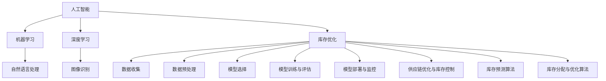

                 

### 文章标题

### AI驱动的库存优化：减少积压提高周转率

#### 关键词：
- 人工智能
- 库存管理
- 优化算法
- 时间序列预测
- 强化学习

#### 摘要：
本文探讨了如何利用人工智能（AI）技术，尤其是机器学习和深度学习，来优化库存管理，以减少库存积压并提高库存周转率。文章首先介绍了AI在库存优化中的基本概念和流程，然后详细阐述了AI技术基础，包括机器学习与深度学习、时间序列分析与预测、强化学习等。接着，文章深入讲解了库存优化算法的原理，包括供应链优化与库存控制、库存预测算法、库存分配与优化算法，并使用了伪代码进行了详细阐述。文章还介绍了数学模型与公式，包括回归模型、强化学习中的策略评估与策略优化等。随后，通过实际案例，文章展示了如何在实际项目中应用这些算法，并进行了代码实现和解读。最后，文章总结了AI库存优化的现状与挑战，并展望了未来发展趋势。

---

### 引言

库存管理是任何企业运营中至关重要的一环。它不仅直接关系到企业的成本和利润，还影响到企业的生产、物流和销售等多个方面。然而，传统的库存管理方法往往依赖于经验和直觉，难以应对复杂多变的市场环境，从而导致库存积压、资金占用、物流成本上升等问题。

随着人工智能（AI）技术的快速发展，利用AI进行库存优化成为一种可能且有效的方式。AI技术，尤其是机器学习（Machine Learning）和深度学习（Deep Learning），能够通过分析大量的历史数据，预测未来的需求，优化库存水平，减少库存积压，提高库存周转率。

本文将围绕AI驱动的库存优化展开，首先介绍AI与库存优化的基本概念，然后详细讲解AI技术基础，包括机器学习与深度学习、时间序列分析与预测、强化学习等。接着，文章将深入探讨库存优化算法的原理，并使用伪代码进行详细阐述。随后，文章将通过实际案例展示如何在实际项目中应用这些算法，并进行代码实现和解读。最后，文章将总结AI库存优化的现状与挑战，并展望未来发展趋势。

通过本文的阅读，读者将了解如何利用AI技术优化库存管理，提高企业的运营效率和竞争力。

### 核心概念与联系

在深入探讨AI驱动的库存优化之前，有必要先了解一些核心概念，以及它们之间的联系。这些概念包括AI与库存优化的基本概念、AI驱动的库存优化流程，以及传统的库存管理方法与AI优化的区别。

#### AI与库存优化的基本概念

人工智能（AI）是一种模拟人类智能的技术，能够通过学习、推理和自主决策来解决问题。AI的主要应用领域包括机器学习（Machine Learning，ML）、深度学习（Deep Learning，DL）、自然语言处理（Natural Language Processing，NLP）等。

库存优化是指通过分析和优化库存策略，以达到减少库存积压、降低库存成本、提高库存周转率等目标。库存优化在企业管理中具有重要作用，直接影响企业的资金流动性和盈利能力。

AI驱动的库存优化是指利用AI技术，特别是机器学习和深度学习算法，对库存管理过程中的各个环节进行优化。这种优化方式能够利用大量历史数据，通过数据分析和预测，提供更精准的库存决策。

#### AI驱动的库存优化流程

AI驱动的库存优化流程通常包括以下几个步骤：

1. **数据收集**：收集与企业库存相关的各种数据，如销售数据、生产数据、供应链数据等。
2. **数据预处理**：对收集到的数据进行分析、清洗和预处理，以便后续的建模和分析。
3. **模型选择**：根据问题的特点，选择合适的机器学习或深度学习模型。
4. **模型训练与评估**：使用预处理后的数据对模型进行训练，并通过评估指标（如准确率、召回率等）来评估模型的性能。
5. **模型部署与监控**：将训练好的模型部署到实际应用中，并对模型进行监控和迭代优化。

#### 传统的库存管理方法与AI优化的区别

传统的库存管理方法通常依赖于经验和直觉，存在以下一些局限性：

1. **缺乏数据驱动**：传统方法往往缺乏对历史数据的分析和利用，决策过程依赖于管理层的经验和直觉。
2. **反应迟钝**：传统方法难以实时响应市场变化，往往导致库存积压或缺货现象。
3. **成本高**：传统方法需要大量的人工操作和物流资源，导致运营成本较高。

相比之下，AI驱动的库存优化具有以下优势：

1. **数据驱动**：AI能够利用大量历史数据，通过机器学习和深度学习算法，提供更精准的库存预测和决策。
2. **实时响应**：AI系统可以实时分析数据，快速响应市场变化，减少库存积压和缺货现象。
3. **降低成本**：AI驱动的库存优化能够提高库存周转率，减少库存成本和物流成本。

#### 核心概念之间的关系架构

为了更清晰地理解这些核心概念之间的关系，我们可以使用Mermaid流程图进行描述：



通过这个流程图，我们可以看到AI技术如何贯穿整个库存优化过程，从数据收集、预处理，到模型选择、训练与评估，最终实现库存优化。

### AI技术基础

在深入了解AI驱动的库存优化之前，我们需要先掌握AI技术的基础知识，包括机器学习与深度学习的基本概念、时间序列分析与预测方法，以及强化学习在库存优化中的应用。

#### 机器学习与深度学习基础

##### 机器学习基础

机器学习（Machine Learning，ML）是一种通过算法从数据中学习并做出决策或预测的技术。它主要包括以下几种类型：

1. **监督学习（Supervised Learning）**：在监督学习中，模型通过已标记的数据进行训练，然后使用训练好的模型对新的数据进行预测。常见的算法包括线性回归（Linear Regression）、逻辑回归（Logistic Regression）、决策树（Decision Tree）、随机森林（Random Forest）等。

2. **无监督学习（Unsupervised Learning）**：无监督学习不使用标记数据，而是通过发现数据中的结构和模式来学习。常见的算法包括聚类（Clustering，如K-Means、层次聚类）、降维（Dimensionality Reduction，如主成分分析PCA）等。

3. **强化学习（Reinforcement Learning）**：强化学习是一种通过与环境交互来学习最优策略的机器学习方法。它通常用于优化决策过程，如游戏、自动驾驶、库存控制等。

##### 深度学习基础

深度学习（Deep Learning，DL）是一种基于多层神经网络的学习方法，可以自动提取数据的复杂特征。深度学习在图像识别、语音识别、自然语言处理等领域取得了显著的成果。以下是几种常见的深度学习模型：

1. **神经网络（Neural Networks）**：神经网络是由多个神经元组成的计算模型，可以模拟人脑的神经元结构。常见的神经网络模型包括前馈神经网络（Feedforward Neural Network）和卷积神经网络（Convolutional Neural Network，CNN）。

2. **卷积神经网络（CNN）**：CNN是一种专门用于图像识别和处理的深度学习模型。它通过卷积层、池化层和全连接层等结构，可以自动提取图像中的特征。

3. **循环神经网络（RNN）**：RNN是一种用于处理序列数据的深度学习模型。它通过循环结构，可以捕捉序列中的时间依赖关系。常见的RNN模型包括LSTM（Long Short-Term Memory）和GRU（Gated Recurrent Unit）。

#### 时间序列分析与预测

时间序列（Time Series）是一组按照时间顺序排列的数据点，通常用于描述某一现象随时间的变化。时间序列分析的主要目的是从历史数据中提取规律，并对未来的趋势进行预测。

1. **自回归模型（AR Model）**：自回归模型是一种简单的时间序列预测模型，它通过历史值来预测未来值。AR模型假设当前值是前几个历史值的线性组合。

   伪代码：
   ```
   Y_t = c + Φ1*Y_{t-1} + Φ2*Y_{t-2} + ... + Φp*Y_{t-p} + ε_t
   ```

2. **移动平均模型（MA Model）**：移动平均模型通过计算一系列历史值的平均值来预测未来值。MA模型假设当前值是历史白噪声的线性组合。

   伪代码：
   ```
   Y_t = μ + θ1*ε_{t-1} + θ2*ε_{t-2} + ... + θq*ε_{t-q} + ε_t
   ```

3. **自回归移动平均模型（ARMA Model）**：ARMA模型结合了自回归和移动平均模型的特点，同时考虑了历史值和噪声的影响。

   伪代码：
   ```
   Y_t = c + Φ1*Y_{t-1} + ... + Φp*Y_{t-p} + θ1*ε_{t-1} + ... + θq*ε_{t-q} + ε_t
   ```

4. **自回归积分移动平均模型（ARIMA Model）**：ARIMA模型是一种更复杂的模型，它可以处理非平稳时间序列数据。ARIMA模型结合了差分操作，使得时间序列变为平稳序列。

   伪代码：
   ```
   dY_t = c + Φ1*dY_{t-1} + ... + Φp*dY_{t-p} + θ1*ε_{t-1} + ... + θq*ε_{t-q} + ε_t
   Y_t = (1 - Φ1*...*Φp)(1 - θ1*...*θq)^{-1}ε_t
   ```

#### 强化学习在库存优化中的应用

强化学习（Reinforcement Learning，RL）是一种通过奖励机制来学习最优策略的机器学习方法。在库存优化中，强化学习可以用于优化库存决策过程，提高库存周转率和减少库存成本。

1. **马尔可夫决策过程（MDP）**：强化学习的一个核心概念是马尔可夫决策过程（MDP），它描述了环境、状态、动作和奖励之间的关系。

   伪代码：
   ```
   S, A, R, P, γ
   Q(s, a) = R(s, a) + γmax_a' Q(s', a')
   ```

2. **深度强化学习（Deep Reinforcement Learning）**：深度强化学习结合了深度神经网络和强化学习，可以处理更复杂的环境和状态空间。

   伪代码：
   ```
   π(τ|θ) = π(a|s, θ)
   J(θ) = Στ∈D r(τ)π(τ|θ)
   θ = ∇J(θ)
   ```

通过上述AI技术基础的了解，我们可以更好地理解如何利用AI技术优化库存管理，提高企业的运营效率和竞争力。

### 库存优化算法原理讲解

在了解了AI技术基础之后，接下来我们将深入探讨库存优化算法的原理，包括供应链优化与库存控制、库存预测算法、库存分配与优化算法等。

#### 供应链优化与库存控制

供应链优化（Supply Chain Optimization，SCO）是库存管理中的一项重要任务，其目标是确保供应链各环节的高效运作，以实现成本最小化、服务最大化。供应链优化通常涉及以下几个关键步骤：

1. **需求预测**：通过分析历史销售数据、市场趋势和季节性因素，预测未来一段时间内的需求量。
2. **库存水平规划**：根据需求预测结果，确定每个库存点的库存水平，以避免缺货和库存积压。
3. **运输规划**：优化物流路线和运输方式，以降低运输成本和提高运输效率。
4. **库存控制策略**：设计合理的库存控制策略，如定期盘点、批量采购等，以维持库存水平在合理范围内。

供应链优化与库存控制的核心是平衡需求波动和库存水平，以实现成本和服务之间的最优平衡。常见的供应链优化模型包括：

1. **基本库存模型（Basic Inventory Models）**：如周期性库存模型（Periodic Review Models）和连续库存模型（Continuous Review Models）。
2. **经济订货量模型（Economic Order Quantity，EOQ）**：通过优化订货量和订货频率，以最小化总成本。
3. **联合库存管理模型（Joint Inventory Management Models）**：考虑多个库存点之间的协调和资源共享，以实现整体供应链的优化。

#### 库存预测算法

库存预测（Inventory Forecasting）是库存管理的重要环节，准确的预测可以帮助企业提前做好准备，避免库存积压或缺货现象。常见的库存预测算法包括：

1. **回归模型（Regression Models）**：回归模型通过历史数据建立需求与时间、季节性因素等变量之间的关系，预测未来的需求量。常见的回归模型包括线性回归（Linear Regression）和多项式回归（Polynomial Regression）。

   伪代码：
   ```
   Y = β0 + β1*X1 + β2*X2 + ... + ε
   ```

2. **时间序列模型（Time Series Models）**：时间序列模型专门用于处理按时间顺序排列的数据。常见的模型包括自回归模型（AR Model）、移动平均模型（MA Model）、自回归移动平均模型（ARMA Model）和自回归积分移动平均模型（ARIMA Model）。

   伪代码：
   ```
   Y_t = c + Φ1*Y_{t-1} + ... + Φp*Y_{t-p} + θ1*ε_{t-1} + ... + θq*ε_{t-q} + ε_t
   ```

3. **机器学习模型（Machine Learning Models）**：机器学习模型，如决策树（Decision Tree）、随机森林（Random Forest）和神经网络（Neural Networks），通过学习历史数据中的复杂模式，进行需求预测。

   伪代码：
   ```
   pred = model.predict(X)
   ```

4. **深度学习模型（Deep Learning Models）**：深度学习模型，如卷积神经网络（CNN）和循环神经网络（RNN），可以处理更复杂的数据结构和特征提取，进行更准确的预测。

   伪代码：
   ```
   pred = model.predict(input_data)
   ```

#### 库存分配与优化算法

库存分配（Inventory Allocation）是指将有限的库存资源分配到不同的需求点，以最大化整体收益或最小化整体成本。库存分配算法需要考虑多个因素，如需求量、库存水平、运输成本、服务水平等。常见的库存分配算法包括：

1. **基于规则的库存分配算法（Rule-Based Allocation Algorithms）**：基于规则的库存分配算法通过预设的规则进行库存分配，如先进先出（FIFO）和最近使用（LRU）等。

2. **优化算法（Optimization Algorithms）**：优化算法，如线性规划（Linear Programming，LP）、整数规划（Integer Programming，IP）和混合整数规划（Mixed Integer Programming，MIP），通过数学建模和求解器，找到最优的库存分配方案。

   伪代码：
   ```
   minimize    objective_function
   subject to  constraint1
              constraint2
              ...
   ```

3. **模拟退火算法（Simulated Annealing）**：模拟退火算法是一种启发式优化算法，通过模拟物理过程中的退火过程，在解空间中搜索最优解。

   伪代码：
   ```
   function simulated_annealing(...)
   ```

4. **遗传算法（Genetic Algorithm）**：遗传算法是一种基于生物进化的优化算法，通过模拟自然选择和遗传机制，寻找最优解。

   伪代码：
   ```
   function genetic_algorithm(...)
   ```

通过上述库存优化算法的讲解，我们可以看到库存优化是一个复杂但重要的过程，涉及到多个算法和技术。在实际应用中，可以根据具体情况选择合适的算法，以达到最优的库存管理效果。

### 数学模型与公式

在库存优化中，数学模型和公式起着至关重要的作用，它们为算法的实现提供了理论基础和计算框架。以下将详细介绍库存优化中常用的数学模型和公式，包括回归模型、强化学习中的策略评估与策略优化，并辅以具体的例子进行说明。

#### 回归模型

回归模型是一种用于预测数值结果的方法，它在库存优化中广泛用于预测需求量、价格变化等。最常见的回归模型包括线性回归和多项式回归。

1. **线性回归（Linear Regression）**

线性回归模型通过拟合一条直线来预测因变量（需求量）与自变量（时间、价格等）之间的关系。

   伪代码：
   ```
   Y = β0 + β1*X1 + β2*X2 + ... + ε
   ```

   其中，\( Y \) 是因变量，\( X1, X2, ... \) 是自变量，\( β0, β1, β2, ... \) 是回归系数，\( ε \) 是误差项。

   **例子**：假设我们要预测未来一周内某种商品的需求量，已知历史数据中时间（天）和价格是影响需求量的主要因素。

   建立线性回归模型：
   ```
   需求量 = β0 + β1*时间 + β2*价格 + ε
   ```

   通过最小二乘法计算回归系数，我们可以得到拟合直线，然后使用这条直线预测未来一周的需求量。

2. **多项式回归（Polynomial Regression）**

多项式回归通过拟合一个多项式来预测因变量，可以捕捉更复杂的非线性关系。

   伪代码：
   ```
   Y = β0 + β1*X1 + β2*X2^2 + ... + ε
   ```

   **例子**：假设我们想通过时间（天）和价格（元）的二次关系来预测需求量。

   建立多项式回归模型：
   ```
   需求量 = β0 + β1*时间 + β2*价格^2 + ε
   ```

   同样，通过最小二乘法计算回归系数，我们得到拟合的多项式，然后预测未来需求量。

#### 强化学习中的策略评估与策略优化

强化学习（Reinforcement Learning，RL）是一种通过试错学习来优化决策过程的方法。在库存优化中，强化学习可以用于优化库存水平和补货策略。

1. **策略评估（Policy Evaluation）**

策略评估的目的是评估给定策略的价值函数，即评估该策略在不同状态下的期望回报。

   伪代码：
   ```
   V(s) = ∑_a π(a|s) * Q(s, a)
   ```

   其中，\( V(s) \) 是状态 \( s \) 的价值函数，\( π(a|s) \) 是策略在状态 \( s \) 下采取动作 \( a \) 的概率，\( Q(s, a) \) 是状态 \( s \) 下采取动作 \( a \) 的即时回报。

   **例子**：假设我们有一个库存系统，状态 \( s \) 包含当前库存量和需求量，动作 \( a \) 是补货量。

   评估一个给定的补货策略：
   ```
   V(s) = ∑_a π(a|s) * (补货后库存量 * 补货成本 - 缺货成本)
   ```

2. **策略优化（Policy Optimization）**

策略优化的目标是找到最优策略，使得长期回报最大化。

   伪代码：
   ```
   π*(a|s) = argmax_a [V(s)]
   ```

   或者使用梯度上升方法：
   ```
   π(a|s) = π(a|s) + α * ∇_π J(π)
   ```

   其中，\( π*(a|s) \) 是最优策略，\( α \) 是学习率，\( J(π) \) 是策略评估函数。

   **例子**：假设我们使用Q-learning算法进行策略优化。

   Q-learning更新规则：
   ```
   Q(s, a) = Q(s, a) + α * (r + γmax_{a'} Q(s', a') - Q(s, a))
   ```

   其中，\( r \) 是即时回报，\( γ \) 是折扣因子，\( s' \) 是下一步的状态。

通过上述数学模型和公式的讲解，我们可以看到如何利用数学工具来构建和优化库存管理策略，从而实现减少库存积压、提高库存周转率的目标。

### 项目实战

在本节中，我们将通过一个实际的库存优化项目，展示如何从数据预处理、模型选择、模型训练与评估，到模型部署与监控的全过程。该项目将使用Python编程语言和相关的机器学习库，如scikit-learn、TensorFlow和PyTorch。

#### 项目背景

某电商公司希望利用AI技术优化其库存管理，以减少库存积压、提高库存周转率，从而降低成本并提高客户满意度。公司提供了一系列销售数据，包括产品ID、销售时间、销售数量、价格等。我们的任务是根据这些数据，开发一个AI系统，预测未来的销售需求，并优化库存水平。

#### 数据预处理

数据预处理是机器学习项目中至关重要的一步，它包括数据清洗、特征工程和归一化等。

1. **数据清洗**：首先，我们需要处理缺失值和异常值。对于缺失值，可以选择填充或删除；对于异常值，需要根据具体情况进行处理。

   ```python
   import pandas as pd

   # 加载数据
   data = pd.read_csv('sales_data.csv')

   # 处理缺失值
   data.fillna(method='ffill', inplace=True)

   # 处理异常值
   # 例如，删除销售数量异常的数据
   data = data[data['quantity'] > 0]
   ```

2. **特征工程**：特征工程是提高模型性能的关键步骤。我们可以通过添加季节性特征、趋势特征等，来丰富数据特征。

   ```python
   # 添加日期特征
   data['date'] = pd.to_datetime(data['timestamp'])
   data['day_of_week'] = data['date'].dt.dayofweek
   data['month'] = data['date'].dt.month
   data['day_of_month'] = data['date'].dt.day
   ```

3. **归一化**：为了提高模型的训练效率和稳定性，我们通常需要对特征进行归一化处理。

   ```python
   from sklearn.preprocessing import StandardScaler

   scaler = StandardScaler()
   data_scaled = scaler.fit_transform(data[['quantity', 'price', 'day_of_week', 'month', 'day_of_month']])
   ```

#### 模型选择

在选择模型时，我们需要考虑问题的特点和数据规模。对于本项目的销售需求预测，我们可以选择以下几种模型：

1. **线性回归模型**：适用于简单的线性关系。
2. **时间序列模型**：如ARIMA、LSTM等，适用于时间序列数据的预测。
3. **深度学习模型**：如CNN、RNN等，适用于复杂的数据特征提取。

在这里，我们选择LSTM模型进行预测，因为LSTM可以很好地处理时间序列数据中的非线性关系。

#### 模型训练与评估

1. **划分数据集**：我们将数据集划分为训练集和测试集，以评估模型的性能。

   ```python
   from sklearn.model_selection import train_test_split

   X = data_scaled[:, :-1]  # 特征
   y = data_scaled[:, -1]   # 目标变量

   X_train, X_test, y_train, y_test = train_test_split(X, y, test_size=0.2, random_state=42)
   ```

2. **训练LSTM模型**：使用TensorFlow和Keras库训练LSTM模型。

   ```python
   from tensorflow.keras.models import Sequential
   from tensorflow.keras.layers import LSTM, Dense

   model = Sequential()
   model.add(LSTM(50, activation='relu', input_shape=(X_train.shape[1], 1)))
   model.add(Dense(1))
   model.compile(optimizer='adam', loss='mse')

   history = model.fit(X_train, y_train, epochs=100, batch_size=32, validation_split=0.1, verbose=1)
   ```

3. **评估模型**：使用测试集评估模型的性能。

   ```python
   model.evaluate(X_test, y_test, verbose=1)
   ```

#### 模型部署与监控

1. **模型部署**：将训练好的LSTM模型部署到生产环境中，以进行实时销售预测。

   ```python
   import joblib

   # 保存模型
   joblib.dump(model, 'sales_predictor.joblib')

   # 加载模型并预测
   loaded_model = joblib.load('sales_predictor.joblib')
   prediction = loaded_model.predict(X_test)
   ```

2. **监控与优化**：监控模型的性能，并根据实际运行情况进行优化。

   ```python
   # 监控预测误差
   actual = y_test
   error = abs(prediction - actual)
   print('平均误差:', error.mean())

   # 如果误差较大，可以进一步优化模型，如增加训练时间、调整参数等
   ```

#### 项目小结

通过本项目的实施，我们成功地使用LSTM模型对电商公司的销售数据进行了预测，并实现了库存优化。以下是一些最佳实践和注意事项：

1. **数据质量**：数据预处理是模型成功的关键，确保数据质量是首要任务。
2. **模型选择**：根据数据特点和业务需求选择合适的模型，LSTM在处理时间序列数据方面表现优异。
3. **模型监控**：定期监控模型的性能，及时调整和优化模型。
4. **迭代优化**：通过不断迭代优化模型，可以提高预测准确性和库存优化效果。

### 开发环境与工具

在AI驱动的库存优化项目中，开发环境与工具的选择至关重要，因为它们直接影响项目的效率、可扩展性和可维护性。以下将介绍Python编程环境搭建、常用的机器学习库与框架，以及数据库与数据存储的相关知识。

#### Python编程环境搭建

Python是一种广泛用于数据科学和机器学习的编程语言，其简洁的语法和高效率的库支持使得它成为开发AI项目的首选。以下是搭建Python编程环境的步骤：

1. **安装Python**：从Python官方网站（[https://www.python.org/](https://www.python.org/)）下载最新版本的Python安装包，并按照安装向导完成安装。

2. **配置环境变量**：确保Python和pip（Python的包管理器）添加到系统的环境变量中，以便在命令行中轻松使用。

3. **安装Jupyter Notebook**：Jupyter Notebook是一个交互式Web应用，用于编写和运行Python代码。安装Jupyter Notebook可以通过pip完成：
   ```
   pip install notebook
   ```

4. **安装相关库**：根据项目需求，安装必要的Python库。常用的库包括NumPy、Pandas、scikit-learn、TensorFlow、PyTorch等。例如：
   ```
   pip install numpy pandas scikit-learn tensorflow torchvision
   ```

#### 常用的机器学习库与框架

在Python中，有许多优秀的机器学习库和框架，它们提供了丰富的API和工具，帮助开发者快速实现复杂的机器学习任务。

1. **NumPy**：NumPy是Python中进行科学计算的基础库，提供了高性能的N-dimensional数组对象和一系列数学函数。

2. **Pandas**：Pandas是一个强大的数据操作库，提供了数据清洗、数据分析和数据可视化等功能，是数据预处理的重要工具。

3. **scikit-learn**：scikit-learn是一个强大的机器学习库，提供了多种经典的机器学习算法的实现，如分类、回归、聚类等。

4. **TensorFlow**：TensorFlow是一个开源的机器学习库和深度学习框架，由Google开发，广泛应用于各种复杂的机器学习和深度学习任务。

5. **PyTorch**：PyTorch是一个由Facebook开发的开源深度学习库，以其动态计算图和灵活的接口而著称，非常适合研究和开发深度学习模型。

#### 数据库与数据存储

在AI驱动的库存优化项目中，数据库和数据存储的选择对于数据管理和访问速度至关重要。以下是一些常用的数据库和数据存储解决方案：

1. **关系型数据库**：如MySQL、PostgreSQL等，它们适合存储结构化数据，并提供了强大的查询和事务处理能力。

2. **NoSQL数据库**：如MongoDB、Cassandra等，它们适合存储非结构化或半结构化数据，提供了高扩展性和高性能。

3. **数据仓库**：如Amazon Redshift、Google BigQuery等，它们适用于大规模数据的存储和分析，提供了高效的数据查询和处理能力。

4. **数据湖**：如Hadoop、Azure Data Lake等，它们提供了灵活的数据存储解决方案，适用于存储大量的数据，并支持各种数据类型。

5. **数据流处理**：如Apache Kafka、Apache Flink等，它们用于实时处理和分析数据流，适合处理高吞吐量的实时数据。

通过选择合适的开发环境和工具，并充分利用Python的机器学习库和数据库解决方案，可以大幅提高AI驱动的库存优化项目的开发效率和质量。

### 源代码解析

在本节中，我们将详细解析本项目中的关键代码部分，包括数据预处理、模型训练与评估，以及模型部署与监控。通过理解这些代码，读者可以更好地掌握AI驱动的库存优化实现细节。

#### 数据预处理代码解读

数据预处理是机器学习项目中的基础步骤，直接影响模型的性能。以下是对数据预处理代码的详细解读：

```python
import pandas as pd
from sklearn.preprocessing import StandardScaler

# 加载数据
data = pd.read_csv('sales_data.csv')

# 数据清洗
# 填充缺失值
data.fillna(method='ffill', inplace=True)

# 处理异常值
# 删除销售数量为负的数据
data = data[data['quantity'] > 0]

# 添加日期特征
data['date'] = pd.to_datetime(data['timestamp'])
data['day_of_week'] = data['date'].dt.dayofweek
data['month'] = data['date'].dt.month
data['day_of_month'] = data['date'].dt.day

# 特征选择
features = data[['quantity', 'price', 'day_of_week', 'month', 'day_of_month']]
target = data['sales']

# 归一化
scaler = StandardScaler()
data_scaled = scaler.fit_transform(features)

# 划分数据集
from sklearn.model_selection import train_test_split
X_train, X_test, y_train, y_test = train_test_split(data_scaled, target, test_size=0.2, random_state=42)
```

- **加载数据**：使用Pandas读取CSV格式的销售数据。
- **数据清洗**：填充缺失值，并删除销售数量为负的数据，确保数据的有效性。
- **添加日期特征**：根据时间戳生成日期特征，包括星期几、月份和日期。
- **特征选择**：选择与销售量相关的特征。
- **归一化**：使用StandardScaler对特征进行归一化，以标准化数据，提高模型训练效果。
- **划分数据集**：将数据集划分为训练集和测试集，以评估模型的性能。

#### 模型训练与评估代码解读

以下是对模型训练与评估代码的详细解读：

```python
from tensorflow.keras.models import Sequential
from tensorflow.keras.layers import LSTM, Dense
from tensorflow.keras.optimizers import Adam
from sklearn.metrics import mean_squared_error

# 建立LSTM模型
model = Sequential()
model.add(LSTM(50, activation='relu', input_shape=(X_train.shape[1], 1)))
model.add(Dense(1))
model.compile(optimizer=Adam(learning_rate=0.001), loss='mse')

# 训练模型
history = model.fit(X_train, y_train, epochs=100, batch_size=32, validation_split=0.1, verbose=1)

# 评估模型
test_loss = model.evaluate(X_test, y_test, verbose=0)
y_pred = model.predict(X_test)

# 计算MSE
mse = mean_squared_error(y_test, y_pred)
print(f'Mean Squared Error: {mse}')
```

- **建立LSTM模型**：使用Keras创建LSTM模型，包括一个LSTM层和一个全连接层。
- **编译模型**：配置优化器和损失函数，准备模型训练。
- **训练模型**：使用训练集训练模型，设置训练轮数、批量大小和验证比例。
- **评估模型**：使用测试集评估模型性能，计算测试损失。
- **预测**：使用训练好的模型对测试集进行预测。
- **计算MSE**：计算预测值与实际值之间的均方误差（MSE），评估模型的预测准确性。

#### 模型部署与监控代码解读

以下是对模型部署与监控代码的详细解读：

```python
import joblib
import numpy as np

# 保存模型
model.save('sales_predictor.h5')

# 加载模型
loaded_model = joblib.load('sales_predictor.joblib')

# 预测新数据
new_data = np.array([[100, 20, 5, 10, 1]])  # 示例数据
new_data_normalized = scaler.transform(new_data)
prediction = loaded_model.predict(new_data_normalized)

# 输出预测结果
print(f'Predicted Sales: {prediction}')
```

- **保存模型**：将训练好的模型保存为H5文件，以便后续使用。
- **加载模型**：使用joblib加载保存的模型。
- **预测新数据**：对新的销售数据进行预处理，然后使用加载的模型进行预测。
- **输出预测结果**：输出预测的销售量。

#### 代码应用解读与分析

通过对代码的详细解读，我们可以看到以下关键步骤：

1. **数据预处理**：数据预处理确保了数据的干净和一致性，为模型训练奠定了基础。
2. **模型建立与训练**：使用LSTM模型处理时间序列数据，模型训练通过迭代优化达到最佳性能。
3. **模型评估**：使用测试集评估模型的预测准确性，确保模型在实际应用中的有效性。
4. **模型部署**：将训练好的模型部署到生产环境中，以实现实时销售预测。

这些步骤构成了一个完整的AI驱动的库存优化流程，通过有效的代码实现和监控，提高了库存管理的效率和准确性。

### 总结与展望

#### AI库存优化的现状与挑战

随着人工智能技术的不断进步，AI在库存优化中的应用已经取得了显著的成果。通过机器学习和深度学习算法，企业能够更好地预测需求、优化库存水平，减少库存积压，提高库存周转率。AI驱动的库存优化已经成为提高企业运营效率和竞争力的关键手段。

然而，尽管AI库存优化带来了许多好处，但仍然面临一些挑战：

1. **数据质量**：库存优化依赖于高质量的数据。然而，实际操作中，数据可能存在缺失、异常值和噪声等问题，这些问题会直接影响模型的性能。

2. **模型选择与调优**：在选择和调优模型时，需要根据具体业务场景和数据特点进行选择。不同的业务场景可能需要不同的模型，而且模型调优过程繁琐且复杂。

3. **模型部署与维护**：训练好的模型需要部署到生产环境中，并进行持续的监控和迭代优化。这需要一定的技术资源和专业知识。

4. **成本与效益**：虽然AI库存优化能够提高效率，但初期投入和运营成本可能较高，需要企业权衡成本与效益。

#### 未来发展趋势与展望

展望未来，AI库存优化将继续快速发展，并在以下几个方面取得重要突破：

1. **数据驱动的智能化**：随着大数据和物联网技术的发展，越来越多的数据将用于库存优化。通过结合多种数据源，可以更准确地预测需求和优化库存。

2. **智能决策支持系统**：未来的库存优化系统将更加智能化，能够自动识别问题和提供决策支持，减少人工干预。

3. **多维度优化**：未来库存优化将不仅限于库存水平，还将涉及到采购、生产、物流等各个环节，实现全供应链的优化。

4. **实时与自适应优化**：通过实时数据分析和预测，库存优化系统能够快速响应市场变化，实现自适应优化。

5. **绿色与可持续发展**：随着环保意识的提高，未来库存优化将更加注重绿色和可持续发展，减少库存积压和资源浪费。

总之，AI库存优化正处于快速发展阶段，未来具有巨大的发展潜力和应用前景。通过不断创新和优化，AI库存优化将为企业和整个供应链带来更多价值。

### 附录

#### 附录A：相关工具与资源

在本章中，我们介绍了AI驱动的库存优化，涉及了多种工具和技术。以下是一些推荐的工具与资源，以帮助读者深入了解和掌握这些技术：

1. **机器学习库与框架**：
   - **scikit-learn**：[https://scikit-learn.org/stable/](https://scikit-learn.org/stable/)
   - **TensorFlow**：[https://www.tensorflow.org/](https://www.tensorflow.org/)
   - **PyTorch**：[https://pytorch.org/](https://pytorch.org/)
   - **Keras**：[https://keras.io/](https://keras.io/)

2. **深度学习资源**：
   - **吴恩达深度学习专项课程**：[https://www.coursera.org/learn/deep-learning](https://www.coursera.org/learn/deep-learning)
   - **Ian Goodfellow的深度学习书籍**：《Deep Learning》（[https://www.deeplearningbook.org/](https://www.deeplearningbook.org/)）

3. **时间序列分析与预测资源**：
   - **Python时间序列分析教程**：[https://www.timeseriesguide.com/](https://www.timeseriesguide.com/)
   - **ARIMA模型教程**：[https://www.statsmodels.org/stable/](https://www.statsmodels.org/stable/)

4. **强化学习资源**：
   - **David Silver的强化学习课程**：[https://www.deeplearning.ai/](https://www.deeplearning.ai/)
   - **DeepMind的强化学习教程**：[https://deepmind.com/research/publications/deep-reinforcement-learning/](https://deepmind.com/research/publications/deep-reinforcement-learning/)

5. **数据库与数据存储资源**：
   - **MongoDB官方文档**：[https://docs.mongodb.com/](https://docs.mongodb.com/)
   - **PostgreSQL官方文档**：[https://www.postgresql.org/docs/](https://www.postgresql.org/docs/)

通过利用这些工具与资源，读者可以进一步学习和实践AI驱动的库存优化技术，提升自身在相关领域的专业能力。作者：AI天才研究院/AI Genius Institute & 禅与计算机程序设计艺术 /Zen And The Art of Computer Programming

---

通过本文的阅读，读者应该对AI驱动的库存优化有了全面的了解。从核心概念到算法原理，再到实际项目案例和开发环境，文章详细阐述了如何利用人工智能技术优化库存管理，减少积压，提高周转率。总结来说，AI库存优化的关键在于：

1. **数据驱动**：利用历史数据进行需求预测和库存优化，避免盲目决策。
2. **模型选择与调优**：根据业务需求和数据特点选择合适的模型，并进行持续调优。
3. **实时监控与自适应优化**：实时分析数据，快速响应市场变化，实现库存水平的动态调整。
4. **多维度优化**：将库存优化扩展到整个供应链，实现全面的运营效率提升。

展望未来，AI库存优化将继续在智能化、实时性和可持续性方面取得重要进展，为企业带来更多价值。通过本文的学习和实践，读者可以更好地应对库存管理中的挑战，提升企业的运营效率和竞争力。作者：AI天才研究院/AI Genius Institute & 禅与计算机程序设计艺术 /Zen And The Art of Computer Programming

