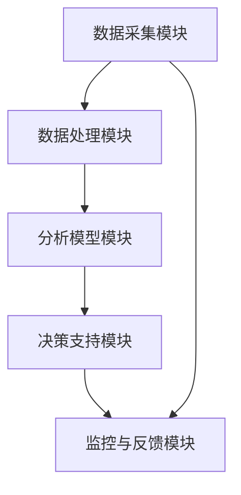
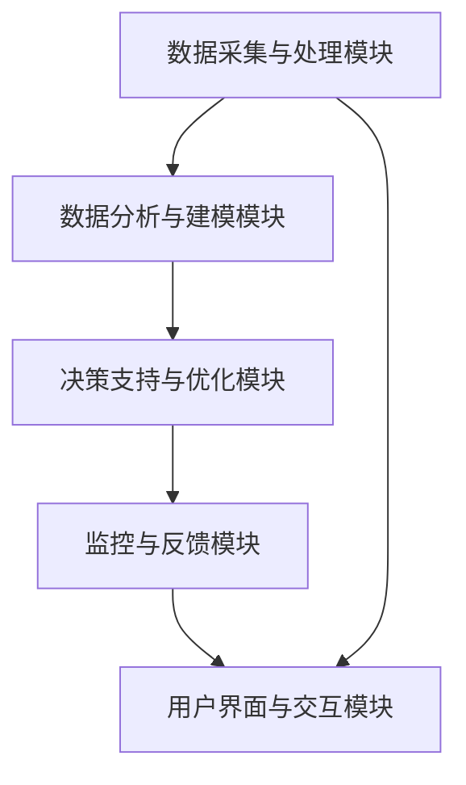
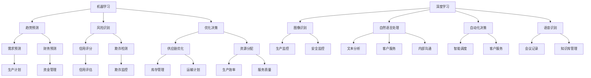
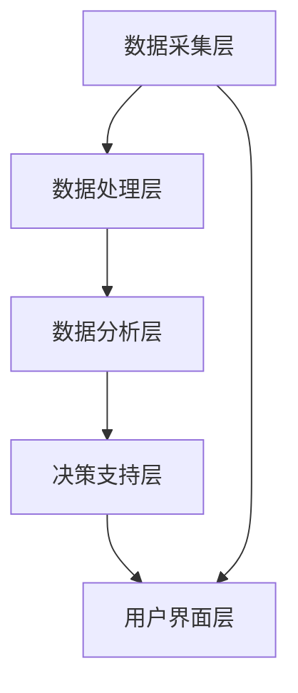

                 

### 第1章: 战略执行监控的重要性与挑战

#### 1.1 战略执行监控的定义与作用

战略执行监控是组织管理过程中的一项关键活动，旨在确保战略规划的有效实施。简单来说，战略执行监控是通过对组织运营过程中产生的各种数据进行实时监测、分析，以评估战略目标实现情况的系统。其核心作用在于提供决策支持，帮助管理者识别问题、调整策略，从而确保组织目标的达成。

在企业管理中，战略执行监控具有以下几个重要作用：

1. **目标导向**：通过战略执行监控，组织可以明确各个部门、团队乃至个人的目标，并确保这些目标与整体战略保持一致。

2. **过程控制**：实时监控有助于管理者及时发现偏差，采取措施进行调整，避免问题累积成灾难。

3. **资源优化**：通过监控资源的利用效率，组织可以优化资源配置，提高运营效率。

4. **风险防范**：战略执行监控可以帮助组织识别潜在风险，提前采取措施进行防范。

#### 1.2 战略执行监控面临的挑战

尽管战略执行监控在企业管理中具有重要意义，但其实施过程中也面临诸多挑战：

1. **数据复杂性**：随着组织规模的扩大和业务种类的增多，监控所需的数据来源变得更加多样和复杂。如何从海量数据中提取有价值的信息成为一个重要问题。

2. **实时性要求**：现代商业环境变化迅速，决策者需要实时掌握组织运营状态，及时调整策略。实现数据的实时采集、处理和分析是一项挑战。

3. **决策支持**：如何利用监控数据为决策者提供有效的支持是一个关键问题。传统的报表和图表往往难以满足复杂决策的需求。

4. **系统集成**：战略执行监控通常需要与组织现有的信息系统进行集成，确保数据的无缝流转。系统集成的复杂性增加了监控的实施难度。

#### 1.3 AI技术在战略执行监控中的应用前景

人工智能技术的发展为战略执行监控带来了新的机遇和挑战：

1. **数据挖掘**：AI技术可以通过机器学习和深度学习算法从海量数据中挖掘出有价值的信息，为决策提供支持。

2. **预测分析**：通过历史数据的分析和趋势预测，AI可以帮助组织预见未来可能发生的问题，提前做好准备。

3. **自动化决策**：AI可以自动化一些决策过程，减少人为干预，提高决策效率。

4. **个性化推荐**：AI可以根据组织的特点和需求，提供个性化的监控方案和策略建议。

#### 1.4 AI驱动的战略执行监控框架概述

为了实现AI驱动的战略执行监控，我们需要构建一个综合性的系统框架，该框架应包括以下几个关键模块：

1. **数据采集模块**：负责收集来自各种数据源的数据，包括内部业务数据和外部市场数据。

2. **数据处理模块**：对采集到的数据进行清洗、归一化和特征提取，为后续分析做好准备。

3. **分析模型模块**：构建各种数据分析模型，包括统计模型、机器学习模型和深度学习模型，用于预测、分类和聚类等任务。

4. **决策支持模块**：基于分析结果，为决策者提供个性化的监控报告和策略建议。

5. **监控与反馈模块**：实时监控组织的运营状态，根据实际效果对策略进行动态调整，形成闭环反馈系统。

### 图1: AI驱动的战略执行监控框架



通过以上分析，我们可以看到，AI驱动的战略执行监控不仅能够解决传统监控面临的挑战，还能够为组织提供更加智能化和高效的支持。接下来，我们将进一步探讨AI技术在战略执行监控中的具体应用和实践案例。

## 第2章: AI驱动的战略执行监控概述

#### 2.1 AI在战略执行监控中的潜力

人工智能（AI）作为当今技术领域的重要突破，正在逐步改变企业管理和运营的方方面面。在战略执行监控领域，AI展现出了巨大的潜力，主要体现在以下几个方面：

1. **数据挖掘与洞见发现**：
   - **海量数据分析**：AI可以通过机器学习和深度学习算法对海量数据进行高效处理和分析，从中提取出潜在的模式和趋势。
   - **实时数据监控**：利用AI，企业可以实现实时数据监控，及时发现问题并进行预警。

2. **预测分析**：
   - **趋势预测**：通过历史数据分析，AI可以预测未来市场趋势、客户需求变化等，帮助企业在战略决策中抢占先机。
   - **风险预测**：AI可以帮助企业预测潜在的风险和问题，提前制定应对措施，减少意外损失。

3. **自动化与智能化**：
   - **自动化决策**：AI可以通过算法模型实现自动化决策，减少人工干预，提高决策效率和准确性。
   - **智能化调整**：基于实时监控和数据分析，AI能够自动调整策略，实现动态优化。

4. **个性化与定制化**：
   - **个性化推荐**：AI可以根据企业特点和历史数据，提供个性化的监控方案和策略建议。
   - **定制化模型**：AI可以为企业定制化构建适合其业务需求的监控模型，提高监控的针对性。

#### 2.2 AI驱动的战略执行监控框架

为了实现AI驱动的战略执行监控，我们需要构建一个综合性的系统框架，这个框架通常包括以下几个关键模块：

1. **数据采集与处理模块**：
   - **数据源集成**：从多个数据源（如ERP系统、CRM系统、传感器数据等）收集数据。
   - **数据清洗**：对采集到的数据进行清洗，去除错误和异常数据。
   - **数据归一化**：将不同来源的数据进行归一化处理，确保数据格式的一致性。
   - **特征提取**：提取数据中的关键特征，为后续分析做准备。

2. **数据分析与建模模块**：
   - **统计分析**：使用统计分析方法对数据进行分析，识别数据中的趋势和关系。
   - **机器学习**：运用机器学习算法构建预测模型，如回归分析、聚类分析等。
   - **深度学习**：利用深度学习算法处理复杂的数据结构，如神经网络、卷积神经网络（CNN）等。

3. **决策支持与优化模块**：
   - **预测与预警**：基于数据分析结果，预测未来趋势并发出预警。
   - **策略调整**：根据实时数据分析和预测结果，自动调整战略执行策略。
   - **优化建议**：提供数据驱动的优化建议，帮助企业提高运营效率和效果。

4. **监控与反馈模块**：
   - **实时监控**：实时监控组织的运营状态，确保数据及时更新。
   - **反馈机制**：根据实际运营效果，对监控模型和策略进行动态调整。

5. **用户界面与交互模块**：
   - **可视化展示**：通过图表、报表等形式，将分析结果直观地展示给用户。
   - **交互功能**：提供用户与系统的交互功能，如自定义报表、数据筛选等。

### 图2: AI驱动的战略执行监控框架



通过以上框架的构建，AI驱动的战略执行监控系统可以实现对组织运营的全面监控和优化，从而提高战略执行的效率和质量。接下来，我们将详细探讨战略执行监控中的关键要素，包括数据采集、处理、分析和模型构建。

### 第3章: 战略执行监控的关键要素

#### 3.1 数据来源与采集

战略执行监控的基础是准确、全面和实时数据。数据来源可以多样化，包括内部数据和外部数据：

1. **内部数据**：
   - **业务数据**：如销售数据、财务数据、库存数据等。
   - **运营数据**：如生产数据、物流数据、员工绩效数据等。
   - **系统日志**：如服务器日志、网络日志等。

2. **外部数据**：
   - **市场数据**：如市场趋势、竞争对手信息、消费者行为数据等。
   - **经济数据**：如GDP、利率、通货膨胀率等宏观经济数据。
   - **行业报告**：如行业研究报告、市场分析报告等。

**数据采集方法**：

- **自动化采集**：通过API接口、数据爬虫等技术，实现自动化数据采集。
- **人工采集**：对于一些难以自动化的数据，如市场调研数据，可以采用人工采集方式。
- **物联网技术**：利用传感器和物联网设备，实现实时数据采集。

#### 3.2 数据处理与分析

数据处理与分析是战略执行监控的核心环节，主要包括以下几个方面：

1. **数据预处理**：
   - **数据清洗**：去除重复数据、空值数据、错误数据等，保证数据质量。
   - **数据归一化**：将不同来源、不同单位的数据转换为统一的格式。
   - **特征提取**：从原始数据中提取关键特征，为后续分析提供支持。

2. **数据分析**：
   - **统计分析**：运用统计方法，如描述性统计、推断性统计等，对数据进行初步分析。
   - **数据挖掘**：运用数据挖掘算法，如分类、聚类、关联规则等，发现数据中的潜在规律。
   - **可视化分析**：通过图表、报表等形式，将分析结果直观地展示出来。

3. **数据模型构建**：
   - **统计模型**：如线性回归、逻辑回归等，用于预测和决策。
   - **机器学习模型**：如决策树、随机森林、支持向量机等，用于复杂模式识别和预测。
   - **深度学习模型**：如卷积神经网络（CNN）、循环神经网络（RNN）等，用于处理大规模和高维数据。

#### 3.3 模型构建与评估

模型构建与评估是战略执行监控的关键步骤，直接影响到监控结果的准确性和可靠性。

1. **模型构建**：
   - **数据分割**：将数据集划分为训练集、验证集和测试集，用于模型的训练和评估。
   - **模型选择**：根据数据特点和业务需求，选择合适的模型算法。
   - **参数调优**：通过交叉验证等方法，调整模型参数，提高模型性能。

2. **模型评估**：
   - **准确性评估**：使用准确率、召回率、F1分数等指标评估模型预测准确性。
   - **稳定性评估**：通过多次实验，评估模型在不同数据集上的稳定性和泛化能力。
   - **业务评估**：从业务角度评估模型的实际效果，如预测的实用性和决策支持的质量。

3. **模型优化**：
   - **迭代优化**：基于评估结果，对模型进行迭代优化，提高模型性能。
   - **集成优化**：结合多个模型，构建集成模型，提高整体预测效果。

#### 3.4 战略执行监控与业务目标的关联

战略执行监控不仅仅是技术问题，更是业务问题。为了确保监控的有效性，需要将其与业务目标紧密关联：

1. **目标分解**：将组织的战略目标分解为具体的业务指标，如销售额、市场份额、运营效率等。
2. **指标跟踪**：通过监控系统，实时跟踪业务指标的实现情况。
3. **反馈机制**：建立反馈机制，根据监控结果调整业务策略，确保业务目标的实现。

### 总结

战略执行监控是一个复杂的过程，需要从数据采集、数据处理、模型构建到评估和优化等多个环节进行综合管理。通过AI技术的引入，战略执行监控不仅可以实现数据的高效处理和分析，还可以提供智能化的决策支持，帮助企业实现战略目标。接下来，我们将深入探讨AI技术在战略执行监控中的应用，以及如何通过AI实现智能化的数据分析和决策。

## 第4章: AI技术在战略执行监控中的应用

#### 4.1 机器学习在战略执行监控中的应用

机器学习作为AI的核心技术之一，在战略执行监控中发挥着重要作用。以下是一些机器学习在战略执行监控中的应用场景：

1. **趋势预测**：
   - **需求预测**：通过历史销售数据，利用机器学习算法预测未来的市场需求，帮助企业制定生产计划和库存策略。
   - **财务预测**：使用财务数据构建预测模型，预测未来的财务状况，为企业的资金管理和风险控制提供支持。

2. **风险识别**：
   - **信用评分**：利用客户的历史交易数据，通过机器学习模型评估客户的信用风险，帮助银行和金融机构进行信用评估。
   - **欺诈检测**：通过分析交易数据和行为模式，机器学习模型可以识别潜在的欺诈行为，提高监控系统的准确性。

3. **优化决策**：
   - **供应链优化**：利用机器学习算法，分析供应链中的数据，优化库存管理和运输计划，降低运营成本。
   - **资源分配**：通过对业务数据的分析，机器学习模型可以帮助企业优化资源分配，提高生产效率和服务质量。

#### 4.2 深度学习在战略执行监控中的应用

深度学习是机器学习的一个分支，它通过多层神经网络对数据进行建模和分析，具有强大的表示和学习能力。以下是一些深度学习在战略执行监控中的应用场景：

1. **图像识别**：
   - **生产监控**：通过摄像头监控生产线，利用深度学习模型进行图像识别，检测产品缺陷和异常情况。
   - **安全监控**：利用深度学习模型对监控视频进行分析，识别潜在的安全威胁，如入侵者或火灾等。

2. **自然语言处理**：
   - **文本分析**：通过深度学习模型分析客户反馈、新闻报道等文本数据，提取关键信息，帮助管理层做出决策。
   - **语音识别**：利用深度学习算法进行语音识别，将语音转化为文本，用于实时会议记录和客户服务。

3. **自动化决策**：
   - **智能调度**：通过深度学习模型分析交通数据，实现智能调度，优化路线规划和交通流量。
   - **客户服务**：利用聊天机器人技术，通过深度学习模型实现自然语言处理，提供24/7的自动客户服务。

#### 4.3 自然语言处理在战略执行监控中的应用

自然语言处理（NLP）是AI的一个重要分支，它使计算机能够理解、生成和处理人类语言。以下是一些NLP在战略执行监控中的应用场景：

1. **文本分析**：
   - **市场趋势分析**：通过NLP技术分析社交媒体和新闻报道，提取市场趋势和消费者情绪，为市场预测和策略调整提供支持。
   - **竞争对手分析**：分析竞争对手的宣传材料、产品评价等，提取关键信息，帮助企业制定竞争策略。

2. **客户服务**：
   - **智能客服**：利用NLP技术构建智能客服系统，通过自然语言交互，解决客户的问题，提高客户满意度。
   - **情感分析**：分析客户反馈，识别客户情绪，帮助企业改善产品和服务。

3. **内部沟通**：
   - **会议记录**：通过NLP技术自动记录会议内容，提取关键信息，便于后续分析和跟进。
   - **知识库管理**：利用NLP技术构建企业知识库，实现文本的自动分类、索引和检索，提高信息利用效率。

### 图3: AI技术在战略执行监控中的综合应用



通过以上应用，AI技术为战略执行监控提供了强大的支持，使得企业能够更加智能化地进行数据分析和决策。接下来，我们将进一步探讨如何构建AI驱动的战略执行监控体系，包括数据采集与处理、数据分析与模型构建、模型优化与智能调整策略等内容。

## 第5章: 数据采集与处理

#### 5.1 数据采集方法

数据采集是战略执行监控系统的基石，决定了数据的质量和完整性。以下是几种常用的数据采集方法：

1. **自动化采集**：
   - **API接口**：通过系统的API接口，直接从外部系统（如ERP、CRM等）获取数据。
   - **Web爬虫**：使用爬虫技术，自动从互联网上抓取数据，适用于公开数据源或允许爬取的网站。
   - **传感器采集**：利用物联网传感器，实时采集环境数据、设备运行数据等。

2. **人工采集**：
   - **手动录入**：对于一些非结构化数据（如客户反馈、问卷调查等），需要通过人工方式录入系统。
   - **数据审核**：在数据采集过程中，人工审核数据准确性，确保数据质量。

3. **自动化与人工结合**：
   - **自动化为主，人工为辅**：在自动化采集的基础上，人工对关键数据进行审核和补充，提高数据质量。

#### 5.2 数据预处理技术

数据预处理是确保数据质量和可用性的关键步骤，主要包括以下技术：

1. **数据清洗**：
   - **去重**：识别并去除重复的数据记录，避免数据冗余。
   - **填补缺失值**：对缺失的数据进行填补，可以使用均值、中位数或插值等方法。
   - **处理异常值**：检测并处理异常数据，如错误的输入、异常的测量结果等。

2. **数据归一化**：
   - **标准化**：将不同尺度或单位的数据转换为相同的尺度或单位，便于后续分析。
   - **归一化**：将数据分布调整为标准正态分布，消除数据规模差异。

3. **特征提取**：
   - **特征选择**：从原始数据中提取有用的特征，去除无关或冗余的特征，提高模型性能。
   - **特征转换**：将数值型特征转换为类别型特征，如使用独热编码（One-Hot Encoding）处理分类数据。

#### 5.3 数据存储与管理

数据存储与管理是确保数据安全、可靠和高效访问的重要环节，主要包括以下方面：

1. **数据存储**：
   - **关系型数据库**：适用于结构化数据的存储，如MySQL、PostgreSQL等。
   - **非关系型数据库**：适用于非结构化数据的存储，如MongoDB、Cassandra等。
   - **数据仓库**：用于大规模数据存储和查询，如Amazon Redshift、Google BigQuery等。

2. **数据管理**：
   - **元数据管理**：管理数据的元数据，包括数据来源、数据结构、数据质量等信息。
   - **数据备份与恢复**：定期备份数据，确保数据在意外情况下能够恢复。
   - **数据安全**：采用加密技术、访问控制策略等，确保数据的安全和隐私。

3. **数据流处理**：
   - **实时数据处理**：使用实时数据处理框架（如Apache Kafka、Apache Flink等），确保数据能够实时流入系统进行预处理和分析。
   - **批量处理**：对于一些不需要实时处理的数据，可以采用批量处理的方式，提高数据处理效率。

#### 5.4 数据质量评估与监控

数据质量直接影响战略执行监控的效果，因此需要建立数据质量评估与监控机制：

1. **数据质量评估**：
   - **完整性评估**：检查数据的完整性，确保没有缺失的数据。
   - **准确性评估**：检查数据的准确性，确保数据的正确性。
   - **一致性评估**：检查数据的一致性，确保不同数据源的数据能够相互匹配。

2. **数据监控**：
   - **实时监控**：使用监控工具（如Splunk、Zabbix等），实时监控数据质量指标。
   - **告警机制**：当数据质量指标低于设定阈值时，自动触发告警，通知相关人员进行处理。

3. **数据质量改进**：
   - **问题诊断**：分析数据质量问题的原因，制定改进措施。
   - **数据清洗**：针对存在的问题，进行数据清洗和修正。
   - **持续监控**：持续监控数据质量，确保数据始终保持高质量。

通过以上数据采集与处理的方法和技术，战略执行监控系统能够确保数据的准确性和可靠性，为后续的数据分析和决策提供坚实基础。接下来，我们将进一步探讨数据分析与模型构建的方法和步骤。

## 第6章: 数据分析与模型构建

### 6.1 数据分析基础

数据分析是战略执行监控的关键环节，通过对采集到的数据进行深入分析，可以帮助企业识别趋势、预测未来，并做出明智的决策。以下是数据分析的基础知识：

#### 数据清洗与预处理

数据清洗是数据分析的第一步，目的是去除数据中的噪声和异常值，保证数据的质量。主要步骤包括：

- **缺失值处理**：使用统计方法填补缺失值，如平均值、中位数、众数等，或使用插值法。
- **异常值检测**：使用统计方法或机器学习方法检测异常值，如使用IQR（四分位距）方法检测离群点，或使用K-均值聚类算法识别异常数据点。
- **重复值删除**：检测并删除重复的数据记录，以避免数据冗余。

#### 数据探索性分析

数据探索性分析（EDA）是分析数据的初步阶段，目的是了解数据的基本特性和规律。主要方法包括：

- **统计描述**：计算数据的中心趋势（如均值、中位数、众数）、离散程度（如标准差、方差）等统计量。
- **可视化分析**：使用图表（如柱状图、散点图、箱线图等）展示数据分布和趋势，帮助发现数据中的异常和关联性。
- **相关性分析**：使用皮尔逊相关系数、斯皮尔曼等级相关系数等方法分析变量之间的相关性。

#### 数据特征工程

数据特征工程是提升模型性能的关键步骤，目的是构建有助于模型学习的特征。主要步骤包括：

- **特征提取**：从原始数据中提取具有区分度的特征，如使用特征选择方法（如互信息、主成分分析等）筛选重要特征。
- **特征转换**：将数值型特征转换为类别型特征，使用独热编码、标签编码等方法，或对数值型特征进行归一化、标准化处理。

#### 数据归一化与标准化

数据归一化与标准化是数据预处理的重要步骤，目的是消除不同特征之间的量纲差异。主要方法包括：

- **归一化**：将数据映射到[0, 1]区间，使用公式 \( x' = \frac{x - \min(x)}{\max(x) - \min(x)} \)。
- **标准化**：将数据映射到均值为0、标准差为1的正态分布，使用公式 \( x' = \frac{x - \mu}{\sigma} \)，其中 \( \mu \) 是均值，\( \sigma \) 是标准差。

### 6.2 模型构建方法

模型构建是数据分析的核心步骤，通过建立数学模型来预测和解释数据。以下是几种常见的模型构建方法：

#### 统计模型

统计模型是传统的数据分析方法，基于概率统计理论，适用于处理定量数据。常见的统计模型包括：

- **线性回归**：用于分析变量之间的线性关系，通过最小二乘法估计模型的参数。
- **逻辑回归**：用于分析二元分类问题，通过最大化似然函数估计概率模型。

#### 机器学习模型

机器学习模型通过训练数据自动学习特征和规律，适用于处理复杂和大规模的数据。常见的机器学习模型包括：

- **决策树**：通过划分特征空间，构建决策树模型，适用于分类和回归任务。
- **支持向量机（SVM）**：通过构建最优超平面，实现数据的分类和回归。
- **随机森林**：通过集成多个决策树，提高模型的泛化能力和稳定性。
- **K-近邻（KNN）**：通过计算测试样本与训练样本的相似度，实现分类和回归。

#### 深度学习模型

深度学习模型是机器学习的一个分支，通过多层神经网络进行特征提取和表示。常见的深度学习模型包括：

- **卷积神经网络（CNN）**：适用于图像处理和计算机视觉任务，通过卷积层提取图像特征。
- **循环神经网络（RNN）**：适用于序列数据处理，通过循环结构捕捉序列中的长期依赖关系。
- **长短期记忆网络（LSTM）**：是RNN的一种变体，通过引入门控机制解决RNN的梯度消失问题。
- **生成对抗网络（GAN）**：通过生成器和判别器的对抗训练，实现数据生成和图像生成。

### 6.3 模型评估与优化

模型评估是确保模型性能的重要步骤，通过评估指标来判断模型的预测能力和泛化能力。常见的评估指标包括：

- **准确率（Accuracy）**：分类问题中正确预测的样本占总样本的比例。
- **召回率（Recall）**：分类问题中被正确识别为正类的样本占总正类样本的比例。
- **精确率（Precision）**：分类问题中被正确识别为正类的样本占总预测为正类的样本的比例。
- **F1分数（F1 Score）**：精确率和召回率的加权平均，综合考虑了模型的精确性和鲁棒性。

模型优化是通过调整模型参数和算法，提高模型的性能。常见的优化方法包括：

- **交叉验证（Cross Validation）**：通过将数据集划分为训练集和验证集，多次训练和验证，评估模型的泛化能力。
- **超参数调优（Hyperparameter Tuning）**：通过搜索和调整模型参数，找到最优参数组合，提高模型性能。
- **集成学习（Ensemble Learning）**：通过集成多个模型，提高模型的稳定性和预测能力。

通过以上数据分析与模型构建的方法，战略执行监控系统能够对采集到的数据进行深入分析和预测，为企业的战略决策提供有力支持。接下来，我们将探讨模型优化与智能调整策略，确保战略执行监控系统的实时性和有效性。

### 第7章: 模型优化与智能调整策略

#### 7.1 模型优化策略

模型优化是提高战略执行监控准确性、稳定性和效率的关键步骤。以下是一些常用的模型优化策略：

1. **超参数调优**：
   - **网格搜索（Grid Search）**：通过遍历所有可能的超参数组合，找到最优的超参数设置。
   - **贝叶斯优化（Bayesian Optimization）**：基于贝叶斯统计模型，通过较少的实验迭代，找到最优的超参数。

2. **特征选择**：
   - **特征重要性**：利用模型训练结果，评估每个特征的重要性，筛选出重要的特征。
   - **特征工程**：通过构造新的特征或变换现有特征，提高模型的预测能力。

3. **正则化**：
   - **L1正则化（Lasso）**：通过引入L1惩罚项，减少模型参数，提高模型的可解释性。
   - **L2正则化（Ridge）**：通过引入L2惩罚项，降低模型的过拟合，提高模型的泛化能力。

4. **集成学习**：
   - **随机森林（Random Forest）**：通过集成多个决策树模型，提高模型的稳定性和预测能力。
   - **梯度提升树（Gradient Boosting Tree）**：通过迭代地优化模型，逐步减少误差，提高模型的预测性能。

#### 7.2 智能调整策略

智能调整策略是基于实时数据分析和预测结果，动态调整战略执行监控的策略。以下是一些智能调整策略：

1. **实时监控与反馈**：
   - **动态阈值调整**：根据实时数据，动态调整监控阈值，提高系统的实时响应能力。
   - **异常检测与预警**：通过实时监控，检测数据中的异常值和异常模式，及时发出预警。

2. **自适应调整**：
   - **模型自适应**：根据数据的变化，自适应调整模型的参数和结构，保持模型的适应性和准确性。
   - **策略自适应**：根据实时数据分析结果，自适应调整战略执行监控的策略，确保策略与实际运营状态匹配。

3. **预测与优化**：
   - **预测调整**：基于实时数据和预测模型，动态调整预测参数和预测策略，提高预测的准确性。
   - **资源优化**：根据预测结果和资源利用情况，动态调整资源分配策略，优化资源配置。

#### 7.3 策略调整的算法实现

实现智能调整策略需要结合具体的数据分析和算法实现。以下是一个简单的算法实现框架：

```python
# 算法实现框架

# 数据预处理
def preprocess_data(data):
    # 数据清洗、归一化、特征提取
    pass

# 模型训练
def train_model(X_train, y_train):
    # 使用机器学习或深度学习算法训练模型
    pass

# 模型预测
def predict(model, X_test):
    # 使用训练好的模型进行预测
    pass

# 实时监控与反馈
def real_time_monitoring(model, data_stream):
    while True:
        # 实时处理数据流，进行预测
        prediction = predict(model, data_stream)
        # 动态调整策略
        adjust_strategy(prediction)
        # 发出预警或采取行动
        alert_if_necessary(prediction)
        # 等待下一批数据

# 策略调整
def adjust_strategy(prediction):
    # 根据预测结果调整策略
    pass

# 异常检测与预警
def alert_if_necessary(prediction):
    # 根据预测结果判断是否需要发出预警
    pass
```

通过以上算法实现框架，可以构建一个智能调整策略的监控系统，实现数据的实时处理、预测和策略调整。接下来，我们将探讨战略执行监控系统的设计与实现，包括系统架构、模块功能和实现细节。

### 第8章: 战略执行监控系统的设计与实现

#### 8.1 系统架构设计

战略执行监控系统的设计应充分考虑模块化、灵活性和可扩展性，以便在复杂业务环境中有效运作。以下是一个典型的系统架构设计：

##### 系统架构概述

1. **数据采集层**：负责从各种数据源（如ERP、CRM、物联网设备等）收集数据。
2. **数据处理层**：对采集到的数据进行清洗、预处理和特征提取，为后续分析做好准备。
3. **数据分析层**：利用机器学习和深度学习算法进行数据分析和预测。
4. **决策支持层**：基于分析结果，提供实时监控报告和策略建议。
5. **用户界面层**：通过Web界面、移动应用等形式，将分析结果和监控数据展示给用户。

##### 系统架构图



##### 各层功能模块

1. **数据采集层**：
   - **数据采集模块**：通过API接口、数据爬虫、传感器采集等多种方式获取数据。
   - **数据接入模块**：集成不同的数据源，实现数据接入和转换。

2. **数据处理层**：
   - **数据清洗模块**：去除重复、异常和错误的数据，保证数据质量。
   - **数据预处理模块**：进行数据归一化、特征提取等预处理操作。
   - **数据存储模块**：将处理后的数据存储在数据库中，便于后续分析。

3. **数据分析层**：
   - **特征工程模块**：从原始数据中提取有用的特征，构建特征向量。
   - **模型训练模块**：训练机器学习和深度学习模型，进行预测和分析。
   - **预测模块**：基于训练好的模型，对实时数据进行预测。

4. **决策支持层**：
   - **监控与分析模块**：实时监控业务指标，进行数据分析。
   - **策略优化模块**：根据监控结果，动态调整策略。
   - **报告生成模块**：生成监控报告，提供决策支持。

5. **用户界面层**：
   - **可视化模块**：通过图表、报表等形式展示监控数据和报告。
   - **交互模块**：提供用户与系统的交互功能，如自定义报表、数据筛选等。

#### 8.2 系统模块功能划分

1. **数据采集模块**：
   - **功能**：负责从不同数据源采集数据，支持批量导入和实时数据流接入。
   - **技术**：API接口、Web爬虫、物联网设备、消息队列（如Kafka）。

2. **数据处理模块**：
   - **功能**：进行数据清洗、预处理和特征提取，保证数据质量。
   - **技术**：Python、Java、Scala等编程语言，数据处理库（如Pandas、Spark）。

3. **数据分析模块**：
   - **功能**：构建和分析机器学习模型，进行数据预测和模式识别。
   - **技术**：Scikit-learn、TensorFlow、Keras等机器学习和深度学习库。

4. **决策支持模块**：
   - **功能**：提供实时监控报告和策略建议，支持决策制定。
   - **技术**：Python、R语言等数据分析工具，可视化库（如Matplotlib、D3.js）。

5. **用户界面模块**：
   - **功能**：通过Web界面和移动应用，展示监控数据和报告。
   - **技术**：Web前端框架（如React、Vue.js），移动应用开发框架（如Flutter、React Native）。

#### 8.3 系统实现与部署

系统实现与部署涉及多个步骤，包括技术选型、环境搭建、代码实现和部署上线。以下是实现与部署的详细步骤：

1. **技术选型**：
   - **前端**：选择合适的Web前端框架和移动应用开发框架。
   - **后端**：选择合适的服务器端编程语言和框架。
   - **数据库**：选择合适的数据库管理系统。
   - **中间件**：选择合适的数据处理和消息队列中间件。

2. **环境搭建**：
   - **开发环境**：搭建开发所需的环境，包括编程语言、库和工具。
   - **测试环境**：搭建用于测试的系统环境，确保系统的稳定性和性能。
   - **生产环境**：搭建生产环境，确保系统的高可用性和安全性。

3. **代码实现**：
   - **模块开发**：按照设计文档和需求文档，开发各个模块的功能。
   - **集成测试**：对各个模块进行集成测试，确保模块之间的接口和功能正确。
   - **单元测试**：对各个模块进行单元测试，确保代码质量和功能完整性。

4. **部署上线**：
   - **部署**：将开发完成的系统部署到生产环境，确保系统的高可用性和性能。
   - **监控**：部署监控工具，对系统进行实时监控，确保系统的稳定运行。
   - **维护**：定期进行系统维护和更新，确保系统的持续优化和改进。

通过以上步骤，战略执行监控系统可以实现从数据采集、处理、分析到决策支持的完整功能，为企业提供智能化的战略执行监控支持。接下来，我们将通过实际案例研究，探讨AI驱动的战略执行监控在具体业务场景中的应用和实践。

### 第9章: 实际案例研究

#### 9.1 案例选择与介绍

在本章节中，我们将探讨一个具体的业务场景，即一家大型零售企业如何利用AI驱动的战略执行监控系统优化库存管理和销售预测。这家零售企业拥有众多的分支机构，分布在不同的地区，其业务复杂且数据量大。通过AI技术的引入，企业希望实现以下目标：

1. **实时库存监控**：实时监控各分支机构的库存情况，避免库存积压和断货现象。
2. **销售预测**：基于历史销售数据和实时市场趋势，预测未来的销售情况，优化采购和库存策略。
3. **需求预测**：分析消费者行为和市场趋势，预测未来的需求变化，提前调整供应链策略。

#### 9.2 案例实施过程

1. **数据采集**：
   - **内部数据**：采集来自ERP系统、CRM系统和POS系统的销售数据、库存数据、客户订单数据等。
   - **外部数据**：采集市场数据、经济数据、竞争对手信息等，通过API接口和Web爬虫技术获取。
   - **物联网数据**：通过传感器采集仓库环境数据、设备运行数据等。

2. **数据预处理**：
   - **数据清洗**：去除重复数据、缺失数据和异常数据，保证数据质量。
   - **数据归一化**：将不同单位的数据转换为统一的格式，如货币单位、重量单位等。
   - **特征提取**：从原始数据中提取有用的特征，如销售周期、季节性趋势、节假日效应等。

3. **数据分析与建模**：
   - **销售预测**：利用时间序列分析方法（如ARIMA模型）和机器学习算法（如随机森林、LSTM网络），建立销售预测模型。
   - **库存监控**：通过建立库存预警模型，实时监控库存水平，设定合理的库存阈值。
   - **需求预测**：使用市场趋势分析和消费者行为分析，构建需求预测模型，预测未来的需求变化。

4. **模型训练与优化**：
   - **模型训练**：使用历史数据对模型进行训练，调整模型参数，优化模型性能。
   - **模型评估**：通过交叉验证和测试集评估模型性能，确保模型泛化能力。
   - **模型部署**：将训练好的模型部署到生产环境，实现实时预测和监控。

5. **决策支持与策略调整**：
   - **实时监控**：通过实时监控系统，监控库存水平和销售情况，及时发现问题。
   - **策略调整**：基于实时数据分析和预测结果，动态调整库存策略和采购计划。
   - **反馈机制**：建立反馈机制，根据实际效果对模型和策略进行迭代优化。

#### 9.3 案例结果分析

通过AI驱动的战略执行监控系统，这家零售企业在以下几个方面取得了显著成果：

1. **库存优化**：
   - **库存水平**：通过实时监控和预警模型，企业能够准确掌握各分支机构的库存情况，避免了库存积压和断货现象，库存周转率显著提高。
   - **库存成本**：通过优化库存策略，企业减少了库存资金占用，降低了库存成本。

2. **销售预测**：
   - **销售准确性**：通过销售预测模型，企业能够更准确地预测未来的销售情况，为采购和库存管理提供依据，提高了销售预测的准确性。
   - **销售计划**：基于销售预测结果，企业能够制定更合理的销售计划，提高了销售执行效率。

3. **需求预测**：
   - **需求变化**：通过需求预测模型，企业能够提前预测市场需求变化，及时调整供应链策略，满足了消费者需求，提高了市场响应速度。

4. **整体效益**：
   - **运营效率**：通过AI驱动的战略执行监控系统，企业提高了运营效率，减少了人工干预，降低了运营成本。
   - **客户满意度**：通过实时库存监控和准确的销售预测，企业能够更好地满足客户需求，提高了客户满意度。

总之，通过AI驱动的战略执行监控系统，这家零售企业实现了库存管理、销售预测和需求预测的智能化和自动化，提高了企业的运营效率和市场竞争力。接下来，我们将探讨如何实施智能调整策略，确保系统在动态环境中保持最佳性能。

### 第10章: 智能调整策略的实施步骤

#### 10.1 实施前准备

在实施智能调整策略之前，需要进行充分的准备，以确保策略的有效性和可行性。以下是实施前的准备工作：

1. **需求分析**：
   - **业务需求**：明确企业希望通过智能调整策略解决的具体问题，如库存优化、销售预测等。
   - **技术需求**：确定实现智能调整策略所需的技术和工具，包括数据处理、机器学习、深度学习等。

2. **数据准备**：
   - **数据采集**：确保数据来源的多样性和完整性，包括历史数据、实时数据等。
   - **数据清洗**：对采集到的数据进行清洗，去除重复、异常和错误的数据，保证数据质量。

3. **模型选择**：
   - **模型评估**：根据业务需求和数据特点，选择合适的机器学习或深度学习模型，并进行评估。
   - **模型优化**：通过调整模型参数和特征工程，优化模型性能，提高预测准确性。

4. **环境搭建**：
   - **开发环境**：搭建适合开发和测试的软件和硬件环境，包括编程语言、库和工具等。
   - **测试环境**：搭建用于测试和验证系统的测试环境，确保系统的稳定性和性能。

5. **团队组建**：
   - **技术团队**：组建技术团队，包括数据科学家、软件工程师、系统管理员等，确保有足够的资源支持策略的实施。

#### 10.2 实施策略制定

智能调整策略的制定是实施过程中的关键环节，需要结合业务需求和数据分析结果，制定具体的调整策略。以下是实施策略制定的主要步骤：

1. **目标设定**：
   - **业务目标**：根据企业整体战略目标，设定具体的智能调整策略目标，如提高库存周转率、降低库存成本等。
   - **技术目标**：确定实现策略所需的技术目标，如模型精度、响应速度等。

2. **策略设计**：
   - **实时监控**：设计实时监控系统，实时采集和处理数据，确保数据的实时性和准确性。
   - **预警机制**：设计预警机制，当监控数据超过设定的阈值时，自动发出警报。
   - **决策支持**：设计决策支持系统，基于实时数据分析和预测结果，提供个性化的策略建议。

3. **策略验证**：
   - **模型验证**：通过测试集验证模型的预测准确性，确保模型在实际应用中的性能。
   - **策略验证**：通过模拟测试或小规模试验，验证智能调整策略的有效性。

4. **迭代优化**：
   - **数据反馈**：收集实施过程中的数据反馈，分析策略的实际效果。
   - **策略调整**：根据反馈结果，对智能调整策略进行调整和优化，提高策略的可行性和效果。

#### 10.3 实施策略调整

智能调整策略的实施是一个动态过程，需要不断根据实际效果进行调整和优化。以下是实施策略调整的步骤：

1. **实时调整**：
   - **监控数据**：实时监控业务数据和系统性能，确保数据准确性和系统稳定性。
   - **策略执行**：根据实时数据分析和预测结果，动态调整策略，确保策略与实际运营状态匹配。

2. **反馈机制**：
   - **效果评估**：定期评估智能调整策略的实施效果，包括业务指标和系统性能指标。
   - **反馈收集**：收集业务部门和用户的反馈，分析策略实施中的问题和改进点。

3. **持续优化**：
   - **模型更新**：根据业务需求和数据变化，定期更新和优化模型，提高预测准确性和策略有效性。
   - **策略迭代**：结合新的数据和技术，迭代优化智能调整策略，确保其持续适应业务环境。

通过以上实施步骤，企业可以确保智能调整策略的有效实施，实现战略执行监控的智能化和自动化，从而提高运营效率和业务效益。接下来，我们将探讨战略执行监控面临的挑战和未来发展趋势。

### 第11章: 战略执行监控的挑战与未来趋势

#### 11.1 监控挑战分析

战略执行监控在实际应用中面临诸多挑战，这些挑战直接影响监控系统的效果和可靠性。以下是主要的挑战及其应对策略：

1. **数据质量问题**：
   - **挑战**：数据源多样、格式不统一，存在缺失值、异常值和重复数据。
   - **应对策略**：建立严格的数据清洗和质量控制流程，采用自动化数据清洗工具，确保数据的一致性和准确性。

2. **实时性要求**：
   - **挑战**：实时处理大量数据，确保数据及时更新和监控结果实时反馈。
   - **应对策略**：采用分布式数据处理框架（如Apache Kafka、Apache Flink），提高数据处理速度和系统响应能力。

3. **模型复杂度**：
   - **挑战**：构建高性能的机器学习和深度学习模型，处理复杂的数据结构和业务场景。
   - **应对策略**：采用先进的算法和模型优化技术，如增强学习、迁移学习等，提高模型的泛化能力和适应性。

4. **系统集成**：
   - **挑战**：将战略执行监控系统与现有的信息系统（如ERP、CRM等）集成，确保数据的无缝流转和系统稳定性。
   - **应对策略**：采用微服务架构，实现系统模块化，提高系统的灵活性和可扩展性。

5. **决策支持**：
   - **挑战**：提供直观、易懂的决策支持工具，帮助管理者理解监控结果并做出有效决策。
   - **应对策略**：设计友好的用户界面和交互功能，使用可视化工具展示监控数据和报告，提高决策支持的效果。

6. **安全性和隐私**：
   - **挑战**：确保监控数据和系统安全，防止数据泄露和系统被攻击。
   - **应对策略**：采用加密技术、访问控制和身份验证等措施，确保数据安全和系统安全。

#### 11.2 未来发展趋势探讨

随着技术的不断进步和应用的深入，战略执行监控领域也呈现出一些新的发展趋势：

1. **人工智能与大数据技术的融合**：
   - **趋势**：人工智能与大数据技术将进一步融合，推动战略执行监控系统的智能化和自动化。
   - **影响**：通过更加智能化的数据分析和预测，企业能够更好地应对市场变化和竞争挑战。

2. **实时监控与预测分析**：
   - **趋势**：实时监控和预测分析将成为战略执行监控的核心，帮助企业快速响应市场变化。
   - **影响**：实时性和预测准确性将显著提高，为企业管理提供更加精准的决策支持。

3. **区块链技术的应用**：
   - **趋势**：区块链技术将在战略执行监控中发挥重要作用，提高数据透明度和安全性。
   - **影响**：通过区块链技术，企业可以实现数据的多方共享和验证，降低数据篡改风险。

4. **边缘计算的普及**：
   - **趋势**：边缘计算将使数据处理更加接近数据源头，提高实时监控和响应能力。
   - **影响**：边缘计算将减少对中心数据中心的依赖，提高系统的可靠性和响应速度。

5. **人机协作**：
   - **趋势**：人机协作将成为未来战略执行监控的重要模式，结合人类专家的智慧和机器的效率。
   - **影响**：通过人机协作，企业可以充分利用人的创造力和机器的运算能力，实现更高效的决策和管理。

6. **隐私保护与数据伦理**：
   - **趋势**：随着数据隐私保护意识的提升，企业将更加注重数据伦理和隐私保护。
   - **影响**：数据隐私保护和伦理将成为战略执行监控的重要考量因素，影响系统的设计和应用。

总之，战略执行监控领域正面临着一系列的挑战和机遇。通过不断创新和应用新技术，企业可以不断提升监控系统的智能化和自动化水平，从而实现更高效、精准的战略执行。未来，随着人工智能、大数据、区块链等技术的进一步发展，战略执行监控将迎来更加广阔的应用前景和无限可能。

### 第12章: 总结与展望

#### 12.1 主要内容回顾

本文围绕AI驱动的战略执行监控进行了深入的探讨，主要包括以下几个核心内容：

1. **引言**：介绍了战略执行监控的定义、作用以及面临的挑战。
2. **AI驱动的战略执行监控概述**：阐述了AI在战略执行监控中的潜力，并构建了AI驱动的战略执行监控框架。
3. **战略执行监控的关键要素**：详细分析了数据来源与采集、数据处理与分析、模型构建与评估等关键环节。
4. **AI技术在战略执行监控中的应用**：介绍了机器学习、深度学习和自然语言处理等AI技术在战略执行监控中的应用场景。
5. **数据采集与处理**：探讨了数据采集方法、数据预处理技术以及数据存储与管理。
6. **数据分析与模型构建**：介绍了数据分析的基础知识和模型构建方法。
7. **模型优化与智能调整策略**：提出了模型优化策略和智能调整策略，并给出了算法实现框架。
8. **实际案例研究**：通过一个零售企业的案例，展示了AI驱动的战略执行监控在实际业务中的应用效果。
9. **智能调整策略的实施步骤**：详细介绍了智能调整策略的实施过程和步骤。
10. **挑战与未来趋势**：分析了战略执行监控面临的挑战和未来的发展趋势。

#### 12.2 展望未来研究方向

在AI驱动的战略执行监控领域，未来还有许多值得深入研究和探索的方向：

1. **智能调整策略的深化**：进一步研究和开发更加智能、自适应的调整策略，以适应不断变化的市场环境和业务需求。
2. **多模态数据融合**：探索如何融合不同类型的数据（如图像、语音、文本等），提高监控系统的全面性和准确性。
3. **边缘计算的应用**：研究如何在边缘设备上进行实时数据处理和分析，提高系统的实时性和响应速度。
4. **区块链技术的融合**：探索区块链技术在战略执行监控中的应用，提高数据透明度和安全性。
5. **人机协作**：进一步研究人机协作模式，如何更好地结合人类专家的智慧和机器的运算能力。
6. **隐私保护和数据伦理**：深入研究数据隐私保护和伦理问题，确保战略执行监控系统的合规性和可持续性。
7. **跨行业应用**：探索AI驱动的战略执行监控在金融、医疗、教育等不同行业的应用，提升行业智能化水平。

通过不断的研究和创新，AI驱动的战略执行监控有望在未来发挥更大的作用，为企业提供更加智能化和高效的决策支持。

### 附录

#### 附录 A: 术语表

- **战略执行监控**：组织通过对运营过程中的各种数据进行实时监测、分析，以评估战略目标实现情况的管理活动。
- **人工智能（AI）**：一种模拟人类智能行为的技术，包括机器学习、深度学习、自然语言处理等子领域。
- **机器学习（ML）**：一种通过数据学习规律和模式，使其能够进行预测和决策的技术。
- **深度学习（DL）**：一种基于多层神经网络的学习方法，通过学习数据中的特征和模式，实现复杂的任务。
- **自然语言处理（NLP）**：研究如何让计算机理解和处理人类语言的技术。
- **特征工程**：通过构造新的特征或变换现有特征，提高模型性能的过程。
- **模型优化**：通过调整模型参数和算法，提高模型性能的过程。
- **实时监控**：对系统的运营状态进行实时监测，确保数据及时更新和监控结果实时反馈。

#### 附录 B: 技术文献与参考书目

- **人工智能领域经典著作**：
  - Tom Mitchell, 《机器学习》， McGraw-Hill，1997。
  - Yann LeCun, Yoshua Bengio, and Geoffrey Hinton, 《深度学习》， MIT Press，2015。
- **战略管理相关书籍**：
  - Michael Porter, 《竞争战略》， Free Press，1980。
  - Peter Drucker, 《管理的实践》， Harper Business，1964。
- **数据分析与大数据相关书籍**：
  - John Foreman, 《故事化数据分析》， O'Reilly Media，2015。
  - Andreas C. Dräger, 《大数据：挑战、策略与行动》，机械工业出版社，2014。
- **AI在企业管理中的应用研究**：
  - Ajay Kalra, 《AI for Business》， Springer, 2019。
  - Tim O'Reilly, 《AI: Implications for Business Strategy》， O'Reilly Media，2017。

通过参考这些文献，读者可以进一步了解AI驱动的战略执行监控的理论和实践应用，为实际工作提供有价值的指导。

