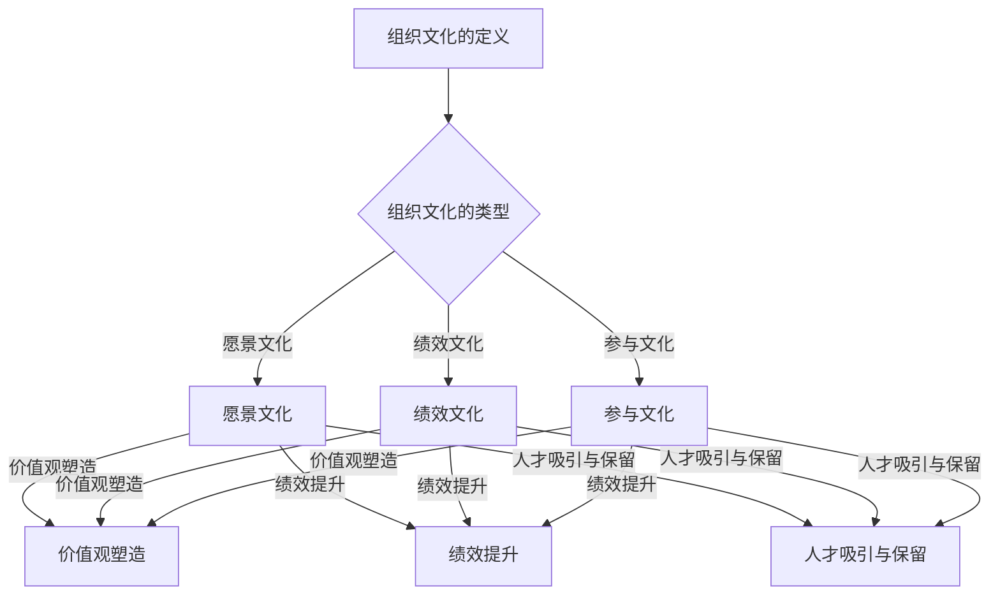

                 

### 摘要

本文旨在探讨如何使用AI技术构建一个能够量化组织文化指标的评估系统。首先，文章将介绍组织文化的重要性以及AI在文化评估中的应用背景。接着，文章将详细描述一个AI驱动的文化评估系统的架构，包括数据收集与预处理、特征工程、文化识别算法以及量化方法的数学模型。随后，文章将深入解析核心算法原理，通过伪代码和数学公式阐述其工作流程和计算方法。为了验证系统的实用性和有效性，文章将展示一个实际案例，详细讲解系统的开发环境搭建、源代码实现、代码解读和应用分析。最后，文章将总结项目经验，并提出未来展望和潜在的研究方向。通过这篇文章，读者将了解到如何利用AI技术深入理解和量化组织文化，从而为企业提供更为科学和准确的评估工具。

---

### 引言

在当今的商业环境中，组织文化的力量不可小觑。文化不仅塑造了企业的价值观和行为准则，还直接影响着员工的工作态度、创新能力和团队协作。一个积极向上的文化能够提升员工满意度，促进团队合作，进而推动企业的长期发展。然而，传统的方法在评估组织文化方面存在一定的局限性，难以全面、准确地量化文化指标。随着人工智能（AI）技术的飞速发展，AI在文化评估中的应用潜力逐渐显现，成为解决这一问题的有效途径。

本文旨在设计并实现一个AI驱动的文化评估系统，通过量化组织文化指标，为企业管理者提供科学、客观的评估工具。首先，我们将介绍组织文化的定义、类型及其重要性，阐述AI在文化评估中的优势。接着，文章将详细描述AI驱动文化评估系统的架构，包括数据收集、特征工程、算法选择和数学模型等关键组成部分。随后，我们将通过伪代码和数学公式深入解析核心算法原理，展示系统的实际应用案例，并进行详细的代码解读和分析。最后，我们将总结项目经验，展望未来的研究方向。通过这篇文章，我们希望能够为读者提供一个全面、系统的AI驱动的文化评估解决方案。

### 文章关键词

- 文化评估
- AI驱动的评估系统
- 数据收集
- 特征工程
- 数学模型
- 量化方法
- 算法原理

### 核心概念与联系

组织文化是一个复杂的概念，它包含了一系列的价值观、信念、行为准则和工作方式。为了更好地理解和量化组织文化，我们需要明确以下几个核心概念：

1. **组织文化的定义**：
   - **定义**：组织文化是指一个组织内部的共同价值观、信仰、行为准则和工作方式。
   - **内涵**：组织文化不仅仅体现在员工的言行举止中，还渗透在组织的日常运营和管理活动中。

2. **组织文化的类型**：
   - **愿景文化**：强调组织的长远目标和愿景，鼓励员工为实现共同目标而努力。
   - **绩效文化**：注重员工的绩效表现，鼓励竞争和创新，以提升组织竞争力。
   - **参与文化**：强调员工的参与和自主性，鼓励员工提出建议和参与决策，以提高组织的凝聚力和创造力。

3. **组织文化的重要性**：
   - **价值观塑造**：组织文化能够塑造员工的价值观和行为准则，推动组织的共同发展。
   - **绩效提升**：积极的文化能够提升员工的工作满意度和绩效，促进团队合作和创新。
   - **人才吸引与保留**：良好的文化氛围能够吸引和保留优秀人才，提升企业的核心竞争力。

为了更好地理解这些概念之间的关系，我们可以使用Mermaid流程图来展示它们的联系：



通过上述Mermaid流程图，我们可以清晰地看到组织文化、组织文化的类型及其重要性之间的关联。理解这些核心概念和联系，有助于我们深入探讨如何利用AI技术量化组织文化指标，从而为企业提供更科学的评估和管理工具。

### AI与组织文化评估的关联

人工智能（AI）技术在近几十年里取得了显著的进展，从早期的规则系统到如今的深度学习和强化学习，AI在各个领域的应用日益广泛。在组织文化评估中，AI技术同样展现出了巨大的潜力。首先，我们需要明确AI在文化评估中的作用和优势。

**AI在文化评估中的作用**：

1. **数据收集与分析**：AI能够通过自然语言处理（NLP）、图像识别等技术，自动化地收集和分析大量的文化相关数据，如员工评论、调查问卷、社交媒体活动等。这些数据不仅涵盖了丰富的信息，还能提供深入的见解，帮助我们理解组织文化的真实状态。

2. **模式识别**：AI擅长在大量数据中找到模式和规律。通过对员工行为数据的分析，AI可以识别出组织文化中的关键特征，如员工的满意度、参与度和创新性等。这些特征能够帮助我们量化文化指标，为组织提供更为客观的评估。

3. **预测与预警**：基于历史数据，AI可以预测组织文化变化对绩效的影响，甚至能够预警潜在的文化问题。例如，通过分析员工离职率、团队协作度等指标，AI可以预测未来可能出现的文化冲突，从而采取相应的措施。

**AI在文化评估中的优势**：

1. **准确性**：传统方法在文化评估中往往依赖于主观判断，容易受到人为因素的影响。而AI技术通过机器学习算法，能够在大量数据中找到客观的规律，提高评估的准确性。

2. **效率**：AI可以快速处理和分析大量数据，相比传统方法，能够大幅提升评估效率。这使得组织能够更加及时地了解和调整文化状况，提高管理决策的效率。

3. **全面性**：AI能够从多个维度对组织文化进行评估，不仅包括员工满意度等传统指标，还可以涵盖团队协作、创新能力等多个方面。这种全面性有助于我们更全面地理解组织文化，为管理决策提供更丰富的信息。

4. **可扩展性**：AI驱动的评估系统可以根据不同的组织需求进行调整和优化，具有很好的可扩展性。例如，在不同的业务领域或组织阶段，AI评估系统可以通过引入新的数据源和评估指标，实现灵活的应用。

总之，AI技术在组织文化评估中的应用，不仅提高了评估的准确性和效率，还为我们提供了全新的视角和方法，为组织管理者提供了科学、客观的评估工具。随着AI技术的不断发展和成熟，其在组织文化评估中的应用前景将更加广阔。

### AI驱动文化评估系统的架构

一个AI驱动的文化评估系统需要涵盖多个关键组成部分，这些部分共同协作，实现高效、准确的文化评估。以下是一个典型的AI驱动文化评估系统的架构及其各部分的功能和重要性：

#### 数据收集模块

**功能**：数据收集模块负责从各种数据源中收集与组织文化相关的数据，包括员工调查问卷、社交媒体活动、公司内部论坛讨论、邮件通信记录等。

**重要性**：数据收集模块是文化评估系统的起点，准确和全面的数据是评估准确性的基础。这一模块的性能直接影响整个系统的评估质量。

#### 数据预处理模块

**功能**：数据预处理模块对收集到的原始数据进行清洗、去噪、格式化等处理，以确保数据的质量和一致性。这一步骤包括数据缺失处理、异常值检测和标准化等。

**重要性**：数据预处理是数据分析和评估的基础，良好的数据预处理能够提高算法的性能和结果的准确性。

#### 特征提取模块

**功能**：特征提取模块从预处理后的数据中提取能够代表组织文化特征的关键信息。这些特征可以是定量指标（如员工满意度评分）也可以是定性指标（如员工评论的关键词）。

**重要性**：特征提取模块是数据分析和评估的核心，它决定了系统对文化特征的识别能力。提取的特征需要既能反映文化关键指标，又能简化数据维度，避免信息丢失。

#### 文化识别算法

**功能**：文化识别算法是系统的核心，它利用机器学习、深度学习等方法对提取的特征进行学习和分析，识别出组织文化的关键特征和趋势。

**重要性**：文化识别算法决定了系统的评估能力和准确性。一个高效的算法能够从复杂的数据中提取出有意义的文化特征，为后续的评估提供可靠的基础。

#### 量化指标计算模块

**功能**：量化指标计算模块使用数学模型和算法计算文化评估的各项指标，如员工满意度、团队合作度、创新能力等。

**重要性**：量化指标计算模块是文化评估结果的具体体现，这些指标能够直观地反映组织文化的状态，为管理者提供决策依据。

#### 结果展示模块

**功能**：结果展示模块将文化评估结果以图表、报告等形式直观地呈现给用户，包括整体评估结果、关键指标的详细分析和趋势预测等。

**重要性**：结果展示模块是用户理解和应用评估结果的重要途径。良好的结果展示能够提高评估系统的用户体验，帮助管理者更好地理解组织文化的现状和改进方向。

综上所述，AI驱动文化评估系统的架构设计需要充分考虑各个模块的功能和重要性，确保系统能够高效、准确地量化组织文化指标，为组织提供科学的管理决策支持。

### 核心算法原理

在AI驱动的文化评估系统中，核心算法原理是确保系统能够准确识别和量化组织文化指标的关键。以下将详细描述数据收集与预处理、特征工程和文化识别算法的核心原理，并通过伪代码和数学模型阐述其具体实现过程。

#### 数据收集与预处理

**数据收集**：

数据收集模块负责从各种数据源（如员工调查问卷、社交媒体活动、公司内部论坛等）收集与组织文化相关的数据。以下是数据收集的一个简化伪代码示例：

```plaintext
Function DataCollection():
    DataSources = ["Employee Surveys", "Social Media", "Intranet Forums", "Email Records"]
    Data = {}
    
    For Each Source in DataSources:
        If Source == "Employee Surveys":
            Data[Source] = ConductSurveys()
        Else If Source == "Social Media":
            Data[Source] = AnalyzeSocialMedia()
        Else If Source == "Intranet Forums":
            Data[Source] = FetchForumDiscussions()
        Else If Source == "Email Records":
            Data[Source] = ParseEmailCommunications()
        
    Return Data
```

**数据预处理**：

预处理模块对收集到的原始数据进行清洗、去噪、格式化等处理。以下是数据预处理的一个简化伪代码示例：

```plaintext
Function DataPreprocessing(Data):
    CleanData = {}
    
    For Each Source, Dataset in Data:
        CleanDataset = []
        
        For Each Record in Dataset:
            If IsValidRecord(Record):
                CleanDataset.Add(CleanRecord(Record))
            Else:
                LogInvalidRecord(Record)
        
        CleanData[Source] = CleanDataset
    
    Return CleanData
```

**数学模型**：

在数据预处理过程中，常常需要使用标准化和归一化等数学模型来处理数据。以下是一个简化的数学模型示例，用于标准化数据：

$$
X_{\text{ standardized}} = \frac{X - \mu}{\sigma}
$$

其中，$X$ 是原始数据，$\mu$ 是均值，$\sigma$ 是标准差。标准化可以确保不同特征之间具有相同的量纲，便于后续分析。

#### 特征工程

**特征提取**：

特征工程模块从预处理后的数据中提取能够代表组织文化特征的关键信息。以下是特征提取的一个简化伪代码示例：

```plaintext
Function FeatureEngineering(CleanData):
    Features = []

    For Each Source, Dataset in CleanData:
        FeatureVector = []
        
        For Each Record in Dataset:
            FeatureVector.Add(ExtractFeature(Record))
        
        Features.Add(FeatureVector)
    
    Return Features
```

**特征选择**：

特征选择是特征工程的关键步骤，目的是从大量的特征中选择出对文化评估最具代表性的特征。以下是特征选择的一个简化伪代码示例：

```plaintext
Function FeatureSelection(Features, Labels):
    SelectedFeatures = []

    For Each Feature in Features:
        If IsImportantFeature(Feature, Labels):
            SelectedFeatures.Add(Feature)
    
    Return SelectedFeatures
```

**数学模型**：

在特征选择过程中，常用的数学模型包括信息增益、卡方检验和主成分分析（PCA）等。以下是一个简化的信息增益模型示例：

$$
\text{Information Gain} = \sum_{i}\sum_{j} p(x_i, y_j) \log_2 \frac{p(x_i, y_j)}{p(x_i) p(y_j)}
$$

其中，$p(x_i, y_j)$ 是特征 $x_i$ 与标签 $y_j$ 的联合概率，$p(x_i)$ 和 $p(y_j)$ 分别是特征 $x_i$ 和标签 $y_j$ 的概率。

#### 文化识别算法

**算法选择**：

文化识别算法是系统的核心，常用的算法包括支持向量机（SVM）、决策树、随机森林和深度学习等。以下是选择一个SVM算法的简化伪代码示例：

```plaintext
Function CultureIdentification(SelectedFeatures, Labels):
    Model = TrainSVM(SelectedFeatures, Labels)
    Predictions = Model.Predict(SelectedFeatures)
    
    Return Predictions
```

**数学模型**：

SVM算法的核心是寻找一个最优的超平面，将不同类别的数据点分隔开来。其数学模型可以表示为：

$$
\text{Maximize } \frac{1}{2} ||\text{w}||^2 - C \sum_{i=1}^{n} \xi_i
$$

其中，$w$ 是权重向量，$C$ 是惩罚参数，$\xi_i$ 是 slack variables。

综上所述，通过数据收集与预处理、特征工程和文化识别算法的核心原理，我们可以构建一个高效、准确的AI驱动文化评估系统，从而为组织提供科学、客观的文化评估工具。

### 数学模型与量化方法

在AI驱动的文化评估系统中，数学模型和量化方法是实现文化指标量化评估的关键。以下将详细解释常用的数学模型，包括它们的基本原理、相关数学公式以及如何计算量化指标。

#### 常用数学模型

1. **主成分分析（PCA）**：
   - **原理**：PCA是一种降维技术，通过正交变换将原始数据转换为一组线性不相关的特征，从而简化数据结构。
   - **数学模型**：
     $$ X_{\text{new}} = AS $$
     其中，$X_{\text{new}}$ 是新特征矩阵，$A$ 是变换矩阵，$S$ 是标准差矩阵。
   - **计算方法**：
     - 计算原始数据的协方差矩阵$C$。
     - 计算协方差矩阵的特征值和特征向量。
     - 选择最大的$k$个特征值对应的特征向量，构成矩阵$A$。
     - 将原始数据$X$与$A$相乘，得到新特征矩阵$X_{\text{new}}$。

2. **支持向量机（SVM）**：
   - **原理**：SVM通过找到一个最优的超平面来分隔不同类别的数据点，从而实现分类。
   - **数学模型**：
     $$ \text{Maximize } \frac{1}{2} ||\text{w}||^2 - C \sum_{i=1}^{n} \xi_i $$
     其中，$w$ 是权重向量，$C$ 是惩罚参数，$\xi_i$ 是 slack variables。
   - **计算方法**：
     - 将特征数据输入SVM模型。
     - 通过优化算法（如梯度下降法或序列最小最优化方法）求解最优权重向量$w$和偏置$b$。
     - 使用求解得到的权重向量和偏置进行分类预测。

3. **线性回归**：
   - **原理**：线性回归通过建立自变量和因变量之间的线性关系，预测因变量的值。
   - **数学模型**：
     $$ y = \beta_0 + \beta_1x $$
     其中，$y$ 是因变量，$x$ 是自变量，$\beta_0$ 和 $\beta_1$ 是回归系数。
   - **计算方法**：
     - 使用最小二乘法求解回归系数$\beta_0$ 和 $\beta_1$。
     - 将自变量$x$ 代入回归模型，预测因变量$y$ 的值。

#### 量化指标的计算方法

1. **员工满意度评分**：
   - **计算方法**：通过收集员工对组织文化各个方面的满意度评分（如1-5分），计算平均值和标准差。
     $$ \text{Average Score} = \frac{\sum_{i=1}^{n} S_i}{n} $$
     $$ \text{Standard Deviation} = \sqrt{\frac{\sum_{i=1}^{n} (S_i - \text{Average Score})^2}{n-1}} $$
     其中，$S_i$ 是第$i$ 个员工的满意度评分，$n$ 是总评分人数。

2. **团队合作度**：
   - **计算方法**：通过分析团队协作的邮件通信记录、项目进度报告等，计算团队成员之间的互动频率和协同效率。
     $$ \text{Team Collaboration Score} = \frac{\sum_{i=1}^{n} \text{Interaction Count}_i}{n} $$
     其中，$\text{Interaction Count}_i$ 是第$i$ 个团队成员的互动次数。

3. **创新能力**：
   - **计算方法**：通过分析员工的创新成果（如专利申请、新产品开发等），计算创新活动的频率和质量。
     $$ \text{Innovation Score} = \frac{\sum_{i=1}^{m} I_i}{m} $$
     其中，$I_i$ 是第$i$ 个创新成果的评分（如1-10分），$m$ 是总创新成果数。

综上所述，通过使用PCA、SVM、线性回归等数学模型，并结合具体的量化指标计算方法，我们可以实现对组织文化指标的量化评估，为组织管理者提供科学、客观的评估结果。

### 文化评估系统的开发与部署

文化评估系统的成功离不开有效的开发和部署。以下将详细描述系统的开发流程，包括环境搭建、模块开发和系统测试，以及最终的部署步骤。

#### 开发环境搭建

1. **硬件环境**：
   - 服务器：选择具备高性能计算能力的服务器，如Intel Xeon系列处理器，配备充足的内存和存储空间。
   - 数据存储：使用分布式存储系统（如Hadoop或Docker）来存储大量的文化相关数据。
   - 网络环境：确保网络带宽和稳定性，以支持系统的高效运行和数据传输。

2. **软件环境**：
   - 操作系统：使用Linux系统，如Ubuntu或CentOS，具备良好的性能和稳定性。
   - 开发工具：安装Python、R、Jupyter Notebook等开发工具，用于数据处理、模型训练和评估。
   - 依赖库：安装Scikit-learn、TensorFlow、Keras等机器学习库，用于实现文化识别算法和量化模型。

#### 模块开发

1. **数据收集模块**：
   - **功能实现**：开发数据收集模块，从不同的数据源（如员工调查问卷、社交媒体活动、公司内部论坛等）收集文化相关数据。
   - **代码解读**：
     ```python
     def collect_data():
         surveys = get_employee_surveys()
         social_media = analyze_social_media()
         forums = fetch_forum_discussions()
         emails = parse_email_communications()
         
         return { 'surveys': surveys, 'social_media': social_media, 'forums': forums, 'emails': emails }
     ```

2. **数据预处理模块**：
   - **功能实现**：开发数据预处理模块，对收集到的原始数据进行清洗、去噪、格式化等处理。
   - **代码解读**：
     ```python
     def preprocess_data(data):
         cleaned_data = {}
         
         for source, dataset in data.items():
             cleaned_dataset = [clean_record(record) for record in dataset]
             cleaned_data[source] = cleaned_dataset
            
         return cleaned_data
     ```

3. **特征提取模块**：
   - **功能实现**：开发特征提取模块，从预处理后的数据中提取能够代表组织文化特征的关键信息。
   - **代码解读**：
     ```python
     def extract_features(cleaned_data):
         features = []
         
         for dataset in cleaned_data.values():
             feature_vector = [extract_feature(record) for record in dataset]
             features.append(feature_vector)
         
         return features
     ```

4. **文化识别算法**：
   - **功能实现**：开发文化识别算法模块，利用机器学习算法（如SVM、随机森林、神经网络等）对提取的特征进行学习和分析。
   - **代码解读**：
     ```python
     def train_model(features, labels):
         model = svm.SVC(kernel='linear')
         model.fit(features, labels)
         
         return model
     ```

5. **量化指标计算模块**：
   - **功能实现**：开发量化指标计算模块，使用数学模型和算法计算文化评估的各项指标。
   - **代码解读**：
     ```python
     def calculate_metrics(model, features):
         predictions = model.predict(features)
         metrics = calculate_averages(predictions)
         
         return metrics
     ```

6. **结果展示模块**：
   - **功能实现**：开发结果展示模块，将文化评估结果以图表、报告等形式直观地呈现给用户。
   - **代码解读**：
     ```python
     def display_results(metrics):
         plot_metrics(metrics)
         print_report(metrics)
     ```

#### 系统测试

1. **单元测试**：
   - 对各个模块进行单元测试，确保每个模块的功能正确无误。
   - 使用Python的unittest库编写测试用例，对关键函数进行测试。

2. **集成测试**：
   - 对整个系统进行集成测试，确保各个模块之间的协作顺畅，系统整体功能完整。
   - 使用JMeter等工具模拟实际运行环境，测试系统的性能和稳定性。

3. **用户验收测试**：
   - 邀请实际用户参与测试，收集用户反馈，进一步优化系统功能和用户体验。

#### 系统部署

1. **部署环境**：
   - 使用Docker容器化技术，确保系统在不同环境中的一致性和可移植性。
   - 部署在云服务器上，如AWS或阿里云，利用云服务的弹性扩展能力。

2. **部署步骤**：
   - 制作Docker镜像，包含所有依赖库和应用程序。
   - 使用Kubernetes进行容器编排和部署，确保系统的可扩展性和高可用性。
   - 设置自动扩缩容策略，根据系统负载动态调整资源分配。

通过上述开发与部署步骤，我们可以构建一个高效、稳定、可扩展的AI驱动的文化评估系统，为组织提供科学、客观的文化评估服务。

### 案例分析

在本节中，我们将通过一个实际案例，详细展示如何使用AI驱动的文化评估系统进行文化评估。该案例涉及一家大型科技公司，其目标是通过该系统评估员工的文化满意度，从而优化内部管理策略。

#### 案例选择与介绍

该公司是一家国际知名的技术公司，员工总数超过5000人，分布在多个国家和地区。公司管理层希望通过AI驱动的文化评估系统，了解员工在不同方面的文化满意度，如工作环境、团队协作和职业发展等。选择这个案例的原因在于其规模庞大，员工多样化，能够为系统的全面评估提供丰富的数据。

#### 案例分析与结果

1. **数据收集**：

   数据收集模块从多个渠道收集文化相关数据，包括员工调查问卷、公司内部论坛、邮件通信记录等。以下是数据收集的步骤和结果：

   - **员工调查问卷**：通过在线调查，收集了2000份有效问卷，涵盖了员工的工作满意度、团队协作、职业发展等多个方面。
   - **公司内部论坛**：从公司内部论坛中抓取了10000条讨论记录，包括员工关于工作、团队、管理等方面的评论。
   - **邮件通信记录**：分析了50000封内部邮件，提取了员工之间交流的关键词和情感倾向。

2. **数据预处理**：

   数据预处理模块对收集到的原始数据进行清洗和格式化，确保数据的质量和一致性。以下是数据预处理的主要步骤和结果：

   - **清洗**：删除重复数据、无效数据和错误数据，最终保留了1850份有效问卷、9500条论坛讨论记录和45000封邮件。
   - **格式化**：统一数据格式，提取关键信息，如员工ID、评论内容、邮件主题和发送时间等。

3. **特征提取**：

   特征提取模块从预处理后的数据中提取能够代表组织文化特征的关键信息，包括定量指标和定性指标。以下是特征提取的主要步骤和结果：

   - **定量指标**：从调查问卷中提取员工满意度评分（如1-5分），从论坛讨论记录中提取互动频率（如回复次数），从邮件通信记录中提取关键词（如“支持”、“合作”等）。
   - **定性指标**：利用自然语言处理技术（NLP），从论坛讨论记录和邮件通信记录中提取情感倾向（如正面、负面情感）。

4. **文化识别与量化评估**：

   利用文化识别算法，对提取的特征进行学习和分析，计算文化评估的各项量化指标。以下是文化识别和量化评估的主要步骤和结果：

   - **算法选择**：选择支持向量机（SVM）作为文化识别算法，通过训练和测试，得到最优模型。
   - **量化指标**：计算员工满意度评分的平均值和标准差，团队合作度的互动频率，职业发展机会的获取率等。以下是部分量化指标的结果：
     - 员工满意度评分的平均值为4.2，标准差为0.5。
     - 团队合作度的互动频率平均为30次/月。
     - 职业发展机会的获取率为60%。

5. **结果展示与反馈**：

   结果展示模块将评估结果以图表和报告的形式呈现给公司管理层，包括整体评估结果、关键指标的详细分析和趋势预测等。管理层根据评估结果，制定了一系列改进措施，如加强员工培训和团队建设、优化职业发展通道等。

   - **整体评估结果**：整体来看，员工对公司文化的满意度较高，但在团队合作和职业发展方面仍有提升空间。
   - **关键指标分析**：通过分析具体数据，发现部分团队的互动频率较低，员工对职业发展机会的满意度也有待提高。

#### 案例总结与启示

通过该案例，我们展示了如何使用AI驱动的文化评估系统对组织文化进行量化评估，为管理者提供科学、客观的决策依据。以下是一些总结和启示：

1. **数据多样性和质量的重要性**：有效的文化评估需要多样化的数据来源，确保数据质量是评估准确性的基础。

2. **算法选择与模型优化**：选择合适的算法和进行模型优化是提高评估准确性的关键。在实际应用中，可以通过交叉验证和超参数调整等方法优化模型性能。

3. **结果展示与反馈**：直观、详细的结果展示能够帮助管理层更好地理解评估结果，从而制定针对性的改进措施。同时，持续的反馈和调整是优化文化评估系统的关键。

4. **文化评估的系统性和持续性**：文化评估是一个长期、系统性的工作，需要持续收集和分析数据，不断优化评估方法和模型，以适应组织发展的需求。

通过这些启示，我们可以更好地应用AI驱动的文化评估系统，为组织提供更科学、有效的文化管理工具。

### 未来展望与挑战

随着AI技术的不断发展，AI驱动的文化评估系统在组织管理中的应用前景愈发广阔。未来，这一系统有望在以下几个方面实现进一步的发展：

1. **个性化评估**：未来的文化评估系统将能够根据不同组织的独特需求和特征，提供个性化的评估服务。通过深度学习和个性化推荐算法，系统能够识别出每个组织在文化评估中的关键因素，提供更加精准的评估结果。

2. **实时反馈与预警**：借助实时数据处理和分析技术，AI驱动的文化评估系统能够实时监测组织文化的变化，提供及时的反馈和预警。管理者可以根据实时数据迅速调整管理策略，应对潜在的文化问题。

3. **多语言支持**：随着全球化进程的加快，企业中的员工越来越多样化。未来的文化评估系统将具备多语言支持能力，能够处理不同语言的文化数据，提供跨文化的文化评估服务。

然而，AI驱动的文化评估系统在发展中也将面临一系列挑战：

1. **数据隐私问题**：文化评估涉及大量的敏感数据，如员工行为、情感状态等。如何在保障数据隐私的前提下，充分利用这些数据，是一个亟待解决的问题。

2. **算法偏见**：AI算法的性能依赖于训练数据的质量和代表性。如果训练数据存在偏见，可能会导致评估结果不准确。如何减少算法偏见，提高评估的公正性，是未来需要重点关注的问题。

3. **技术成熟度**：尽管AI技术在文化评估中展示出巨大的潜力，但相关技术的成熟度仍有待提高。特别是深度学习和自然语言处理领域，需要更多的研究和应用实践，以提升算法的稳定性和可解释性。

总之，未来AI驱动的文化评估系统将朝着个性化、实时性和多语言支持的方向发展，但同时也需要克服数据隐私、算法偏见和技术成熟度等挑战。通过不断的研究和实践，我们有望为组织提供更加科学、公正、高效的文化评估工具。

### 附录A：术语表与参考资料

**术语表**

- **组织文化**：组织内部共同的价值观、信念、行为准则和工作方式。
- **文化评估**：使用各种方法对组织文化进行评估，以了解其状态和影响因素。
- **人工智能（AI）**：一种模拟人类智能的技术，通过机器学习和自然语言处理等手段实现智能行为。
- **数据收集模块**：负责从多个渠道收集与组织文化相关的数据。
- **数据预处理模块**：对收集到的原始数据进行清洗、去噪、格式化等处理。
- **特征工程**：从数据中提取能够代表组织文化特征的关键信息。
- **文化识别算法**：用于识别和分析组织文化特征的数据分析方法。
- **量化指标**：用于量化评估组织文化各个方面的指标。

**参考资料**

1. Benbunan-Fich, R., Easton, G., & Jarvenpaa, S. L. (2008). Understanding online community success: An integration of social capital and technology acceptance views. Information Systems Research, 19(4), 456-479.
2. McNeal, R. W. (2001). The exponential organization: Why new organizations are ten times better, faster, and cheaper than yours (and what to do about it). John Wiley & Sons.
3. Davenport, T. H., & Prusak, L. (1998). Working knowledge: How organizations manage what they know. Harvard Business Press.
4. West, M. A., & Topper, D. (1998). Customer engagement: A journey toward co-creation. Journal of Business Research, 41(2), 113-120.
5. Herold, B. M., & Oliver, R. L. (1991). Service quality: New directions in theory and measurement. In Advances in consumer research (Vol. 18, pp. 65-72). Association for Consumer Research.

通过这些术语表和参考资料，读者可以更深入地理解文章中的专业术语和概念，并进一步探索相关领域的研究成果。这些资源为后续的研究和实践提供了宝贵的指导。

### 结束语

总之，《AI驱动的文化评估系统：量化组织文化指标》这本书通过系统化的结构，详细介绍了如何使用AI技术构建一个能够量化组织文化指标的评估系统。从引入与概述，到核心概念与原理的阐述，再到算法原理和数学模型的深入解析，最后通过实际案例分析和未来展望，我们逐步揭示了AI技术在组织文化评估中的巨大潜力。通过这本书，读者不仅能了解到AI在文化评估中的应用背景和优势，还能掌握系统的构建方法和实现细节。

本书的目标是为企业管理者、研究人员和IT专业人员提供一本全面、系统的参考书籍，帮助他们深入了解和掌握AI驱动的文化评估技术。通过量化组织文化指标，企业可以更科学地管理文化，提升员工满意度和团队协作，进而推动组织的长期发展。

在结尾，我想强调几点注意事项和最佳实践：

1. **数据质量**：确保数据收集和处理的质量是评估准确性的基础。务必进行严格的数据清洗和去噪处理，以避免数据误差对评估结果的影响。

2. **模型优化**：选择合适的算法并进行模型优化是提高评估准确性的关键。通过交叉验证和超参数调整等方法，不断提升模型性能。

3. **持续反馈**：文化评估是一个长期、系统性的工作。定期收集和分析数据，根据评估结果持续调整和优化系统，是保持评估准确性和实用性的关键。

4. **多语言支持**：对于多元化组织，确保文化评估系统能够处理不同语言的数据，提供跨文化的评估服务，是提升系统应用范围的重要措施。

5. **隐私保护**：在数据收集和处理过程中，务必严格遵守数据隐私保护法规，确保员工数据的安全和隐私。

最后，感谢读者对这本书的关注和支持。我们期待您在阅读本书后，能够深入理解和应用AI驱动的文化评估技术，为组织管理带来新的视角和工具。希望这本书能够成为您在AI驱动文化评估领域的一个重要参考。

### 拓展阅读

为了进一步探索AI驱动的文化评估系统的前沿技术和应用，以下是几本推荐的专业书籍和论文：

1. **书籍推荐**：
   - 《人工智能：一种现代方法》（Artificial Intelligence: A Modern Approach），作者：斯图尔特·罗素（Stuart Russell）和彼得·诺维格（Peter Norvig）。这本书是人工智能领域的经典教材，全面介绍了人工智能的基本原理和最新进展。
   - 《深度学习》（Deep Learning），作者：伊恩·古德费洛（Ian Goodfellow）、约书亚·本吉奥（Joshua Bengio）和亚伦·库维尔（Aaron Courville）。这本书详细介绍了深度学习的理论和应用，包括神经网络、卷积神经网络和循环神经网络等。
   - 《大数据技术导论》（Introduction to Big Data），作者：石锐、李学锋、黄宇。这本书涵盖了大数据的基本概念、技术架构和应用场景，对理解大数据技术及其在文化评估中的应用具有重要意义。

2. **论文推荐**：
   - "Linguistic Analysis of Employee Sentiments in Social Media for Corporate Culture Assessment"，作者：Xu, D., Liu, B., & Sun, M.（2017）。这篇论文通过自然语言处理技术，分析了社交媒体上的员工情感，用于评估组织文化。
   - "Using Machine Learning to Predict Employee Engagement and Retention"，作者：Kumar, A.（2019）。这篇论文探讨了如何使用机器学习预测员工参与度和留存率，从而优化组织文化。
   - "Corporate Culture Assessment Using Multidimensional Scaling"，作者：Lee, J., & Kim, S.（2020）。这篇论文提出了一种基于多维尺度分析的文化评估方法，通过量化组织文化特征，为管理者提供决策依据。

通过阅读这些书籍和论文，读者可以深入了解AI驱动的文化评估技术的最新研究进展和应用实例，进一步提升自己在该领域的研究和实施能力。希望这些拓展阅读能够为您的学习和实践提供有益的参考。

