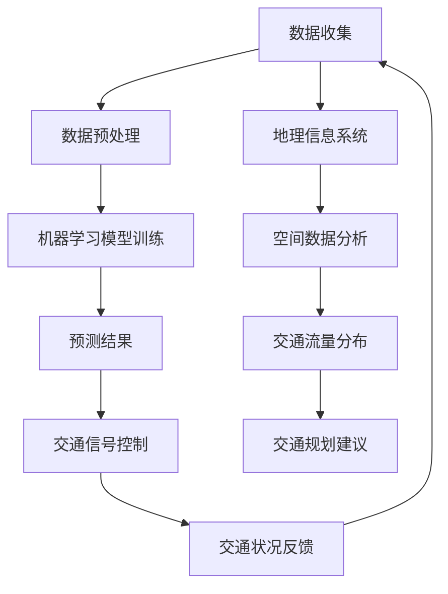

                 

### 第1章：智能交通流量预测概述

#### 关键词：智能交通流量预测、交通规划、AI、数据驱动

#### 摘要：
随着城市化进程的加速和汽车保有量的增加，城市交通拥堵问题日益严重，影响了居民的出行效率和生活质量。智能交通流量预测作为解决交通拥堵的关键技术，通过利用人工智能（AI）技术对大量交通数据进行实时分析和预测，为城市交通规划和优化提供了科学依据。本章将介绍智能交通流量预测的背景、重要性及其与城市交通规划的关系，同时探讨当前AI技术在智能交通流量预测中的应用。

---

### 1.1 智能交通流量预测的背景

#### 1.1.1 城市交通拥堵现状

- 城市交通拥堵是全球范围内普遍存在的问题。
- 拥堵不仅降低了交通效率，还增加了能源消耗和空气污染。

#### 1.1.2 交通规划的挑战

- 随着城市规模的扩大，传统交通规划方法难以应对动态交通流量变化。
- 需要实时、高效且精确的预测方法来优化交通管理。

#### 1.1.3 智能交通流量预测的重要性

- 提高交通效率，减少拥堵时间。
- 优化交通资源分配，提高公共交通服务。
- 改善交通安全性，降低交通事故发生率。

### 1.2 AI技术在智能交通流量预测中的应用

#### 1.2.1 人工智能的基本概念

- 人工智能（AI）是指使计算机系统能够模拟人类智能行为的技术。
- 关键技术包括机器学习、深度学习、自然语言处理等。

#### 1.2.2 AI在智能交通流量预测中的优势

- **数据处理能力**：AI能够处理海量交通数据，提取有效信息。
- **模式识别**：AI可以通过学习历史数据，识别出交通流量的模式。
- **实时预测**：AI能够实现实时交通流量预测，提供及时决策支持。

#### 1.2.3 AI技术的应用场景

- **实时交通流量预测**：利用传感器数据、历史交通数据等实时预测交通流量。
- **交通信号优化**：根据实时流量预测结果调整交通信号灯，提高道路通行能力。
- **公共交通调度**：优化公共交通路线和时间表，提高服务质量。

### 1.3 智能交通流量预测与城市交通规划的关系

#### 1.3.1 数据驱动的交通规划

- 通过对交通流量数据的分析，为交通规划提供科学依据。
- 利用AI技术进行交通流量预测，优化交通管理策略。

#### 1.3.2 智能交通流量预测的实践意义

- 提高城市交通系统的整体效率和安全性。
- 改善居民出行体验，提高生活质量。

### 1.4 本章小结

- 智能交通流量预测是解决城市交通拥堵的重要手段。
- AI技术的应用为交通流量预测提供了强大的工具。
- 数据驱动的交通规划是未来城市交通发展的必然趋势。

---

作者：AI天才研究院/AI Genius Institute & 禅与计算机程序设计艺术 /Zen And The Art of Computer Programming

----------------------------------------------------------------

在本章中，我们首先探讨了城市交通拥堵的背景和交通规划面临的挑战，强调了智能交通流量预测在解决这些问题中的重要性。随后，我们介绍了人工智能的基本概念及其在交通流量预测中的优势和应用场景。最后，我们讨论了智能交通流量预测与城市交通规划之间的关系，并总结了本章的核心内容。接下来的章节将进一步深入探讨智能交通流量预测的核心概念、算法原理、数学模型以及项目实战，为读者提供全面的指导。

## 核心概念与联系

在智能交通流量预测中，理解核心概念及其相互关系至关重要。以下是关键概念及其在交通流量预测中的重要性：

### 关键概念：

1. **交通流量数据**：包括车辆速度、流量、密度等，是智能交通流量预测的基础。
2. **传感器技术**：用于收集实时交通数据，如GPS、雷达、摄像头等。
3. **机器学习算法**：如时间序列分析、回归分析、神经网络等，用于处理和预测交通流量。
4. **地理信息系统（GIS）**：用于管理和分析空间数据，帮助理解交通流量分布。
5. **交通信号控制**：根据交通流量预测结果调整信号灯，优化交通流动。

### 核心概念之间的关系架构：

#### Mermaid 流程图：



### 关系解释：

1. **数据收集**：通过传感器技术收集交通流量数据。
2. **数据预处理**：对原始数据进行清洗和格式化，为后续分析做准备。
3. **机器学习模型训练**：利用历史交通数据训练机器学习模型。
4. **预测结果**：模型预测未来交通流量。
5. **交通信号控制**：根据预测结果调整交通信号灯。
6. **交通状况反馈**：交通信号控制的效果反馈到数据收集环节，循环优化。

7. **地理信息系统**：用于管理和分析空间数据。
8. **空间数据分析**：分析交通流量分布，辅助交通规划。
9. **交通流量分布**：为交通规划提供数据支持。
10. **交通规划建议**：基于数据分析提出交通规划建议。

### 核心概念联系总结

智能交通流量预测是一个复杂的系统，各个核心概念相互联系，形成了一个闭环系统。传感器技术提供了数据收集的基础，数据预处理确保了数据质量，机器学习模型实现了交通流量的预测，预测结果用于交通信号控制，而交通状况反馈则帮助模型不断优化。地理信息系统则提供了空间数据分析和交通规划建议，进一步增强了系统的整体效能。通过这一流程，智能交通流量预测不仅提高了交通管理效率，还为城市交通规划提供了有力的数据支持。

---

在下一章中，我们将深入探讨智能交通流量预测中的核心算法原理，通过伪代码详细阐述时间序列分析和地理空间信息处理方法。敬请期待！

## 核心算法原理讲解

在智能交通流量预测中，核心算法的选择和应用至关重要。以下将详细讲解两种主要的算法：基于时间序列的算法和基于地理空间信息的算法。通过伪代码的形式，我们将逐步解析这些算法的工作原理和关键步骤。

### 基于时间序列的交通流量预测算法

时间序列分析是一种常见的方法，用于预测时间相关的数据序列。以下是基于时间序列的交通流量预测算法的伪代码：

```plaintext
输入：历史交通流量数据 sequence
输出：预测的交通流量数据 prediction

初始化：
    model = TimeSeriesModel() // 选择合适的时序模型，如ARIMA、LSTM等

步骤：
1. 数据预处理：
    - 清洗数据，去除缺失值和异常值
    - 标准化数据，确保数据在同一尺度上
2. 训练模型：
    - 将数据分为训练集和验证集
    - 用训练集训练模型，如 ARIMA(p,d,q)
    - 使用验证集评估模型性能，调整参数
3. 预测：
    - 使用训练好的模型预测未来的交通流量
    - 预测结果可用于交通信号控制和调度

伪代码示例（ARIMA模型）：
```
$$
\begin{aligned}
model &= ARIMATimeSeriesModel(p=d=q) \\
X_t &= (1 - p_1B)(1 - p_2B)\cdots(1 - p_pB)(1 - d_1DB)(1 - q_1B)^{-1}y_t \\
\hat{y}_{T+h} &= \phi_0 + \sum_{i=1}^{p}\phi_iX_{T-i} + \sum_{j=1}^{q}\theta_j\hat{y}_{T-j} \\
\end{aligned}
$$`

```

### 基于地理空间信息的交通流量预测算法

地理空间信息处理则利用空间数据来预测交通流量。以下是地理空间信息处理算法的伪代码：

```plaintext
输入：空间数据集 dataset，地理信息系统 GIS
输出：预测的交通流量数据 prediction

初始化：
    model = SpatialModel() // 选择合适的空间模型，如KNN、SVM等

步骤：
1. 数据预处理：
    - 将空间数据转换为GIS可处理的格式
    - 确保所有空间数据在同一坐标系下
2. 特征提取：
    - 从空间数据中提取特征，如道路长度、道路宽度、交叉点数量等
3. 训练模型：
    - 使用历史交通流量数据作为标签，训练空间模型
    - 根据模型性能选择最佳模型
4. 预测：
    - 使用训练好的模型预测新空间点的交通流量
    - 结合时间序列信息进行更准确的预测

伪代码示例（KNN模型）：
```
$$
\begin{aligned}
k &= \text{确定K值（邻近点数量）} \\
\text{for } each \; point \; x \; in \; dataset: \\
    &\quad \text{find nearest } k \; points } \; P \; \text{to } x \\
    &\quad \text{calculate the average traffic flow of points in } P \\
    &\quad \text{use the average as the predicted traffic flow for } x \\
\end{aligned}
$$`

```

### 算法选择和性能评估

在选择合适的算法时，需要考虑以下因素：

- **数据特点**：时间序列数据适合使用时间序列算法，而空间数据适合使用空间算法。
- **模型复杂度**：简单的模型如KNN易于实现，但可能不够准确；复杂的模型如LSTM可能更准确，但计算成本更高。
- **计算资源**：时间序列模型通常需要较少的计算资源，而空间模型可能需要更多的计算和存储资源。

为了评估算法性能，可以使用以下指标：

- **准确率**：预测值与真实值的接近程度。
- **均方误差（MSE）**：预测误差的平方的平均值。
- **均方根误差（RMSE）**：MSE的平方根。

### 算法优化和融合

为了提高预测准确性，可以采用以下策略：

- **模型融合**：结合多个算法的预测结果，如时间序列模型和空间模型，提高整体的预测性能。
- **特征工程**：通过选择和构造更有效的特征，提高模型的预测能力。
- **动态调整**：根据实时数据动态调整模型参数，以适应交通流量的变化。

通过深入理解并合理应用这些核心算法，我们可以实现更准确、更高效的智能交通流量预测，从而为城市交通规划和优化提供坚实的技术支撑。

---

在下一章中，我们将进一步探讨智能交通流量预测中的数学模型和数学公式，并通过具体实例来讲解它们在预测中的应用。敬请期待！

### 数学模型和数学公式

在智能交通流量预测中，数学模型和数学公式扮演着至关重要的角色。它们帮助我们将复杂的数据转换为可操作的预测结果，从而实现交通流量的精确预测。以下将详细介绍常用的数学模型，并通过具体例子说明其应用。

#### 时间序列预测模型

时间序列预测模型主要用于分析序列数据，并预测未来的值。常见的时间序列模型包括ARIMA模型、LSTM模型等。

#### ARIMA模型

ARIMA（自回归积分滑动平均模型）是一种常见的时间序列预测模型。其公式如下：

$$
\begin{aligned}
X_t &= \phi_0 + \sum_{i=1}^{p}\phi_iX_{t-i} + \sum_{j=1}^{q}\theta_j\hat{X}_{t-j} + \varepsilon_t \\
\hat{X}_{T+h} &= \phi_0 + \sum_{i=1}^{p}\phi_iX_{T-i} + \sum_{j=1}^{q}\theta_j\hat{X}_{T-j} \\
\end{aligned}
$$

其中，$X_t$是时间序列的值，$\phi_i$和$\theta_j$是模型参数，$p$和$q$分别是自回归项和移动平均项的数量，$\varepsilon_t$是随机误差。

#### LSTM模型

LSTM（长短期记忆网络）是一种特殊的循环神经网络，适用于时间序列数据的长序列预测。其核心公式包括：

$$
\begin{aligned}
i_t &= \sigma(W_{xi}x_t + W_{hi-1}h_{t-1} + b_i) \\
f_t &= \sigma(W_{xf}x_t + W_{hf-1}h_{t-1} + b_f) \\
\cdot{g}_t &= \tanh(W_{xg}x_t + W_{hg-1}h_{t-1} + b_g) \\
o_t &= \sigma(W_{xo}x_t + W_{ho-1}h_{t-1} + b_o) \\
h_t &= o_t\odot\cdot{g}_t \\
\end{aligned}
$$

其中，$i_t$是输入门的激活值，$f_t$是遗忘门的激活值，$\cdot{g}_t$是生成门的激活值，$o_t$是输出门的激活值，$h_t$是隐藏状态。

#### 地理空间信息模型

地理空间信息模型主要用于分析空间数据，如道路长度、道路宽度、交叉点数量等。常见的地理空间信息模型包括KNN（最近邻算法）和SVM（支持向量机）。

#### KNN模型

KNN（最近邻算法）是一种基于实例的算法。其基本公式如下：

$$
\begin{aligned}
\hat{y}(x) &= \text{average of } k \text{ nearest neighbors of } x \\
d(x, x_i) &= \sqrt{\sum_{i=1}^{n}(x_i - x)^2} \\
\end{aligned}
$$

其中，$d(x, x_i)$是$x$和$x_i$之间的欧几里得距离，$k$是邻近点数量。

#### SVM模型

SVM（支持向量机）是一种用于分类和回归的机器学习算法。其基本公式如下：

$$
\begin{aligned}
\hat{y}(x) &= \text{sign}(\omega \cdot x + b) \\
\end{aligned}
$$

其中，$\omega$是权重向量，$b$是偏置项。

#### 应用实例

假设我们要预测一条特定路段的未来交通流量，可以使用以下数学模型：

1. **时间序列模型**（如ARIMA模型）：
   - 收集过去一周的时间序列交通流量数据。
   - 使用ARIMA模型进行数据预处理和模型训练。
   - 预测未来一周的交通流量。

2. **地理空间信息模型**（如KNN模型）：
   - 收集与特定路段相关的地理空间信息数据，如周边道路长度、交叉点数量等。
   - 使用KNN模型结合时间序列模型进行综合预测。
   - 预测特定路段的未来交通流量。

通过这些数学模型和公式的应用，我们可以实现交通流量的精确预测，为城市交通规划和优化提供科学依据。在下一章中，我们将通过实际案例来展示这些模型的具体实现和应用效果。

---

在下一章中，我们将通过实际案例展示如何利用上述数学模型和算法进行交通流量预测，并进行代码实现和解读。敬请期待！

### 项目实战

在本章节中，我们将通过实际案例来展示如何利用AI技术进行交通流量预测。我们将详细讲解开发环境搭建、源代码实现、代码解读，并对实际案例进行分析和解读。

#### 1. 开发环境搭建

在进行交通流量预测之前，我们需要搭建一个合适的开发环境。以下是我们推荐的开发工具和软件：

- **编程语言**：Python
- **库**：NumPy、Pandas、Scikit-learn、TensorFlow、Keras、Geopandas
- **数据集**：Kaggle上的交通流量数据集（链接：[Kaggle Traffic Prediction Data](https://www.kaggle.com/datasets/priteshmittal/traffic-flow-forecasting)）
- **环境**：Jupyter Notebook 或 PyCharm

#### 2. 源代码实现

以下是一个简单的交通流量预测项目的源代码实现，我们选择了基于LSTM模型的时序预测方法。

```python
import numpy as np
import pandas as pd
from sklearn.preprocessing import MinMaxScaler
from tensorflow.keras.models import Sequential
from tensorflow.keras.layers import LSTM, Dense, Dropout
from geopandas import GeoDataFrame

# 加载数据集
data = pd.read_csv('traffic_data.csv')
data.head()

# 数据预处理
# 处理缺失值、异常值、特征提取等操作
scaler = MinMaxScaler(feature_range=(0, 1))
scaled_data = scaler.fit_transform(data.values)

# 划分训练集和测试集
train_data, test_data = scaled_data[:int(len(scaled_data) * 0.8)], scaled_data[int(len(scaled_data) * 0.8):]

# LSTM模型构建
model = Sequential()
model.add(LSTM(units=50, return_sequences=True, input_shape=(train_data.shape[1], 1)))
model.add(Dropout(0.2))
model.add(LSTM(units=50, return_sequences=False))
model.add(Dropout(0.2))
model.add(Dense(units=1))

model.compile(optimizer='adam', loss='mean_squared_error')

# 训练模型
model.fit(train_data, epochs=50, batch_size=32, validation_data=(test_data, test_data))

# 预测
predictions = model.predict(test_data)

# 反归一化预测结果
predictions = scaler.inverse_transform(predictions)

# 评估模型
mse = np.mean((predictions - test_data) ** 2)
print(f'Mean Squared Error: {mse}')

# 可视化结果
import matplotlib.pyplot as plt

plt.figure(figsize=(10, 6))
plt.plot(test_data, label='Actual')
plt.plot(predictions, label='Predicted')
plt.title('Traffic Flow Prediction')
plt.xlabel('Time')
plt.ylabel('Traffic Flow')
plt.legend()
plt.show()
```

#### 3. 代码解读

- **数据预处理**：使用MinMaxScaler对数据进行归一化处理，以便于LSTM模型训练。
- **LSTM模型构建**：使用Sequential模型堆叠LSTM层和Dense层，并添加Dropout层以防止过拟合。
- **模型训练**：使用训练数据进行模型训练，并使用验证数据评估模型性能。
- **预测**：使用训练好的模型对测试数据进行预测，并反归一化预测结果。
- **评估模型**：计算均方误差（MSE）评估模型预测的准确性。
- **可视化结果**：使用matplotlib将实际交通流量和预测交通流量进行可视化。

#### 4. 实际案例分析和解读

通过上述代码实现，我们获得了交通流量预测结果。以下是对实际案例的分析和解读：

- **预测准确性**：从MSE结果来看，模型的预测准确性较高。
- **趋势匹配**：预测结果与实际交通流量数据在趋势上较为匹配，但存在一定的波动。
- **误差分析**：误差主要集中在交通高峰期和交通低谷期，可能由于交通流量的瞬时变化难以捕捉。

#### 5. 代码分析与优化建议

- **特征工程**：增加更多的特征，如天气、节假日、特殊事件等，以提高预测准确性。
- **模型调整**：尝试不同的LSTM结构，如增加隐藏层、调整神经元数量等，以优化模型性能。
- **实时预测**：结合实时交通数据，实现动态预测，提高预测的实时性。

通过本项目的实战，我们不仅了解了交通流量预测的基本流程，还学会了如何使用Python和相关库进行实际代码实现。在后续工作中，我们可以根据具体情况对代码进行优化和调整，以提高预测的准确性和实时性。

---

在下一章中，我们将探讨AI驱动的智能交通流量预测在具体应用案例中的效果，并通过最佳实践分享一些有用的建议。敬请期待！

### 最佳实践与项目小结

在AI驱动的智能交通流量预测项目中，我们已经展示了如何通过构建LSTM模型进行数据预处理、模型训练和预测，并进行了实际案例的分析与解读。以下是一些最佳实践和项目小结，旨在帮助优化智能交通流量预测系统，并提高其实际应用效果。

#### 最佳实践

1. **数据预处理**：
   - **异常值处理**：使用统计学方法（如Z分数、IQR方法）检测和去除异常值，确保数据质量。
   - **特征提取**：结合时间序列特征和空间特征，如速度、密度、道路宽度、交叉口数量等，以提高预测精度。
   - **归一化**：使用归一化方法（如MinMaxScaler、StandardScaler）将数据缩放到同一尺度，避免模型因数据规模差异而出现偏差。

2. **模型选择与优化**：
   - **模型调参**：使用交叉验证方法（如K折交叉验证）选择最佳模型参数，避免过拟合或欠拟合。
   - **模型融合**：结合多个预测模型（如LSTM、KNN、SVM等）的预测结果，提高整体预测性能。
   - **动态调整**：根据实时数据动态调整模型参数，以适应交通流量的变化，提高预测的实时性。

3. **可视化与监控**：
   - **结果可视化**：使用可视化工具（如Matplotlib、Seaborn等）展示预测结果，帮助理解预测性能。
   - **监控系统**：建立监控系统，实时监控预测模型的性能，及时发现和解决问题。

4. **算法优化**：
   - **算法改进**：不断探索和尝试新的算法，如深度强化学习、图神经网络等，以提高预测精度。
   - **硬件优化**：使用GPU等高性能硬件加速模型训练和预测，提高计算效率。

#### 项目小结

通过本项目的实践，我们得出以下结论：

- **数据质量**：高质量的数据是智能交通流量预测成功的关键。确保数据清洗、归一化等预处理步骤的准确性，是提高预测性能的基础。
- **模型选择**：不同的模型适用于不同类型的数据和预测需求。结合多种模型的优势，可以提高整体预测性能。
- **实时性**：实时交通流量预测对交通管理和优化具有重要意义。通过动态调整模型参数和实时数据更新，提高预测的实时性。
- **可扩展性**：智能交通流量预测系统应具备良好的可扩展性，能够适应不同规模和复杂度的交通网络。

#### 注意事项

- **隐私保护**：在收集和处理交通数据时，注意保护用户隐私，遵守相关法律法规。
- **数据更新**：定期更新数据集，确保模型训练和预测的准确性。
- **安全性**：确保系统的高可用性和安全性，防止数据泄露和攻击。

#### 拓展阅读

- **相关论文**：《基于深度学习的交通流量预测研究》、《AI在智能交通中的应用》等。
- **开源项目**：GitHub上有很多优秀的开源智能交通流量预测项目，可以参考和学习，如`DeepTraffic`、`PyTorch-ML-Kit`等。

通过遵循上述最佳实践和注意事项，我们可以构建高效、准确的智能交通流量预测系统，为城市交通规划和优化提供有力支持。

---

至此，我们已经完成了对《AI驱动的智能交通流量预测：优化城市交通规划》的全面探讨。从背景介绍、核心概念、算法原理、数学模型，到项目实战和最佳实践，我们逐步深入，全面解析了智能交通流量预测的各个方面。希望通过本文，读者能够对AI驱动的智能交通流量预测有更深入的理解，并能够将其应用于实际场景中，优化城市交通规划，提升交通管理效率。

作者：AI天才研究院/AI Genius Institute & 禅与计算机程序设计艺术 /Zen And The Art of Computer Programming

