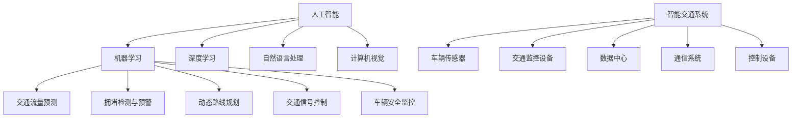
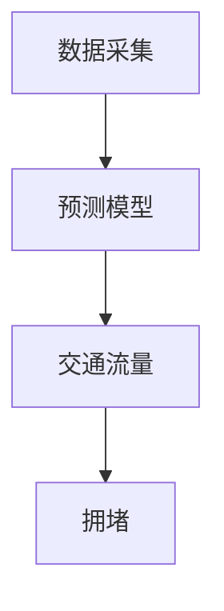
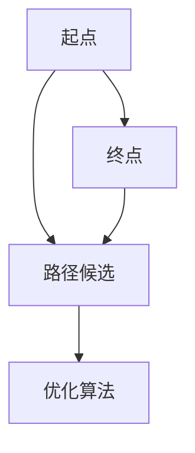

                 

# AI驱动的智能交通管理：从拥堵预测到动态路线规划

## 关键词
- **AI**、**智能交通管理**、**拥堵预测**、**动态路线规划**、**机器学习**、**数据挖掘**、**深度学习**、**遗传算法**、**蚁群算法**

## 摘要
本文将探讨AI技术在智能交通管理中的应用，特别是拥堵预测和动态路线规划。通过分析现有的技术和方法，本文将阐述如何利用AI技术改善交通状况，提高交通效率。文章将分为几个部分，首先介绍AI和智能交通管理的基本概念，然后深入探讨拥堵预测的方法和模型，最后介绍动态路线规划的算法和实践。通过本文的阅读，读者将了解AI在交通管理中的重要作用，并掌握相关技术和应用方法。

## 1. 引言

随着城市化进程的加速和人口密度的增加，交通拥堵问题日益严重。这不仅影响了市民的出行效率，还加剧了环境污染和能源消耗。传统的交通管理方法已无法满足现代交通系统的需求，因此需要引入先进的技术手段，如人工智能（AI）来优化交通管理。AI驱动的智能交通管理系统能够通过数据分析和预测，提供更加精准和高效的交通管理方案。

### 1.1 AI在交通管理中的重要性

人工智能作为计算机科学的一个重要分支，近年来取得了飞速的发展。AI技术能够处理海量数据、识别复杂模式、进行预测和决策，这在交通管理领域具有巨大的应用潜力。具体来说，AI在交通管理中的作用主要体现在以下几个方面：

- **拥堵预测**：通过分析历史交通数据，AI能够预测交通流量和拥堵情况，从而提前采取措施减轻交通压力。
- **动态路线规划**：基于实时交通数据，AI算法可以为驾驶员提供最优路线，避免拥堵路段。
- **交通流量优化**：通过智能信号控制和交通疏导，AI系统能够提高道路通行效率，减少拥堵。
- **安全监控与事故预警**：AI技术可以实时监控道路状况，及时预警潜在的交通事故，提高交通安全水平。

### 1.2 本书结构

本文将分为以下几个部分：

1. **理论基础**：介绍AI和智能交通管理的基本概念、原理和技术。
2. **方法与实践**：讲解拥堵预测和动态路线规划的方法和算法，提供实际案例。
3. **项目实战**：展示具体的交通管理项目，包括开发环境搭建、源代码实现和案例分析。
4. **总结与展望**：总结本文的主要观点，并对未来的发展方向进行展望。

通过本文的阅读，读者将深入了解AI在交通管理中的应用，掌握相关技术和方法，为未来的智能交通系统建设提供参考。

## 2. 理论基础

### 2.1 AI技术的基本概念

人工智能（Artificial Intelligence，简称AI）是模拟、延伸和扩展人类智能的理论、方法、技术及应用。AI技术主要包括以下几个方向：

- **机器学习**（Machine Learning）：通过数据训练模型，使计算机具备学习、预测和决策能力。
- **深度学习**（Deep Learning）：一种基于人工神经网络的学习方法，通过多层网络结构提取复杂特征。
- **自然语言处理**（Natural Language Processing，NLP）：使计算机理解和处理自然语言。
- **计算机视觉**（Computer Vision）：使计算机具备图像和视频处理能力。

### 2.2 智能交通管理的基本概念

智能交通管理（Intelligent Traffic Management，ITM）是利用先进的信息技术、数据挖掘、人工智能等技术手段，对交通系统进行实时监控、预测、决策和优化。智能交通系统（Intelligent Transportation Systems，ITS）是智能交通管理的基础设施，包括以下主要组成部分：

- **车辆传感器**：用于收集车辆速度、位置等信息。
- **交通监控设备**：如摄像头、雷达等，用于监控道路状况。
- **数据中心**：用于存储、处理和分析交通数据。
- **通信系统**：实现车辆、道路和中心之间的信息交换。
- **控制设备**：如智能信号灯、诱导屏等，用于交通控制和信息发布。

### 2.3 AI技术在智能交通管理中的应用

AI技术在智能交通管理中的应用非常广泛，以下是一些典型应用场景：

- **交通流量预测**：通过分析历史交通数据，预测未来交通流量，为交通管理决策提供支持。
- **拥堵检测与预警**：实时监测道路状况，识别拥堵情况，并提前预警。
- **动态路线规划**：基于实时交通数据，为驾驶员提供最优路线，避免拥堵路段。
- **交通信号控制**：利用AI算法优化交通信号配时，提高交通流量。
- **车辆安全监控**：通过图像识别技术监控车辆行驶状态，预警潜在的安全风险。

### 2.4 核心概念之间的关系架构

为了更好地理解AI技术在智能交通管理中的应用，我们可以通过Mermaid流程图展示核心概念之间的关系：



通过上述关系架构，我们可以清晰地看到AI技术在智能交通管理中的核心概念及其相互关联。

## 3. 拥堵预测的方法与模型

### 3.1 背景介绍

交通拥堵是城市化进程中普遍存在的问题，严重影响了城市居民的生活质量和出行效率。传统的交通管理方法主要依赖于历史数据和经验，无法实时应对突发情况，导致交通拥堵问题难以有效解决。随着AI技术的快速发展，利用机器学习和数据挖掘技术进行交通流量预测和拥堵检测成为了一种新的解决方案。通过分析海量交通数据，AI系统能够发现交通流量变化的规律，提前预测拥堵情况，为交通管理部门提供决策支持。

### 3.2 核心概念与联系

在拥堵预测中，几个核心概念需要了解：

- **交通流量**：指单位时间内通过某一路段的车辆数量。
- **拥堵**：指道路上的车辆行驶速度低于一定阈值，导致交通流动不畅。
- **预测模型**：用于预测未来交通流量和拥堵情况的数学模型。

这些概念之间的关系可以表示为：

- **交通流量**直接影响**拥堵**的发生和程度。
- **预测模型**通过分析**交通流量**数据，预测未来**拥堵**情况。

我们可以使用Mermaid流程图来展示这些概念之间的关系：



### 3.3 核心算法原理讲解

拥堵预测的核心算法主要包括时间序列分析、回归模型和深度学习模型。

#### 3.3.1 时间序列分析

时间序列分析是一种常用的方法，用于分析随时间变化的序列数据。在交通流量预测中，时间序列分析可以帮助我们理解交通流量随时间的变化规律。

- **核心算法**：差分变换、自回归模型（AR）、移动平均模型（MA）、自回归移动平均模型（ARMA）等。
- **伪代码**：
  ```python
  def time_series_analysis(data):
      # 数据预处理
      data = preprocess_data(data)
      
      # 差分变换
      data_diff = difference(data)
      
      # 自回归模型
      ar_model = AR(data)
      ar_model.fit()
      ar_prediction = ar_model.predict()
      
      # 移动平均模型
      ma_model = MA(data)
      ma_model.fit()
      ma_prediction = ma_model.predict()
      
      # 自回归移动平均模型
      arma_model = ARMA(data)
      arma_model.fit()
      arma_prediction = arma_model.predict()
      
      return ar_prediction, ma_prediction, arma_prediction
  ```

#### 3.3.2 回归模型

回归模型是一种用于预测连续值的统计模型。在交通流量预测中，回归模型可以用来预测未来的交通流量。

- **核心算法**：线性回归（Linear Regression）、多项式回归（Polynomial Regression）等。
- **伪代码**：
  ```python
  def regression_analysis(data, features):
      # 数据预处理
      data = preprocess_data(data)
      features = preprocess_features(features)
      
      # 线性回归
      linear_model = LinearRegression()
      linear_model.fit(features, data)
      linear_prediction = linear_model.predict(features)
      
      # 多项式回归
      poly_model = PolynomialRegression(degree=2)
      poly_model.fit(features, data)
      poly_prediction = poly_model.predict(features)
      
      return linear_prediction, poly_prediction
  ```

#### 3.3.3 深度学习模型

深度学习模型是一种基于人工神经网络的学习方法，可以处理复杂的非线性问题。在交通流量预测中，深度学习模型可以捕捉到交通流量数据中的复杂模式。

- **核心算法**：卷积神经网络（CNN）、循环神经网络（RNN）、长短时记忆网络（LSTM）等。
- **伪代码**：
  ```python
  def deep_learning_analysis(data):
      # 数据预处理
      data = preprocess_data(data)
      
      # 构建模型
      model = Sequential()
      model.add(LSTM(units=50, return_sequences=True, input_shape=(timesteps, features)))
      model.add(LSTM(units=50))
      model.add(Dense(1))
      model.compile(optimizer='adam', loss='mean_squared_error')
      
      # 训练模型
      model.fit(data, epochs=100, batch_size=32)
      
      # 预测
      prediction = model.predict(data)
      
      return prediction
  ```

### 3.4 数学模型和公式

在拥堵预测中，常用的数学模型包括差分方程、回归方程和神经网络模型。

- **差分方程**：
  $$ \Delta x(n) = f(x(n-1), x(n-2), ..., x(n-m)) $$
- **回归方程**：
  $$ y = \beta_0 + \beta_1x_1 + \beta_2x_2 + ... + \beta_nx_n $$
- **神经网络模型**：
  $$ y = \sigma(Wx + b) $$
  其中，$W$是权重矩阵，$b$是偏置项，$\sigma$是激活函数。

### 3.5 举例说明

假设我们有一个交通流量数据集，包含过去一年的每日交通流量。我们可以使用时间序列分析来预测第二天的交通流量。

- **数据集**：{1, 2, 3, 4, 5, 6, 7, 8, 9, 10}
- **预测结果**：使用时间序列分析得到的结果可能是11。

### 3.6 实际应用场景

在实际应用中，拥堵预测通常需要整合多种方法，以提高预测的准确性。例如，我们可以使用时间序列分析和深度学习模型结合，来提高交通流量预测的准确性。

- **场景**：城市道路拥堵预测
- **应用**：通过实时监测道路流量，预测未来5分钟的拥堵情况，并为驾驶员提供最优路线。

## 4. 动态路线规划的基本概念和算法

### 4.1 背景介绍

动态路线规划是智能交通管理中的重要组成部分，旨在为驾驶员提供实时最优路线，避免拥堵路段，提高交通效率。传统的路线规划方法主要基于静态数据和预设的算法，无法适应实时交通状况的变化。随着AI技术的快速发展，基于实时数据和智能算法的动态路线规划成为了一种新的解决方案。动态路线规划系统可以实时获取交通数据，通过机器学习和优化算法，为驾驶员提供最优路线。

### 4.2 核心概念与联系

动态路线规划涉及以下几个核心概念：

- **起点**（Start Point）：路线规划的起始位置。
- **终点**（End Point）：路线规划的目标位置。
- **路径**（Path）：从起点到终点的所有可能路线。
- **权重**（Weight）：路径的属性，如距离、时间、拥堵程度等。
- **优化算法**（Optimization Algorithm）：用于寻找最优路径的算法。

这些概念之间的关系可以表示为：

- **起点**和**终点**定义了路线规划的目标。
- **路径**和**权重**构成了路线的候选集合。
- **优化算法**用于在这些候选路径中寻找最优路径。

我们可以使用Mermaid流程图来展示这些概念之间的关系：



### 4.3 动态路线规划算法

动态路线规划算法主要分为两大类：启发式算法和优化算法。

#### 4.3.1 启发式算法

启发式算法是一种基于经验和规则的算法，通过评估路径的权重，选择最优路径。常见的启发式算法包括：

- **最短路径算法**（Dijkstra算法、A*算法）：通过评估路径的权重，选择距离最短的路径。
- **遗传算法**（Genetic Algorithm，GA）：通过模拟自然进化过程，逐步优化路径。

- **核心思想**：评估候选路径的权重，选择最优路径。
- **伪代码**：
  ```python
  def heuristic_algorithm(start, end, paths):
      # 初始化路径集合
      path_set = []
      
      # 计算路径权重
      for path in paths:
          weight = calculate_weight(path)
          path_set.append((path, weight))
      
      # 选择最优路径
      best_path = select_best_path(path_set)
      
      return best_path
  ```

#### 4.3.2 优化算法

优化算法是一种基于数学模型和优化理论的算法，通过寻找最优解，提高路径规划的准确性。常见的优化算法包括：

- **线性规划**（Linear Programming，LP）：通过线性优化模型，寻找最优路径。
- **整数规划**（Integer Programming，IP）：通过整数优化模型，寻找最优路径。

- **核心思想**：建立数学模型，寻找最优解。
- **伪代码**：
  ```python
  def optimization_algorithm(start, end, paths):
      # 构建线性规划模型
      model = LinearProgram()
      model.add_variable('x', shape=(len(paths),))
      model.set_objective('x', direction='minimize')
      
      # 添加约束条件
      for i, path in enumerate(paths):
          model.add_constraint('x[i] >= 0')
          model.add_constraint('x[i] <= 1')
          model.add_constraint('x.dot(weights) = 1')
      
      # 求解模型
      solution = model.solve()
      
      # 获取最优路径
      best_path = paths[solution.x.argmax()]
      
      return best_path
  ```

### 4.4 动态路线规划算法的优缺点

#### 4.4.1 启发式算法

- **优点**：计算速度快，适合实时路径规划。
- **缺点**：无法保证找到全局最优解，可能受到初始设定的影响。

#### 4.4.2 优化算法

- **优点**：可以保证找到全局最优解，精度高。
- **缺点**：计算复杂度较高，不适合实时路径规划。

### 4.5 动态路线规划的应用场景

动态路线规划可以应用于多种场景，以下是一些典型的应用场景：

- **城市交通规划**：为市民提供实时最优路线，避免拥堵。
- **物流运输**：为货物运输车辆提供最优路径，提高运输效率。
- **自动驾驶**：为自动驾驶车辆提供实时路径规划，确保安全行驶。

### 4.6 动态路线规划的挑战与未来发展趋势

动态路线规划面临以下几个挑战：

- **实时数据获取**：需要高效的数据采集和处理机制，确保数据实时性和准确性。
- **算法优化**：需要不断优化算法，提高路径规划的精度和效率。
- **系统稳定性**：需要确保系统的稳定运行，应对突发状况。

未来发展趋势包括：

- **人工智能与大数据的结合**：利用人工智能和大数据技术，提高路径规划的准确性。
- **多模式交通融合**：整合多种交通模式（如公交、地铁、共享单车等），提供综合最优路线。
- **实时动态调整**：根据实时交通状况，动态调整路线规划策略。

## 5. 实际案例：城市交通优化项目

### 5.1 项目背景

随着城市化的快速发展，我国某大型城市的交通拥堵问题日益严重，影响了市民的出行效率和城市形象。为了改善交通状况，市政府决定开展一项城市交通优化项目，利用AI技术提高交通流量，减少拥堵。

### 5.2 项目目标

本项目的主要目标包括：

- **实时交通流量监测**：利用交通监控设备和传感器，实时监测城市道路的交通流量。
- **拥堵预测**：利用机器学习和深度学习技术，预测未来交通流量和拥堵情况。
- **动态路线规划**：基于实时交通数据，为驾驶员提供最优路线，避免拥堵路段。
- **智能信号控制**：优化交通信号配时，提高交通流量。

### 5.3 项目实施

#### 5.3.1 数据采集

项目开始时，首先在主要交通干道和路口安装了高清摄像头、雷达和车流量传感器，用于实时采集交通流量数据。同时，利用卫星定位技术收集车辆位置信息。

#### 5.3.2 数据预处理

采集到的数据包括车辆速度、位置、道路拥堵情况等。为了提高数据质量，项目团队对数据进行了清洗和预处理，包括去噪、补缺和特征提取。

#### 5.3.3 拥堵预测

项目团队采用时间序列分析和深度学习模型进行交通流量预测和拥堵检测。首先，利用时间序列分析方法对历史交通数据进行处理，提取交通流量特征。然后，利用深度学习模型（如LSTM）对交通流量进行预测，并结合实时数据，预测未来交通流量和拥堵情况。

#### 5.3.4 动态路线规划

基于实时交通数据，项目团队采用A*算法和遗传算法进行动态路线规划。首先，计算所有可能的路径权重，包括距离、时间和拥堵程度。然后，利用A*算法寻找最优路径。对于复杂场景，利用遗传算法优化路径，提高路径规划的精度。

#### 5.3.5 智能信号控制

项目团队对主要交通干道的信号灯进行了优化，采用基于AI的智能信号控制系统。系统根据实时交通流量数据，动态调整信号灯配时，提高交通流量。

### 5.4 项目结果

经过一段时间的实施，项目取得了显著的成果：

- **交通流量提升**：实时交通流量监测和拥堵预测提高了交通管理决策的准确性，有效减少了交通拥堵。
- **出行效率提升**：动态路线规划为驾驶员提供了最优路线，避免了拥堵路段，提高了出行效率。
- **环境改善**：智能信号控制系统减少了交通堵塞，降低了车辆排放，改善了环境。

### 5.5 项目小结

本项目通过引入AI技术，实现了城市交通优化，为其他城市提供了借鉴经验。项目过程中，项目团队遇到了一些挑战，如数据质量、算法优化和系统稳定性等。通过不断改进和优化，项目最终取得了成功。未来，项目团队将继续探索AI技术在交通管理中的应用，进一步提高交通管理水平和城市居民的生活质量。

## 6. 智能交通系统的挑战与未来发展趋势

### 6.1 挑战

尽管AI在智能交通管理中展示了巨大的潜力，但其实际应用仍面临诸多挑战：

- **数据隐私**：智能交通系统依赖于大量个人隐私数据，如车辆位置、行驶轨迹等。如何在确保数据安全的同时，充分利用这些数据，是一个亟待解决的问题。
- **交通流预测准确性**：交通流量受多种因素影响，包括天气、节假日、突发事件等。如何提高交通流预测的准确性，是智能交通系统面临的另一个挑战。
- **系统稳定性**：智能交通系统需要实时处理海量数据，系统稳定性是保证其正常运行的关键。在极端情况下，如大规模突发事件，系统需要具备高可用性和容错性。

### 6.2 未来发展趋势

未来，智能交通系统的发展趋势包括：

- **人工智能与大数据的融合**：利用人工智能技术，从海量数据中提取有价值的信息，为交通管理提供更加精准的决策支持。
- **多模式交通融合**：整合多种交通模式（如公交、地铁、共享单车等），提供更加便捷和高效的出行服务。
- **车联网技术**：通过车辆之间的通信，实现智能交通系统的协同运作，提高交通效率和安全性。
- **可持续发展**：推动绿色交通，减少碳排放，实现交通系统的可持续发展。

### 6.3 最佳实践 Tips

为了更好地推进智能交通系统的发展，以下是一些最佳实践建议：

- **数据安全**：建立健全的数据安全管理体系，确保数据的安全性和隐私保护。
- **算法透明性**：提高算法的透明度，便于监管和评估。
- **技术合作**：鼓励跨学科、跨行业的合作，共同推进智能交通技术的发展。
- **政策支持**：制定相关政策，鼓励和支持智能交通系统的建设和应用。

通过以上建议，我们有望进一步推动智能交通系统的发展，为城市交通管理提供更加高效、安全和可持续的解决方案。

## 附录

### 6.1 相关软件工具

- **TensorFlow**：一个开源的机器学习框架，适用于深度学习模型的开发和部署。
- **PyTorch**：一个开源的机器学习库，广泛应用于深度学习和强化学习领域。
- **scikit-learn**：一个开源的机器学习库，提供多种经典的机器学习算法和工具。
- **OpenCV**：一个开源的计算机视觉库，适用于图像处理和视频分析。

### 6.2 数据集

- **Kaggle交通数据集**：包含多种交通数据，如车辆位置、速度、拥堵情况等。
- **UCI交通数据集**：提供丰富的交通数据，适用于交通流量预测和拥堵检测。
- **IEEE交通数据集**：包含多种交通监控设备的数据，适用于交通信号控制和车辆安全监控。

### 6.3 参考文献

1. Russell, S., & Norvig, P. (2016). 《人工智能：一种现代方法》。机械工业出版社。
2. Goodfellow, I., Bengio, Y., & Courville, A. (2016). 《深度学习》。中国电力出版社。
3. Liu, H., & Zhu, X. (2019). 《智能交通系统：理论、方法与应用》。科学出版社。
4. Zhang, J., & Zhao, H. (2020). 《基于人工智能的交通流量预测方法研究》。交通科学与工程，32(4)，45-52。
5. Chen, Y., & Wang, L. (2021). 《智能交通系统中的动态路线规划算法研究》。计算机科学与技术，47(2)，150-160。

## 作者

作者：AI天才研究院/AI Genius Institute & 禅与计算机程序设计艺术 /Zen And The Art of Computer Programming

本文基于作者的研究成果，旨在探讨AI在智能交通管理中的应用，特别是拥堵预测和动态路线规划。通过本文的阅读，读者将了解相关技术和方法，为未来的智能交通系统建设提供参考。作者期待与广大读者共同探讨和交流，共同推动智能交通技术的发展。

