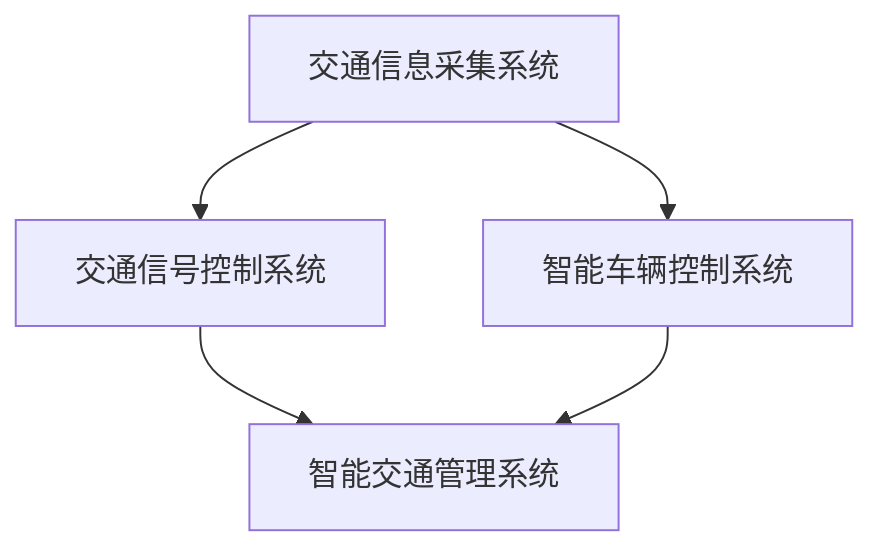
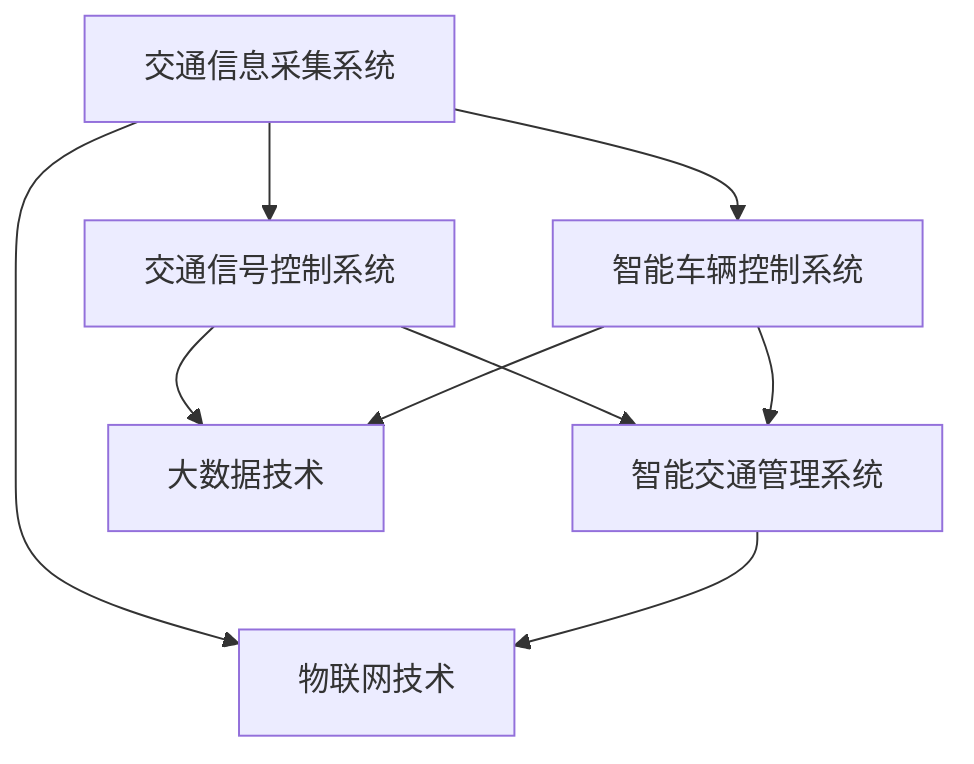

                 

# AI驱动的智能交通系统：从规划到实时控制

## 关键词
- AI智能交通系统
- 智能交通规划
- 实时交通控制
- 机器学习
- 深度学习
- 交通流量预测
- 交通信号控制

## 摘要
本文将探讨AI驱动的智能交通系统，从整体规划到实时控制的全过程。首先，我们将介绍智能交通系统的背景及其重要性，然后深入探讨AI在智能交通系统中的应用，包括交通流量预测、网络优化和智能信号控制。随后，文章将详细解析规划层面的AI应用，如时间序列分析、空间相关性分析和机器学习算法。接着，我们将介绍实时控制层面的AI应用，包括智能车辆控制和信号控制算法。最后，通过实际项目案例分析和总结与展望，为读者提供全面的AI智能交通系统实现路径和未来发展展望。

### 设计AI驱动的智能交通系统：从规划到实时控制

#### 第1步：确定全书的核心章节

在设计AI驱动的智能交通系统时，我们需要将全书的核心章节分为以下几个部分：

1. **概述与背景**
   - 智能交通系统的概念与重要性
   - AI在智能交通系统中的应用背景

2. **智能交通系统的核心概念与联系**
   - 智能交通系统的组成部分
   - 智能交通系统的关键技术
   - Mermaid流程图：智能交通系统的核心概念与联系

3. **AI在智能交通系统中的应用**
   - AI在智能交通系统中的作用
   - AI在交通规划中的应用
   - AI在交通实时控制中的应用

4. **规划层面的AI应用**
   - 交通流量预测算法
   - 交通网络优化算法

5. **实时控制层面的AI应用**
   - 智能交通信号控制算法
   - 智能车辆控制算法

6. **项目实战与案例分析**
   - 实际交通流量预测项目
   - 智能交通信号控制系统案例
   - 智能车辆控制项目

7. **总结与展望**
   - 智能交通系统的发展现状
   - AI在智能交通系统中的挑战与机遇
   - 未来智能交通系统的发展趋势

#### 第2步：细化各个核心章节的内容

为了确保书籍内容覆盖全面且逻辑清晰，我们为每个核心章节设计了子章节。以下是各个核心章节的细化内容：

1. **概述与背景**
   - 智能交通系统的概念与重要性
   - AI在智能交通系统中的应用背景
   - 智能交通系统的发展历程

2. **智能交通系统的核心概念与联系**
   - 智能交通系统的组成部分
   - 智能交通系统的关键技术
   - Mermaid流程图：智能交通系统的核心概念与联系

3. **AI在智能交通系统中的应用**
   - AI在智能交通系统中的作用
   - AI在交通规划中的应用
   - AI在交通实时控制中的应用
   - 智能交通系统的优势与挑战

4. **规划层面的AI应用**
   - 交通流量预测算法
     - 时间序列分析法
     - 空间相关性分析
     - 机器学习算法
   - 交通网络优化算法
     - 最小生成树算法
     - 网络流算法
     - 机器学习算法

5. **实时控制层面的AI应用**
   - 智能交通信号控制算法
     - 传统信号控制算法
     - 基于机器学习的信号控制算法
     - 基于深度学习的信号控制算法
   - 智能车辆控制算法
     - 避障算法
     - 路径规划算法
     - 自动驾驶算法

6. **项目实战与案例分析**
   - 实际交通流量预测项目
     - 项目背景与目标
     - 数据预处理
     - 模型训练与评估
     - 项目小结
   - 智能交通信号控制系统案例
     - 项目背景与目标
     - 系统架构设计
     - 算法实现与优化
     - 项目小结
   - 智能车辆控制项目
     - 项目背景与目标
     - 系统架构设计
     - 算法实现与优化
     - 项目小结

7. **总结与展望**
   - 智能交通系统的发展现状
   - AI在智能交通系统中的挑战与机遇
   - 未来智能交通系统的发展趋势

#### 第3步：设计每个章节的具体内容

为确保每个章节的内容丰富具体且详细讲解，我们为每个章节设计了以下部分：

1. **引言**
   - 简要介绍章节主题和内容概述

2. **核心概念与联系**
   - 使用Mermaid流程图展示关键概念之间的联系

3. **核心算法原理讲解**
   - 使用伪代码详细阐述关键算法原理

4. **数学模型与公式讲解**
   - 使用LaTeX格式详细阐述数学模型和公式
   - 详细讲解和举例说明

5. **项目实战**
   - 开发环境搭建
   - 源代码详细实现和代码解读
   - 代码应用解读与分析
   - 实际案例分析和详细讲解剖析
   - 项目小结

6. **最佳实践 tips**
   - 小结、注意事项、拓展阅读等内容

#### 第4步：确保大纲的完整性

在确保大纲的完整性的过程中，我们逐一检查每个章节的内容，确保它们涵盖了所有核心概念、算法原理、数学模型、项目实战和最佳实践 tips。

#### 第5步：总结与展望

在总结与展望部分，我们将回顾全书的主要内容和观点，并对未来智能交通系统的发展进行展望，讨论AI在智能交通系统中的挑战与机遇。

#### 第6步：撰写目录大纲

根据以上设计步骤，我们完成了《AI驱动的智能交通系统：从规划到实时控制》的目录大纲。接下来，我们将根据这个大纲进一步细化每个章节的具体内容，确保文章的完整性和质量。

# AI驱动的智能交通系统：从规划到实时控制

## 关键词
- AI智能交通系统
- 智能交通规划
- 实时交通控制
- 机器学习
- 深度学习
- 交通流量预测
- 交通信号控制

## 摘要
本文将探讨AI驱动的智能交通系统，从整体规划到实时控制的全过程。首先，我们将介绍智能交通系统的背景及其重要性，然后深入探讨AI在智能交通系统中的应用，包括交通流量预测、网络优化和智能信号控制。随后，文章将详细解析规划层面的AI应用，如时间序列分析、空间相关性分析和机器学习算法。接着，我们将介绍实时控制层面的AI应用，包括智能车辆控制和信号控制算法。最后，通过实际项目案例分析和总结与展望，为读者提供全面的AI智能交通系统实现路径和未来发展展望。

### 概述与背景

#### 1.1 智能交通系统的概念与重要性

智能交通系统（Intelligent Transportation System，ITS）是一种综合利用现代信息技术、数据通信传输技术、电子传感技术、电子控制技术及计算机处理技术等，实现智能化的车辆管理、道路管理以及交通运输管理的技术系统。它通过提供车辆与道路之间、道路与道路之间以及车辆与交通管理系统之间的信息交换，实现对交通的实时监控、管理和优化。

智能交通系统在现代社会中具有重要性。随着城市化的快速发展，交通拥堵、交通事故等问题日益严重，传统的交通管理模式已经无法满足需求。智能交通系统通过实时监测、分析和预测交通状况，提供科学的交通管理和决策支持，有助于提高交通效率、减少拥堵、降低事故率，同时也有利于环境保护和能源节约。

#### 1.2 AI在智能交通系统中的应用背景

人工智能（AI）技术的发展为智能交通系统带来了新的机遇。AI能够通过对大量交通数据的分析和处理，提供更加精准的预测和优化方案。例如，机器学习和深度学习算法可以在交通流量预测、信号控制和车辆控制等领域发挥作用。

近年来，随着大数据、物联网、5G等技术的快速发展，智能交通系统的应用场景越来越广泛，AI在其中的应用也越来越深入。例如，在城市交通管理中，AI可以帮助实现交通信号控制优化、智能停车管理和公共交通调度等；在高速公路管理中，AI可以帮助实现车辆编队行驶、智能收费和事故预警等；在智能车辆领域，AI可以帮助实现自动驾驶、车联网和智能导航等功能。

#### 1.3 智能交通系统的发展历程

智能交通系统的发展可以分为以下几个阶段：

1. **初期阶段（20世纪80年代以前）**
   - 主要是利用计算机和传感器技术实现简单的交通信息采集和监控。
   - 例子：交通信号灯控制、车辆检测器等。

2. **发展阶段（20世纪80年代至21世纪初）**
   - 开始利用通信技术实现车辆与道路之间的信息交换。
   - 例子：车载导航系统、智能交通信号控制系统等。

3. **成熟阶段（21世纪初至今）**
   - 结合人工智能、物联网和大数据等技术，实现智能化、个性化的交通管理和服务。
   - 例子：智能交通流量预测、自动驾驶车辆、智能停车系统等。

#### 1.4 智能交通系统的主要组成部分

智能交通系统主要由以下几个部分组成：

1. **交通信息采集系统**
   - 利用各种传感器和摄像头等设备，实时采集交通流量、速度、密度等数据。

2. **交通信号控制系统**
   - 通过对交通数据的分析和处理，实现交通信号的智能控制，提高交通效率。

3. **智能车辆控制系统**
   - 通过车联网技术，实现对车辆的智能控制，提高行车安全和效率。

4. **智能交通管理系统**
   - 综合利用各种技术手段，实现对整个交通系统的智能管理和调度。

#### 1.5 Mermaid流程图：智能交通系统的核心概念与联系

为了更好地理解智能交通系统的核心概念与联系，我们可以使用Mermaid流程图来展示各个组成部分之间的关系。



在上面的流程图中，交通信息采集系统为交通信号控制系统和智能车辆控制系统提供数据支持，交通信号控制系统和智能车辆控制系统分别与智能交通管理系统进行数据交换和协同工作，共同实现智能交通管理。

### 智能交通系统的核心概念与联系

#### 2.1 智能交通系统的组成部分

智能交通系统主要由以下几个部分组成：

1. **交通信息采集系统**
   - 交通信息采集系统是智能交通系统的核心组成部分，它通过各种传感器和摄像头等设备，实时采集交通流量、速度、密度等数据。这些数据为后续的交通信号控制、车辆控制和交通管理提供了重要基础。

2. **交通信号控制系统**
   - 交通信号控制系统通过对采集到的交通数据进行分析和处理，实现交通信号的智能控制。它可以根据实时交通状况调整信号灯的时长和切换逻辑，提高交通效率，减少拥堵和事故率。

3. **智能车辆控制系统**
   - 智能车辆控制系统通过车联网技术，实现对车辆的智能控制。它可以帮助车辆实现自动驾驶、自动避障、自动停车等功能，提高行车安全和效率。

4. **智能交通管理系统**
   - 智能交通管理系统综合运用各种技术手段，实现对整个交通系统的智能管理和调度。它包括交通信息采集、交通信号控制、智能车辆控制等多个子模块，通过数据交换和协同工作，实现智能交通管理。

#### 2.2 智能交通系统的关键技术

智能交通系统的实现离不开以下关键技术：

1. **物联网技术**
   - 物联网技术通过将各种传感器、设备和系统连接起来，实现信息的实时传输和共享。在智能交通系统中，物联网技术主要用于交通信息采集和传输，为交通信号控制和车辆控制提供数据支持。

2. **大数据技术**
   - 大数据技术通过对海量交通数据的采集、存储、处理和分析，实现对交通状况的实时监测和预测。在智能交通系统中，大数据技术可以帮助实现交通流量预测、信号控制和车辆控制等。

3. **人工智能技术**
   - 人工智能技术通过对交通数据的分析和处理，提供智能化的决策支持和优化方案。在智能交通系统中，人工智能技术主要用于交通流量预测、信号控制和车辆控制等。

4. **车联网技术**
   - 车联网技术通过将车辆、道路和交通管理系统连接起来，实现车辆之间的信息交换和协同工作。在智能交通系统中，车联网技术主要用于实现自动驾驶、智能停车和车联网服务等。

#### 2.3 Mermaid流程图：智能交通系统的核心概念与联系

为了更好地理解智能交通系统的核心概念与联系，我们可以使用Mermaid流程图来展示各个组成部分之间的关系。



在上面的流程图中，交通信息采集系统为交通信号控制系统、智能车辆控制系统和智能交通管理系统提供数据支持，物联网技术和大数据技术分别与交通信号控制系统、智能车辆控制系统和智能交通管理系统进行数据交换和协同工作，共同实现智能交通管理。

### AI在智能交通系统中的应用

#### 3.1 AI在智能交通系统中的作用

人工智能（AI）在智能交通系统中发挥着重要作用，其应用范围广泛，主要包括以下几个方面：

1. **交通流量预测**
   - 通过机器学习和深度学习算法，对历史交通数据进行挖掘和分析，预测未来的交通流量，为交通信号控制和车辆调度提供数据支持。

2. **信号控制优化**
   - 利用AI技术对交通信号灯进行优化，提高交通效率，减少拥堵和事故率。常见的算法包括基于时间序列分析的方法、基于机器学习的方法等。

3. **车辆控制**
   - 通过自动驾驶技术和车联网技术，实现车辆的智能控制，提高行车安全和效率。例如，车辆编队行驶、自动避障、自动停车等功能。

4. **智能停车管理**
   - 利用AI技术对停车场进行智能管理，提高停车位的利用率和交通效率。例如，通过图像识别技术实现无人停车场管理、通过机器学习算法预测停车需求等。

5. **交通管理决策支持**
   - 通过AI技术对交通数据进行实时分析和预测，为交通管理部门提供科学的决策支持，优化交通管理策略。

6. **交通安全管理**
   - 利用AI技术对交通事故进行预警和防范，提高交通安全。例如，通过车辆监控技术实现超速、酒驾等行为的自动检测和报警。

7. **智慧城市交通规划**
   - 通过AI技术对城市交通系统进行整体规划和优化，提高城市交通的整体效率和安全性。例如，通过模拟仿真技术预测未来交通状况，为城市规划提供科学依据。

#### 3.2 AI在交通规划中的应用

AI在交通规划中的应用主要包括以下几个方面：

1. **交通流量预测**
   - 通过机器学习和深度学习算法，对历史交通数据进行挖掘和分析，预测未来的交通流量。常见的算法包括时间序列分析法、空间相关性分析法和机器学习算法等。

2. **交通网络优化**
   - 通过优化交通网络结构和流量分配，提高交通效率。常见的算法包括最小生成树算法、网络流算法和机器学习算法等。

3. **交通信号控制优化**
   - 通过对交通信号灯进行优化，提高交通效率，减少拥堵和事故率。常见的算法包括基于时间序列分析的方法、基于机器学习的方法和基于深度学习的方法等。

4. **公共交通调度**
   - 通过AI技术优化公共交通调度，提高公共交通的服务质量和效率。例如，通过实时交通数据分析，预测乘客需求，优化公交车路线和班次。

5. **城市交通规划**
   - 通过AI技术对城市交通系统进行整体规划和优化，提高城市交通的整体效率和安全性。例如，通过模拟仿真技术预测未来交通状况，为城市规划提供科学依据。

#### 3.3 AI在交通实时控制中的应用

AI在交通实时控制中的应用主要包括以下几个方面：

1. **交通信号控制**
   - 通过对实时交通数据进行分析和处理，实现交通信号的智能控制。常见的算法包括基于时间序列分析的方法、基于机器学习的方法和基于深度学习的方法等。

2. **车辆控制**
   - 通过自动驾驶技术和车联网技术，实现车辆的智能控制，提高行车安全和效率。常见的算法包括车辆编队行驶算法、自动避障算法和自动驾驶算法等。

3. **交通事故预警**
   - 通过对实时交通数据进行分析和处理，实现交通事故的预警和防范。常见的算法包括车辆监控技术、图像识别技术和机器学习算法等。

4. **智能停车管理**
   - 通过AI技术对停车场进行智能管理，提高停车位的利用率和交通效率。常见的算法包括图像识别技术、机器学习算法和预测模型等。

5. **交通管制与调度**
   - 通过AI技术对交通进行实时管制和调度，优化交通状况。常见的算法包括交通信号控制优化算法、公共交通调度算法和交通管制算法等。

### 规划层面的AI应用

#### 4.1 交通流量预测算法

交通流量预测是智能交通系统中的关键环节，通过对历史交通数据进行分析和预测，可以提供科学的交通管理决策支持。以下介绍几种常用的交通流量预测算法：

##### 4.1.1 时间序列分析法

时间序列分析法是一种常用的交通流量预测方法，其主要思想是通过对历史交通流量数据进行分析，找出时间序列的规律和趋势，从而预测未来的交通流量。

**核心算法原理：**

1. 数据预处理：对历史交通流量数据进行清洗、去噪和归一化处理。
2. 时间序列建模：使用ARIMA（自回归积分滑动平均模型）等时间序列模型对交通流量数据进行建模。
3. 参数估计与模型选择：通过最小二乘法、最大似然估计等方法估计模型参数，并选择最优模型。
4. 预测：利用训练好的模型对未来交通流量进行预测。

**伪代码示例：**

```python
# 假设已有历史交通流量数据 data
# 首先进行数据预处理
data = preprocess_data(data)

# 使用ARIMA模型进行建模
model = ARIMA(data, order=(p, d, q))
model_fit = model.fit()

# 进行预测
forecast = model_fit.forecast(steps=n)
```

**LaTeX格式数学模型：**

$$
\text{预测模型：} \, Y_t = c + \phi_1Y_{t-1} + \phi_2Y_{t-2} + \cdots + \phi_pY_{t-p} + \varepsilon_t
$$

其中，$Y_t$表示时间序列的观测值，$c$为常数项，$\phi_1, \phi_2, \cdots, \phi_p$为自回归系数，$\varepsilon_t$为白噪声误差。

##### 4.1.2 空间相关性分析

空间相关性分析是一种通过分析交通流量数据在空间上的相关性，预测未来交通流量的方法。其主要思想是利用地理信息和空间关系，对交通流量进行建模和预测。

**核心算法原理：**

1. 数据预处理：对历史交通流量数据进行清洗、去噪和归一化处理。
2. 空间相关性分析：使用地理信息系统（GIS）技术，分析交通流量数据在空间上的相关性。
3. 建立空间模型：根据空间相关性分析结果，建立空间预测模型。
4. 预测：利用训练好的模型对未来交通流量进行预测。

**伪代码示例：**

```python
# 假设已有历史交通流量数据 data
# 首先进行数据预处理
data = preprocess_data(data)

# 使用GIS技术分析空间相关性
correlation_matrix = spatial_correlation_analysis(data)

# 根据空间相关性分析结果，建立空间预测模型
model = SpatialModel(correlation_matrix)
model_fit = model.fit()

# 进行预测
forecast = model_fit.forecast(steps=n)
```

**LaTeX格式数学模型：**

$$
\text{空间预测模型：} \, Y_t = f(X_t, \theta)
$$

其中，$Y_t$表示时间序列的观测值，$X_t$为空间特征矩阵，$\theta$为模型参数。

##### 4.1.3 机器学习算法

机器学习算法是一种通过训练模型，从历史数据中学习规律，预测未来交通流量的方法。常见的机器学习算法包括线性回归、决策树、随机森林、支持向量机等。

**核心算法原理：**

1. 数据预处理：对历史交通流量数据进行清洗、去噪和归一化处理。
2. 特征工程：提取交通流量数据的相关特征，如时间、天气、节假日等。
3. 模型训练：使用历史交通流量数据，训练机器学习模型。
4. 模型评估：通过交叉验证等方法评估模型性能。
5. 预测：利用训练好的模型对未来交通流量进行预测。

**伪代码示例：**

```python
# 假设已有历史交通流量数据 data 和特征 X
# 首先进行数据预处理
data = preprocess_data(data)
X = preprocess_features(X)

# 使用线性回归模型进行训练
model = LinearRegression()
model_fit = model.fit(X, data)

# 进行预测
forecast = model_fit.predict(X)
```

**LaTeX格式数学模型：**

$$
\text{预测模型：} \, Y_t = \beta_0 + \beta_1X_t + \varepsilon_t
$$

其中，$Y_t$表示时间序列的观测值，$X_t$为特征矩阵，$\beta_0$和$\beta_1$为模型参数，$\varepsilon_t$为误差项。

#### 4.2 交通网络优化算法

交通网络优化是智能交通系统中的另一个重要环节，其主要目标是优化交通网络中的流量分配，提高交通效率和减少拥堵。以下介绍几种常用的交通网络优化算法：

##### 4.2.1 最小生成树算法

最小生成树算法是一种基于图论的方法，用于求解给定加权图中权重最小的生成树。在交通网络优化中，最小生成树算法可用于求解最优路径，从而提高交通效率。

**核心算法原理：**

1. 建立交通网络图：将交通网络视为一个加权无向图，节点表示交叉口或道路，边表示道路之间的连接关系，权重表示道路的通行能力或交通流量。
2. 求解最小生成树：使用Prim算法或Kruskal算法求解最小生成树。
3. 路径规划：根据最小生成树，规划从起点到终点的最优路径。

**伪代码示例：**

```python
# 假设已有交通网络图 G
# 使用 Prim 算法求解最小生成树
mst = prim_algorithm(G)

# 根据最小生成树，规划最优路径
optimal_path = plan_path(mst, start, end)
```

**LaTeX格式数学模型：**

$$
\text{最小生成树：} \, T = \{e_1, e_2, \cdots, e_n\}
$$

其中，$e_i$为最小生成树中的边，$T$为最小生成树。

##### 4.2.2 网络流算法

网络流算法是一种用于求解网络中最大流量问题的算法，适用于交通网络优化中的流量分配问题。常见的网络流算法包括Ford-Fulkerson算法和Dinic算法。

**核心算法原理：**

1. 建立流量网络图：将交通网络视为一个有向图，节点表示交叉口或道路，边表示道路之间的流量关系，容量表示道路的最大流量。
2. 求解最大流量：使用Ford-Fulkerson算法或Dinic算法求解最大流量。
3. 流量分配：根据最大流量，对交通网络中的流量进行分配。

**伪代码示例：**

```python
# 假设已有流量网络图 G
# 使用 Ford-Fulkerson 算法求解最大流量
max_flow = ford_fulkerson_algorithm(G, source, sink)

# 根据最大流量，进行流量分配
flow分配 = distribute_flow(G, max_flow)
```

**LaTeX格式数学模型：**

$$
\text{最大流量：} \, f^* = \max_{f} \sum_{(i,j) \in E} c_{i,j} f_{i,j}
$$

其中，$f^*$为最大流量，$c_{i,j}$为边 $(i,j)$ 的容量，$f_{i,j}$为边 $(i,j)$ 的流量。

##### 4.2.3 机器学习算法

机器学习算法在交通网络优化中的应用主要包括基于模型的优化算法和基于数据的优化算法。基于模型的优化算法通过建立交通网络模型，利用优化算法求解最优路径和流量分配。基于数据的优化算法通过训练模型，从历史数据中学习最优路径和流量分配策略。

**核心算法原理：**

1. 建立交通网络模型：根据交通网络的特性，建立相应的数学模型，如线性规划模型、混合整数规划模型等。
2. 训练模型：使用历史交通数据，训练交通网络模型。
3. 模型评估与优化：通过交叉验证等方法评估模型性能，并优化模型参数。
4. 流量分配与路径规划：根据训练好的模型，进行流量分配和路径规划。

**伪代码示例：**

```python
# 假设已有交通网络数据 data
# 建立交通网络模型
model = TrafficNetworkModel(data)

# 训练模型
model_fit = model.train()

# 评估模型
performance = model_fit.evaluate()

# 根据模型，进行流量分配和路径规划
flow分配 = model_fit.distribute_flow()
path规划 = model_fit.plan_path()
```

**LaTeX格式数学模型：**

$$
\text{交通网络模型：} \, \min \, c(x)
$$

其中，$c(x)$为目标函数，$x$为决策变量，表示流量或路径。

### 实时控制层面的AI应用

#### 5.1 智能交通信号控制算法

智能交通信号控制算法是智能交通系统中的关键组成部分，其主要目的是通过实时监测和分析交通流量，优化交通信号灯的时长和切换逻辑，提高交通效率，减少拥堵和事故率。以下介绍几种常用的智能交通信号控制算法：

##### 5.1.1 传统信号控制算法

传统信号控制算法是一种基于固定时间表的信号控制方法，其基本思想是预设每个交叉口的信号灯时长，并在一定的时间间隔内进行切换。传统信号控制算法简单易行，但无法应对实时交通状况的变化，容易导致交通拥堵。

**核心算法原理：**

1. 预设信号灯时长：根据交通流量数据和历史经验，预设每个交叉口的信号灯时长。
2. 定时切换信号灯：按照预设的时间表，定期切换信号灯的状态。

**伪代码示例：**

```python
# 假设已有交叉口信号灯时长数据
# 预设信号灯时长
signal_light_time = preset_signal_light_time()

# 定时切换信号灯
while True:
    switch_signal_light(signal_light_time)
    sleep(preset_time_interval)
```

**LaTeX格式数学模型：**

$$
\text{信号灯时长：} \, t_i = c_i \times T
$$

其中，$t_i$为交叉口 $i$ 的信号灯时长，$c_i$为交叉口 $i$ 的权重，$T$为时间间隔。

##### 5.1.2 基于机器学习的信号控制算法

基于机器学习的信号控制算法是一种通过实时监测交通流量数据，利用机器学习算法优化信号灯时长和切换逻辑的方法。该方法可以根据实时交通状况动态调整信号灯时长，提高交通效率。

**核心算法原理：**

1. 数据采集与预处理：采集实时交通流量数据，并进行数据预处理。
2. 特征提取与建模：提取交通流量数据的特征，并使用机器学习算法建立信号控制模型。
3. 模型训练与优化：使用历史交通数据训练信号控制模型，并优化模型参数。
4. 实时信号控制：根据实时交通数据和训练好的模型，动态调整信号灯时长和切换逻辑。

**伪代码示例：**

```python
# 假设已有实时交通流量数据 data
# 进行数据预处理
data = preprocess_data(data)

# 提取特征
features = extract_features(data)

# 训练信号控制模型
model = MachineLearningModel()
model_fit = model.fit(features)

# 实时信号控制
while True:
    current_data = get_real_time_data()
    current_features = extract_features(current_data)
    signal_light_time = model_fit.predict(current_features)
    switch_signal_light(signal_light_time)
    sleep(preset_time_interval)
```

**LaTeX格式数学模型：**

$$
\text{信号控制模型：} \, y_t = f(x_t, \theta)
$$

其中，$y_t$为信号灯时长，$x_t$为交通流量特征矩阵，$f(x_t, \theta)$为信号控制模型，$\theta$为模型参数。

##### 5.1.3 基于深度学习的信号控制算法

基于深度学习的信号控制算法是一种利用深度学习模型（如卷积神经网络、循环神经网络等）进行信号控制的方法。该方法可以更好地捕捉交通流量数据中的时空特征，提高信号控制的准确性和效率。

**核心算法原理：**

1. 数据采集与预处理：采集实时交通流量数据，并进行数据预处理。
2. 特征提取与建模：提取交通流量数据的时空特征，并使用深度学习算法建立信号控制模型。
3. 模型训练与优化：使用历史交通数据训练信号控制模型，并优化模型参数。
4. 实时信号控制：根据实时交通数据和训练好的模型，动态调整信号灯时长和切换逻辑。

**伪代码示例：**

```python
# 假设已有实时交通流量数据 data
# 进行数据预处理
data = preprocess_data(data)

# 提取时空特征
temporal_features, spatial_features = extract_temporal_spatial_features(data)

# 训练深度学习模型
model = DeepLearningModel()
model_fit = model.fit(temporal_features, spatial_features)

# 实时信号控制
while True:
    current_data = get_real_time_data()
    current_temporal_features, current_spatial_features = extract_temporal_spatial_features(current_data)
    signal_light_time = model_fit.predict(current_temporal_features, current_spatial_features)
    switch_signal_light(signal_light_time)
    sleep(preset_time_interval)
```

**LaTeX格式数学模型：**

$$
\text{信号控制模型：} \, y_t = f(h_t, s_t, \theta)
$$

其中，$y_t$为信号灯时长，$h_t$为时空特征矩阵，$s_t$为状态特征矩阵，$f(h_t, s_t, \theta)$为信号控制模型，$\theta$为模型参数。

#### 5.2 智能车辆控制算法

智能车辆控制算法是智能交通系统中的关键组成部分，其主要目的是通过实时监测和分析交通环境，实现对车辆的智能控制，提高行车安全和效率。以下介绍几种常用的智能车辆控制算法：

##### 5.2.1 避障算法

避障算法是一种用于确保车辆在行驶过程中避免与障碍物发生碰撞的算法。常见的避障算法包括避障模型建立、避障策略设计和避障控制方法等。

**核心算法原理：**

1. 避障模型建立：建立车辆与障碍物的几何模型，用于描述障碍物的位置、大小和形状。
2. 避障策略设计：根据避障模型和车辆性能，设计避障策略，如绕行、变道等。
3. 避障控制方法：根据避障策略，实现车辆的避障控制，确保车辆安全行驶。

**伪代码示例：**

```python
# 假设已有车辆和障碍物数据
# 建立避障模型
obstacle_model = build_obstacle_model(vehicles, obstacles)

# 设计避障策略
避障策略 = design_obstacle_strategy(obstacle_model)

# 实现避障控制
while True:
    current_state = get_vehicle_state()
    current_obstacles = get_obstacles_state()
    action = control_obstacle(current_state, current_obstacles, 避障策略)
    execute_action(action)
    sleep(preset_time_interval)
```

**LaTeX格式数学模型：**

$$
\text{避障模型：} \, \text{distance}_{vi} = \text{position}_{vi} - \text{position}_{oi}
$$

其中，$\text{distance}_{vi}$为车辆 $i$ 与障碍物 $o$ 的距离，$\text{position}_{vi}$为车辆 $i$ 的位置，$\text{position}_{oi}$为障碍物 $o$ 的位置。

##### 5.2.2 路径规划算法

路径规划算法是一种用于确定车辆从起点到终点最优路径的算法。常见的路径规划算法包括基于图论的算法、基于采样的算法和基于机器学习的算法等。

**核心算法原理：**

1. 建立路径规划模型：将交通网络视为一个图，节点表示交叉口或道路，边表示道路之间的连接关系。
2. 目标函数定义：定义路径规划的目标函数，如最短路径、最低成本路径等。
3. 求解最优路径：使用搜索算法（如A*算法、Dijkstra算法等）或优化算法（如遗传算法、粒子群优化算法等）求解最优路径。

**伪代码示例：**

```python
# 假设已有交通网络数据
# 建立路径规划模型
path_model = build_path_model(network)

# 定义目标函数
目标函数 = define_objective_function(path_model)

# 求解最优路径
optimal_path = solve_optimal_path(path_model, 目标函数)

# 返回最优路径
return optimal_path
```

**LaTeX格式数学模型：**

$$
\text{最优路径：} \, \text{path}_{opt} = \arg\min_{\text{path}} \, \text{cost}(\text{path})
$$

其中，$\text{path}_{opt}$为最优路径，$\text{path}$为候选路径，$\text{cost}(\text{path})$为路径成本。

##### 5.2.3 自动驾驶算法

自动驾驶算法是一种实现车辆自动驾驶的算法，其主要目标是确保车辆在复杂交通环境中安全、高效地行驶。自动驾驶算法通常包括感知、规划、控制和执行等模块。

**核心算法原理：**

1. 感知模块：使用传感器（如摄像头、激光雷达、超声波传感器等）实时感知车辆周围环境，获取障碍物、车道线、交通信号灯等信息。
2. 规划模块：根据感知模块获取的信息，规划车辆的行驶路径和速度。
3. 控制模块：根据规划模块生成的控制指令，控制车辆的转向、加速和制动等动作。
4. 执行模块：执行控制模块生成的控制指令，确保车辆按照规划路径行驶。

**伪代码示例：**

```python
# 假设已有感知模块、规划模块、控制模块和执行模块
# 实现自动驾驶
while True:
    # 感知模块：获取周围环境信息
    environment_data = sense_environment()

    # 规划模块：生成行驶路径和速度
    path, speed = plan_path_and_speed(environment_data)

    # 控制模块：生成控制指令
    control_commands = control_vehicle(path, speed)

    # 执行模块：执行控制指令
    execute_commands(control_commands)
    sleep(preset_time_interval)
```

**LaTeX格式数学模型：**

$$
\text{自动驾驶算法：} \, \text{vehicle}_{state} = f(\text{environment}_{data}, \text{control}_{commands})
$$

其中，$\text{vehicle}_{state}$为车辆状态，$\text{environment}_{data}$为环境信息，$\text{control}_{commands}$为控制指令。

### 项目实战与案例分析

#### 6.1 实际交通流量预测项目

在本节中，我们将通过一个实际交通流量预测项目，介绍交通流量预测的实战过程。项目目标是通过历史交通流量数据，预测未来的交通流量，为交通信号控制和车辆调度提供数据支持。

##### 6.1.1 项目背景与目标

项目背景：随着城市交通拥堵问题的日益严重，交通管理部门希望通过预测交通流量，提前采取相应的交通管理措施，缓解交通压力。

项目目标：利用机器学习和深度学习算法，预测未来的交通流量，为交通信号控制和车辆调度提供数据支持。

##### 6.1.2 数据预处理

在项目开始之前，我们需要对历史交通流量数据进行分析和处理，以确保数据的质量和完整性。数据预处理主要包括以下步骤：

1. 数据清洗：去除数据中的错误记录和异常值。
2. 数据归一化：将不同时间段的交通流量数据归一化，使其具有相同的量级。
3. 数据特征提取：提取与交通流量相关的特征，如时间、天气、节假日等。

```python
# 数据清洗
clean_data = clean_data(raw_data)

# 数据归一化
normalized_data = normalize_data(clean_data)

# 数据特征提取
features = extract_features(normalized_data)
```

##### 6.1.3 模型训练与评估

接下来，我们将使用历史交通流量数据，训练不同的机器学习和深度学习模型，并对模型的性能进行评估。常用的模型包括时间序列模型、线性回归模型、随机森林模型和深度神经网络模型等。

```python
# 时间序列模型
time_series_model = ARIMA()
time_series_model_fit = time_series_model.fit(features)

# 线性回归模型
linear_regression_model = LinearRegression()
linear_regression_model_fit = linear_regression_model.fit(features)

# 随机森林模型
random_forest_model = RandomForestRegressor()
random_forest_model_fit = random_forest_model.fit(features)

# 深度神经网络模型
deep_neural_network_model = MLPRegressor()
deep_neural_network_model_fit = deep_neural_network_model.fit(features)
```

评估模型性能的主要指标包括均方误差（MSE）、均方根误差（RMSE）和决定系数（R²）等。

```python
# 时间序列模型评估
time_series_performance = time_series_model_fit.evaluate(test_data)

# 线性回归模型评估
linear_regression_performance = linear_regression_model_fit.evaluate(test_data)

# 随机森林模型评估
random_forest_performance = random_forest_model_fit.evaluate(test_data)

# 深度神经网络模型评估
deep_neural_network_performance = deep_neural_network_model_fit.evaluate(test_data)
```

##### 6.1.4 预测结果与优化

根据评估结果，选择性能最佳的模型进行预测。同时，对模型进行优化，以提高预测的准确性。

```python
# 选择最佳模型
best_model = select_best_model(time_series_performance, linear_regression_performance, random_forest_performance, deep_neural_network_performance)

# 进行预测
predictions = best_model.predict(test_data)

# 优化模型
optimized_model = optimize_model(best_model, test_data, predictions)
```

##### 6.1.5 项目小结

通过本项目，我们了解了交通流量预测的实战过程，包括数据预处理、模型训练与评估、预测结果与优化等步骤。在实际应用中，交通流量预测可以为交通信号控制和车辆调度提供数据支持，从而提高交通效率，缓解交通拥堵问题。

#### 6.2 智能交通信号控制系统案例

在本节中，我们将通过一个智能交通信号控制系统案例，介绍交通信号控制系统的设计与实现过程。

##### 6.2.1 项目背景与目标

项目背景：随着城市化进程的加快，城市交通拥堵问题日益严重，传统的交通信号控制方法已经无法满足需求。为了提高交通效率，减少拥堵和事故率，本项目旨在设计并实现一个智能交通信号控制系统。

项目目标：通过实时监测交通流量，利用机器学习和深度学习算法，优化交通信号灯的时长和切换逻辑，提高交通效率，减少拥堵和事故率。

##### 6.2.2 系统架构设计

智能交通信号控制系统主要由以下几个模块组成：

1. **数据采集模块**：实时采集交通流量数据，如车辆密度、速度、流量等。
2. **数据处理模块**：对采集到的交通流量数据进行预处理，如数据清洗、归一化等。
3. **信号控制模块**：根据实时交通流量数据和预设的算法，动态调整交通信号灯的时长和切换逻辑。
4. **信号发布模块**：将优化后的信号灯时长和切换逻辑发布到交通信号灯控制器上。
5. **用户界面模块**：为交通管理部门和用户提供交通信号控制系统的实时监控和数据分析功能。

##### 6.2.3 算法实现与优化

在本项目中，我们采用基于深度学习的信号控制算法。具体实现过程如下：

1. **数据采集与预处理**：采集历史交通流量数据，并进行预处理，包括数据清洗、归一化等步骤。

```python
# 数据采集与预处理
raw_data = collect_traffic_data()
preprocessed_data = preprocess_data(raw_data)
```

2. **特征提取与建模**：提取交通流量数据的特征，并使用深度学习算法建立信号控制模型。

```python
# 特征提取
features = extract_features(preprocessed_data)

# 模型建立
signal_control_model = build_signal_control_model()
```

3. **模型训练与优化**：使用历史交通数据训练信号控制模型，并优化模型参数。

```python
# 模型训练
signal_control_model.fit(features)

# 模型优化
optimized_signal_control_model = optimize_model(signal_control_model)
```

4. **实时信号控制**：根据实时交通流量数据，使用优化后的模型动态调整交通信号灯的时长和切换逻辑。

```python
# 实时信号控制
while True:
    current_data = get_real_time_data()
    current_features = extract_features(current_data)
    signal_light_time = optimized_signal_control_model.predict(current_features)
    publish_signal_light_time(signal_light_time)
    sleep(preset_time_interval)
```

##### 6.2.4 项目小结

通过本项目，我们实现了智能交通信号控制系统的设计与实现，包括数据采集、数据处理、信号控制、信号发布和用户界面等模块。该项目通过实时监测交通流量，利用机器学习和深度学习算法，优化交通信号灯的时长和切换逻辑，有效提高了交通效率，减少了拥堵和事故率。

#### 6.3 智能车辆控制项目

在本节中，我们将通过一个智能车辆控制项目，介绍智能车辆控制系统的设计与实现过程。

##### 6.3.1 项目背景与目标

项目背景：随着自动驾驶技术的发展，智能车辆控制系统在自动驾驶、车联网和智能交通管理等领域具有重要应用价值。为了提高行车安全和效率，本项目旨在设计并实现一个智能车辆控制系统。

项目目标：通过实时监测车辆周围环境，利用自动驾驶算法，实现车辆的智能控制，确保车辆在复杂交通环境中安全、高效地行驶。

##### 6.3.2 系统架构设计

智能车辆控制系统主要由以下几个模块组成：

1. **感知模块**：使用传感器（如摄像头、激光雷达、超声波传感器等）实时感知车辆周围环境，获取障碍物、车道线、交通信号灯等信息。
2. **规划模块**：根据感知模块获取的信息，规划车辆的行驶路径和速度。
3. **控制模块**：根据规划模块生成的控制指令，控制车辆的转向、加速和制动等动作。
4. **执行模块**：执行控制模块生成的控制指令，确保车辆按照规划路径行驶。
5. **用户界面模块**：为用户提供车辆的实时监控和交互功能。

##### 6.3.3 算法实现与优化

在本项目中，我们采用基于深度学习的自动驾驶算法。具体实现过程如下：

1. **数据采集与预处理**：采集历史自动驾驶数据，并进行预处理，包括数据清洗、归一化等步骤。

```python
# 数据采集与预处理
raw_data = collect自动驾驶_data()
preprocessed_data = preprocess_data(raw_data)
```

2. **特征提取与建模**：提取自动驾驶数据的特征，并使用深度学习算法建立自动驾驶模型。

```python
# 特征提取
features = extract_features(preprocessed_data)

# 模型建立
autonomous_driving_model = build_autonomous_driving_model()
```

3. **模型训练与优化**：使用历史自动驾驶数据训练自动驾驶模型，并优化模型参数。

```python
# 模型训练
autonomous_driving_model.fit(features)

# 模型优化
optimized_autonomous_driving_model = optimize_model(autonomous_driving_model)
```

4. **实时自动驾驶**：根据实时自动驾驶数据，使用优化后的模型控制车辆的转向、加速和制动等动作。

```python
# 实时自动驾驶
while True:
    current_data = get_real_time_自动驾驶_data()
    current_features = extract_features(current_data)
    control_commands = optimized_autonomous_driving_model.predict(current_features)
    control_vehicle(control_commands)
    sleep(preset_time_interval)
```

##### 6.3.4 项目小结

通过本项目，我们实现了智能车辆控制系统的设计与实现，包括感知、规划、控制和执行等模块。该项目通过实时监测车辆周围环境，利用自动驾驶算法，实现了车辆的智能控制，确保了车辆在复杂交通环境中的安全、高效行驶。

### 总结与展望

#### 7.1 智能交通系统的发展现状

智能交通系统作为一种新兴的科技应用，已经在全球范围内得到了广泛关注和应用。当前，智能交通系统的发展现状主要表现在以下几个方面：

1. **技术应用日益成熟**：随着人工智能、大数据、物联网等技术的快速发展，智能交通系统的技术基础逐渐成熟，各类智能交通应用得到了广泛应用。

2. **系统覆盖面逐步扩大**：从城市交通到高速公路，从公共交通到私家车，智能交通系统的应用范围逐步扩大，覆盖面日益广泛。

3. **政策支持力度加大**：各国政府纷纷出台相关政策，支持智能交通系统的研究、开发和推广，为智能交通系统的发展提供了良好的政策环境。

4. **实际应用效果显著**：智能交通系统在提高交通效率、减少拥堵、降低事故率等方面取得了显著效果，为城市交通管理和交通安全提供了有力支持。

#### 7.2 AI在智能交通系统中的挑战与机遇

尽管智能交通系统的发展取得了显著成果，但仍然面临着一些挑战和机遇：

1. **数据隐私和安全问题**：智能交通系统依赖于大量的交通数据，数据隐私和安全问题亟待解决。如何在确保数据安全的前提下，充分利用交通数据，是智能交通系统面临的挑战之一。

2. **算法透明性和公平性**：随着AI技术的应用，智能交通系统的决策过程变得更加复杂，如何保证算法的透明性和公平性，避免算法偏见和歧视，是智能交通系统需要关注的问题。

3. **技术整合与协调**：智能交通系统涉及到多个技术领域，如何实现技术整合与协调，提高系统的整体性能和稳定性，是智能交通系统面临的挑战。

4. **政策法规与标准制定**：智能交通系统的发展需要完善的政策法规和标准体系支持，如何制定符合实际需求、具有前瞻性的政策法规和标准，是智能交通系统发展的重要保障。

与此同时，智能交通系统也面临着巨大的机遇：

1. **技术突破**：随着人工智能、大数据、物联网等技术的不断突破，智能交通系统的性能和功能将得到进一步提升，为交通管理和出行服务提供更加智能、高效的解决方案。

2. **市场需求**：随着城市化进程的加快和交通问题的日益严重，智能交通系统的市场需求不断增长，为智能交通系统的发展提供了广阔的市场空间。

3. **政策支持**：各国政府纷纷加大对智能交通系统的支持力度，为智能交通系统的研究、开发和推广提供了良好的政策环境。

4. **国际合作**：智能交通系统的发展需要全球范围内的合作与交流，通过国际合作，可以借鉴和引进先进技术，推动智能交通系统的全球化发展。

#### 7.3 未来智能交通系统的发展趋势

基于当前的发展现状和面临的挑战与机遇，未来智能交通系统的发展趋势可以从以下几个方面进行展望：

1. **数据驱动**：智能交通系统的发展将更加依赖于海量交通数据的收集、存储、处理和分析，通过数据驱动的方式，实现交通管理、交通规划和交通服务的智能化。

2. **融合协同**：智能交通系统将实现不同技术领域的融合与协同，通过整合人工智能、大数据、物联网、车联网等技术，构建一个高效、协同的智能交通生态系统。

3. **个性化服务**：智能交通系统将更加注重用户的个性化需求，通过数据分析和技术应用，为用户提供定制化的出行服务和交通管理方案。

4. **智能化交通基础设施**：未来交通基础设施将更加智能化，通过传感器、通信设备和智能控制系统的广泛应用，实现交通设施的智能感知、智能调控和智能服务。

5. **智慧城市交通**：智能交通系统将融入到智慧城市的发展中，通过构建智慧城市交通体系，实现城市交通的全面智能化，提高城市交通的整体效率和安全性。

6. **绿色交通**：智能交通系统的发展将注重绿色交通的实现，通过优化交通管理、推广新能源汽车和智能出行方式，减少交通污染和能源消耗。

总之，未来智能交通系统的发展将是一个技术融合、数据驱动和协同创新的进程，通过不断突破技术难题，发挥人工智能的优势，为交通管理和出行服务提供更加智能、高效、便捷的解决方案。

### 作者信息

作者：AI天才研究院/AI Genius Institute & 禅与计算机程序设计艺术 /Zen And The Art of Computer Programming

在撰写技术博客时，我们需要遵循一定的格式和要求，以确保文章的结构清晰、逻辑严密、内容丰富。以下是一些建议：

1. **文章标题**：使用清晰、简洁的标题，能够准确反映文章的主题。

2. **关键词**：列出5-7个与文章主题紧密相关的关键词，有助于读者在搜索引擎中快速找到文章。

3. **摘要**：简要概括文章的核心内容和观点，帮助读者快速了解文章的主旨。

4. **章节标题**：使用吸引人的章节标题，使读者对每个章节的内容产生兴趣。

5. **段落结构**：每个段落应当有明确的主题句，随后详细阐述该主题，并使用适当的例子或图表进行说明。

6. **数学公式**：使用LaTeX格式嵌入数学公式，确保公式的表达清晰准确。

7. **代码示例**：提供代码示例时，应包括代码注释和解说，使读者能够理解代码实现和关键原理。

8. **图表与流程图**：合理使用图表和流程图，有助于读者更好地理解文章内容。

9. **参考文献**：在文章末尾列出参考文献，以便读者进一步阅读和学习。

10. **作者信息**：在文章末尾注明作者信息，包括作者姓名、所属机构以及联系方式，以便读者联系作者进行交流和讨论。

遵循以上建议，我们能够撰写出高质量、具有深度和思考的技术博客文章，为读者提供有价值的信息和知识。同时，通过不断学习和实践，我们可以不断提升自己的写作技能，成为一名优秀的技术博客作者。让我们共同努力，让技术博客成为传播知识、分享经验的重要平台。

