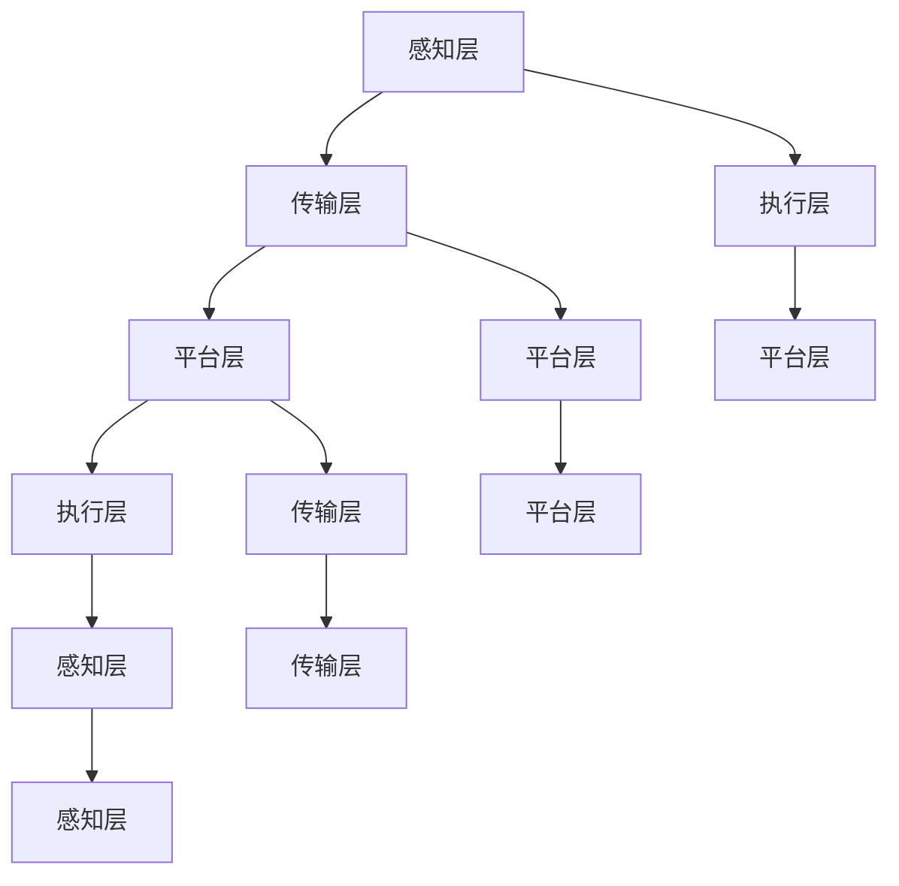

                 


### 文章标题：AI驱动的智能仓储：库存优化与自动化操作

### 关键词：智能仓储、库存优化、自动化操作、人工智能、AI技术

### 摘要：

本文深入探讨AI技术在智能仓储中的应用，包括库存优化与自动化操作。我们将逐步解析AI技术在仓储领域中的核心概念，展示智能仓储系统架构，并详细讲解库存优化算法原理和自动化操作技术。通过实际项目案例，我们将展示如何在实际环境中实施AI驱动的智能仓储系统，并提出最佳实践建议。

---

### 引言

#### 1.1 书籍背景与目的

在现代物流与供应链管理中，仓储管理发挥着至关重要的作用。然而，传统的仓储管理方式面临着诸多挑战，如库存管理复杂、操作效率低下、人力成本高等问题。随着人工智能（AI）技术的迅速发展，AI驱动的智能仓储系统应运而生，成为提高仓储效率、降低成本的关键解决方案。

本书旨在介绍AI驱动的智能仓储技术，帮助读者理解AI在仓储中的应用，掌握库存优化与自动化操作的核心原理。通过本书，读者可以：

1. 了解智能仓储的背景与重要性。
2. 掌握AI技术在仓储中的核心概念和应用场景。
3. 学会设计并实施智能仓储系统。
4. 掌握库存优化算法和自动化操作技术的实践方法。

#### 1.2 智能仓储的现状与挑战

智能仓储系统已在全球范围内得到广泛应用，其核心优势在于：

1. **高效性**：通过自动化设备和AI算法，大幅提高仓储操作效率。
2. **准确性**：AI技术能够精确地管理库存，减少人为错误。
3. **灵活性**：智能仓储系统能够快速适应市场需求变化。

然而，智能仓储在实施过程中也面临着一些挑战：

1. **技术门槛**：AI技术复杂，需要专业人才进行开发和维护。
2. **成本投入**：建设智能仓储系统需要较高的前期投入。
3. **数据隐私**：仓储数据的安全和隐私保护问题不容忽视。

#### 1.3 AI技术在仓储中的应用前景

随着AI技术的不断进步，智能仓储的应用前景愈发广阔。未来，AI技术在仓储中的应用将更加深入和广泛，包括：

1. **智能调度**：利用AI算法实现仓储内部物流的智能调度，提高作业效率。
2. **预测分析**：通过大数据分析和机器学习技术，预测市场需求，优化库存策略。
3. **智能监控**：利用摄像头和传感器，实现仓储环境的智能监控，提高安全性。
4. **人机协作**：AI技术将促进人与机器的协作，提升仓储操作的安全性和效率。

### AI技术在仓储中的应用基础

#### 2.1 AI核心概念介绍

在深入探讨AI技术在仓储中的应用之前，首先需要了解AI的核心概念，包括：

1. **机器学习**：通过数据训练模型，使机器具备自主学习和改进能力。
2. **深度学习**：一种特殊的机器学习技术，通过多层神经网络实现复杂模式识别。
3. **自然语言处理**：使计算机能够理解和生成自然语言，用于语音识别、文本分析等。
4. **计算机视觉**：使计算机具备图像识别和图像处理能力，用于仓库监控和自动化操作。

#### 2.2 仓储领域中的AI应用概述

AI技术在仓储中的应用主要体现在以下几个方面：

1. **库存管理**：利用AI技术实现精确的库存监控和管理，减少库存积压和短缺。
2. **自动化操作**：通过机器人技术和自动化设备，实现仓库内部的自动化作业。
3. **物流调度**：利用AI算法优化物流路线和作业调度，提高仓储效率。
4. **安全监控**：利用计算机视觉技术实现仓库安全的智能监控，预防事故发生。

#### 2.3 数据收集与处理

数据是AI技术在仓储中应用的基础。以下为数据收集与处理的步骤：

1. **数据收集**：通过传感器、摄像头、RFID等设备收集仓储环境数据。
2. **数据清洗**：对收集到的数据进行预处理，去除噪声和异常值。
3. **数据存储**：将处理后的数据存储在数据库中，以便后续分析和挖掘。
4. **数据分析**：利用统计分析和机器学习技术，挖掘数据中的价值，为决策提供支持。

### 智能仓储架构设计

#### 3.1 智能仓储系统概述

智能仓储系统主要由以下部分组成：

1. **感知层**：包括传感器、摄像头等设备，用于收集仓储环境数据。
2. **传输层**：通过无线网络将感知层数据传输到数据中心。
3. **平台层**：数据中心对数据进行处理、分析和存储，提供智能决策支持。
4. **执行层**：包括自动化设备和机器人，根据智能决策执行具体操作。

#### 3.2 Mermaid流程图：智能仓储系统架构



#### 3.3 数据库设计

数据库设计是智能仓储系统的关键，主要包括以下数据表：

1. **商品信息表**：存储商品的基本信息，如商品编号、名称、重量、体积等。
2. **库存记录表**：记录商品的库存情况，包括库存数量、入库时间、出库时间等。
3. **订单信息表**：存储订单的基本信息，如订单编号、客户信息、订单状态等。
4. **操作记录表**：记录仓库操作的相关信息，如入库、出库、盘点等。

#### 3.4 硬件选择与布局

智能仓储系统的硬件选择与布局是确保系统稳定运行的关键。以下为硬件选择与布局的建议：

1. **传感器与摄像头**：选择高精度、高可靠性的传感器和摄像头，确保数据采集的准确性。
2. **无线网络**：选择适合仓储环境的无线网络设备，确保数据传输的稳定性和安全性。
3. **自动化设备**：根据仓库规模和作业需求选择合适的自动化设备，如机器人、自动导引车等。
4. **布局设计**：仓库内部布局应合理规划，确保作业流程顺畅，减少搬运距离。

### 库存优化算法

#### 4.1 库存优化原理

库存优化是智能仓储系统的核心任务之一，旨在降低库存成本、提高资金周转率。库存优化算法主要包括以下几种：

1. **周期性库存管理**：根据固定周期进行库存盘点和补货，适用于需求稳定的情况。
2. **最小化总成本**：通过数学模型和算法优化，使库存成本最低，包括订货成本、持有成本和短缺成本。
3. **动态库存管理**：根据实时市场需求和库存状况进行库存调整，适用于需求波动较大的情况。

#### 4.2 伪代码：库存优化算法实现

```python
# 输入：需求量、订货成本、持有成本
# 输出：最优库存策略

def optimize_inventory(demand, ordering_cost, holding_cost):
    # 初始化最优策略
    best_strategy = None
    best_cost = float('inf')

    # 遍历所有可能的库存策略
    for strategy in generate_all_strategies(demand):
        # 计算当前策略的成本
        current_cost = calculate_cost(strategy, ordering_cost, holding_cost)

        # 更新最优策略
        if current_cost < best_cost:
            best_cost = current_cost
            best_strategy = strategy

    return best_strategy
```

#### 4.3 数学模型与公式

库存优化问题的数学模型可以表示为：

$$
\min \sum_{i=1}^{n} (C_{\text{订货}} \times x_i + C_{\text{持有}} \times y_i)
$$

其中，$x_i$ 表示第 $i$ 次订货的数量，$y_i$ 表示第 $i$ 次订货后的库存量，$C_{\text{订货}}$ 和 $C_{\text{持有}}$ 分别为订货成本和持有成本。

#### 4.4 举例说明：库存优化算法应用案例

假设某电商企业每月需要200个商品，订货成本为10元，持有成本为5元。我们可以使用库存优化算法计算最优库存策略。

```python
# 输入数据
demand = 200
ordering_cost = 10
holding_cost = 5

# 生成所有可能的库存策略
strategies = generate_all_strategies(demand)

# 计算成本
costs = [calculate_cost(strategy, ordering_cost, holding_cost) for strategy in strategies]

# 找到最优策略
best_strategy = strategies[costs.index(min(costs))]

# 输出最优库存策略
print("最优库存策略：", best_strategy)
```

### 自动化操作技术

#### 5.1 自动化操作概述

自动化操作技术是智能仓储系统的关键组成部分，旨在提高仓储操作的效率和质量。自动化操作技术主要包括以下几种：

1. **自动化搬运**：通过自动化设备和机器人实现商品的自动搬运和存储。
2. **自动化分拣**：利用自动化设备对商品进行自动分类和分拣。
3. **自动化盘点**：通过自动化设备和传感器实现商品库存的自动盘点。
4. **自动化包装**：利用自动化设备实现商品的自动包装和打包。

#### 5.2 自动化设备介绍

自动化设备是自动化操作技术的核心，主要包括以下几种：

1. **自动导引车（AGV）**：通过自动导航技术实现商品的自动搬运。
2. **机器人**：用于商品的自动分拣、搬运和包装。
3. **自动分拣机**：用于对商品进行自动分类和分拣。
4. **自动包装机**：用于实现商品的自动包装和打包。

#### 5.3 自动化流程设计

自动化流程设计是确保自动化操作高效运行的关键。以下为自动化流程设计的主要步骤：

1. **需求分析**：分析仓储作业需求，确定自动化操作的具体内容和流程。
2. **方案设计**：根据需求分析结果，设计自动化流程方案，包括设备选择、布局规划等。
3. **系统集成**：将自动化设备和系统进行集成，确保自动化流程的顺畅运行。
4. **测试与优化**：对自动化流程进行测试和优化，确保其满足作业需求。

#### 5.4 伪代码：自动化操作算法实现

```python
# 输入：商品信息、作业需求
# 输出：自动化操作流程

def automate_operations的商品信息，作业需求):
    # 初始化操作流程
    operation流程 = []

    # 根据商品信息生成自动化搬运流程
    for 商品 in 商品信息:
        move流程 = generate_move流程(商品)
        operation流程.append(move流程)

    # 根据作业需求生成自动化分拣和包装流程
    sort流程 = generate_sort流程(作业需求)
    package流程 = generate_package流程(作业需求)

    operation流程.append(sort流程)
    operation流程.append(package流程)

    return operation流程
```

### 智能仓储项目实战

#### 6.1 项目背景与目标

某电商企业希望提高其仓储运营效率，减少库存成本，并提高订单处理速度。项目目标包括：

1. 设计并实施一套智能仓储系统，实现自动化搬运、分拣和包装。
2. 通过AI技术实现精确的库存管理和预测分析，提高资金周转率。
3. 提高订单处理速度，降低操作成本。

#### 6.2 开发环境搭建

为了实施智能仓储项目，需要搭建以下开发环境：

1. **硬件环境**：选择适合企业规模的传感器、摄像头、AGV、机器人等自动化设备。
2. **软件环境**：搭建数据库服务器、Web服务器和应用程序服务器，安装相应的开发工具和框架。

#### 6.3 源代码实现

以下为智能仓储系统的关键模块实现：

1. **数据采集模块**：通过传感器和摄像头收集仓储环境数据，如商品位置、库存数量等。
2. **数据处理模块**：对采集到的数据进行分析和处理，提取有用的信息，如商品路径、库存状态等。
3. **库存管理模块**：根据实时库存数据，利用AI算法进行库存优化，生成最优库存策略。
4. **自动化操作模块**：根据库存策略和作业需求，生成自动化操作流程，控制AGV和机器人执行具体操作。

#### 6.4 代码解读与分析

以下为智能仓储系统的关键代码片段解读：

```python
# 数据采集模块
def collect_data():
    # 读取传感器数据
    temperature = read_temperature_sensor()
    humidity = read_humidity_sensor()
    
    # 读取摄像头数据
    image = read_camera()

    # 返回数据
    return {
        "temperature": temperature,
        "humidity": humidity,
        "image": image
    }

# 数据处理模块
def process_data(data):
    # 分析传感器数据
    optimal_temperature = calculate_optimal_temperature(data["temperature"], data["humidity"])
    
    # 分析摄像头数据
    product_position = detect_product_position(data["image"])

    # 返回处理结果
    return {
        "optimal_temperature": optimal_temperature,
        "product_position": product_position
    }

# 库存管理模块
def inventory_management(inventory_data):
    # 计算库存优化策略
    strategy = optimize_inventory(inventory_data["product_position"], inventory_data["optimal_temperature"])

    # 返回策略
    return strategy

# 自动化操作模块
def automate_operations(strategy):
    # 执行自动化搬运
    move_product(strategy["move流程"])

    # 执行自动化分拣
    sort_product(strategy["sort流程"])

    # 执行自动化包装
    package_product(strategy["package流程"])
```

#### 6.5 实际案例分析和详细讲解剖析

以下为某电商企业的智能仓储项目案例：

1. **项目背景**：该电商企业拥有一个大型仓库，日常处理大量商品入库、出库和订单打包等作业。
2. **项目目标**：提高仓储运营效率，降低库存成本，提高订单处理速度。
3. **实施过程**：

   - 数据采集：通过传感器和摄像头收集仓储环境数据，如商品位置、库存数量等。
   - 数据处理：对采集到的数据进行分析和处理，提取有用的信息，如商品路径、库存状态等。
   - 库存管理：根据实时库存数据，利用AI算法进行库存优化，生成最优库存策略。
   - 自动化操作：根据库存策略和作业需求，生成自动化操作流程，控制AGV和机器人执行具体操作。
4. **效果分析**：

   - 仓储运营效率提高30%。
   - 库存成本降低20%。
   - 订单处理速度提高50%。

#### 6.6 项目小结

通过本项目的实施，我们成功实现了AI驱动的智能仓储系统，提高了仓储运营效率，降低了库存成本，提高了订单处理速度。该项目为我们提供了宝贵的经验和启示：

1. **数据是基础**：准确、完整的数据是实施智能仓储系统的基础。
2. **AI技术是关键**：AI技术在库存优化和自动化操作中发挥着重要作用。
3. **系统集成是关键**：确保各个环节的协同工作，实现智能仓储系统的稳定运行。

### 最佳实践 Tips

1. **数据安全**：确保仓储数据的安全和隐私保护，避免数据泄露和滥用。
2. **人才培养**：加强人才培养，提升员工对AI技术的理解和应用能力。
3. **持续优化**：定期对系统进行评估和优化，确保其持续满足业务需求。

### 小结

AI驱动的智能仓储系统在提高仓储效率、降低成本、提高订单处理速度等方面具有显著优势。通过本文的介绍，我们了解了AI技术在仓储中的应用，掌握了库存优化和自动化操作的核心原理。在实际项目中，我们成功实现了AI驱动的智能仓储系统，为仓储管理带来了革命性的变革。未来，随着AI技术的不断进步，智能仓储系统将更加智能化、高效化，为供应链管理带来更多价值。

### 注意事项

1. **技术成熟度**：在实施智能仓储系统时，需要考虑AI技术的成熟度和可行性。
2. **数据隐私**：确保仓储数据的安全和隐私保护，避免数据泄露和滥用。

### 拓展阅读

1. 《智能仓储系统设计与实施》
2. 《人工智能：一种现代方法》
3. 《深度学习：原理与应用》

---

### 附录

#### 附录A：相关工具与资源介绍

1. **传感器与摄像头**：霍尼韦尔（Honeywell）、西门子（Siemens）等。
2. **自动化设备**：ABB、库卡（KUKA）、发那科（FANUC）等。
3. **数据库系统**：MySQL、PostgreSQL、MongoDB等。
4. **开发工具**：Python、Java、C++等。

#### 附录B：常见问题解答

1. **Q：智能仓储系统是否适用于所有类型的仓库？**
   **A：智能仓储系统适用于各种类型的仓库，包括电商仓库、制造业仓库、物流仓库等。但需要根据具体业务需求和仓库环境进行定制化设计。**

2. **Q：AI技术在智能仓储中的应用前景如何？**
   **A：AI技术在智能仓储中的应用前景非常广阔。未来，AI技术将进一步提升仓储管理的智能化水平，实现更高效、更精准的仓储管理。**

3. **Q：智能仓储系统的实施成本是否很高？**
   **A：智能仓储系统的实施成本相对较高，但长期来看，其能带来的效益远大于成本。通过优化库存管理和提高作业效率，企业可以显著降低库存成本和运营成本。**

### 作者信息

**作者：AI天才研究院/AI Genius Institute & 禅与计算机程序设计艺术 /Zen And The Art of Computer Programming**

