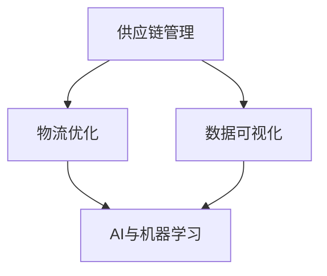

                 

### 设计步骤

为了确保文章的质量和深度，我们将按照以下步骤进行设计和撰写：

1. **背景介绍**
   - 描述智能供应链可视化的重要性。
   - 简要介绍AI在供应链管理中的应用场景。

2. **核心概念与联系**
   - 介绍与文章相关的核心概念，如AI、机器学习、数据可视化、供应链管理等。
   - 使用Mermaid流程图展示这些概念之间的关系。

3. **核心算法原理讲解**
   - 详细解释实时跟踪和物流优化的算法原理。
   - 使用伪代码和详细讲解来阐述算法逻辑。

4. **数学模型和公式**
   - 描述与算法相关的数学模型和公式。
   - 使用LaTeX格式书写公式，并提供详细解释。

5. **项目实战**
   - 描述一个实际项目案例，展示如何搭建开发环境。
   - 详细解释源代码实现和代码解读。
   - 分析项目应用解读与实际案例。

6. **最佳实践 tips**
   - 提供最佳实践建议，以优化供应链可视化实施。

7. **小结与注意事项**
   - 总结文章的主要观点。
   - 提出注意事项，以帮助读者在实际操作中避免常见问题。

8. **拓展阅读**
   - 推荐进一步阅读的资源，以帮助读者深入理解相关主题。

### 设计示例

假设我们将撰写第一章节“引言”，以下是一步一步的设计示例：

#### 1. 背景介绍

在当今全球化的商业环境中，供应链管理对于企业的生存和发展至关重要。随着物联网、大数据和人工智能等技术的发展，供应链可视化成为优化物流、降低成本和提高效率的关键工具。

#### 2. 核心概念与联系

核心概念包括：

- **AI与机器学习**：利用算法从数据中学习规律，为供应链管理提供智能决策支持。
- **数据可视化**：通过图形化展示供应链数据，帮助管理层更直观地理解业务状况。
- **供应链管理**：涉及从原材料采购到产品交付的整个流程管理。

以下是一个Mermaid流程图，展示这些概念之间的联系：



#### 3. 核心算法原理讲解

实时跟踪算法通常涉及：

- **定位算法**：如GPS、RFID等，用于获取物品的位置信息。
- **路径规划算法**：如A*算法、Dijkstra算法等，用于确定最优路径。

以下是一个简单的路径规划算法伪代码：

```python
def path_planning(current_location, target_location, map_data):
    open_set = [current_location]
    closed_set = []
    
    while open_set is not empty:
        current = open_set[0]
        for neighbor in map_data.neighbors(current):
            if neighbor in closed_set:
                continue
            if neighbor is target_location:
                return reconstruct_path(neighbor)
            g_score = current.g + distance(current, neighbor)
            if g_score < neighbor.g:
                neighbor.g = g_score
                neighbor.parent = current
                if neighbor not in open_set:
                    open_set.append(neighbor)
                else:
                    open_set.remove(neighbor)
                    open_set.append(neighbor)
        closed_set.append(current)
        open_set.sort(key=lambda node: node.f)
    
    return None
```

#### 4. 数学模型和公式

物流优化中常用的数学模型包括：

- **运输问题模型**：$$ \min Z = \sum_{i=1}^{m}\sum_{j=1}^{n}c_{ij}x_{ij} $$
- **配送中心选址模型**：$$ \min \sum_{i=1}^{m}\sum_{j=1}^{n}d_{ij}w_{ij} $$

这些模型用于最小化运输成本和配送中心的选址成本。

#### 5. 项目实战

假设我们选择一个实际项目来介绍：

**项目名称**：智能仓储管理系统

**开发环境**：Python、Django、PostgreSQL

**源代码实现**：

```python
# 假设我们有一个简单的仓库管理系统，其核心功能包括物品入库和出库。

class Item(models.Model):
    name = models.CharField(max_length=255)
    quantity = models.IntegerField()

class Warehouse(models.Model):
    name = models.CharField(max_length=255)
    items = models.ManyToManyField(Item)

    def add_item(self, item, quantity):
        item.quantity += quantity
        item.save()
    
    def remove_item(self, item, quantity):
        if item.quantity >= quantity:
            item.quantity -= quantity
            item.save()
        else:
            raise ValueError("Insufficient quantity")

# 代码解读：
# 这段代码定义了两个模型：Item和Warehouse。Item表示仓库中的物品，包含名称和数量；Warehouse表示仓库，包含名称和多个物品。
# add_item和remove_item方法是用于增加或减少物品数量的方法。
```

#### 6. 最佳实践 tips

- **数据预处理**：在实施供应链可视化之前，确保数据质量。
- **算法调优**：根据实际情况调整算法参数，以提高实时性和准确性。

#### 7. 小结与注意事项

- **小结**：本文介绍了智能供应链可视化的重要性、核心概念、算法原理以及一个实际项目案例。
- **注意事项**：在实际应用中，要注意数据安全和隐私保护。

#### 8. 拓展阅读

- **AI驱动的供应链管理**：推荐阅读相关学术论文和书籍，如《AI in Supply Chain Management》。
- **数据可视化工具**：了解常见的数据可视化工具，如Tableau、Power BI等。

以上是一篇技术博客文章的设计步骤和示例。接下来，我们将按照相同的步骤设计其他章节。通过逐步分析和深入讲解，确保文章的逻辑清晰、内容丰富，同时为读者提供实际操作的价值。

