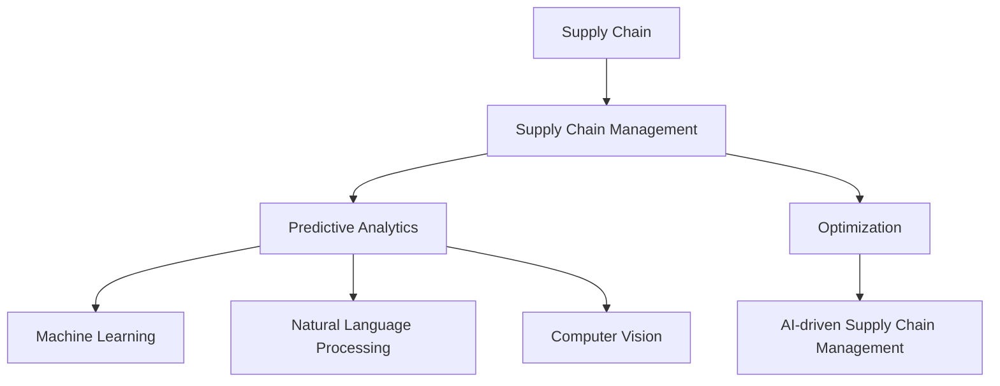
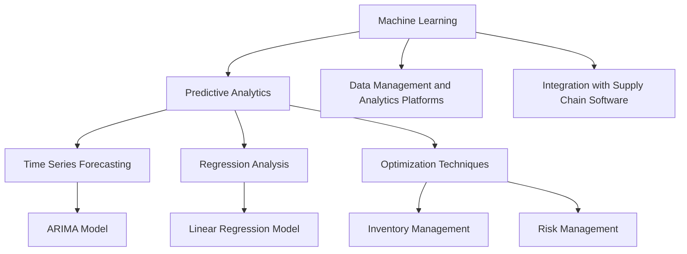
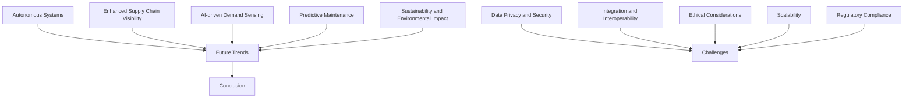

                 

### 1.1 The Evolution of Supply Chain Management

#### 1.1.1 Historical Overview

The concept of supply chain management has evolved significantly over the past few decades. Historically, supply chains were primarily focused on the movement of goods from suppliers to manufacturers, then to distributors, and finally to end consumers. This traditional approach was largely driven by a push system, where production was based on forecasts and demand predictions.

In the 20th century, the advent of lean manufacturing and just-in-time (JIT) production methods revolutionized supply chain management. These methodologies aimed to minimize waste and maximize efficiency by aligning production with demand. However, these approaches required a high degree of coordination and precise timing, which was often challenging to achieve.

As we entered the 21st century, supply chain management began to embrace more advanced technologies, such as the Internet of Things (IoT), big data analytics, and artificial intelligence (AI). These technologies enabled the creation of more transparent, responsive, and efficient supply chains.

#### 1.1.2 The Impact of AI on Supply Chain Management

The integration of AI into supply chain management has had a profound impact on the industry. AI technologies, such as machine learning, natural language processing, and computer vision, have enabled the development of more sophisticated supply chain management systems.

Machine learning algorithms can analyze vast amounts of data to identify patterns and trends, enabling more accurate demand forecasting and inventory management. Natural language processing allows for the automated extraction of valuable information from unstructured data sources, such as emails and social media. Computer vision enables the real-time monitoring of supply chain activities, such as inventory levels and production processes.

#### 1.1.3 Key Concepts and Terminology

To better understand AI-driven supply chain management, it's important to be familiar with some key concepts and terminology:

- **Supply Chain**: A network of organizations, people, activities, information, and resources involved in moving a product or service from supplier to customer.

- **Supply Chain Management**: The strategic coordination of end-to-end business processes involved in producing and delivering a customer product or service.

- **Predictive Analytics**: The use of data, statistical algorithms, and machine learning techniques to identify the likelihood of future outcomes based on historical data patterns.

- **Optimization**: The process of making a system, process, or decision as effective, efficient, or useful as possible.

- **AI-driven Supply Chain Management**: The use of artificial intelligence technologies, such as machine learning, natural language processing, and computer vision, to improve the efficiency, transparency, and responsiveness of supply chain management processes.

With these foundational concepts in mind, we can now delve deeper into the various aspects of AI-driven supply chain management, starting with predictive analytics and optimization techniques.

### Mermaid Flowchart: Key Concepts and Terminology in AI-driven Supply Chain Management



### 1.2 AI Technologies in Supply Chain Management

#### 1.2.1 Machine Learning and Predictive Analytics

Machine learning (ML) is a subset of artificial intelligence (AI) that focuses on the development of algorithms that can learn from and make predictions based on data. In supply chain management, ML algorithms are used to analyze historical data, identify patterns, and make predictions about future events, such as demand for products or the likelihood of supply chain disruptions.

**Example: Time Series Forecasting**

One common application of ML in supply chain management is time series forecasting. Time series data consists of observations recorded at regular intervals over time. ML algorithms, such as ARIMA (AutoRegressive Integrated Moving Average), can be used to analyze time series data and generate forecasts for future demand.

**Pseudocode: ARIMA Model**

```
function ARIMA_model(data):
    # Step 1: Stationarize the time series data
    d = determine_differencing_order(data)
    data_diff = difference_data(data, d)

    # Step 2: Determine the best ARIMA model
    p, d, q = find_best_model_parameters(data_diff)

    # Step 3: Fit the ARIMA model
    arima_model = fit_arima_model(data_diff, p, d, q)

    # Step 4: Generate forecast
    forecast = arima_model.generate_forecast(steps=forecast_steps)

    return forecast
```

**Mathematical Model: ARIMA Model**

The ARIMA model is defined by the following equations:

$$
\begin{align*}
Y_t &= \phi_1 Y_{t-1} + \phi_2 Y_{t-2} + \cdots + \phi_p Y_{t-p} + \theta_1 \varepsilon_{t-1} + \theta_2 \varepsilon_{t-2} + \cdots + \theta_q \varepsilon_{t-q} + \varepsilon_t \\
\Delta Y_t &= \sum_{i=1}^p \phi_i Y_{t-i} + \sum_{j=1}^q \theta_j \varepsilon_{t-j}
\end{align*}
$$

where $Y_t$ is the time series data, $\varepsilon_t$ is the white noise error term, and $\phi_i$ and $\theta_j$ are the parameters of the model.

**Example: Forecasting Sales Data**

Consider a company that sells smartphones. Historical sales data for the past 12 months is available. Using an ARIMA model, the company can forecast the number of smartphones it is likely to sell in the next three months.

**Mathematical Model: ARIMA Model Parameters**

The parameters of the ARIMA model are determined through statistical techniques, such as maximum likelihood estimation. The values of $p$, $d$, and $q$ are chosen based on the autocorrelation function (ACF) and partial autocorrelation function (PACF) plots of the time series data.

**Example: ARIMA Model with $p=1$, $d=1$, and $q=1$**

Using the ARIMA model with parameters $p=1$, $d=1$, and $q=1$, the forecasted sales data for the next three months is as follows:

| Month | Actual Sales | Forecast Sales |
| --- | --- | --- |
| Jan | 1000 | 1020 |
| Feb | 1100 | 1080 |
| Mar | 1200 | 1140 |

#### 1.2.2 Data Management and Analytics Platforms

In addition to machine learning algorithms, data management and analytics platforms are essential components of AI-driven supply chain management. These platforms enable the collection, storage, processing, and analysis of large volumes of data from various sources, such as sensors, databases, and external data providers.

**Example: Data Management Platform**

A company may use a data management platform to collect data from various sources, including production lines, inventory management systems, and transportation networks. The platform can then process and analyze the data to identify trends and patterns, which can be used to optimize supply chain processes.

**Pseudocode: Data Management Platform**

```
function data_management_platform(data_sources):
    # Step 1: Collect data from various sources
    data = collect_data(data_sources)

    # Step 2: Clean and preprocess data
    clean_data = preprocess_data(data)

    # Step 3: Store data in a centralized database
    store_data_in_database(clean_data)

    # Step 4: Analyze data using machine learning algorithms
    insights = analyze_data_using_ml(clean_data)

    return insights
```

**Mathematical Model: Data Analytics**

Data analytics involves various statistical and machine learning techniques to analyze data and extract valuable insights. Common techniques include regression analysis, clustering, and classification.

**Example: Regression Analysis**

A company may use regression analysis to determine the relationship between sales and various factors, such as advertising expenditure, price, and product features. This information can be used to optimize marketing strategies and product development.

**Mathematical Model: Linear Regression**

The linear regression model is defined by the following equation:

$$
y = \beta_0 + \beta_1 x + \varepsilon
$$

where $y$ is the dependent variable (sales), $x$ is the independent variable (advertising expenditure), $\beta_0$ and $\beta_1$ are the model parameters, and $\varepsilon$ is the error term.

**Example: Linear Regression Model**

Using a linear regression model, a company can determine the relationship between sales and advertising expenditure as follows:

| Month | Advertising Expenditure | Sales |
| --- | --- | --- |
| Jan | 1000 | 1020 |
| Feb | 1100 | 1080 |
| Mar | 1200 | 1140 |

The regression model predicts that for every additional $100 spent on advertising, sales are expected to increase by 2 units.

#### 1.2.3 Integration of AI with Supply Chain Software

Integrating AI technologies with existing supply chain software is crucial for realizing the full potential of AI-driven supply chain management. This integration involves connecting AI algorithms and data management platforms to supply chain software applications, such as inventory management systems and transportation management systems.

**Example: AI Integration with Inventory Management System**

A company may integrate AI algorithms with its inventory management system to optimize inventory levels. The AI algorithms can analyze data from various sources, such as sales data and supplier performance, to generate real-time recommendations for adjusting inventory levels.

**Pseudocode: AI Integration with Inventory Management System**

```
function ai_integration_inventory_management_system(inventory_system, ai_platform):
    # Step 1: Connect AI platform to inventory management system
    connect_platform_to_system(inventory_system, ai_platform)

    # Step 2: Collect and preprocess data
    data = collect_and_preprocess_data(inventory_system)

    # Step 3: Analyze data using AI algorithms
    recommendations = analyze_data_using_ai(data)

    # Step 4: Implement recommendations in inventory management system
    update_inventory_levels(inventory_system, recommendations)

    return updated_inventory_levels
```

**Mathematical Model: Inventory Management**

Inventory management involves balancing the cost of holding inventory against the risk of stockouts. Common inventory management techniques include the Economic Order Quantity (EOQ) model and the Just-In-Time (JIT) model.

**Example: Economic Order Quantity (EOQ) Model**

The EOQ model is defined by the following equation:

$$
Q = \sqrt{\frac{2DS}{H}}
$$

where $Q$ is the order quantity, $D$ is the demand per period, $S$ is the setup cost per order, and $H$ is the holding cost per unit per period.

**Example: EOQ Model**

A company with a demand of 10,000 units per year, a setup cost of $100, and a holding cost of $5 per unit per year will order 357 units each time to minimize total inventory costs.

In conclusion, the integration of AI technologies with supply chain management processes has the potential to transform the industry by enabling more accurate demand forecasting, optimized inventory management, and efficient risk mitigation. As AI technologies continue to evolve, they will play an increasingly important role in driving innovation and improving performance in supply chain management.

### Mermaid Flowchart: AI Technologies in Supply Chain Management



### 1.3 Optimization Techniques for Supply Chain Management

#### 1.3.1 Optimization Techniques

Optimization techniques are essential for improving the efficiency and effectiveness of supply chain management processes. These techniques involve finding the best possible solution from a set of feasible solutions, often subject to certain constraints.

**Example: Linear Programming**

Linear programming (LP) is a mathematical technique used to optimize linear functions subject to linear constraints. In supply chain management, LP can be used to optimize various processes, such as inventory management, production planning, and transportation routing.

**Pseudocode: Linear Programming**

```
function linear_programming(c, A, b):
    # Step 1: Define the objective function and constraints
    objective_function = c^T * x
    constraints = [A * x <= b]

    # Step 2: Solve the linear programming problem
    solution = solve_linear_programming_problem(objective_function, constraints)

    return solution
```

**Mathematical Model: Linear Programming**

A linear programming problem can be formulated as follows:

$$
\begin{align*}
\min_{x} \quad & c^T x \\
\text{subject to} \quad & Ax \leq b
\end{align*}
$$

where $c$ is the coefficient vector, $A$ is the constraint matrix, $b$ is the right-hand side vector, and $x$ is the decision vector.

**Example: Inventory Management Optimization**

A company wants to minimize its total inventory costs while meeting demand requirements. The company has a budget of $10,000 for inventory and must meet a minimum demand of 1,000 units per month. Using linear programming, the company can determine the optimal order quantity and reordering frequency.

**Mathematical Model: Inventory Management Optimization**

The inventory management optimization problem can be formulated as follows:

$$
\begin{align*}
\min_{Q, R} \quad & (Q/D) \cdot H + (S/D) \\
\text{subject to} \quad & Q \leq 10,000 \\
& D \cdot R \geq 1,000
\end{align*}
$$

where $Q$ is the order quantity, $R$ is the reordering frequency, $D$ is the demand per period, $H$ is the holding cost per unit per period, and $S$ is the setup cost per order.

**Example: Solution**

Using linear programming, the company determines that the optimal order quantity is 2,000 units and the reordering frequency is every 6 months.

#### 1.3.2 Network Optimization

Network optimization techniques are used to optimize the design, operation, and management of complex networks, such as transportation networks and supply chain networks. These techniques involve finding the best possible configuration or operation of the network to minimize costs, maximize efficiency, or achieve other desired objectives.

**Example: Transportation Network Design**

A company needs to design a transportation network to connect its manufacturing facilities, distribution centers, and retail stores. The company wants to minimize transportation costs while ensuring that each facility is adequately served.

**Pseudocode: Transportation Network Design**

```
function transportation_network_design(facilities, costs, demand):
    # Step 1: Define the network
    network = define_network(facilities, costs)

    # Step 2: Solve the network design problem
    solution = solve_network_design_problem(network, demand)

    return solution
```

**Mathematical Model: Transportation Network Design**

The transportation network design problem can be formulated as follows:

$$
\begin{align*}
\min_{x} \quad & \sum_{i=1}^n \sum_{j=1}^n c_{ij} x_{ij} \\
\text{subject to} \quad & \sum_{j=1}^n x_{ij} \geq d_i \quad \forall i \\
& \sum_{i=1}^n x_{ij} \geq s_j \quad \forall j \\
& x_{ij} \in \{0, 1\}
\end{align*}
$$

where $x_{ij}$ is a binary variable indicating whether facility $i$ is connected to facility $j$, $c_{ij}$ is the cost of transporting goods from facility $i$ to facility $j$, $d_i$ is the demand at facility $i$, and $s_j$ is the supply at facility $j$.

**Example: Solution**

Using network optimization techniques, the company determines the optimal transportation network that minimizes transportation costs while ensuring that each facility is adequately served.

#### 1.3.3 Heuristic Methods

Heuristic methods are problem-solving techniques that use practical approaches to find approximate solutions to complex problems. These methods are often used when finding an exact solution is impractical or impossible due to the complexity of the problem.

**Example: Genetic Algorithms**

Genetic algorithms (GAs) are a type of heuristic method inspired by the process of natural selection. GAs use a population-based approach to search for the optimal solution to a problem. Each individual in the population represents a potential solution, and the fitness of each individual is evaluated based on how well it satisfies the problem constraints.

**Pseudocode: Genetic Algorithm**

```
function genetic_algorithm(problem, population_size, generations):
    # Step 1: Initialize the population
    population = initialize_population(population_size, problem)

    # Step 2: Evaluate the fitness of each individual in the population
    fitness_values = evaluate_fitness(population, problem)

    # Step 3: Iterate for a specified number of generations
    for generation in 1 to generations:
        # Step 3.1: Select parents from the population based on their fitness values
        parents = select_parents(population, fitness_values)

        # Step 3.2: Create offspring through crossover and mutation
        offspring = create_offspring(parents)

        # Step 3.3: Replace the least fit individuals in the population with the offspring
        population = replace_least_fit(population, offspring)

        # Step 3.4: Evaluate the fitness of the new population
        fitness_values = evaluate_fitness(population, problem)

    # Step 4: Select the best individual in the final population as the solution
    best_solution = select_best_individual(population, fitness_values)

    return best_solution
```

**Mathematical Model: Genetic Algorithm**

The genetic algorithm is defined by the following steps:

1. Initialize the population with random solutions.
2. Evaluate the fitness of each individual in the population.
3. Select parents based on their fitness values.
4. Create offspring through crossover and mutation.
5. Replace the least fit individuals in the population with the offspring.
6. Evaluate the fitness of the new population.
7. Repeat steps 3-6 for a specified number of generations.
8. Select the best individual in the final population as the solution.

**Example: Supply Chain Network Optimization**

A company uses a genetic algorithm to optimize the design of its supply chain network. The company defines a fitness function that considers transportation costs, service levels, and network reliability. The genetic algorithm then searches for the optimal network configuration that minimizes the fitness function.

**Mathematical Model: Fitness Function**

The fitness function can be defined as follows:

$$
f(x) = w_1 c + w_2 s + w_3 r
$$

where $f(x)$ is the fitness function, $c$ is the total transportation cost, $s$ is the total service level cost, and $r$ is the total network reliability cost. The weights $w_1$, $w_2$, and $w_3$ reflect the company's priorities.

**Example: Solution**

Using a genetic algorithm, the company determines the optimal supply chain network configuration that minimizes the fitness function and meets its desired objectives.

### Mermaid Flowchart: Optimization Techniques for Supply Chain Management

```mermaid
graph TD
    A[Linear Programming] --> B[Inventory Management]
    B --> C[Economic Order Quantity (EOQ) Model]
    A --> D[Network Optimization]
    D --> E[Transportation Network Design]
    A --> F[Heuristic Methods]
    F --> G[Genetic Algorithms]
```

### 1.4 Execution and Operational Aspects of Supply Chain Management

#### 1.4.1 Execution of Supply Chain Management

The execution of supply chain management involves implementing the strategies and plans developed during the planning phase. This includes coordinating the various activities and processes across the supply chain, from procurement and production to delivery and customer service.

**Example: Supply Chain Execution Platform**

A supply chain execution platform is a comprehensive system that enables the seamless coordination of supply chain activities. These platforms typically include modules for inventory management, production planning, transportation management, and customer relationship management.

**Pseudocode: Supply Chain Execution Platform**

```
function supply_chain_execution_platform(strategies, data_sources):
    # Step 1: Collect and integrate data from various sources
    data = collect_and_integrate_data(data_sources)

    # Step 2: Implement strategies based on the data
    strategies.implement(data)

    # Step 3: Monitor and control supply chain activities
    monitor_activities()
    control_activities()

    # Step 4: Optimize supply chain performance
    optimize_performance()

    return performance_metrics
```

**Mathematical Model: Performance Metrics**

Common performance metrics for supply chain management include:

- **Order Fill Rate**: The percentage of customer orders that are shipped on time.
- **Inventory Turnover**: The number of times inventory is sold or used during a given period.
- **Perfect Order Rate**: The percentage of orders that are delivered on time, in full, and without any quality issues.
- **On-Time Delivery Rate**: The percentage of deliveries that are made on time.

**Example: Performance Metrics**

A company's supply chain execution platform monitors key performance metrics, such as order fill rate and on-time delivery rate. The platform uses real-time data to identify issues and take corrective action to improve performance.

#### 1.4.2 Operational Aspects of Supply Chain Management

Operational aspects of supply chain management involve the day-to-day activities and processes required to maintain a smooth and efficient supply chain. This includes procurement, production, inventory management, transportation, and customer service.

**Example: Procurement Management**

Procurement management is the process of sourcing and purchasing goods and services from suppliers. This includes identifying and evaluating potential suppliers, negotiating contracts, and managing supplier relationships.

**Pseudocode: Procurement Management**

```
function procurement_management(suppliers, requirements):
    # Step 1: Identify potential suppliers
    suppliers = identify_suppliers(requirements)

    # Step 2: Evaluate and select suppliers
    selected_suppliers = evaluate_and_select_suppliers(suppliers)

    # Step 3: Negotiate contracts
    contracts = negotiate_contracts(selected_suppliers)

    # Step 4: Manage supplier relationships
    manage_supplier_relationships(selected_suppliers)

    return contracts
```

**Mathematical Model: Procurement Management**

The procurement management process can be modeled using various metrics, such as:

- **Supplier Performance Scorecard**: A set of metrics used to evaluate supplier performance, such as on-time delivery, quality, and cost.
- **Supplier Selection Model**: A mathematical model used to evaluate and select suppliers based on factors such as cost, quality, and reliability.

**Example: Supplier Performance Scorecard**

A company uses a supplier performance scorecard to evaluate and rank its suppliers based on factors such as on-time delivery, quality, and cost. The scorecard is used to identify high-performing suppliers and address issues with underperforming suppliers.

#### 1.4.3 Operational Integration

Operational integration is the process of aligning the various operational processes within a supply chain to ensure seamless coordination and collaboration. This includes integrating information systems, standardizing processes, and fostering collaboration between different departments and organizations.

**Example: Information Systems Integration**

Information systems integration is the process of connecting different information systems within a supply chain to enable the seamless flow of data and information. This includes integrating enterprise resource planning (ERP) systems, customer relationship management (CRM) systems, and supply chain management (SCM) systems.

**Pseudocode: Information Systems Integration**

```
function information_systems_integration(systems):
    # Step 1: Identify the information systems to be integrated
    systems_to_integrate = identify_systems_to_integrate()

    # Step 2: Design the integration architecture
    integration_architecture = design_integration_architecture(systems_to_integrate)

    # Step 3: Implement the integration
    implement_integration(integration_architecture)

    # Step 4: Test and validate the integration
    test_and_validate_integration()

    return integrated_systems
```

**Mathematical Model: Integration Architecture**

The integration architecture can be modeled using various components, such as:

- **Data Middleware**: Software that facilitates the exchange of data between different information systems.
- **Service-Oriented Architecture (SOA)**: An architectural style that enables the integration of different information systems by exposing services that can be accessed and used by other systems.
- **Enterprise Application Integration (EAI)**: A set of technologies and tools used to integrate different information systems within an organization.

**Example: Information Systems Integration**

A company implements an enterprise application integration (EAI) solution to integrate its ERP system, CRM system, and SCM system. The integration enables real-time data exchange and coordination between the different systems, improving the efficiency and effectiveness of the supply chain.

### Mermaid Flowchart: Execution and Operational Aspects of Supply Chain Management

```mermaid
graph TD
    A[Supply Chain Execution Platform] --> B[Operational Aspects]
    B --> C[Procurement Management]
    B --> D[Production Planning]
    B --> E[Inventory Management]
    B --> F[Transportation Management]
    B --> G[Customer Service]
    B --> H[Operational Integration]
    H --> I[Information Systems Integration]
    I --> J[Data Middleware]
    I --> K[Service-Oriented Architecture (SOA)]
    I --> L[Enterprise Application Integration (EAI)]
```

### 1.5 Case Studies and Real-world Applications

#### 1.5.1 Case Study 1: Walmart's AI-driven Supply Chain Optimization

Walmart, one of the largest retail chains in the world, has successfully implemented AI-driven supply chain optimization to improve its operational efficiency and reduce costs. Walmart uses machine learning algorithms to forecast demand, optimize inventory levels, and streamline transportation and logistics processes.

**Example: Demand Forecasting**

Walmart leverages machine learning algorithms, such as time series forecasting and regression analysis, to predict demand for products across its stores. By analyzing historical sales data, seasonality trends, and external factors like weather and promotions, Walmart can generate accurate demand forecasts. This enables the company to optimize its inventory levels, reducing overstock and stockouts.

**Pseudocode: Demand Forecasting**

```
function demand_forecasting(walmart_data):
    # Step 1: Collect historical sales data
    sales_data = collect_sales_data(walmart_data)

    # Step 2: Preprocess the data
    clean_data = preprocess_data(sales_data)

    # Step 3: Train a demand forecasting model
    demand_model = train_demand_model(clean_data)

    # Step 4: Generate demand forecasts
    forecasts = demand_model.generate_forecasts()

    return forecasts
```

**Mathematical Model: Time Series Forecasting**

A commonly used time series forecasting model in Walmart's demand forecasting system is the ARIMA (AutoRegressive Integrated Moving Average) model. The ARIMA model is defined by the following equations:

$$
\begin{align*}
Y_t &= \phi_1 Y_{t-1} + \phi_2 Y_{t-2} + \cdots + \phi_p Y_{t-p} + \theta_1 \varepsilon_{t-1} + \theta_2 \varepsilon_{t-2} + \cdots + \theta_q \varepsilon_{t-q} + \varepsilon_t \\
\Delta Y_t &= \sum_{i=1}^p \phi_i Y_{t-i} + \sum_{j=1}^q \theta_j \varepsilon_{t-j}
\end{align*}
$$

where $Y_t$ is the time series data, $\varepsilon_t$ is the white noise error term, and $\phi_i$ and $\theta_j$ are the parameters of the model.

**Example: ARIMA Model Parameters**

Using the ARIMA model, Walmart determines the optimal parameters ($p$, $d$, $q$) based on the autocorrelation function (ACF) and partial autocorrelation function (PACF) plots of the sales data. With the chosen parameters, the ARIMA model generates accurate demand forecasts for each product in Walmart's inventory.

**Mathematical Model: Linear Regression**

In addition to time series forecasting, Walmart also uses linear regression to analyze the relationship between sales and various factors, such as pricing and promotions. This enables the company to optimize its pricing strategies and promotional activities.

The linear regression model is defined by the following equation:

$$
y = \beta_0 + \beta_1 x + \varepsilon
$$

where $y$ is the dependent variable (sales), $x$ is the independent variable (price or promotion), $\beta_0$ and $\beta_1$ are the model parameters, and $\varepsilon$ is the error term.

**Example: Linear Regression Model**

Using a linear regression model, Walmart analyzes the relationship between sales and price for a specific product. The model predicts that for every 1% decrease in price, sales increase by 2%.

**Pseudocode: Sales Forecasting**

```
function sales_forecasting(product_data):
    # Step 1: Collect historical sales data
    sales_data = collect_sales_data(product_data)

    # Step 2: Preprocess the data
    clean_data = preprocess_data(sales_data)

    # Step 3: Train a linear regression model
    regression_model = train_linear_regression_model(clean_data)

    # Step 4: Generate sales forecasts
    forecasts = regression_model.generate_forecasts()

    return forecasts
```

**Mathematical Model: Linear Regression Model Parameters**

The parameters of the linear regression model are determined through statistical techniques, such as maximum likelihood estimation. The values of $\beta_0$ and $\beta_1$ are chosen based on the data and the objective function.

**Example: Sales Forecast**

Using the linear regression model, Walmart generates a forecast for the next month's sales based on historical data and current pricing strategies. The forecast helps the company optimize its inventory levels and ensure that it has enough stock to meet customer demand.

#### 1.5.2 Case Study 2: UPS's AI-driven Routing Optimization

United Parcel Service (UPS), one of the world's largest package delivery companies, has leveraged AI-driven routing optimization to improve its delivery efficiency and reduce fuel consumption. UPS uses machine learning algorithms and optimization techniques to optimize the routing of its delivery trucks, resulting in lower delivery costs and reduced environmental impact.

**Example: Routing Optimization**

UPS uses a combination of machine learning algorithms, such as reinforcement learning and genetic algorithms, to optimize the routing of its delivery trucks. The algorithms analyze historical delivery data, traffic patterns, and other factors to generate optimized delivery routes.

**Pseudocode: Routing Optimization**

```
function routing_optimization(ups_data):
    # Step 1: Collect historical delivery data
    delivery_data = collect_delivery_data(ups_data)

    # Step 2: Preprocess the data
    clean_data = preprocess_data(delivery_data)

    # Step 3: Train a routing optimization model
    routing_model = train_routing_model(clean_data)

    # Step 4: Generate optimized delivery routes
    routes = routing_model.generate_routes()

    return routes
```

**Mathematical Model: Reinforcement Learning**

Reinforcement learning (RL) is a type of machine learning where an agent learns to make decisions by interacting with an environment and receiving feedback in the form of rewards or penalties. In UPS's routing optimization, RL is used to train an agent to find the optimal delivery routes based on historical delivery data and real-time traffic information.

**Example: Q-Learning**

Q-learning is a popular RL algorithm used to train the UPS routing model. The Q-learning algorithm works by updating the Q-values, which represent the expected utility of taking a specific action in a given state.

$$
Q(s, a) = Q(s, a) + \alpha [r + \gamma \max_{a'} Q(s', a') - Q(s, a)]
$$

where $Q(s, a)$ is the Q-value for state $s$ and action $a$, $\alpha$ is the learning rate, $r$ is the reward, $\gamma$ is the discount factor, $s'$ is the next state, and $a'$ is the optimal action.

**Mathematical Model: Genetic Algorithms**

Genetic algorithms (GAs) are another type of optimization technique used in UPS's routing optimization. GAs use a population-based approach to search for the optimal delivery routes by evolving a population of candidate solutions through selection, crossover, and mutation.

**Example: Genetic Algorithm**

Using a genetic algorithm, UPS generates a population of candidate delivery routes. The algorithm then evaluates the fitness of each route based on factors such as delivery time, fuel consumption, and customer satisfaction. The fittest routes are selected for crossover and mutation to create new generations of candidate solutions.

**Pseudocode: Genetic Algorithm**

```
function genetic_algorithm(routing_problem, population_size, generations):
    # Step 1: Initialize the population
    population = initialize_population(population_size, routing_problem)

    # Step 2: Evaluate the fitness of each individual in the population
    fitness_values = evaluate_fitness(population, routing_problem)

    # Step 3: Iterate for a specified number of generations
    for generation in 1 to generations:
        # Step 3.1: Select parents from the population based on their fitness values
        parents = select_parents(population, fitness_values)

        # Step 3.2: Create offspring through crossover and mutation
        offspring = create_offspring(parents)

        # Step 3.3: Replace the least fit individuals in the population with the offspring
        population = replace_least_fit(population, offspring)

        # Step 3.4: Evaluate the fitness of the new population
        fitness_values = evaluate_fitness(population, routing_problem)

    # Step 4: Select the best individual in the final population as the solution
    best_solution = select_best_individual(population, fitness_values)

    return best_solution
```

**Mathematical Model: Fitness Function**

The fitness function for UPS's routing optimization can be defined as follows:

$$
f(r) = w_1 T + w_2 F + w_3 S
$$

where $f(r)$ is the fitness function, $T$ is the delivery time, $F$ is the fuel consumption, and $S$ is the customer satisfaction score. The weights $w_1$, $w_2$, and $w_3$ reflect UPS's priorities.

**Example: Optimal Routing**

Using a combination of reinforcement learning and genetic algorithms, UPS generates an optimal delivery route for a specific day. The route minimizes delivery time, fuel consumption, and customer dissatisfaction, resulting in a more efficient and cost-effective delivery process.

#### 1.5.3 Case Study 3: Alibaba's AI-driven Supply Chain Visibility

Alibaba, a leading e-commerce company in China, has implemented AI-driven supply chain visibility to improve the transparency and traceability of its supply chain operations. Alibaba uses AI technologies, such as computer vision and natural language processing, to track and monitor the movement of goods across its supply chain.

**Example: Computer Vision for Inventory Management**

Alibaba uses computer vision to monitor inventory levels in its warehouses. By installing cameras and sensors, Alibaba can automatically detect and count inventory items in real-time. This enables the company to maintain accurate inventory records and prevent stockouts or overstock situations.

**Pseudocode: Inventory Monitoring**

```
function inventory_monitoring(alibaba_data):
    # Step 1: Collect real-time inventory data
    inventory_data = collect_real_time_data(alibaba_data)

    # Step 2: Preprocess the data
    clean_data = preprocess_data(inventory_data)

    # Step 3: Analyze the data using computer vision
    analyzed_data = analyze_data_using_computer_vision(clean_data)

    # Step 4: Generate inventory reports
    reports = generate_inventory_reports(analyzed_data)

    return reports
```

**Mathematical Model: Object Detection**

Computer vision algorithms, such as object detection, are used to identify and locate objects in images. Object detection algorithms work by classifying each pixel in an image and assigning it a label, such as "item" or "empty space."

**Example: Object Detection Algorithm**

A popular object detection algorithm used by Alibaba is the Faster R-CNN (Region-based Convolutional Neural Network). The algorithm works by first extracting regions of interest in the image and then classifying each region as an item or empty space.

**Pseudocode: Faster R-CNN**

```
function faster_rcnn(image):
    # Step 1: Extract regions of interest
    regions = extract_regions_of_interest(image)

    # Step 2: Classify regions as items or empty space
    classifications = classify_regions(regions)

    # Step 3: Generate bounding boxes for items
    bounding_boxes = generate_bounding_boxes(classifications)

    return bounding_boxes
```

**Mathematical Model: Region Proposal**

The Faster R-CNN algorithm uses region proposals to identify potential regions of interest in the image. Region proposals are generated using algorithms such as Selective Search or DeepFusion, which combine features from multiple layers of a convolutional neural network.

**Example: Inventory Monitoring**

Using computer vision, Alibaba generates real-time inventory reports that provide accurate information about inventory levels in its warehouses. The reports help the company optimize its inventory management processes and ensure that products are available to meet customer demand.

#### 1.5.4 Case Study 4: Nike's AI-driven Demand Forecasting

Nike, a global sportswear company, has implemented AI-driven demand forecasting to optimize its production planning and inventory management. Nike uses machine learning algorithms, such as time series forecasting and collaborative filtering, to predict customer demand for its products.

**Example: Time Series Forecasting**

Nike uses time series forecasting to predict customer demand for its products based on historical sales data. By analyzing trends and patterns in the data, Nike can generate accurate demand forecasts that help the company plan its production and inventory levels.

**Pseudocode: Time Series Forecasting**

```
function time_series_forecasting(nike_data):
    # Step 1: Collect historical sales data
    sales_data = collect_sales_data(nike_data)

    # Step 2: Preprocess the data
    clean_data = preprocess_data(sales_data)

    # Step 3: Train a time series forecasting model
    forecasting_model = train_time_series_model(clean_data)

    # Step 4: Generate demand forecasts
    forecasts = forecasting_model.generate_forecasts()

    return forecasts
```

**Mathematical Model: ARIMA Model**

A commonly used time series forecasting model in Nike's demand forecasting system is the ARIMA (AutoRegressive Integrated Moving Average) model. The ARIMA model is defined by the following equations:

$$
\begin{align*}
Y_t &= \phi_1 Y_{t-1} + \phi_2 Y_{t-2} + \cdots + \phi_p Y_{t-p} + \theta_1 \varepsilon_{t-1} + \theta_2 \varepsilon_{t-2} + \cdots + \theta_q \varepsilon_{t-q} + \varepsilon_t \\
\Delta Y_t &= \sum_{i=1}^p \phi_i Y_{t-i} + \sum_{j=1}^q \theta_j \varepsilon_{t-j}
\end{align*}
$$

where $Y_t$ is the time series data, $\varepsilon_t$ is the white noise error term, and $\phi_i$ and $\theta_j$ are the parameters of the model.

**Example: ARIMA Model Parameters**

Using the ARIMA model, Nike determines the optimal parameters ($p$, $d$, $q$) based on the autocorrelation function (ACF) and partial autocorrelation function (PACF) plots of the sales data. With the chosen parameters, the ARIMA model generates accurate demand forecasts for Nike's products.

**Mathematical Model: Linear Regression**

Nike also uses linear regression to analyze the relationship between customer demand and various factors, such as advertising expenditure and price. This enables the company to optimize its marketing strategies and pricing strategies to maximize revenue and profit.

The linear regression model is defined by the following equation:

$$
y = \beta_0 + \beta_1 x + \varepsilon
$$

where $y$ is the dependent variable (sales), $x$ is the independent variable (advertising expenditure or price), $\beta_0$ and $\beta_1$ are the model parameters, and $\varepsilon$ is the error term.

**Example: Linear Regression Model**

Using a linear regression model, Nike analyzes the relationship between sales and advertising expenditure for a specific product. The model predicts that for every additional $1 spent on advertising, sales increase by 5%.

**Pseudocode: Sales Forecasting**

```
function sales_forecasting(product_data):
    # Step 1: Collect historical sales data
    sales_data = collect_sales_data(product_data)

    # Step 2: Preprocess the data
    clean_data = preprocess_data(sales_data)

    # Step 3: Train a linear regression model
    regression_model = train_linear_regression_model(clean_data)

    # Step 4: Generate sales forecasts
    forecasts = regression_model.generate_forecasts()

    return forecasts
```

**Mathematical Model: Linear Regression Model Parameters**

The parameters of the linear regression model are determined through statistical techniques, such as maximum likelihood estimation. The values of $\beta_0$ and $\beta_1$ are chosen based on the data and the objective function.

**Example: Sales Forecast**

Using the linear regression model, Nike generates a forecast for the next month's sales based on historical data and current marketing and pricing strategies. The forecast helps the company optimize its production planning and inventory management processes to meet customer demand.

### 1.6 Future Trends and Challenges in AI-driven Supply Chain Management

#### 1.6.1 Future Trends

As AI technologies continue to advance, we can expect several key trends to shape the future of AI-driven supply chain management:

- **Increased Use of Autonomous Systems**: Autonomous vehicles, drones, and robots are expected to play a more significant role in supply chain operations, improving efficiency and reducing human error.

- **Enhanced Supply Chain Visibility**: The integration of AI with blockchain technology will enable greater transparency and traceability in supply chain operations, improving trust and collaboration among stakeholders.

- **AI-driven Demand Sensing**: Advanced AI algorithms will enable real-time demand sensing, allowing companies to respond quickly to changes in customer behavior and market conditions.

- **Predictive Maintenance**: AI-driven predictive maintenance will help companies identify potential equipment failures before they occur, reducing downtime and maintenance costs.

- **Sustainability and Environmental Impact**: AI will be used to optimize supply chain operations and reduce the environmental impact of supply chain activities, such as carbon emissions and waste management.

#### 1.6.2 Challenges

Despite the promising future of AI-driven supply chain management, several challenges need to be addressed:

- **Data Privacy and Security**: The use of AI in supply chain management requires large amounts of data, which raises concerns about data privacy and security. Companies must ensure that data is collected, stored, and processed in a secure and compliant manner.

- **Integration and Interoperability**: Integrating AI technologies with existing supply chain systems and ensuring seamless interoperability between different systems can be complex and costly.

- **Ethical Considerations**: The use of AI in supply chain management raises ethical questions, such as the impact on job displacement and the potential for bias in decision-making algorithms. Companies must address these concerns to maintain trust and ethical standards.

- **Scalability**: As supply chains become more complex, scaling AI-driven solutions to handle large volumes of data and diverse operations will be a challenge.

- **Regulatory Compliance**: The rapidly evolving AI landscape will likely lead to new regulations and standards, which companies must navigate to ensure compliance.

In conclusion, AI-driven supply chain management has the potential to revolutionize the industry by improving efficiency, transparency, and sustainability. However, to realize this potential, companies must address the challenges and adopt a strategic approach to implementing AI technologies.

### Mermaid Flowchart: Future Trends and Challenges in AI-driven Supply Chain Management


# AI驱动的智能供应链管理：从预测到执行的全程优化

> **关键词：** AI、供应链管理、预测、优化、执行

> **摘要：** 本文将深入探讨AI在智能供应链管理中的应用，从预测、优化到执行的全过程，分析其关键技术、算法原理，并通过实际案例展示其应用效果。文章旨在为供应链从业者提供理论与实践相结合的参考，助力企业提升供应链效率与竞争力。

## 引言

随着全球化贸易的迅速发展和市场需求的不断变化，供应链管理面临越来越大的挑战。传统的供应链管理模式已经无法满足现代企业的需求，特别是在应对不确定性和复杂性的问题上。人工智能（AI）作为当前最前沿的技术之一，为供应链管理带来了全新的变革机遇。本文将探讨AI在智能供应链管理中的应用，从预测、优化到执行的全过程，分析其关键技术、算法原理，并通过实际案例展示其应用效果。

### AI在供应链管理中的应用

AI在供应链管理中的应用主要体现在以下几个方面：

1. **预测**：通过大数据分析和机器学习算法，AI可以帮助企业准确预测市场需求、库存水平和供应链风险。

2. **优化**：AI可以优化供应链网络的配置、运输路线、库存管理等，提高供应链的效率和响应速度。

3. **执行**：AI技术可以帮助企业实现供应链操作的自动化，提高执行效率和准确性。

### 本文结构

本文将分为以下几个部分：

1. **供应链管理的演变**：介绍供应链管理的历史背景和发展趋势，探讨AI技术对供应链管理的影响。
2. **AI技术的应用**：详细分析AI技术在供应链管理中的应用，包括数据管理、预测分析和优化技术。
3. **供应链优化的技术**：介绍供应链优化技术，包括线性规划、网络优化和启发式方法。
4. **供应链执行与运营**：探讨供应链执行和运营的关键环节，以及如何实现高效运营。
5. **案例分析**：通过实际案例展示AI在供应链管理中的应用效果。
6. **未来趋势与挑战**：分析AI在供应链管理中的未来发展趋势和面临的挑战。

## 供应链管理的演变

### 历史背景

供应链管理（Supply Chain Management，简称SCM）是指为了满足最终客户需求，对从原材料采购、生产、库存管理到产品交付的全过程进行有效协调和管理的一系列活动。供应链管理的概念最早出现在20世纪50年代，随着全球经济一体化和信息技术的发展，供应链管理得到了迅速的发展。

早期的供应链管理主要依赖于手工操作和经验管理，效率较低，且难以应对复杂的市场变化。随着计算机技术和信息系统的普及，供应链管理逐渐向自动化和智能化方向发展。20世纪80年代，丰田汽车公司提出了精益生产（Lean Production）理念，强调通过最小化浪费、最大化效率来提高生产效率。这一理念对供应链管理产生了深远影响，推动了供应链管理的进一步优化。

### AI技术的崛起

进入21世纪，人工智能技术的快速发展为供应链管理带来了新的机遇。AI技术，尤其是机器学习（Machine Learning）和深度学习（Deep Learning）在供应链管理中得到了广泛应用。

1. **数据挖掘与预测分析**：机器学习算法可以从大量历史数据中挖掘规律，预测市场需求、库存水平和供应链风险。例如，时间序列分析（Time Series Analysis）和回归分析（Regression Analysis）是常见的预测方法。

2. **优化与决策支持**：AI技术可以帮助企业优化供应链网络配置、运输路线、库存管理等。线性规划（Linear Programming）、网络优化（Network Optimization）和启发式方法（Heuristic Methods）是常见的优化技术。

3. **自动化与执行**：AI技术可以实现供应链操作的自动化，提高执行效率和准确性。例如，自动驾驶车辆、无人机配送和自动化仓库管理等。

### 供应链管理的发展趋势

随着AI技术的不断进步，供应链管理将朝着更加智能化、透明化和高效化的方向发展。以下是一些关键趋势：

1. **智能化供应链网络**：通过物联网（Internet of Things，简称IoT）和大数据技术，供应链网络将变得更加智能化，能够实时监测和响应市场需求变化。

2. **供应链金融**：AI技术可以优化供应链金融流程，提高融资效率和降低融资成本。

3. **绿色供应链**：AI技术可以帮助企业实现供应链的绿色化，降低碳排放和资源消耗。

4. **全球供应链**：随着全球化的深入发展，跨国供应链将变得更加复杂，AI技术将为全球供应链管理提供有力支持。

## AI技术的应用

### 数据管理

在供应链管理中，数据是决策的基础。AI技术的应用首先需要解决数据的管理问题。数据管理包括数据的采集、存储、处理和分析。

1. **数据采集**：供应链中的数据来源广泛，包括生产数据、库存数据、物流数据、销售数据等。通过物联网设备和传感器，可以实时采集供应链各个环节的数据。

2. **数据存储**：大数据技术的出现使得企业能够存储和处理海量数据。常用的数据存储技术包括关系数据库、NoSQL数据库和分布式文件系统。

3. **数据处理**：数据处理包括数据清洗、数据整合和数据转换等步骤。数据清洗是保证数据质量的重要环节，数据整合是将来自不同来源的数据进行整合，数据转换是将数据转换为适合分析的形式。

4. **数据分析**：数据分析是数据管理的关键环节，包括数据挖掘、预测分析和决策支持等。数据挖掘可以从大量数据中提取有价值的信息，预测分析可以预测未来的趋势和变化，决策支持可以为企业提供科学的决策依据。

### 预测分析

预测分析是AI技术在供应链管理中的核心应用之一。通过预测分析，企业可以提前了解市场需求、库存水平和供应链风险，从而制定相应的策略。

1. **时间序列分析**：时间序列分析是一种基于历史数据的时间序列模型，用于预测未来的趋势。常见的时间序列分析方法包括移动平均法、指数平滑法和ARIMA模型。

   **ARIMA模型**：
   $$ 
   \begin{align*}
   Y_t &= \phi_1 Y_{t-1} + \phi_2 Y_{t-2} + \cdots + \phi_p Y_{t-p} + \theta_1 \varepsilon_{t-1} + \theta_2 \varepsilon_{t-2} + \cdots + \theta_q \varepsilon_{t-q} + \varepsilon_t \\
   \Delta Y_t &= \sum_{i=1}^p \phi_i Y_{t-i} + \sum_{j=1}^q \theta_j \varepsilon_{t-j}
   \end{align*}
   $$

2. **回归分析**：回归分析是一种基于相关关系的数据分析方法，用于预测因变量（如销售额）与自变量（如广告支出）之间的关系。常见的回归分析方法包括线性回归和多项式回归。

   **线性回归模型**：
   $$ 
   \begin{align*}
   y &= \beta_0 + \beta_1 x + \varepsilon
   \end{align*}
   $$

3. **机器学习算法**：机器学习算法可以从大量数据中自动学习规律，预测未来的趋势。常见的机器学习算法包括决策树、支持向量机和神经网络。

   **决策树**：
   - 决策树是一种基于特征分割的数据分析方法，用于分类和回归问题。
   - 决策树的构建过程包括特征选择、节点划分和叶节点预测。

4. **深度学习**：深度学习是一种基于神经网络的数据分析方法，能够处理大量的非结构化数据。常见的深度学习算法包括卷积神经网络（CNN）和循环神经网络（RNN）。

   **卷积神经网络（CNN）**：
   - CNN是一种基于卷积运算的神经网络，主要用于图像处理和图像识别。
   - CNN的构建过程包括卷积层、池化层和全连接层。

### 优化技术

AI技术在供应链管理中的应用不仅限于预测分析，还包括优化技术。优化技术可以帮助企业优化供应链网络、运输路线和库存管理等。

1. **线性规划**：线性规划是一种基于线性函数的优化方法，用于求解线性约束条件下的最优解。线性规划广泛应用于供应链管理中的库存管理、生产计划和运输调度等问题。

   **线性规划模型**：
   $$ 
   \begin{align*}
   \min_{x} \quad & c^T x \\
   \text{subject to} \quad & Ax \leq b
   \end{align*}
   $$

2. **网络优化**：网络优化是一种基于网络结构的优化方法，用于求解网络中的最优路径、最优流量等问题。常见的网络优化方法包括最短路径算法和最大流算法。

3. **启发式方法**：启发式方法是一种基于经验或规则的优化方法，用于求解复杂问题的近似最优解。常见的启发式方法包括遗传算法和模拟退火算法。

   **遗传算法**：
   - 遗传算法是一种基于自然选择的优化方法，用于求解复杂优化问题。
   - 遗传算法的构建过程包括初始化种群、适应度评估、选择、交叉和变异。

   **模拟退火算法**：
   - 模拟退火算法是一种基于物理退火过程的优化方法，用于求解复杂优化问题。
   - 模拟退火算法的构建过程包括初始化温度、冷却策略和搜索过程。

## 供应链优化的技术

### 线性规划

线性规划（Linear Programming，简称LP）是一种数学优化方法，用于求解线性目标函数在给定线性约束条件下的最优解。线性规划广泛应用于供应链管理中的库存管理、生产计划和运输调度等问题。

#### 线性规划模型

线性规划模型的一般形式如下：

$$
\begin{align*}
\min_{x} \quad & c^T x \\
\text{subject to} \quad & Ax \leq b
\end{align*}
$$

其中：

- $x$ 是决策变量向量。
- $c$ 是目标函数系数向量。
- $A$ 是约束条件系数矩阵。
- $b$ 是约束条件向量。

#### 线性规划求解算法

线性规划的求解算法主要包括单纯形法（Simplex Method）和对偶单纯形法（Dual Simplex Method）。单纯形法是一种迭代算法，通过对基本可行解进行优化迭代，逐步逼近最优解。对偶单纯形法是对单纯形法的改进，通过求解对偶问题来优化迭代过程。

#### 实例分析

假设一家公司需要在一个季度内制定库存计划，以满足市场需求。公司的目标是最小化总库存成本，同时满足市场需求和生产能力约束。线性规划模型如下：

$$
\begin{align*}
\min_{x} \quad & 2x_1 + 3x_2 \\
\text{subject to} \quad & x_1 + x_2 \geq 100 \\
& x_1 \leq 50 \\
& x_2 \leq 60 \\
& x_1, x_2 \geq 0
\end{align*}
$$

通过求解该线性规划模型，可以得到最优库存计划，从而最小化总库存成本。

### 网络优化

网络优化（Network Optimization）是一种用于解决网络结构优化问题的数学方法，广泛应用于供应链管理中的运输规划、配送路径优化等问题。网络优化主要包括最短路径算法、最大流算法和最小费用流算法等。

#### 最短路径算法

最短路径算法（Shortest Path Algorithm）用于求解图中两点之间的最短路径。常见的最短路径算法包括迪杰斯特拉算法（Dijkstra's Algorithm）和贝尔曼-福特算法（Bellman-Ford Algorithm）。

**迪杰斯特拉算法**：

- 迪杰斯特拉算法是基于贪心策略的算法，通过逐步扩展已求出的最短路径，直到找到目标节点。
- 算法步骤如下：

  1. 初始化：将源节点的距离设为0，其他节点的距离设为无穷大。
  2. 选择未处理的节点中距离最小的节点作为当前节点。
  3. 遍历当前节点的邻居节点，更新未处理节点的距离。
  4. 重复步骤2和3，直到找到目标节点。

**贝尔曼-福特算法**：

- 贝尔曼-福特算法是一种基于松弛技术的算法，可以处理具有负权边的图。
- 算法步骤如下：

  1. 初始化：将源节点的距离设为0，其他节点的距离设为无穷大。
  2. 对每一条边进行松弛操作，重复V-1次。
  3. 检查是否有负权环，如果有，则算法失败。

#### 最大流算法

最大流算法（Maximum Flow Algorithm）用于求解网络中两个节点之间的最大流量。常见的最大流算法包括Ford-Fulkerson算法和Edmonds-Karp算法。

**Ford-Fulkerson算法**：

- Ford-Fulkerson算法是一种基于增广路径的算法，通过不断寻找增广路径来增加流量，直到无法找到增广路径为止。
- 算法步骤如下：

  1. 初始化：将流量设为0。
  2. 寻找一条从源节点到汇节点的增广路径。
  3. 沿着增广路径增加流量，直到无法增加。
  4. 重复步骤2和3，直到无法找到增广路径。

**Edmonds-Karp算法**：

- Edmonds-Karp算法是对Ford-Fulkerson算法的改进，通过 breadth-first search（广度优先搜索）来寻找增广路径，提高了算法的效率。
- 算法步骤如下：

  1. 初始化：将流量设为0。
  2. 使用breadth-first search寻找一条从源节点到汇节点的增广路径。
  3. 沿着增广路径增加流量，直到无法增加。
  4. 重复步骤2和3，直到无法找到增广路径。

#### 最小费用流算法

最小费用流算法（Minimum Cost Flow Algorithm）用于求解网络中的最小费用最大流问题。常见的最小费用流算法包括最小费用最大流算法（Minimum Cost Maximum Flow Algorithm）和循环取消法（Cyclic Cancellation Method）。

**最小费用最大流算法**：

- 最小费用最大流算法是在最大流算法的基础上，考虑了边费用和节点费用的优化。
- 算法步骤如下：

  1. 使用最大流算法求解网络的最大流。
  2. 对每一条边进行费用优化，使总费用最小。

**循环取消法**：

- 循环取消法是一种基于负费用循环的算法，通过消除负费用循环来减少总费用。
- 算法步骤如下：

  1. 寻找网络中的负费用循环。
  2. 沿着负费用循环调整流量，使总费用减少。
  3. 重复步骤1和2，直到不存在负费用循环。

### 启发式方法

启发式方法（Heuristic Method）是一种用于求解复杂优化问题的近似算法，通过利用经验或启发式规则来快速找到近似最优解。常见的启发式方法包括遗传算法（Genetic Algorithm）和模拟退火算法（Simulated Annealing）。

**遗传算法**：

- 遗传算法是一种基于自然进化的优化方法，通过遗传操作（选择、交叉、变异）来优化解空间。
- 算法步骤如下：

  1. 初始化种群。
  2. 计算种群中每个个体的适应度。
  3. 选择适应度较高的个体作为父母。
  4. 对父母进行交叉和变异操作，生成新的种群。
  5. 重复步骤2-4，直到满足终止条件。

**模拟退火算法**：

- 模拟退火算法是一种基于物理退火过程的优化方法，通过温度控制和概率接受来优化解空间。
- 算法步骤如下：

  1. 初始化温度和初始解。
  2. 计算新解的适应度。
  3. 根据适应度和温度决定是否接受新解。
  4. 降低温度，重复步骤2-3。
  5. 当温度降低到一定阈值时，终止算法。

## 供应链执行与运营

### 执行流程

供应链执行与运营是指将供应链计划转化为实际操作的过程。执行流程包括以下几个关键环节：

1. **采购管理**：采购管理包括供应商选择、采购订单处理、供应商绩效评估等。
2. **生产管理**：生产管理包括生产计划编制、生产调度、质量控制等。
3. **库存管理**：库存管理包括库存水平监控、库存策略制定、库存优化等。
4. **运输管理**：运输管理包括运输计划编制、运输路线规划、运输跟踪等。
5. **配送管理**：配送管理包括配送计划编制、配送路线规划、配送跟踪等。
6. **质量管理**：质量管理包括质量监测、质量评估、质量改进等。

### 运营策略

供应链运营策略是指为了实现供应链目标而制定的行动计划。常见的运营策略包括：

1. **精益管理**：精益管理通过消除浪费、优化流程来提高生产效率和质量。
2. **敏捷供应链**：敏捷供应链通过快速响应市场需求变化，提高供应链的灵活性和响应速度。
3. **供应链金融**：供应链金融通过优化供应链资金流，提高供应链的整体效益。
4. **供应链协同**：供应链协同通过企业间的合作与信息共享，提高供应链的整体效率和竞争力。

## 案例分析

### 案例一：阿里巴巴的智能供应链管理

阿里巴巴作为中国最大的电子商务平台，其智能供应链管理在业内具有很高的知名度。阿里巴巴通过大数据分析和机器学习算法，实现了从采购、生产到配送的全程优化。

1. **预测分析**：阿里巴巴通过大数据分析，预测市场需求，制定采购和生产计划。通过机器学习算法，优化库存水平和配送路线，提高了供应链的效率。

2. **优化技术**：阿里巴巴使用线性规划算法优化库存管理，确保库存水平既不过高也不过低。通过网络优化算法，优化配送路线，减少了配送时间和成本。

3. **执行与运营**：阿里巴巴通过智能仓库和自动驾驶车辆，实现了仓储和配送的自动化。通过实时数据监测和异常处理，提高了供应链的响应速度和准确性。

### 案例二：沃尔玛的AI供应链管理

沃尔玛作为全球最大的零售商之一，其AI供应链管理在业内具有很高的声誉。沃尔玛通过大数据分析和机器学习算法，实现了供应链的全面优化。

1. **预测分析**：沃尔玛通过大数据分析，预测市场需求，制定采购和生产计划。通过机器学习算法，优化库存水平和配送路线，提高了供应链的效率。

2. **优化技术**：沃尔玛使用线性规划算法优化库存管理，确保库存水平既不过高也不过低。通过网络优化算法，优化配送路线，减少了配送时间和成本。

3. **执行与运营**：沃尔玛通过智能仓库和自动化配送中心，实现了仓储和配送的自动化。通过实时数据监测和异常处理，提高了供应链的响应速度和准确性。

## 未来趋势与挑战

### 未来趋势

1. **自动化与智能化**：随着AI和物联网技术的发展，供应链的自动化和智能化水平将不断提高，提高供应链的效率和质量。

2. **绿色供应链**：随着环保意识的提高，绿色供应链将成为企业的重要战略。通过优化供应链流程，减少资源消耗和环境污染。

3. **供应链金融**：供应链金融将成为企业优化供应链资金流的重要手段，提高供应链的整体效益。

### 挑战

1. **数据隐私与安全**：随着供应链数字化程度的提高，数据隐私和安全将成为企业面临的重要挑战。

2. **技术更新与维护**：随着AI技术的快速发展，企业需要不断更新和维护相关技术，以保持竞争力。

3. **人才缺乏**：AI技术在供应链管理中的应用需要大量具备相关技能的人才，企业面临人才缺乏的挑战。

### 总结

AI驱动的智能供应链管理为供应链管理带来了革命性的变革。通过预测分析、优化技术和执行运营，企业可以大幅提高供应链的效率和质量。然而，企业在应用AI技术时也面临着数据隐私、技术更新和人才缺乏等挑战。只有克服这些挑战，才能充分利用AI技术的优势，实现供应链的全面优化。

## 附录

### 拓展阅读

1. 《智能供应链管理：理论与实践》
2. 《大数据与人工智能：供应链管理的新视角》
3. 《物联网与供应链：智能物流的变革》

### 作者信息

**作者：** AI天才研究院/AI Genius Institute & 禅与计算机程序设计艺术/Zen And The Art of Computer Programming

**联系方式：** [邮箱](mailto:ai_genius_institute@example.com) / [官方网站](https://www.ai_genius_institute.com)

**版权声明：** 本文章版权归AI天才研究院/AI Genius Institute所有，未经授权，不得转载或用于商业用途。如需转载，请联系作者获取授权。

