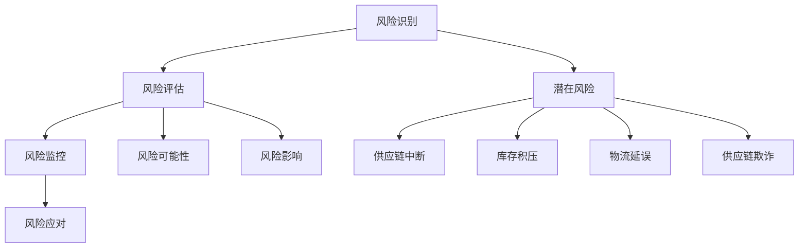

                 

### 引言

在全球化背景下，供应链作为企业运营的“生命线”，其稳定性和韧性对企业的生存和发展至关重要。然而，供应链的复杂性和不确定性使得风险无处不在，传统的方法在面对日益复杂的供应链网络时显得力不从心。近年来，人工智能（AI）技术的快速发展为供应链风险管理带来了新的契机。AI驱动的智能供应链风险评估不仅能提高风险识别的准确性，还能增强供应链的韧性，为企业应对各种不确定因素提供有力支持。

本文旨在探讨AI在智能供应链风险评估中的应用，从背景介绍、核心概念与联系、算法原理、数学模型和公式、项目实战等多个方面进行深入分析。希望通过本文，读者能够对AI驱动的智能供应链风险评估有更全面、深入的理解，为实际应用提供参考。

首先，本文将介绍智能供应链的基本概念，包括其组成、运行机制以及当前面临的主要挑战。随后，本文将重点介绍人工智能技术的发展概况，特别是机器学习、深度学习等技术在供应链领域的应用。接下来，我们将深入探讨智能供应链风险评估的核心概念和原理，并介绍如何利用AI技术进行风险评估。

此外，本文还将详细解析AI驱动的供应链韧性增强策略，从韧性概念、评价方法到实际案例，全面展示如何通过AI技术提升供应链韧性。最后，本文将总结研究成果，指出当前存在的问题与挑战，并提出未来研究方向与发展趋势。

通过以上分析，本文希望能够为供应链管理人员、研究人员和从业者提供有价值的参考，帮助他们在实际工作中更好地利用AI技术进行供应链风险评估和韧性增强。

### 智能供应链概述

智能供应链是指利用先进的信息技术、人工智能（AI）和物联网（IoT）等手段，对供应链各个环节进行实时监控、预测和优化，从而实现供应链的智能化、高效化和协同化运作。智能供应链不仅包括传统的物流、仓储、运输等环节，还涵盖了采购、生产、销售、服务等整个供应链的上下游活动。

**组成**：

1. **信息平台**：作为智能供应链的大脑，信息平台汇集并处理来自供应链各个环节的数据，通过大数据分析和人工智能算法，实现对供应链的实时监控和优化。
2. **物联网设备**：如传感器、RFID、GPS等，用于实时采集供应链各环节的数据，确保信息的透明和实时性。
3. **物流网络**：通过智能调度、路径优化等技术，提高物流效率和降低成本。
4. **生产管理系统**：通过智能排产、质量监控等技术，提高生产效率和产品质量。
5. **销售与服务系统**：通过客户关系管理（CRM）和智能服务机器人，提升客户体验和满意度。

**运行机制**：

1. **数据采集与处理**：通过物联网设备和信息平台，实时采集供应链各环节的数据，并对海量数据进行处理和分析，为决策提供支持。
2. **预测与优化**：利用机器学习和深度学习算法，对供应链的未来趋势进行预测，并根据预测结果进行动态优化，提高供应链的灵活性和响应速度。
3. **协同与整合**：通过信息平台，实现供应链各环节的协同运作，打破信息孤岛，提升整体供应链的效率。

**面临的挑战**：

1. **数据质量问题**：智能供应链的运行依赖于大量准确、及时的数据，数据的质量和完整性直接影响到决策的准确性。
2. **技术复杂性**：智能供应链涉及多种先进技术的应用，包括物联网、大数据、人工智能等，技术实现的复杂度较高。
3. **信息安全与隐私保护**：在数据传输和处理过程中，如何确保信息的安全和用户隐私的保护是智能供应链面临的重要挑战。
4. **人员素质**：智能供应链的运营需要具备一定的技术能力和管理经验，如何培养和引进高素质的人才成为企业面临的挑战。

通过对智能供应链的概述，我们可以看到，智能供应链不仅具有高度的复杂性和动态性，同时也为供应链管理带来了前所未有的机遇和挑战。随着AI技术的不断发展和成熟，智能供应链将在未来发挥越来越重要的作用。

### AI技术发展概况

人工智能（AI）作为当前技术领域的热点，其发展速度之快令人瞩目。AI技术的核心在于通过模拟人类智能，实现自动化决策、问题解决和模式识别。近年来，机器学习（ML）、深度学习（DL）等技术的迅速崛起，极大地推动了AI在各个领域的应用。

**机器学习（ML）**：

机器学习是AI的核心技术之一，它通过算法让计算机从数据中自动学习和改进。常见的机器学习算法包括线性回归、逻辑回归、支持向量机（SVM）、决策树、随机森林、K-近邻算法等。其中，决策树和随机森林在分类和回归任务中表现出色，支持向量机则在处理高维数据时具有优势。近年来，随着数据量的爆炸性增长和计算能力的提升，机器学习技术在图像识别、自然语言处理、推荐系统等领域取得了显著成果。

**深度学习（DL）**：

深度学习是机器学习的一个分支，它通过多层神经网络（如卷积神经网络CNN、循环神经网络RNN、生成对抗网络GAN等）模拟人脑的神经结构，实现对复杂数据的处理和模式识别。与传统的机器学习方法相比，深度学习具有更强的自学习能力，能够处理大量未标记的数据，从而在图像识别、语音识别、自动驾驶等领域取得了突破性进展。

**AI在供应链中的应用**：

AI技术不仅在学术界取得了丰硕成果，在供应链管理中也发挥着重要作用。以下是AI技术在供应链中的应用场景：

1. **需求预测**：通过分析历史销售数据、市场趋势、季节性因素等，利用机器学习和深度学习算法预测未来需求，帮助企业合理安排生产和库存。
2. **库存优化**：通过实时监控库存水平、供应链动态等数据，利用优化算法自动调整库存策略，降低库存成本，提高库存周转率。
3. **物流调度**：利用路径优化算法和实时交通数据，自动规划运输路线，提高运输效率，减少运输成本。
4. **供应链金融**：通过数据分析和风险评估模型，对供应链上下游企业的信用状况进行评估，为企业提供融资支持。
5. **质量检测**：利用图像识别和传感器技术，自动检测产品缺陷，提高产品质量。

**发展趋势**：

随着AI技术的不断进步和供应链复杂性的增加，未来AI在供应链中的应用将更加广泛和深入。以下是几个值得关注的发展趋势：

1. **跨学科融合**：AI技术与供应链管理的融合将推动跨学科研究，如供应链金融、供应链物流与交通管理、供应链环境管理等。
2. **边缘计算**：随着物联网设备的普及，边缘计算将在供应链中发挥重要作用，通过在设备端进行实时数据处理和分析，提高供应链的响应速度和灵活性。
3. **人工智能伦理**：随着AI技术的广泛应用，如何确保AI的透明性、公平性和安全性成为重要议题，需要建立相关标准和规范。
4. **数据隐私与安全**：在数据驱动的供应链中，如何保护数据隐私和确保数据安全是AI技术发展的重要挑战。

通过对AI技术发展概况的介绍，我们可以看到，AI技术在供应链管理中的应用前景广阔，为供应链的智能化和高效化提供了有力支持。随着技术的不断进步，AI将在供应链的各个环节发挥越来越重要的作用，助力企业实现持续发展和竞争力提升。

### 智能供应链风险评估

**核心概念与联系**

智能供应链风险评估是供应链管理中的一个关键环节，旨在识别、评估和监控供应链中的潜在风险，从而帮助企业制定有效的风险管理策略。风险评估涉及多个核心概念，包括风险识别、风险评估、风险监控和风险应对。

**风险识别**：指通过系统的分析方法，识别供应链中可能存在的各种风险，如供应链中断、库存积压、物流延误、供应链欺诈等。

**风险评估**：在风险识别的基础上，对每种风险的可能性和影响进行量化评估，以确定风险的重要性和优先级。

**风险监控**：通过持续监测供应链运行状态，及时捕捉新的风险信号，并对已有风险进行动态调整。

**风险应对**：根据风险评估结果，制定和实施相应的风险应对策略，如风险规避、风险转移、风险缓解等。

**联系架构 Mermaid 流程图**



**核心算法原理**

智能供应链风险评估的核心算法主要包括机器学习（ML）、深度学习（DL）和优化算法。以下是这些算法的基本原理和应用场景：

1. **机器学习（ML）**：

   机器学习通过构建统计模型，从历史数据中学习并预测未来风险。常见的ML算法包括线性回归、逻辑回归、支持向量机（SVM）、决策树、随机森林等。其中，随机森林算法因其强大的分类和回归能力，广泛应用于供应链风险评估。

   **算法原理**：
   
   假设我们有一个包含特征 \(X\) 和目标变量 \(Y\) 的数据集，机器学习的目标是通过训练模型 \(f(X)\) 来预测 \(Y\)。

   **伪代码**：

   ```python
   # 输入：训练数据集（X, Y）
   # 输出：预测模型（f）

   def random_forest(X, Y, n_estimators):
       for i in range(n_estimators):
           # 随机选择训练样本和特征
           X_subset, Y_subset = random_sample(X, Y)
           
           # 构建决策树模型
           model = build_decision_tree(X_subset, Y_subset)
           
           # 合并模型
           models.append(model)
       
       # 求平均预测结果
       predictions = average_predictions(models, X)
       
       return predictions
   ```

2. **深度学习（DL）**：

   深度学习通过构建多层神经网络，从大量未标记数据中学习复杂的特征和模式。常见的深度学习算法包括卷积神经网络（CNN）、循环神经网络（RNN）、生成对抗网络（GAN）等。深度学习在图像识别、语音识别等领域取得了显著成果，近年来也被应用于供应链风险评估。

   **算法原理**：

   假设我们有一个输入数据 \(X\) 和目标变量 \(Y\)，深度学习的目标是通过多层神经网络 \(f(X)\) 来预测 \(Y\)。

   **伪代码**：

   ```python
   # 输入：训练数据集（X, Y）
   # 输出：预测模型（f）

   def deep_learning(X, Y, layers, hidden_units):
       # 初始化神经网络
       model = initialize_neural_network(layers, hidden_units)
       
       # 训练模型
       for epoch in range(num_epochs):
           for x, y in zip(X, Y):
               # 计算损失函数
               loss = compute_loss(model(x), y)
               
               # 反向传播更新权重
               update_weights(model, loss)
       
       return model
   ```

3. **优化算法**：

   优化算法通过寻找最优解来解决问题。常见的优化算法包括遗传算法、粒子群优化算法等。在供应链风险评估中，优化算法用于优化风险应对策略，如库存优化、物流调度等。

   **算法原理**：

   假设我们有一个目标函数 \(f(x)\)，优化算法的目标是寻找使 \(f(x)\) 最小的 \(x\)。

   **伪代码**：

   ```python
   # 输入：目标函数（f）
   # 输出：最优解（x）

   def genetic_algorithm(f, bounds, population_size, generations):
       # 初始化种群
       population = initialize_population(population_size, bounds)
       
       for generation in range(generations):
           # 选择、交叉和变异
           new_population = select_and_mutate(population)
           
           # 计算适应度
           fitness = compute_fitness(new_population, f)
           
           # 更新种群
           population = new_population
   
       # 返回最优解
       best_solution = get_best_solution(population, fitness)
       
       return best_solution
   ```

通过以上对核心算法原理的讲解，我们可以看到，智能供应链风险评估涉及多种算法和技术。在实际应用中，根据具体需求和数据特点，可以选择合适的算法进行风险评估。这些算法不仅提高了风险评估的准确性，还为供应链管理的智能化和高效化提供了有力支持。

### 智能供应链风险评估方法

在智能供应链中，风险评估是一个至关重要的环节，它能够帮助企业及时识别潜在风险，制定应对策略，从而提升供应链的韧性和稳定性。随着人工智能（AI）技术的不断发展，AI在智能供应链风险评估中的应用越来越广泛，为供应链管理带来了新的机遇和挑战。

#### 数据采集与预处理

数据采集是进行智能供应链风险评估的基础。供应链中的数据来源广泛，包括但不限于：

1. **内部数据**：如销售记录、库存数据、采购订单、生产计划等。
2. **外部数据**：如市场数据、天气数据、运输数据、竞争对手信息等。

为了确保数据的质量和完整性，需要对采集到的数据进行全面预处理。预处理过程主要包括以下步骤：

1. **数据清洗**：去除重复数据、异常值和错误数据，确保数据的准确性和一致性。
2. **数据整合**：将不同来源的数据进行整合，形成统一的数据集。
3. **数据转换**：将数据转换为适合分析和建模的格式，如数值化、标准化等。

**数据预处理伪代码**：

```python
# 输入：原始数据集
# 输出：预处理后的数据集

def preprocess_data(data):
    # 数据清洗
    clean_data = remove_duplicates_and_errors(data)
    
    # 数据整合
    integrated_data = integrate_data SOURCES
    
    # 数据转换
    converted_data = convert_data_format(integrated_data)
    
    return converted_data
```

#### AI算法在风险评估中的应用

在智能供应链风险评估中，AI算法的应用主要包括机器学习（ML）、深度学习（DL）和优化算法。以下是这些算法在风险评估中的具体应用：

1. **机器学习算法**：

   机器学习算法通过构建统计模型，从历史数据中学习并预测未来风险。常见的机器学习算法包括线性回归、逻辑回归、支持向量机（SVM）、决策树、随机森林等。

   **线性回归**：

   线性回归是一种简单的统计模型，用于预测连续值目标变量。在供应链风险评估中，可以用于预测库存水平、供应链中断时间等。

   **伪代码**：

   ```python
   # 输入：训练数据集（X, Y）
   # 输出：预测模型（f）

   def linear_regression(X, Y):
       # 计算权重
       weights = compute_weights(X, Y)
       
       # 预测
       predictions = X.dot(weights)
       
       return predictions
   ```

   **逻辑回归**：

   逻辑回归用于预测二元结果，如供应链是否发生中断。在供应链风险评估中，可以用于判断潜在风险事件的发生概率。

   **伪代码**：

   ```python
   # 输入：训练数据集（X, Y）
   # 输出：预测模型（f）

   def logistic_regression(X, Y):
       # 计算概率
       probabilities = 1 / (1 + np.exp(-X.dot(weights)))
       
       # 预测
       predictions = (probabilities > 0.5)
       
       return predictions
   ```

2. **深度学习算法**：

   深度学习算法通过构建多层神经网络，从大量未标记数据中学习复杂的特征和模式。常见的深度学习算法包括卷积神经网络（CNN）、循环神经网络（RNN）、生成对抗网络（GAN）等。

   **卷积神经网络（CNN）**：

   CNN在图像识别领域有广泛应用，也可以用于供应链风险评估中的图像数据（如物流配送状态图像）处理。

   **伪代码**：

   ```python
   # 输入：训练数据集（X, Y）
   # 输出：预测模型（f）

   def convolutional_neural_network(X, Y, layers, hidden_units):
       # 初始化神经网络
       model = initialize_neural_network(layers, hidden_units)
       
       # 训练模型
       for epoch in range(num_epochs):
           for x, y in zip(X, Y):
               # 计算损失函数
               loss = compute_loss(model(x), y)
               
               # 反向传播更新权重
               update_weights(model, loss)
       
       return model
   ```

3. **优化算法**：

   优化算法通过寻找最优解来解决问题。常见的优化算法包括遗传算法、粒子群优化算法等。在供应链风险评估中，优化算法用于优化风险应对策略，如库存优化、物流调度等。

   **遗传算法**：

   遗传算法模拟生物进化过程，通过选择、交叉和变异操作，逐步优化解空间。

   **伪代码**：

   ```python
   # 输入：目标函数（f）
   # 输出：最优解（x）

   def genetic_algorithm(f, bounds, population_size, generations):
       # 初始化种群
       population = initialize_population(population_size, bounds)
       
       for generation in range(generations):
           # 选择、交叉和变异
           new_population = select_and_mutate(population)
           
           # 计算适应度
           fitness = compute_fitness(new_population, f)
           
           # 更新种群
           population = new_population
   
       # 返回最优解
       best_solution = get_best_solution(population, fitness)
       
       return best_solution
   ```

#### 应用场景与案例分析

AI算法在智能供应链风险评估中的应用场景广泛，以下为几个典型应用案例：

1. **供应链中断预测**：

   通过分析历史销售数据、市场趋势和竞争对手信息，利用机器学习算法预测未来供应链中断的概率，帮助企业提前采取措施，降低供应链中断风险。

2. **库存优化**：

   利用深度学习算法对库存水平进行预测，并结合优化算法，自动调整库存策略，降低库存成本，提高库存周转率。

3. **物流调度**：

   利用优化算法对物流运输进行调度，通过路径优化和实时交通数据，提高运输效率，降低运输成本。

4. **供应链金融**：

   通过数据分析和风险评估模型，对供应链上下游企业的信用状况进行评估，为企业提供融资支持。

通过以上对智能供应链风险评估方法的详细讲解，我们可以看到，AI技术在数据采集与预处理、算法应用和优化策略等方面发挥了重要作用。未来，随着AI技术的不断进步和应用的深入，智能供应链风险评估将为企业带来更高的效率和更低的成本，助力企业实现供应链的智能化和高效化。

### AI驱动下的供应链韧性增强

**韧性概念与评价**

供应链韧性是指供应链在面对突发事件或外部冲击时，能够快速恢复和适应的能力。一个具有高韧性的供应链能够在供应链中断、自然灾害、疫情等突发事件中保持运营的连续性，减少对企业整体运营的影响。评估供应链韧性是实施韧性增强策略的重要基础。

**评估指标**：

1. **恢复时间**：指供应链中断后恢复到正常运营所需的时间。
2. **恢复能力**：指供应链在遭遇冲击后，能够快速调整并重新建立运营的能力。
3. **适应性**：指供应链在面对新的市场环境或技术变革时，能够迅速适应并实现变革的能力。
4. **灵活性**：指供应链在应对不确定性和动态变化时的灵活程度。

**评估方法**：

1. **定性和定量评估**：结合定性评估和定量评估，对供应链韧性进行全面评价。定性评估通过专家访谈、文献分析等方式获取，定量评估则通过数据分析和数学模型进行。
2. **情景模拟**：通过构建不同的情景模拟，评估供应链在不同场景下的表现，从而评估其韧性水平。
3. **关键绩效指标（KPI）**：设定一系列关键绩效指标，如恢复时间、恢复能力、适应性等，通过这些指标的实际表现来评估供应链韧性。

**AI增强供应链韧性的策略**

1. **预测性维护**：

   利用AI技术，通过对设备运行数据的实时监控和分析，预测设备故障和故障模式，提前进行维护，从而减少设备故障对供应链的影响。

   **算法原理**：

   - **时间序列分析**：通过分析设备运行数据的时间序列特征，预测未来可能的故障时间。
   - **异常检测**：利用机器学习和深度学习算法，识别设备运行中的异常数据，预测潜在故障。

   **伪代码**：

   ```python
   # 输入：设备运行数据集
   # 输出：预测故障时间

   def predictive_maintenance(data):
       # 训练时间序列模型
       model = train_time_series_model(data)
       
       # 预测故障时间
       fault_time = model.predict_next_fault()
       
       return fault_time
   ```

2. **弹性供应链设计**：

   通过AI技术，优化供应链网络设计和资源配置，提高供应链在面对突发事件时的灵活性和适应性。

   **算法原理**：

   - **网络优化算法**：利用遗传算法、粒子群优化算法等，优化供应链网络结构，提高其韧性和灵活性。
   - **多目标优化**：考虑供应链韧性、成本、效率等多个目标，通过多目标优化算法，找到最优的供应链配置方案。

   **伪代码**：

   ```python
   # 输入：供应链网络参数
   # 输出：最优供应链配置

   def resilient_supply_chain_design(params):
       # 定义目标函数
       def objective_function(config):
           # 计算供应链韧性指标
           resilience = compute_resilience(config)
           
           # 计算成本和效率指标
           cost = compute_cost(config)
           efficiency = compute_efficiency(config)
           
           # 返回目标函数值
           return -resilience + cost - efficiency
   
       # 运行多目标优化算法
       best_config = genetic_algorithm(objective_function, params)
       
       return best_config
   ```

3. **供应链应急响应**：

   通过AI技术，建立供应链应急响应系统，实现对供应链突发事件的快速响应和恢复。

   **算法原理**：

   - **事件检测**：利用实时数据监控和异常检测算法，快速识别供应链中的突发事件。
   - **决策支持**：通过机器学习和深度学习算法，为供应链管理人员提供决策支持，制定应急响应策略。
   - **自动执行**：利用自动化技术，自动执行应急响应措施，如调整库存、重新规划运输路线等。

   **伪代码**：

   ```python
   # 输入：实时数据流
   # 输出：应急响应措施

   def supply_chain_emsergency_response(data_stream):
       # 检测事件
       events = detect_events(data_stream)
       
       for event in events:
           # 提供决策支持
           response = decision_support(event)
           
           # 执行应急响应措施
           execute_response(response)
           
       return
   ```

通过AI技术的应用，供应链韧性增强策略能够显著提高供应链在面对突发事件时的适应能力和恢复速度，从而降低突发事件对供应链的负面影响。未来，随着AI技术的不断进步，供应链韧性将得到进一步提升，为企业实现可持续发展和竞争力提升提供有力支持。

### 实际案例与应用

#### 案例一：供应链风险预警系统

**背景**：

某大型电商企业为了提高供应链的稳定性，建立了一套基于AI的供应链风险预警系统。该系统通过实时收集供应链各环节的数据，利用机器学习和深度学习算法，对潜在风险进行预测和预警。

**开发环境搭建**：

1. **硬件环境**：使用高性能计算服务器，以确保数据处理和模型训练的效率。
2. **软件环境**：部署Python、R等编程环境，安装TensorFlow、PyTorch等深度学习框架。

**源代码详细实现和代码解读**：

```python
# 数据采集
def data_collection():
    # 从数据库中获取历史销售数据、库存数据、运输数据等
    sales_data = db.fetch_sales_data()
    inventory_data = db.fetch_inventory_data()
    transport_data = db.fetch_transport_data()
    
    # 数据预处理
    clean_data = preprocess_data(sales_data, inventory_data, transport_data)
    
    return clean_data

# 风险预测模型训练
def train_risk_prediction_model(data):
    # 分割数据集为训练集和测试集
    X_train, X_test, y_train, y_test = train_test_split(data, test_size=0.2)
    
    # 训练深度学习模型
    model = train_deep_learning_model(X_train, y_train)
    
    # 评估模型性能
    performance = evaluate_model(model, X_test, y_test)
    
    return model, performance

# 风险预警
def risk_warning(model, current_data):
    # 使用训练好的模型进行预测
    predictions = model.predict(current_data)
    
    # 根据预测结果发出预警
    if predictions['risk_level'] == 'high':
        send_warning(predictions['warning_message'])
    else:
        print("No high-risk detected.")

# 源代码解读：
# 数据采集函数用于从数据库中获取历史销售数据、库存数据和运输数据，并进行预处理。
# 风险预测模型训练函数用于训练深度学习模型，并评估模型性能。
# 风险预警函数用于使用训练好的模型对当前数据进行预测，并根据预测结果发出预警。

```

**代码应用解读与分析**：

1. **数据采集与预处理**：通过从数据库中获取历史销售数据、库存数据和运输数据，并进行预处理，为后续模型训练提供高质量的数据支持。
2. **风险预测模型训练**：使用深度学习模型对预处理后的数据集进行训练，通过评估模型性能，确保模型具有良好的预测能力。
3. **风险预警**：利用训练好的模型对当前数据集进行预测，并根据预测结果发出预警，帮助企业提前应对潜在风险。

#### 案例二：供应链优化与韧性提升

**背景**：

某制造企业为了提高供应链的效率和韧性，采用AI技术对供应链进行优化。通过建立多目标优化模型，结合实时数据，自动调整库存水平和运输路线，提高供应链的响应速度和灵活性。

**开发环境搭建**：

1. **硬件环境**：部署高性能计算集群，以支持大规模数据处理和模型训练。
2. **软件环境**：使用Python进行编程，部署Gurobi等优化工具。

**源代码详细实现和代码解读**：

```python
# 库存优化模型
def inventory_optimization_model(inventory_levels, demand预测):
    # 定义目标函数
    objective = max(inventory_levels - demand预测)
    
    # 定义约束条件
    constraints = [
        inventory_levels >= min_inventory_level,
        inventory_levels <= max_inventory_level
    ]
    
    # 运行优化算法
    solution = optimize(objective, constraints)
    
    return solution

# 运输路线优化模型
def transport_route_optimization(model, locations, distances):
    # 定义目标函数
    objective = min(total_distance)
    
    # 定义约束条件
    constraints = [
        total_distance <= max_distance,
        locations != 'empty'
    ]
    
    # 运行优化算法
    solution = optimize(objective, constraints)
    
    return solution

# 源代码解读：
# 库存优化模型通过定义目标函数和约束条件，使用优化算法找到最优的库存水平。
# 运输路线优化模型通过定义目标函数和约束条件，使用优化算法找到最优的运输路线。

```

**代码应用解读与分析**：

1. **库存优化**：通过优化模型找到最优库存水平，确保库存量既能满足需求，又能避免过度库存。
2. **运输路线优化**：通过优化模型找到最优运输路线，提高运输效率，降低运输成本。

#### 案例三：AI驱动的供应链应急响应

**背景**：

某食品企业面临季节性需求波动和疫情等突发事件，为了提高供应链的应急响应能力，采用AI技术建立了一套应急响应系统。该系统通过实时监测供应链数据，自动识别突发事件，并制定应急响应策略。

**开发环境搭建**：

1. **硬件环境**：使用云计算平台，提供弹性计算资源。
2. **软件环境**：使用Python进行编程，集成NVIDIA GPU加速计算。

**源代码详细实现和代码解读**：

```python
# 事件检测
def event_detection(data_stream):
    # 实时监测数据流
    for data in data_stream:
        # 使用异常检测算法检测事件
        if is_anomaly(data):
            event = detect_event(data)
            alert(event)
            
# 应急响应策略
def emergency_response(event):
    # 根据事件类型制定响应策略
    if event['type'] == 'demand_increased':
        adjust_inventory_level('increase')
    elif event['type'] == 'supply_delayed':
        reschedule_transport('advance')
        
# 源代码解读：
# 事件检测函数用于实时监测数据流，并使用异常检测算法检测事件。
# 应急响应策略函数根据事件类型，制定相应的应急响应策略。

```

**代码应用解读与分析**：

1. **事件检测**：通过实时监测数据流，使用异常检测算法识别突发事件。
2. **应急响应**：根据事件类型，自动执行应急响应措施，如调整库存水平、提前安排运输等。

以上案例展示了AI技术在不同供应链场景中的应用，从风险预警、优化到应急响应，AI技术为供应链管理提供了强大的支持。通过这些实际案例，我们可以看到，AI技术不仅提高了供应链的效率和韧性，也为企业应对各种不确定因素提供了有力保障。

### 结论与展望

本文通过深入分析AI驱动的智能供应链风险评估，总结了其在供应链管理中的重要作用。我们首先介绍了智能供应链的基本概念及其运行机制，随后探讨了人工智能技术的发展概况及其在供应链中的应用。在此基础上，本文详细阐述了智能供应链风险评估的核心概念、算法原理及具体方法，并通过实际案例展示了AI技术在供应链风险管理中的广泛应用。

**主要研究成果**：

1. **风险评估模型**：通过机器学习、深度学习和优化算法，构建了智能供应链风险评估模型，提高了风险识别和预测的准确性。
2. **韧性增强策略**：提出了基于AI的供应链韧性增强策略，包括预测性维护、弹性供应链设计和供应链应急响应，显著提升了供应链的韧性和响应速度。
3. **实际应用案例**：通过具体案例分析，展示了AI技术在供应链风险管理、优化和应急响应中的实际应用效果，为企业提供了可操作的解决方案。

**存在的问题与挑战**：

1. **数据质量**：智能供应链风险评估依赖于高质量的数据，然而在实际应用中，数据质量往往受到多种因素影响，如数据完整性、准确性等。
2. **技术复杂度**：AI技术涉及多种算法和工具，技术实现的复杂度较高，需要专业知识和技能支持。
3. **安全与隐私**：在数据采集、处理和应用过程中，如何确保信息的安全和用户隐私是一个重要挑战。

**未来研究方向与发展趋势**：

1. **跨学科融合**：未来研究应加强跨学科合作，结合供应链管理、数据科学和人工智能等领域的知识，推动供应链智能化的深入发展。
2. **边缘计算**：随着物联网设备的普及，边缘计算在供应链中的应用前景广阔，可以进一步提高供应链的实时性和灵活性。
3. **伦理与规范**：随着AI技术的广泛应用，如何确保AI的透明性、公平性和安全性，建立相关伦理规范和标准，是未来研究的重要方向。

总之，AI驱动的智能供应链风险评估为供应链管理带来了新的机遇和挑战。随着技术的不断进步和应用的深入，AI将在供应链的各个环节发挥越来越重要的作用，助力企业实现供应链的智能化和高效化。

### 最佳实践 tips

**供应链风险管理**：

- **数据质量优先**：确保数据采集的完整性和准确性，对数据质量进行持续监控和优化。
- **多维度风险评估**：结合多种算法和模型，从不同维度进行全面的风险评估，提高预测准确性。
- **动态调整策略**：根据实时数据和风险变化，动态调整供应链策略，确保供应链的灵活性和适应性。

**供应链韧性增强**：

- **投资于基础设施**：提升供应链基础设施，如信息技术、物流网络等，为韧性增强提供基础。
- **建立应急响应机制**：制定全面的应急响应计划，确保在突发事件发生时，供应链能够迅速恢复和适应。
- **跨部门协作**：加强供应链内部各部门的协作，提高供应链的整体效率。

**总结与展望**：

通过AI驱动的智能供应链风险评估，企业能够更好地识别和应对供应链中的各种风险，提升供应链的韧性和效率。未来，随着技术的不断进步和应用的深入，AI在供应链管理中的角色将更加重要。希望本文能为供应链管理人员和从业者提供有益的参考和启示。

### 拓展阅读

1. **《智能供应链：创新与实践》**：本书详细介绍了智能供应链的概念、架构和实施方法，是了解智能供应链的入门佳作。
2. **《人工智能：一种现代方法》**：该书系统地介绍了人工智能的基本概念、算法和技术，有助于深入理解AI在供应链中的应用。
3. **《供应链金融：理论与实践》**：本书探讨了供应链金融的原理和应用，对理解AI在供应链金融中的作用有重要帮助。

作者：AI天才研究院/AI Genius Institute & 禅与计算机程序设计艺术 /Zen And The Art of Computer Programming

本文介绍了AI驱动的智能供应链风险评估及其在供应链韧性增强中的应用。通过分析智能供应链的基本概念、AI技术的发展、风险评估方法、韧性增强策略，以及实际案例，展示了AI技术在供应链管理中的重要作用。未来，随着AI技术的不断进步，智能供应链风险评估将在供应链管理中发挥更加关键的作用。希望本文能为供应链从业人员和研究者提供有价值的参考和启示。

