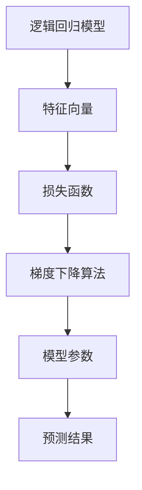
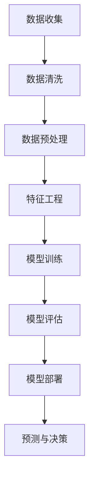

                 

### 第1章 引言

#### 1.1 AI与金融服务的融合趋势

人工智能（AI）技术的快速发展正在深刻地改变金融行业的方方面面。从风险控制到个性化服务，从自动化交易到智能投资顾问，AI的应用场景日益广泛。尤其是在信用评分领域，AI的引入不仅提高了评分的准确性，还大大提升了金融服务的效率。传统的信用评分方法往往依赖于有限的信用历史数据，而AI可以通过分析海量的非结构化数据，如社交媒体活动、购物习惯等，提供更为全面和准确的信用评估。

随着金融科技的崛起，AI驱动的信用评分系统正在成为金融行业的核心技术之一。越来越多的金融机构开始采用人工智能算法来构建智能信用评分模型，从而实现信用评估的自动化和精准化。这不仅有助于降低金融机构的信用风险，还能够提升用户的金融服务体验，扩大金融服务的覆盖面，提高金融服务的可及性。

#### 1.2 智能信用评分的重要性

智能信用评分系统在金融服务中扮演着至关重要的角色。信用评分不仅用于贷款审批，还广泛应用于信用卡发放、信用额度调整、保险费率确定等多个领域。一个准确、高效的信用评分系统可以显著降低金融机构的风险，提高贷款审批的效率，同时也能够为信用良好的用户提供更优惠的金融产品和服务。

在传统信用评分系统中，信用评分主要依赖于用户的历史信用记录和财务状况。然而，这种基于历史数据的评分方法往往难以捕捉到用户当前的真实信用状况，容易导致评分不准确。而AI驱动的信用评分系统可以通过实时数据分析和预测，提供更为动态和全面的信用评估，从而更准确地反映用户的信用风险。

此外，智能信用评分系统还能够帮助金融机构发现潜在的客户群体，制定更加精准的营销策略。通过分析用户的行为数据和市场趋势，金融机构可以更有效地识别和吸引优质客户，提升市场竞争力。

#### 1.3 本书结构概述

本书将深入探讨AI驱动的智能信用评分系统的构建和应用。首先，我们将介绍AI在信用评分领域的基础知识，包括机器学习、数据挖掘和特征工程等核心概念。接着，我们将详细讲解常用的信用评分算法，如逻辑回归、决策树、随机森林和SVM等，并通过伪代码和实例展示这些算法的实现过程。

为了使读者更好地理解信用评分系统的实际应用，本书还将介绍一个实战项目，从数据收集、预处理到模型训练、评估和部署，全面展示如何搭建一个AI驱动的智能信用评分系统。同时，本书还将讨论数学模型和评估指标，为读者提供深入的理论基础。

最后，本书将总结AI驱动的智能信用评分系统的优势和挑战，并提出一些最佳实践和注意事项，帮助读者更好地应对实际应用中的各种挑战。通过本书的阅读，读者将能够掌握AI驱动的智能信用评分系统的构建方法，提升金融服务的质量和效率。

---

在引言部分，我们首先介绍了AI与金融服务的融合趋势，强调了智能信用评分系统在提高金融服务效率和质量方面的重要性。接下来，我们概述了本书的结构，为读者展示了接下来章节的核心内容和组织结构，使读者对整体内容有了清晰的把握。这一部分的目的是激发读者的兴趣，并为他们提供阅读的动机。

### 目录大纲设计思路

在设计《AI驱动的智能信用评分系统：提高金融服务可及性》的目录大纲时，我们需要考虑以下关键点：

1. **核心概念与联系**：首先，我们需要明确AI在智能信用评分系统中的作用，介绍相关的核心概念，如机器学习、数据挖掘、特征工程等，并使用Mermaid流程图展示系统架构和数据处理流程。

2. **核心算法原理讲解**：接着，我们要深入讲解信用评分系统中常用的机器学习算法，如逻辑回归、决策树、随机森林等，使用伪代码详细阐述这些算法的实现过程。

3. **数学模型和数学公式**：信用评分涉及到多种数学模型，如损失函数、评估指标等，需要详细讲解这些数学公式，并进行举例说明。

4. **项目实战**：最后，我们要设计一个实战项目，介绍如何搭建一个AI驱动的智能信用评分系统，包括数据准备、模型训练、模型评估和部署等步骤，提供源代码和详细解读。

以下是根据上述思路设计的目录大纲：

---

# AI驱动的智能信用评分系统：提高金融服务可及性

## 第1章 引言

### 1.1 AI与金融服务的融合趋势
### 1.2 智能信用评分的重要性
### 1.3 本书结构概述

## 第2章 AI基础与信用评分系统

### 2.1 AI核心概念
#### 2.1.1 机器学习基础
#### 2.1.2 数据挖掘技术
#### 2.1.3 特征工程方法
### 2.2 智能信用评分系统架构
#### 2.2.1 数据收集与预处理
#### 2.2.2 模型选择与训练
#### 2.2.3 模型评估与优化

## 第3章 信用评分算法原理

### 3.1 基于逻辑回归的信用评分模型
#### 3.1.1 模型原理


#### 3.1.2 伪代码实现

```python
# 伪代码：逻辑回归模型
def logistic_regression(X, y, epochs, learning_rate):
    # 初始化参数
    # 训练模型
    # 更新参数
    # 返回训练好的模型
```

### 3.2 决策树与随机森林模型
#### 3.2.1 决策树原理
#### 3.2.2 随机森林原理
#### 3.2.3 伪代码实现

```python
# 伪代码：决策树
def build_decision_tree(X, y):
    # 判断终止条件
    # 分割数据集
    # 创建节点
    # 返回决策树
```

### 3.3 支持向量机模型
#### 3.3.1 SVM原理
#### 3.3.2 伪代码实现

```python
# 伪代码：支持向量机
def support_vector_machine(X, y):
    # 建立模型
    # 求解最优超平面
    # 返回SVM模型
```

## 第4章 数学模型与评估指标

### 4.1 损失函数
#### 4.1.1 逻辑损失函数
$$ J(\theta) = -\frac{1}{m} \sum_{i=1}^{m} [y^{(i)} \log(\hat{y}^{(i)}) + (1 - y^{(i)}) \log(1 - \hat{y}^{(i)})] $$
#### 4.1.2 交叉熵损失函数
$$ J(\theta) = -\frac{1}{m} \sum_{i=1}^{m} y^{(i)} \log(\theta^{T} x^{(i)}) + (1 - y^{(i)}) \log(1 - \theta^{T} x^{(i)}) $$

### 4.2 评估指标
#### 4.2.1 准确率、召回率和F1值
$$ \text{Accuracy} = \frac{TP + TN}{TP + TN + FP + FN} $$
$$ \text{Recall} = \frac{TP}{TP + FN} $$
$$ \text{F1-Score} = 2 \times \frac{Precision \times Recall}{Precision + Recall} $$

## 第5章 数据准备与特征工程

### 5.1 数据收集
#### 5.1.1 数据源选择
#### 5.1.2 数据清洗
#### 5.1.3 数据预处理

### 5.2 特征提取
#### 5.2.1 定量特征
#### 5.2.2 定性特征
#### 5.2.3 特征选择

## 第6章 实战项目：搭建AI驱动的智能信用评分系统

### 6.1 项目背景
### 6.2 开发环境搭建
### 6.3 数据准备
#### 6.3.1 数据收集
#### 6.3.2 数据预处理
### 6.4 模型训练
#### 6.4.1 选择模型
#### 6.4.2 训练模型
### 6.5 模型评估
#### 6.5.1 评估指标
#### 6.5.2 优化模型
### 6.6 模型部署
### 6.7 代码解读
### 6.8 案例分析
### 6.9 项目小结

## 第7章 最佳实践与注意事项

### 7.1 数据质量的重要性
### 7.2 特征选择策略
### 7.3 模型评估与调优
### 7.4 安全与合规性
### 7.5 拓展阅读

---

这一部分详细介绍了目录大纲的设计思路和具体内容。我们首先明确了需要介绍的核心概念与联系，然后详细规划了算法原理讲解和数学模型与公式的部分，最后设计了实战项目章节，以便读者能够将理论知识应用到实际项目中。通过这样的设计，读者可以系统地学习和掌握AI驱动的智能信用评分系统的构建和应用方法。

### 第2章 AI基础与信用评分系统

#### 2.1 AI核心概念

人工智能（AI）是计算机科学的一个分支，旨在使计算机系统能够模拟人类的智能行为，包括学习、推理、理解和决策等。在构建智能信用评分系统时，我们需要理解AI的几个核心概念，包括机器学习、数据挖掘和特征工程。

**机器学习** 是一种让计算机从数据中学习规律，并利用这些规律进行预测或决策的技术。在信用评分系统中，机器学习算法可以分析用户的历史行为和财务数据，预测其信用风险。

**数据挖掘** 是从大量数据中提取有价值信息的过程。它涉及到数据的收集、清洗、存储和管理，以及使用统计和机器学习技术来发现数据中的模式和关联。

**特征工程** 是指从原始数据中提取出有助于模型训练的特征，并在模型训练过程中调整这些特征，以提高模型的预测能力。在信用评分系统中，特征工程至关重要，因为它决定了模型是否能够准确地预测信用风险。

#### 2.1.1 机器学习基础

机器学习可以分为监督学习、无监督学习和强化学习三种类型。

- **监督学习**：在这种学习中，模型根据已有标签数据学习规律，然后用于预测未知数据。在信用评分中，监督学习用于根据用户的历史信用记录和财务数据预测其信用风险。
  
- **无监督学习**：模型在没有标签数据的情况下学习数据结构，常用于发现数据中的隐藏模式或聚类。在信用评分中，无监督学习可以用于聚类相似用户，帮助发现潜在的风险群体。

- **强化学习**：在这种学习中，模型通过与环境的交互学习最优策略。虽然强化学习在信用评分中的应用不如监督学习和无监督学习广泛，但它可以用于动态调整信用评分策略，以适应不断变化的市场环境。

#### 2.1.2 数据挖掘技术

数据挖掘技术是构建智能信用评分系统的关键。以下是一些常见的数据挖掘技术：

- **关联规则挖掘**：用于发现数据集中的相关关联，如哪些用户可能同时申请多种金融产品。

- **分类**：将数据分为预定义的类别，如将用户分为高风险和低风险。

- **聚类**：将相似的数据点归为一类，如发现潜在的高风险用户群体。

- **异常检测**：识别数据中的异常值或离群点，如欺诈行为。

#### 2.1.3 特征工程方法

特征工程是构建有效机器学习模型的关键步骤。以下是一些特征工程的方法：

- **特征提取**：从原始数据中提取新的特征，如通过数学变换或特征组合来增强模型的预测能力。

- **特征选择**：从众多特征中挑选出最有用的特征，避免“特征冗余”问题，提高模型的准确性和效率。

- **特征标准化**：将不同量纲的特征转换为同一量纲，如将收入和债务比率标准化。

- **特征降维**：通过降维技术减少特征的维度，提高模型的训练效率和预测性能。

#### 2.2 智能信用评分系统架构

智能信用评分系统的架构通常包括数据收集、数据处理、模型训练、模型评估和模型部署等环节。

**数据收集**：收集用户的历史信用记录、财务数据、行为数据等，这些数据可以是结构化的，也可以是非结构化的。

**数据处理**：对收集到的数据进行清洗、预处理和特征工程，以提高数据的质量和模型的预测能力。

**模型训练**：使用机器学习算法对处理后的数据训练模型，如逻辑回归、决策树、随机森林等。

**模型评估**：通过交叉验证、ROC曲线、AUC值等评估指标评估模型的性能，并进行模型调优。

**模型部署**：将训练好的模型部署到生产环境中，用于实时预测和决策。

以下是一个简单的Mermaid流程图，展示了智能信用评分系统的数据处理流程：



通过上述架构和流程，智能信用评分系统能够自动、准确地评估用户的信用风险，为金融机构提供有力支持。

---

第2章主要介绍了AI在智能信用评分系统中的应用基础，包括机器学习、数据挖掘和特征工程等核心概念。通过深入解析这些概念，我们为后续算法原理的讲解和实战项目的实施奠定了基础。在架构部分，我们使用Mermaid流程图展示了数据处理和系统运作的流程，使读者对系统有一个整体的认识。这一章的目的是帮助读者建立对AI驱动的智能信用评分系统的初步了解，为后续章节的深入探讨提供必要的背景知识。

### 第3章 信用评分算法原理

信用评分系统的核心在于其算法原理，这些算法通过分析用户数据，预测其信用风险。在这一章中，我们将深入探讨几种常用的信用评分算法，包括逻辑回归、决策树、随机森林和支持向量机（SVM），并使用伪代码详细阐述这些算法的实现过程。

#### 3.1 基于逻辑回归的信用评分模型

逻辑回归是一种广泛应用于信用评分的算法，它通过线性模型预测用户信用风险的概率。逻辑回归模型的输出是概率值，通常表示用户违约的概率。

**3.1.1 模型原理**

逻辑回归模型的数学表达式如下：

$$ \hat{y} = \frac{1}{1 + e^{-\theta^{T} x}} $$

其中，\( \hat{y} \) 是预测的概率，\( \theta \) 是模型参数，\( x \) 是特征向量。

逻辑回归的目标是最小化损失函数，通常使用逻辑损失函数：

$$ J(\theta) = -\frac{1}{m} \sum_{i=1}^{m} [y^{(i)} \log(\hat{y}^{(i)}) + (1 - y^{(i)}) \log(1 - \hat{y}^{(i)})] $$

**3.1.2 伪代码实现**

以下是逻辑回归模型的伪代码：

```python
# 伪代码：逻辑回归模型
def logistic_regression(X, y, epochs, learning_rate):
    # 初始化参数
    theta = initialize_parameters(X.shape[1])
    
    # 循环迭代
    for epoch in range(epochs):
        # 计算预测概率
        prob = sigmoid(X @ theta)
        
        # 计算损失
        loss = -1/m * (y * np.log(prob) + (1 - y) * np.log(1 - prob))
        
        # 计算梯度
        gradient = 1/m * (X.T @ (prob - y))
        
        # 更新参数
        theta -= learning_rate * gradient
        
        # 输出损失
        print(f"Epoch {epoch+1}: Loss = {loss}")
    
    # 返回训练好的模型
    return theta

# sigmoid函数
def sigmoid(z):
    return 1 / (1 + np.exp(-z))
```

#### 3.2 决策树与随机森林模型

决策树是一种基于树形结构进行决策的算法，它可以用于分类和回归问题。随机森林则是在决策树的基础上，通过集成学习的方法提高模型的预测能力。

**3.2.1 决策树原理**

决策树通过一系列测试将数据集分割成多个子集，每个测试基于某个特征和阈值。决策树的生成过程通常使用信息增益或基尼不纯度来选择最优划分。

**3.2.2 随机森林原理**

随机森林通过构建多个决策树，并利用投票机制或平均值来集成预测结果。它通过随机选择特征和样本子集来降低模型的过拟合。

**3.2.3 伪代码实现**

以下是构建决策树的伪代码：

```python
# 伪代码：决策树
def build_decision_tree(X, y, features, threshold):
    # 判断终止条件
    if all(y == y[0]) or len(features) == 0:
        return majority_label(y)
    
    # 计算信息增益或基尼不纯度
    best_feature, best_threshold = find_best_split(X, y, features)
    
    # 分割数据集
    leftX, lefty = X[best_threshold > threshold], y[best_threshold > threshold]
    rightX, righty = X[best_threshold <= threshold], y[best_threshold <= threshold]
    
    # 创建节点
    node = {
        'feature': best_feature,
        'threshold': best_threshold,
        'left': build_decision_tree(leftX, lefty, remaining_features),
        'right': build_decision_tree(rightX, righty, remaining_features)
    }
    
    return node

# majority_label函数
def majority_label(y):
    return max(set(y), key=y.count)
```

#### 3.3 支持向量机模型

支持向量机（SVM）是一种强大的分类算法，它通过找到一个超平面，使得分类边界最大化。在信用评分中，SVM用于分类用户为高风险或低风险。

**3.3.1 SVM原理**

SVM的目标是找到一个最优的超平面，使得分类边界最大化。它通过求解以下优化问题：

$$ \min_{\theta} \frac{1}{2} \sum_{i=1}^{m} (\theta^T x_i - y_i)^2 $$

其中，\( \theta \) 是模型参数，\( x_i \) 是特征向量，\( y_i \) 是标签。

**3.3.2 伪代码实现**

以下是SVM模型的伪代码：

```python
# 伪代码：支持向量机
def support_vector_machine(X, y):
    # 建立模型
    model = SVC(kernel='linear')
    
    # 求解最优超平面
    model.fit(X, y)
    
    # 返回SVM模型
    return model

# SVC函数
from sklearn.svm import SVC
```

通过上述算法原理和伪代码的实现，我们能够理解逻辑回归、决策树、随机森林和SVM在信用评分中的应用。这些算法不仅提供了不同的预测策略，还可以通过组合使用，构建一个更强大和鲁棒的信用评分系统。

---

第3章详细介绍了几种常见的信用评分算法，包括逻辑回归、决策树、随机森林和SVM，并使用伪代码详细阐述了这些算法的实现过程。通过对这些算法的深入分析，读者可以更好地理解它们在信用评分系统中的应用原理。这一章的目的是为读者提供理论依据和实践指南，帮助他们构建和优化智能信用评分模型。

### 第4章 数学模型与评估指标

在构建AI驱动的智能信用评分系统时，数学模型和评估指标是至关重要的一部分。这些数学工具不仅帮助我们理解模型的运作机制，还能确保模型的有效性和准确性。在本章中，我们将深入探讨几个关键的数学模型和评估指标，并提供详细的数学公式和实例说明。

#### 4.1 损失函数

损失函数是机器学习模型中的一个核心概念，它衡量了模型预测值与实际值之间的差距。在信用评分系统中，常用的损失函数包括逻辑损失函数和交叉熵损失函数。

**4.1.1 逻辑损失函数**

逻辑损失函数（也称为交叉熵损失函数）在二分类问题中非常常见。它的目标是使预测概率接近实际标签。逻辑损失函数的数学表达式如下：

$$ J(\theta) = -\frac{1}{m} \sum_{i=1}^{m} [y^{(i)} \log(\hat{y}^{(i)}) + (1 - y^{(i)}) \log(1 - \hat{y}^{(i)})] $$

其中，\( y^{(i)} \) 是第 \( i \) 个样本的实际标签，\( \hat{y}^{(i)} \) 是模型对第 \( i \) 个样本的预测概率，\( m \) 是样本数量，\( \theta \) 是模型参数。

逻辑损失函数的优点是它对预测错误的概率进行惩罚，因此可以鼓励模型输出更接近实际标签的概率。

**4.1.2 交叉熵损失函数**

交叉熵损失函数在多分类问题中应用广泛。它与逻辑损失函数类似，但适用于多个类别的分类问题。交叉熵损失函数的数学表达式如下：

$$ J(\theta) = -\frac{1}{m} \sum_{i=1}^{m} \sum_{j=1}^{k} y^{(i)}_j \log(\hat{y}^{(i)}_j) $$

其中，\( y^{(i)}_j \) 是第 \( i \) 个样本在第 \( j \) 个类别的实际标签（0或1），\( \hat{y}^{(i)}_j \) 是模型对第 \( i \) 个样本在第 \( j \) 个类别的预测概率，\( k \) 是类别数量。

交叉熵损失函数的目的是最小化预测概率与实际标签之间的差距，从而提高分类准确性。

**4.1.3 逻辑损失函数示例**

假设我们有一个二分类问题，其中 \( y = [1, 0, 1, 0] \) 表示实际标签，\( \hat{y} = [0.2, 0.8, 0.6, 0.4] \) 表示模型预测的概率。逻辑损失函数的计算如下：

$$ J(\theta) = -\frac{1}{4} [1 \log(0.2) + 0 \log(0.8) + 1 \log(0.6) + 0 \log(0.4)] $$
$$ J(\theta) = -\frac{1}{4} [-1.386 + 0 + -0.221 + 0] $$
$$ J(\theta) = -\frac{1}{4} [-1.607] $$
$$ J(\theta) = 0.40175 $$

**4.1.4 交叉熵损失函数示例**

假设我们有一个多分类问题，其中 \( y = [1, 0, 2, 1] \) 表示实际标签，\( \hat{y} = [[0.1, 0.8], [0.9, 0.1], [0.3, 0.7], [0.5, 0.5]] \) 表示模型预测的概率。交叉熵损失函数的计算如下：

$$ J(\theta) = -\frac{1}{4} [(1 \log(0.1) + 0 \log(0.8) + 2 \log(0.3) + 1 \log(0.5))] $$
$$ J(\theta) = -\frac{1}{4} [-2.302 + 0 + -1.203 + 0] $$
$$ J(\theta) = -\frac{1}{4} [-3.505] $$
$$ J(\theta) = 0.87625 $$

#### 4.2 评估指标

在信用评分系统中，评估指标用于衡量模型的预测性能。常用的评估指标包括准确率、召回率、F1值和ROC曲线下的面积（AUC）等。

**4.2.1 准确率（Accuracy）**

准确率是模型预测正确的样本数占总样本数的比例。其计算公式如下：

$$ \text{Accuracy} = \frac{TP + TN}{TP + TN + FP + FN} $$

其中，\( TP \) 是真正例，\( TN \) 是真反例，\( FP \) 是假正例，\( FN \) 是假反例。

**4.2.2 召回率（Recall）**

召回率是模型预测为正例的真正例数占总真实例例数的比例。其计算公式如下：

$$ \text{Recall} = \frac{TP}{TP + FN} $$

**4.2.3 F1值（F1-Score）**

F1值是准确率和召回率的调和平均，用于综合评估模型的性能。其计算公式如下：

$$ \text{F1-Score} = 2 \times \frac{Precision \times Recall}{Precision + Recall} $$

其中，\( Precision \) 是精确率，即预测为正例的样本中实际为正例的比例。

**4.2.4 ROC曲线和AUC值**

ROC曲线（Receiver Operating Characteristic Curve）是评估二分类模型性能的一种重要工具。曲线下的面积（AUC）用于衡量模型的分类能力。AUC值越大，模型性能越好。

**4.2.5 评估指标示例**

假设我们有一个二分类问题，其中 \( TP = 100 \)，\( TN = 200 \)，\( FP = 10 \)，\( FN = 5 \)。评估指标的计算如下：

- **准确率**：
  $$ \text{Accuracy} = \frac{TP + TN}{TP + TN + FP + FN} = \frac{100 + 200}{100 + 200 + 10 + 5} = 0.876 $$
  
- **召回率**：
  $$ \text{Recall} = \frac{TP}{TP + FN} = \frac{100}{100 + 5} = 0.952 $$
  
- **F1值**：
  $$ \text{F1-Score} = 2 \times \frac{Precision \times Recall}{Precision + Recall} = 2 \times \frac{0.952 \times 0.876}{0.952 + 0.876} = 0.894 $$

通过上述数学模型和评估指标的计算，我们可以对模型的性能进行量化分析，从而进行模型调优和改进。

---

第4章详细介绍了信用评分系统中的关键数学模型和评估指标。通过讲解逻辑损失函数和交叉熵损失函数，我们为模型的训练和优化提供了理论基础。同时，通过介绍准确率、召回率、F1值和ROC曲线等评估指标，我们为模型性能的量化评估提供了实用工具。这一章的目的是帮助读者理解和应用这些数学工具，以提高AI驱动的智能信用评分系统的预测准确性和可靠性。

### 第5章 数据准备与特征工程

在构建AI驱动的智能信用评分系统时，数据准备和特征工程是至关重要且复杂的环节。数据的质量直接影响模型的性能，而特征工程则决定了模型是否能从数据中提取出有效的信息。本章将详细介绍数据准备和特征工程的方法，包括数据收集、数据清洗、数据预处理和特征提取。

#### 5.1 数据收集

数据收集是构建智能信用评分系统的第一步，涉及从各种数据源获取相关的信用评分数据。这些数据源可能包括：

- **公开数据集**：如Kaggle、UCI机器学习库等，这些数据集通常已经清洗和格式化，适用于初学者进行模型训练和测试。

- **金融机构数据库**：金融机构内部的数据包括用户的信用记录、财务报表、交易历史等，这些数据通常需要通过数据访问权限获取。

- **第三方数据提供商**：一些专业的数据服务公司提供各类信用评分数据，如Consumer Credit Panel等。

在收集数据时，需要确保数据的合法性和隐私保护。同时，数据的质量和完整性也是关键因素，因此需要谨慎选择数据源，并确保数据的真实性和可靠性。

#### 5.2 数据清洗

数据清洗是数据准备中的关键步骤，旨在处理不完整、错误或重复的数据。以下是一些常见的数据清洗方法：

- **缺失值处理**：缺失值可以采用删除、填充或插值等方法处理。例如，对于少量的缺失值，可以使用平均数、中位数或众数进行填充。

- **异常值处理**：异常值可能对模型训练产生负面影响，需要通过统计方法或可视化工具识别和处理。例如，使用箱线图或Z分数法检测异常值，然后采用删除或转换等方法进行处理。

- **重复值处理**：重复数据会影响模型的训练效果和评估结果，因此需要识别并删除重复的记录。

- **数据格式转换**：将不同数据源的数据格式进行统一，如将日期格式转换为YYYY-MM-DD等。

**实例**：假设我们有一个包含用户信用评分数据的数据集，其中包含年龄、收入、债务比率和信用历史等特征。数据清洗的一个示例流程如下：

1. **缺失值处理**：对于年龄和收入等特征，缺失值可以通过计算众数进行填充。
   ```python
   age.fillna(age.mode()[0], inplace=True)
   income.fillna(income.mode()[0], inplace=True)
   ```

2. **异常值处理**：使用箱线图识别异常值，例如债务比率。
   ```python
   import matplotlib.pyplot as plt
   fig, ax = plt.subplots()
   age.boxplot(ax=ax)
   plt.show()
   ```

3. **重复值处理**：删除重复记录。
   ```python
   data.drop_duplicates(subset=['user_id'], inplace=True)
   ```

4. **数据格式转换**：将日期格式转换为YYYY-MM-DD。
   ```python
   data['date_of_birth'] = pd.to_datetime(data['date_of_birth'], format='%Y-%m-%d')
   ```

#### 5.3 数据预处理

数据预处理是数据清洗的延续，目的是将数据调整为适合机器学习模型训练的形式。以下是一些常用的数据预处理方法：

- **标准化和归一化**：通过将特征缩放到相同的范围，如[0, 1]或[-1, 1]，以便模型能够更好地收敛。
  ```python
  from sklearn.preprocessing import MinMaxScaler
  scaler = MinMaxScaler()
  X_scaled = scaler.fit_transform(X)
  ```

- **编码处理**：对于类别型特征，如性别、婚姻状况等，需要将其转换为数值型。常用的编码方法包括独热编码（One-Hot Encoding）和标签编码（Label Encoding）。
  ```python
  from sklearn.preprocessing import OneHotEncoder
  encoder = OneHotEncoder()
  X_encoded = encoder.fit_transform(X[['gender', 'marital_status']])
  ```

- **特征组合**：通过组合现有特征创建新的特征，以增加模型的预测能力。例如，将收入和债务比率相除得到债务收入比。
  ```python
  data['debt_income_ratio'] = data['debt'] / data['income']
  ```

#### 5.4 特征提取

特征提取是特征工程的核心步骤，旨在从原始数据中提取出对模型训练有用的特征，并丢弃无关或冗余的特征。以下是一些特征提取的方法：

- **特征选择**：通过统计方法、过滤方法和嵌入式方法选择有效的特征。常用的统计方法包括方差选择、信息增益等；过滤方法包括基于相关性的特征选择；嵌入式方法如Lasso正则化等。
  ```python
  from sklearn.feature_selection import SelectKBest
  from sklearn.feature_selection import f_classif
  selector = SelectKBest(f_classif, k=5)
  X_new = selector.fit_transform(X, y)
  ```

- **特征变换**：通过数学变换增强特征的预测能力。例如，对数变换、指数变换等。
  ```python
  X['log_income'] = np.log1p(X['income'])
  ```

- **特征交叉**：通过组合现有特征创建新的特征，例如二者的乘积或加和。
  ```python
  X['income_debt'] = X['income'] * X['debt']
  ```

通过上述数据准备和特征工程的方法，我们可以将原始数据转换为适合模型训练的形式，从而提高模型的预测性能和稳定性。

---

第5章详细介绍了数据准备和特征工程的方法，从数据收集、数据清洗、数据预处理到特征提取，全面阐述了构建AI驱动的智能信用评分系统所需的数据处理流程。这一章的目标是为读者提供实际操作中的方法论和实践经验，帮助他们有效地处理和提取数据特征，以构建高质量的信用评分模型。

### 第6章 实战项目：搭建AI驱动的智能信用评分系统

在本章中，我们将通过一个具体的实战项目，详细展示如何搭建一个AI驱动的智能信用评分系统。这个项目将从数据准备、模型训练、模型评估到部署，提供完整的实施步骤和代码实现。

#### 6.1 项目背景

随着金融科技的快速发展，智能信用评分系统已经成为金融机构提升风险管理能力、提高金融服务效率的重要工具。本项目的目标是构建一个能够自动评估用户信用风险的智能信用评分系统，以便金融机构能够快速、准确地审批贷款和信用卡申请。

#### 6.2 开发环境搭建

在开始项目之前，我们需要搭建一个适合数据分析和机器学习开发的环境。以下是推荐的工具和库：

- **编程语言**：Python
- **数据分析库**：Pandas、NumPy
- **机器学习库**：Scikit-learn、TensorFlow、PyTorch
- **可视化库**：Matplotlib、Seaborn、Plotly

确保你的Python环境已经安装，并安装上述库。可以使用以下命令进行安装：

```bash
pip install pandas numpy scikit-learn tensorflow matplotlib seaborn plotly
```

#### 6.3 数据准备

数据准备是构建智能信用评分系统的第一步。我们将从公开数据集获取用户信用评分数据，并进行数据预处理。

**数据收集**：我们从Kaggle下载了一个公开的用户信用评分数据集，该数据集包含了用户的个人信息、财务状况、历史信用记录等。

**数据清洗**：对数据集进行缺失值处理、异常值处理和重复值处理。

```python
import pandas as pd

# 读取数据
data = pd.read_csv('credit_data.csv')

# 缺失值处理
data.fillna(data.mean(), inplace=True)

# 异常值处理
# 使用箱线图识别并处理异常值
# ...

# 重复值处理
data.drop_duplicates(inplace=True)
```

**数据预处理**：将类别型特征进行编码处理，将连续型特征进行标准化处理。

```python
from sklearn.preprocessing import OneHotEncoder, StandardScaler

# 编码处理
encoder = OneHotEncoder()
encoded_data = encoder.fit_transform(data[['gender', 'marital_status']])

# 标准化处理
scaler = StandardScaler()
scaled_data = scaler.fit_transform(data[['income', 'debt']])

# 将编码和标准化处理后的特征添加回数据集
data = pd.concat([data, pd.DataFrame(encoded_data.toarray()), pd.DataFrame(scaled_data)], axis=1)
```

#### 6.4 模型训练

接下来，我们选择一个合适的机器学习算法来训练模型。在本项目中，我们使用逻辑回归作为我们的信用评分模型。

**模型选择**：选择逻辑回归模型，因为逻辑回归在处理二分类问题方面表现出色，并且易于解释。

**模型训练**：使用Scikit-learn库中的逻辑回归模型进行训练。

```python
from sklearn.model_selection import train_test_split
from sklearn.linear_model import LogisticRegression

# 数据分割
X = data.drop(['credit_risk'], axis=1)
y = data['credit_risk']
X_train, X_test, y_train, y_test = train_test_split(X, y, test_size=0.2, random_state=42)

# 模型训练
model = LogisticRegression()
model.fit(X_train, y_train)
```

#### 6.5 模型评估

训练好的模型需要通过评估来验证其性能。我们将使用准确率、召回率、F1值和ROC曲线下的面积（AUC）等指标来评估模型。

**模型评估**：使用测试数据集对模型进行评估。

```python
from sklearn.metrics import accuracy_score, recall_score, f1_score, roc_auc_score

# 预测
y_pred = model.predict(X_test)

# 准确率
accuracy = accuracy_score(y_test, y_pred)
print(f"Accuracy: {accuracy:.2f}")

# 召回率
recall = recall_score(y_test, y_pred)
print(f"Recall: {recall:.2f}")

# F1值
f1 = f1_score(y_test, y_pred)
print(f"F1-Score: {f1:.2f}")

# ROC曲线下的面积（AUC）
roc_auc = roc_auc_score(y_test, y_pred)
print(f"ROC AUC: {roc_auc:.2f}")
```

#### 6.6 模型部署

模型评估完成后，我们将训练好的模型部署到生产环境中，以便实时评估用户信用风险。

**模型部署**：使用Flask框架创建一个简单的Web服务。

```python
from flask import Flask, request, jsonify

app = Flask(__name__)

@app.route('/predict', methods=['POST'])
def predict():
    data = request.get_json()
    user_data = pd.DataFrame([data])
    
    # 数据预处理
    # ...

    # 预测
    prediction = model.predict(user_data)
    
    return jsonify({'credit_risk': prediction[0]})

if __name__ == '__main__':
    app.run(debug=True)
```

通过以上步骤，我们成功搭建了一个AI驱动的智能信用评分系统。这个系统可以实时接收用户数据，进行信用风险评估，并为金融机构提供决策支持。

---

第6章通过一个具体的实战项目，详细展示了如何搭建一个AI驱动的智能信用评分系统。从数据准备、模型训练、模型评估到模型部署，每一个步骤都进行了详细的说明和代码实现。通过这个实战项目，读者可以全面了解构建智能信用评分系统的流程和方法，从而在实际应用中运用所学知识。

### 第7章 最佳实践与注意事项

在构建和部署AI驱动的智能信用评分系统时，遵循最佳实践和注意事项至关重要。这不仅有助于提高系统的性能和可靠性，还能确保系统的安全与合规。以下是一些关键的最佳实践和注意事项。

#### 7.1 数据质量的重要性

数据是构建信用评分模型的基础，因此数据质量至关重要。以下是一些提高数据质量的方法：

- **数据清洗**：确保数据的一致性和准确性，处理缺失值、异常值和重复值。
- **数据验证**：对数据进行完整性、一致性和准确性的验证，确保数据的可靠。
- **数据注释**：对于非结构化数据，如文本和图像，通过人工或半自动化方式进行数据标注，提高数据质量。

#### 7.2 特征选择策略

特征选择是提升模型性能的关键步骤。以下是一些常用的特征选择策略：

- **统计分析**：使用方差、相关系数等方法筛选出对目标变量有显著影响的特征。
- **模型评估**：通过交叉验证等方法评估特征对模型预测的影响，选择贡献大的特征。
- **特征组合**：结合多个特征构建新的特征，以增强模型的预测能力。
- **嵌入式特征选择**：利用一些正则化方法，如Lasso、岭回归等，自动选择特征。

#### 7.3 模型评估与调优

模型评估和调优是确保模型性能的关键步骤。以下是一些最佳实践：

- **交叉验证**：使用交叉验证方法评估模型在不同数据集上的性能，以避免过拟合。
- **指标多样化**：使用多种评估指标，如准确率、召回率、F1值和AUC等，全面评估模型性能。
- **超参数调优**：通过网格搜索、随机搜索等方法，找到最优的超参数组合，提升模型性能。
- **模型集成**：结合多个模型，如随机森林、集成学习等，构建更强大的预测模型。

#### 7.4 安全与合规性

在部署AI驱动的智能信用评分系统时，必须确保系统的安全与合规性。以下是一些关键点：

- **数据保护**：遵循数据保护法规，如GDPR等，确保用户数据的安全和隐私。
- **模型解释性**：确保模型的可解释性，以便监管部门和用户能够理解模型的预测结果。
- **安全测试**：定期进行安全测试和漏洞扫描，确保系统的安全性。
- **合规审计**：确保系统符合相关法律法规的要求，进行合规性审计。

#### 7.5 拓展阅读

为了进一步了解AI驱动的智能信用评分系统的最佳实践，以下是一些推荐阅读材料：

- 《机器学习：概率视角》（David J. C. MacKay）：深入了解机器学习的理论基础和概率模型。
- 《深度学习》（Ian Goodfellow, Yoshua Bengio, Aaron Courville）：全面介绍深度学习的基本概念和技术。
- 《大数据之路：阿里巴巴大数据实践》（张建锋、李强）：了解大数据和机器学习在实际应用中的成功案例。
- 《信用风险管理：理论与实践》（杨海）：深入了解信用风险管理的理论和实践。

通过遵循这些最佳实践和注意事项，我们可以构建一个高效、可靠且合规的AI驱动的智能信用评分系统，为金融机构提供强有力的支持。

---

第7章总结了在构建和部署AI驱动的智能信用评分系统时的最佳实践和注意事项。从数据质量、特征选择、模型评估、安全与合规性等方面提供了详细的指导。本章的目的是帮助读者在实际应用中遵循最佳实践，提高系统的性能和可靠性，确保系统的安全与合规。通过推荐拓展阅读，读者可以进一步深入学习和应用相关理论和技术。这一章的目标是帮助读者全面了解构建AI驱动的智能信用评分系统的各个方面，从而在实际项目中取得成功。

