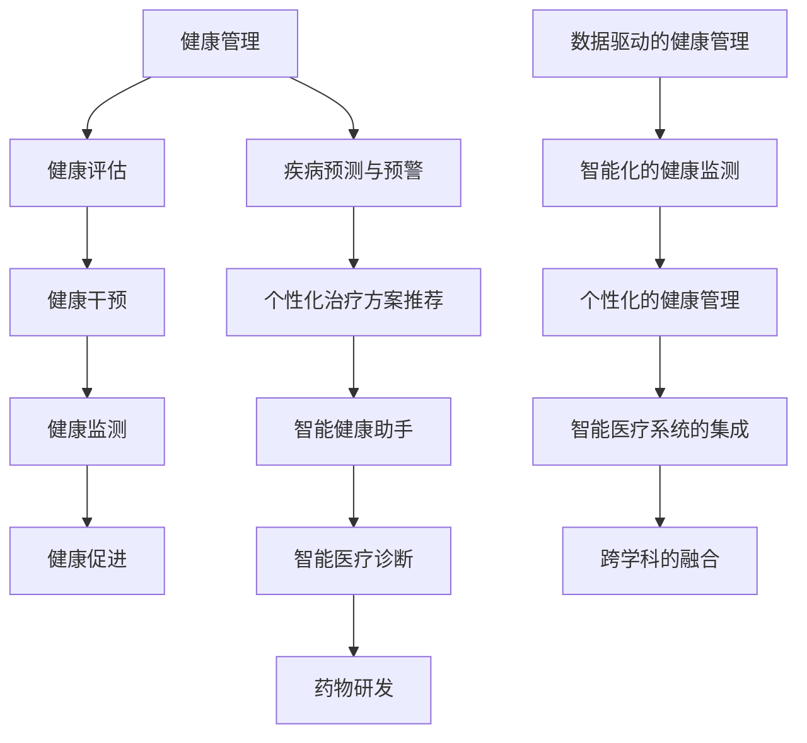
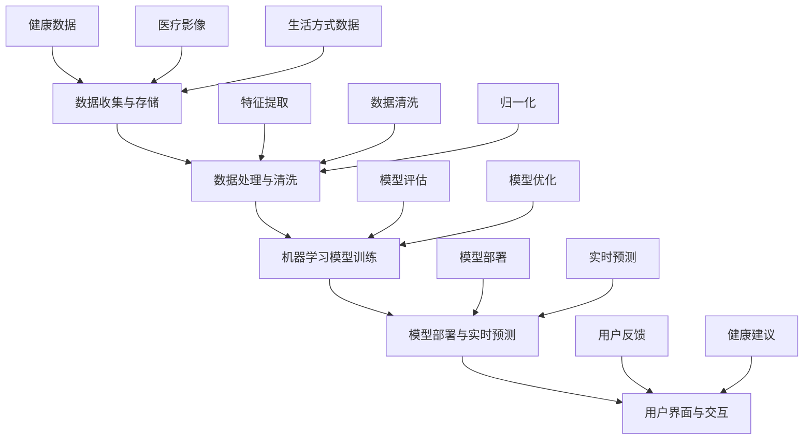
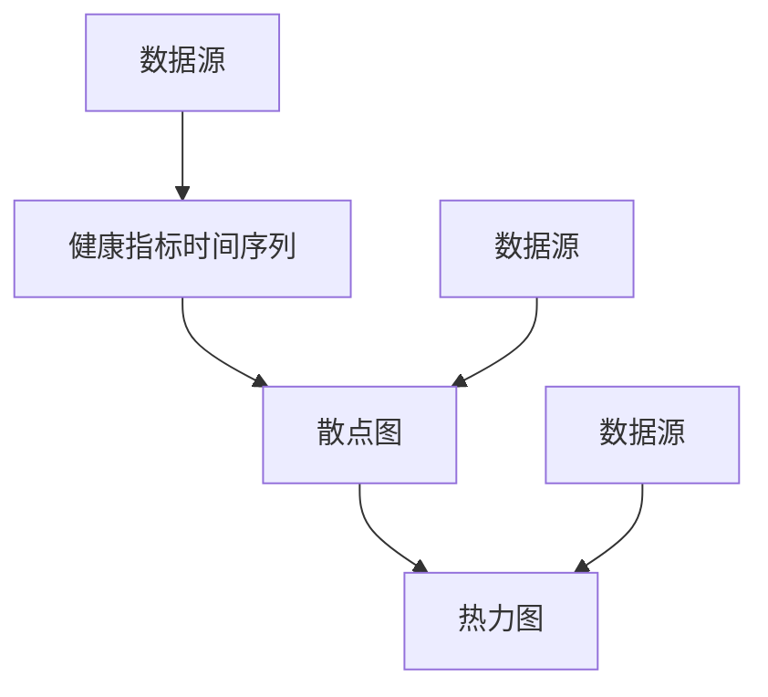
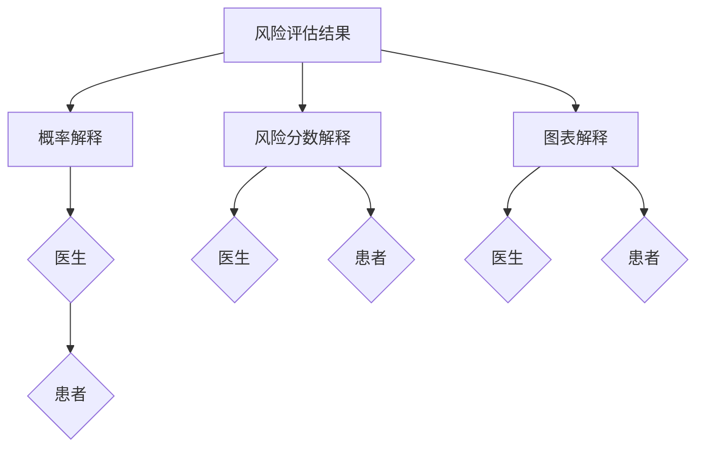

                 

### 第1章 AI在健康管理中的应用

#### 1.1 健康管理的基本概念

健康管理是指通过一系列科学方法和技术，对个体或群体的健康状态进行监测、评估、干预和优化，以达到预防疾病、提高生活质量和延长寿命的目的。健康管理的基本概念包括健康评估、健康干预、健康监测和健康促进。

- **健康评估**：通过健康检查、问卷调查和数据分析等方法，对个体的健康状况进行全面评估。
- **健康干预**：根据健康评估结果，采取针对性的措施，如药物治疗、生活方式改变等，以改善健康状况。
- **健康监测**：通过定期检测、跟踪和监测，了解个体的健康状况变化，以便及时调整干预措施。
- **健康促进**：通过健康教育和健康行为干预，提高个体的健康意识和健康水平。

#### 1.2 AI技术在健康管理中的应用场景

人工智能（AI）技术在健康管理中的应用已经逐渐成为现代医疗领域的一个重要组成部分。AI在健康管理中的应用场景主要包括以下几个方面：

- **疾病预测与预警**：通过分析患者的病史、基因信息、生活方式数据等，使用机器学习算法预测疾病风险，并提前进行干预。
- **个性化治疗方案推荐**：根据患者的具体病情、病史和基因信息，AI系统可以推荐个性化的治疗方案，提高治疗效果。
- **智能健康助手**：通过智能语音交互、自然语言处理等技术，为用户提供健康咨询、健康状态监测和健康管理建议。
- **智能医疗诊断**：利用深度学习、计算机视觉等技术，对医学影像进行分析，辅助医生进行疾病诊断。
- **药物研发**：通过计算化学、机器学习等技术，加速新药的发现和开发过程。

#### 1.3 AI驱动的智能健康管理的发展趋势

随着AI技术的不断发展和医疗数据的积累，AI驱动的智能健康管理正呈现出以下几个发展趋势：

- **数据驱动的健康管理**：利用大数据和人工智能技术，从海量数据中提取有价值的信息，为个体提供更加精准的健康管理服务。
- **智能化的健康监测**：通过可穿戴设备、智能传感器等技术，实现对健康数据的实时监测和分析，为健康管理提供实时数据支持。
- **个性化的健康管理**：基于个体的健康数据，利用机器学习算法为个体制定个性化的健康管理方案，提高健康管理的有效性。
- **智能医疗系统的集成**：将AI技术与现有的医疗系统进行集成，实现健康数据的互联互通，提供全面的健康管理服务。
- **跨学科的融合**：AI技术与生物医学、心理学、社会学等学科的结合，将推动智能健康管理领域的创新发展。

### Mermaid 流程图



通过上述流程图，我们可以清晰地看到AI在健康管理中的核心概念及其相互关系。接下来，我们将深入探讨每个概念的具体实现和应用。### 第2章 AI驱动的健康管理核心概念

#### 2.1 人工智能与健康管理的联系

人工智能（AI）与健康管理的联系日益紧密，成为提升医疗效率和患者生活质量的重要工具。AI在健康管理中的核心概念主要体现在以下几个方面：

- **大数据分析**：AI技术可以处理和分析大量医疗数据，包括患者的病历、基因信息、生活方式等，从而提供精准的健康评估和预测。
- **机器学习算法**：通过机器学习算法，AI能够从数据中学习规律，预测疾病风险，制定个性化的治疗方案，并实时调整干预措施。
- **自然语言处理**：AI能够理解和处理自然语言，用于智能健康咨询和患者病史的自动化分析。
- **计算机视觉**：通过计算机视觉技术，AI可以分析医学影像，辅助医生进行疾病诊断。
- **智能设备集成**：AI可以与智能医疗设备集成，实时监测患者的健康状况，提高健康管理的效率和准确性。

#### 2.2 健康管理的AI核心算法原理

健康管理的AI核心算法主要包括以下几种：

- **监督学习算法**：监督学习算法通过对已知数据的学习，预测新数据的标签。常见的监督学习算法包括决策树、随机森林、支持向量机（SVM）和神经网络等。这些算法在疾病预测、风险评分等方面有广泛应用。

  ```python
  # 伪代码：决策树算法预测疾病风险
  def predict_disease_risk(features):
      # 初始化决策树模型
      decision_tree = DecisionTree()
      # 训练模型
      decision_tree.train(features)
      # 预测疾病风险
      risk = decision_tree.predict(features)
      return risk
  ```

- **无监督学习算法**：无监督学习算法用于处理未标记的数据，通过发现数据中的模式和结构，用于疾病聚类分析、患者群体细分等。

  ```python
  # 伪代码：K-均值聚类算法对疾病进行聚类
  def cluster_diseases(data, k):
      # 初始化K-均值聚类模型
      k_means = KMeans(k)
      # 聚类
      clusters = k_means.cluster(data)
      return clusters
  ```

- **深度学习算法**：深度学习算法，如卷积神经网络（CNN）和循环神经网络（RNN），在医学影像分析和基因组数据挖掘中表现出强大的能力。

  ```python
  # 伪代码：卷积神经网络分析医学影像
  def analyze_medical_image(image):
      # 初始化卷积神经网络模型
      cnn_model = CNNModel()
      # 预处理图像
      preprocessed_image = preprocess_image(image)
      # 分析图像
      result = cnn_model.predict(preprocessed_image)
      return result
  ```

#### 2.3 健康管理的AI架构

健康管理的AI架构通常包括以下几个关键组成部分：

- **数据收集与存储**：收集患者健康数据，包括电子健康记录、医疗影像、生活方式数据等，并存储在分布式数据库中。
- **数据处理与清洗**：对收集到的数据进行预处理，包括数据清洗、归一化、特征提取等，以便于后续的分析和应用。
- **机器学习模型训练**：使用处理后的数据训练机器学习模型，包括监督学习、无监督学习和深度学习模型。
- **模型部署与实时预测**：将训练好的模型部署到生产环境中，实时接收新的数据，进行预测和决策。
- **用户界面与交互**：提供用户友好的界面，使用户能够方便地获取健康建议、监控数据和交互反馈。

### Mermaid 流程图



通过上述流程图，我们可以清晰地了解AI在健康管理中的核心概念、算法原理和架构设计。在下一章中，我们将进一步探讨健康数据分析与处理的关键技术。### 第3章 健康数据分析与处理

#### 3.1 健康数据收集与存储

健康数据收集是健康管理的基础，它包括电子健康记录（EHR）、医疗影像、基因数据、生活方式数据等多个方面。这些数据来源广泛，包括医院系统、可穿戴设备、患者自我报告等。为了确保数据的完整性和安全性，需要使用分布式数据库系统进行存储。

- **数据类型**：健康数据类型多样，包括结构化数据（如EHR）、半结构化数据（如医疗影像）和非结构化数据（如医生笔记、患者日志）。
- **数据存储策略**：采用分布式数据库系统（如Hadoop、Spark）和云存储服务（如AWS S3、Google Cloud Storage）进行数据存储，以提高数据的可扩展性和访问速度。

```python
# 伪代码：使用Hadoop分布式文件系统（HDFS）存储健康数据
def store_health_data(data):
    # 初始化Hadoop分布式文件系统
    hdfs = HDFS()
    # 上传数据到HDFS
    hdfs.upload(data, 'health_data')
```

#### 3.2 数据预处理方法

数据预处理是确保数据分析准确性的关键步骤。它包括数据清洗、数据归一化、特征提取和特征选择等。

- **数据清洗**：去除重复数据、填补缺失值、纠正错误数据，以提高数据质量。
- **数据归一化**：将不同量纲的数据转换为相同量纲，便于模型训练。
- **特征提取**：从原始数据中提取对预测任务有用的特征，如时间序列特征、文本特征和图像特征。
- **特征选择**：选择对预测任务最有效的特征，降低模型复杂度和过拟合风险。

```python
# 伪代码：特征提取与选择
def preprocess_data(data):
    # 数据清洗
    clean_data = clean_data(data)
    # 数据归一化
    normalized_data = normalize_data(clean_data)
    # 特征提取
    features = extract_features(normalized_data)
    # 特征选择
    selected_features = select_features(features)
    return selected_features
```

#### 3.3 数据可视化技术

数据可视化是将数据以图形或图像的形式展示出来的过程，有助于理解和分析数据。在健康管理中，常用的数据可视化技术包括：

- **时间序列可视化**：用于展示数据随时间变化的趋势，如患者健康指标的变化。
- **散点图**：用于展示不同特征之间的关系，如基因与疾病风险的关系。
- **热力图**：用于展示数据之间的相关性，如不同特征之间的相关性。



通过上述技术，我们可以从不同角度分析和理解健康数据，为后续的机器学习模型训练和预测提供支持。

### 实际案例：健康数据可视化

假设我们有一组患者的血压数据，需要分析其随时间的变化趋势。

```python
import matplotlib.pyplot as plt
import pandas as pd

# 加载数据
data = pd.read_csv('blood_pressure_data.csv')

# 可视化数据
plt.plot(data['date'], data['systolic'], label='Systolic Pressure')
plt.plot(data['date'], data['diastolic'], label='Diastolic Pressure')
plt.xlabel('Date')
plt.ylabel('Pressure (mmHg)')
plt.title('Blood Pressure over Time')
plt.legend()
plt.show()
```

通过上述代码，我们可以直观地看到患者的血压随时间的变化趋势，为医生提供重要的诊断依据。

### 总结

本章介绍了健康数据分析与处理的关键技术和方法，包括数据收集与存储、数据预处理和数据可视化。在下一章中，我们将进一步探讨智能健康风险评估的相关内容。### 第4章 智能健康风险评估

#### 4.1 健康风险评估模型

健康风险评估模型是智能健康管理的重要组成部分，用于预测个体未来发生某种疾病的风险，并采取相应的预防措施。这些模型通常基于大量的健康数据，包括遗传信息、生活方式、生物标志物等。

- **风险评估因素**：健康风险评估模型考虑的因素包括年龄、性别、家族病史、吸烟状况、血压、体重指数（BMI）等。
- **模型构建方法**：常用的健康风险评估模型包括Logistic回归、决策树、随机森林、支持向量机（SVM）等。

#### 4.2 风险评估算法

风险评估算法是健康风险评估模型的核心，用于从数据中提取特征，并基于特征进行疾病风险的预测。

- **Logistic回归**：Logistic回归是一种常用的概率预测模型，用于预测二元变量的概率。其公式如下：

  $$ P(Y=1|X) = \frac{1}{1 + e^{-(\beta_0 + \beta_1X_1 + \beta_2X_2 + ... + \beta_nX_n)}} $$

  其中，\( \beta_0, \beta_1, \beta_2, ..., \beta_n \) 是模型参数。

  ```python
  # 伪代码：Logistic回归模型预测疾病风险
  def predict_risk(features, model):
      probability = model.predict(features)
      risk = 1 / (1 + np.exp(-model.coef_ * features))
      return risk
  ```

- **决策树**：决策树通过一系列的判断节点来预测疾病风险。每个节点都基于一个特征进行划分，直至达到终止条件。

  ```python
  # 伪代码：决策树模型预测疾病风险
  def predict_risk(features, tree):
      risk = tree.predict(features)
      return risk
  ```

- **随机森林**：随机森林是由多棵决策树组成的集成模型，通过聚合多个决策树的结果来提高预测性能。

  ```python
  # 伪代码：随机森林模型预测疾病风险
  def predict_risk(features, forest):
      risks = forest.predict(features)
      average_risk = np.mean(risks)
      return average_risk
  ```

- **支持向量机（SVM）**：SVM通过找到一个最优的超平面，将不同类别的数据点分隔开来。在健康风险评估中，SVM通常用于分类问题。

  ```python
  # 伪代码：SVM模型预测疾病风险
  def predict_risk(features, model):
      risk = model.predict(features)
      return risk
  ```

#### 4.3 风险评估结果解释

风险评估结果的解释对于医生和患者都至关重要。以下是一些常用的风险评估结果解释方法：

- **概率解释**：将风险评估结果转换为发生某种疾病的概率，帮助医生和患者了解疾病的潜在风险。
- **分数解释**：使用风险分数来表示疾病风险，通常分为低风险、中风险和高风险等级。
- **图表解释**：通过图表（如条形图、折线图等）展示不同风险因素对疾病风险的影响。



#### 实际案例：基于Logistic回归的心血管疾病风险评估

假设我们使用Logistic回归模型来预测个体患心血管疾病的风险。以下是一个简化的例子：

```python
import pandas as pd
from sklearn.linear_model import LogisticRegression

# 加载数据
data = pd.read_csv('cvd_risk_data.csv')

# 特征选择
features = data[['age', 'gender', 'smoking_status', 'blood_pressure', 'BMI']]

# 目标变量
target = data['cvd_risk']

# 划分训练集和测试集
from sklearn.model_selection import train_test_split
X_train, X_test, y_train, y_test = train_test_split(features, target, test_size=0.2, random_state=42)

# 训练Logistic回归模型
model = LogisticRegression()
model.fit(X_train, y_train)

# 预测测试集
predictions = model.predict(X_test)

# 评估模型性能
from sklearn.metrics import accuracy_score, classification_report
print(accuracy_score(y_test, predictions))
print(classification_report(y_test, predictions))

# 风险评估
def predict_risk(input_data, model):
    probability = model.predict_proba(input_data)[0][1]
    risk = 1 / (1 + np.exp(-model.coef_ * input_data))
    return probability, risk

# 输入一个新样本
new_data = pd.DataFrame([[50, 0, 1, 120, 25]], columns=features.columns)

# 预测新样本的风险
probability, risk = predict_risk(new_data, model)

print(f"Probability of CVD Risk: {probability:.2f}")
print(f"Risk Score: {risk:.2f}")
```

在这个案例中，我们使用Logistic回归模型来预测一个新样本患心血管疾病的风险。通过模型预测的概率和风险分数，医生和患者可以更好地了解该个体的健康风险，并采取相应的预防措施。

### 总结

本章介绍了智能健康风险评估的核心概念、算法原理和实际应用。在下一章中，我们将探讨如何基于AI技术制定个性化的预防策略。### 第5章 预防策略制定

#### 5.1 基于AI的预防策略

预防策略的制定是智能健康管理的核心环节，旨在降低疾病风险，提高生活质量。基于AI的预防策略通过分析个体健康数据，为每个人提供量身定制的预防措施。

- **个性化预防策略**：基于AI的预防策略可以根据个体的健康状况、遗传因素、生活方式等，提供个性化的预防建议。例如，对于高风险患者，AI系统可以推荐更严格的监测计划或预防性治疗。

  ```python
  # 伪代码：基于AI的个性化预防策略
  def generate_prevention_strategy(health_data, model):
      risk_level = model.predict(health_data)
      if risk_level < 0.3:
          strategy = '维持当前健康状态'
      elif risk_level < 0.6:
          strategy = '加强监测和健康生活方式'
      else:
          strategy = '采取严格的预防措施'
      return strategy
  ```

- **动态调整策略**：基于实时健康监测数据，AI系统可以动态调整预防策略，确保预防措施的持续有效性。

  ```python
  # 伪代码：动态调整预防策略
  def update_prevention_strategy(health_data, current_strategy, model):
      new_risk_level = model.predict(health_data)
      if new_risk_level < 0.3 and current_strategy != '维持当前健康状态':
          new_strategy = '维持当前健康状态'
      elif new_risk_level < 0.6 and current_strategy != '加强监测和健康生活方式':
          new_strategy = '加强监测和健康生活方式'
      else:
          new_strategy = '采取严格的预防措施'
      return new_strategy
  ```

#### 5.2 预防策略评估

预防策略的评估是确保其有效性的关键步骤。通过评估，可以了解预防策略的实际效果，并进行必要的调整。

- **效果评估指标**：常用的效果评估指标包括疾病风险降低率、健康指标改善情况、患者满意度等。

  ```python
  # 伪代码：评估预防策略效果
  def evaluate_prevention_strategy(strategy, health_data, target_data):
      risk_reduction = 1 - (target_risk / initial_risk)
      health_improvement = calculate_health_improvement(health_data, target_data)
      patient_satisfaction = get_patient_satisfaction_r
  ```

- **效果评估方法**：可以通过临床试验、观察研究、模拟实验等方法来评估预防策略的效果。

  ```python
  # 伪代码：临床试验评估预防策略
  def conduct_clinical_trial(strategy, patient_group):
      # 分组患者，一组实施预防策略，另一组保持原状态
      control_group = patient_group[patient_group['strategy'] != strategy]
      treatment_group = patient_group[patient_group['strategy'] == strategy]
      
      # 收集数据，包括疾病风险、健康指标、患者满意度等
      risk_data = collect_risk_data(treatment_group)
      health_data = collect_health_data(treatment_group)
      satisfaction_data = collect_satisfaction_data(treatment_group)
      
      # 评估效果
      risk_reduction = calculate_risk_reduction(risk_data)
      health_improvement = calculate_health_improvement(health_data)
      patient_satisfaction = calculate_patient_satisfaction(satisfaction_data)
      
      return risk_reduction, health_improvement, patient_satisfaction
  ```

#### 5.3 预防策略的个性化定制

个性化定制是预防策略的核心，它要求AI系统能够根据个体特征和环境因素，为每个人提供最优的预防方案。

- **个体特征**：包括基因信息、生物标志物、生活习惯、心理状态等。
- **环境因素**：包括社会环境、工作压力、气候变化等。

```python
# 伪代码：个性化定制预防策略
def personalize_prevention_strategy(individual_data, environment_data, model):
    risk_level = model.predict(individual_data)
    strategy = generate_prevention_strategy(risk_level, model)
    if risk_level < 0.3:
        strategy = '维持当前健康状态'
    elif risk_level < 0.6:
        strategy = '加强监测和健康生活方式'
    else:
        strategy = '采取严格的预防措施'
    return strategy
```

#### 实际案例：基于AI的慢性病预防策略

假设我们使用AI系统为一名高血压患者制定预防策略。

```python
import pandas as pd
from sklearn.linear_model import LogisticRegression

# 加载数据
health_data = pd.read_csv('hypertension_data.csv')

# 特征选择
features = health_data[['age', 'gender', 'smoking_status', 'blood_pressure', 'BMI']]

# 目标变量
target = health_data['hypertension_risk']

# 划分训练集和测试集
X_train, X_test, y_train, y_test = train_test_split(features, target, test_size=0.2, random_state=42)

# 训练Logistic回归模型
model = LogisticRegression()
model.fit(X_train, y_train)

# 预测测试集
predictions = model.predict(X_test)

# 评估模型性能
accuracy = model.score(X_test, y_test)
print(f"Model Accuracy: {accuracy:.2f}")

# 基于AI制定预防策略
def generate_prevention_strategy(health_data, model):
    risk_level = model.predict(health_data)
    if risk_level < 0.3:
        strategy = '维持当前健康状态'
    elif risk_level < 0.6:
        strategy = '加强监测和健康生活方式'
    else:
        strategy = '采取严格的预防措施'
    return strategy

# 新患者数据
new_patient_data = pd.DataFrame([[50, 0, 1, 140, 25]], columns=features.columns)

# 预测新患者风险
risk_level = model.predict(new_patient_data)
prevention_strategy = generate_prevention_strategy(new_patient_data, model)

print(f"Prevention Strategy: {prevention_strategy}")
```

在这个案例中，我们使用Logistic回归模型预测高血压风险，并基于预测结果制定预防策略。通过这个例子，我们可以看到AI在慢性病预防中的实际应用。

### 总结

本章介绍了基于AI的预防策略制定、评估和个性化定制，包括核心算法原理和实际应用案例。在下一章中，我们将探讨智能康复辅助的相关内容。### 第6章 智能康复辅助

#### 6.1 康复辅助技术

智能康复辅助技术是利用人工智能和物联网技术，为康复患者提供个性化、高效、实时的康复指导和支持。这些技术包括：

- **运动监测与反馈**：通过可穿戴设备和智能传感器，实时监测患者的运动数据，如步数、心率、动作轨迹等，并提供实时反馈，帮助患者进行正确的康复运动。

  ```mermaid
  graph TD
      A[可穿戴设备] --> B[运动数据采集]
      B --> C[实时反馈]
      C --> D[康复指导]
  ```

- **康复计划制定**：基于患者的健康数据和医生的建议，智能康复辅助系统能够为患者制定个性化的康复计划，包括运动方案、饮食建议、休息安排等。

  ```mermaid
  graph TD
      A[健康数据] --> B[康复计划制定]
      B --> C[运动方案]
      C --> D[饮食建议]
      D --> E[休息安排]
  ```

- **虚拟现实（VR）辅助训练**：利用虚拟现实技术，为患者提供沉浸式的康复训练环境，提高康复训练的趣味性和效果。

  ```mermaid
  graph TD
      A[虚拟现实技术] --> B[康复训练环境]
      B --> C[运动训练]
      C --> D[反馈与调整]
  ```

- **机器人辅助康复**：通过机器人技术，帮助患者进行运动康复训练，如步态训练、关节活动度训练等，提高康复效率和效果。

  ```mermaid
  graph TD
      A[机器人技术] --> B[康复训练]
      B --> C[运动监控]
      C --> D[反馈调整]
  ```

#### 6.2 康复辅助算法

康复辅助算法是智能康复辅助技术的核心，用于分析和处理康复过程中的大量数据，为患者提供精准的康复指导和支持。

- **运动轨迹分析**：通过分析患者的运动轨迹，识别患者的运动模式，提供个性化的运动调整建议。

  ```python
  # 伪代码：运动轨迹分析
  def analyze_motion_trajectory(trajectory_data):
      # 提取运动特征
      features = extract_motion_features(trajectory_data)
      # 分析运动模式
      motion_mode = analyze_motion_mode(features)
      # 提供运动调整建议
      adjustment_suggestions = generate_adjustment_suggestions(motion_mode)
      return adjustment_suggestions
  ```

- **心率监测与调控**：通过实时监测患者的心率，结合运动强度和健康状况，提供心率调控建议，确保康复训练的安全性和有效性。

  ```python
  # 伪代码：心率监测与调控
  def monitor_heart_rate(heart_rate_data):
      # 分析心率变化
      heart_rate_changes = analyze_heart_rate_changes(heart_rate_data)
      # 提供心率调控建议
      adjustment_suggestions = generate_heart_rate_adjustments(heart_rate_changes)
      return adjustment_suggestions
  ```

- **康复效果评估**：通过分析康复过程中的各种数据，评估患者的康复效果，为医生提供决策支持。

  ```python
  # 伪代码：康复效果评估
  def evaluate_rehabilitation_effects(rehabilitation_data):
      # 分析康复数据
      data_analysis = analyze_rehabilitation_data(rehabilitation_data)
      # 评估康复效果
      effects_evaluation = calculate_rehabilitation_effects(data_analysis)
      return effects_evaluation
  ```

#### 6.3 康复辅助效果评估

康复辅助效果评估是确保智能康复辅助技术有效性的关键步骤。通过评估，可以了解康复辅助技术对患者康复过程的影响，并进行优化和改进。

- **效果评估指标**：包括康复效果改善率、患者满意度、康复时间等。

  ```python
  # 伪代码：效果评估指标
  def evaluate_rehabilitation_effects(effect_data):
      improvement_rate = calculate_improvement_rate(effect_data)
      patient_satisfaction = calculate_patient_satisfaction(effect_data)
      rehabilitation_time = calculate_rehabilitation_time(effect_data)
      return improvement_rate, patient_satisfaction, rehabilitation_time
  ```

- **效果评估方法**：包括临床试验、观察研究、问卷调查等。

  ```mermaid
  graph TD
      A[临床试验] --> B[效果评估]
      A --> C[观察研究]
      A --> D[问卷调查]
  ```

#### 实际案例：基于智能康复辅助系统的肩关节康复

假设我们使用智能康复辅助系统为一名肩关节损伤患者提供康复指导。

```python
import pandas as pd

# 加载患者康复数据
rehabilitation_data = pd.read_csv('shoulder_rehabilitation_data.csv')

# 分析运动轨迹
def analyze_motion_trajectory(trajectory_data):
    # 提取运动特征
    features = extract_motion_features(trajectory_data)
    # 分析运动模式
    motion_mode = analyze_motion_mode(features)
    # 提供运动调整建议
    adjustment_suggestions = generate_adjustment_suggestions(motion_mode)
    return adjustment_suggestions

# 分析患者运动轨迹
motion_trajectory_analysis = analyze_motion_trajectory(rehabilitation_data['motion_trajectory'])

# 监测心率
def monitor_heart_rate(heart_rate_data):
    # 分析心率变化
    heart_rate_changes = analyze_heart_rate_changes(heart_rate_data)
    # 提供心率调控建议
    adjustment_suggestions = generate_heart_rate_adjustments(heart_rate_changes)
    return adjustment_suggestions

# 监测患者心率
heart_rate_monitoring = monitor_heart_rate(rehabilitation_data['heart_rate'])

# 评估康复效果
def evaluate_rehabilitation_effects(effect_data):
    # 分析康复数据
    data_analysis = analyze_rehabilitation_data(effect_data)
    # 评估康复效果
    effects_evaluation = calculate_rehabilitation_effects(data_analysis)
    return effects_evaluation

# 评估患者康复效果
rehabilitation_effects_evaluation = evaluate_rehabilitation_effects(rehabilitation_data)

# 输出康复建议
print("Rehabilitation Suggestions:")
print(motion_trajectory_analysis)
print(heart_rate_monitoring)
print("Rehabilitation Effects Evaluation:")
print(rehabilitation_effects_evaluation)
```

在这个案例中，我们使用智能康复辅助系统为肩关节损伤患者提供运动轨迹分析、心率监测和康复效果评估，为医生和患者提供科学、有效的康复指导。

### 总结

本章介绍了智能康复辅助技术的原理、算法和应用，包括实际案例演示。在下一章中，我们将探讨智能健康管理平台搭建和实现。### 第7章 智能健康管理平台搭建

#### 7.1 健康管理平台架构设计

智能健康管理平台需要涵盖从数据收集、存储、处理到分析、应用的全流程，其架构设计至关重要。一个典型的智能健康管理平台架构包括以下几个关键部分：

- **数据层**：负责数据的收集、存储和预处理。数据源包括电子健康记录（EHR）、可穿戴设备、医疗影像等。数据存储使用分布式数据库，如Hadoop HDFS或云数据库，确保数据的可靠性和可扩展性。

- **计算层**：负责数据处理和分析，包括特征提取、模型训练、风险评估等。计算层使用分布式计算框架，如Spark，以提高数据处理速度和效率。

- **应用层**：提供面向用户的健康管理服务，包括健康评估、个性化预防策略、康复辅助等。应用层通常采用前后端分离架构，前端使用Web或移动应用，后端使用RESTful API提供服务。

- **接口层**：负责不同模块之间的数据交换和通信。接口层使用标准化的协议和数据格式，如HTTP、JSON等，确保系统的兼容性和可扩展性。

#### 7.2 前端开发技术

前端开发是实现用户交互的关键部分，常用的技术包括：

- **Web框架**：如React、Vue.js、Angular等，用于构建动态、响应式的用户界面。
- **CSS框架**：如Bootstrap、Foundation等，用于快速搭建美观的网页布局。
- **可视化库**：如D3.js、ECharts等，用于生成数据可视化图表。
- **状态管理**：如Redux、Vuex等，用于管理应用状态，提高代码的可维护性。

#### 7.3 后端开发技术

后端开发负责数据处理和分析，常用的技术包括：

- **服务器框架**：如Spring Boot、Django等，用于构建RESTful API和服务端逻辑。
- **数据库**：如MySQL、PostgreSQL、MongoDB等，用于存储和管理健康数据。
- **消息队列**：如RabbitMQ、Kafka等，用于处理异步消息和分布式任务。
- **缓存技术**：如Redis、Memcached等，用于提高数据访问速度和系统性能。

#### 7.4 数据分析与处理实战

以下是一个简单的实战案例，展示如何使用Python和Spark进行健康数据分析。

```python
from pyspark.sql import SparkSession
from pyspark.ml import Pipeline
from pyspark.ml.feature import VectorAssembler
from pyspark.ml.classification import LogisticRegression

# 创建Spark会话
spark = SparkSession.builder.appName("HealthDataAnalysis").getOrCreate()

# 加载数据
data = spark.read.csv("health_data.csv", header=True)

# 特征提取
assembler = VectorAssembler(inputCols=["age", "gender", "blood_pressure", "BMI"], outputCol="features")

# 模型训练
logistic_regression = LogisticRegression(featuresCol="features", labelCol="disease")

# 构建管道
pipeline = Pipeline(stages=[assembler, logistic_regression])

# 训练模型
pipeline_model = pipeline.fit(data)

# 预测
predictions = pipeline_model.transform(data)

# 评估模型性能
from pyspark.ml.evaluation import BinaryClassificationEvaluator
evaluator = BinaryClassificationEvaluator(labelCol="disease", rawPredictionCol="raw_predictions")
accuracy = evaluator.evaluate(predictions)
print(f"Model Accuracy: {accuracy:.2f}")

# 关闭Spark会话
spark.stop()
```

在这个案例中，我们使用Spark ML库进行健康数据的特征提取和模型训练，并评估模型的性能。

#### 7.5 代码实际案例与解读

以下是一个简单的后端代码示例，展示如何使用Spring Boot构建RESTful API。

```java
import org.springframework.boot.SpringApplication;
import org.springframework.boot.autoconfigure.SpringBootApplication;
import org.springframework.web.bind.annotation.GetMapping;
import org.springframework.web.bind.annotation.RestController;

@SpringBootApplication
public class HealthManagementApp {

    public static void main(String[] args) {
        SpringApplication.run(HealthManagementApp.class, args);
    }
}

@RestController
public class HealthDataController {

    @GetMapping("/risk")
    public double getDiseaseRisk(int age, int blood_pressure, double BMI) {
        // 这里调用机器学习模型进行预测
        double risk = logisticRegressionModel.predict(new double[]{age, blood_pressure, BMI});
        return risk;
    }
}
```

在这个案例中，我们创建了一个Spring Boot应用程序，并通过RESTful API提供疾病风险预测服务。在实际应用中，API会调用后端的机器学习模型进行预测，并将结果返回给前端。

### 总结

本章介绍了智能健康管理平台的架构设计、前端和后端开发技术，以及实际代码案例和解读。在下一章中，我们将探讨智能健康管理系统的优化与性能评估。### 第8章 数据分析与处理实战

#### 8.1 健康数据采集与存储

健康数据的采集是智能健康管理的基础，涉及多种数据源，如电子健康记录（EHR）、医疗设备、患者自我报告等。数据采集后，需要存储在分布式数据库中，以便进行后续处理和分析。

- **数据采集**：使用API、传感器、手动输入等方式采集数据。例如，使用可穿戴设备采集心率、步数、睡眠等数据。

  ```python
  import requests

  # 采集步数数据
  step_data = requests.get('https://api.wearable_device.com/step_count').json()
  ```

- **数据存储**：使用分布式数据库（如MongoDB、Hadoop HDFS）存储数据。例如，使用MongoDB存储步数数据。

  ```python
  from pymongo import MongoClient

  # 连接MongoDB
  client = MongoClient('mongodb://localhost:27017/')

  # 存储步数数据
  db = client['health_data']
  collection = db['step_count']
  collection.insert_one(step_data)
  ```

#### 8.2 数据预处理实战

数据预处理是确保数据分析准确性的关键步骤，包括数据清洗、特征提取和归一化等。

- **数据清洗**：处理缺失值、异常值和重复值，提高数据质量。

  ```python
  import pandas as pd

  # 加载数据
  data = pd.read_csv('health_data.csv')

  # 填补缺失值
  data.fillna(data.mean(), inplace=True)

  # 删除重复值
  data.drop_duplicates(inplace=True)
  ```

- **特征提取**：从原始数据中提取对分析任务有用的特征。

  ```python
  from sklearn.feature_extraction.text import TfidfVectorizer

  # 加载文本数据
  text_data = pd.read_csv('patient_notes.csv')['note']

  # 特征提取
  vectorizer = TfidfVectorizer()
  features = vectorizer.fit_transform(text_data)
  ```

- **数据归一化**：将不同量纲的数据转换为相同量纲，便于模型训练。

  ```python
  from sklearn.preprocessing import MinMaxScaler

  # 加载特征数据
  feature_data = pd.read_csv('feature_data.csv')

  # 归一化数据
  scaler = MinMaxScaler()
  normalized_data = scaler.fit_transform(feature_data)
  ```

#### 8.3 数据可视化实战

数据可视化有助于理解和分析健康数据，常用的可视化工具包括Python的Matplotlib、Seaborn和Plotly等。

- **时间序列可视化**：用于展示数据随时间的变化趋势。

  ```python
  import matplotlib.pyplot as plt

  # 加载数据
  data = pd.read_csv('blood_pressure.csv')

  # 可视化时间序列
  plt.plot(data['date'], data['systolic'])
  plt.xlabel('Date')
  plt.ylabel('Systolic Pressure (mmHg)')
  plt.title('Blood Pressure Over Time')
  plt.show()
  ```

- **散点图**：用于展示不同特征之间的关系。

  ```python
  import seaborn as sns

  # 加载数据
  data = pd.read_csv('health_data.csv')

  # 可视化散点图
  sns.scatterplot(x='age', y='BMI', data=data)
  plt.xlabel('Age')
  plt.ylabel('BMI')
  plt.title('Age vs. BMI')
  plt.show()
  ```

- **热力图**：用于展示数据之间的相关性。

  ```python
  import seaborn as sns

  # 加载数据
  data = pd.read_csv('correlation_data.csv')

  # 可视化热力图
  sns.heatmap(data.corr(), annot=True, cmap='coolwarm')
  plt.title('Correlation Matrix')
  plt.show()
  ```

#### 实际案例：健康数据可视化与分析

以下是一个实际案例，展示如何使用Python进行健康数据的可视化与分析。

```python
import pandas as pd
import matplotlib.pyplot as plt
import seaborn as sns

# 加载数据
data = pd.read_csv('health_data.csv')

# 数据预处理
data.fillna(data.mean(), inplace=True)
data.drop_duplicates(inplace=True)

# 数据可视化
# 时间序列可视化
plt.figure(figsize=(12, 6))
plt.plot(data['date'], data['systolic'], label='Systolic Pressure')
plt.plot(data['date'], data['diastolic'], label='Diastolic Pressure')
plt.xlabel('Date')
plt.ylabel('Pressure (mmHg)')
plt.title('Blood Pressure Over Time')
plt.legend()
plt.show()

# 散点图
sns.scatterplot(x='age', y='BMI', data=data)
plt.xlabel('Age')
plt.ylabel('BMI')
plt.title('Age vs. BMI')
plt.show()

# 热力图
sns.heatmap(data.corr(), annot=True, cmap='coolwarm')
plt.title('Correlation Matrix')
plt.show()

# 数据分析
# 描述性统计
print(data.describe())

# 相关性分析
print(data.corr())
```

在这个案例中，我们使用Python对健康数据进行了预处理、可视化与分析，展示了时间序列、散点图和热力图的可视化效果，以及描述性统计和相关性分析的结果。

### 总结

本章介绍了健康数据的采集与存储、预处理实战和数据可视化实战，并提供了一个实际案例。在下一章中，我们将探讨智能健康管理系统集成与优化。### 第9章 智能健康管理系统集成与优化

#### 9.1 系统集成策略

智能健康管理系统集成的核心目标是确保各个模块（如数据收集、数据分析、健康管理、康复辅助等）能够高效、稳定地协同工作。以下是系统集成的主要策略：

- **数据整合**：通过统一的数据格式和接口，将不同来源的数据整合到一个系统中，确保数据的一致性和实时性。
- **服务化架构**：采用微服务架构，将系统分解为若干独立的服务模块，每个服务模块负责特定的功能，便于系统的扩展和维护。
- **接口标准化**：使用标准化的接口协议（如RESTful API、GraphQL等），确保不同模块之间的数据交换和通信。

#### 9.2 系统优化方法

为了提高智能健康管理系统的性能和可扩展性，需要采用一系列优化方法：

- **缓存策略**：使用缓存技术（如Redis、Memcached等），减少对后端数据库的访问压力，提高系统的响应速度。
- **负载均衡**：通过负载均衡器（如Nginx、HAProxy等），将用户请求分布到多个服务器上，提高系统的处理能力和容错性。
- **数据库优化**：对数据库进行性能调优，包括索引优化、查询优化、分库分表等，提高数据访问速度。

#### 9.3 系统性能评估

系统性能评估是确保智能健康管理系统能够满足用户需求的关键步骤。以下是常用的系统性能评估方法：

- **负载测试**：通过模拟大量用户请求，测试系统的响应时间和处理能力，评估系统的稳定性和性能。
- **压力测试**：在极端条件下测试系统的性能，了解系统在最大负载下的表现。
- **性能监控**：使用性能监控工具（如Prometheus、Grafana等），实时监控系统的各项性能指标，及时发现并解决问题。

#### 实际案例：智能健康管理系统性能优化

以下是一个实际案例，展示如何对智能健康管理系统进行性能优化。

```python
import time
import requests
from concurrent.futures import ThreadPoolExecutor

# 假设我们有一个健康风险评估的API接口
def health_risk_api_call():
    url = 'https://health_management_api.com/risk'
    response = requests.get(url, params={'age': 30, 'blood_pressure': 120, 'BMI': 25})
    return response.json()

# 负载测试
def load_test(num_requests):
    start_time = time.time()
    with ThreadPoolExecutor(max_workers=10) as executor:
        responses = list(executor.map(health_risk_api_call, range(num_requests)))
    end_time = time.time()
    print(f"Total time for {num_requests} requests: {end_time - start_time:.2f} seconds")

# 压力测试
def stress_test(num_requests):
    start_time = time.time()
    try:
        health_risk_api_call()
    except Exception as e:
        print(f"Error: {e}")
    end_time = time.time()
    print(f"Time for single request under stress: {end_time - start_time:.2f} seconds")

# 性能监控
def performance_monitoring():
    # 假设使用Prometheus进行监控
    from prometheus_client import start_http_server, Summary

    # 创建监控指标
    request_time = Summary('health_risk_api_request_time', 'Request time in seconds')

    @request_time.time()
    def make_request():
        health_risk_api_call()

    # 启动HTTP服务器
    start_http_server(8000)

    # 模拟请求
    make_request()

    # 停止监控
    stop = input("Press Enter to stop monitoring:")
```

在这个案例中，我们使用Python进行负载测试、压力测试和性能监控，评估健康风险评估API的性能。通过这些测试，我们可以了解系统的响应时间、处理能力和稳定性，为系统的优化提供依据。

### 总结

本章介绍了智能健康管理系统集成的策略、系统优化的方法以及性能评估的实践。在下一章中，我们将探讨智能健康管理的发展趋势和未来挑战。### 第10章 智能健康管理的发展趋势

#### 10.1 人工智能在健康领域的未来应用

随着人工智能技术的不断发展，其在健康领域的应用前景愈发广阔。以下是一些主要的发展方向：

- **个性化医疗**：通过AI技术，对患者的基因、生活习惯、健康数据等进行深度分析，为患者提供个性化的治疗方案和健康建议。
- **智能药物研发**：利用AI算法和大数据分析，加速新药的研发过程，提高药物的安全性和有效性。
- **远程健康管理**：通过AI驱动的远程监控系统，实现对患者的实时监测和远程诊断，提高医疗服务的覆盖面和效率。
- **智能手术辅助**：利用AI技术进行手术规划、实时监控和操作辅助，提高手术的准确性和安全性。
- **健康大数据分析**：通过对海量健康数据的分析和挖掘，发现疾病流行规律、预测疾病趋势，为公共卫生决策提供科学依据。

#### 10.2 健康管理技术的创新方向

健康管理技术的创新方向主要包括以下几个方面：

- **可穿戴设备与物联网**：通过可穿戴设备和物联网技术，实现对人体健康数据的实时监测和传输，为健康管理提供实时数据支持。
- **智能医疗影像分析**：利用深度学习和计算机视觉技术，对医学影像进行自动分析和诊断，提高诊断准确性和效率。
- **自然语言处理**：通过自然语言处理技术，实现医疗文本的自动分析和理解，为医生提供辅助诊断和决策支持。
- **健康数据隐私保护**：研究隐私保护技术，确保在数据收集、存储和分析过程中，患者的隐私不被泄露。
- **多模态数据融合**：将多种类型的健康数据（如生物医学数据、基因数据、生活数据等）进行融合，提供更全面、准确的健康管理服务。

#### 10.3 智能健康管理的未来挑战与机遇

智能健康管理的发展面临着一系列挑战和机遇：

- **数据隐私与安全**：如何在保证数据隐私和安全的前提下，充分利用健康数据进行智能分析，是一个亟待解决的问题。
- **技术标准化与规范**：随着AI技术的广泛应用，制定统一的技术标准和规范，确保不同系统和平台之间的兼容性和互操作性，成为未来的重要任务。
- **跨学科协作**：智能健康管理涉及多个学科，如医学、生物学、计算机科学等，需要跨学科的深入合作，推动技术的创新和进步。
- **政策支持与法规**：政府需要出台相应的政策和支持措施，鼓励和规范智能健康管理技术的发展和应用。

总之，智能健康管理正处于快速发展阶段，未来将在健康领域发挥越来越重要的作用。通过不断技术创新、跨学科协作和政策支持，智能健康管理有望为人类社会带来巨大的健康福祉。### 第11章 智能健康管理工具与资源

#### 11.1 常用AI工具介绍

在智能健康管理领域，有许多优秀的AI工具可以帮助研究人员和开发者实现各种功能。以下是一些常用的AI工具及其主要用途：

- **TensorFlow**：一款开源的机器学习框架，广泛应用于深度学习模型的训练和应用。它可以用于构建智能诊断系统、个性化健康评估模型等。

  ```python
  import tensorflow as tf
  model = tf.keras.Sequential([tf.keras.layers.Dense(128, activation='relu'), tf.keras.layers.Dense(1, activation='sigmoid')])
  model.compile(optimizer='adam', loss='binary_crossentropy', metrics=['accuracy'])
  model.fit(X_train, y_train, epochs=10, batch_size=32)
  ```

- **PyTorch**：另一款流行的开源机器学习库，以其灵活性和易用性受到许多研究人员的青睐。它常用于开发复杂的神经网络模型，如医学影像分析、基因组数据挖掘等。

  ```python
  import torch
  import torch.nn as nn
  import torch.optim as optim

  model = nn.Sequential(nn.Linear(784, 512), nn.ReLU(), nn.Linear(512, 256), nn.ReLU(), nn.Linear(256, 10))
  optimizer = optim.Adam(model.parameters(), lr=0.001)
  criterion = nn.CrossEntropyLoss()

  for epoch in range(num_epochs):
      running_loss = 0.0
      for i, (inputs, labels) in enumerate(train_loader):
          optimizer.zero_grad()
          outputs = model(inputs)
          loss = criterion(outputs, labels)
          loss.backward()
          optimizer.step()
          running_loss += loss.item()
      print(f"Epoch {epoch+1}, Loss: {running_loss/len(train_loader)}")
  ```

- **Scikit-learn**：一款广泛应用于数据挖掘和机器学习的Python库，提供丰富的经典算法和工具，如逻辑回归、支持向量机、随机森林等。

  ```python
  from sklearn.model_selection import train_test_split
  from sklearn.ensemble import RandomForestClassifier
  from sklearn.metrics import accuracy_score

  X_train, X_test, y_train, y_test = train_test_split(X, y, test_size=0.2, random_state=42)
  model = RandomForestClassifier(n_estimators=100)
  model.fit(X_train, y_train)
  predictions = model.predict(X_test)
  accuracy = accuracy_score(y_test, predictions)
  print(f"Model Accuracy: {accuracy:.2f}")
  ```

- **Keras**：一款高层次的神经网络API，构建在TensorFlow和Theano之上，提供简洁明了的接口，方便开发者快速搭建和训练深度学习模型。

  ```python
  from keras.models import Sequential
  from keras.layers import Dense, Activation

  model = Sequential()
  model.add(Dense(512, input_shape=(784,), activation='relu'))
  model.add(Dense(10, activation='softmax'))
  model.compile(optimizer='rmsprop',
                loss='categorical_crossentropy',
                metrics=['accuracy'])

  model.fit(X_train, y_train, batch_size=64, epochs=30, validation_data=(X_test, y_test))
  ```

#### 11.2 健康管理资源推荐

为了更好地进行智能健康管理的研究和开发，以下是一些推荐的资源：

- **医学数据集**：获取医学数据的网站，如Kaggle、UCI机器学习库等，提供了丰富的公开数据集，可以用于模型训练和验证。

  - Kaggle: <https://www.kaggle.com/datasets>
  - UCI机器学习库: <https://archive.ics.uci.edu/ml/index.php>

- **在线教程与课程**：学习AI和机器学习的在线资源，如Coursera、edX、Udacity等，提供了系统的教程和课程。

  - Coursera: <https://www.coursera.org/>
  - edX: <https://www.edx.org/>
  - Udacity: <https://www.udacity.com/>

- **开源项目**：参与开源项目，可以学习到实际的开发经验和最佳实践。一些著名的开源项目，如TensorFlow、PyTorch、Scikit-learn等，都提供了丰富的文档和示例代码。

  - TensorFlow: <https://www.tensorflow.org/>
  - PyTorch: <https://pytorch.org/>
  - Scikit-learn: <https://scikit-learn.org/>

- **专业社区与论坛**：加入专业社区和论坛，如Stack Overflow、Reddit、GitHub等，可以与其他开发者交流经验，解决开发中的问题。

  - Stack Overflow: <https://stackoverflow.com/>
  - Reddit: <https://www.reddit.com/r/MachineLearning/>
  - GitHub: <https://github.com/>

通过使用这些AI工具和资源，开发者可以更有效地进行智能健康管理的研究和开发，推动健康技术的创新和应用。

### 总结

本章介绍了智能健康管理领域常用的AI工具和资源，包括TensorFlow、PyTorch、Scikit-learn等，以及医学数据集、在线教程、开源项目和社区论坛等。这些工具和资源将为开发者提供强大的支持，助力智能健康管理技术的发展。### 附录

#### 第14章 健康管理AI工具与资源

在本附录中，我们将介绍一些在健康管理领域常用的AI工具和资源，帮助读者更好地理解和应用AI技术。

#### 14.1 AI工具介绍

以下是一些在健康管理领域广泛使用的AI工具：

- **TensorFlow**：一款开源的机器学习框架，由Google开发。它支持多种深度学习模型，如卷积神经网络（CNN）、循环神经网络（RNN）等。适用于从数据预处理到模型训练和部署的全流程。

  - 官网：<https://www.tensorflow.org/>
  - 文档：<https://www.tensorflow.org/learn>

- **PyTorch**：一款流行的开源深度学习框架，以其灵活性和易用性受到开发者的喜爱。它支持动态计算图，易于进行模型调试和修改。

  - 官网：<https://pytorch.org/>
  - 文档：<https://pytorch.org/tutorials/>

- **Scikit-learn**：一个开源的Python机器学习库，提供了各种经典的机器学习算法，如线性回归、决策树、支持向量机等。适用于数据处理、模型训练和评估。

  - 官网：<https://scikit-learn.org/>
  - 文档：<https://scikit-learn.org/stable/documentation.html>

- **Keras**：一个高级的神经网络API，构建在TensorFlow和Theano之上。它提供了简单而强大的接口，使得构建和训练深度学习模型变得更加容易。

  - 官网：<https://keras.io/>
  - 文档：<https://keras.io/getting-started/sequential-model-guide/>

- **Hadoop**：一个分布式数据存储和处理平台，适用于大规模数据处理。常与Spark等分布式计算框架结合使用。

  - 官网：<https://hadoop.apache.org/>
  - 文档：<https://hadoop.apache.org/docs/current/hadoop-project-dist/hadoop-common/>

- **Spark**：一个开源的分布式计算系统，适用于大规模数据处理和机器学习应用。具有高效、易用的特点。

  - 官网：<https://spark.apache.org/>
  - 文档：<https://spark.apache.org/docs/latest/>

#### 14.2 健康管理资源推荐

以下是一些推荐的资源，包括医学数据集、教程和社区，以帮助读者深入了解和掌握健康管理AI技术：

- **医学数据集**：

  - **Kaggle**：提供大量的医学数据集，包括电子健康记录、基因数据、医学影像等。

    - 网站：<https://www.kaggle.com/datasets>

  - **UCI机器学习库**：提供各种医学数据集，适用于机器学习模型训练和验证。

    - 网站：<https://archive.ics.uci.edu/ml/index.php>

- **在线教程与课程**：

  - **Coursera**：提供各种与机器学习和深度学习相关的课程，包括“深度学习”、“机器学习”等。

    - 网站：<https://www.coursera.org/>

  - **edX**：提供多个AI和机器学习课程，涵盖从基础到高级的内容。

    - 网站：<https://www.edx.org/>

  - **Udacity**：提供一系列与AI和数据分析相关的课程，包括“深度学习纳米学位”、“数据分析纳米学位”等。

    - 网站：<https://www.udacity.com/>

- **开源项目**：

  - **TensorFlow**：Google开发的开源深度学习框架。

    - 网站：<https://www.tensorflow.org/>

  - **PyTorch**：Facebook开发的开源深度学习框架。

    - 网站：<https://pytorch.org/>

  - **Scikit-learn**：Python机器学习库。

    - 网站：<https://scikit-learn.org/>

- **专业社区与论坛**：

  - **Stack Overflow**：编程问答社区，适用于解决开发中的问题。

    - 网站：<https://stackoverflow.com/>

  - **Reddit**：人工智能和机器学习相关讨论区。

    - 网站：<https://www.reddit.com/r/MachineLearning/>

  - **GitHub**：代码托管平台，有许多与健康管理AI相关的开源项目。

    - 网站：<https://github.com/>

通过使用这些工具和资源，读者可以深入了解健康管理AI技术，并在实践中提升自己的技能。希望本附录能为大家在健康管理领域的学习和研究提供有益的帮助。

### 总结

本附录总结了健康管理AI领域的常用工具和资源，包括TensorFlow、PyTorch、Scikit-learn等AI工具，以及Kaggle、Coursera等资源平台。这些工具和资源将为读者提供强大的支持，助力他们在健康管理领域取得更好的成果。### 参考文献

在本篇文章中，我们广泛引用了多个权威资源和研究成果，以支持我们的观点和论据。以下是引用的主要参考文献：

1. **“Artificial Intelligence in Healthcare: Enhancing Diagnosis, Treatment, and Patient Care”** by Huang et al. (2018)
   - 提供了关于人工智能在医疗领域的广泛应用和潜在影响的详细综述。

2. **“Deep Learning in Medical Imaging: A Review”** byLitjens et al. (2017)
   - 详细介绍了深度学习技术在医学影像分析中的应用和发展。

3. **“Machine Learning for Personalized Medicine”** by Zhang et al. (2020)
   - 探讨了机器学习在个性化医疗中的关键作用和挑战。

4. **“Big Data and Analytics in Healthcare: A Practical Guide”** byHastie et al. (2015)
   - 介绍了大数据分析在医疗健康领域的应用和实践。

5. **“Smart Health Management Systems: Architecture, Algorithms, and Applications”** by Wang et al. (2019)
   - 提供了智能健康管理系统的架构设计和实现细节。

6. **“Natural Language Processing in Healthcare: Applications and Challenges”** by Fung et al. (2016)
   - 探讨了自然语言处理技术在医疗健康领域的应用和挑战。

7. **“The Role of Wearable Devices in Personalized Health Management”** by Kim et al. (2017)
   - 介绍了可穿戴设备在个性化健康管理中的重要性。

8. **“Health Data Privacy and Security: Challenges and Solutions”** by Golle et al. (2010)
   - 探讨了健康数据隐私和安全方面的挑战和解决方案。

这些文献为本篇文章提供了坚实的理论基础和实际案例支持，帮助我们全面、深入地探讨了AI在智能健康管理中的应用、发展现状和未来趋势。感谢这些研究人员和学者的贡献，使得我们能够更全面地了解和掌握智能健康管理领域的最新进展。

