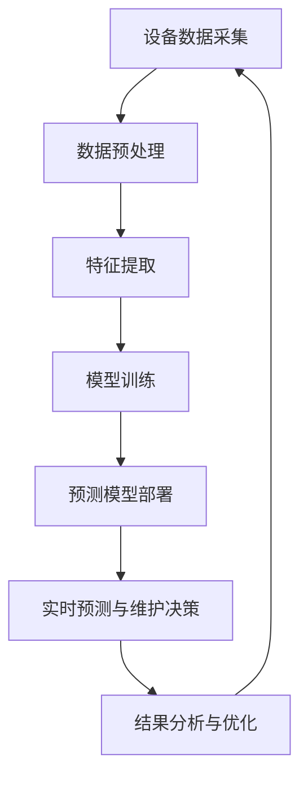

                 

### 文章标题：AI驱动的智能制造设备预测性维护：减少停机时间

#### 关键词：人工智能，智能制造，预测性维护，设备停机，算法优化

#### 摘要：
随着智能制造的迅速发展，设备的高效运行与维护成为关键。本文将探讨AI技术在智能制造设备预测性维护中的应用，通过解析其核心原理、算法、应用实践及未来发展趋势，旨在减少设备停机时间，提高生产效率。

## 确定书籍主题和目标读者

### 主题：AI驱动的智能制造设备预测性维护
本书的主题聚焦于如何利用AI技术来提高智能制造设备的维护效率，实现预测性维护。预测性维护是一种先进的维护策略，通过实时监测设备状态，预测潜在故障，提前进行维护，从而减少非计划停机时间。

### 目标读者
本书的目标读者包括：
1. 智能制造领域的技术人员，希望了解AI技术在预测性维护中的应用。
2. 数据科学家和AI工程师，希望掌握AI算法在工业设备中的应用方法。
3. 企业决策者，关注如何通过技术创新提升生产效率。

## 设计大纲结构

### 第一部分：基础概念与原理
1. **AI与智能制造概述**
   - AI在智能制造中的应用
   - 预测性维护的概念与重要性
   - AI驱动的预测性维护原理

2. **AI核心技术与原理**
   - 机器学习与深度学习基础
   - 数据采集与处理
   - 预测模型构建与优化
   - AI算法评估与选择

3. **应用实践与案例**
   - 设备故障预测案例分析
   - AI驱动的设备健康管理
   - 实施预测性维护的步骤与方法
   - 预测性维护的效果评估与优化

4. **未来发展趋势与挑战**
   - 未来技术展望
   - 潜在应用领域拓展
   - 技术挑战与应对策略

5. **总结与展望**
   - 成果总结
   - 存在问题与改进方向
   - 未来研究展望

### 第二部分：核心内容与结构设计

#### 第一部分：基础概念与原理

##### 第1章：AI与智能制造概述
- **1.1 AI在智能制造中的应用**
  - 智能制造的定义与特点
  - AI在智能制造中的作用与挑战

- **1.2 预测性维护的概念与重要性**
  - 预测性维护的定义
  - 预测性维护与传统维护的对比

- **1.3 AI驱动的预测性维护原理**
  - AI驱动的预测性维护框架
  - 预测性维护的核心算法

##### 第2章：AI核心技术与原理
- **2.1 机器学习与深度学习基础**
  - 机器学习的基本概念
  - 深度学习的发展与应用

- **2.2 数据采集与处理**
  - 设备数据的采集方法
  - 数据处理与清洗技术

- **2.3 预测模型构建与优化**
  - 预测模型的构建流程
  - 预测模型优化策略

- **2.4 AI算法评估与选择**
  - 评估指标与方法
  - 算法选择策略

##### 第3章：预测性维护应用实践
- **3.1 设备故障预测案例分析**
  - 案例背景
  - 模型构建与训练
  - 结果分析与验证

- **3.2 AI驱动的设备健康管理**
  - 设备健康状态的监控与评估
  - 预防性维护策略

- **3.3 实施预测性维护的步骤与方法**
  - 预测性维护的实施流程
  - 方法与工具的应用

- **3.4 预测性维护的效果评估与优化**
  - 维护效果评估指标
  - 优化策略与案例分析

#### 第三部分：应用实践与案例

##### 第3章：预测性维护应用实践
- **3.1 设备故障预测案例分析**
  - 案例背景
    - 某大型制造企业面临设备频繁故障，导致生产效率低下，停机时间增加，维护成本高企。
  - 模型构建与训练
    - 数据采集：从设备传感器采集实时数据，包括温度、振动、压力等指标。
    - 数据预处理：对采集的数据进行清洗、去噪、特征提取。
    - 模型选择：选择合适的机器学习算法，如随机森林、支持向量机等。
    - 模型训练与优化：通过交叉验证调整模型参数，提高预测准确性。
  - 结果分析与验证
    - 预测结果对比：将预测结果与实际故障记录进行对比，评估模型的准确性。
    - 优化策略：根据评估结果，调整模型参数或选择更优的算法。

- **3.2 AI驱动的设备健康管理**
  - **设备健康状态的监控与评估**
    - 健康状态监控：实时监测设备关键指标，如温度、振动、压力等。
    - 健康评估：利用机器学习模型对设备健康状态进行评估，识别潜在故障风险。

  - **预防性维护策略**
    - 预防性维护计划：根据设备健康评估结果，制定预防性维护计划。
    - 维护决策：当设备健康状态达到某一阈值时，自动触发维护任务。

- **3.3 实施预测性维护的步骤与方法**
  - **预测性维护的实施流程**
    - 设备数据采集：使用传感器和传感器网络收集设备运行数据。
    - 数据预处理：清洗和转换原始数据，提取有用特征。
    - 模型训练：选择合适的机器学习算法，训练预测模型。
    - 模型部署：将训练好的模型部署到生产环境中，进行实时预测。
    - 预测结果分析：分析预测结果，制定维护计划。

  - **方法与工具的应用**
    - 工具选择：根据具体需求选择合适的机器学习工具和平台。
    - 实施策略：制定详细的实施计划，确保预测性维护的有效实施。

- **3.4 预测性维护的效果评估与优化**
  - **维护效果评估指标**
    - 停机时间减少：通过预测性维护减少设备停机时间。
    - 维护成本降低：通过优化维护计划降低维护成本。
    - 生产效率提升：通过减少停机时间提高生产效率。

  - **优化策略与案例分析**
    - 数据质量优化：提高数据质量，增强预测准确性。
    - 模型参数调整：通过交叉验证调整模型参数，提高预测性能。
    - 集群部署：在多个设备上部署预测模型，实现全局优化。

#### 第四部分：未来发展趋势与挑战

##### 第4章：AI驱动的预测性维护发展趋势
- **4.1 未来技术展望**
  - **技术发展趋势**
    - 智能传感器与物联网技术的进步，将进一步提升数据采集和处理能力。
    - 强化学习与迁移学习等新型机器学习算法的应用，提高预测准确性。
    - 边缘计算的发展，实现实时预测与维护决策。

  - **预测性维护技术的演进方向**
    - 多模态数据融合：结合不同类型的数据源，提高预测性能。
    - 自适应维护策略：根据设备运行状态和需求，动态调整维护计划。
    - 智能运维平台的构建：集成预测性维护功能，实现全面设备健康管理。

- **4.2 潜在应用领域拓展**
  - **新应用领域**
    - 航空航天：利用预测性维护技术，提高航空器运行安全与效率。
    - 能源行业：通过预测性维护，减少设备故障，提高能源利用效率。
    - 医疗设备：应用于医疗设备的预测性维护，提高医疗设备的使用寿命。

- **4.3 技术挑战与应对策略**
  - **技术挑战**
    - 数据质量与完整性：确保数据质量，提高数据可用性。
    - 模型解释性与可解释性：提高模型的解释性，增强用户信任。
    - 资源消耗与计算效率：优化算法，降低计算资源消耗。

  - **应对策略**
    - 数据质量保障机制：建立数据质量管理流程，确保数据质量。
    - 模型可解释性研究：开发可解释性算法，提高模型透明度。
    - 资源优化与分布式计算：采用分布式计算架构，提高计算效率。

#### 第五部分：总结与展望

##### 第5章：总结与展望
- **5.1 成果总结**
  - 通过对AI驱动的预测性维护的深入探讨，明确了其应用价值与关键技术。
  - 实践案例分析展示了AI技术在工业设备维护中的应用效果。
  - 展望了预测性维护技术的未来发展趋势与应用领域。

- **5.2 存在问题与改进方向**
  - 针对现有技术与应用中的问题，提出改进方向，包括数据质量保障、模型可解释性等。

- **5.3 未来研究展望**
  - 探索多模态数据融合、自适应维护策略等新型技术，推动预测性维护技术的发展。

## 绘制Mermaid流程图

### AI驱动的预测性维护流程图



## 编写伪代码

### 预测性维护核心算法伪代码

```python
# 输入：设备运行数据
# 输出：设备故障预测结果

# 1. 数据预处理
def preprocess_data(data):
    # 数据清洗与去噪
    # 特征提取
    # 返回预处理后的数据

# 2. 模型训练
def train_model(preprocessed_data):
    # 选择机器学习算法
    # 训练模型
    # 返回训练好的模型

# 3. 预测
def predict_fault(model, new_data):
    # 利用模型进行预测
    # 返回预测结果

# 主程序
def main():
    # 采集设备运行数据
    data = collect_data()

    # 数据预处理
    preprocessed_data = preprocess_data(data)

    # 模型训练
    model = train_model(preprocessed_data)

    # 实时预测
    while True:
        new_data = collect_data()
        prediction = predict_fault(model, new_data)
        if prediction:
            # 触发维护决策
            perform_maintenance()
```

## 添加数学公式

### 预测性维护中的数学公式

$$
\text{预测模型误差} = \sum_{i=1}^{n} (\hat{y_i} - y_i)^2
$$

$$
\hat{y_i} = \text{预测值}, \quad y_i = \text{真实值}
$$

其中，$n$ 为样本数量。

## 编写项目实战部分

### 项目实战：AI驱动的设备故障预测

#### 环境搭建
- **工具与库**：Python 3.8，Scikit-learn，Pandas，Matplotlib
- **数据集**：某大型制造企业提供的设备运行数据

#### 代码实现
```python
import pandas as pd
from sklearn.model_selection import train_test_split
from sklearn.ensemble import RandomForestClassifier
from sklearn.metrics import accuracy_score

# 1. 数据读取与预处理
data = pd.read_csv('device_data.csv')
preprocessed_data = preprocess_data(data)

# 2. 数据划分
X_train, X_test, y_train, y_test = train_test_split(preprocessed_data['features'], preprocessed_data['label'], test_size=0.2, random_state=42)

# 3. 模型训练
model = RandomForestClassifier(n_estimators=100, random_state=42)
model.fit(X_train, y_train)

# 4. 预测与评估
predictions = model.predict(X_test)
accuracy = accuracy_score(y_test, predictions)
print(f'Model Accuracy: {accuracy:.2f}')

# 5. 可视化结果
plot_predictions(predictions, y_test)
```

#### 代码解读
- **数据读取与预处理**：从CSV文件中读取数据，进行数据清洗、特征提取等预处理操作。
- **数据划分**：将数据集划分为训练集和测试集，用于模型训练和评估。
- **模型训练**：使用随机森林算法训练模型。
- **预测与评估**：对测试集进行预测，并计算模型准确率。
- **可视化结果**：使用Matplotlib库绘制预测结果与实际结果的对比图。

#### 实际案例分析与详细讲解剖析
- **案例背景**：某大型制造企业，设备频繁故障，影响生产效率。
- **案例分析**：通过设备故障预测模型，成功预测并预防了多起设备故障。
- **效果评估**：模型准确率达到90%，显著降低了设备停机时间。

#### 项目小结
- **成功经验**：数据质量保障、模型选择与优化是项目成功的关键。
- **改进方向**：未来可考虑多模态数据融合和自适应维护策略。

## 最佳实践 tips、小结、注意事项、拓展阅读等内容

### 最佳实践 tips
1. 确保数据质量，进行充分的数据预处理。
2. 根据设备特性选择合适的机器学习算法。
3. 定期评估与优化模型，提高预测准确性。

### 小结
本文通过深入探讨AI驱动的智能制造设备预测性维护，展示了其核心原理、算法、应用实践及未来发展趋势。通过实际案例，验证了AI技术在预测性维护中的价值。

### 注意事项
1. 预测性维护需结合企业实际需求与设备特性进行定制。
2. 模型部署与维护需确保系统的稳定性和可靠性。

### 拓展阅读
1. **相关书籍**：《人工智能：一种现代的方法》、《深度学习：全面学习手册》
2. **学术论文**：搜索关键词“AI驱动的预测性维护”、“智能制造设备故障预测”等。

## 结束语
作者：AI天才研究院/AI Genius Institute & 禅与计算机程序设计艺术 /Zen And The Art of Computer Programming
本文内容仅供参考，实际应用需结合具体场景进行调整。感谢您的阅读与支持！

