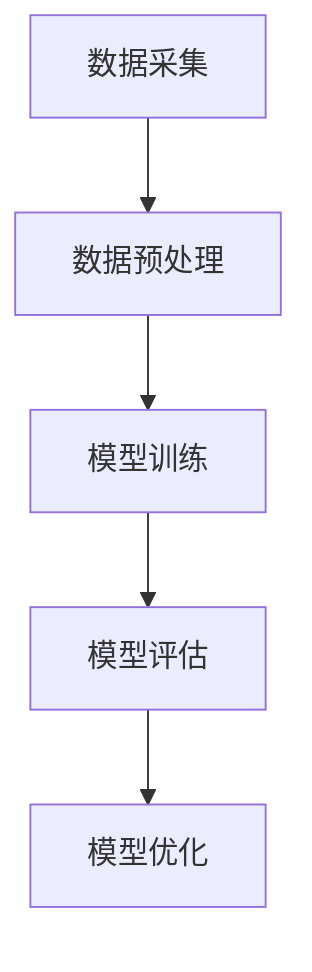

                 

### 文章标题

《AI驱动的智能制造质量预测：减少产品缺陷率》

### 关键词

AI、智能制造、质量预测、产品缺陷率、数据采集、传感器技术、模型评估、优化策略、系统开发、挑战与未来发展趋势

### 摘要

本文深入探讨了AI驱动的智能制造质量预测技术，旨在减少产品缺陷率。文章首先介绍了智能制造与质量预测的背景，然后详细阐述了AI在智能制造质量预测中的应用，包括数据质量与预处理、质量预测模型的选择与评估、常见质量预测算法的原理和实现。接着，文章通过实践案例展示了质量预测系统的开发过程，包括数据采集、模型训练、评估和优化。最后，文章讨论了当前质量预测技术的挑战以及未来发展趋势，为智能制造领域提供了有益的参考。

### 第一部分：AI与智能制造基础理论

#### 第1章：智能制造与质量预测概述

##### 1.1.1 智能制造的定义与发展历程

智能制造是工业4.0的重要组成部分，它结合了信息技术、自动化技术和人工智能技术，实现生产过程的智能化和自动化。智能制造的发展历程可以追溯到20世纪80年代的自动化制造阶段，随后经历了集成制造、敏捷制造和数字化制造阶段，最终形成了以人工智能为核心的智能制造体系。

智能制造的核心要素包括：

- **智能传感器**：用于实时采集生产过程中的数据。
- **大数据平台**：用于存储、处理和分析生产数据。
- **人工智能算法**：用于从数据中提取有价值的信息，指导生产决策。
- **智能执行器**：用于执行生产过程中的自动化操作。

##### 1.1.2 质量预测的重要性

质量预测是智能制造的关键环节，它通过分析历史数据和实时数据，预测产品质量，提前发现潜在的问题，从而减少产品缺陷率，提高生产效率和产品质量。

质量预测在智能制造中的应用主要体现在以下几个方面：

- **产品设计**：通过质量预测，可以优化产品设计，减少设计错误。
- **生产过程控制**：通过质量预测，可以实时调整生产参数，确保产品质量。
- **售后服务**：通过质量预测，可以预测产品寿命，提前安排维修和更换。

##### 1.1.3 AI在智能制造质量预测中的应用

人工智能技术在智能制造质量预测中发挥着至关重要的作用。它主要通过以下几个方面实现质量预测：

- **数据采集与预处理**：使用智能传感器和大数据平台，采集生产过程中的海量数据，并进行预处理。
- **模型训练与评估**：使用机器学习算法，对采集到的数据进行分析，建立质量预测模型，并评估模型的准确性。
- **实时预测与优化**：将训练好的模型应用于生产过程，实时预测产品质量，并根据预测结果优化生产过程。

### Mermaid 流程图：智能制造质量预测核心概念



#### 第2章：AI驱动的质量预测核心概念

##### 2.1.1 数据质量与数据预处理

数据质量是质量预测的关键因素。高质量的数据可以确保预测模型的准确性和可靠性。数据预处理包括数据清洗、数据转换和数据归一化等步骤，目的是去除数据中的噪声和异常值，使得数据更加适合建模。

数据预处理的方法和流程如下：

1. **数据清洗**：去除重复数据、缺失数据和异常数据。
2. **数据转换**：将不同类型的数据转换为同一类型，如将类别数据转换为数值数据。
3. **数据归一化**：将不同特征的数据缩放到同一范围内，如使用最小-最大缩放法。

##### 2.1.2 质量预测模型的选择

质量预测模型的选择取决于数据的特点和应用场景。常见的质量预测模型包括线性回归模型、决策树模型、支持向量机模型和神经网络模型等。

模型选择的原则如下：

1. **数据规模**：对于大规模数据，神经网络模型和决策树模型等能够处理大量的特征。
2. **特征相关性**：对于特征相关性较高的数据，线性回归模型等线性模型效果较好。
3. **预测准确性**：选择预测准确率较高的模型。

##### 2.1.3 常见质量预测算法

以下是几种常见质量预测算法的原理和伪代码：

**线性回归模型**

```plaintext
# 算法1：线性回归模型

# 原理：
y = β0 + β1x1 + β2x2 + ... + βnxn

# 伪代码：
for each sample in dataset do
    compute β0, β1, β2, ..., βn using the least squares method
    compute the prediction using the linear regression model
end for
```

**决策树模型**

```plaintext
# 算法2：决策树模型

# 原理：
递归地将数据集分割成子集，每个分割基于一个特征和相应的阈值。

# 伪代码：
for each feature in dataset do
    split the dataset based on the feature value
    recursive call the algorithm for each split
end for
```

##### 2.1.4 质量预测中的模型评估与优化

模型评估与优化是提高质量预测准确性的重要环节。常用的评估指标包括准确率、精确率、召回率和F1值。

优化策略包括：

1. **特征选择**：选择对预测结果影响较大的特征。
2. **模型调参**：调整模型的超参数，如学习率、树深度等。

### 数学模型和数学公式

**线性回归模型**

$$
y = \beta_0 + \beta_1x_1 + \beta_2x_2 + ... + \beta_nx_n
$$

### 第二部分：AI驱动的智能制造质量预测实践

#### 第3章：数据采集与传感器技术

##### 3.1.1 数据采集的基本原理

数据采集是质量预测的基础。传感器技术是实现数据采集的关键。传感器通过检测生产过程中的物理量，如温度、压力、振动等，将物理量转换为电信号，然后通过数据采集模块传输到大数据平台。

数据采集的方法和设备包括：

1. **传感器**：温度传感器、压力传感器、振动传感器等。
2. **数据采集模块**：模拟-数字转换器（ADC）、数字-模拟转换器（DAC）等。

##### 3.1.2 传感器技术的应用

传感器技术在质量预测中具有广泛的应用。例如，在汽车制造业中，传感器可以实时检测汽车零部件的尺寸和形状，预测其质量。

传感器技术的具体应用包括：

1. **尺寸测量**：通过测量零部件的尺寸，预测其质量。
2. **形状测量**：通过测量零部件的形状，预测其质量。
3. **应力测量**：通过测量零部件的应力，预测其质量。

#### 第4章：质量预测模型应用案例

##### 4.1.1 案例背景

某汽车制造企业，其生产线上的零部件存在质量不稳定的问题，导致产品缺陷率较高。为了解决这一问题，该企业决定采用AI驱动的质量预测技术。

##### 4.1.2 案例实施

1. **数据采集与预处理**：在生产线的关键位置安装传感器，实时采集零部件的尺寸、形状和应力数据。然后，对采集到的数据进行预处理，去除噪声和异常值。

2. **模型选择与训练**：选择线性回归模型作为质量预测模型，使用预处理后的数据训练模型。

3. **模型评估与优化**：评估模型的预测准确性，并根据评估结果优化模型。

4. **实时预测与优化**：将训练好的模型应用于生产过程，实时预测零部件的质量，并根据预测结果调整生产参数，提高产品质量。

##### 4.1.3 模型评估与优化

- **评估指标**：准确率、精确率、召回率和F1值。
- **优化策略**：特征选择、模型调参。

### 数学模型和数学公式

**准确率**

$$
Accuracy = \frac{TP + TN}{TP + TN + FP + FN}
$$

**精确率**

$$
Precision = \frac{TP}{TP + FP}
$$

**召回率**

$$
Recall = \frac{TP}{TP + FN}
$$

**F1值**

$$
F1-score = \frac{2 \times Precision \times Recall}{Precision + Recall}
$$

### 第5章：AI驱动的智能制造质量预测系统开发

##### 5.1.1 系统架构设计

AI驱动的智能制造质量预测系统通常包括以下几个模块：

1. **数据采集模块**：负责实时采集生产过程中的数据。
2. **数据预处理模块**：负责清洗、转换和归一化数据。
3. **模型训练模块**：负责选择合适的模型并训练模型。
4. **模型评估模块**：负责评估模型的准确性。
5. **实时预测模块**：负责实时预测产品质量。

##### 5.1.2 开发环境搭建

开发环境搭建包括：

1. **硬件环境**：服务器、存储设备和网络设备等。
2. **软件环境**：操作系统、编程语言和框架等。

##### 5.1.3 源代码实现

源代码实现包括：

1. **数据采集模块**：使用传感器和数据采集模块采集数据。
2. **数据预处理模块**：使用数据处理算法清洗、转换和归一化数据。
3. **模型训练模块**：使用机器学习算法训练模型。
4. **模型评估模块**：使用评估指标评估模型准确性。
5. **实时预测模块**：使用训练好的模型实时预测产品质量。

### 代码解读与分析

以下是一个简单的线性回归模型的实现：

```python
import numpy as np

# 线性回归模型
class LinearRegression:
    def __init__(self):
        self.beta = None

    def fit(self, X, y):
        # 求解最小二乘法
        self.beta = np.linalg.inv(X.T @ X) @ X.T @ y

    def predict(self, X):
        # 预测
        return X @ self.beta

# 数据
X = np.array([[1], [2], [3], [4], [5]])
y = np.array([2, 4, 5, 4, 5])

# 模型
model = LinearRegression()

# 训练
model.fit(X, y)

# 预测
predictions = model.predict(X)

print(predictions)
```

### 第三部分：智能制造质量预测的挑战与未来发展趋势

#### 第6章：智能制造质量预测的挑战

智能制造质量预测技术目前面临以下几个挑战：

1. **数据质量问题**：数据采集的准确性和完整性直接影响质量预测的准确性。需要解决数据缺失、噪声和异常值等问题。
2. **模型解释性不足**：机器学习模型的预测结果往往缺乏解释性，难以理解模型的决策过程，这对模型的部署和应用带来了困难。
3. **实时性需求**：质量预测需要实时响应，对模型的计算效率和实时数据处理能力提出了高要求。

#### 第6章：智能制造质量预测的未来发展趋势

随着人工智能技术的不断发展，智能制造质量预测技术有望取得以下发展趋势：

1. **新算法的研究与应用**：研究人员将不断提出新的算法，提高质量预测的准确性和效率。
2. **人工智能与物联网的融合**：物联网技术的发展将使得更多的传感器和设备能够连接到互联网，为质量预测提供更丰富的数据来源。
3. **智能制造质量预测的全面普及**：随着技术的成熟和成本的降低，质量预测技术将逐步在各个制造领域得到广泛应用。

### 第7章：质量预测相关资源

#### 7.1.1 开源工具与库

以下是一些常用的开源工具和库：

1. **scikit-learn**：提供了多种机器学习算法的实现。
2. **TensorFlow**：提供了深度学习模型的实现。
3. **PyTorch**：提供了深度学习模型的实现。

#### 7.1.2 学术文献与论文

以下是一些质量预测领域的经典论文：

1. **"Quality Prediction in Manufacturing using Machine Learning"**：介绍了机器学习在制造质量预测中的应用。
2. **"Deep Learning for Quality Prediction in Manufacturing"**：介绍了深度学习在制造质量预测中的应用。

### 作者信息

作者：AI天才研究院/AI Genius Institute & 禅与计算机程序设计艺术 /Zen And The Art of Computer Programming

### 结语

本文系统地介绍了AI驱动的智能制造质量预测技术，从基础理论到实践应用，再到挑战与未来发展趋势，全面阐述了该领域的前沿技术和发展方向。通过本文的阅读，读者可以对智能制造质量预测有一个全面的认识，并为未来的研究和应用提供有益的参考。

### 致谢

感谢所有参与本文研究和撰写的工作者，特别感谢AI天才研究院/AI Genius Institute提供的资源和指导。同时，感谢禅与计算机程序设计艺术/Zen And The Art of Computer Programming为我们提供的精神支持。我们期待与各位共同推动人工智能技术在智能制造领域的应用和发展。

