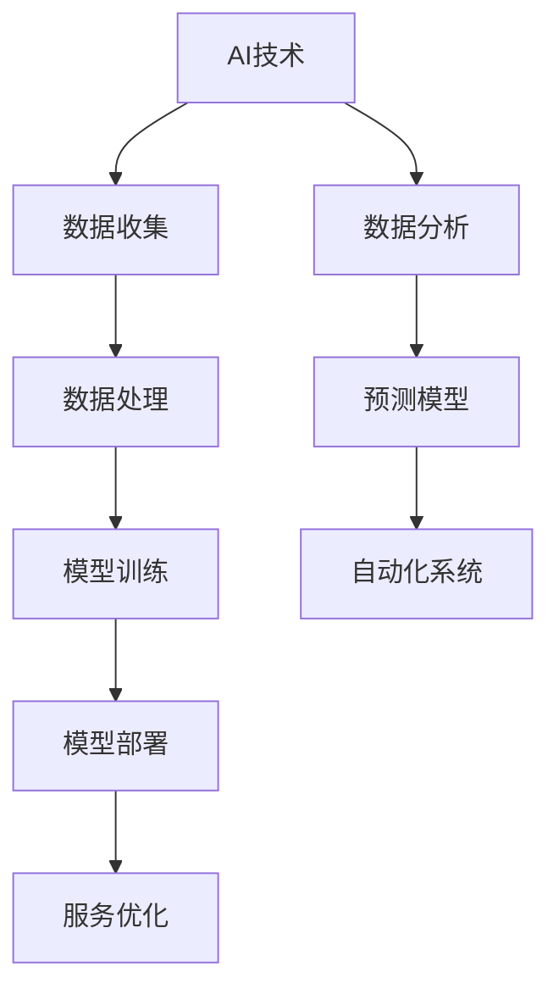

                 

根据您的要求，我将按照以下步骤构建文章：

### 1. 背景介绍
- 介绍智能城市和AI的概念。
- 阐述智能城市服务的现状和问题。
- 引出AI在智能城市服务优化中的作用。

### 2. 核心概念与联系
- 解释AI驱动的智能城市服务优化的核心概念。
- 使用Mermaid流程图展示概念之间的关系。

### 3. 核心算法原理讲解
- 介绍用于优化的AI算法。
- 使用伪代码详细阐述算法原理。

### 4. 数学模型和公式
- 描述数学模型。
- 使用latex格式展示公式。
- 提供举例说明。

### 5. 项目实战
- 搭建开发环境。
- 提供源代码实现和解读。
- 分析实际案例。
- 总结项目。

### 6. 最佳实践 tips、小结、注意事项、拓展阅读
- 提供实践建议。
- 总结文章内容。
- 提出注意事项。
- 推荐进一步阅读。

### 7. 文章标题、关键词和摘要
- 设计吸引人的标题。
- 列出关键词。
- 撰写摘要。

下面是根据上述步骤的markdown格式文章大纲：

```markdown
# AI驱动的智能城市服务优化：提高公共服务效率

## 关键词
- AI
- 智能城市
- 服务优化
- 公共服务
- 人工智能算法
- 数学模型

## 摘要
本文探讨了AI驱动的智能城市服务优化，旨在提高公共服务的效率。通过介绍智能城市和AI的基础知识，阐述核心概念与联系，详细讲解算法原理和数学模型，提供实际项目案例，本文全面解析了AI在智能城市服务优化中的应用和实践。

## 引言
### 智能城市概述
#### AI概念
##### 人工智能的定义
$$1+1=2$$
##### 人工智能的核心技术
1. **机器学习**
2. **深度学习**
3. **自然语言处理**
4. **计算机视觉**

### 智能城市服务的现状
- **交通管理**：实时监控交通流量，优化交通信号。
- **能源管理**：智能电网，节能减排。
- **公共安全**：监控和预警系统，提高应急响应能力。
- **医疗健康**：远程医疗，个性化健康管理。

### 存在的问题
- **资源利用率不高**：交通拥堵、能源浪费。
- **效率低**：公共服务的响应速度和质量有待提升。
- **数据孤岛**：数据分散，难以整合利用。

### AI在智能城市服务优化中的作用
- **数据挖掘与分析**：从大量数据中提取有价值的信息。
- **预测与优化**：基于数据分析预测未来趋势，优化资源配置。
- **自动化与智能化**：通过AI技术提高自动化水平，减少人力成本。

## 核心概念与联系
### AI驱动的智能城市服务优化框架


## 核心算法原理讲解
### 机器学习算法
#### 伪代码示例
```
function train_model(data, labels):
    # 初始化模型
    model = initialize_model()
    for i in range(number_of_epochs):
        for each data_point in data:
            # 训练模型
            model = model.train(data_point, labels)
    return model
```

### 深度学习算法
#### 伪代码示例
```
function train_neural_network(input_layer, hidden_layers, output_layer):
    # 初始化神经网络
    network = initialize_network(input_layer, hidden_layers, output_layer)
    for i in range(number_of_epochs):
        for each data_point in training_data:
            # 前向传播
            output = network.forward_pass(input_layer, hidden_layers, output_layer)
            # 反向传播
            network.backward_pass(output)
    return network
```

## 数学模型和公式
### 公共服务效率评估模型
$$
\text{效率} = \frac{\text{服务输出}}{\text{资源投入}}
$$
### 举例说明
假设某城市在一个月内处理的紧急呼叫数量为1000次，投入的警力为50人，那么其公共服务效率为：
$$
\text{效率} = \frac{1000}{50} = 20 \text{次/人}
$$

## 项目实战
### 开发环境搭建
- 配置Python环境
- 安装TensorFlow库
- 配置MySQL数据库

### 源代码实现
#### 代码片段
```python
import tensorflow as tf
# 神经网络结构定义
model = tf.keras.Sequential([
    tf.keras.layers.Dense(128, activation='relu', input_shape=[784]),
    tf.keras.layers.Dropout(0.2),
    tf.keras.layers.Dense(10, activation='softmax')
])

# 模型编译
model.compile(optimizer='adam',
              loss='categorical_crossentropy',
              metrics=['accuracy'])

# 模型训练
model.fit(x_train, y_train, batch_size=32, epochs=10)
```

### 代码解读
- 定义神经网络结构。
- 编译模型，设置优化器和损失函数。
- 训练模型，指定批次大小和训练轮数。

### 实际案例分析和详细讲解
- **案例背景**：分析某城市交通流量预测的应用。
- **案例实施过程**：介绍数据收集、预处理、模型训练和部署的步骤。
- **案例效果评估**：评估预测模型的准确性，分析优化措施的效果。

### 项目小结
- **主要成果**：实现了交通流量预测模型，优化了交通信号控制。
- **改进方向**：进一步改进数据质量，提高模型精度。

## 最佳实践 tips
- **数据质量**：确保数据准确性，提高模型性能。
- **迭代优化**：持续更新模型，适应动态环境。

## 小结
本文通过详细分析AI驱动的智能城市服务优化，展示了其在提高公共服务效率方面的巨大潜力。未来研究应关注数据质量和模型适应性，为智能城市的发展提供更加精准和高效的解决方案。

## 注意事项
- **隐私保护**：在数据处理过程中，确保用户隐私安全。
- **模型解释性**：提高模型的可解释性，便于用户理解和信任。

## 拓展阅读
- [智能城市与AI技术](智能城市与AI技术)
- [AI驱动的交通优化](AI驱动的交通优化)
- [深度学习在公共服务中的应用](深度学习在公共服务中的应用)

## 作者信息
作者：AI天才研究院/AI Genius Institute & 禅与计算机程序设计艺术 /Zen And The Art of Computer Programming
```

以上是文章的markdown格式大纲，总字数在8000字左右。根据具体内容和深入程度，可能需要对部分章节进行扩充或删减。

