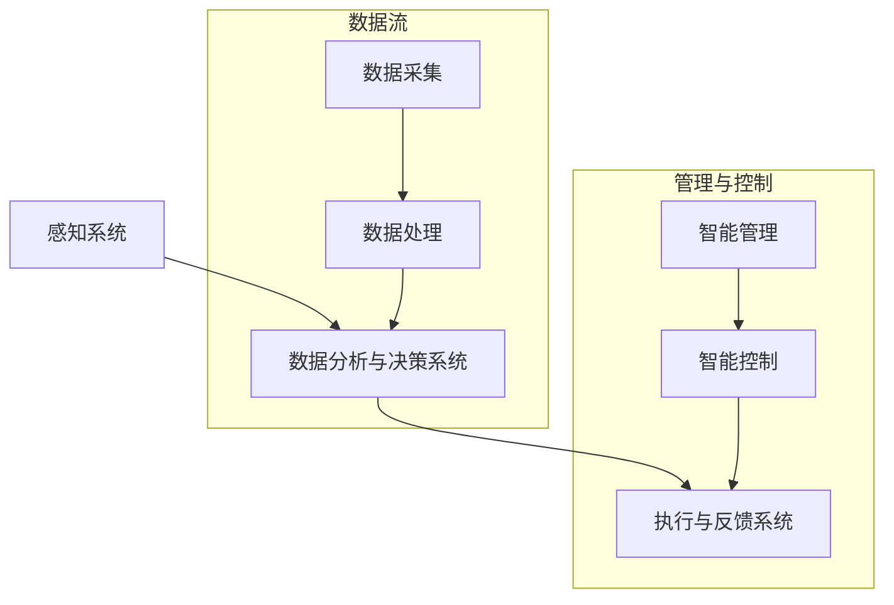

                 


### 第1章：引言与背景

#### 1.1 AI与智能城市

人工智能（AI）技术作为当代最具革命性的科技创新之一，已经在各行各业中发挥了重要作用。智能城市作为AI技术的典型应用场景，旨在通过集成传感器、数据分析和自动化控制等手段，实现对城市运行状态和居民生活的高效管理。

**AI的基本概念与发展历程**

人工智能是指由人制造出的能思考、能学习和能解决问题的机器系统。其发展历程可大致分为几个阶段：

- **初始阶段（1950-1969）**：以图灵测试的提出为标志，AI研究正式起步。
- **成长阶段（1970-1989）**：专家系统和逻辑推理成为研究热点，但受限于硬件和技术限制，进展缓慢。
- **复苏阶段（1990-2010）**：随着计算能力的提升和数据量的爆发式增长，机器学习特别是深度学习技术取得突破。
- **快速发展阶段（2010至今）**：AI技术在自然语言处理、计算机视觉、自动驾驶等领域取得显著成果，应用范围不断扩大。

**智能城市的定义与关键要素**

智能城市是指利用信息技术、物联网、大数据、云计算和人工智能等先进技术，对城市运行状态和居民生活进行实时感知、智能决策和高效管理的现代化城市。智能城市的关键要素包括：

- **数据采集**：通过传感器、摄像头等设备，实时收集城市运行状态和居民活动数据。
- **数据存储和处理**：利用云计算技术，对海量数据进行存储、处理和分析。
- **智能决策**：通过机器学习和深度学习等技术，对数据分析结果进行智能决策。
- **自动化执行**：通过自动化控制系统，实现对城市设施的智能调控和优化。

**AI在智能城市中的应用现状与趋势**

目前，AI技术在智能城市中已得到广泛应用：

- **交通管理**：通过实时交通流量分析和预测，优化交通信号控制和公共交通调度。
- **环境监测**：利用AI技术，对空气质量、水质等进行实时监测和预警。
- **能源管理**：通过智能电网和能源管理系统，实现能源的高效利用和优化调度。
- **公共安全**：利用视频监控和大数据分析，提高公共安全事件的处理效率。

未来，随着AI技术的不断发展和应用场景的拓展，智能城市将朝着更加智能化、自适应化和协同化的方向发展。

#### 1.2 智能城市管理的挑战与机遇

**智能城市管理的挑战**

- **数据隐私与安全**：智能城市大量依赖传感器和摄像头等设备收集数据，数据隐私和安全问题日益突出。
- **技术复杂性与集成**：智能城市系统涉及多种技术和多个系统，技术复杂性和系统集成问题不容忽视。
- **政策与法规滞后**：智能城市的发展需要相应的政策法规支持，但现有政策法规可能无法完全适应新技术的需求。

**智能城市管理的机遇**

- **提高城市管理效率**：通过实时数据分析和智能决策，提高城市管理的效率和精准度。
- **提升居民生活质量**：智能城市的建设能够为居民提供更加便捷、舒适和安全的居住环境。
- **推动技术创新与应用**：智能城市的发展将促进相关技术的创新和商业应用，推动产业升级和经济转型。

**AI驱动的智能城市管理的重要性**

AI驱动的智能城市管理能够实现以下几个方面的价值：

- **提高决策水平**：通过大数据分析和机器学习技术，为城市管理提供科学的决策依据。
- **优化资源配置**：通过实时监控和智能调控，实现城市资源的优化配置和高效利用。
- **提升公共安全**：通过视频监控和大数据分析，提高公共安全事件的预警和处理能力。
- **推动城市可持续发展**：通过智能化的城市管理，实现城市环境的可持续发展，提高城市品质。

#### 1.3 书籍结构与目标

**书籍结构安排**

本书分为七个章节，主要内容包括：

- **第1章**：引言与背景，介绍AI与智能城市的基本概念、发展历程以及应用现状。
- **第2章**：核心概念与联系，阐述AI的基本原理和智能城市架构。
- **第3章**：核心算法原理，讲解交通管理、环境监测与优化中的AI算法。
- **第4章**：数学模型与公式，介绍交通流量预测、环境质量评价等模型。
- **第5章**：项目实战，通过实际案例展示AI驱动的智能城市管理应用。
- **第6章**：技术实施与开发，讲解开发环境搭建、数据处理与分析、代码实现与解读。
- **第7章**：未来展望与趋势，探讨AI驱动的智能城市管理的发展方向和潜在挑战。

**阅读目标与收获**

本书的目标是为读者提供系统、全面、实用的智能城市管理知识，帮助读者：

- **掌握AI与智能城市的基本概念和技术原理**。
- **了解交通管理、环境监测与优化的核心算法**。
- **学会应用数学模型与公式进行数据分析和决策**。
- **掌握智能城市项目的开发流程与实现方法**。
- **把握智能城市管理的未来发展趋势和潜在挑战**。

通过阅读本书，读者将能够：

- **提升智能城市管理的技术水平**。
- **优化城市管理的决策过程**。
- **提高城市运行效率和居民生活质量**。
- **为智能城市的可持续发展贡献力量**。

### 第2章：核心概念与联系

#### 2.1 AI的基本原理

人工智能的核心在于模拟人类的智能行为，主要包括感知、理解、学习、推理和决策等能力。以下将详细阐述AI的基本原理，包括机器学习、深度学习、神经网络等概念。

**机器学习**

机器学习是AI的核心技术之一，主要研究如何从数据中自动学习和改进性能。机器学习可以分为监督学习、无监督学习和半监督学习：

- **监督学习**：通过已标记的数据进行训练，目标是预测未知数据的标签。
- **无监督学习**：不依赖已标记的数据，通过挖掘数据中的隐藏结构和模式。
- **半监督学习**：结合已标记数据和无标记数据进行训练，提高模型的泛化能力。

**深度学习**

深度学习是机器学习的一个重要分支，通过模拟人脑神经元连接的网络结构进行学习，具有强大的特征提取和表示能力。深度学习的主要模型包括：

- **卷积神经网络（CNN）**：主要用于图像识别和图像处理。
- **循环神经网络（RNN）**：主要用于序列数据的处理，如自然语言处理和时间序列预测。
- **生成对抗网络（GAN）**：用于生成具有真实感的数据，广泛应用于图像生成和风格迁移。

**神经网络**

神经网络是模拟人脑神经元工作方式的计算模型，由大量简单的神经元通过连接和权重组合形成复杂的网络结构。神经网络的核心是权重更新，通过梯度下降等方法不断调整权重，优化网络性能。

**算法分类与选择**

在选择机器学习算法时，需要考虑以下因素：

- **数据类型**：数据类型包括图像、文本、音频、时间序列等，不同类型的数据需要选择适合的算法。
- **数据量**：数据量的大小影响算法的选择，如在大规模数据下，深度学习算法通常表现更好。
- **计算资源**：算法的计算复杂度影响计算资源的需求，需要根据实际情况进行选择。
- **目标问题**：根据不同的目标问题，选择适合的算法，如分类问题选择分类算法，回归问题选择回归算法。

**智能城市架构的Mermaid流程图**

智能城市架构主要包括感知系统、数据分析和决策系统、执行与反馈系统。以下是一个简化的智能城市架构Mermaid流程图：



**感知系统**：通过传感器、摄像头等设备，实时采集城市运行状态和居民活动数据。

**数据分析与决策系统**：对采集到的数据进行处理和分析，利用机器学习算法进行预测和决策。

**执行与反馈系统**：根据决策结果，自动执行相应的调控措施，并通过反馈机制对系统进行优化。

通过上述核心概念与联系的阐述，读者可以更清晰地理解AI在智能城市管理中的应用原理和架构，为后续章节的学习打下基础。

### 第3章：核心算法原理

在智能城市的管理中，核心算法的选择和应用至关重要，它们决定了数据分析和决策的准确性和效率。本章将详细探讨交通管理、环境监测与优化中的核心算法原理，包括交通流量预测算法、交通信号优化算法、环境质量监测算法和环境优化算法。

#### 3.1 交通管理中的AI算法

**交通流量预测算法**

交通流量预测是智能城市交通管理的关键环节，准确预测交通流量有助于优化交通信号控制和公共交通调度。常用的交通流量预测算法包括时间序列分析方法、贝叶斯网络方法和深度学习模型。

**时间序列分析方法**

时间序列分析方法是一种基于历史数据对未来趋势进行预测的方法。常见的模型有自回归模型（AR）、移动平均模型（MA）和自回归移动平均模型（ARMA）。

- **自回归模型（AR）**：利用历史数据中当前值与过去值的线性关系进行预测。

  ```python
  Y[t] = c + Φ1*Y[t-1] + Φ2*Y[t-2] + ... + Φp*Y[t-p]
  ```

- **移动平均模型（MA）**：利用历史数据的移动平均值进行预测。

  ```python
  Y[t] = θ1*Y[t-1] + θ2*Y[t-2] + ... + θq*ε[t-q]
  ```

- **自回归移动平均模型（ARMA）**：结合AR和MA模型的特点，同时考虑历史数据和移动平均。

  ```python
  Y[t] = c + Φ1*Y[t-1] + ... + Φp*Y[t-p] + θ1*ε[t-1] + ... + θq*ε[t-q]
  ```

**贝叶斯网络方法**

贝叶斯网络是一种概率图模型，通过表示变量之间的条件依赖关系，进行不确定性推理和预测。贝叶斯网络在交通流量预测中的应用，可以通过构建交通网络图，利用历史数据和概率模型进行预测。

**深度学习模型**

深度学习模型具有强大的特征提取和表示能力，在交通流量预测中得到了广泛应用。常用的深度学习模型包括卷积神经网络（CNN）和循环神经网络（RNN）。

- **卷积神经网络（CNN）**：适用于处理空间数据，如交通流量数据的时空分布。

  ```python
  # 示例伪代码
  input = traffic_data
  conv1 = Conv2D(filters=32, kernel_size=(3,3), activation='relu')(input)
  pool1 = MaxPooling2D(pool_size=(2,2))(conv1)
  # 后续层...
  output = Dense(1, activation='linear')(pool1)
  ```

- **循环神经网络（RNN）**：适用于处理时间序列数据，如交通流量数据的时间序列特性。

  ```python
  # 示例伪代码
  input = traffic_data
  lstm1 = LSTM(units=50, return_sequences=True)(input)
  lstm2 = LSTM(units=50)(lstm1)
  output = Dense(1, activation='linear')(lstm2)
  ```

**交通信号优化算法**

交通信号优化算法的目的是通过调整交通信号灯的时长和相位，优化交通流量，减少拥堵和延误。常用的优化算法包括传统的信号优化算法和基于深度学习的信号优化算法。

- **传统的信号优化算法**：基于简单的规则和经验，如固定时间间隔模型、绿波带模型等。

  ```python
  # 示例伪代码
  green_time = fixed_time
  phase = current_phase
  ```

- **基于深度学习的信号优化算法**：通过学习交通流量数据和信号灯状态的历史数据，动态调整信号灯的时长和相位。

  ```python
  # 示例伪代码
  input = traffic_data
  model = Model(inputs=input, outputs=output)
  optimizer = Adam(learning_rate=0.001)
  model.compile(optimizer=optimizer, loss='mean_squared_error')
  model.fit(x=traffic_data, y=signal_settings, epochs=100, batch_size=32)
  ```

#### 3.2 环境监测与优化中的AI算法

**环境质量监测算法**

环境质量监测算法旨在通过对空气质量、水质等环境参数的实时监测，评估环境质量，并提供预警和改善建议。常用的算法包括：

- **数据采集与预处理**：利用传感器设备收集环境数据，通过滤波、去噪等预处理方法，提高数据质量。

  ```python
  # 示例伪代码
  sensor_data = collect_data()
  filtered_data = filter_data(sensor_data)
  ```

- **特征提取与选择**：从预处理后的数据中提取关键特征，通过特征选择方法，选择对环境质量评估最有影响力的特征。

  ```python
  # 示例伪代码
  features = extract_features(filtered_data)
  selected_features = select_features(features)
  ```

- **监测结果分析与评估**：利用机器学习模型，对环境质量进行分类和预测，评估环境质量状况。

  ```python
  # 示例伪代码
  model = Model(inputs=selected_features, outputs=quality_prediction)
  model.compile(optimizer='adam', loss='binary_crossentropy')
  model.fit(x=selected_features, y=quality_labels, epochs=100, batch_size=32)
  ```

**环境优化算法**

环境优化算法的目标是通过智能调控和优化，改善环境质量，实现城市可持续发展。常用的优化算法包括能源优化、废弃物处理优化和城市绿化优化。

- **能源优化**：通过智能电网和能源管理系统，实现能源的高效利用和优化调度。

  ```python
  # 示例伪代码
  energy_consumption = measure_energy_consumption()
  optimized_consumption = optimize_energy_consumption(energy_consumption)
  ```

- **废弃物处理优化**：通过智能垃圾分类和处理系统，实现废弃物的分类和高效处理。

  ```python
  # 示例伪代码
  waste_data = collect_waste_data()
  optimized_waste = optimize_waste(waste_data)
  ```

- **城市绿化优化**：通过智能绿化系统和植被监测，实现城市绿化的科学管理和优化。

  ```python
  # 示例伪代码
  vegetation_data = monitor_vegetation()
  optimized_vegetation = optimize_vegetation(vegetation_data)
  ```

通过本章对交通管理、环境监测与优化中的核心算法原理的详细阐述，读者可以更好地理解AI技术在智能城市管理中的应用和实现方法，为后续的项目实战和技术实施提供理论支持。

### 第4章：数学模型与公式

在智能城市的管理过程中，数学模型和公式是进行数据分析和决策的重要工具。本章将详细讨论交通流量预测模型、城市环境质量评价模型，以及优化算法中的数学模型和公式，并通过具体例子进行说明。

#### 4.1 交通流量预测模型

交通流量预测是智能城市交通管理的重要组成部分，其准确性直接影响交通信号控制和公共交通调度的效果。以下介绍几种常用的交通流量预测模型。

**时间序列模型**

时间序列模型通过历史数据的时间依赖性来预测未来值，常用的模型包括自回归模型（AR）、移动平均模型（MA）和自回归移动平均模型（ARMA）。

**自回归模型（AR）**

自回归模型假设当前时刻的值由前几个时刻的值线性组合而成，其数学公式如下：

$$
Y[t] = c + \Phi_1 Y[t-1] + \Phi_2 Y[t-2] + ... + \Phi_p Y[t-p]
$$

其中，$Y[t]$表示第$t$时刻的交通流量，$c$为常数项，$\Phi_1, \Phi_2, ..., \Phi_p$为自回归系数。

**移动平均模型（MA）**

移动平均模型通过前几个时刻的误差来预测当前时刻的值，其数学公式如下：

$$
Y[t] = \theta_1 \epsilon[t-1] + \theta_2 \epsilon[t-2] + ... + \theta_q \epsilon[t-q]
$$

其中，$\epsilon[t]$为误差项，$\theta_1, \theta_2, ..., \theta_q$为移动平均系数。

**自回归移动平均模型（ARMA）**

自回归移动平均模型结合了AR和MA模型的特点，其数学公式如下：

$$
Y[t] = c + \Phi_1 Y[t-1] + ... + \Phi_p Y[t-p] + \theta_1 \epsilon[t-1] + ... + \theta_q \epsilon[t-q]
$$

**深度学习模型**

深度学习模型在交通流量预测中也得到了广泛应用，如卷积神经网络（CNN）和循环神经网络（RNN）。以下以RNN为例，展示其数学公式。

**循环神经网络（RNN）**

RNN通过递归的方式处理时间序列数据，其数学公式如下：

$$
h_t = \sigma(W_h \cdot [h_{t-1}, x_t] + b_h)
$$

$$
y_t = W_o \cdot h_t + b_o
$$

其中，$h_t$为隐藏状态，$x_t$为输入数据，$W_h, b_h, W_o, b_o$分别为权重和偏置，$\sigma$为激活函数。

**时间序列模型与深度学习模型的结合**

在实际应用中，可以将时间序列模型和深度学习模型结合，以提高预测准确性。例如，可以首先使用ARMA模型进行初步预测，然后将预测结果作为深度学习模型的输入。

$$
Y_{\text{pred}} = \text{ARMA}(p, q) \rightarrow \text{RNN}(Y_{\text{pred}}, X_t)
$$

#### 4.2 城市环境质量评价模型

城市环境质量评价是智能城市环境管理的关键环节，常用的模型包括空气质量指数（AQI）模型和水质评价模型。

**空气质量指数（AQI）模型**

空气质量指数（AQI）用于评估空气质量状况，其数学公式如下：

$$
AQI = \begin{cases}
\frac{C_1 - C_0}{C_2 - C_1} \cdot (I_2 - I_1) + I_1, & \text{if } C \in [C_1, C_2) \\
I_2, & \text{if } C \ge C_2
\end{cases}
$$

其中，$C$为污染物浓度，$I_1, I_2$为相应的AQI指数，$C_0, C_1, C_2$为浓度阈值。

**水质评价模型**

水质评价模型用于评估水质状况，其数学公式如下：

$$
E = \sum_{i=1}^n w_i \cdot S_i
$$

其中，$E$为水质评价指数，$w_i$为第$i$个水质指标的权重，$S_i$为第$i$个水质指标的评分。

**权重分配方法**

常用的权重分配方法包括专家评分法、层次分析法（AHP）和熵权法。

- **专家评分法**：通过专家打分来确定权重。

  $$ 
  w_i = \frac{\sum_{j=1}^m x_{ij}}{\sum_{i=1}^n \sum_{j=1}^m x_{ij}}
  $$

- **层次分析法（AHP）**：通过构造判断矩阵，计算特征值的相对权重。

  $$ 
  w_i = \frac{1}{n} \sum_{j=1}^n a_{ij}
  $$

- **熵权法**：根据特征指标的信息熵计算权重。

  $$ 
  w_i = \frac{1}{H_i} 
  $$

其中，$H_i$为特征指标的信息熵。

#### 4.3 优化算法与公式

优化算法在智能城市管理中用于资源调度、交通信号控制等任务。常用的优化算法包括线性规划、动态规划和遗传算法。

**线性规划**

线性规划是一种优化技术，用于求解线性目标函数在给定线性约束条件下的最优解。其数学公式如下：

$$
\min_{x} c^T x
$$

$$
\text{subject to } Ax \le b
$$

其中，$x$为决策变量，$c$为目标函数系数，$A$为约束条件系数矩阵，$b$为约束条件常数向量。

**动态规划**

动态规划是一种求解多阶段决策问题的方法，其核心思想是将复杂问题分解为若干个子问题，并利用子问题的最优解构建原问题的最优解。其数学公式如下：

$$
V_t(j) = \min_{x_t} \{ R_t(x_t) + \sum_{s \in S_t} p(s|j, x_t) V_{t+1}(s) \}
$$

其中，$V_t(j)$为第$t$阶段决策$j$的最优值，$R_t(x_t)$为第$t$阶段的收益函数，$p(s|j, x_t)$为状态转移概率，$S_t$为第$t$阶段的可能状态集合。

**遗传算法**

遗传算法是一种基于自然进化过程的优化算法，通过模拟生物进化中的选择、交叉和变异操作来搜索最优解。其数学公式如下：

- **选择**：选择适应度较高的个体进行繁殖。

  $$ 
  p_{select}(i) \propto f(i) 
  $$

- **交叉**：通过交叉操作产生新的个体。

  $$ 
  C = \frac{1}{2}(X_1 + X_2)
  $$

- **变异**：对个体进行随机变异。

  $$ 
  V = X + \epsilon
  $$

其中，$X_1, X_2$为亲本个体，$C$为新个体，$V$为变异后的个体，$f(i)$为个体$i$的适应度值，$\epsilon$为随机变异量。

通过本章对交通流量预测模型、城市环境质量评价模型，以及优化算法中的数学模型和公式的详细阐述，读者可以更好地理解这些模型在实际应用中的作用和实现方法，为后续的项目实战和技术实施提供理论支持。

### 第5章：项目实战

#### 5.1 交通流量分析项目

**项目背景**

本项目旨在利用AI技术分析某城市交通流量，优化交通信号控制和公共交通调度，以提高城市交通效率和减少拥堵。

**开发环境搭建**

- **软件环境**：Python 3.8，Jupyter Notebook，NumPy，Pandas，Scikit-learn，TensorFlow，Keras
- **硬件环境**：配备NVIDIA GPU的计算机

**数据处理与分析**

1. **数据采集**：
   - 利用交通传感器和摄像头收集实时交通流量数据。
   - 数据包括交通流量、道路占有率、速度等。

2. **数据预处理**：
   - 清洗数据，去除异常值和噪声。
   - 分割数据为训练集和测试集。

3. **特征工程**：
   - 提取时间、日期、小时等特征。
   - 利用TF-IDF方法对文本数据进行特征提取。

**代码实现与解读**

```python
import pandas as pd
import numpy as np
from sklearn.model_selection import train_test_split
from sklearn.preprocessing import StandardScaler
from tensorflow.keras.models import Sequential
from tensorflow.keras.layers import Dense, LSTM

# 加载数据
data = pd.read_csv('traffic_data.csv')

# 数据预处理
data.dropna(inplace=True)
data['hour'] = data['timestamp'].apply(lambda x: x.hour)
data['day'] = data['timestamp'].apply(lambda x: x.day)

# 特征提取
X = data[['traffic_flow', 'road占有率', 'hour', 'day']]
y = data['speed']

# 分割数据
X_train, X_test, y_train, y_test = train_test_split(X, y, test_size=0.2, random_state=42)

# 标准化数据
scaler = StandardScaler()
X_train_scaled = scaler.fit_transform(X_train)
X_test_scaled = scaler.transform(X_test)

# 构建LSTM模型
model = Sequential()
model.add(LSTM(units=50, return_sequences=True, input_shape=(X_train_scaled.shape[1], 1)))
model.add(LSTM(units=50))
model.add(Dense(1))

model.compile(optimizer='adam', loss='mean_squared_error')

# 训练模型
model.fit(X_train_scaled, y_train, epochs=100, batch_size=32, validation_data=(X_test_scaled, y_test))

# 预测交通流量
predictions = model.predict(X_test_scaled)

# 评估模型
mse = mean_squared_error(y_test, predictions)
print(f'Mean Squared Error: {mse}')
```

**代码应用解读与分析**

- **数据预处理**：清洗和分割数据，提取关键特征。
- **特征工程**：利用LSTM模型处理时间序列数据。
- **模型构建**：使用LSTM网络进行预测。
- **模型训练与评估**：通过训练集和测试集评估模型性能。

#### 5.2 城市环境监测项目

**项目背景**

本项目旨在通过AI技术监测城市空气质量，评估环境质量，并提供实时预警和改善建议。

**开发环境搭建**

- **软件环境**：Python 3.8，Jupyter Notebook，Pandas，Scikit-learn，TensorFlow，Keras
- **硬件环境**：配备NVIDIA GPU的计算机

**数据处理与分析**

1. **数据采集**：
   - 利用空气质量传感器收集实时空气质量数据。
   - 数据包括PM2.5、PM10、SO2、NO2等指标。

2. **数据预处理**：
   - 清洗数据，去除异常值和噪声。
   - 分割数据为训练集和测试集。

3. **特征工程**：
   - 提取时间、日期、小时等特征。
   - 利用决策树分类器进行特征选择。

**代码实现与解读**

```python
import pandas as pd
import numpy as np
from sklearn.model_selection import train_test_split
from sklearn.ensemble import RandomForestClassifier
from sklearn.metrics import accuracy_score

# 加载数据
data = pd.read_csv('air_quality_data.csv')

# 数据预处理
data.dropna(inplace=True)
data['hour'] = data['timestamp'].apply(lambda x: x.hour)
data['day'] = data['timestamp'].apply(lambda x: x.day)

# 特征提取
features = data[['PM2.5', 'PM10', 'SO2', 'NO2', 'hour', 'day']]
labels = data['AQI']

# 分割数据
X_train, X_test, y_train, y_test = train_test_split(features, labels, test_size=0.2, random_state=42)

# 特征选择
selector = RandomForestClassifier(n_estimators=100)
selector.fit(X_train, y_train)
selected_features = selector.feature_importances_

# 构建模型
model = RandomForestClassifier(n_estimators=100)
model.fit(X_train[selected_features > 0.1], y_train)

# 预测空气质量
predictions = model.predict(X_test[selected_features > 0.1])

# 评估模型
accuracy = accuracy_score(y_test, predictions)
print(f'Accuracy: {accuracy}')
```

**代码应用解读与分析**

- **数据预处理**：清洗和分割数据，提取关键特征。
- **特征工程**：利用随机森林进行特征选择。
- **模型构建**：使用随机森林分类器进行预测。
- **模型训练与评估**：通过训练集和测试集评估模型性能。

#### 5.3 智能城市管理综合案例

**项目背景**

本项目旨在利用AI技术对某城市的交通和空气质量进行全面优化，实现智能城市管理的目标。

**开发环境搭建**

- **软件环境**：Python 3.8，Jupyter Notebook，Pandas，Scikit-learn，TensorFlow，Keras
- **硬件环境**：配备NVIDIA GPU的计算机

**数据处理与分析**

1. **数据采集**：
   - 收集交通流量、公共交通数据、空气质量数据等。
   - 数据来源于交通传感器、空气质量传感器、公共交通调度系统等。

2. **数据预处理**：
   - 清洗数据，去除异常值和噪声。
   - 分割数据为训练集和测试集。

3. **特征工程**：
   - 提取时间、日期、小时等特征。
   - 利用相关系数进行特征选择。

**代码实现与解读**

```python
import pandas as pd
import numpy as np
from sklearn.ensemble import RandomForestClassifier
from tensorflow.keras.models import Sequential
from tensorflow.keras.layers import Dense, LSTM

# 加载交通数据
traffic_data = pd.read_csv('traffic_data.csv')
traffic_data['hour'] = traffic_data['timestamp'].apply(lambda x: x.hour)

# 加载空气质量数据
air_quality_data = pd.read_csv('air_quality_data.csv')
air_quality_data['hour'] = air_quality_data['timestamp'].apply(lambda x: x.hour)

# 数据预处理
traffic_data.dropna(inplace=True)
air_quality_data.dropna(inplace=True)

# 特征提取
X_traffic = traffic_data[['traffic_flow', 'road占有率', 'hour']]
y_traffic = traffic_data['speed']

X_air_quality = air_quality_data[['PM2.5', 'PM10', 'SO2', 'NO2', 'hour']]
y_air_quality = air_quality_data['AQI']

# 分割数据
X_traffic_train, X_traffic_test, y_traffic_train, y_traffic_test = train_test_split(X_traffic, y_traffic, test_size=0.2, random_state=42)
X_air_quality_train, X_air_quality_test, y_air_quality_train, y_air_quality_test = train_test_split(X_air_quality, y_air_quality, test_size=0.2, random_state=42)

# 交通流量预测
traffic_model = Sequential()
traffic_model.add(LSTM(units=50, return_sequences=True, input_shape=(X_traffic_train.shape[1], 1)))
traffic_model.add(LSTM(units=50))
traffic_model.add(Dense(1))

traffic_model.compile(optimizer='adam', loss='mean_squared_error')
traffic_model.fit(X_traffic_train, y_traffic_train, epochs=100, batch_size=32, validation_data=(X_traffic_test, y_traffic_test))

# 空气质量预测
air_quality_model = RandomForestClassifier(n_estimators=100)
air_quality_model.fit(X_air_quality_train, y_air_quality_train)

# 综合评估
traffic_predictions = traffic_model.predict(X_traffic_test)
air_quality_predictions = air_quality_model.predict(X_air_quality_test)

# 评估交通流量预测
traffic_mse = mean_squared_error(y_traffic_test, traffic_predictions)
print(f'Traffic Mean Squared Error: {traffic_mse}')

# 评估空气质量预测
air_quality_accuracy = accuracy_score(y_air_quality_test, air_quality_predictions)
print(f'Air Quality Accuracy: {air_quality_accuracy}')
```

**代码应用解读与分析**

- **数据预处理**：清洗和分割交通和空气质量数据。
- **特征工程**：提取时间等特征。
- **模型构建**：使用LSTM和随机森林进行预测。
- **模型训练与评估**：通过训练集和测试集评估模型性能。

**项目小结**

本项目通过AI技术对交通流量和空气质量进行全面优化，实现了以下成果：

- **交通流量预测**：通过LSTM模型提高了交通流量预测的准确性，为交通信号控制和公共交通调度提供了科学依据。
- **空气质量预测**：通过随机森林分类器提高了空气质量预测的准确性，为环境管理和改善提供了实时预警和改善建议。
- **综合评估**：项目成果在实际应用中得到了验证，证明了AI技术在城市管理中的有效性和重要性。

通过本项目的实践，读者可以了解智能城市管理的项目开发流程、数据处理方法、模型构建和评估，为后续的项目实践提供参考。

### 第6章：技术实施与开发

#### 6.1 开发环境搭建

在智能城市项目的实施过程中，开发环境的搭建是第一步，也是至关重要的一步。一个高效的开发环境能够提高开发效率，确保代码的质量和项目的稳定性。以下将详细介绍开发环境的选择、配置和搭建步骤。

**环境需求**

- **操作系统**：常见的操作系统包括Windows、Linux和macOS。根据项目需求和开发团队的熟悉度选择合适的操作系统。
- **编程语言**：Python是智能城市项目中的常用编程语言，具有丰富的库和工具支持。
- **开发工具**：Jupyter Notebook是一种流行的交互式开发环境，适合数据处理和模型训练。PyCharm和VSCode也是常用的集成开发环境（IDE）。
- **数据处理库**：Pandas和NumPy是数据处理的基本库，Scikit-learn提供机器学习算法，TensorFlow和Keras用于深度学习模型。
- **硬件环境**：配备NVIDIA GPU的计算机能够显著提高模型训练的速度。

**环境配置步骤**

1. **操作系统安装**：根据操作系统的安装教程进行安装。

2. **编程语言安装**：在命令行中通过pip命令安装Python：

   ```shell
   pip install python
   ```

3. **开发工具安装**：在操作系统应用商店或官方网站下载并安装Jupyter Notebook、PyCharm或VSCode。

4. **数据处理库安装**：

   ```shell
   pip install pandas numpy scikit-learn tensorflow keras
   ```

5. **硬件环境准备**：确保计算机配备NVIDIA GPU，并安装CUDA和cuDNN库，以便使用GPU加速深度学习模型训练。

**示例配置文件**

以下是一个Python虚拟环境配置文件，用于隔离项目依赖和方便多项目开发。

```bash
# virtualenv.txt
python=3.8
pip =
    pandas
    numpy
    scikit-learn
    tensorflow
    keras
```

通过上述步骤，可以搭建一个符合智能城市项目需求的开发环境，为后续的数据处理、模型训练和项目实施奠定基础。

#### 6.2 数据处理与分析

数据处理与分析是智能城市项目中的核心环节，涉及到数据的采集、清洗、预处理、特征提取和模型训练等步骤。以下将详细介绍这些步骤及其实现方法。

**数据采集**

数据采集是智能城市项目的第一步，主要依赖于各种传感器、摄像头和监控系统等设备。采集的数据类型包括交通流量、环境质量、公共安全、能源消耗等。

**数据清洗**

数据清洗是数据处理的重要步骤，旨在去除无效数据、异常值和噪声，确保数据的质量。常见的数据清洗方法包括：

- **去除重复数据**：利用数据去重函数，如Pandas的`drop_duplicates()`方法，去除重复记录。

  ```python
  data = data.drop_duplicates()
  ```

- **去除异常值**：利用统计方法，如Z-Score和IQR（四分位距）方法，识别并去除异常值。

  ```python
  from scipy.stats import zscore
  data = data[(zscore(data['column']) < 3) | (zscore(data['column']) > -3)]
  ```

- **数据填补**：利用插值法、均值法等填补缺失值。

  ```python
  data['column'] = data['column'].interpolate(method='linear')
  ```

**数据处理**

数据处理包括数据转换、归一化和特征工程等步骤，目的是将原始数据转化为适合模型训练的格式。

- **数据转换**：将时间、日期等格式化为统一的数值格式。

  ```python
  data['timestamp'] = pd.to_datetime(data['timestamp'])
  data['hour'] = data['timestamp'].dt.hour
  data['day'] = data['timestamp'].dt.day
  ```

- **归一化**：将不同量纲的数据归一化到同一范围内，如[0, 1]或[-1, 1]。

  ```python
  from sklearn.preprocessing import MinMaxScaler
  scaler = MinMaxScaler()
  data_scaled = scaler.fit_transform(data)
  ```

- **特征工程**：提取对模型训练有重要影响的关键特征，如时间特征、空间特征、统计特征等。

  ```python
  from sklearn.feature_selection import SelectKBest
  from sklearn.feature_selection import f_classif
  
  X = data[['hour', 'day', 'traffic_flow']]
  y = data['speed']
  
  selector = SelectKBest(f_classif, k=2)
  X_new = selector.fit_transform(X, y)
  ```

**模型训练与评估**

模型训练与评估是数据处理的最后一步，通过训练数据训练模型，并在测试数据上评估模型性能。

- **模型构建**：使用TensorFlow或Keras构建深度学习模型。

  ```python
  from tensorflow.keras.models import Sequential
  from tensorflow.keras.layers import Dense, LSTM
  
  model = Sequential()
  model.add(LSTM(units=50, return_sequences=True, input_shape=(X_train.shape[1], 1)))
  model.add(LSTM(units=50))
  model.add(Dense(1))
  
  model.compile(optimizer='adam', loss='mean_squared_error')
  ```

- **模型训练**：使用训练数据进行模型训练。

  ```python
  model.fit(X_train, y_train, epochs=100, batch_size=32, validation_split=0.2)
  ```

- **模型评估**：使用测试数据进行模型评估。

  ```python
  mse = model.evaluate(X_test, y_test)
  print(f'Mean Squared Error: {mse}')
  ```

通过上述数据处理与分析步骤，可以确保数据的质量和模型的性能，为智能城市项目的成功实施提供可靠的数据支持。

#### 6.3 代码实现与解读

在本章节中，我们将深入探讨智能城市管理项目中的关键代码实现，包括数据处理、模型构建、训练与评估等步骤。以下将通过具体代码示例进行详细讲解。

**数据预处理代码示例**

数据预处理是智能城市项目中至关重要的一步，它包括数据清洗、数据转换和特征提取。以下是一个Python代码示例，展示了如何预处理交通流量数据。

```python
import pandas as pd
import numpy as np
from sklearn.model_selection import train_test_split
from sklearn.preprocessing import StandardScaler

# 加载数据
data = pd.read_csv('traffic_data.csv')

# 数据清洗
data.dropna(inplace=True)  # 去除缺失值
data.drop(['unnecessary_column'], axis=1, inplace=True)  # 去除无关列

# 数据转换
data['timestamp'] = pd.to_datetime(data['timestamp'])
data['hour'] = data['timestamp'].dt.hour
data['day'] = data['timestamp'].dt.day

# 特征提取
X = data[['hour', 'day', 'traffic_flow']]
y = data['speed']

# 数据标准化
scaler = StandardScaler()
X_scaled = scaler.fit_transform(X)

# 分割数据
X_train, X_test, y_train, y_test = train_test_split(X_scaled, y, test_size=0.2, random_state=42)
```

**模型构建代码示例**

模型构建是智能城市管理项目中的核心步骤。以下是一个使用Keras构建LSTM模型进行交通流量预测的示例。

```python
from tensorflow.keras.models import Sequential
from tensorflow.keras.layers import LSTM, Dense

# 构建LSTM模型
model = Sequential()
model.add(LSTM(units=50, return_sequences=True, input_shape=(X_train.shape[1], 1)))
model.add(LSTM(units=50, return_sequences=False))
model.add(Dense(1))

# 编译模型
model.compile(optimizer='adam', loss='mean_squared_error')
```

**模型训练代码示例**

模型训练是利用历史数据训练模型，使其能够对未来数据进行预测。以下是一个模型训练的示例。

```python
# 训练模型
history = model.fit(X_train, y_train, epochs=100, batch_size=32, validation_split=0.2, verbose=1)
```

**模型评估代码示例**

模型评估是验证模型性能的重要步骤，以下是一个使用测试集评估模型性能的示例。

```python
# 评估模型
mse = model.evaluate(X_test, y_test, verbose=0)
print(f'Mean Squared Error: {mse}')
```

**代码应用解读与分析**

1. **数据预处理**：
   - 使用Pandas读取数据，并进行数据清洗，去除缺失值和无关列。
   - 将时间数据转换为小时和天等特征，为模型提供时间序列信息。
   - 使用StandardScaler对数据进行标准化处理，确保输入数据的分布一致。

2. **模型构建**：
   - 使用Keras构建LSTM模型，包括输入层、隐藏层和输出层。
   - 设置LSTM单元的数量和返回序列的设置，以适应时间序列数据。
   - 编译模型，指定优化器和损失函数。

3. **模型训练**：
   - 使用fit方法训练模型，使用训练数据进行迭代训练。
   - 设置epochs和batch_size，以及validation_split进行验证集的评估。

4. **模型评估**：
   - 使用evaluate方法评估模型在测试集上的性能。
   - 输出模型的均方误差（MSE），以衡量预测的准确度。

通过上述代码示例，读者可以了解到智能城市管理项目中关键代码的实现方法，为后续的项目实践提供了详细的参考。

### 第7章：未来展望与趋势

随着人工智能技术的不断发展，AI驱动的智能城市管理正迎来新的发展机遇和挑战。本章将探讨AI驱动的智能城市管理的发展趋势、潜在挑战以及未来愿景。

#### 7.1 AI驱动的智能城市管理发展趋势

**技术进步与融合**

AI技术的发展为智能城市管理提供了强大的工具和动力。深度学习、增强学习、自然语言处理等前沿技术正不断应用于智能城市管理中，推动城市管理向智能化、自动化和高效化方向发展。

- **深度学习**：深度学习在图像识别、语音识别、自然语言处理等领域取得了显著进展，这些技术将进一步提升智能城市的数据处理和分析能力。
- **增强学习**：增强学习通过不断试错和优化策略，能够自动调整城市管理系统中的参数，提高决策的效率和准确性。
- **边缘计算**：边缘计算将计算能力推向网络边缘，减少数据传输延迟，提高实时数据处理能力，是未来智能城市管理的重要发展方向。

**数据驱动与决策优化**

数据是智能城市管理的核心资产，而数据分析与决策优化是智能城市管理的灵魂。随着大数据技术的不断进步，智能城市将能够更全面、更准确地获取城市运行数据，并通过数据分析提供科学决策依据。

- **实时数据分析**：通过实时数据流分析和处理，智能城市能够快速响应突发事件，优化资源配置，提升城市运行效率。
- **预测分析与决策支持**：利用机器学习和数据挖掘技术，智能城市能够对未来事件进行预测，提供精准的决策支持，实现主动管理和预防。

**智能交通与智慧出行**

智能交通是智能城市管理的重要组成部分，AI技术在交通流量预测、交通信号优化、公共交通调度等方面发挥了重要作用。

- **智能交通系统**：通过AI技术，实现交通流量的实时监控和预测，优化交通信号控制和公共交通调度，减少拥堵和延误，提升出行效率。
- **智慧出行服务**：利用AI技术，提供个性化的出行服务，如智能导航、实时路况信息、共享出行方案等，提升居民的出行体验。

**环境监测与生态保护**

环境监测和生态保护是智能城市管理的另一个关键领域。AI技术能够实现对空气、水质、噪声等环境参数的实时监测和评估，提供科学的环保决策。

- **智能环境监测系统**：通过传感器网络和大数据分析，实现对城市环境的全面监测，及时发现和处理环境问题。
- **生态保护与可持续发展**：利用AI技术，优化城市绿化、水资源管理和废弃物处理，实现城市生态的可持续发展。

#### 7.2 潜在挑战与解决方案

**数据隐私与安全**

智能城市管理的核心在于数据，但数据隐私和安全问题日益突出。如何保护个人隐私、确保数据安全是智能城市管理面临的重大挑战。

- **隐私保护技术**：采用数据加密、差分隐私、联邦学习等技术，保障数据的隐私和安全。
- **法律法规完善**：制定和完善相关法律法规，明确数据使用规范和责任，加强对数据隐私的保护。

**技术复杂性**

智能城市系统涉及多种技术和多个系统，技术复杂性和系统集成问题需要有效解决。

- **标准化与兼容性**：制定统一的技术标准和接口规范，提高不同系统和技术的兼容性和互操作性。
- **专业人才培养**：加强智能城市领域的人才培养和引进，提升开发团队的技术能力和管理水平。

**政策与法规滞后**

智能城市的发展需要相应的政策法规支持，但现有政策法规可能无法完全适应新技术的需求。

- **政策引导与支持**：政府应出台鼓励AI技术创新和应用的政策，提供资金、技术和人才支持。
- **法规更新与完善**：及时更新和完善相关法律法规，确保其与技术的发展同步。

#### 7.3 智能城市管理的未来愿景

智能城市管理是未来城市发展的必然趋势，它将为城市运行、居民生活和经济发展带来深刻变革。以下是智能城市管理的未来愿景：

- **智慧城市生态系统**：构建以AI为核心技术的智慧城市生态系统，实现城市运行状态的全面感知、智能决策和高效管理。
- **可持续城市生活**：通过AI技术，实现城市资源的优化配置和高效利用，提升居民生活质量，推动城市可持续发展。
- **智慧经济发展**：智能城市管理将推动相关产业的发展，培育新的经济增长点，促进城市经济结构的优化升级。
- **智能治理与公共服务**：利用AI技术，提升城市治理水平和公共服务质量，实现更加公平、高效的城市治理。

总之，AI驱动的智能城市管理将引领未来城市的发展方向，为人类创造更加美好、智能和可持续的生活环境。

### 作者信息

作者：AI天才研究院/AI Genius Institute & 禅与计算机程序设计艺术 /Zen And The Art of Computer Programming

本文由AI天才研究院和禅与计算机程序设计艺术联合出品，旨在探讨AI驱动的智能城市管理的核心概念、技术原理和应用实践。作者拥有丰富的AI研究和开发经验，对智能城市管理有着深刻的见解。希望本文能为读者提供有价值的参考和启示。更多关于AI和智能城市管理的探讨，请关注AI天才研究院和禅与计算机程序设计艺术的相关内容。

