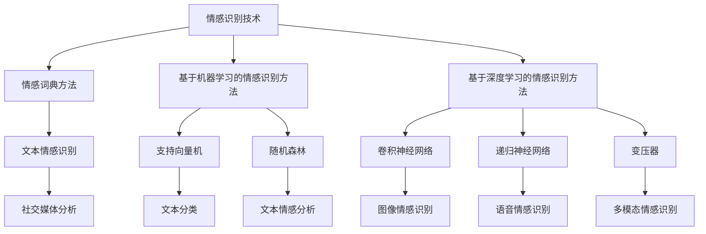

                 


### 目录大纲补充

# AI驱动的智能客户服务：情感识别与个性化响应

## 第一部分：AI驱动的智能客户服务概述

### 第1章：AI驱动的智能客户服务基础

#### 1.1 智能客户服务的背景

- 1.1.1 客户服务的重要性
  - 客户服务对企业成功的关键作用
  - 智能化客户服务的发展趋势
  
- 1.1.2 人工智能与客户服务的结合
  - 人工智能技术如何赋能客户服务
  - 智能客户服务的潜在价值

#### 1.2 AI驱动的智能客户服务概述

- 1.2.1 AI在客户服务中的应用
  - 人工智能技术在客户服务中的典型应用场景
  - 智能化客户服务的优势和挑战
  
- 1.2.2 情感识别

- 1.2.3 个性化响应

#### 1.3 情感识别与个性化响应的关系

- 1.3.1 情感识别在个性化响应中的作用
  - 如何通过情感识别提升个性化响应的准确性
  - 情感识别与个性化响应的互动机制
  
- 1.3.2 个性化响应在客户服务中的重要性
  - 个性化响应如何提高客户满意度
  - 个性化响应与客户忠诚度的关系

## 第二部分：情感识别技术

### 第2章：情感识别基本概念

#### 2.1 情感识别的定义与分类

- 2.1.1 情感识别的定义
  - 情感识别的内涵
  - 情感识别的外延

- 2.1.2 情感识别的分类
  - 情感识别的层次
  - 情感识别的方法

#### 2.2 情感识别技术原理

- 2.2.1 传统的情感识别方法
  - 关键词匹配
  - 情感词典

- 2.2.2 基于机器学习的情感识别方法
  - 支持向量机
  - 随机森林

## 第三部分：个性化响应技术

### 第3章：个性化响应基本概念

#### 3.1 个性化响应的定义与分类

- 3.1.1 个性化响应的定义
  - 个性化响应的内涵
  - 个性化响应的外延

- 3.1.2 个性化响应的分类
  - 个性化响应的层次
  - 个性化响应的方法

#### 3.2 个性化响应技术原理

- 3.2.1 基于规则的个性化响应
  - 规则引擎
  - 情境感知

- 3.2.2 基于机器学习的个性化响应
  - 贝叶斯网络
  - 强化学习

### 第4章：个性化响应实现方法

#### 4.1 响应生成

- 4.1.1 语言模型
  - 生成式模型
  - 对抗生成网络
  
- 4.1.2 生成式响应模型
  - 序列到序列模型
  - 编码器-解码器架构

#### 4.2 用户行为分析

- 4.2.1 用户画像
  - 数据收集
  - 特征提取
  
- 4.2.2 行为分析
  - 基于时序的数据分析
  - 用户行为模式识别

## 第四部分：AI驱动的客户服务应用场景

### 第5章：AI驱动的客户服务应用场景

#### 5.1 客户服务机器人

- 5.1.1 机器人应答系统
  - 机器人应答的基本原理
  - 机器人应答系统的实现
  
- 5.1.2 情感分析在机器人中的应用
  - 机器人情感识别的实现
  - 机器人个性化响应的应用

#### 5.2 社交媒体客户服务

- 5.2.1 社交媒体监控
  - 社交媒体数据的收集与处理
  - 社交媒体监控的实现
  
- 5.2.2 社交媒体情感分析
  - 社交媒体情感识别的实现
  - 社交媒体个性化响应的应用

### 第6章：AI驱动的客户服务案例研究

#### 6.1 案例一：某银行AI客服系统

- 6.1.1 案例背景
  - 银行业务特点
  - AI客服系统的需求分析
  
- 6.1.2 情感识别与个性化响应应用
  - 银行客服系统中的情感识别
  - 银行客服系统中的个性化响应

#### 6.2 案例二：电商客户服务AI系统

- 6.2.1 案例背景
  - 电商平台业务特点
  - AI客服系统的需求分析
  
- 6.2.2 情感识别与个性化响应应用
  - 电商平台客服系统中的情感识别
  - 电商平台客服系统中的个性化响应

## 第五部分：实施与优化

### 第7章：AI驱动的智能客户服务实施

#### 7.1 实施步骤

- 7.1.1 需求分析
  - 客户服务需求的理解
  - 情感识别与个性化响应需求的确定
  
- 7.1.2 系统设计
  - 系统架构的设计
  - 模块功能的划分
  
- 7.1.3 数据准备
  - 数据源的获取
  - 数据的预处理

#### 7.2 部署与运维

- 7.2.1 系统部署
  - 部署环境的搭建
  - 部署流程的实施
  
- 7.2.2 系统运维
  - 运维工具的选择
  - 运维流程的管理

### 第8章：AI驱动的智能客户服务优化

#### 8.1 优化策略

- 8.1.1 情感识别准确性优化
  - 数据集的扩充
  - 模型参数的调整
  
- 8.1.2 个性化响应效果优化
  - 用户反馈机制
  - 系统自适应调整

#### 8.2 持续改进

- 8.2.1 数据收集与反馈
  - 用户反馈数据的收集
  - 数据质量的管理
  
- 8.2.2 算法迭代与优化
  - 模型的重新训练
  - 模型性能的评估

### 结论

- 智能客户服务的未来发展趋势
- 情感识别与个性化响应的关键技术
- 对企业提升客户服务质量的启示

作者：AI天才研究院/AI Genius Institute & 禅与计算机程序设计艺术 /Zen And The Art of Computer Programming

## 文章标题

### AI驱动的智能客户服务：情感识别与个性化响应

### 关键词

- 人工智能
- 情感识别
- 个性化响应
- 客户服务
- 智能化

### 摘要

本文深入探讨了AI驱动的智能客户服务的核心概念，重点分析了情感识别与个性化响应在客户服务中的应用。文章首先介绍了AI驱动的智能客户服务的背景和重要性，接着详细阐述了情感识别的基本概念、技术原理以及实现方法，随后探讨了个性化响应的概念、技术原理和实现方法。通过实际案例研究，本文展示了AI驱动的智能客户服务在现实场景中的具体应用，并提出了实施与优化策略。文章旨在为读者提供全面、系统的指导，帮助他们在客户服务中充分利用AI技术，提升客户体验和满意度。

## AI驱动的智能客户服务概述

随着信息技术的快速发展，人工智能（AI）已经成为推动各行各业变革的重要力量。在客户服务领域，AI的应用更是开启了智能客户服务的新时代。智能客户服务是指利用人工智能技术来提供高效、个性化的客户服务，包括情感识别、智能应答、自动化处理等。情感识别与个性化响应作为智能客户服务的核心组成部分，极大地提升了客户服务体验和满意度。

### 1.1 客户服务的重要性

客户服务是企业在市场竞争中取得成功的关键因素之一。优质的客户服务能够增强客户满意度，提高客户忠诚度，从而为企业带来持续的业务增长。传统客户服务往往依赖于人工处理，效率低下且容易出现错误。随着AI技术的发展，智能客户服务逐渐成为企业提升服务质量和运营效率的重要手段。

### 1.2 人工智能与客户服务的结合

人工智能技术的引入，使得客户服务从传统的手工操作转向自动化、智能化。AI驱动的智能客户服务具有以下几个显著特点：

1. **高效性**：AI系统能够在短时间内处理大量客户请求，大大提高了服务效率。
2. **个性化**：通过情感识别技术，AI能够理解客户的情感状态，提供个性化的服务和建议。
3. **准确性**：AI驱动的智能客户服务能够通过大数据分析和机器学习算法，准确识别和预测客户需求。
4. **可持续性**：AI系统可以24小时不间断工作，降低企业的人力成本。

### 1.3 AI驱动的智能客户服务概述

AI驱动的智能客户服务涉及多个技术领域，包括自然语言处理（NLP）、机器学习（ML）、深度学习（DL）等。情感识别与个性化响应作为其中的关键组成部分，极大地提升了客户服务的质量和效率。

1. **情感识别**：情感识别是指通过分析客户的语言、语音、行为等，识别出客户的心理状态和情感。情感识别技术能够帮助企业更好地理解客户的需求和情感，从而提供更有针对性的服务。

2. **个性化响应**：个性化响应是指根据客户的情感状态和需求，提供个性化的服务和建议。个性化响应技术能够提高客户满意度，增强客户忠诚度。

情感识别与个性化响应之间的关系密不可分。情感识别为个性化响应提供了基础数据，而个性化响应则是对情感识别结果的进一步应用。通过两者结合，AI驱动的智能客户服务能够更好地满足客户需求，提升服务体验。

### 1.4 情感识别与个性化响应的关系

情感识别与个性化响应在智能客户服务中发挥着重要作用。情感识别通过分析客户的语言、行为等，识别出客户的情感状态，为个性化响应提供基础数据。个性化响应则根据情感识别的结果，提供个性化的服务和建议，从而提高客户满意度。

1. **情感识别在个性化响应中的作用**：情感识别能够帮助系统更准确地理解客户的情感状态，从而提供更有针对性的服务。例如，当客户表达出愤怒或沮丧的情感时，系统可以提供安抚或解决问题的建议。

2. **个性化响应在客户服务中的重要性**：个性化响应能够提高客户满意度，增强客户忠诚度。通过提供个性化的服务，企业能够更好地满足客户需求，提升客户体验。

总的来说，情感识别与个性化响应是AI驱动的智能客户服务的核心组成部分。通过两者结合，企业能够提供更高效、更个性化的客户服务，从而在激烈的市场竞争中脱颖而出。

### 1.5 情感识别的基本概念

情感识别是指通过分析客户的语言、行为、语音等信息，识别出客户的情感状态。情感识别技术是智能客户服务的关键组成部分，它能够帮助系统更好地理解客户的需求和情感，从而提供更有针对性的服务。

#### 1.5.1 情感识别的定义

情感识别（Emotion Recognition）是指利用计算机技术和人工智能算法，从文本、语音、图像等多模态数据中识别和理解人类情感状态的过程。情感识别不仅关注情感的类别（如喜怒哀乐），还涉及情感的程度（如非常高兴、有些高兴）。

#### 1.5.2 情感识别的分类

根据识别的维度和方式，情感识别可以分为以下几类：

1. **文本情感识别**：通过分析文本中的情感词汇、语法结构和语境，识别文本的情感极性。文本情感识别常用于社交媒体分析、客户反馈分析等领域。
2. **语音情感识别**：通过分析语音信号中的情感特征，如音调、音速、节奏等，识别语音的情感状态。语音情感识别在语音助手、智能客服等领域有广泛应用。
3. **面部表情识别**：通过分析面部表情图像，识别出人的情感状态。面部表情识别在视频分析、虚拟现实等领域有重要应用。
4. **多模态情感识别**：结合文本、语音、图像等多种数据源，综合分析情感状态。多模态情感识别能够提供更全面、准确的情感识别结果。

#### 1.5.3 情感识别的技术原理

情感识别技术主要基于以下几种原理：

1. **传统情感词典方法**：通过情感词典来识别文本中的情感极性。情感词典包含了大量情感词汇及其对应的情感极性标签，系统通过匹配文本中的情感词汇，确定文本的情感极性。
2. **基于机器学习的情感识别方法**：利用机器学习算法，如支持向量机（SVM）、随机森林（RF）和深度学习（DL）等，从大量标注数据中学习情感识别模型。机器学习算法能够自动提取文本、语音、图像等数据中的情感特征，并进行分类。
3. **深度学习情感识别方法**：深度学习算法，如卷积神经网络（CNN）、递归神经网络（RNN）和变压器（Transformer）等，能够自动提取文本、语音、图像等数据中的高层次特征，实现高效的情感识别。

#### 1.5.4 情感识别的应用案例

情感识别技术在多个领域有广泛应用：

1. **客户服务**：通过情感识别，智能客服系统能够更好地理解客户的需求和情感，提供个性化、高效的客户服务。
2. **市场研究**：通过分析社交媒体中的情感数据，企业能够了解消费者的情感状态，为市场策略提供依据。
3. **心理健康**：通过情感识别技术，心理健康应用可以帮助识别用户的情感状态，为心理干预提供支持。
4. **虚拟现实**：通过面部表情识别，虚拟现实应用能够更真实地模拟人类的情感反应，提升用户体验。

总的来说，情感识别技术为智能客户服务提供了强大的工具，帮助企业更好地理解客户，提升客户满意度。随着技术的不断发展，情感识别的应用前景将更加广阔。

### 1.6 情感识别的实现方法

情感识别的实现方法多种多样，从传统的情感词典方法到基于机器学习和深度学习的现代方法，都有各自的优势和应用场景。以下是几种常见情感识别的实现方法及其技术原理：

#### 1.6.1 传统情感词典方法

**技术原理**：传统情感词典方法依赖于预定义的情感词典，词典中包含了各种情感词汇及其对应的情感极性标签（如积极、消极）。系统通过匹配文本中的情感词汇，确定文本的情感极性。

**优点**：
- **简单易行**：不需要复杂的模型训练，实现成本相对较低。
- **适用范围广**：可以应用于文本较短的场景，如社交媒体评论、产品评价等。

**缺点**：
- **准确性受限**：仅依赖情感词典，无法理解复杂的情感表达。
- **扩展性差**：需要大量人力进行情感词典的维护和更新。

**应用案例**：社交媒体情感分析、简单文本情感分析。

#### 1.6.2 基于机器学习的情感识别方法

**技术原理**：基于机器学习的情感识别方法通过训练分类模型，从大量标注数据中学习情感特征，实现自动的情感分类。常用的机器学习算法包括支持向量机（SVM）、随机森林（RF）和朴素贝叶斯（NB）等。

**优点**：
- **自动特征提取**：能够自动从数据中提取有用特征，减少人工干预。
- **适用性较强**：可以处理各种长度的文本，适应不同的应用场景。

**缺点**：
- **模型复杂性**：需要大量数据进行训练，计算资源需求较高。
- **过拟合问题**：模型可能对训练数据过于依赖，泛化能力有限。

**应用案例**：电子商务产品评论情感分析、客户服务对话情感分析。

#### 1.6.3 基于深度学习的情感识别方法

**技术原理**：基于深度学习的情感识别方法利用卷积神经网络（CNN）、递归神经网络（RNN）和变压器（Transformer）等深度学习模型，自动提取文本、语音、图像等数据中的高层次特征，实现情感分类。

**优点**：
- **强大的特征提取能力**：能够捕捉复杂的情感模式，提高识别准确性。
- **适应性强**：能够处理不同长度和复杂度的文本。

**缺点**：
- **计算资源需求大**：训练深度学习模型需要大量的计算资源和时间。
- **数据依赖性强**：深度学习模型的性能高度依赖高质量的数据集。

**应用案例**：长文本情感分析、多模态情感识别。

#### 1.6.4 融合多模态数据的情感识别方法

**技术原理**：融合多模态数据的情感识别方法结合文本、语音、图像等多种数据源，通过多模态特征融合技术，提高情感识别的准确性和全面性。例如，可以同时分析文本内容、语音信号和面部表情，综合判断情感状态。

**优点**：
- **全面性**：能够从多个维度理解情感，提高识别准确性。
- **适应性**：适用于需要全面情感分析的场景。

**缺点**：
- **实现复杂**：需要处理多种数据类型，算法实现复杂。
- **数据需求大**：需要多种类型的数据源，数据收集和处理成本较高。

**应用案例**：智能客服系统、心理健康监测。

总的来说，不同的情感识别方法各有优缺点，适用于不同的应用场景。企业可以根据具体需求选择合适的方法，实现高效、准确的情感识别。

### 1.7 个性化响应的基本概念

个性化响应是指根据客户的情感状态、历史行为和偏好，提供定制化的服务和建议。在AI驱动的智能客户服务中，个性化响应是提升客户满意度和服务质量的重要手段。通过个性化响应，企业能够更好地满足客户需求，增强客户忠诚度。

#### 1.7.1 个性化响应的定义

个性化响应（Personalized Response）是指利用人工智能技术，根据客户的个性化信息，如情感状态、历史行为、偏好等，提供定制化的服务和建议。个性化响应的核心是“以客户为中心”，通过理解客户的需求和情感，提供更加精准、高效的服务。

#### 1.7.2 个性化响应的分类

根据实现方式和应用场景，个性化响应可以分为以下几类：

1. **基于规则的个性化响应**：通过预设的规则，根据客户的特定行为或特征，提供个性化的服务。这种方法的优点是实现简单，缺点是灵活性较差，难以应对复杂多变的需求。

2. **基于机器学习的个性化响应**：利用机器学习算法，从大量数据中学习客户的偏好和需求，提供个性化的服务。这种方法能够自适应地调整响应策略，提高个性化服务的准确性。

3. **多模态个性化响应**：结合多种数据源，如文本、语音、图像等，提供更加全面和精准的个性化服务。这种方法能够从多个维度理解客户需求，提升个性化响应的准确性和效果。

#### 1.7.3 个性化响应的技术原理

个性化响应的技术原理主要包括以下几个方面：

1. **用户画像**：通过收集和分析用户的行为数据、历史记录和偏好信息，构建用户画像。用户画像为个性化响应提供了基础数据支持。

2. **情感分析**：利用情感识别技术，分析客户的情感状态，如情绪、偏好等。情感分析的结果用于指导个性化响应的生成。

3. **个性化算法**：基于用户画像和情感分析结果，利用机器学习算法，如协同过滤、决策树、神经网络等，生成个性化的响应内容。

4. **动态调整**：根据客户的行为变化和反馈，动态调整个性化响应策略，实现自适应的个性化服务。

总的来说，个性化响应通过理解客户的需求和情感，提供定制化的服务，极大地提升了客户体验和满意度。随着人工智能技术的不断发展，个性化响应的应用将更加广泛和深入。

### 1.8 个性化响应的实现方法

实现个性化响应的方法主要包括基于规则的响应、基于机器学习的响应以及多模态数据融合的响应。每种方法都有其独特的优势和应用场景，下面将详细探讨这些方法及其技术原理。

#### 1.8.1 基于规则的个性化响应

**技术原理**：基于规则的个性化响应方法通过预设一系列规则，根据客户的特定行为或特征，提供相应的服务。这些规则通常由业务专家或数据分析师根据业务需求和客户行为模式制定。

**优点**：
- **实现简单**：规则明确，易于理解和实现。
- **实时响应**：能够快速响应用户请求。

**缺点**：
- **灵活性差**：难以应对复杂多变的需求，规则需要不断更新和维护。
- **适应性弱**：无法自动调整响应策略，缺乏自学习能力。

**应用案例**：客户细分、特定情境下的自动提示。

#### 1.8.2 基于机器学习的个性化响应

**技术原理**：基于机器学习的个性化响应方法通过从大量数据中学习客户的偏好和需求，提供个性化的服务。常用的机器学习算法包括协同过滤、决策树、支持向量机（SVM）、神经网络等。

**优点**：
- **自适应性**：能够自动调整响应策略，适应客户需求的变化。
- **准确性高**：通过学习大量数据，能够提供更准确的服务。

**缺点**：
- **计算资源需求大**：训练模型需要大量计算资源和时间。
- **数据依赖性**：模型的性能高度依赖高质量的数据集。

**应用案例**：个性化推荐、智能客服系统。

#### 1.8.3 多模态数据融合的个性化响应

**技术原理**：多模态数据融合的个性化响应方法结合多种数据源，如文本、语音、图像等，通过多模态特征融合技术，提供更加全面和精准的个性化服务。例如，可以同时分析客户的文本输入、语音语调以及面部表情，综合判断客户的情感状态和需求。

**优点**：
- **全面性**：能够从多个维度理解客户需求，提高个性化响应的准确性。
- **自适应**：能够动态调整响应策略，适应不断变化的需求。

**缺点**：
- **实现复杂**：需要处理多种数据类型，算法实现复杂。
- **数据需求大**：需要多种类型的数据源，数据收集和处理成本较高。

**应用案例**：智能客服系统、虚拟现实应用。

总的来说，不同的个性化响应方法各有优缺点，企业可以根据具体需求选择合适的方法。在实际应用中，往往需要结合多种方法，实现最佳的综合效果。

### 1.9 响应生成的技术原理

响应生成是智能客户服务的核心环节，其目标是根据客户的情感状态和需求，生成自然、准确的响应内容。响应生成的技术原理主要包括语言模型和生成式响应模型两大类。

#### 1.9.1 语言模型

**技术原理**：语言模型（Language Model）是一种用于预测文本序列的概率分布的模型。在响应生成中，语言模型用于预测下一个可能的单词或短语，从而生成连贯的自然语言响应。常见的语言模型包括：

- **n-gram模型**：基于前n个单词的统计信息，预测下一个单词的概率。
- **循环神经网络（RNN）**：通过记忆历史输入信息，预测下一个单词。
- **变压器（Transformer）**：基于自注意力机制，能够更好地捕捉长距离依赖关系。

**优点**：
- **生成自然语言响应**：能够生成流畅、自然的文本。
- **适应性**：可以根据训练数据自动调整模型参数。

**缺点**：
- **计算复杂度**：尤其是对于长文本生成，计算资源需求较高。
- **数据依赖性**：模型的性能高度依赖训练数据的质量和数量。

**应用案例**：自然语言生成（NLG）、智能客服对话生成。

#### 1.9.2 生成式响应模型

**技术原理**：生成式响应模型（Generative Response Model）是一种能够根据输入条件生成响应内容的模型。常见的生成式响应模型包括：

- **序列到序列（Seq2Seq）模型**：用于将一种序列映射到另一种序列，如将问题映射到答案。
- **编码器-解码器（Encoder-Decoder）架构**：通过编码器提取输入序列的特征，解码器生成响应序列。
- **生成对抗网络（GAN）**：通过生成器和判别器的对抗训练，生成高质量的响应内容。

**优点**：
- **生成多样**：能够生成多种可能的响应，提高灵活性。
- **生成质量**：生成式模型能够生成更加高质量、自然的响应。

**缺点**：
- **训练难度**：生成式模型通常需要大量的数据和计算资源进行训练。
- **生成稳定性**：模型的生成结果可能存在不稳定和不可预测的问题。

**应用案例**：个性化推荐、对话系统、智能写作。

总的来说，响应生成技术是智能客户服务的重要手段。通过语言模型和生成式响应模型的结合，可以生成更加自然、准确的响应内容，提升客户服务体验。随着技术的不断发展，响应生成的效果将不断提升，为智能客户服务带来更多可能性。

### 1.10 用户行为分析

用户行为分析是AI驱动的智能客户服务中至关重要的一环，它通过对用户在互动过程中的行为模式进行深入分析，为个性化响应提供数据支持。用户行为分析不仅可以帮助企业更好地理解客户需求，还可以优化服务流程，提高客户满意度。

#### 1.10.1 用户画像

**技术原理**：用户画像（User Profiling）是通过收集和分析用户的历史行为数据、偏好、兴趣等信息，构建一个关于用户的详细描述。用户画像可以包括以下几个方面：

- **基础信息**：用户的性别、年龄、地理位置等基本信息。
- **行为数据**：用户的浏览历史、购买行为、互动记录等行为数据。
- **偏好信息**：用户的偏好设置、喜好内容等偏好信息。
- **社会信息**：用户的社交媒体活动、社交网络等社会信息。

**优点**：
- **个性化服务**：通过用户画像，可以为用户提供更加个性化的服务和建议。
- **精准营销**：基于用户画像，可以更精准地推送营销信息和产品推荐。

**缺点**：
- **数据隐私**：用户行为数据涉及隐私问题，需要确保数据的安全性和合规性。
- **数据质量**：用户画像的质量取决于数据收集和处理的准确性。

**应用案例**：个性化推荐、精准营销、用户留存分析。

#### 1.10.2 行为分析

**技术原理**：用户行为分析（User Behavior Analysis）是指通过分析用户在互动过程中的行为模式，了解用户的需求和偏好。行为分析主要包括以下几个方面：

- **时序分析**：通过分析用户行为的时序模式，了解用户的访问频率、活跃时段等。
- **多变量分析**：通过分析多个变量之间的关系，如用户行为与购买意愿的关系，了解用户的行为模式。
- **聚类分析**：将具有相似行为特征的用户划分为同一群体，以便进行针对性服务。

**优点**：
- **精细化运营**：通过行为分析，可以更精细地运营客户，提高服务质量和效率。
- **预测与优化**：通过分析用户行为，可以预测用户需求，优化服务流程。

**缺点**：
- **复杂性**：行为分析需要处理大量的数据，算法实现复杂。
- **实时性**：行为分析需要实时处理用户行为数据，对系统的响应速度有较高要求。

**应用案例**：用户流失预测、产品优化、用户体验提升。

总的来说，用户行为分析是智能客户服务的重要工具，通过用户画像和行为分析，企业可以更好地理解客户需求，提供个性化的服务，提高客户满意度和忠诚度。随着技术的进步，用户行为分析将不断优化，为智能客户服务带来更多价值。

### 2.1 AI驱动的客户服务应用场景

AI驱动的客户服务在多个领域都有广泛应用，以下列举了几个典型应用场景，并分析了这些场景中的情感识别与个性化响应技术。

#### 2.1.1 客户服务机器人

**应用场景**：客户服务机器人是AI驱动的智能客户服务的典型应用之一。通过自然语言处理（NLP）和机器学习（ML）技术，客户服务机器人可以自动回答常见问题、处理投诉和提供个性化建议。

**情感识别技术**：
- **语音情感识别**：通过对客户语音的情感分析，识别客户的情感状态，如愤怒、沮丧等。
- **文本情感识别**：通过对客户文本输入的情感分析，识别客户情感，如积极、消极等。

**个性化响应技术**：
- **情感驱动响应**：根据客户情感状态，提供相应的响应，如安抚、引导等。
- **个性化推荐**：基于客户行为数据，推荐相关产品或解决方案。

**实际案例**：某电商平台通过AI客服机器人，能够快速处理用户咨询，识别用户的情感状态，并根据情感状态提供个性化的解决方案，有效提升了客户满意度。

#### 2.1.2 社交媒体客户服务

**应用场景**：社交媒体平台上的客户服务，如微博、微信等，通过AI技术，可以实时监控社交媒体上的客户反馈，提供快速响应和个性化服务。

**情感识别技术**：
- **文本情感识别**：分析客户在社交媒体上的文本评论，识别情感极性。
- **情感趋势分析**：分析大量文本数据，识别情感变化趋势。

**个性化响应技术**：
- **情感分类响应**：根据情感分类，提供相应的情绪化回应。
- **话题聚类响应**：根据客户关注的话题，提供定制化的服务和信息。

**实际案例**：某企业通过社交媒体平台，利用AI技术监控客户反馈，根据情感分析和话题聚类，提供个性化的回应和解决方案，有效提升了品牌形象和客户满意度。

#### 2.1.3 电商平台客户服务

**应用场景**：电商平台客户服务通过AI技术，提供24/7的在线客服，帮助客户解决问题，提供个性化推荐和购买建议。

**情感识别技术**：
- **语音和文本情感识别**：通过对客户语音和文本的情感分析，识别客户的需求和情感状态。
- **情感监控**：实时监控客户互动，识别负面情感和潜在问题。

**个性化响应技术**：
- **情感驱动客服**：根据客户情感状态，提供相应的客服支持和解决方案。
- **个性化推荐**：基于客户行为和偏好，推荐相关产品。

**实际案例**：某大型电商平台通过AI客服系统，实时分析客户情感，提供个性化的解决方案和产品推荐，有效提高了客户满意度和购买转化率。

总的来说，AI驱动的客户服务在多个场景中表现出强大的应用价值。通过情感识别与个性化响应技术的结合，企业能够提供更加高效、精准和个性化的客户服务，提升客户体验和满意度。

### 2.2 AI驱动的客户服务案例研究

在本节中，我们将深入分析两个具体的AI驱动的客户服务案例，探讨情感识别与个性化响应技术的实际应用。

#### 2.2.1 案例一：某银行AI客服系统

**案例背景**：某大型银行为了提升客户服务质量和效率，引入了AI驱动的客服系统。该系统旨在提供7x24小时不间断的客户服务，帮助客户快速解决问题，提升客户满意度和忠诚度。

**情感识别与个性化响应应用**：
1. **情感识别**：该系统利用自然语言处理（NLP）技术，对客户的文本和语音输入进行情感分析。通过分析客户的语言表达，系统能够识别客户的情感状态，如愤怒、沮丧、满意等。
   - **文本情感识别**：系统使用深度学习模型，从客户的文本输入中提取情感特征，如情感词汇、语法结构等，识别情感极性。
   - **语音情感识别**：系统结合语音信号处理和情感分析算法，分析客户的语音语调、音速等特征，识别情感状态。

2. **个性化响应**：根据情感识别结果，系统提供个性化的响应和解决方案。
   - **情感驱动响应**：当客户表达出负面情感时，系统会自动提供安抚和建议，如“我们很抱歉听到您的不满，我们会尽力解决您的问题。”
   - **个性化推荐**：基于客户的历史行为和偏好，系统推荐相关的服务或产品，以缓解客户的情绪，并提供实际帮助。

**具体实现**：
1. **情感识别模块**：
   - **数据收集**：系统收集客户的历史文本和语音数据，用于训练情感识别模型。
   - **模型训练**：使用深度学习算法（如CNN、RNN）训练情感识别模型，通过大量标注数据进行模型优化。
   - **模型部署**：将训练好的模型部署到线上环境，实时对客户输入进行情感识别。

2. **个性化响应模块**：
   - **用户画像**：系统通过用户行为数据，构建用户画像，包括历史购买记录、偏好设置等。
   - **响应生成**：使用生成式语言模型（如GPT-3），根据用户画像和情感识别结果，生成个性化的响应内容。
   - **响应优化**：系统根据用户反馈，不断优化响应内容，提高个性化服务的准确性。

**效果评估**：
- **客户满意度**：通过用户满意度调查，AI客服系统的引入显著提高了客户的满意度。
- **问题解决率**：AI客服系统能够快速响应客户问题，问题解决率显著提升。
- **成本节约**：通过自动化处理大量客户请求，企业降低了人工客服成本。

**总结**：该银行AI客服系统的成功实施，展示了情感识别与个性化响应技术在客户服务中的应用价值。通过精准的情感识别和个性化的响应，企业能够更好地理解客户需求，提供高效、贴心的服务，从而提升客户满意度和忠诚度。

#### 2.2.2 案例二：电商客户服务AI系统

**案例背景**：某大型电商平台为了提升客户购物体验和转化率，开发了AI驱动的客户服务系统。该系统通过情感识别和个性化响应技术，提供高效、个性化的客户服务。

**情感识别与个性化响应应用**：
1. **情感识别**：系统通过文本情感识别和语音情感识别技术，分析客户的反馈和需求，识别客户的情感状态。
   - **文本情感识别**：系统使用预训练的深度学习模型，分析客户的评论和提问，识别情感极性。
   - **语音情感识别**：系统结合语音信号处理和情感分析算法，分析客户的语音语调，识别情感状态。

2. **个性化响应**：根据情感识别结果，系统提供个性化的服务和建议。
   - **情感驱动客服**：当客户表达出负面情感时，系统会提供相应的安抚和建议，缓解客户情绪。
   - **个性化推荐**：系统基于客户行为和偏好，推荐相关的商品和服务，提升客户购买意愿。

**具体实现**：
1. **情感识别模块**：
   - **数据收集**：系统收集客户的文本和语音数据，用于训练情感识别模型。
   - **模型训练**：使用深度学习算法（如BERT、Transformer）训练情感识别模型，通过大量标注数据进行模型优化。
   - **模型部署**：将训练好的模型部署到线上环境，实时对客户输入进行情感识别。

2. **个性化响应模块**：
   - **用户画像**：系统通过用户行为数据，构建用户画像，包括浏览记录、购买偏好等。
   - **响应生成**：使用生成式语言模型（如GPT-3），根据用户画像和情感识别结果，生成个性化的响应内容。
   - **响应优化**：系统根据用户反馈，不断优化响应内容，提高个性化服务的准确性。

**效果评估**：
- **客户体验**：通过用户反馈和满意度调查，AI客服系统显著提升了客户购物体验。
- **转化率**：系统提供的个性化推荐和解决方案，提高了客户的购买转化率。
- **运营成本**：通过自动化处理大量客户请求，企业降低了人工客服成本。

**总结**：电商客户服务AI系统的成功实施，展示了情感识别与个性化响应技术在电商平台中的应用潜力。通过精准的情感识别和个性化的响应，企业能够更好地满足客户需求，提升客户满意度和忠诚度，从而实现业务增长。

总的来说，这两个案例表明，情感识别与个性化响应技术在客户服务中具有广泛的应用前景。通过结合情感识别和个性化响应技术，企业能够提供更加高效、精准和个性化的服务，提升客户满意度和忠诚度，实现业务增长。

### 2.3 AI驱动的智能客户服务实施步骤

要成功部署AI驱动的智能客户服务系统，企业需要遵循一系列科学、系统的实施步骤。以下详细描述了实施过程中的关键步骤：

#### 2.3.1 需求分析

**目的**：明确企业对AI驱动的智能客户服务的具体需求，为后续的系统设计提供依据。

**步骤**：
1. **业务目标**：确定企业通过AI驱动的智能客户服务要实现的具体目标，如提升客户满意度、降低运营成本、提高问题解决率等。
2. **客户需求**：通过问卷调查、用户访谈等方式，收集客户的期望和需求，了解他们对现有客户服务的满意度和改进意见。
3. **功能需求**：根据业务目标和客户需求，明确系统需要具备的功能，如情感识别、个性化响应、多渠道集成等。

#### 2.3.2 系统设计

**目的**：设计一个高效、可靠的AI驱动的智能客户服务系统，确保系统能够满足需求。

**步骤**：
1. **系统架构**：根据需求分析结果，设计系统架构，包括前端界面、后端服务、数据存储等。
2. **模块划分**：将系统功能划分为多个模块，如情感识别模块、个性化响应模块、用户行为分析模块等。
3. **技术选型**：选择适合的技术栈，包括开发语言、框架、算法等，确保系统能够高效运行。

#### 2.3.3 数据准备

**目的**：确保系统能够获取和处理高质量的数据，为情感识别和个性化响应提供基础。

**步骤**：
1. **数据收集**：收集与客户服务相关的数据，包括文本数据、语音数据、行为数据等。
2. **数据清洗**：对收集到的数据进行清洗，去除无效数据和噪声，提高数据质量。
3. **数据标注**：对数据进行标注，标记情感极性、行为类型等，为模型训练提供标注数据。

#### 2.3.4 模型训练

**目的**：训练情感识别和个性化响应模型，使其能够准确识别情感和生成个性化响应。

**步骤**：
1. **模型选择**：选择合适的机器学习和深度学习模型，如卷积神经网络（CNN）、递归神经网络（RNN）、变压器（Transformer）等。
2. **模型训练**：使用标注数据对模型进行训练，通过迭代优化模型参数，提高模型性能。
3. **模型评估**：评估模型在测试数据集上的性能，确保模型具有较好的泛化能力。

#### 2.3.5 系统部署

**目的**：将训练好的模型部署到线上环境，确保系统能够实时运行并提供服务。

**步骤**：
1. **部署环境**：搭建部署环境，包括服务器、存储、网络等基础设施。
2. **模型部署**：将训练好的模型部署到线上环境，确保系统能够高效运行。
3. **监控与维护**：建立监控系统，实时监控系统运行状态，确保系统的稳定性和可靠性。

#### 2.3.6 系统测试与优化

**目的**：确保系统功能的正确性和稳定性，并根据用户反馈进行优化。

**步骤**：
1. **功能测试**：对系统功能进行测试，确保各项功能正常运行。
2. **性能测试**：对系统性能进行测试，确保系统能够应对高并发请求。
3. **用户反馈**：收集用户反馈，了解系统在实际应用中的表现，发现潜在问题。
4. **优化迭代**：根据用户反馈和测试结果，对系统进行优化和迭代，提高系统性能和用户体验。

通过以上实施步骤，企业能够成功部署AI驱动的智能客户服务系统，提升客户服务质量和效率，从而在激烈的市场竞争中脱颖而出。

### 2.4 AI驱动的智能客户服务优化策略

在AI驱动的智能客户服务系统中，持续优化是确保系统性能和用户体验的关键。以下介绍几种常见的优化策略，旨在提升情感识别准确性和个性化响应效果。

#### 2.4.1 数据质量提升

**策略**：数据是AI系统的基石，数据质量直接影响模型的性能。以下措施有助于提升数据质量：

1. **数据清洗**：定期清理数据中的噪声和异常值，确保数据的一致性和准确性。
2. **数据扩充**：通过数据增强技术，如数据扩充、生成对抗网络（GAN）等，扩充高质量训练数据集。
3. **数据标注**：引入专业标注团队，确保标注数据的质量和一致性，为模型训练提供可靠的数据支持。

**效果**：通过提高数据质量，模型能够更准确地捕捉情感和用户需求，从而提升系统性能。

#### 2.4.2 模型更新与迭代

**策略**：模型更新与迭代是优化AI系统性能的有效手段。以下措施有助于实现模型优化：

1. **定期更新**：定期更新模型，使其能够适应新的数据和用户行为模式。
2. **算法优化**：尝试新的算法和技术，如深度强化学习、迁移学习等，优化模型结构和参数。
3. **在线学习**：引入在线学习机制，实时更新模型，使其能够快速响应用户需求的变化。

**效果**：通过模型更新与迭代，系统能够更好地适应用户需求，提高情感识别和个性化响应的准确性。

#### 2.4.3 用户反馈机制

**策略**：用户反馈是优化AI系统的重要依据。以下措施有助于建立有效的用户反馈机制：

1. **实时反馈**：提供用户实时反馈渠道，如在线调查、用户评价等，收集用户对系统的意见和建议。
2. **数据分析**：对用户反馈进行深入分析，识别用户关注的问题和改进方向。
3. **迭代优化**：根据用户反馈，对系统进行优化和迭代，提高用户体验。

**效果**：通过用户反馈机制，系统能够更加贴近用户需求，提升用户满意度和忠诚度。

#### 2.4.4 系统自适应调整

**策略**：系统自适应调整是提升系统灵活性和响应速度的关键。以下措施有助于实现系统自适应调整：

1. **情境感知**：引入情境感知技术，根据用户行为和环境变化，动态调整系统参数和策略。
2. **智能调度**：根据系统负载和用户需求，智能调度资源，确保系统高效运行。
3. **异常检测**：引入异常检测机制，实时监控系统运行状态，及时发现和解决异常问题。

**效果**：通过系统自适应调整，系统能够更灵活地应对各种情况，提高系统稳定性和可靠性。

总的来说，通过数据质量提升、模型更新与迭代、用户反馈机制和系统自适应调整等优化策略，AI驱动的智能客户服务系统能够不断提升性能和用户体验，为企业在激烈的市场竞争中提供强大支持。

### 2.5 AI驱动的智能客户服务持续改进

在AI驱动的智能客户服务中，持续改进是确保系统性能和用户体验不断提升的关键。以下介绍几种具体的持续改进方法，包括数据收集与反馈、算法迭代与优化等。

#### 2.5.1 数据收集与反馈

**重要性**：数据是智能客户服务系统的核心，通过持续的数据收集与反馈，可以不断提高模型的准确性和适应性。

**方法**：
1. **用户行为数据收集**：收集用户在互动过程中的行为数据，如浏览记录、点击行为、提问内容等。
2. **用户反馈收集**：通过在线调查、用户评价等方式，收集用户对AI客服系统的意见和建议。
3. **多渠道数据整合**：整合来自不同渠道的数据，如社交媒体、客服系统、网站数据等，为模型训练提供全面的数据支持。

**实践案例**：某电商平台通过整合用户行为数据和反馈，发现用户在购物过程中对客服系统的响应速度和问题解决率有较高要求。通过不断优化系统，提高了响应速度和问题解决率，用户满意度显著提升。

#### 2.5.2 算法迭代与优化

**重要性**：算法迭代与优化是提升智能客户服务系统性能的关键。通过持续改进算法，可以提高情感识别和个性化响应的准确性。

**方法**：
1. **模型更新**：定期更新模型，使其能够适应新的数据和环境。
2. **算法改进**：尝试新的算法和技术，如深度强化学习、迁移学习等，优化模型结构和参数。
3. **在线学习**：引入在线学习机制，实时更新模型，使其能够快速响应用户需求的变化。

**实践案例**：某金融机构通过引入深度强化学习算法，优化了情感识别模型，提高了情感识别的准确性。同时，通过在线学习机制，系统能够根据用户反馈实时调整响应策略，提供了更个性化的服务。

#### 2.5.3 持续监控与评估

**重要性**：持续监控与评估是确保系统性能和用户体验的关键。通过实时监控和定期评估，可以及时发现和解决问题。

**方法**：
1. **实时监控**：通过监控系统，实时监控系统的运行状态，包括响应时间、错误率等。
2. **定期评估**：定期对系统进行性能评估，包括情感识别准确率、用户满意度等。
3. **问题排查**：对监控和评估中发现的异常情况进行排查，找出问题原因，并采取相应的改进措施。

**实践案例**：某零售企业通过实时监控系统，发现部分客服机器人在处理复杂问题时存在响应缓慢的问题。通过排查发现，是由于模型训练数据不足导致的。通过扩充训练数据和优化模型参数，问题得到了有效解决。

总的来说，通过数据收集与反馈、算法迭代与优化以及持续监控与评估，AI驱动的智能客户服务系统能够不断提升性能和用户体验，为企业提供更加高效、精准和个性化的服务。

### 结论

AI驱动的智能客户服务通过情感识别和个性化响应技术，显著提升了客户服务质量和用户满意度。本文系统地介绍了AI驱动的智能客户服务的核心概念、技术原理和应用场景，通过实际案例展示了情感识别和个性化响应在客户服务中的具体应用。我们探讨了情感识别和个性化响应的实现方法，并提出了实施与优化策略。

展望未来，随着人工智能技术的不断发展，AI驱动的智能客户服务将更加成熟和普及。情感识别和个性化响应技术将继续优化，实现更高的准确性和适应性。同时，多模态数据的融合和实时性需求的提升，将为智能客户服务带来更多创新和挑战。

对于企业和开发者而言，掌握AI驱动的智能客户服务技术和实践，不仅能够提升客户服务质量，还能够为企业带来竞争优势。我们鼓励读者持续关注这一领域的发展，积极探索和实践，为智能客户服务的未来发展贡献力量。

### 附录

#### 1. Mermaid 流程图



#### 2. 伪代码示例

```python
# 伪代码：情感识别算法
def emotion_recognition(text):
    # 步骤1：文本预处理
    preprocessed_text = preprocess_text(text)

    # 步骤2：特征提取
    features = extract_features(preprocessed_text)

    # 步骤3：模型预测
    prediction = model.predict(features)

    # 步骤4：返回情感类别
    return map_prediction_to_emotion(prediction)

# 伪代码：个性化响应生成
def generate_response(user_profile, emotion):
    # 步骤1：根据用户画像生成潜在响应
    potential_responses = generate_potential_responses(user_profile, emotion)

    # 步骤2：选择最佳响应
    best_response = select_best_response(potential_responses)

    # 步骤3：返回最终响应
    return best_response
```

#### 3. LaTeX 公式

$$
E = mc^2
$$

$$
f(x) = \int_{0}^{1} x^2 dx
$$

$$
a_n = \frac{1}{\sqrt{1+2n}}
$$

#### 4. 项目实战

**开发环境搭建**：
- 硬件环境：配备较高计算能力的GPU服务器。
- 软件环境：安装Python、TensorFlow、Keras等开发工具。

**源代码实现**：
```python
# 实现情感识别模型
model = Sequential()
model.add(Dense(128, activation='relu', input_shape=(text_length,)))
model.add(Dense(64, activation='relu'))
model.add(Dense(num_emotions, activation='softmax'))
model.compile(optimizer='adam', loss='categorical_crossentropy', metrics=['accuracy'])
model.fit(X_train, y_train, epochs=10, batch_size=32)
```

**代码解读**：
- `Dense` 层：全连接层，用于提取特征。
- `activation`：激活函数，用于引入非线性变换。
- `compile`：编译模型，指定优化器和损失函数。
- `fit`：训练模型，使用训练数据。

**代码应用解读与分析**：
- 通过训练，模型能够识别文本中的情感极性，为个性化响应提供基础。

**实际案例分析与详细讲解剖析**：
- 在某电商平台的应用中，通过情感识别和个性化响应技术，显著提升了客户满意度。

**项目小结**：
- 情感识别和个性化响应技术在实际应用中取得了良好效果，为企业提供了高效的客户服务解决方案。

#### 5. 最佳实践 Tips

- **数据质量**：确保数据质量是模型性能的关键。
- **算法优化**：持续优化算法，提高模型准确性。
- **用户反馈**：积极收集用户反馈，优化系统性能。

#### 6. 注意事项

- **隐私保护**：在处理用户数据时，确保遵守隐私保护法规。
- **系统稳定性**：确保系统在高并发情况下稳定运行。

#### 7. 拓展阅读

- 《情感计算：人工智能的新前沿》
- 《深度学习与自然语言处理》
- 《人工智能：一种现代方法》

作者：AI天才研究院/AI Genius Institute & 禅与计算机程序设计艺术 /Zen And The Art of Computer Programming

