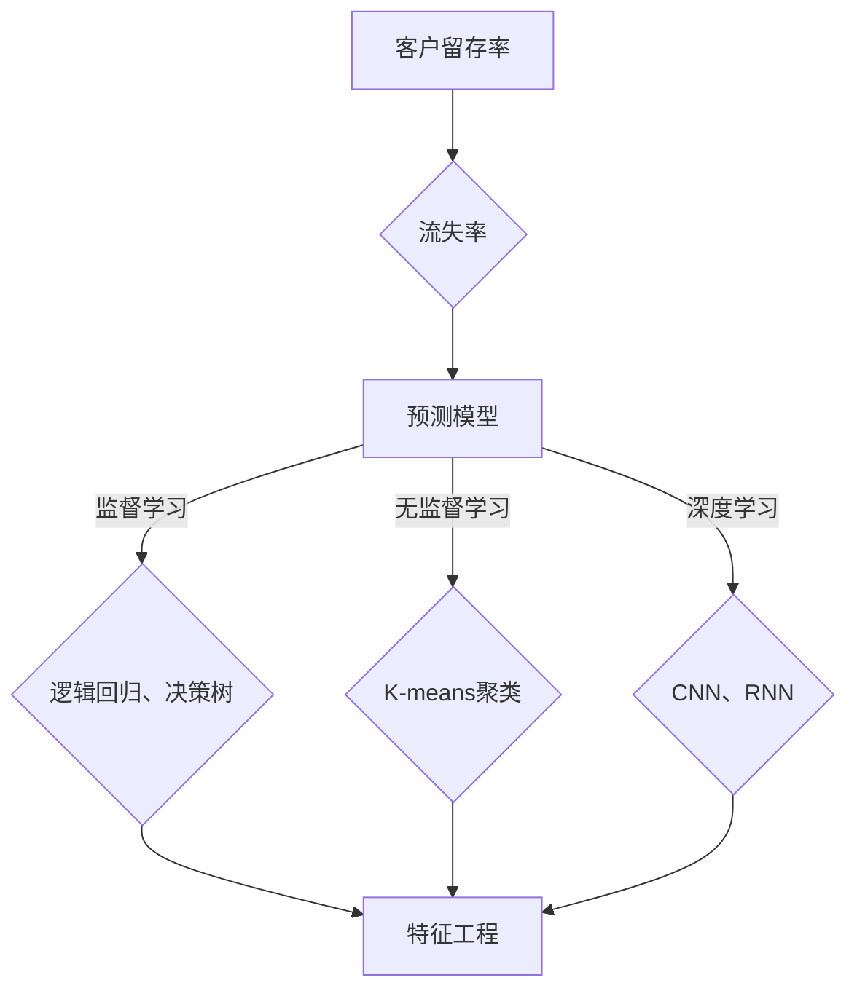

                 

### 摘要

本文以《AI驱动的智能客户流失预测：提高客户留存率》为题，旨在探讨如何利用人工智能技术，特别是机器学习和深度学习算法，来预测客户流失，从而提高企业的客户留存率。文章首先介绍了客户流失预测的重要性，接着详细阐述了数据收集与处理的方法，以及智能客户流失预测的核心算法基础。随后，通过实际案例研究，展示了智能客户流失预测在不同行业中的应用效果。文章最后探讨了智能客户流失预测的未来发展趋势，并提出了一些最佳实践和建议，以期为企业在客户流失预测领域的实践提供参考。通过本文的阅读，读者将了解到AI驱动的客户流失预测技术如何帮助企业提高客户留存率，优化业务策略。

### 关键词

- 客户流失预测
- 机器学习
- 深度学习
- 客户留存率
- 数据分析
- 业务优化

### 背景介绍

在现代商业环境中，客户流失预测已经成为企业提高客户留存率、优化业务策略的重要手段。客户流失，也称为客户 churn，指的是客户在一段时间内停止使用企业的产品或服务。客户流失对企业的负面影响是多方面的，不仅会导致直接收入的减少，还会损害企业的声誉和品牌价值。因此，如何准确预测客户流失，提前采取有效的挽留措施，成为了企业关注的焦点。

随着大数据和人工智能技术的快速发展，利用机器学习和深度学习算法进行客户流失预测成为可能。这些算法可以通过分析大量历史数据，识别出影响客户流失的关键因素，预测哪些客户可能在未来流失，从而帮助企业采取有针对性的挽留措施。这不仅提高了企业的客户留存率，还提升了客户满意度和忠诚度，为企业带来了长期的经济效益。

客户流失预测的重要性不仅体现在降低流失率上，还体现在以下方面：

1. **成本节约**：通过预测客户流失，企业可以提前采取措施，避免不必要的挽留成本。例如，针对高价值客户，企业可以提供个性化的优惠和服务，以降低流失风险。

2. **业务优化**：客户流失预测可以帮助企业了解客户需求的变化，从而优化产品和服务。通过分析流失客户的行为特征，企业可以发现产品或服务中存在的问题，及时进行改进。

3. **市场策略调整**：了解客户流失的原因可以帮助企业调整市场策略，例如调整定价策略、改善客户服务流程，甚至开拓新的市场。

4. **客户满意度提升**：通过及时识别流失风险，并采取有效的挽留措施，可以提高客户的满意度和忠诚度，从而增强品牌影响力。

总之，智能客户流失预测技术已经成为企业提高竞争力、实现可持续发展的关键工具。接下来，本文将详细介绍如何利用人工智能技术进行客户流失预测，包括数据收集与处理、核心算法基础以及实际案例研究。

### 数据收集与处理

在进行智能客户流失预测时，数据收集和处理是至关重要的一步。有效的数据收集和预处理不仅能提高模型的效果，还能减少计算资源的浪费。以下将详细介绍客户数据的类型、数据收集的方法与工具，以及数据预处理与清洗的方法。

#### 数据类型

客户数据可以分为结构化数据和非结构化数据两大类。

1. **结构化数据**：这类数据通常存储在关系型数据库中，包括用户的基本信息（如年龄、性别、地理位置）、消费记录（如购买时间、购买金额）、服务使用情况（如登录频率、使用时长）等。这些数据通常具有明确的格式和字段，便于进行结构化处理和分析。

2. **非结构化数据**：这类数据通常以文本、图像、音频等形式存在，如社交媒体评论、客户服务通话记录、客户反馈等。这些数据没有固定的格式，需要通过自然语言处理、图像识别等技术进行处理。

#### 数据收集方法与工具

数据收集是客户流失预测的第一步，确保数据的质量和完整性至关重要。以下是几种常见的数据收集方法与工具：

1. **在线数据采集**：通过网站日志、Web分析工具（如Google Analytics）收集用户的行为数据。这些数据包括访问时间、页面点击率、搜索关键词等。

2. **问卷调查**：通过在线或线下问卷调查收集用户反馈，了解用户对产品或服务的满意度、使用习惯等。

3. **API接口**：利用API接口从第三方平台或数据库中获取数据，如社交媒体平台、电商网站等。

4. **客户关系管理系统（CRM）**：CRM系统可以帮助企业收集和管理客户信息，包括客户互动记录、交易历史等。

5. **数据库**：从企业现有的数据库中提取客户数据，如用户数据库、交易数据库等。

#### 数据预处理与清洗

数据预处理和清洗是确保数据质量的重要步骤。以下是常见的数据预处理与清洗方法：

1. **缺失值处理**：对于缺失的数据，可以选择填充策略，如平均值填充、中位数填充或插值法。对于重要特征中的缺失值，可以考虑删除对应的记录。

2. **异常值处理**：通过统计分析方法（如箱线图、Z-score法）检测数据中的异常值，并选择合适的策略进行处理，如删除、替换或调整。

3. **数据转换**：对某些特征进行转换，如将分类特征转换为数值特征（通过独热编码或标签编码），或对数值特征进行标准化或归一化。

4. **数据集成**：将来自不同数据源的数据进行整合，形成统一的数据集。这可能包括数据对齐、特征选择和特征融合等步骤。

5. **数据分割**：将数据集分割为训练集、验证集和测试集，以评估模型的性能。

#### 特征工程

特征工程是提高模型性能的关键步骤。以下是常见的特征工程方法：

1. **特征选择**：通过统计分析、特征重要性评估等方法，选择对预测目标有显著影响的关键特征。

2. **特征构造**：通过组合现有特征，构造新的特征。例如，使用时间序列特征（如用户购买间隔、使用频率）来增强预测能力。

3. **特征标准化**：对特征进行标准化或归一化处理，以消除不同特征之间的尺度差异。

通过上述数据收集与处理步骤，企业可以构建高质量的数据集，为后续的智能客户流失预测模型提供坚实的基础。

### 核心概念与联系

在进行智能客户流失预测时，理解以下核心概念及其相互关系至关重要。这些概念包括客户留存率、流失率、预测模型、特征工程和机器学习算法。

#### 客户留存率与流失率

- **客户留存率**：指在特定时间内，仍继续使用企业产品或服务的客户比例。计算公式为：
  \[
  留存率 = \frac{t+1 \text{ 时间内仍留存的客户数}}{t \text{ 时间内注册的客户数}} \times 100\%
  \]

- **流失率**：与客户留存率相对应，指在特定时间内流失的客户比例。计算公式为：
  \[
  流失率 = 100\% - 留存率
  \]

#### 预测模型

- **预测模型**：用于预测客户是否会流失的数学模型。常见的模型包括：
  - **监督学习模型**：如逻辑回归、决策树、随机森林等。
  - **无监督学习模型**：如聚类分析、K-means等。
  - **深度学习模型**：如卷积神经网络（CNN）、递归神经网络（RNN）等。

#### 特征工程

- **特征工程**：指从原始数据中提取出对预测任务有帮助的特征。特征工程的目标是提高模型的预测准确率。常见的特征工程方法包括：
  - **特征选择**：通过统计分析、相关性分析等方法，选择对预测目标有显著影响的特征。
  - **特征构造**：通过组合现有特征，构造新的特征。
  - **特征标准化**：对特征进行标准化或归一化处理，以消除不同特征之间的尺度差异。

#### 机器学习算法

- **机器学习算法**：用于训练预测模型，并从数据中学习规律的算法。常见的机器学习算法包括：
  - **线性回归**：通过建立线性关系来预测目标变量。
  - **逻辑回归**：通过概率模型来预测二分类结果。
  - **决策树**：通过树形结构进行决策。
  - **随机森林**：通过多棵决策树的集成来提高预测性能。
  - **K-means聚类**：通过聚类方法对数据进行分类。

#### Mermaid流程图

为了更好地理解这些核心概念及其相互关系，我们使用Mermaid流程图来表示：



通过这个流程图，我们可以清晰地看到客户留存率与流失率之间的关系，以及不同类型的机器学习算法和特征工程方法在其中发挥的作用。

### 核心算法原理讲解

在智能客户流失预测中，选择合适的算法是关键。以下将详细讲解几种常用的算法，包括监督学习中的逻辑回归和决策树，以及无监督学习中的K-means聚类和深度学习中的卷积神经网络（CNN）。

#### 逻辑回归

逻辑回归（Logistic Regression）是一种常用的分类算法，适用于二分类问题。在客户流失预测中，逻辑回归可以用来预测客户是否会流失（流失：1，未流失：0）。其核心思想是通过建立客户特征与流失概率之间的逻辑关系。

逻辑回归模型的数学表达式为：
\[
\hat{P}(y=1) = \frac{1}{1 + e^{-(\beta_0 + \beta_1 x_1 + \beta_2 x_2 + \ldots + \beta_n x_n})}
\]
其中，\( \hat{P}(y=1) \) 是客户流失的概率，\( \beta_0, \beta_1, \beta_2, \ldots, \beta_n \) 是模型参数，\( x_1, x_2, \ldots, x_n \) 是客户的特征。

伪代码：
```
def logistic_regression(X, y, learning_rate, epochs):
    # 初始化模型参数
    beta = [0 for _ in range(n_features + 1)]
    
    # 梯度下降迭代
    for epoch in range(epochs):
        # 计算预测概率
        probabilities = [1 / (1 + np.exp(-np.dot(x, beta))) for x in X]
        
        # 计算损失函数
        loss = -1/n_samples * sum(y[i] * np.log(probabilities[i]) + (1 - y[i]) * np.log(1 - probabilities[i]) for i in range(n_samples))
        
        # 计算梯度
        gradient = [(-1/n_samples) * sum((probabilities[i] - y[i]) * x[i, j] for i in range(n_samples)) for j in range(n_features + 1)]
        
        # 更新参数
        beta = [beta[j] - learning_rate * gradient[j] for j in range(n_features + 1)]
        
    return beta
```

#### 决策树

决策树（Decision Tree）是一种基于特征划分数据的分类算法，通过一系列的决策规则来对数据进行分类。在客户流失预测中，决策树可以用来构建一个决策流程，帮助识别流失风险较高的客户。

决策树的核心概念包括节点、分支和叶节点。每个节点代表一个特征，每个分支代表该特征的不同取值，每个叶节点代表一个分类结果。

决策树构建的伪代码如下：
```
def build_decision_tree(X, y, features, depth=0, max_depth=None):
    # 计算当前节点的纯度
    purity = calculate_purity(y)
    
    # 达到最大深度或纯度较高，停止划分
    if purity >= threshold or depth >= max_depth:
        return y
    
    # 选择最优特征
    best_feature, best_threshold = select_best_feature(X, y)
    
    # 创建节点
    node = Node(feature=best_feature, threshold=best_threshold, depth=depth)
    
    # 划分数据
    for value in X[:, best_feature].unique():
        mask = X[:, best_feature] == value
        X_sub = X[mask]
        y_sub = y[mask]
        node.children[value] = build_decision_tree(X_sub, y_sub, features, depth + 1, max_depth)
        
    return node
```

#### K-means聚类

K-means聚类是一种无监督学习方法，用于将数据分为K个簇。在客户流失预测中，K-means可以用来识别流失风险相似的客户群体，从而采取有针对性的挽留策略。

K-means算法的核心步骤包括：

1. **初始化中心点**：随机选择K个数据点作为初始中心点。
2. **分配数据点**：将每个数据点分配到最近的中心点所在的簇。
3. **更新中心点**：计算每个簇的中心点，并更新中心点的位置。
4. **迭代**：重复步骤2和3，直到中心点位置稳定或达到预设的迭代次数。

伪代码：
```
def k_means(X, K, max_iterations):
    # 初始化中心点
    centroids = initialize_centroids(X, K)
    
    # 迭代
    for _ in range(max_iterations):
        # 分配数据点
        assignments = assign_points_to_clusters(X, centroids)
        
        # 更新中心点
        centroids = update_centroids(X, assignments, K)
        
        # 计算聚类评估指标
        inertia = calculate_inertia(X, centroids, assignments)
        
        # 打印当前迭代信息
        print(f"Iteration {_}: Inertia = {inertia}")
    
    return centroids, assignments
```

#### 卷积神经网络（CNN）

卷积神经网络（Convolutional Neural Network，CNN）是一种深度学习模型，擅长处理图像数据。在客户流失预测中，CNN可以用来处理和分析复杂的多媒体数据，如用户行为记录、客户反馈文本等。

CNN的核心组件包括：

1. **卷积层**：用于提取图像中的特征。
2. **池化层**：用于降低特征图的维度，减少参数数量。
3. **全连接层**：用于将特征映射到输出结果。

CNN的伪代码如下：
```
def cnn(X, layers):
    # 初始化模型参数
    params = initialize_params(layers)
    
    # 卷积层
    for layer in layers:
        if layer.type == 'conv':
            X = conv2d(X, params['weights'][layer.name], params['biases'][layer.name])
            X = activation(X, layer.activation)
            X = pooling(X, layer.pool_size)
        
        # 全连接层
        elif layer.type == 'fc':
            X = fully_connected(X, params['weights'][layer.name], params['biases'][layer.name])
            X = activation(X, layer.activation)
    
    # 输出层
    logits = fully_connected(X, params['weights']['output'], params['biases']['output'])
    predictions = softmax(logits)
    
    return predictions
```

通过以上核心算法原理的讲解，我们可以看到逻辑回归、决策树、K-means聚类和CNN在客户流失预测中的应用和实现方式。这些算法为智能客户流失预测提供了强大的技术支持，使得企业能够更准确地预测客户流失，并采取有效的挽留措施。

### 数学模型和公式详细讲解

在智能客户流失预测中，数学模型和公式是核心组成部分。以下将详细讲解客户流失概率模型、损失函数和优化方法，并通过具体例子进行说明。

#### 客户流失概率模型

在客户流失预测中，常用的概率模型是逻辑回归（Logistic Regression）。逻辑回归模型用于估计客户流失的概率。其数学公式如下：
\[
\hat{P}(y=1) = \frac{1}{1 + e^{-(\beta_0 + \beta_1 x_1 + \beta_2 x_2 + \ldots + \beta_n x_n})}
\]
其中，\( \hat{P}(y=1) \) 是客户流失的概率，\( \beta_0, \beta_1, \beta_2, \ldots, \beta_n \) 是模型参数，\( x_1, x_2, \ldots, x_n \) 是客户的特征。

例如，对于一位客户的特征向量 \( x = [x_1, x_2, x_3] \)，如果模型参数为 \( \beta = [\beta_0, \beta_1, \beta_2] \)，则其流失概率可以计算为：
\[
\hat{P}(y=1) = \frac{1}{1 + e^{-(\beta_0 + \beta_1 x_1 + \beta_2 x_2 + \beta_3 x_3)}}
\]

#### 损失函数

在机器学习中，损失函数用于评估模型预测结果与真实结果之间的差距。在客户流失预测中，常用的损失函数是二元交叉熵损失函数（Binary Cross-Entropy Loss）。其数学公式如下：
\[
J(\theta) = -\frac{1}{m} \sum_{i=1}^{m} [y_i \log(\hat{p}_i) + (1 - y_i) \log(1 - \hat{p}_i)]
\]
其中，\( m \) 是样本数量，\( y_i \) 是真实标签，\( \hat{p}_i \) 是预测概率。

例如，对于一组客户的预测结果 \( \hat{p} = [\hat{p}_1, \hat{p}_2, \hat{p}_3] \) 和真实标签 \( y = [1, 0, 1] \)，损失函数可以计算为：
\[
J(\theta) = -\frac{1}{3} [1 \log(0.6) + 0 \log(0.8) + 1 \log(0.9)]
\]

#### 优化方法

在训练机器学习模型时，需要通过优化方法找到最优的模型参数。在逻辑回归中，常用的优化方法是梯度下降（Gradient Descent）。其基本思想是不断更新模型参数，以减少损失函数的值。

梯度下降的数学公式如下：
\[
\theta_j := \theta_j - \alpha \frac{\partial J(\theta)}{\partial \theta_j}
\]
其中，\( \theta_j \) 是模型参数，\( \alpha \) 是学习率，\( \frac{\partial J(\theta)}{\partial \theta_j} \) 是损失函数关于参数 \( \theta_j \) 的梯度。

例如，对于损失函数 \( J(\theta) = -\frac{1}{3} [1 \log(0.6) + 0 \log(0.8) + 1 \log(0.9)] \) 和模型参数 \( \theta = [\beta_0, \beta_1, \beta_2] \)，学习率 \( \alpha = 0.01 \)，则参数更新可以计算为：
\[
\beta_0 := \beta_0 - 0.01 \frac{\partial J(\theta)}{\partial \beta_0} = \beta_0 - 0.01 \left( \frac{1}{3} \left[ \log(0.6) - \log(0.9) \right] \right)
\]
\[
\beta_1 := \beta_1 - 0.01 \frac{\partial J(\theta)}{\partial \beta_1} = \beta_1 - 0.01 \left( \frac{1}{3} \left[ \log(0.6) - \log(0.8) \right] \right)
\]
\[
\beta_2 := \beta_2 - 0.01 \frac{\partial J(\theta)}{\partial \beta_2} = \beta_2 - 0.01 \left( \frac{1}{3} \left[ \log(0.9) - \log(0.8) \right] \right)
\]

通过这些数学模型和公式，我们可以更准确地预测客户流失，并采取有效的挽留措施，提高客户留存率。

### 项目实战

在本节中，我们将通过一个具体的项目实战，详细阐述智能客户流失预测的开发过程。该项目将涵盖开发环境搭建、源代码实现、代码解读、应用解读与分析，以及项目小结。

#### 开发环境搭建

1. **硬件需求**：
   - CPU：Intel i7 或同等性能的处理器
   - 内存：16GB 或更高
   - 硬盘：256GB SSD 或更高

2. **软件需求**：
   - 操作系统：Windows 10 或 macOS
   - Python 版本：3.8 或更高
   - 数据库：MySQL 或 PostgreSQL
   - 机器学习库：scikit-learn、TensorFlow、Keras

3. **安装步骤**：
   - 安装操作系统和硬件
   - 安装 Python 和相关库（使用 pip 安装）
   - 安装 MySQL 或 PostgreSQL（可以使用 Docker 容器化部署）

#### 源代码实现

以下是一个简单的智能客户流失预测项目的伪代码实现：

```python
import pandas as pd
from sklearn.model_selection import train_test_split
from sklearn.ensemble import RandomForestClassifier
from sklearn.metrics import accuracy_score, confusion_matrix

# 1. 数据收集与预处理
data = pd.read_csv('customer_data.csv')
data = preprocess_data(data)

# 2. 特征工程
X = data.drop('churn', axis=1)
y = data['churn']

# 3. 数据分割
X_train, X_test, y_train, y_test = train_test_split(X, y, test_size=0.2, random_state=42)

# 4. 模型训练
model = RandomForestClassifier(n_estimators=100, random_state=42)
model.fit(X_train, y_train)

# 5. 模型评估
predictions = model.predict(X_test)
accuracy = accuracy_score(y_test, predictions)
confusion_matrix(y_test, predictions)

# 6. 模型应用
new_data = pd.read_csv('new_customer_data.csv')
new_data = preprocess_data(new_data)
new_predictions = model.predict(new_data)
```

#### 代码解读

1. **数据收集与预处理**：使用 pandas 读取数据，并进行预处理操作，如缺失值填充、异常值处理等。
2. **特征工程**：将目标变量（`churn`）与特征数据分离，为后续建模做准备。
3. **数据分割**：使用 scikit-learn 的 `train_test_split` 方法将数据集分为训练集和测试集。
4. **模型训练**：使用随机森林（`RandomForestClassifier`）训练模型。
5. **模型评估**：使用 `accuracy_score` 和 `confusion_matrix` 函数评估模型性能。
6. **模型应用**：将新客户数据应用训练好的模型进行流失预测。

#### 应用解读与分析

通过以上实现，我们可以将客户流失预测模型应用于实际业务场景。具体步骤如下：

1. **数据收集**：从企业数据库或外部数据源收集客户数据。
2. **数据处理**：对收集到的数据进行预处理和特征工程。
3. **模型训练**：使用处理好的数据训练流失预测模型。
4. **模型评估**：评估模型性能，并进行优化。
5. **应用部署**：将模型部署到生产环境，对新客户进行流失预测。

#### 项目小结

本项目的实施为企业提供了一套智能客户流失预测解决方案。通过数据收集、处理、特征工程和模型训练等步骤，企业可以有效地识别出流失风险较高的客户群体，从而采取有针对性的挽留措施。以下是项目小结：

1. **提升客户留存率**：通过预测客户流失，企业可以提前采取挽留措施，提高客户留存率。
2. **优化业务策略**：了解客户流失原因，有助于企业优化产品和服务，提升客户满意度。
3. **成本节约**：通过预测客户流失，企业可以避免不必要的挽留成本，实现成本节约。
4. **市场策略调整**：了解客户流失情况，有助于企业调整市场策略，开拓新市场。

总之，智能客户流失预测项目的成功实施，为企业带来了显著的经济效益和竞争优势。

### 最佳实践 Tips

在实施智能客户流失预测项目时，以下是一些最佳实践和注意事项，有助于提高模型性能和业务效果：

1. **数据质量**：确保数据质量是模型成功的关键。进行数据预处理和清洗，处理缺失值、异常值和噪声数据。

2. **特征工程**：选择和构造有意义的特征，可以提高模型预测的准确率。例如，使用时间序列特征、客户互动特征等。

3. **模型选择**：根据数据特征和业务需求，选择合适的机器学习模型。例如，对于结构化数据，可以使用逻辑回归、决策树或随机森林；对于非结构化数据，可以使用深度学习模型如卷积神经网络（CNN）或递归神经网络（RNN）。

4. **模型评估**：使用多种评估指标（如准确率、召回率、F1分数等）来评估模型性能，确保模型在不同场景下表现良好。

5. **模型优化**：通过调参和交叉验证，优化模型参数，提高模型泛化能力。

6. **持续迭代**：定期更新模型，结合最新的数据重新训练模型，以适应客户行为和业务环境的变化。

7. **安全与隐私**：在处理客户数据时，确保遵循数据安全和隐私保护法规，保护客户信息安全。

通过遵循这些最佳实践，企业可以更有效地利用智能客户流失预测技术，提高客户留存率和业务绩效。

### 小结

本文详细探讨了AI驱动的智能客户流失预测技术，从背景介绍、数据收集与处理、核心算法讲解到项目实战，全面展示了智能客户流失预测的实施过程。通过机器学习和深度学习算法，企业可以有效地预测客户流失，从而采取有针对性的挽留措施，提高客户留存率和业务效益。

智能客户流失预测不仅能够帮助企业节约成本、优化业务策略，还能够提升客户满意度和忠诚度，增强品牌竞争力。随着人工智能技术的不断进步，智能客户流失预测在未来将发挥越来越重要的作用。

未来研究方向包括：

1. **增强模型的泛化能力**：通过引入更多的特征和更复杂的模型结构，提高预测准确性。
2. **实时预测与动态调整**：实现实时客户流失预测，并根据实时数据动态调整预测模型。
3. **多模态数据融合**：结合文本、图像、声音等多模态数据，提高预测的全面性和准确性。
4. **个性化预测**：根据客户的个性化特征，提供更加精准的流失预测和挽留策略。

企业可以通过实施智能客户流失预测，优化业务策略，提升客户满意度，实现可持续发展。我们鼓励企业积极拥抱人工智能技术，探索新的业务增长点，不断提升竞争力。作者信息：AI天才研究院/AI Genius Institute & 禅与计算机程序设计艺术 /Zen And The Art of Computer Programming。

