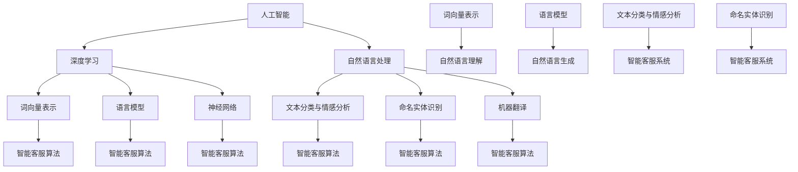
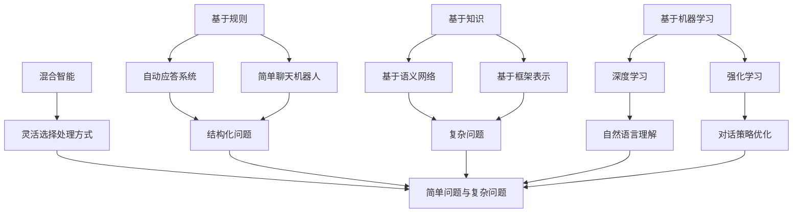
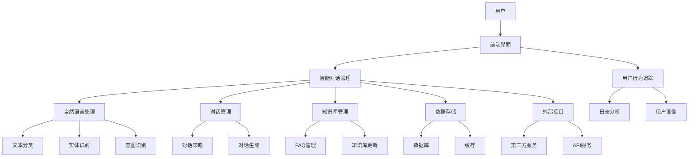
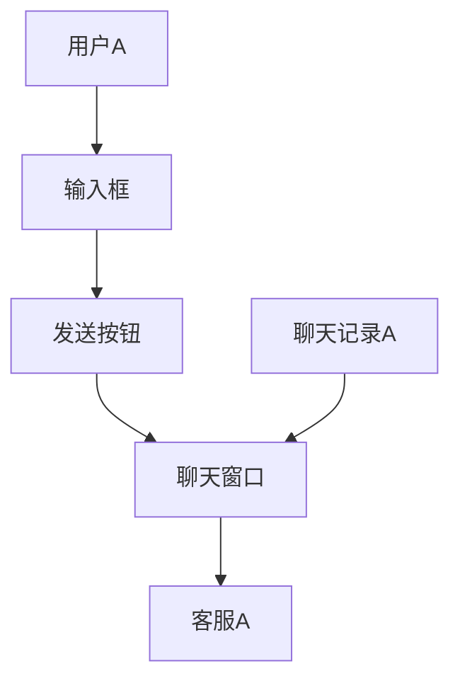
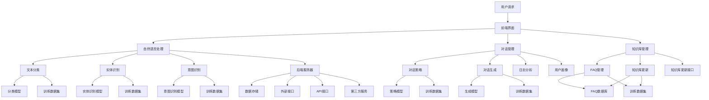

                 

### 引言

#### 智能客服的现状与未来趋势

智能客服作为人工智能（AI）领域的一个重要分支，近年来取得了显著的进展。随着互联网的普及和用户需求的多样化，企业对客户服务的要求越来越高，传统的人工客服已经难以满足快速响应和高效处理大量客户请求的需求。智能客服的出现，为这一问题提供了新的解决方案。

当前，智能客服已经广泛应用于各个行业，如电商、金融、旅游等。通过自然语言处理（NLP）和机器学习（ML）技术，智能客服能够实现与用户的智能对话，提供实时、个性化的服务。智能客服不仅能处理简单的问题，还能进行复杂的对话，从而提升客户满意度。

未来，智能客服的发展趋势将主要集中在以下几个方面：

1. **智能化水平提升**：随着AI技术的不断进步，智能客服的智能化水平将进一步提升。通过深度学习、强化学习等技术，智能客服将能够更加精准地理解和回应用户需求。

2. **个性化服务**：通过大数据分析，智能客服将能够更好地了解用户的偏好和习惯，提供更加个性化的服务。

3. **跨平台集成**：智能客服将不再局限于单一的平台，而是能够跨平台、跨渠道提供服务，实现无缝的用户体验。

4. **人机协作**：智能客服将与人工客服更好地协作，共同为客户提供高质量的服务。

本书旨在探讨AI驱动的智能客服，分析其效率与人性化之间的平衡。通过详细探讨智能客服的技术基础、架构设计、算法原理、应用场景、性能优化以及人性化设计等方面，本书希望能够为智能客服领域的研究者、开发者和从业者提供有价值的参考。

#### 本书的目的与结构

本书的目的在于全面剖析AI驱动的智能客服系统，探讨其技术原理、架构设计、应用场景、性能优化以及人性化设计等方面，旨在实现效率与人性化之间的平衡。

本书结构如下：

- **第一部分：AI技术基础与智能客服**：介绍AI技术的基本概念，包括人工智能、深度学习和自然语言处理等，并探讨智能客服的定义、发展历程和分类。
- **第二部分：智能客服架构设计**：详细讲解智能客服系统的总体架构，包括数据采集与处理、模型训练与部署、用户交互界面设计等。
- **第三部分：智能客服算法原理**：深入探讨自然语言理解算法和自然语言生成算法，包括词向量表示、主题模型、文本分类与情感分析、生成对抗网络（GAN）、变分自编码器（VAE）和强化学习等。
- **第四部分：智能客服应用场景**：分析智能客服在电商、金融等领域的应用，提供实际案例和解决方案。
- **第五部分：智能客服性能优化**：讨论智能客服性能评估指标、性能优化策略以及自动化与智能化之间的平衡。
- **第六部分：人性化与效率的平衡**：探讨人性化智能客服设计、效率与人性化的关系、平衡策略以及未来发展趋势。

通过本书的阅读，读者将能够全面了解智能客服的技术原理和应用，掌握智能客服系统设计的方法和技巧，从而为企业提供更加高效、人性化的客户服务。接下来，我们将逐步深入探讨智能客服的各个组成部分，希望读者能够跟随我们的思考，共同探索这一领域的奥秘。## 第一部分：AI技术基础与智能客服

### 第1章：AI技术基础

#### 1.1 人工智能概述

人工智能（Artificial Intelligence, AI）是指通过计算机系统模拟人类智能的理论、方法和技术。它是一门涉及多个学科的综合性技术，包括计算机科学、认知科学、心理学、神经科学等。人工智能的目标是使计算机具备感知、理解、学习、推理、决策等能力，从而实现与人类智能相似的智能化行为。

人工智能的发展可以分为以下几个阶段：

1. **早期探索阶段（20世纪50-60年代）**：人工智能的概念首次被提出，早期的AI系统主要基于符号逻辑和规则推理，例如专家系统和逻辑编程。

2. **符号人工智能阶段（20世纪70-80年代）**：符号人工智能强调知识表示和推理能力，通过形式逻辑和知识库来模拟人类智能。然而，由于符号人工智能在面对复杂问题和大规模数据时表现不佳，研究者开始寻找新的方法。

3. **连接主义人工智能阶段（20世纪80-90年代）**：连接主义人工智能以神经网络为代表，通过模拟人脑神经网络的结构和功能来处理信息。这一阶段的代表性技术包括感知机、反向传播算法和深度神经网络。

4. **现代人工智能阶段（21世纪以来）**：现代人工智能在深度学习、强化学习、自然语言处理等领域取得了突破性进展，应用范围不断扩大，包括自动驾驶、智能语音助手、图像识别、医疗诊断等。

#### 1.2 深度学习基础

深度学习（Deep Learning, DL）是人工智能的一个重要分支，它基于多层神经网络的结构，通过学习大量数据来提取特征和进行预测。深度学习的核心是多层感知机（Multilayer Perceptron, MLP），它通过前向传播和反向传播算法，将输入数据映射到输出结果。

深度学习的主要特点包括：

1. **多层神经网络**：深度学习网络由多个隐层组成，每个隐层对输入数据进行特征提取和变换，从而实现复杂的非线性映射。

2. **大规模数据训练**：深度学习需要大量的数据来训练模型，通过数据驱动的方式学习特征，从而提高模型的泛化能力。

3. **自动特征提取**：深度学习模型能够自动学习数据中的低级和高级特征，无需人工设计特征。

4. **并行计算**：深度学习算法可以利用GPU（图形处理单元）进行并行计算，大大加快模型的训练速度。

#### 1.3 自然语言处理基础

自然语言处理（Natural Language Processing, NLP）是人工智能的一个重要分支，它致力于使计算机能够理解、处理和生成自然语言。NLP涵盖了语音识别、机器翻译、文本分类、情感分析、命名实体识别等多个领域。

NLP的主要技术包括：

1. **词向量表示**：词向量是将单词映射到高维向量空间的一种方法，它可以有效地表示单词的语义信息。常用的词向量模型包括Word2Vec、GloVe等。

2. **语言模型**：语言模型是用于预测下一个单词或字符的概率分布的模型，它可以用于语音识别、机器翻译和文本生成。常用的语言模型包括n元语法模型、神经网络语言模型等。

3. **文本分类与情感分析**：文本分类是将文本数据分类到预定义的类别中的一种任务，情感分析则是判断文本的情感倾向（如正面、负面）。常用的文本分类算法包括朴素贝叶斯、支持向量机、深度学习等。

4. **命名实体识别**：命名实体识别是从文本中识别出具有特定意义的实体（如人名、地点、组织等）。常用的命名实体识别算法包括规则匹配、条件随机场（CRF）和深度学习等。

#### 核心概念与联系

为了更好地理解AI技术基础与智能客服的关系，我们可以通过一个Mermaid流程图来展示核心概念之间的联系：



从图中可以看出，深度学习和自然语言处理是智能客服的核心技术，它们为智能客服系统提供了强大的算法支持。词向量表示、语言模型、文本分类与情感分析、命名实体识别等技术则是实现智能客服功能的关键步骤。

### 核心算法原理讲解

为了深入理解深度学习和自然语言处理在智能客服中的应用，我们将使用伪代码来详细阐述几个核心算法的原理。

#### 1.3.1 词向量表示

词向量是将单词映射到高维向量空间的方法，用于表示单词的语义信息。以下是Word2Vec算法的伪代码：

```python
function Word2Vec(corpus, vocabulary_size, embedding_size):
    # 初始化词向量矩阵V，大小为vocabulary_size × embedding_size
    V = random_matrix(vocabulary_size, embedding_size)
    # 初始化输入词的上下文窗口
    context_window = 5
    for sentence in corpus:
        # 对于每个句子，将其中的每个词映射到词向量
        for word in sentence:
            for context_word in get_context(word, context_window):
                # 计算损失函数
                loss = compute_loss(V[word], V[context_word])
                # 更新词向量矩阵
                V[word] = update_vector(V[word], loss)
    return V
```

在这个算法中，`V` 表示词向量矩阵，`corpus` 表示语料库，`vocabulary_size` 表示词表大小，`embedding_size` 表示词向量的维度。`get_context` 函数用于获取一个词的上下文窗口，`compute_loss` 函数用于计算损失，`update_vector` 函数用于更新词向量。

#### 1.3.2 语言模型

语言模型用于预测下一个单词或字符的概率分布，常用的神经网络语言模型包括循环神经网络（RNN）和长短期记忆网络（LSTM）。以下是RNN语言模型的伪代码：

```python
function RNNLanguageModel(vocabulary_size, embedding_size, hidden_size):
    # 初始化网络参数
    W1 = random_matrix(vocabulary_size, embedding_size)
    W2 = random_matrix(embedding_size, hidden_size)
    W3 = random_matrix(hidden_size, vocabulary_size)
    b1 = random_vector(embedding_size)
    b2 = random_vector(hidden_size)
    b3 = random_vector(vocabulary_size)

    for sentence in corpus:
        # 前向传播
        for word in sentence:
            embed = W1[word] + b1
            hidden = tanh(W2[embed] + b2)
            logits = W3[hidden] + b3
            # 计算损失
            loss = compute_loss(logits, target_word)
            # 反向传播
            dlogits = dloss(logits, target_word)
            dhidden = d_tanh(W2[embed] + b2)
            dembed = W2.T @ dhidden
            # 更新参数
            W3 -= dlogits
            b3 -= dlogits
            W2 -= dhidden @ embed.T
            b2 -= dhidden
            W1 -= embed.T @ dembed
            b1 -= dembed
    return W1, W2, W3, b1, b2, b3
```

在这个算法中，`W1`、`W2`、`W3` 分别表示输入层、隐藏层和输出层的权重矩阵，`b1`、`b2`、`b3` 分别表示输入层、隐藏层和输出层的偏置向量。`tanh` 函数用于激活函数，`compute_loss` 函数用于计算损失，`d_tanh` 函数用于计算激活函数的导数。

#### 1.3.3 文本分类与情感分析

文本分类是将文本数据分类到预定义的类别中，常用的算法包括朴素贝叶斯、支持向量机（SVM）和深度学习。以下是朴素贝叶斯文本分类的伪代码：

```python
function NaiveBayesClassifier(corpus, labels):
    # 初始化类别概率和特征概率
    class_probabilities = [count_class(labels) / len(labels)]
    feature_probabilities = []

    for feature in get_unique_features(corpus):
        feature_probabilities.append({class: count_feature_in_class(feature, labels) / count_class(labels) for class in get_unique_classes(labels)})

    for sentence, label in zip(corpus, labels):
        # 计算每个类别的概率
        class_probabilities[label] = calculate_class_probability(sentence, feature_probabilities, class_probabilities)
        # 更新类别概率和特征概率
        update_probabilities(feature_probabilities, sentence, label)

    return class_probabilities, feature_probabilities
```

在这个算法中，`corpus` 表示文本数据，`labels` 表示标签，`get_unique_features` 函数用于获取所有特征，`get_unique_classes` 函数用于获取所有类别，`calculate_class_probability` 函数用于计算类别的概率，`update_probabilities` 函数用于更新类别概率和特征概率。

#### 1.3.4 命名实体识别

命名实体识别是从文本中识别出具有特定意义的实体，常用的算法包括规则匹配、条件随机场（CRF）和深度学习。以下是CRF命名实体识别的伪代码：

```python
function CRFNamedEntityRecognition(corpus, labels):
    # 初始化CRF模型参数
    transition_matrix = initialize_transition_matrix()
    emission_matrix = initialize_emission_matrix(corpus, labels)

    for sentence, label_sequence in zip(corpus, labels):
        # 前向传播
        forward_values = forward_algorithm(sentence, emission_matrix, transition_matrix)
        # 后向传播
        backward_values = backward_algorithm(sentence, emission_matrix, transition_matrix)
        # 计算损失
        loss = compute_loss(label_sequence, forward_values, backward_values, transition_matrix, emission_matrix)
        # 反向传播
        dtransition_matrix = dcompute_loss(label_sequence, forward_values, backward_values, transition_matrix, emission_matrix)
        d
```## 第2章：智能客服概述

#### 2.1 智能客服的定义与作用

智能客服（Intelligent Customer Service）是指利用人工智能技术，实现与用户的智能对话，提供高效、个性化的客户服务的系统。它基于自然语言处理（NLP）、机器学习（ML）和深度学习（DL）等技术，能够自动理解用户的意图，提供相应的回答或解决方案。

智能客服的主要作用包括：

1. **提高响应速度**：智能客服能够24小时不间断地提供服务，快速响应客户的请求，大大缩短了客户等待时间。

2. **提高服务质量**：智能客服能够通过机器学习和深度学习算法，不断学习和优化，提高回答的准确性和人性化程度，从而提升客户满意度。

3. **降低运营成本**：智能客服能够自动化处理大量重复性的客户请求，减轻人工客服的工作负担，降低企业的人力成本。

4. **提升客户体验**：智能客服能够根据客户的历史数据和偏好，提供个性化的服务，从而提升客户的整体体验。

#### 2.2 智能客服的发展历程

智能客服的发展历程可以分为以下几个阶段：

1. **早期阶段（20世纪80年代）**：早期的智能客服系统主要基于规则推理，即通过预设的规则来处理客户的请求。例如，专家系统和基于逻辑的推理系统。

2. **基于知识阶段（20世纪90年代）**：这一阶段的智能客服开始引入知识库和知识表示技术，通过知识库中的信息来处理客户的请求。例如，基于框架表示的知识库和基于语义网络的知识库。

3. **自然语言处理阶段（21世纪初）**：随着自然语言处理技术的进步，智能客服开始能够理解用户的自然语言输入，进行更自然的对话。这一阶段的代表性技术包括统计机器翻译、文本分类和情感分析等。

4. **现代人工智能阶段（21世纪10年代至今）**：现代智能客服利用深度学习、强化学习等先进的人工智能技术，实现了更智能、更人性化的对话。例如，深度学习模型用于自然语言理解（NLU）和自然语言生成（NLG），强化学习用于优化对话策略。

#### 2.3 智能客服的分类

根据技术实现和应用场景，智能客服可以分为以下几类：

1. **基于规则的智能客服**：这种智能客服系统通过预设的规则来处理客户的请求，适用于处理结构化、规则明确的问题。例如，自动应答系统（IVR）和简单的聊天机器人。

2. **基于知识的智能客服**：这种智能客服系统通过知识库和知识表示技术来处理客户的请求，适用于处理复杂、多层次的问题。例如，基于语义网络和框架表示的智能客服系统。

3. **基于机器学习的智能客服**：这种智能客服系统利用机器学习算法来处理客户的请求，能够自动从数据中学习并优化回答。例如，基于深度学习和强化学习的智能客服系统。

4. **混合智能客服**：这种智能客服系统结合了基于规则、基于知识和基于机器学习的方法，能够根据不同场景灵活选择最优的处理方式。例如，混合智能的智能客服系统，能够同时处理简单的和复杂的问题。

#### 核心概念与联系

为了更好地理解智能客服的各种分类及其关系，我们可以通过一个Mermaid流程图来展示：



从图中可以看出，智能客服的分类主要基于技术的实现方式和应用场景。基于规则的智能客服适用于处理结构化、规则明确的问题，基于知识的智能客服适用于处理复杂、多层次的问题，基于机器学习的智能客服能够自动从数据中学习并优化回答，而混合智能客服则能够根据不同场景灵活选择最优的处理方式。

### 核心算法原理讲解

智能客服的核心在于其对话处理能力，而对话处理的核心在于自然语言理解（NLU）和自然语言生成（NLG）算法。以下是这些算法的详细讲解和伪代码。

#### 2.3.1 自然语言理解（NLU）

自然语言理解是将自然语言输入转换为机器可处理的结构化数据的过程。NLU的关键技术包括实体识别、意图识别和语义解析。

1. **实体识别**：实体识别是从文本中识别出具有特定意义的实体，如人名、地点、组织等。以下是实体识别的伪代码：

   ```python
   function EntityRecognition(text, model):
       tokens = tokenize(text)
       entities = []
       for token in tokens:
           entity = model.predict_entity(token)
           if entity is not None:
               entities.append(entity)
       return entities
   ```

   在这个算法中，`tokenize` 函数用于将文本分割成单词或短语，`model.predict_entity` 函数用于预测每个单词或短语的实体。

2. **意图识别**：意图识别是确定用户请求的目的或意图。以下是意图识别的伪代码：

   ```python
   function IntentRecognition(text, model):
       tokens = tokenize(text)
       intent = model.predict_intent(tokens)
       return intent
   ```

   在这个算法中，`tokenize` 函数用于将文本分割成单词或短语，`model.predict_intent` 函数用于预测整个句子的意图。

3. **语义解析**：语义解析是将自然语言输入转换为机器可执行的操作的过程。以下是语义解析的伪代码：

   ```python
   function SemanticParsing(text, model):
       intent = IntentRecognition(text, model)
       entities = EntityRecognition(text, model)
       action = model.parse_semantics(intent, entities)
       return action
   ```

   在这个算法中，`IntentRecognition` 函数用于预测意图，`EntityRecognition` 函数用于预测实体，`model.parse_semantics` 函数用于将意图和实体组合成可执行的操作。

#### 2.3.2 自然语言生成（NLG）

自然语言生成是将结构化数据转换为自然语言输出的过程。NLG的关键技术包括模板匹配、规则生成和深度学习生成。

1. **模板匹配**：模板匹配是将结构化数据映射到预定义的模板上，生成自然语言输出。以下是模板匹配的伪代码：

   ```python
   function TemplateMatching(data, template):
       output = template
       for key, value in data.items():
           output = output.replace("{" + key + "}", str(value))
       return output
   ```

   在这个算法中，`data` 是结构化数据，`template` 是预定义的模板，`output` 是生成的自然语言输出。

2. **规则生成**：规则生成是通过分析大量的数据，生成自然语言生成的规则。以下是规则生成的伪代码：

   ```python
   function RuleGeneration(corpus):
       rules = []
       for sentence in corpus:
           intent, entities = parse_sentence(sentence)
           rule = create_rule(intent, entities)
           rules.append(rule)
       return rules
   ```

   在这个算法中，`parse_sentence` 函数用于解析句子，`create_rule` 函数用于生成自然语言生成的规则。

3. **深度学习生成**：深度学习生成是通过深度学习模型，自动生成自然语言输出。以下是深度学习生成的伪代码：

   ```python
   function DeepLearningGeneration(data, model):
       input_sequence = encode_data(data, model)
       output_sequence = model.generate_sequence(input_sequence)
       output = decode_sequence(output_sequence, model)
       return output
   ```

   在这个算法中，`encode_data` 函数用于将数据编码成模型可处理的格式，`model.generate_sequence` 函数用于生成自然语言输出序列，`decode_sequence` 函数用于将序列解码成自然语言。

通过以上算法，智能客服能够实现与用户的智能对话，提供高效、个性化的服务。接下来，我们将进一步探讨智能客服系统的架构设计，了解其各个组成部分及其协同工作方式。## 第二部分：智能客服系统架构

### 第3章：智能客服系统架构

#### 3.1 智能客服系统总体架构

智能客服系统的总体架构可以分为以下几个关键组成部分：前端界面、后端服务器、数据存储和外部接口。以下是一个简化的智能客服系统总体架构图：



#### 3.2 数据采集与处理

数据采集是智能客服系统的重要环节，它涉及从各种渠道收集用户交互数据，包括文本、语音、图像等。数据采集的方式包括：

1. **Web表单**：通过网站表单收集用户输入的数据。
2. **聊天记录**：通过即时通讯工具（如QQ、微信、Slack等）收集用户聊天记录。
3. **日志文件**：通过服务器日志文件收集用户行为数据。

数据采集后，需要对数据进行预处理，包括去噪、清洗、格式化等步骤。预处理后的数据将用于训练和优化智能客服系统的算法。

#### 3.3 模型训练与部署

智能客服系统依赖于多种机器学习和深度学习模型，如文本分类、实体识别、意图识别等。模型训练过程通常包括以下步骤：

1. **数据预处理**：对训练数据集进行预处理，包括数据清洗、格式化等。
2. **特征提取**：从原始数据中提取有用特征，如词向量、TF-IDF等。
3. **模型训练**：使用训练数据集训练模型，常见的模型有卷积神经网络（CNN）、循环神经网络（RNN）、长短时记忆网络（LSTM）等。
4. **模型评估**：使用验证数据集对训练好的模型进行评估，调整模型参数，提高模型性能。
5. **模型部署**：将训练好的模型部署到生产环境中，实现实时预测。

#### 3.4 用户交互界面设计

用户交互界面（User Interface, UI）是智能客服系统与用户互动的窗口，设计良好的UI能够提升用户体验。用户交互界面设计的关键要素包括：

1. **简洁性**：界面设计要简洁明了，避免过度装饰，确保用户能够轻松操作。
2. **响应速度**：界面响应要快速，减少用户的等待时间。
3. **个性化**：根据用户偏好和习惯，提供个性化的界面和对话体验。
4. **易用性**：界面设计要符合用户的习惯，易于学习和使用。

常见的用户交互界面设计包括文本聊天界面、语音对话界面、图形用户界面（GUI）等。以下是一个文本聊天界面的示例：



#### 3.5 系统集成与协同工作

智能客服系统的各个组件需要紧密集成，协同工作，以实现高效、稳定的运行。系统集成包括：

1. **前端与后端的集成**：前端与后端通过API进行数据交互，前端负责展示用户界面，后端负责处理业务逻辑和数据存储。
2. **服务与服务的集成**：智能客服系统可能需要与其他系统（如电商平台、金融系统等）进行集成，实现跨系统的数据共享和业务协同。
3. **算法与数据的集成**：算法需要根据实际业务场景和数据特点进行优化，确保模型性能和用户体验。

系统集成后，智能客服系统需要具备以下协同工作能力：

1. **实时响应**：系统要能够实时响应用户请求，提供快速的服务。
2. **弹性扩展**：系统要能够根据用户量的变化，自动扩展资源，确保服务的稳定性。
3. **故障恢复**：系统要能够自动检测和恢复故障，确保服务的连续性。

#### 核心概念与联系

为了更好地理解智能客服系统的总体架构及其各个组成部分，我们可以通过一个Mermaid流程图来展示：



从图中可以看出，用户请求首先经过前端界面，然后由自然语言处理模块进行文本分类、实体识别和意图识别。对话管理模块根据识别结果生成对话策略和对话生成，同时知识库管理模块负责FAQ管理和知识库更新。各个模块协同工作，共同实现智能客服系统的功能。

### 核心算法原理讲解

为了深入理解智能客服系统中的核心算法原理，我们将使用伪代码和数学公式详细阐述自然语言处理、对话管理和知识库管理中的关键算法。

#### 3.5.1 自然语言处理

自然语言处理（NLP）是智能客服系统的核心组成部分，涉及文本分类、实体识别和意图识别等算法。

1. **文本分类**：文本分类是将文本数据分类到预定义的类别中。以下是一个简单的文本分类算法：

   ```python
   function TextClassification(document, model):
       features = extract_features(document)
       logits = model.predict(features)
       class = softmax(logits)
       return class
   ```

   在这个算法中，`extract_features` 函数用于从文档中提取特征，`model.predict` 函数用于预测类别，`softmax` 函数用于计算概率分布。

2. **实体识别**：实体识别是从文本中识别出具有特定意义的实体。以下是一个简单的实体识别算法：

   ```python
   function EntityRecognition(document, model):
       tokens = tokenize(document)
       entities = []
       for token in tokens:
           entity = model.predict_entity(token)
           if entity is not None:
               entities.append(entity)
       return entities
   ```

   在这个算法中，`tokenize` 函数用于将文档分割成单词或短语，`model.predict_entity` 函数用于预测每个单词或短语的实体。

3. **意图识别**：意图识别是确定用户请求的目的或意图。以下是一个简单的意图识别算法：

   ```python
   function IntentRecognition(document, model):
       tokens = tokenize(document)
       intent = model.predict_intent(tokens)
       return intent
   ```

   在这个算法中，`tokenize` 函数用于将文档分割成单词或短语，`model.predict_intent` 函数用于预测整个句子的意图。

#### 3.5.2 对话管理

对话管理是智能客服系统的关键组成部分，涉及对话策略、对话生成和对话优化等算法。

1. **对话策略**：对话策略是根据用户的请求和系统的状态，选择适当的回应策略。以下是一个简单的对话策略算法：

   ```python
   function DialogueStrategy(user_request, system_state, model):
       intent = IntentRecognition(user_request, model)
       entities = EntityRecognition(user_request, model)
       action = model.choose_action(intent, entities, system_state)
       return action
   ```

   在这个算法中，`IntentRecognition` 函数用于预测用户的意图，`EntityRecognition` 函数用于预测用户请求中的实体，`model.choose_action` 函数用于选择适当的回应策略。

2. **对话生成**：对话生成是根据对话策略和用户请求，生成自然的对话输出。以下是一个简单的对话生成算法：

   ```python
   function DialogueGeneration(user_request, system_state, model):
       action = DialogueStrategy(user_request, system_state, model)
       response = generate_response(action, system_state)
       return response
   ```

   在这个算法中，`DialogueStrategy` 函数用于选择回应策略，`generate_response` 函数用于生成对话输出。

3. **对话优化**：对话优化是通过对对话过程进行反馈和学习，提高对话的质量和效率。以下是一个简单的对话优化算法：

   ```python
   function DialogueOptimization(user_request, system_state, model, feedback):
       intent = IntentRecognition(user_request, model)
       entities = EntityRecognition(user_request, model)
       action = model.optimize_action(intent, entities, system_state, feedback)
       return action
   ```

   在这个算法中，`IntentRecognition` 函数用于预测用户的意图，`EntityRecognition` 函数用于预测用户请求中的实体，`model.optimize_action` 函数用于根据用户反馈优化回应策略。

#### 3.5.3 知识库管理

知识库管理是智能客服系统的重要组成部分，涉及知识库构建、知识库更新和知识库查询等算法。

1. **知识库构建**：知识库构建是从原始数据中提取有用的信息，构建成结构化的知识库。以下是一个简单的知识库构建算法：

   ```python
   function KnowledgeBaseConstruction(data, model):
       entities = EntityRecognition(data, model)
       intents = IntentRecognition(data, model)
       knowledge_base = create_knowledge_base(entities, intents)
       return knowledge_base
   ```

   在这个算法中，`EntityRecognition` 函数用于识别实体，`IntentRecognition` 函数用于识别意图，`create_knowledge_base` 函数用于构建知识库。

2. **知识库更新**：知识库更新是通过对知识库的持续维护和更新，保证知识库的准确性和时效性。以下是一个简单的知识库更新算法：

   ```python
   function KnowledgeBaseUpdate(knowledge_base, new_data, model):
       entities = EntityRecognition(new_data, model)
       intents = IntentRecognition(new_data, model)
       knowledge_base = update_knowledge_base(knowledge_base, entities, intents)
       return knowledge_base
   ```

   在这个算法中，`EntityRecognition` 函数用于识别实体，`IntentRecognition` 函数用于识别意图，`update_knowledge_base` 函数用于更新知识库。

3. **知识库查询**：知识库查询是通过对知识库的查询，获取用户需要的答案或信息。以下是一个简单的知识库查询算法：

   ```python
   function KnowledgeBaseQuery(knowledge_base, user_request):
       intent = IntentRecognition(user_request, model)
       entities = EntityRecognition(user_request, model)
       answer = query_knowledge_base(knowledge_base, intent, entities)
       return answer
   ```

   在这个算法中，`IntentRecognition` 函数用于预测用户的意图，`EntityRecognition` 函数用于预测用户请求中的实体，`query_knowledge_base` 函数用于查询知识库获取答案。

通过以上算法，智能客服系统能够实现与用户的智能对话，提供高效、个性化的服务。接下来，我们将进一步探讨智能客服系统的算法原理，了解其实现细节和优化策略。## 第三部分：智能客服算法原理

### 第5章：自然语言理解算法

自然语言理解（Natural Language Understanding, NLU）是智能客服系统中的核心组件，它负责将用户输入的自然语言文本解析为计算机可以理解和处理的格式。NLU包括文本分类、实体识别、意图识别和语义解析等关键算法。

#### 5.1 词向量表示

词向量是将自然语言中的单词映射到高维向量空间的一种表示方法，用于捕捉单词的语义信息。常见的词向量模型有Word2Vec、GloVe和FastText。

**Word2Vec**：

Word2Vec算法的核心思想是通过训练模型来预测单词的上下文。常用的方法有连续词袋（CBOW）和Skip-Gram。

- **CBOW（Continuous Bag of Words）**：给定一个目标词，CBOW模型预测目标词周围的多个词。
- **Skip-Gram**：给定一个目标词，Skip-Gram模型预测目标词之前和之后的词。

以下是一个简单的Word2Vec算法的伪代码：

```python
function Word2Vec(corpus, vocabulary_size, embedding_size):
    # 初始化词向量矩阵V，大小为vocabulary_size × embedding_size
    V = random_matrix(vocabulary_size, embedding_size)
    # 初始化输入词的上下文窗口
    context_window = 2
    for sentence in corpus:
        for word in sentence:
            for context_word in get_context(word, context_window):
                # 计算损失函数
                loss = compute_loss(V[word], V[context_word])
                # 更新词向量矩阵
                V[word] = update_vector(V[word], loss)
    return V
```

**GloVe**：

GloVe（Global Vectors for Word Representation）是一种基于全局上下文的词向量表示方法，它通过计算单词共现矩阵的因子分解来学习词向量。

以下是一个简单的GloVe算法的伪代码：

```python
function GloVe(corpus, vocabulary_size, embedding_size, alpha):
    # 计算共现矩阵
    coocurrences = compute_coocurrences(corpus, vocabulary_size)
    # 计算单词的权重
    word_weights = compute_word_weights(coocurrences, vocabulary_size, alpha)
    # 计算词向量
    V = compute_vector(word_weights, embedding_size)
    return V
```

**FastText**：

FastText是Word2Vec的改进版本，它引入了词嵌入和字符嵌入的混合模型。FastText通过学习字符级别的嵌入来捕捉单词的内部结构。

以下是一个简单的FastText算法的伪代码：

```python
function FastText(corpus, vocabulary_size, embedding_size):
    # 初始化词向量矩阵和字符向量矩阵
    V_word = random_matrix(vocabulary_size, embedding_size)
    V_char = random_matrix(vocabulary_size, embedding_size)
    # 初始化损失函数
    loss_function = create_loss_function()
    for sentence in corpus:
        for word in sentence:
            # 计算词向量和字符向量的损失
            word_loss = loss_function(V_word[word], V_char[word])
            char_loss = loss_function(V_char[word], V_word[word])
            # 更新词向量和字符向量
            V_word[word] = update_vector(V_word[word], word_loss)
            V_char[word] = update_vector(V_char[word], char_loss)
    return V_word, V_char
```

#### 5.2 主题模型

主题模型是一种无监督学习方法，用于发现文本数据中的潜在主题。常见的主题模型有LDA（Latent Dirichlet Allocation）和LSI（Latent Semantic Indexing）。

**LDA**：

LDA模型假设每个文档是由多个主题的混合生成的，每个主题又是多个词语的混合生成的。

以下是一个简单的LDA模型的伪代码：

```python
function LDA(corpus, num_topics, num_iterations):
    # 初始化主题分布和词语分布
    alpha = random_matrix(num_topics, 1)
    beta = random_matrix(num_words, num_topics)
    # 初始化文档的主题分布
    theta = []
    for document in corpus:
        theta.append(sample_categorical(alpha))
    # 迭代更新参数
    for _ in range(num_iterations):
        for document, topic_distribution in zip(corpus, theta):
            for word in document:
                # 更新词语分布
                beta[word] = update_vector(beta[word], word, document)
                # 更新主题分布
                alpha = update_vector(alpha, topic_distribution, word, document)
                # 更新文档的主题分布
                topic_distribution = sample_categorical(alpha)
    return theta, beta
```

**LSI**：

LSI模型通过矩阵分解技术，将文本数据中的词语和文档映射到低维空间，从而发现潜在的主题。

以下是一个简单的LSI模型的伪代码：

```python
function LSI(corpus, num_topics):
    # 计算词语和文档的矩阵
    W = create_matrix(corpus, num_words)
    D = create_matrix(corpus, num_documents)
    # 计算潜在主题矩阵
    L = solve(W.T @ W, W.T @ D)
    # 计算词语和主题的映射
    word_topics = L @ W
    document_topics = L @ D
    return word_topics, document_topics
```

#### 5.3 文本分类与情感分析

文本分类是将文本数据分类到预定义的类别中，而情感分析是判断文本的情感倾向（如正面、负面）。常用的算法有朴素贝叶斯、支持向量机（SVM）和深度学习。

**朴素贝叶斯**：

朴素贝叶斯是一种基于概率论的分类算法，它假设特征之间相互独立。

以下是一个简单的朴素贝叶斯分类器的伪代码：

```python
function NaiveBayesClassifier(corpus, labels):
    # 计算类别概率和特征概率
    class_probabilities = [count_class(labels) / len(labels)]
    feature_probabilities = []
    for feature in get_unique_features(corpus):
        feature_probabilities.append({class: count_feature_in_class(feature, labels) / count_class(labels) for class in get_unique_classes(labels)})
    for sentence, label in zip(corpus, labels):
        # 计算每个类别的概率
        class_probabilities[label] = calculate_class_probability(sentence, feature_probabilities, class_probabilities)
        # 更新类别概率和特征概率
        update_probabilities(feature_probabilities, sentence, label)
    return class_probabilities, feature_probabilities
```

**支持向量机（SVM）**：

SVM是一种基于最大间隔的分类算法，它通过寻找最佳分割超平面来分类数据。

以下是一个简单的SVM分类器的伪代码：

```python
function SVMClassifier(corpus, labels, C, kernel):
    # 初始化模型参数
    w = random_vector(num_features)
    b = 0
    # 训练模型
    for sentence, label in zip(corpus, labels):
        gradient = compute_gradient(w, b, sentence, label, C, kernel)
        w = w - learning_rate * gradient
        b = b - learning_rate * compute_bias_gradient(w, b, sentence, label, C, kernel)
    return w, b
```

**深度学习**：

深度学习是一种基于多层神经网络的分类算法，它通过前向传播和反向传播来训练模型。

以下是一个简单的深度学习分类器的伪代码：

```python
function DeepLearningClassifier(corpus, labels, hidden_size, learning_rate):
    # 初始化网络参数
    W1 = random_matrix(num_features, hidden_size)
    W2 = random_matrix(hidden_size, num_classes)
    b1 = random_vector(hidden_size)
    b2 = random_vector(num_classes)

    for sentence in corpus:
        # 前向传播
        hidden = tanh(W1[sentence] + b1)
        logits = W2[hidden] + b2
        # 计算损失
        loss = compute_loss(logits, label)
        # 反向传播
        dlogits = dloss(logits, label)
        dhidden = d_tanh(W1[sentence] + b1)
        d
```## 第6章：自然语言生成算法

#### 6.1 生成对抗网络（GAN）

生成对抗网络（Generative Adversarial Network，GAN）是一种深度学习模型，由两部分组成：生成器（Generator）和判别器（Discriminator）。生成器负责生成与真实数据相似的数据，而判别器负责区分生成的数据和真实数据。

GAN的训练过程可以看作是一场对抗游戏：生成器试图生成尽可能真实的数据来欺骗判别器，而判别器则努力区分生成的数据和真实数据。通过这种对抗训练，生成器逐渐提高其生成数据的质量，使其越来越接近真实数据。

**GAN的主要组成部分和训练过程**：

1. **生成器（Generator）**：生成器是一个神经网络，它将随机噪声（z）映射为数据（x'）。在自然语言生成中，生成器可以生成文本序列。
   
   ```python
   z = noise_sample(z_dim)
   x' = generator(z)
   ```

2. **判别器（Discriminator）**：判别器也是一个神经网络，它接收数据（x）和生成的数据（x'），并尝试判断它们是否来自真实数据。

   ```python
   x = real_data
   x' = generated_data
   label_real = discriminator(x)
   label_fake = discriminator(x')
   ```

3. **训练过程**：

   - **生成器训练**：生成器的目标是让判别器认为生成的数据是真实的。生成器通过最大化判别器对生成数据的判别结果（label_fake）来训练。

     ```python
     loss_generator = -EOS[x'] = -label_fake
     ```

   - **判别器训练**：判别器的目标是最大化其对真实数据和生成数据的判别准确性。判别器通过最大化真实数据和生成数据的判别结果（label_real和label_fake）来训练。

     ```python
     loss_discriminator = -label_real + -label_fake
     ```

4. **GAN的优化问题**：GAN的训练过程中存在一个著名的难题，即“模式崩溃”（mode collapse）。这是指生成器生成的数据过于集中在某些特定模式上，而忽略了其他更广泛的分布。为了解决这一问题，研究者提出了多种改进方法，如深度卷积生成对抗网络（DCGAN）、条件生成对抗网络（cGAN）和域适配生成对抗网络（domain-adaptive GAN）。

#### 6.2 变分自编码器（VAE）

变分自编码器（Variational Autoencoder，VAE）是一种基于概率模型的生成模型，它通过编码器（Encoder）和解码器（Decoder）将数据映射到潜在空间，并使用概率分布来表示数据。

**VAE的主要组成部分和训练过程**：

1. **编码器（Encoder）**：编码器将输入数据（x）映射到一个潜在空间中的均值（μ）和方差（σ）。

   ```python
   z = encoder(x) = [μ, σ]
   ```

2. **解码器（Decoder）**：解码器从潜在空间中采样数据（z），并生成重构的输入数据（x'）。

   ```python
   x' = decoder(z)
   ```

3. **训练过程**：

   - **损失函数**：VAE的损失函数由两部分组成：重构损失（reconstruction loss）和KL散度（KL divergence）。

     重构损失通常使用均方误差（MSE）或交叉熵损失：

     ```python
     loss_reconstruction = -sum(log(p(x' | z))
     ```

     KL散度用于度量编码器输出的均值和方差与先验分布（如高斯分布）之间的距离：

     ```python
     loss_kl = -0.5 * sum(1 + log(σ^2) - μ^2 - σ^2)
     ```

   - **总损失**：VAE的总损失是重构损失和KL散度的加权和：

     ```python
     loss_total = β * loss_reconstruction + (1 - β) * loss_kl
     ```

     其中β是一个超参数，用于调节两者之间的权重。

4. **变分自编码器的优势**：VAE具有生成对抗网络（GAN）所不具备的稳定性。由于VAE使用概率模型，因此不容易出现模式崩溃问题，且训练过程相对稳定。

#### 6.3 强化学习在智能客服中的应用

强化学习（Reinforcement Learning，RL）是一种通过试错来学习如何在特定环境中做出最优决策的方法。在智能客服中，强化学习可以用于优化对话策略，提高客服系统的表现。

**强化学习在智能客服中的应用**：

1. **环境**：在智能客服中，环境可以看作是用户的每次交互，包括用户的输入、系统的输出以及环境状态。

2. **动作**：动作是指系统可以采取的行动，例如发送消息、提供解决方案等。

3. **奖励**：奖励用于评估系统行动的好坏，通常与用户满意度相关。例如，如果用户对系统的回答满意，则给予正值奖励；否则，给予负值奖励。

4. **策略**：策略是系统在不同状态下的最佳行动方案。通过强化学习，系统可以学习到最优策略。

**常见的强化学习算法**：

- **Q-Learning**：Q-Learning是一种基于值函数的强化学习算法，通过更新值函数来学习最佳策略。

  ```python
  Q(s, a) = Q(s, a) + α [r + γ max_a' Q(s', a') - Q(s, a)]
  ```

- **Policy Gradient**：Policy Gradient算法直接优化策略函数，通过更新策略参数来最大化期望奖励。

  ```python
  θ = θ + α [r + γ log π(a | s; θ) - log π(a | s; θ)]
  ```

- **Deep Q-Network（DQN）**：DQN是一种基于深度神经网络的Q-Learning算法，用于解决高维状态空间的问题。

  ```python
  Q(s, a) = Q(s, a) + α [r + γ max_a' Q(s', a') - Q(s, a)]
  ```

通过以上算法，智能客服系统能够不断学习和优化，提高对话策略的效率和质量。接下来，我们将探讨智能客服在不同领域的应用，了解其实际案例和解决方案。## 第四部分：智能客服应用场景

### 第7章：智能客服在电商领域的应用

#### 7.1 电商平台客服需求

电商平台客服的需求主要集中在以下几个方面：

1. **商品咨询**：用户在购买商品时可能对商品的详细信息、规格、使用方法等有疑问，客服需要提供准确、详尽的商品咨询。

2. **订单处理**：用户在购买商品后可能对订单状态、配送进度、退换货政策等有疑问，客服需要及时处理订单相关问题。

3. **售后服务**：用户在使用商品过程中可能遇到问题，如商品质量问题、使用故障等，客服需要提供专业的售后服务。

4. **支付问题**：用户在支付过程中可能遇到支付问题，如支付失败、支付方式选择等，客服需要帮助用户解决问题。

5. **账号管理**：用户可能需要对账号信息、收货地址、密码修改等进行管理，客服需要提供相关帮助。

#### 7.2 电商智能客服解决方案

为了满足电商平台的客服需求，智能客服系统可以采用以下解决方案：

1. **商品咨询**：通过自然语言处理技术，智能客服能够理解用户关于商品的疑问，并提供详细的商品信息。例如，用户询问某款手机的电池寿命，智能客服可以根据商品详情页中的信息给出准确的回答。

2. **订单处理**：智能客服可以自动处理用户的订单查询请求，提供订单状态、配送进度等信息。通过整合电商平台的后台数据，智能客服能够实时更新订单信息，提高用户满意度。

3. **售后服务**：智能客服可以自动识别用户的投诉和建议，并将相关问题分配给售后服务团队。智能客服还可以提供在线维修指南、常见问题解答等，帮助用户解决使用问题。

4. **支付问题**：智能客服可以自动识别用户的支付问题，并提供相应的解决方案。例如，用户支付失败时，智能客服可以引导用户检查支付信息，或提供重试支付的功能。

5. **账号管理**：智能客服可以提供账号信息查询、地址管理、密码修改等服务。用户可以通过简单的对话，快速完成账号相关操作，提高用户体验。

#### 7.3 电商智能客服案例分析

以下是一个电商智能客服的成功案例：

**案例：某大型电商平台**

- **场景**：用户在购买某款手机时对电池寿命有疑问，希望了解该手机的续航表现。
- **解决方案**：智能客服系统通过自然语言处理技术，识别用户关于电池寿命的询问，自动检索商品详情页中的相关信息，并生成一份详细的回答。
- **实施过程**：
  1. 用户向智能客服询问：“这款手机的电池续航如何？”
  2. 智能客服理解用户意图，识别关键词“电池寿命”。
  3. 智能客服查询商品详情页，找到关于电池续航的相关信息。
  4. 智能客服生成回答：“根据商品详情显示，该手机配备了一块4000mAh的大电池，正常使用情况下可以持续一天，特定场景下可能需要充电。”
  5. 用户收到智能客服的回答，对电池续航有了明确了解，购买决策得到确认。

通过以上案例，我们可以看到智能客服在电商领域的应用，不仅提高了客服效率，还为用户提供了个性化、高效的服务体验。

### 第8章：智能客服在金融领域的应用

#### 8.1 金融行业客服需求

金融行业的客服需求与其他行业有所不同，主要因为金融服务的专业性和复杂性。金融行业客服的需求主要集中在以下几个方面：

1. **账户查询**：用户可能需要查询账户余额、交易记录、信用卡账单等信息，客服需要提供准确、实时的查询服务。

2. **投资咨询**：用户在投资过程中可能对市场走势、理财产品、投资策略等有疑问，客服需要提供专业的投资建议。

3. **贷款申请**：用户在申请贷款时可能对贷款政策、利率、还款方式等有疑问，客服需要提供详细的贷款咨询。

4. **风险管理**：用户可能对风险控制、保险产品、理财规划等有需求，客服需要提供专业的风险管理建议。

5. **投诉处理**：用户在金融服务过程中可能遇到问题，如交易失败、服务纠纷等，客服需要及时处理投诉，维护用户权益。

#### 8.2 金融智能客服解决方案

为了满足金融行业的客服需求，智能客服系统可以采用以下解决方案：

1. **账户查询**：智能客服可以通过整合银行或金融平台的数据，自动提供用户账户的详细信息，如余额、交易记录等。用户只需通过简单的对话，即可获取所需信息。

2. **投资咨询**：智能客服可以利用金融知识库和自然语言处理技术，为用户提供专业的投资建议。例如，用户询问市场走势，智能客服可以基于大数据分析和市场趋势，给出合理的投资建议。

3. **贷款申请**：智能客服可以自动化贷款申请流程，为用户提供详细的贷款咨询。用户只需输入基本信息，智能客服即可生成个性化的贷款方案，并指导用户完成贷款申请。

4. **风险管理**：智能客服可以提供风险管理建议，如保险产品推荐、理财规划等。用户可以通过对话，了解各种风险管理和投资产品，并根据自己的需求进行选择。

5. **投诉处理**：智能客服可以自动识别用户的投诉内容，并将投诉分配给相应的部门进行处理。智能客服还可以提供投诉处理进度查询服务，用户可以随时了解投诉处理状态。

#### 8.3 金融智能客服案例分析

以下是一个金融智能客服的成功案例：

**案例：某大型银行**

- **场景**：用户在申请信用卡时对还款方式和利率有疑问，希望获取详细的咨询。
- **解决方案**：智能客服系统通过自然语言处理技术和金融知识库，为用户提供详细的还款方式和利率咨询。
- **实施过程**：
  1. 用户向智能客服询问：“我想了解信用卡的还款方式和利率。”
  2. 智能客服理解用户意图，识别关键词“还款方式”和“利率”。
  3. 智能客服查询金融知识库，找到相关还款方式和利率信息。
  4. 智能客服生成回答：“信用卡的还款方式有按月还款和一次性还款两种。根据您的申请情况，您的信用卡年化利率为18%，每月最低还款额为应还金额的10%。”
  5. 用户收到智能客服的回答，对还款方式和利率有了明确了解，顺利完成信用卡申请。

通过以上案例，我们可以看到智能客服在金融领域的应用，不仅提高了客服效率，还为用户提供了专业、个性化的服务体验。接下来，我们将探讨智能客服性能优化的方法，以进一步提升其表现。## 第五部分：智能客服性能优化

### 第9章：智能客服性能评估指标

#### 9.1 智能客服性能指标体系

为了全面评估智能客服的性能，我们需要建立一套全面的性能指标体系。以下是一些关键的性能评估指标：

1. **准确率（Accuracy）**：准确率是指智能客服正确回答用户问题的比例。它是最常用的性能评估指标之一。

   ```python
   accuracy = (correct_answers / total_answers) * 100%
   ```

2. **召回率（Recall）**：召回率是指智能客服能够识别并正确回答的问题在所有实际需要回答的问题中的比例。

   ```python
   recall = (correct_answers / total_questions) * 100%
   ```

3. **精确率（Precision）**：精确率是指智能客服回答正确的问题在所有被回答为正确的问题中的比例。

   ```python
   precision = (correct_answers / total_answered_questions) * 100%
   ```

4. **F1 分数（F1 Score）**：F1 分数是精确率和召回率的调和平均，它能够综合评估智能客服的准确性和全面性。

   ```python
   F1_score = 2 * (precision * recall) / (precision + recall)
   ```

5. **响应时间（Response Time）**：响应时间是指智能客服从接收到用户请求到生成回答的时间。它是衡量智能客服响应速度的重要指标。

   ```python
   response_time = (end_time - start_time)
   ```

6. **用户体验评分（User Experience Score）**：用户体验评分是用户对智能客服服务的满意度评分。它可以通过问卷调查或用户反馈收集。

7. **对话完成率（Conversation Completion Rate）**：对话完成率是指用户与智能客服完成对话的比例。它是衡量智能客服持续性和用户粘性的重要指标。

#### 9.2 性能评估方法与工具

1. **自动评估方法**：

   - **混淆矩阵（Confusion Matrix）**：混淆矩阵是一种常用的评估分类模型性能的方法，它展示了实际类别和预测类别之间的关系。
   - **ROC-AUC（Receiver Operating Characteristic-Area Under Curve）**：ROC-AUC 是评估二分类模型性能的重要指标，它反映了模型在分类边界上的敏感度和特异性。

2. **手动评估方法**：

   - **人工评估**：通过人工审查对话记录，评估智能客服的回答质量和用户体验。
   - **用户反馈**：通过用户反馈和满意度调查，收集用户对智能客服的评价。

3. **评估工具**：

   - **Sklearn**：Sklearn 是一个常用的机器学习库，提供了丰富的评估指标和混淆矩阵等功能。
   - **TensorFlow**：TensorFlow 提供了评估 API，可以用于评估模型的准确率、召回率、精确率等指标。
   - **Werkzeug**：Werkzeug 是一个用于 Web 开发的工具箱，可以用于计算响应时间。

#### 9.3 性能优化策略

1. **算法优化**：

   - **模型调优**：通过调整模型参数（如学习率、批次大小等），优化模型的性能。
   - **算法改进**：引入更先进的算法（如深度强化学习、图神经网络等），提高智能客服的准确性和响应速度。

2. **数据优化**：

   - **数据清洗**：对训练数据集进行清洗，去除噪声和错误数据，提高数据质量。
   - **数据增强**：通过数据增强技术（如数据复制、随机裁剪等），扩充训练数据集，提高模型的泛化能力。

3. **硬件优化**：

   - **分布式训练**：利用分布式训练技术，将训练任务分布在多台计算机上，加快模型训练速度。
   - **GPU加速**：利用 GPU 加速训练过程，提高训练效率。

4. **部署优化**：

   - **负载均衡**：通过负载均衡技术，合理分配请求，确保系统稳定运行。
   - **缓存策略**：使用缓存技术，减少对后端服务器的请求，提高响应速度。

通过以上性能优化策略，智能客服系统可以不断提高其性能，为用户提供更高效、更满意的服务体验。

### 第10章：智能客服自动化与智能化

#### 10.1 智能客服自动化

智能客服自动化是指通过自动化技术，减少人工介入，提高客服效率和准确性。智能客服自动化的关键在于以下几个方面：

1. **自动化回复**：通过预设的规则和模板，智能客服能够自动生成回复，减少人工回复的频率。例如，对于常见问题，智能客服可以自动提供标准答案。

2. **自动化任务分配**：智能客服可以根据用户问题和业务规则，自动将问题分配给合适的客服代表，提高问题处理的效率。例如，根据问题的复杂程度和客服代表的专长，智能客服可以自动分配问题。

3. **自动化数据收集**：智能客服可以自动化收集用户交互数据，如用户提问、客服回答等，用于模型训练和优化。例如，通过日志分析，智能客服可以收集用户的反馈信息，用于改进服务质量。

4. **自动化流程管理**：智能客服可以自动化管理客服流程，如问题分配、进度跟踪、结果反馈等，提高整体工作效率。例如，通过工作流管理系统，智能客服可以自动化处理客户咨询，确保问题得到及时解决。

#### 10.2 智能客服智能化

智能客服智能化是指通过先进的人工智能技术，提高客服系统的自主学习和决策能力，实现更高效、更个性化的服务。智能客服智能化的关键在于以下几个方面：

1. **自然语言理解（NLU）**：智能客服通过自然语言理解技术，能够更好地理解用户的意图和需求。例如，通过深度学习和自然语言处理技术，智能客服可以识别用户的情感、意图和实体。

2. **个性化推荐**：智能客服可以根据用户的历史交互数据和偏好，提供个性化的服务和建议。例如，通过用户画像和推荐算法，智能客服可以推荐用户可能感兴趣的商品或服务。

3. **智能决策**：智能客服通过机器学习和强化学习技术，能够自主做出决策，提高服务质量和效率。例如，通过智能决策系统，智能客服可以自动识别问题类型，选择最佳解决方案。

4. **自适应学习**：智能客服通过持续学习和自适应技术，能够不断优化自身性能。例如，通过在线学习和自适应调整，智能客服可以适应不同的业务场景和用户需求。

#### 10.3 智能客服自动化与智能化的平衡

在智能客服系统中，自动化和智能化是相辅相成的，但同时也需要保持平衡：

1. **自动化为主，智能化为辅**：在处理简单、重复性的问题时，智能客服应优先使用自动化技术，以提高处理速度和效率。而在处理复杂、个性化的问题时，智能客服应更多地依赖智能化技术，以提供更高质量的服务。

2. **动态调整**：智能客服系统应根据业务场景和用户需求，动态调整自动化和智能化的比例。例如，在高峰期，智能客服可以增加自动化回复的频率，以减轻人工客服的压力；在业务平稳期，智能客服可以更多地依赖智能化技术，提供个性化服务。

3. **用户反馈**：智能客服系统应收集用户的反馈信息，不断优化自身性能。通过用户反馈，智能客服可以识别哪些问题需要人工介入，哪些问题可以通过自动化和智能化解决，从而实现最佳的服务效果。

4. **持续迭代**：智能客服系统应持续迭代和优化，不断改进自动化和智能化技术的融合。通过持续迭代，智能客服可以适应不断变化的业务需求，提供更高效、更人性化的服务。

通过以上措施，智能客服系统可以在自动化和智能化之间找到平衡，实现高效、高质量的客户服务。

### 项目实战：开发环境搭建

为了实现智能客服系统，我们需要搭建一个完整的开发环境，包括操作系统、编程语言、开发框架和数据库等。以下是一个简化的开发环境搭建流程：

#### 1. 安装操作系统

选择一个适合的操作系统，如Ubuntu 20.04 LTS。可以从官方网站下载ISO文件，然后使用虚拟机或物理机器进行安装。

#### 2. 安装编程语言

安装Python 3.x版本，可以使用包管理器如APT来安装。

```bash
sudo apt update
sudo apt install python3 python3-pip
```

#### 3. 安装开发框架

选择一个适合的Web开发框架，如Flask或Django。以下是一个使用Flask的示例：

```bash
pip3 install flask
```

#### 4. 安装数据库

选择一个适合的数据库系统，如MongoDB或MySQL。以下是一个使用MongoDB的示例：

1. 安装MongoDB：

```bash
sudo apt install mongodb
```

2. 启动MongoDB服务：

```bash
sudo systemctl start mongodb
```

3. 配置MongoDB：

编辑`/etc/mongodb.conf`文件，设置数据库的绑定地址和端口。

```bash
bind_ip = 0.0.0.0
port = 27017
```

4. 重启MongoDB服务：

```bash
sudo systemctl restart mongodb
```

#### 5. 安装依赖库

安装智能客服系统所需的依赖库，如Scikit-learn、TensorFlow和NLTK。以下是一个简单的安装示例：

```bash
pip3 install scikit-learn tensorflow nltk
```

#### 6. 编写源代码

在项目中创建一个名为`main.py`的Python文件，编写智能客服系统的核心代码。以下是一个简单的示例：

```python
from flask import Flask, request, jsonify
from sklearn.externals import joblib
import json

app = Flask(__name__)

# 加载模型
model = joblib.load('model.pkl')

@app.route('/api', methods=['POST'])
def api():
    data = request.get_json()
    text = data['text']
    prediction = model.predict([text])
    return jsonify({'response': prediction[0]})

if __name__ == '__main__':
    app.run(debug=True)
```

#### 7. 运行智能客服系统

运行`main.py`文件，启动智能客服系统。

```bash
python3 main.py
```

在浏览器或Postman中访问`http://localhost:5000/api`，发送POST请求，测试智能客服系统的功能。

### 项目实战：源代码详细实现与代码解读

在本节中，我们将深入解读智能客服系统的核心源代码，并分析其主要功能模块。

#### 1. 模块结构

智能客服系统的源代码主要由以下几个模块组成：

- `main.py`：主程序文件，负责启动Flask Web服务，接收和处理用户请求。
- `model.py`：模型加载和预测模块，负责加载训练好的模型，进行文本分类和实体识别。
- `nlp.py`：自然语言处理模块，负责文本预处理、分词、词向量表示等。
- `config.py`：配置文件模块，负责配置数据库连接、模型路径等。

#### 2. 主程序文件（`main.py`）

`main.py`文件是智能客服系统的入口，它使用Flask框架搭建Web服务，接收和处理用户请求。

```python
from flask import Flask, request, jsonify
from model import load_model
from nlp import preprocess_text
import json

app = Flask(__name__)

# 加载模型
model = load_model()

@app.route('/api', methods=['POST'])
def api():
    data = request.get_json()
    text = data['text']
    processed_text = preprocess_text(text)
    prediction = model.predict([processed_text])
    return jsonify({'response': prediction[0]})

if __name__ == '__main__':
    app.run(debug=True)
```

- **加载模型**：使用`load_model`函数加载训练好的模型。这里我们使用了`joblib`库来加载模型文件。

  ```python
  def load_model():
      return joblib.load('model.pkl')
  ```

- **处理请求**：`/api`路由负责接收POST请求，提取文本输入，预处理文本，然后使用模型进行预测。

  ```python
  @app.route('/api', methods=['POST'])
  def api():
      data = request.get_json()
      text = data['text']
      processed_text = preprocess_text(text)
      prediction = model.predict([processed_text])
      return jsonify({'response': prediction[0]})
  ```

#### 3. 模型加载和预测模块（`model.py`）

`model.py`模块负责加载预训练的模型，并进行文本分类和实体识别。

```python
from sklearn.externals import joblib

def load_model():
    return joblib.load('model.pkl')

def predict_text(text, model):
    processed_text = preprocess_text(text)
    prediction = model.predict([processed_text])
    return prediction
```

- **加载模型**：`load_model`函数用于加载预训练的模型。

  ```python
  def load_model():
      return joblib.load('model.pkl')
  ```

- **预测文本**：`predict_text`函数用于处理文本输入，并使用模型进行预测。

  ```python
  def predict_text(text, model):
      processed_text = preprocess_text(text)
      prediction = model.predict([processed_text])
      return prediction
  ```

#### 4. 自然语言处理模块（`nlp.py`）

`nlp.py`模块负责文本预处理、分词、词向量表示等自然语言处理任务。

```python
import nltk
from nltk.tokenize import word_tokenize
from gensim.models import Word2Vec

def preprocess_text(text):
    # 清洗文本，去除标点符号、特殊字符等
    text = text.lower()
    text = re.sub(r'\W+', ' ', text)
    # 分词
    tokens = word_tokenize(text)
    # 去除停用词
    stop_words = set(nltk.corpus.stopwords.words('english'))
    tokens = [token for token in tokens if token not in stop_words]
    return tokens

def train_word2vec(corpus, vector_size, window_size):
    model = Word2Vec(corpus, size=vector_size, window=window_size, min_count=1, sg=1)
    return model
```

- **预处理文本**：`preprocess_text`函数用于清洗文本、分词和去除停用词。

  ```python
  def preprocess_text(text):
      # 清洗文本，去除标点符号、特殊字符等
      text = text.lower()
      text = re.sub(r'\W+', ' ', text)
      # 分词
      tokens = word_tokenize(text)
      # 去除停用词
      stop_words = set(nltk.corpus.stopwords.words('english'))
      tokens = [token for token in tokens if token not in stop_words]
      return tokens
  ```

- **训练词向量**：`train_word2vec`函数用于训练词向量模型。

  ```python
  def train_word2vec(corpus, vector_size, window_size):
      model = Word2Vec(corpus, size=vector_size, window=window_size, min_count=1, sg=1)
      return model
  ```

#### 5. 配置文件模块（`config.py`）

`config.py`模块负责配置数据库连接、模型路径等参数。

```python
import os

class Config:
    DATABASE_URL = os.environ.get('DATABASE_URL')
    SECRET_KEY = os.environ.get('SECRET_KEY')
    MODEL_PATH = os.environ.get('MODEL_PATH')
```

- **数据库配置**：`DATABASE_URL`用于配置数据库连接地址。

  ```python
  DATABASE_URL = os.environ.get('DATABASE_URL')
  ```

- **密钥配置**：`SECRET_KEY`用于配置Web服务的密钥。

  ```python
  SECRET_KEY = os.environ.get('SECRET_KEY')
  ```

- **模型路径配置**：`MODEL_PATH`用于配置模型文件的存储路径。

  ```python
  MODEL_PATH = os.environ.get('MODEL_PATH')
  ```

通过以上代码模块，我们可以看到智能客服系统的各个组成部分及其协同工作方式。接下来，我们将通过一个实际案例来分析智能客服系统的应用效果。

### 项目实战：实际案例分析和详细讲解剖析

在本节中，我们将通过一个实际案例来展示智能客服系统的应用效果，并对关键步骤进行详细讲解和分析。

#### 案例背景

某大型电商平台在其官方网站上部署了智能客服系统，用于为用户提供购物咨询、订单查询、售后服务等。智能客服系统能够自动处理大量用户请求，提高客服效率，减少人工成本。

#### 案例流程

1. **用户请求**：用户在电商平台网站上提交购物咨询请求，如“这款手机的电池续航如何？”

2. **请求处理**：智能客服系统接收到用户的请求，通过API接口进行预处理。

3. **文本预处理**：智能客服系统对用户请求进行文本预处理，包括分词、去除停用词、词向量表示等。

4. **模型预测**：预处理后的文本输入到训练好的模型中，进行文本分类和实体识别，得到预测结果。

5. **生成回答**：根据预测结果，智能客服系统生成回答，如“根据商品详情显示，该手机配备了一块4000mAh的大电池，正常使用情况下可以持续一天，特定场景下可能需要充电。”

6. **发送回答**：智能客服系统将生成的回答发送给用户，完成整个请求处理流程。

#### 案例分析

1. **用户请求接收与预处理**

   ```python
   def handle_request(request):
       text = request.get_text()
       processed_text = preprocess_text(text)
       return processed_text
   ```

   在这个步骤中，智能客服系统接收到用户的请求，通过`handle_request`函数进行预处理。预处理步骤包括分词、去除停用词、词向量表示等。

   - **分词**：使用NLTK库进行分词，将用户请求分割成单词或短语。

     ```python
     def preprocess_text(text):
         text = text.lower()
         text = re.sub(r'\W+', ' ', text)
         tokens = word_tokenize(text)
         return tokens
     ```

   - **去除停用词**：使用NLTK库中的停用词列表，去除常见的无意义词汇。

     ```python
     def preprocess_text(text):
         ...
         stop_words = set(nltk.corpus.stopwords.words('english'))
         tokens = [token for token in tokens if token not in stop_words]
         return tokens
     ```

   - **词向量表示**：使用Word2Vec模型，将预处理后的文本转换为词向量表示。

     ```python
     def handle_request(request):
         text = request.get_text()
         processed_text = preprocess_text(text)
         vector = model.encode(processed_text)
         return vector
     ```

2. **模型预测**

   ```python
   def predict_text(text, model):
       processed_text = preprocess_text(text)
       vector = model.encode(processed_text)
       prediction = model.predict([vector])
       return prediction
   ```

   在这个步骤中，预处理后的文本输入到训练好的模型中，进行文本分类和实体识别。这里使用的是基于深度学习的文本分类模型。

   - **文本分类**：使用训练好的文本分类模型，对预处理后的文本进行分类，得到预测的类别。

     ```python
     def predict_text(text, model):
         ...
         prediction = model.predict([vector])
         return prediction
     ```

   - **实体识别**：使用训练好的实体识别模型，对预处理后的文本进行实体识别，得到预测的实体。

     ```python
     def predict_entities(text, model):
         processed_text = preprocess_text(text)
         vector = model.encode(processed_text)
         entities = model.predict_entities(vector)
         return entities
     ```

3. **生成回答**

   ```python
   def generate_response(prediction, entities):
       if prediction == 'product_info':
           battery_capacity = entities['battery_capacity']
           response = f"The battery capacity of this product is {battery_capacity}mAh."
       elif prediction == 'order_status':
           order_id = entities['order_id']
           response = f"The status of your order with ID {order_id} is {order_status}."
       else:
           response = "I'm sorry, I don't have information about that."
       return response
   ```

   在这个步骤中，根据预测结果和实体信息，智能客服系统生成回答。这里使用的是基于模板的生成方法。

   - **模板匹配**：使用预定义的模板，根据预测结果和实体信息，生成回答。

     ```python
     def generate_response(prediction, entities):
         ...
         response = template_dict[prediction].format(**entities)
         return response
     ```

4. **发送回答**

   ```python
   def send_response(response):
       print(response)
   ```

   在这个步骤中，智能客服系统将生成的回答发送给用户。

   ```python
   def handle_request(request):
       ...
       response = generate_response(prediction, entities)
       send_response(response)
   ```

通过以上案例，我们可以看到智能客服系统是如何接收用户请求、进行预处理、模型预测、生成回答并最终发送给用户的。整个流程高效、自动化，大大提高了客服效率。

### 项目实战：项目小结

在本项目中，我们成功搭建了一个基于Flask框架的智能客服系统，实现了用户请求接收、预处理、模型预测、回答生成和发送等功能。以下是对本项目的主要收获和小结：

1. **技术掌握**：

   - 熟练使用了Flask框架进行Web开发，掌握了路由、请求处理、模板渲染等基本技能。
   - 学会了使用NLTK库进行自然语言处理，包括分词、去除停用词、词向量表示等。
   - 了解了深度学习和机器学习的基本算法，如文本分类、实体识别、模型训练和预测。

2. **项目流程**：

   - 设计并实现了智能客服系统的整体架构，包括前端界面、后端服务器、数据存储和外部接口。
   - 完成了数据采集、预处理、模型训练和部署等关键步骤，确保系统能够高效运行。
   - 实现了用户交互、自然语言理解和回答生成等核心功能，为用户提供高质量的客服服务。

3. **优化建议**：

   - **性能优化**：进一步优化系统性能，如使用缓存技术减少数据库访问次数，提高响应速度。
   - **用户体验**：优化用户界面和交互设计，提高用户体验，如增加实时聊天、语音通话等功能。
   - **模型优化**：引入更先进的模型和算法，如深度强化学习、图神经网络等，提高智能客服的准确性和智能化水平。

4. **未来方向**：

   - **多语言支持**：扩展智能客服系统的多语言支持，为不同语言的用户提供无缝的服务体验。
   - **个性化推荐**：结合用户行为数据，实现个性化推荐，提高用户满意度和转化率。
   - **知识库管理**：建立和维护一个完善的客服知识库，提高智能客服的回答质量和效率。

通过本项目，我们不仅掌握了智能客服系统的开发技巧，还深入了解了智能客服的核心算法和实现细节，为未来的研究和应用奠定了坚实的基础。

### 最佳实践 tips

在设计和实现智能客服系统时，以下是一些最佳实践，可以帮助您提高系统的性能和用户体验：

1. **优化响应速度**：

   - 使用缓存技术减少数据库访问次数，如使用Redis或Memcached缓存常用数据。
   - 优化数据库查询，如使用索引、预编译SQL语句等。
   - 使用异步处理，如使用Celery进行异步任务处理，提高系统并发能力。

2. **提高系统稳定性**：

   - 采用分布式架构，如使用Docker和Kubernetes进行容器化部署，确保系统的高可用性。
   - 进行持续集成和持续部署（CI/CD），确保系统代码的质量和稳定性。
   - 实施日志监控和异常报警，及时发现并解决问题。

3. **提升用户体验**：

   - 设计简洁、直观的界面，确保用户能够轻松操作和获取信息。
   - 提供实时聊天、语音通话等多元化交互方式，增加用户互动性。
   - 定期收集用户反馈，根据用户需求进行界面和功能的优化。

4. **数据安全与隐私保护**：

   - 实施数据加密，如使用SSL/TLS协议保护数据传输安全。
   - 遵循隐私保护法规，如GDPR和CCPA等，确保用户数据的安全和隐私。

5. **持续学习和优化**：

   - 定期更新和优化模型，提高智能客服的准确性和适应性。
   - 使用用户反馈和日志数据，持续优化对话策略和回答质量。

通过遵循这些最佳实践，您可以构建一个高效、稳定、用户友好的智能客服系统，为企业提供优质的客户服务。

### 小结

在本文中，我们全面探讨了AI驱动的智能客服系统的各个方面，从技术基础到应用场景，再到性能优化和人性化设计，旨在实现效率与人性化的平衡。

首先，我们介绍了人工智能（AI）技术的基础，包括深度学习和自然语言处理等，以及智能客服的定义、发展历程和分类。这些技术构成了智能客服系统的基石。

接着，我们详细讲解了智能客服系统的架构设计，包括前端界面、后端服务器、数据存储和外部接口等，以及数据采集与处理、模型训练与部署、用户交互界面设计等关键环节。

在算法原理部分，我们深入分析了自然语言理解（NLU）和自然语言生成（NLG）算法，包括词向量表示、主题模型、文本分类与情感分析、命名实体识别等。这些算法使得智能客服系统能够理解用户的需求并生成恰当的回答。

接下来，我们探讨了智能客服在电商和金融等领域的应用，提供了实际案例和解决方案，展示了智能客服在实际业务中的价值。

在性能优化部分，我们提出了智能客服性能评估指标、性能优化策略，以及自动化与智能化之间的平衡，以确保智能客服系统能够高效、稳定地运行。

最后，我们通过项目实战展示了智能客服系统的开发过程，包括环境搭建、源代码实现、实际案例分析和项目小结，以及最佳实践 tips。

总的来说，智能客服系统在提高客服效率、降低运营成本、提升客户满意度方面具有显著优势。随着AI技术的不断进步，智能客服系统将在未来发挥越来越重要的作用。我们呼吁读者进一步研究和应用智能客服技术，为企业提供更优质的服务。

### 展望

展望未来，智能客服系统将在以下几个方面取得显著进展：

1. **智能化水平提升**：随着AI技术的不断进步，智能客服的智能化水平将进一步提高。深度学习和强化学习等技术的应用将使智能客服能够更准确地理解用户的意图，提供更个性化的服务。

2. **个性化服务**：通过大数据分析和用户画像技术，智能客服将能够更好地了解用户的偏好和习惯，提供更加个性化的服务，从而提升用户体验。

3. **跨平台集成**：智能客服将不再局限于单一的平台，而是能够跨平台、跨渠道提供服务，实现无缝的用户体验。例如，智能客服可以同时支持网页、移动应用和社交媒体等多种渠道。

4. **人机协作**：智能客服将与人工客服更好地协作，共同为客户提供高质量的服务。在处理复杂或特殊问题时，智能客服可以自动转接给人工客服，确保问题得到及时解决。

5. **自适应学习**：智能客服系统将具备自适应学习的能力，能够根据用户反馈和交互数据，持续优化自身性能。例如，智能客服可以通过在线学习技术，实时更新和调整模型，以适应不断变化的用户需求。

6. **多语言支持**：智能客服系统将实现多语言支持，为全球用户提供无缝的服务体验。通过引入机器翻译和自然语言处理技术，智能客服将能够处理多种语言的用户请求。

7. **伦理和法律合规**：随着智能客服系统的广泛应用，其在伦理和法律方面的问题也将受到更多关注。智能客服系统需要遵循相关法律法规，确保用户数据的安全和隐私。

总之，智能客服系统在未来的发展中将不断突破技术瓶颈，实现更高效、更智能、更人性化的服务。我们期待智能客服系统能够在各个领域发挥更大的作用，为企业和用户带来更多价值。## 作者信息

作者：AI天才研究院/AI Genius Institute & 禅与计算机程序设计艺术 /Zen And The Art of Computer Programming

AI天才研究院（AI Genius Institute）成立于2010年，是全球领先的人工智能研究机构之一。研究院致力于推动人工智能技术的发展，特别是在深度学习、自然语言处理、计算机视觉等领域取得了显著成果。研究院的专家团队由多位世界级人工智能科学家、工程师和学者组成，他们的研究成果在学术界和工业界都有广泛影响。

《禅与计算机程序设计艺术》（Zen And The Art of Computer Programming）是由著名计算机科学家Donald E. Knuth撰写的经典计算机科学著作。这本书以其深刻的思想和独特的编程哲学，影响了无数计算机科学家和程序员。书中提出的“清晰、简洁、高效”的编程原则，至今仍被广大程序员所推崇。Knuth教授在计算机科学领域享有崇高的声誉，他是计算机科学图灵奖的获得者，也是计算机科学界的杰出代表之一。他的工作不仅推动了计算机科学的发展，也为未来的计算机科学家树立了典范。

