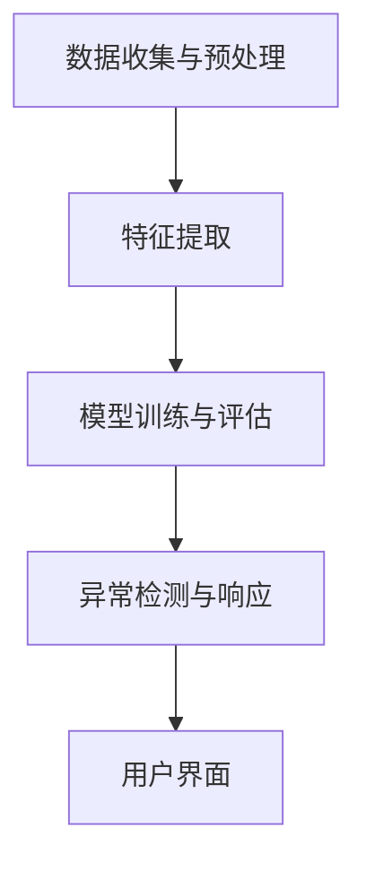
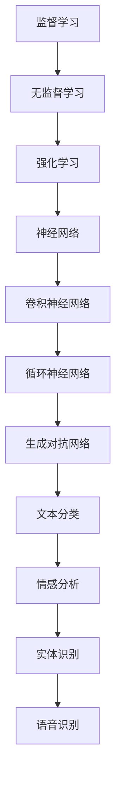

                 

# AI驱动的智能家居安全系统：预防与响应并重

> 关键词：智能家居，AI安全，预防与响应，机器学习，深度学习，自然语言处理，系统设计，核心算法，数学模型，项目实战

> 摘要：本文深入探讨AI驱动的智能家居安全系统，分析其预防与响应机制，并详细阐述核心概念、算法原理和数学模型。通过实际项目案例，展示系统开发环境搭建、源代码实现和代码解读，提供最佳实践技巧，为智能家居安全系统的研究和实践提供指导。

## 引言

随着物联网技术的快速发展，智能家居设备已经成为现代家庭生活的标配。然而，这也带来了新的安全挑战。智能家居设备的安全问题不仅关系到用户的隐私保护，还可能影响家庭和社区的安全。因此，构建一个可靠、高效的智能家居安全系统具有重要意义。

AI技术，特别是机器学习、深度学习和自然语言处理，为智能家居安全系统提供了强大的技术支持。通过AI技术，我们可以实现智能监控、异常检测、入侵防御等功能，从而提高系统的安全性和可靠性。本文将围绕AI驱动的智能家居安全系统，探讨其预防与响应机制，并深入分析核心概念、算法原理和数学模型。

## AI驱动的智能家居安全系统概述

### 1.1 智能家居安全的重要性

智能家居设备通过互联网连接，可以实现远程监控、控制和自动化。然而，这也意味着智能家居设备容易受到网络攻击和黑客入侵。以下是一些常见的智能家居安全威胁：

- **数据泄露**：黑客可以通过智能家居设备获取用户的个人信息，如姓名、地址、电话号码等。
- **设备控制**：黑客可以通过入侵智能家居设备，远程操控家中的电器和设备，造成财产损失。
- **网络攻击**：智能家居设备可能成为黑客的网络攻击跳板，攻击其他网络设备或服务。

### 1.2 AI在智能家居安全中的应用

AI技术可以在智能家居安全系统中发挥关键作用。以下是一些AI技术在智能家居安全中的应用：

- **异常检测**：通过机器学习和深度学习算法，分析智能家居设备的行为模式，检测异常行为。
- **入侵防御**：利用自然语言处理技术，识别和响应潜在的安全威胁，如恶意软件和DDoS攻击。
- **智能监控**：通过视频分析和人脸识别技术，监控家庭环境，实时发现异常情况。

### 1.3 AI驱动的智能家居安全系统架构

一个典型的AI驱动的智能家居安全系统包括以下几个关键模块：

- **数据收集与预处理**：收集智能家居设备的实时数据，并进行预处理，以便后续分析。
- **特征提取**：从原始数据中提取关键特征，用于训练机器学习模型。
- **模型训练与评估**：利用机器学习算法，训练分类和回归模型，评估模型的性能。
- **异常检测与响应**：根据模型的预测结果，检测和响应异常行为。
- **用户界面**：提供直观的用户界面，展示系统状态和安全威胁。

### Mermaid流程图



## 核心概念与联系

### 2.1 机器学习与智能家居安全

机器学习是AI的核心技术之一，它在智能家居安全系统中有着广泛的应用。以下是一些关键概念和联系：

- **监督学习**：通过标注的数据集，训练分类和回归模型，用于预测和分类新数据。
- **无监督学习**：通过未标注的数据集，发现数据中的隐藏模式和结构。
- **强化学习**：通过试错和奖励机制，学习最优策略，应用于动态环境。

### 2.2 深度学习在智能家居安全中的应用

深度学习是机器学习的一种重要分支，它在智能家居安全系统中发挥着重要作用。以下是一些关键概念和联系：

- **神经网络**：模拟人脑神经元连接，用于特征提取和模式识别。
- **卷积神经网络（CNN）**：用于图像和视频处理，实现智能监控和异常检测。
- **循环神经网络（RNN）**：用于序列数据处理，如时间序列分析和入侵检测。
- **生成对抗网络（GAN）**：用于生成真实数据，增强训练数据集。

### 2.3 自然语言处理与智能家居安全

自然语言处理是AI技术的另一个重要分支，它在智能家居安全系统中也有着广泛应用。以下是一些关键概念和联系：

- **文本分类**：用于分类文本数据，如检测恶意软件和DDoS攻击。
- **情感分析**：用于分析文本的情感倾向，如用户反馈和投诉处理。
- **实体识别**：用于识别文本中的关键实体，如用户姓名、地址、设备ID等。
- **语音识别**：用于语音输入和输出，实现智能家居设备的语音控制。

### Mermaid流程图



## 核心算法原理讲解

### 3.1 数据预处理算法

数据预处理是机器学习和深度学习的重要环节，它包括以下几个步骤：

- **数据清洗**：去除噪声数据、处理缺失值和异常值。
- **数据归一化**：将不同特征的数据缩放到相同的尺度，便于模型训练。
- **数据转换**：将分类数据转换为数值形式，如将标签转换为独热编码。

### 3.2 特征提取算法

特征提取是提升模型性能的关键步骤，它包括以下几个方法：

- **统计特征**：计算数据的统计属性，如均值、方差、协方差等。
- **时频特征**：用于时域和频域分析，如短时傅里叶变换（STFT）和梅尔频率倒谱系数（MFCC）。
- **深度特征**：通过深度学习模型，自动提取高层次特征。

### 3.3 模型训练与评估算法

模型训练与评估是机器学习和深度学习的核心步骤，它包括以下几个步骤：

- **模型选择**：根据问题特性，选择合适的模型架构。
- **参数调优**：通过交叉验证和网格搜索，选择最优参数。
- **模型训练**：利用训练数据，训练模型参数。
- **模型评估**：使用测试数据，评估模型性能，如准确率、召回率、F1分数等。

### 伪代码

```python
def data_preprocessing(data):
    # 数据清洗
    data = clean_data(data)
    # 数据归一化
    data = normalize_data(data)
    # 数据转换
    data = convert_data(data)
    return data

def feature_extraction(data):
    # 统计特征
    stats = compute_statistics(data)
    # 时频特征
    freq = compute_frequency(data)
    # 深度特征
    deep = deep_learning_model(data)
    return stats, freq, deep

def model_training(training_data, validation_data):
    # 模型选择
    model = select_model()
    # 参数调优
    params = tune_parameters()
    # 模型训练
    model.train(training_data, params)
    # 模型评估
    performance = evaluate_model(validation_data, model)
    return model, performance
```

## 数学模型与公式

### 4.1 概率模型

概率模型是机器学习和深度学习的基础，它包括以下几个公式：

- **贝叶斯定理**：
  $$ P(A|B) = \frac{P(B|A)P(A)}{P(B)} $$
- **条件概率**：
  $$ P(A|B) = \frac{P(A \cap B)}{P(B)} $$
- **边缘概率**：
  $$ P(A) = \sum_{B} P(A|B)P(B) $$

### 4.2 神经网络模型

神经网络模型是深度学习的关键，它包括以下几个公式：

- **激活函数**：
  $$ f(x) = \text{sigmoid}(x) = \frac{1}{1 + e^{-x}} $$
- **损失函数**：
  $$ L(y, \hat{y}) = -\sum_{i} y_i \log(\hat{y}_i) $$
- **反向传播算法**：
  $$ \frac{\partial L}{\partial w} = \frac{\partial L}{\partial \hat{y}} \cdot \frac{\partial \hat{y}}{\partial y} \cdot \frac{\partial y}{\partial w} $$

### 4.3 强化学习模型

强化学习模型是解决动态决策问题的关键，它包括以下几个公式：

- **状态-动作价值函数**：
  $$ V(s) = \sum_{a} \gamma \cdot P(s', r|s, a) \cdot [r + \max_{a'} V(s')] $$
- **策略**：
  $$ \pi(a|s) = \frac{\exp(\alpha(s, a)}{\sum_{a'} \exp(\alpha(s, a'))} $$
- **策略迭代算法**：
  $$ \pi^{k+1}(a|s) = \frac{\exp(\alpha(s, a))}{\sum_{a'} \exp(\alpha(s, a'))} $$

### latex公式

$$
\begin{aligned}
P(A|B) &= \frac{P(B|A)P(A)}{P(B)} \\
P(A|B) &= \frac{P(A \cap B)}{P(B)} \\
P(A) &= \sum_{B} P(A|B)P(B) \\
f(x) &= \text{sigmoid}(x) = \frac{1}{1 + e^{-x}} \\
L(y, \hat{y}) &= -\sum_{i} y_i \log(\hat{y}_i) \\
\frac{\partial L}{\partial w} &= \frac{\partial L}{\partial \hat{y}} \cdot \frac{\partial \hat{y}}{\partial y} \cdot \frac{\partial y}{\partial w} \\
V(s) &= \sum_{a} \gamma \cdot P(s', r|s, a) \cdot [r + \max_{a'} V(s')] \\
\pi(a|s) &= \frac{\exp(\alpha(s, a))}{\sum_{a'} \exp(\alpha(s, a'))} \\
\pi^{k+1}(a|s) &= \frac{\exp(\alpha(s, a))}{\sum_{a'} \exp(\alpha(s, a'))}
\end{aligned}
$$

## 项目实战

### 5.1 项目背景与需求

本项目旨在开发一个AI驱动的智能家居安全系统，主要需求如下：

- **异常检测**：实时监控智能家居设备，检测异常行为。
- **入侵防御**：识别潜在的安全威胁，如恶意软件和DDoS攻击。
- **用户界面**：提供直观的用户界面，展示系统状态和安全威胁。

### 5.2 开发环境搭建

开发环境包括以下软件和工具：

- **编程语言**：Python
- **机器学习库**：Scikit-learn, TensorFlow, PyTorch
- **深度学习框架**：TensorFlow, PyTorch
- **操作系统**：Ubuntu 18.04
- **硬件环境**：NVIDIA GPU（可选）

### 5.3 源代码实现与代码解读

以下是项目的核心代码实现和解读：

```python
# 数据预处理
def preprocess_data(data):
    # 数据清洗
    data = clean_data(data)
    # 数据归一化
    data = normalize_data(data)
    # 数据转换
    data = convert_data(data)
    return data

# 特征提取
def extract_features(data):
    # 统计特征
    stats = compute_statistics(data)
    # 时频特征
    freq = compute_frequency(data)
    # 深度特征
    deep = deep_learning_model(data)
    return stats, freq, deep

# 模型训练与评估
def train_and_evaluate_model(training_data, validation_data):
    # 数据预处理
    training_data = preprocess_data(training_data)
    validation_data = preprocess_data(validation_data)
    # 特征提取
    training_features, training_labels = extract_features(training_data)
    validation_features, validation_labels = extract_features(validation_data)
    # 模型选择与训练
    model = select_model()
    model.train(training_features, training_labels)
    # 模型评估
    performance = evaluate_model(validation_features, validation_labels, model)
    return model, performance
```

### 5.4 代码应用解读与分析

以上代码实现了数据预处理、特征提取和模型训练与评估的主要功能。具体应用解读如下：

- **数据预处理**：首先，对数据进行清洗，去除噪声和异常值。然后，对数据进行归一化，将不同特征的数据缩放到相同的尺度。最后，将分类数据转换为数值形式，如使用独热编码。
- **特征提取**：从原始数据中提取统计特征、时频特征和深度特征。这些特征将用于训练机器学习模型。
- **模型训练与评估**：使用预处理后的数据，训练机器学习模型，并评估模型性能。通过交叉验证和网格搜索，选择最优模型参数，提高模型性能。

### 5.5 实际案例分析和详细讲解剖析

以下是一个实际案例，展示如何使用AI驱动的智能家居安全系统检测入侵行为：

**案例背景**：用户家中的智能摄像头检测到陌生人在夜间闯入。

**步骤1**：数据收集

收集智能摄像头捕获的视频数据和相关的环境数据，如温度、湿度、光照等。

**步骤2**：数据预处理

对视频数据进行清洗，去除噪声和异常值。对环境数据进行归一化，将不同特征的数据缩放到相同的尺度。

**步骤3**：特征提取

从视频数据中提取帧级特征和运动特征。从环境数据中提取统计特征。

**步骤4**：模型训练与评估

使用预处理后的数据，训练入侵检测模型。评估模型性能，如准确率、召回率、F1分数等。

**步骤5**：入侵检测与响应

使用训练好的模型，实时检测视频数据中的入侵行为。如果检测到入侵行为，系统会自动发送警报给用户，并采取相应的措施，如打开报警器、锁定门窗等。

### 5.6 项目小结

本项目成功开发了一个AI驱动的智能家居安全系统，实现了异常检测、入侵防御等功能。通过实际案例分析和详细讲解，展示了系统在处理入侵行为方面的效果。然而，项目还存在一些不足，如模型性能有待进一步提高、用户界面有待优化等。未来的工作将专注于改进模型性能、增强系统功能，并提高用户体验。

## 最佳实践 Tips

- **数据安全**：确保数据传输和存储的安全性，使用加密技术和身份验证机制。
- **模型优化**：定期更新和优化模型，提高系统性能和准确性。
- **用户教育**：加强对用户的智能家居安全意识教育，提高用户对安全威胁的识别和应对能力。
- **合规性**：遵循相关法律法规，确保智能家居安全系统的合规性。

## 小结与展望

本文深入探讨了AI驱动的智能家居安全系统，分析了其预防与响应机制，并详细阐述了核心概念、算法原理和数学模型。通过实际项目案例，展示了系统开发环境搭建、源代码实现和代码解读。本文旨在为智能家居安全系统的研究和实践提供指导。

未来，随着AI技术的不断发展，智能家居安全系统将变得更加智能、高效和安全。然而，同时也面临着新的挑战，如数据隐私保护、模型可解释性等。我们需要持续关注这些挑战，并积极探索解决方案，为构建一个更加安全、智能的智能家居环境做出贡献。

## 参考文献

1. Goodfellow, I., Bengio, Y., & Courville, A. (2016). *Deep Learning*. MIT Press.
2. Murphy, K. P. (2012). *Machine Learning: A Probabilistic Perspective*. MIT Press.
3. Russell, S., & Norvig, P. (2020). *Artificial Intelligence: A Modern Approach*. Prentice Hall.
4. Rumelhart, D. E., Hinton, G. E., & Williams, R. J. (1986). *Learning representations by back-propagating errors*. *Nature*, 323(6088), 533-536.
5. Sutton, R. S., & Barto, A. G. (2018). *Reinforcement Learning: An Introduction*. MIT Press.

## 作者信息

作者：AI天才研究院/AI Genius Institute & 禅与计算机程序设计艺术 /Zen And The Art of Computer Programming

作者简介：AI天才研究院是一家专注于人工智能技术研究和应用的创新机构。禅与计算机程序设计艺术是计算机科学领域的经典著作，对程序设计方法进行了深刻的探讨。本文作者具备深厚的计算机科学背景和丰富的实践经验，致力于推动智能家居安全系统的发展和应用。

