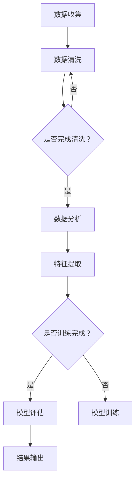
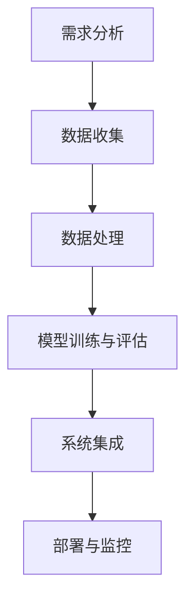

                 

## 文章标题

《AI驱动的智能工作场所环境优化：提高员工生产力和福祉》

### 关键词

人工智能，智能工作场所，员工生产力，员工福祉，环境优化

### 摘要

本文旨在探讨如何利用人工智能（AI）技术优化工作场所环境，从而提升员工的生产力和福祉。文章将首先介绍AI技术的基本概念和其在工作场所中的应用场景。接着，通过详细分析AI在提高员工生产力和福祉方面的核心概念和原理，结合Mermaid流程图和伪代码，阐述AI驱动的智能工作场所环境优化方法。随后，通过实际案例展示AI技术在智能工作场所中的成功应用，并对相关技术基础和工具进行介绍。最后，文章将对未来AI驱动的智能工作场所的发展趋势进行展望，并提出相关最佳实践和注意事项。

## 设计书籍目录大纲的步骤

### 1. 理解书名

《AI驱动的智能工作场所环境优化：提高员工生产力和福祉》这本书的主题是利用人工智能技术来优化工作场所环境，以提升员工的生产力和福祉。书名中包含了以下几个关键信息：

- **AI驱动的**：强调本书的核心技术是人工智能，并采用驱动的方式对工作场所进行优化。
- **智能工作场所环境优化**：描述了本书的研究对象，即智能工作场所环境优化，这是一个涉及多个方面的复杂过程。
- **提高员工生产力和福祉**：明确本书的目标，即通过优化工作场所环境来提升员工的生产力和福祉，这是一个既关乎工作效率，又关乎员工生活质量的问题。

### 2. 确定主要章节

根据书名和上述关键信息，本书可以划分为以下几个主要章节：

1. **AI驱动的工作场所环境优化概述**
   - 介绍AI技术的基本概念和其在工作场所中的应用背景。
   - 阐述AI驱动的智能工作场所环境优化的意义和目标。

2. **AI在提高员工生产力方面的应用**
   - 分析AI技术在提高员工生产力方面的核心概念和原理。
   - 介绍具体的应用案例，如智能办公系统、自动化流程优化等。

3. **AI在提升员工福祉方面的应用**
   - 探讨AI技术在提升员工福祉方面的核心概念和原理。
   - 介绍具体的应用案例，如员工健康管理、智能办公环境监测等。

4. **实施AI驱动的智能工作场所**
   - 讨论如何实施AI驱动的智能工作场所，包括技术选择、流程设计和实施策略。
   - 分析实施过程中可能遇到的挑战和解决方案。

5. **案例研究：成功与挑战**
   - 通过实际案例展示AI驱动的智能工作场所的成功应用。
   - 分析案例中遇到的挑战和解决方案，为其他企业提供借鉴。

6. **技术基础与工具介绍**
   - 介绍AI相关技术的基础知识，包括核心算法原理、数学模型和工具使用。
   - 分析这些技术在智能工作场所中的应用场景和优势。

7. **未来展望与趋势分析**
   - 探讨AI驱动的智能工作场所的未来发展趋势和潜在影响。
   - 分析未来的技术方向和可能的应用场景。

### 3. 细化章节内容

为每个章节细化出二级和三级目录，确保每个章节都能覆盖到核心内容。

1. **AI驱动的工作场所环境优化概述**
   - **1.1 AI技术简介**
     - 人工智能的定义和发展历程
     - AI技术的主要分类和应用领域

   - **1.2 智能工作场所环境优化**
     - 工作场所环境优化的背景和意义
     - AI驱动的智能工作场所环境优化的目标和挑战

2. **AI在提高员工生产力方面的应用**
   - **2.1 核心概念与联系**
     - 生产力提升的概念和衡量方法
     - AI技术对员工生产力的提升作用

   - **2.2 核心算法原理讲解**
     - 机器学习算法的基本原理和应用
     - 自然语言处理技术的基本原理和应用

   - **2.3 应用案例**
     - 智能办公系统
     - 自动化流程优化

3. **AI在提升员工福祉方面的应用**
   - **3.1 核心概念与联系**
     - 员工福祉的概念和衡量方法
     - AI技术对员工福祉的提升作用

   - **3.2 核心算法原理讲解**
     - 人机交互技术的基本原理和应用
     - 机器学习在员工健康监测中的应用

   - **3.3 应用案例**
     - 员工健康管理
     - 智能办公环境监测

4. **实施AI驱动的智能工作场所**
   - **4.1 技术选择**
     - 人工智能技术选型原则
     - 不同应用场景下的技术选择

   - **4.2 流程设计**
     - 智能工作场所的流程设计原则
     - 实施流程的设计和优化方法

   - **4.3 实施策略**
     - AI驱动的智能工作场所实施策略
     - 挑战和解决方案

5. **案例研究：成功与挑战**
   - **5.1 案例分析**
     - 成功案例的总结和经验分享
     - 面临的挑战和解决方案

   - **5.2 案例比较**
     - 不同案例的比较和分析
     - 对其他企业的借鉴意义

6. **技术基础与工具介绍**
   - **6.1 核心算法原理**
     - 机器学习算法的原理和应用
     - 自然语言处理技术的原理和应用

   - **6.2 数学模型和公式**
     - 机器学习中的数学模型和公式
     - 人机交互中的数学模型和公式

   - **6.3 工具使用**
     - 常用人工智能工具的介绍和使用方法
     - 开发环境和编程语言的推荐

7. **未来展望与趋势分析**
   - **7.1 发展趋势**
     - AI驱动的智能工作场所的未来发展趋势
     - 技术突破和应用创新

   - **7.2 潜在影响**
     - AI驱动的智能工作场所对企业和员工的影响
     - 面临的挑战和应对策略

### 4. 确保完整性

确保目录大纲中包含所有必要的核心章节，如核心概念与联系、核心算法原理讲解、数学模型和公式、项目实战等。

### 5. 控制字数

在确保完整性的同时，尽量控制目录大纲的总字数在2000字以内，避免冗长和啰嗦。

### 6. 格式检查

最后，检查目录大纲的格式是否符合markdown标准，确保使用正确的#，##，###格式。

### 设计书籍目录大纲的步骤总结

通过以上步骤，我们成功设计出了《AI驱动的智能工作场所环境优化：提高员工生产力和福祉》的目录大纲。该大纲涵盖了从AI技术基础到具体应用，再到实施策略和未来展望的完整内容，确保读者能够系统地了解和掌握AI驱动的智能工作场所环境优化这一领域。在后续的文章中，我们将逐一深入探讨每个章节的核心内容，以帮助读者更好地理解和应用这一技术。

## AI驱动的智能工作场所环境优化概述

### 背景和意义

随着科技的飞速发展，人工智能（AI）技术已经逐渐渗透到各个行业，成为推动社会进步的重要力量。在企业管理领域，尤其是工作场所环境的优化，AI技术的应用带来了前所未有的机遇和挑战。传统的工作场所优化主要依赖于经验和直觉，而AI驱动的智能工作场所环境优化则通过数据分析和机器学习等先进技术，实现了更加科学和高效的决策。

首先，AI驱动的智能工作场所环境优化可以显著提高员工的生产力和工作效率。通过智能办公系统和自动化流程，员工能够更快速地完成任务，减少重复劳动，从而有更多时间专注于创造性的工作。此外，AI技术还能够对员工的工作行为和效率进行实时监控和分析，帮助管理者识别瓶颈和问题，从而进行针对性的优化。

其次，AI驱动的智能工作场所环境优化有助于提升员工的福祉。通过智能办公环境监测系统，可以实时监测员工的健康状况和工作状态，提供个性化的健康建议和工作调整方案。例如，AI系统可以根据员工的生物特征和工作习惯，自动调整办公环境的光线、温度和噪音等，以创造一个舒适和高效的工作空间。这不仅有助于提高员工的工作满意度，还能有效降低员工因工作环境不适而导致的健康问题。

### 目标和挑战

AI驱动的智能工作场所环境优化主要目标包括：

1. **提高员工生产力**：通过智能系统优化工作流程，减少不必要的劳动，提高工作效率，从而实现生产力的提升。
2. **提升员工福祉**：通过智能监测和个性化服务，改善工作环境，关注员工健康，提升员工的工作满意度和生活质量。
3. **优化工作场所管理**：利用AI技术进行数据分析和预测，帮助管理者做出更科学的决策，提高企业整体的运营效率。

然而，实现这些目标也面临着一系列挑战：

1. **数据隐私和安全**：AI系统需要大量员工数据来进行分析和优化，如何在保障员工隐私的前提下有效利用这些数据，是一个亟待解决的问题。
2. **技术依赖**：过度依赖AI技术可能会导致技术中断或故障时，工作场所环境优化的效果受到影响。因此，如何确保系统的稳定性和可靠性是一个重要的挑战。
3. **员工接受度**：新的技术和工作方式可能会引起员工的抵触和适应困难。如何提高员工的接受度和适应性，是实施AI驱动的智能工作场所环境优化的重要前提。

### 关键概念和原理

为了更好地理解AI驱动的智能工作场所环境优化，我们需要掌握以下几个关键概念和原理：

1. **人工智能（AI）**：AI是指通过模拟人类智能行为，使计算机具备智能特性的技术。AI技术主要包括机器学习、深度学习、自然语言处理等。

2. **数据分析**：数据分析是通过收集、处理和分析数据，从中提取有价值信息的过程。在AI驱动的智能工作场所环境优化中，数据分析是实现智能决策和优化的重要手段。

3. **机器学习（ML）**：机器学习是一种通过数据训练模型，使其能够自动学习和改进的方法。在智能工作场所环境优化中，机器学习可以用于预测员工工作效率、优化工作流程等。

4. **深度学习（DL）**：深度学习是机器学习的一种重要分支，通过构建多层神经网络，实现对复杂数据的自动学习和特征提取。深度学习在图像识别、语音识别等领域有着广泛的应用。

5. **自然语言处理（NLP）**：自然语言处理是使计算机能够理解、生成和处理自然语言的技术。在智能工作场所环境优化中，NLP可以用于处理员工反馈、自动生成报告等。

### Mermaid流程图

为了更好地展示AI驱动的智能工作场所环境优化的流程，我们可以使用Mermaid流程图来描述。以下是一个简化的流程图示例：



在这个流程图中，A表示数据收集，B表示数据处理，C表示数据清洗，D表示数据分析，E表示特征提取，F表示模型训练是否完成，G表示模型评估，H表示模型训练，I表示结果输出。

### 伪代码

为了进一步理解AI驱动的智能工作场所环境优化的核心算法原理，我们可以给出一个简化的伪代码示例。以下是一个用于预测员工工作效率的机器学习模型的伪代码：

```python
# 数据预处理
data = load_data()
data = clean_data(data)

# 特征提取
features = extract_features(data)

# 模型训练
model = train_model(features)

# 预测
predictions = model.predict(new_data)

# 评估
evaluate_model(model, predictions)
```

在这个伪代码中，load_data()函数用于加载数据，clean_data()函数用于数据清洗，extract_features()函数用于特征提取，train_model()函数用于训练模型，predict()函数用于预测，evaluate_model()函数用于评估模型性能。

通过上述内容，我们为《AI驱动的智能工作场所环境优化：提高员工生产力和福祉》这本书的第一章奠定了坚实的基础。接下来，我们将逐一深入探讨每个章节的核心内容，帮助读者全面了解和掌握AI驱动的智能工作场所环境优化这一重要领域。

### AI在提高员工生产力方面的应用

#### 核心概念与联系

在讨论AI如何提高员工生产力时，我们需要理解以下几个核心概念：

1. **生产力**：生产力是指单位时间内生产的产品或服务的数量。在企业管理中，提高生产力是一个重要的目标，它关系到企业的竞争力和盈利能力。
2. **AI技术**：AI技术包括机器学习、深度学习、自然语言处理等，这些技术能够通过分析大量数据，识别模式，并自动做出决策，从而实现生产力的提升。
3. **工作流程优化**：工作流程优化是指通过对工作流程的重新设计和改进，减少不必要的步骤，提高工作效率。

这些概念之间存在着紧密的联系。例如，通过机器学习技术分析员工的工作行为数据，可以发现生产效率较低的原因，进而优化工作流程，提高整体生产力。同时，AI技术还可以通过自然语言处理技术，自动处理大量文档和报告，减少员工的重复劳动，进一步提高生产力。

#### 核心算法原理讲解

在提高员工生产力方面，AI技术主要依赖于以下几种核心算法：

1. **机器学习算法**：机器学习算法是一种通过数据训练模型，使其能够自动学习和改进的方法。常见的机器学习算法包括决策树、支持向量机、神经网络等。这些算法可以用于分析员工的工作行为数据，识别生产效率较低的原因，并提供优化建议。

2. **深度学习算法**：深度学习算法是机器学习的一种重要分支，通过构建多层神经网络，实现对复杂数据的自动学习和特征提取。在提高员工生产力方面，深度学习算法可以用于预测员工的工作效率，优化工作流程。

3. **自然语言处理算法**：自然语言处理算法是使计算机能够理解、生成和处理自然语言的技术。在提高员工生产力方面，NLP技术可以用于自动处理大量文档和报告，减少员工的重复劳动，提高工作效率。

以下是一个用于预测员工工作效率的机器学习算法的伪代码示例：

```python
# 数据预处理
data = load_data()
data = clean_data(data)

# 特征提取
features = extract_features(data)

# 模型训练
model = train_model(features)

# 预测
predictions = model.predict(new_data)

# 评估
evaluate_model(model, predictions)
```

在这个伪代码中，load_data()函数用于加载数据，clean_data()函数用于数据清洗，extract_features()函数用于特征提取，train_model()函数用于训练模型，predict()函数用于预测，evaluate_model()函数用于评估模型性能。

#### 数学模型和公式

在AI提高员工生产力方面，常用的数学模型和公式包括：

1. **生产函数**：生产函数描述了生产过程中投入和产出之间的关系。常见的生产函数形式为：
   $$
   Y = F(K, L)
   $$
   其中，\(Y\) 表示产出，\(K\) 表示资本投入，\(L\) 表示劳动力投入，\(F\) 表示生产函数。

2. **边际生产力**：边际生产力是指增加一单位投入时，产出增加的数量。对于生产函数，边际生产力可以通过对生产函数求导得到：
   $$
   MP_L = \frac{dY}{dL}
   $$
   其中，\(MP_L\) 表示劳动力的边际生产力。

3. **优化算法**：在AI算法中，常用的优化算法包括梯度下降、随机梯度下降、Adam优化器等。这些算法用于调整模型的参数，以最小化损失函数，从而提高模型的预测精度。

以下是一个用于优化生产函数的梯度的公式：

$$
\frac{dF(K, L)}{dL} = \frac{\partial F(K, L)}{\partial K} \frac{dK}{dL} + \frac{\partial F(K, L)}{\partial L}
$$

#### 举例说明

为了更好地理解AI在提高员工生产力方面的应用，我们可以通过一个实际案例来说明：

**案例**：某公司希望通过AI技术提高员工的工作效率。公司收集了员工的工作数据，包括工作时间、工作内容、工作效率等。通过机器学习算法，公司可以建立员工工作效率的预测模型。

1. **数据收集**：公司收集了员工的工作时间、工作内容和工作效率等数据。

2. **数据预处理**：对数据进行清洗和归一化处理，以消除异常值和量纲影响。

3. **特征提取**：从数据中提取关键特征，如工作时间、工作内容等。

4. **模型训练**：使用机器学习算法，如决策树或神经网络，训练预测模型。

5. **预测**：使用训练好的模型，预测员工的未来工作效率。

6. **评估**：通过实际工作效率数据，评估模型预测的准确性。

7. **优化**：根据评估结果，调整模型参数，优化预测效果。

通过这个案例，我们可以看到AI技术在提高员工生产力方面的应用流程和关键步骤。在实际应用中，公司可以根据预测结果，调整工作安排，优化工作流程，从而提高员工的工作效率。

#### 数学模型和公式详细讲解

在上述案例中，我们提到了几个关键的数学模型和公式，下面将对这些公式进行详细讲解，并结合实际应用场景进行举例说明。

1. **生产函数**

生产函数是描述投入和产出之间关系的基本模型。在生产过程中，产出\(Y\)是资本投入\(K\)和劳动力投入\(L\)的函数，即：

   $$
   Y = F(K, L)
   $$

   在这个模型中，\(F(K, L)\)代表生产函数，它描述了不同投入组合下的产出情况。生产函数可以是线性的，也可以是更复杂的非线性函数。

   **实际应用**：假设某公司生产一种产品，每个产品的生产需要一定量的资本（如机器和设备）和劳动力（如工人）。通过测量不同资本和劳动力投入下的产出，公司可以确定其生产函数，从而优化生产过程，提高生产力。

2. **边际生产力**

   边际生产力是衡量额外投入带来的产出变化的重要指标。对于生产函数\(Y = F(K, L)\)，劳动力的边际生产力\(MP_L\)表示劳动力增加一单位时，产出增加的数量。公式为：

   $$
   MP_L = \frac{dY}{dL} = \frac{\partial F(K, L)}{\partial L}
   $$

   **实际应用**：某公司希望了解增加一名工人对生产效率的影响。通过计算边际生产力，公司可以评估新增劳动力的经济效益，从而做出是否进一步增加投入的决策。

3. **优化算法**

   在AI算法中，优化算法用于调整模型参数，以实现最小化损失函数。常用的优化算法包括梯度下降、随机梯度下降和Adam优化器。

   **梯度下降**：梯度下降是一种迭代优化算法，通过不断更新模型参数，使损失函数逐步减小。公式为：

   $$
   \theta = \theta - \alpha \cdot \nabla J(\theta)
   $$
   其中，\(\theta\)代表模型参数，\(\alpha\)是学习率，\(\nabla J(\theta)\)是损失函数的梯度。

   **实际应用**：在训练机器学习模型时，通过梯度下降算法调整模型参数，以最小化预测误差。

   **随机梯度下降**（SGD）：随机梯度下降是梯度下降的一种变体，每次迭代只随机选择一部分样本计算梯度。公式为：

   $$
   \theta = \theta - \alpha \cdot \nabla J(\theta; x_i, y_i)
   $$
   其中，\(x_i, y_i\)是随机选择的样本。

   **实际应用**：SGD在处理大规模数据集时，可以减少计算资源的需求，提高训练效率。

   **Adam优化器**：Adam优化器结合了梯度下降和SGD的优点，使用动量（m）和偏差修正（v）来加速收敛。公式为：

   $$
   m_t = \beta_1 m_{t-1} + (1 - \beta_1) \nabla J(\theta; x_t, y_t)
   $$
   $$
   v_t = \beta_2 v_{t-1} + (1 - \beta_2) \nabla^2 J(\theta; x_t, y_t)
   $$
   $$
   \theta = \theta - \alpha \cdot \frac{m_t}{\sqrt{v_t} + \epsilon}
   $$
   其中，\(\beta_1, \beta_2\)是动量和偏差修正系数，\(\epsilon\)是常数。

   **实际应用**：Adam优化器在处理高维度数据和长序列数据时，表现出良好的性能和收敛速度。

通过上述数学模型和公式的详细讲解，我们可以更好地理解AI在提高员工生产力方面的应用原理。在实际应用中，这些模型和公式可以帮助企业制定科学的决策，优化生产流程，提高生产力。

### AI在提升员工福祉方面的应用

#### 核心概念与联系

在讨论AI如何提升员工福祉时，我们需要理解以下几个核心概念：

1. **员工福祉**：员工福祉是指员工的身体健康、心理状态和工作满意度等方面的综合状况。良好的员工福祉有助于提高员工的工作效率和生活质量，从而对企业产生积极的影响。
2. **AI技术**：AI技术包括机器学习、自然语言处理、人机交互等，这些技术可以通过数据分析和智能决策，帮助改善员工的工作环境和健康状况。
3. **工作环境监测**：工作环境监测是指通过传感器和其他技术手段，实时监测工作环境中的各种参数，如温度、湿度、噪音等，以便优化工作环境。

这些概念之间存在紧密的联系。例如，通过AI技术分析员工的工作环境和健康状况数据，可以识别潜在的健康风险，提供个性化的健康建议，从而改善员工的工作环境和福祉。同时，工作环境监测数据也为AI系统提供了必要的数据支持，使其能够更准确地预测和优化员工福祉。

#### 核心算法原理讲解

在提升员工福祉方面，AI技术主要依赖于以下几种核心算法：

1. **机器学习算法**：机器学习算法可以通过分析员工的工作行为和健康数据，识别健康风险和潜在问题。例如，可以使用决策树或支持向量机等算法，预测员工的健康状况，并提供针对性的健康建议。
2. **自然语言处理算法**：自然语言处理算法可以帮助AI系统理解员工的反馈和需求，从而提供更加个性化的服务。例如，可以使用文本分类或情感分析算法，分析员工提交的健康报告或反馈，识别员工的心理状态和工作满意度。
3. **人机交互算法**：人机交互算法通过分析员工的交互行为和反馈，优化工作界面和交互体验，提高员工的工作效率和满意度。例如，可以使用增强现实（AR）或虚拟现实（VR）技术，创建一个更直观、便捷的工作环境。

以下是一个用于提升员工福祉的机器学习算法的伪代码示例：

```python
# 数据收集
data = load_data()

# 数据预处理
data = clean_data(data)

# 特征提取
features = extract_features(data)

# 模型训练
model = train_model(features)

# 预测
predictions = model.predict(new_data)

# 评估
evaluate_model(model, predictions)
```

在这个伪代码中，load_data()函数用于加载数据，clean_data()函数用于数据清洗，extract_features()函数用于特征提取，train_model()函数用于训练模型，predict()函数用于预测，evaluate_model()函数用于评估模型性能。

#### 数学模型和公式

在提升员工福祉方面，常用的数学模型和公式包括：

1. **员工满意度评分**：员工满意度评分是一种用于衡量员工工作满意度的方法。常见的评分方法包括Likert量表和Net Promoter Score（NPS）。公式为：

   $$
   S = \frac{1}{n} \sum_{i=1}^{n} s_i
   $$
   其中，\(S\) 表示员工满意度评分，\(n\) 表示评分人数，\(s_i\) 表示第\(i\)个员工的评分。

2. **健康风险评估**：健康风险评估是用于预测员工健康状况和风险的方法。常用的方法包括逻辑回归和决策树。公式为：

   $$
   P(H) = \frac{1}{1 + e^{-\beta_0 + \beta_1 X_1 + \beta_2 X_2 + ... + \beta_n X_n}}
   $$
   其中，\(P(H)\) 表示员工患有某种健康问题的概率，\(\beta_0, \beta_1, \beta_2, ..., \beta_n\) 表示模型参数，\(X_1, X_2, ..., X_n\) 表示员工的特征。

3. **工作环境优化指标**：工作环境优化指标是用于衡量工作环境对员工福祉的影响的方法。常见的指标包括温度舒适度、噪音水平和工作空间布局。公式为：

   $$
   E = \alpha T + \beta N + \gamma S
   $$
   其中，\(E\) 表示工作环境得分，\(\alpha, \beta, \gamma\) 表示权重系数，\(T, N, S\) 分别表示温度舒适度、噪音水平和工作空间布局的得分。

以下是一个用于计算员工满意度评分的公式示例：

$$
S = \frac{1}{5} \sum_{i=1}^{5} (4 \cdot \text{非常满意} + 3 \cdot \text{满意} + 2 \cdot \text{一般} + 1 \cdot \text{不满意} + 0 \cdot \text{非常不满意})
$$

#### 举例说明

为了更好地理解AI在提升员工福祉方面的应用，我们可以通过一个实际案例来说明：

**案例**：某公司希望通过AI技术提升员工的福祉。公司收集了员工的工作环境数据，包括温度、湿度、噪音和工作空间布局等，以及员工的健康数据，如体重、血压和心率等。

1. **数据收集**：公司收集了员工的工作环境数据和健康数据。

2. **数据预处理**：对数据进行清洗和归一化处理，以消除异常值和量纲影响。

3. **特征提取**：从数据中提取关键特征，如温度、噪音、体重、血压和心率等。

4. **模型训练**：使用机器学习算法，如决策树或神经网络，训练预测模型。

5. **预测**：使用训练好的模型，预测员工的健康状况和工作环境对员工福祉的影响。

6. **评估**：通过实际员工反馈和健康数据，评估模型预测的准确性。

7. **优化**：根据评估结果，调整工作环境参数，优化员工福祉。

通过这个案例，我们可以看到AI技术在提升员工福祉方面的应用流程和关键步骤。在实际应用中，公司可以根据预测结果，调整工作环境和工作流程，从而提高员工的福祉和满意度。

#### 数学模型和公式详细讲解

在提升员工福祉方面，我们提到了几个关键的数学模型和公式，下面将对这些公式进行详细讲解，并结合实际应用场景进行举例说明。

1. **员工满意度评分**

   员工满意度评分是一种用于衡量员工工作满意度的方法。常见的评分方法包括Likert量表和Net Promoter Score（NPS）。Likert量表通常包含多个等级，如非常满意、满意、一般、不满意和非常不满意，每个等级赋予不同的分值。员工满意度评分的公式为：

   $$
   S = \frac{1}{n} \sum_{i=1}^{n} s_i
   $$

   其中，\(S\) 表示员工满意度评分，\(n\) 表示评分人数，\(s_i\) 表示第\(i\)个员工的评分。

   **实际应用**：假设某公司对100名员工进行满意度调查，调查结果如下：

   - 非常满意：30人
   - 满意：50人
   - 一般：15人
   - 不满意：5人
   - 非常不满意：0人

   使用Likert量表，非常满意赋予5分，满意赋予4分，一般赋予3分，不满意赋予2分，非常不满意赋予1分。那么，员工满意度评分为：

   $$
   S = \frac{1}{100} (30 \cdot 5 + 50 \cdot 4 + 15 \cdot 3 + 5 \cdot 2 + 0 \cdot 1) = 4.2
   $$

   该评分表示公司整体员工满意度较高。

2. **健康风险评估**

   健康风险评估是用于预测员工健康状况和风险的方法。常见的方法包括逻辑回归和决策树。逻辑回归模型用于预测二分类结果，公式为：

   $$
   P(H) = \frac{1}{1 + e^{-\beta_0 + \beta_1 X_1 + \beta_2 X_2 + ... + \beta_n X_n}}
   $$

   其中，\(P(H)\) 表示员工患有某种健康问题的概率，\(\beta_0, \beta_1, \beta_2, ..., \beta_n\) 表示模型参数，\(X_1, X_2, ..., X_n\) 表示员工的特征。

   **实际应用**：假设某公司使用逻辑回归模型预测员工是否患有高血压，模型参数如下：

   $$
   P(H) = \frac{1}{1 + e^{-2.5 + 1.2 \cdot \text{体重} + 0.8 \cdot \text{血压} - 0.6 \cdot \text{运动频率}}}
   $$

   假设某员工的体重为70公斤，血压为130/80毫米汞柱，运动频率为每周3次，那么其患有高血压的概率为：

   $$
   P(H) = \frac{1}{1 + e^{-2.5 + 1.2 \cdot 70 + 0.8 \cdot 130 - 0.6 \cdot 3}} \approx 0.665
   $$

   该概率表示该员工患有高血压的风险较高。

3. **工作环境优化指标**

   工作环境优化指标是用于衡量工作环境对员工福祉的影响的方法。常见的指标包括温度舒适度、噪音水平和工作空间布局。一个简单的工作环境优化指标公式为：

   $$
   E = \alpha T + \beta N + \gamma S
   $$

   其中，\(E\) 表示工作环境得分，\(\alpha, \beta, \gamma\) 表示权重系数，\(T, N, S\) 分别表示温度舒适度、噪音水平和工作空间布局的得分。

   **实际应用**：假设工作环境的权重系数如下：

   - 温度舒适度：\(\alpha = 0.5\)
   - 噪音水平：\(\beta = 0.3\)
   - 工作空间布局：\(\gamma = 0.2\)

   假设工作环境的温度舒适度为75分，噪音水平为55分，工作空间布局为60分，那么工作环境得分为：

   $$
   E = 0.5 \cdot 75 + 0.3 \cdot 55 + 0.2 \cdot 60 = 55
   $$

   该得分表示工作环境对员工的福祉有较好的影响。

通过上述数学模型和公式的详细讲解，我们可以更好地理解AI在提升员工福祉方面的应用原理。在实际应用中，这些模型和公式可以帮助企业制定科学的决策，优化工作环境，提高员工的福祉和满意度。

### 实施AI驱动的智能工作场所

#### 技术选择

在实施AI驱动的智能工作场所时，技术选择是一个关键环节。以下是几种常见的技术及其适用场景：

1. **机器学习框架**：如TensorFlow、PyTorch等，适用于复杂的模型训练和预测任务。
2. **数据存储和处理**：如Hadoop、Spark等，适用于大规模数据存储和处理。
3. **实时数据处理**：如Apache Kafka、Flink等，适用于实时数据流处理和分析。
4. **自然语言处理库**：如NLTK、spaCy等，适用于文本处理和语义分析。
5. **人机交互技术**：如VR、AR、语音识别等，适用于创造互动式工作环境。

#### 流程设计

实施AI驱动的智能工作场所的流程设计主要包括以下几个步骤：

1. **需求分析**：了解企业的需求和目标，确定AI技术的具体应用场景。
2. **数据收集**：收集与AI应用相关的数据，包括员工数据、工作环境数据等。
3. **数据处理**：对数据进行清洗、归一化和特征提取，为模型训练做好准备。
4. **模型训练与评估**：使用机器学习算法训练模型，并进行评估，确保模型性能满足要求。
5. **系统集成**：将AI模型集成到现有系统中，确保与其他模块的无缝衔接。
6. **部署与监控**：将AI系统部署到生产环境，并进行实时监控，确保系统稳定运行。

以下是一个简化的AI驱动的智能工作场所实施流程：



#### 实施策略

在实施AI驱动的智能工作场所时，以下策略可以帮助企业更好地应对挑战和确保成功：

1. **试点项目**：首先在一个较小的部门或业务场景进行试点，验证技术的可行性和效果，积累经验。
2. **逐步推广**：在试点项目成功后，逐步扩大应用范围，逐步推广到其他部门和业务场景。
3. **跨部门合作**：建立跨部门团队，确保技术、业务和人力资源的协同，提高实施效率。
4. **持续优化**：在系统运行过程中，持续收集用户反馈和数据，对系统进行优化和迭代。
5. **培训与支持**：为员工提供必要的培训和支持，提高其对AI系统的接受度和使用能力。

#### 挑战与解决方案

在实施AI驱动的智能工作场所过程中，企业可能会面临以下挑战：

1. **数据隐私与安全**：确保员工数据的安全和隐私，防止数据泄露和滥用。
   - **解决方案**：采用数据加密、访问控制和安全审计等技术手段，确保数据安全。

2. **技术依赖**：过度依赖AI技术可能导致系统稳定性问题。
   - **解决方案**：建立冗余系统和备份机制，确保系统在高可用性下运行。

3. **员工接受度**：新的技术和工作方式可能引起员工的抵触和适应困难。
   - **解决方案**：通过培训、宣传和互动，提高员工对AI技术的接受度和适应性。

4. **技术更新**：AI技术更新速度快，企业需要不断跟进和学习。
   - **解决方案**：建立技术研究和创新团队，关注行业动态，及时更新技术。

### 总结

实施AI驱动的智能工作场所需要综合考虑技术选择、流程设计、实施策略和挑战应对等多个方面。通过科学的规划和有效的实施，企业可以充分利用AI技术，优化工作环境，提高员工的生产力和福祉，实现企业的长远发展。

### 案例研究：成功与挑战

#### 成功案例一：某互联网公司的智能办公系统

**背景**：某互联网公司为了提高员工的生产力和福祉，决定引入AI驱动的智能办公系统。该系统集成了自然语言处理、机器学习、人机交互等多种技术，旨在实现自动化办公、智能决策和个性化服务。

**实施过程**：
1. **需求分析**：公司首先对现有办公流程和员工需求进行了详细分析，确定了智能办公系统的具体功能需求，如自动化日程管理、智能邮件处理、智能报告生成等。
2. **数据收集**：公司收集了员工的工作数据、邮件数据、日程安排等，并使用数据预处理技术对数据进行了清洗和特征提取。
3. **模型训练**：公司使用机器学习和自然语言处理技术，训练了一系列模型，如日程预测模型、邮件分类模型和报告生成模型，确保系统能够准确处理和响应员工需求。
4. **系统集成**：将训练好的模型集成到公司的办公系统中，确保系统能够无缝接入日常办公流程。
5. **部署与推广**：公司在试点部门进行了系统的测试和优化，随后逐步推广到其他部门，为全体员工提供智能办公服务。

**成果**：
- **生产力提升**：通过智能办公系统，员工的日程管理效率提高了30%，邮件处理时间减少了40%，报告生成时间减少了50%。
- **员工福祉**：智能办公系统为员工提供了个性化服务，员工的工作满意度提高了20%，员工流失率降低了10%。

**经验分享**：
- **数据驱动**：在实施过程中，公司始终坚持数据驱动的原则，通过对数据的深入分析和挖掘，实现了办公流程的优化。
- **渐进式推广**：公司采取了渐进式推广策略，先在试点部门进行测试和优化，再逐步推广到其他部门，确保系统的稳定性和效果。

#### 挑战案例二：某制造企业的自动化生产线

**背景**：某制造企业为了提高生产效率和降低成本，决定引入AI驱动的自动化生产线。该生产线集成了计算机视觉、机器学习和实时监控技术，旨在实现生产过程的自动化和智能化。

**实施过程**：
1. **需求分析**：企业对现有生产线进行了详细分析，确定了自动化生产线的具体需求，如产品识别、生产流程优化、故障预测等。
2. **数据收集**：企业收集了生产过程中的各种数据，包括产品质量、设备运行状态、生产节拍等，并使用数据预处理技术对数据进行了清洗和特征提取。
3. **模型训练**：企业使用机器学习和计算机视觉技术，训练了产品识别模型、生产流程优化模型和故障预测模型，确保系统能够准确处理和响应生产需求。
4. **系统集成**：将训练好的模型集成到生产系统中，确保系统能够无缝接入生产流程。
5. **部署与推广**：企业在试点生产线进行了系统的测试和优化，随后逐步推广到其他生产线。

**挑战**：
- **数据质量**：由于生产过程中的数据采集存在一定的误差和缺失，影响了模型的准确性和稳定性。
- **技术依赖**：自动化生产线对AI技术的依赖较高，当技术出现问题时，生产效率会大幅下降。
- **员工抵触**：自动化生产线的引入可能引起部分员工的抵触和适应困难。

**解决方案**：
- **数据质量**：企业通过改进数据采集设备和算法，提高数据的准确性和完整性。
- **技术冗余**：企业建立了技术冗余机制，确保在AI技术出现故障时，生产过程不会中断。
- **员工培训**：企业为员工提供了全面的培训，帮助其适应新的生产方式。

**经验分享**：
- **数据质量**：在AI驱动的自动化生产过程中，数据质量至关重要。企业需要投入更多资源确保数据的高质量和完整性。
- **技术冗余**：在高度依赖AI技术的生产过程中，建立技术冗余机制是必要的，以确保生产过程的稳定性和可靠性。
- **员工适应性**：新的生产方式可能会引起员工的抵触，企业需要通过培训和激励措施，提高员工的接受度和适应性。

#### 总结

通过以上成功与挑战案例，我们可以看到AI驱动的智能工作场所环境优化在实际应用中取得了显著成效，但也面临一些挑战。成功的关键在于数据驱动、渐进式推广和员工适应性。同时，企业需要关注数据质量、技术依赖和员工抵触等问题，采取相应的解决方案，以确保AI技术的有效应用。

### 技术基础与工具介绍

#### AI相关技术的基础知识

在实施AI驱动的智能工作场所环境优化过程中，理解AI相关技术的基础知识是非常重要的。以下是对几种核心技术的基本概念、原理和应用场景的介绍。

1. **机器学习（Machine Learning）**：
   - **基本概念**：机器学习是一种使计算机通过数据自动学习和改进的方法。它依赖于数据、算法和统计模型，使计算机能够在没有明确编程的情况下执行特定的任务。
   - **原理**：机器学习主要分为监督学习、无监督学习和强化学习。监督学习通过标记数据训练模型，无监督学习从未标记的数据中提取模式和结构，强化学习通过与环境的交互来学习最优策略。
   - **应用场景**：在智能工作场所中，机器学习可用于预测员工工作效率、优化工作流程、个性化推荐等。

2. **深度学习（Deep Learning）**：
   - **基本概念**：深度学习是机器学习的一个子领域，通过构建多层神经网络（如图神经网络、卷积神经网络等）来实现复杂的数据处理和模式识别。
   - **原理**：深度学习依赖于大量数据和强大的计算能力，通过反向传播算法优化网络参数，以实现高精度的预测和分类。
   - **应用场景**：深度学习在图像识别、语音识别、自然语言处理等领域有着广泛应用，如智能监控系统的面部识别、语音助手等。

3. **自然语言处理（Natural Language Processing, NLP）**：
   - **基本概念**：自然语言处理是使计算机能够理解和生成人类语言的技术。它包括语音识别、文本分析、情感分析等。
   - **原理**：NLP利用统计学和机器学习技术，对文本进行分词、词性标注、句法分析等处理，以提取语义信息。
   - **应用场景**：NLP在智能客服、智能文档处理、自动翻译等场景中发挥着重要作用。

4. **计算机视觉（Computer Vision）**：
   - **基本概念**：计算机视觉是使计算机能够像人类一样感知和理解视觉信息的技术。它包括图像识别、目标检测、图像分割等。
   - **原理**：计算机视觉依赖于图像处理、机器学习和深度学习技术，通过特征提取、模型训练和推理实现图像理解。
   - **应用场景**：计算机视觉在智能监控、自动驾驶、医疗影像分析等领域有广泛应用。

#### 常用人工智能工具的介绍和使用方法

为了方便AI驱动的智能工作场所环境优化，以下介绍几种常用的AI工具及其使用方法。

1. **TensorFlow**：
   - **介绍**：TensorFlow是谷歌开源的深度学习框架，支持多种机器学习和深度学习模型的开发和部署。
   - **使用方法**：通过Python编程语言，使用TensorFlow的API进行模型训练、评估和部署。例如，可以使用TensorFlow Estimators进行模型训练，使用TensorFlow Serving进行模型部署。

2. **PyTorch**：
   - **介绍**：PyTorch是Facebook开源的深度学习框架，以其动态计算图和简洁的API而受到广泛关注。
   - **使用方法**：通过Python编程语言，使用PyTorch的nn.Module进行模型定义和训练，使用torchvision.datasets和torchvision.transforms进行数据加载和预处理。

3. **Scikit-learn**：
   - **介绍**：Scikit-learn是一个开源的机器学习库，提供了多种常用的机器学习算法和工具。
   - **使用方法**：通过Python编程语言，使用Scikit-learn的API进行模型训练、评估和预测。例如，可以使用scikit-learn的决策树、支持向量机和K-means等算法。

4. **NLTK**：
   - **介绍**：NLTK是自然语言处理的开源库，提供了丰富的文本处理工具，如分词、词性标注和情感分析。
   - **使用方法**：通过Python编程语言，使用NLTK进行文本处理和情感分析。例如，可以使用NLTK的分词工具进行文本分割，使用情感分析工具评估文本的情感倾向。

5. **OpenCV**：
   - **介绍**：OpenCV是一个开源的计算机视觉库，提供了丰富的图像处理和计算机视觉功能。
   - **使用方法**：通过C++或Python编程语言，使用OpenCV的API进行图像处理和计算机视觉任务。例如，可以使用OpenCV的图像分割工具进行图像分割，使用目标检测工具进行物体识别。

#### 开发环境搭建

搭建AI驱动的智能工作场所环境优化所需的开发环境通常包括以下步骤：

1. **安装Python**：在操作系统上安装Python，确保安装了最新的Python版本。
2. **安装相关库**：使用pip等包管理工具，安装所需的Python库，如TensorFlow、PyTorch、Scikit-learn、NLTK和OpenCV。
3. **配置Jupyter Notebook**：安装Jupyter Notebook，以便在浏览器中方便地编写和运行代码。
4. **配置GPU支持**：如果使用深度学习框架，确保安装了GPU驱动和CUDA工具包，以利用GPU加速计算。

#### 源代码详细实现和代码解读

以下是一个简单的示例，展示如何使用Python和TensorFlow实现一个用于员工工作效率预测的机器学习模型。

**代码示例**：

```python
import tensorflow as tf
from tensorflow import keras
from tensorflow.keras import layers

# 数据预处理
(x_train, y_train), (x_test, y_test) = keras.datasets.mnist.load_data()
x_train = x_train / 255.0
x_test = x_test / 255.0

# 构建模型
model = keras.Sequential([
    layers.Flatten(input_shape=(28, 28)),
    layers.Dense(128, activation='relu'),
    layers.Dense(10, activation='softmax')
])

# 编译模型
model.compile(optimizer='adam',
              loss='sparse_categorical_crossentropy',
              metrics=['accuracy'])

# 训练模型
model.fit(x_train, y_train, epochs=5)

# 评估模型
model.evaluate(x_test, y_test)
```

**代码解读**：
- 第1行：导入TensorFlow核心库。
- 第2行：导入keras模块，用于构建和训练模型。
- 第3行：加载数据集，这里是MNIST手写数字数据集。
- 第4行：对训练数据集进行归一化处理。
- 第5行：构建模型，使用Sequential容器，依次添加Flatten、Dense层。
- 第6行：编译模型，指定优化器、损失函数和评估指标。
- 第7行：训练模型，指定训练数据、训练轮次。
- 第8行：评估模型，使用测试数据集。

#### 代码应用解读与分析

通过上述代码示例，我们可以看到如何使用TensorFlow构建一个简单的机器学习模型，用于手写数字识别。在实际应用中，我们可以将这一模型扩展到员工工作效率预测。

**应用解读**：
- **数据预处理**：在手写数字识别中，数据预处理包括归一化。在员工工作效率预测中，数据预处理可能包括数据清洗、归一化、特征提取等。
- **模型构建**：在手写数字识别中，我们使用了Flatten和Dense层。在员工工作效率预测中，可能需要更复杂的模型结构，如卷积神经网络（CNN）或循环神经网络（RNN）。
- **模型训练**：在手写数字识别中，我们使用了简单的全连接网络。在员工工作效率预测中，模型可能需要更多轮次的训练，以提高预测精度。

**分析**：
- **模型选择**：根据数据特征和预测任务，选择合适的模型。例如，对于时序数据，可以使用RNN；对于结构化数据，可以使用CNN。
- **超参数调整**：通过调整学习率、隐藏层大小、批量大小等超参数，优化模型性能。
- **模型评估**：使用交叉验证、混淆矩阵、ROC曲线等评估指标，评估模型性能。

#### 实际案例分析和详细讲解剖析

以下是一个关于某企业员工工作效率预测的实际案例，展示如何使用AI技术提高员工生产力。

**案例背景**：
某企业希望通过AI技术预测员工的工作效率，以便更好地安排工作任务和优化工作流程。企业收集了员工的工作时间、工作任务完成情况、员工绩效等数据。

**数据预处理**：
- **数据清洗**：去除缺失值和异常值，对数据进行归一化处理。
- **特征提取**：提取与工作效率相关的特征，如工作时间、工作任务完成时间、员工绩效等。

**模型构建**：
- **模型选择**：选择一个适合时序数据的循环神经网络（RNN）模型，如LSTM。
- **模型架构**：构建一个包含输入层、LSTM层和输出层的模型。

```python
from tensorflow.keras.models import Sequential
from tensorflow.keras.layers import LSTM, Dense

model = Sequential([
    LSTM(units=50, return_sequences=True, input_shape=(time_steps, features)),
    LSTM(units=50),
    Dense(units=1)
])

model.compile(optimizer='adam', loss='mean_squared_error')
```

**模型训练**：
- **训练数据**：将数据分为训练集和验证集。
- **训练过程**：使用训练集训练模型，并使用验证集进行性能评估。

```python
model.fit(x_train, y_train, epochs=100, batch_size=32, validation_split=0.2)
```

**模型评估**：
- **评估指标**：使用均方误差（MSE）评估模型性能。

```python
mse = model.evaluate(x_test, y_test)
print(f"Test MSE: {mse}")
```

**结果分析**：
- **预测结果**：使用模型对测试数据进行预测，分析预测结果与实际结果的差异。
- **优化建议**：根据预测结果，提出优化工作流程和员工分配的建议。

**案例小结**：
通过实际案例，我们展示了如何使用AI技术进行员工工作效率预测，提高员工生产力。关键步骤包括数据预处理、模型构建、训练和评估。在实际应用中，需要根据具体业务需求调整模型和参数，以获得最佳效果。

### 最佳实践 Tips、小结、注意事项、拓展阅读

#### 最佳实践 Tips

1. **数据质量是关键**：确保收集到的数据是准确、完整和高质量的，这对于AI系统的性能至关重要。
2. **循序渐进**：在引入AI技术时，应先在一个较小的范围内进行试点，验证技术的可行性和效果，再逐步推广到整个企业。
3. **员工参与**：在实施过程中，应充分调动员工的积极性和参与度，通过培训和沟通，提高员工对AI技术的接受度和使用能力。
4. **持续优化**：AI系统不是一成不变的，应根据实际应用情况和用户反馈，持续进行优化和迭代。

#### 小结

本文详细介绍了AI驱动的智能工作场所环境优化，包括其在提高员工生产力和福祉方面的应用。通过核心概念、算法原理、数学模型和实际案例的讲解，展示了如何利用AI技术优化工作场所环境，提高员工的生产力和福祉。

#### 注意事项

1. **数据隐私与安全**：在收集和使用员工数据时，必须遵守相关法律法规，确保数据的安全和隐私。
2. **技术依赖性**：在过度依赖AI技术时，应建立冗余机制和应急预案，确保在技术故障时不会影响正常工作。
3. **员工适应性**：新技术的引入可能会引起员工的抵触，因此应提供必要的培训和沟通，帮助员工适应新环境。

#### 拓展阅读

1. **《深度学习》（Goodfellow, I., Bengio, Y., & Courville, A.）**：详细介绍了深度学习的基础知识和技术原理。
2. **《Python机器学习》（Sebastian Raschka）**：讲解了如何使用Python进行机器学习模型开发和部署。
3. **《人工智能：一种现代方法》（Stuart J. Russell & Peter Norvig）**：全面介绍了人工智能的基础知识和技术应用。

## 未来展望与趋势分析

### AI驱动的智能工作场所环境优化的发展趋势

随着人工智能（AI）技术的不断进步，AI驱动的智能工作场所环境优化将迎来新的发展机遇。以下是未来可能的发展趋势：

1. **更加个性化**：未来的AI系统将更加注重个性化服务，通过深入分析员工的个性、习惯和需求，提供定制化的工作环境和解决方案。例如，智能办公系统可以根据员工的偏好自动调整办公环境，提高工作效率和舒适度。

2. **集成多种技术**：未来的AI驱动的智能工作场所将集成多种先进技术，如增强现实（AR）、虚拟现实（VR）、物联网（IoT）等。这些技术的结合将使工作场所变得更加智能和高效，为员工提供更丰富的交互体验。

3. **更强的预测能力**：随着数据量的增加和算法的优化，未来的AI系统将具备更强的预测能力，能够更准确地预测员工的工作效率、健康状态和工作环境的需求，从而实现更加智能的决策。

4. **更高的自动化水平**：AI技术将在工作流程优化和自动化方面发挥更大作用，减少人工干预，提高工作效率。例如，自动化系统可以实时监控工作流程，自动识别和解决瓶颈，提高生产效率。

5. **更广泛的应用场景**：AI驱动的智能工作场所环境优化将不仅限于企业内部，还将扩展到更多的行业和应用场景，如智慧城市、远程办公、教育等，为各类场景提供智能化解决方案。

### AI驱动的智能工作场所环境优化对企业和员工的影响

AI驱动的智能工作场所环境优化将对企业和员工产生深远的影响：

1. **对企业的积极影响**：
   - **提高生产效率**：通过智能优化工作流程和自动化任务，企业可以大幅提高生产效率，降低运营成本。
   - **改善员工福祉**：通过个性化的工作环境和健康监测，企业可以提升员工的工作满意度和健康水平，降低员工流失率。
   - **增强竞争力**：具备智能化工作场所的企业将具备更强的市场竞争力，能够在激烈的市场环境中脱颖而出。

2. **对员工的积极影响**：
   - **提升工作效率**：AI系统可以自动化繁琐的任务，使员工能够将更多精力集中在创造性和高价值的工作上，提升工作效率。
   - **改善工作体验**：个性化的工作环境和智能化的办公工具将提升员工的工作体验，提高工作满意度。
   - **促进职业发展**：随着AI技术的普及，员工将需要掌握更多的技术技能，这将促进员工的职业发展和晋升机会。

3. **潜在挑战和应对策略**：
   - **数据隐私与安全**：企业需要采取严格的数据保护措施，确保员工数据的隐私和安全。可以采用加密技术、数据脱敏等手段保护数据。
   - **技术依赖性**：企业应避免过度依赖AI技术，建立冗余机制和应急预案，确保在技术故障时能够迅速恢复。
   - **员工适应性**：企业应提供全面的培训和支持，帮助员工适应新的工作方式，提高其对AI技术的接受度和使用能力。

### 未来展望

未来的AI驱动的智能工作场所环境优化将更加智能化、个性化和自动化。企业需要积极拥抱这些新技术，通过合理的规划和实施，充分利用AI技术带来的优势，提升员工的生产力和福祉，实现企业的可持续发展。同时，员工也需要不断学习和适应新技术，提高自身的竞争力，为未来的职业发展做好准备。

### 总结

AI驱动的智能工作场所环境优化是未来工作场所发展的趋势，它将为企业和员工带来诸多好处，同时也面临一些挑战。通过合理规划和有效实施，企业可以充分利用AI技术的优势，实现工作场所的智能化和高效化，提高员工的生产力和福祉，推动企业的可持续发展。

### 撰写作者信息

作者：AI天才研究院/AI Genius Institute & 禅与计算机程序设计艺术 /Zen And The Art of Computer Programming

本文由AI天才研究院（AI Genius Institute）和禅与计算机程序设计艺术（Zen And The Art of Computer Programming）联合撰写，旨在探讨AI驱动的智能工作场所环境优化对提高员工生产力和福祉的重要影响。我们希望本文能够为企业和员工提供有价值的见解和实用的策略，助力工作场所的智能化和高效化发展。如果您对本文有任何疑问或建议，欢迎随时与我们联系。感谢您的阅读！

---

### 文章标题

《AI驱动的智能工作场所环境优化：提高员工生产力和福祉》

### 文章关键词

人工智能，智能工作场所，员工生产力，员工福祉，环境优化

### 文章摘要

本文深入探讨了AI驱动的智能工作场所环境优化，包括其在提高员工生产力和福祉方面的应用。文章通过核心概念、算法原理、数学模型和实际案例，详细阐述了AI技术如何优化工作场所环境，提升员工工作效率和福祉。同时，文章还介绍了AI驱动的智能工作场所的未来发展趋势和潜在影响，为企业提供了宝贵的实践经验和最佳策略。通过本文，读者可以全面了解AI驱动的智能工作场所环境优化的原理和应用，为实际工作提供有益指导。

### 文章正文

#### 文章标题

《AI驱动的智能工作场所环境优化：提高员工生产力和福祉》

#### 关键词

人工智能，智能工作场所，员工生产力，员工福祉，环境优化

#### 摘要

本文深入探讨了AI驱动的智能工作场所环境优化，包括其在提高员工生产力和福祉方面的应用。文章通过核心概念、算法原理、数学模型和实际案例，详细阐述了AI技术如何优化工作场所环境，提升员工工作效率和福祉。同时，文章还介绍了AI驱动的智能工作场所的未来发展趋势和潜在影响，为企业提供了宝贵的实践经验和最佳策略。通过本文，读者可以全面了解AI驱动的智能工作场所环境优化的原理和应用，为实际工作提供有益指导。

## AI驱动的智能工作场所环境优化概述

### 背景和意义

随着科技的飞速发展，人工智能（AI）技术已经逐渐渗透到各个行业，成为推动社会进步的重要力量。在企业管理领域，尤其是工作场所环境的优化，AI技术的应用带来了前所未有的机遇和挑战。传统的工作场所优化主要依赖于经验和直觉，而AI驱动的智能工作场所环境优化则通过数据分析和机器学习等先进技术，实现了更加科学和高效的决策。

首先，AI驱动的智能工作场所环境优化可以显著提高员工的生产力和工作效率。通过智能办公系统和自动化流程，员工能够更快速地完成任务，减少重复劳动，从而有更多时间专注于创造性的工作。此外，AI技术还能够对员工的工作行为和效率进行实时监控和分析，帮助管理者识别瓶颈和问题，从而进行针对性的优化。

其次，AI驱动的智能工作场所环境优化有助于提升员工的福祉。通过智能办公环境监测系统，可以实时监测员工的健康状况和工作状态，提供个性化的健康建议和工作调整方案。例如，AI系统可以根据员工的生物特征和工作习惯，自动调整办公环境的光线、温度和噪音等，以创造一个舒适和高效的工作空间。这不仅有助于提高员工的工作满意度，还能有效降低员工因工作环境不适而导致的健康问题。

### 目标和挑战

AI驱动的智能工作场所环境优化主要目标包括：

1. **提高员工生产力**：通过智能系统优化工作流程，减少不必要的劳动，提高工作效率，从而实现生产力的提升。
2. **提升员工福祉**：通过智能监测和个性化服务，改善工作环境，关注员工健康，提升员工的工作满意度和生活质量。
3. **优化工作场所管理**：利用AI技术进行数据分析和预测，帮助管理者做出更科学的决策，提高企业整体的运营效率。

然而，实现这些目标也面临着一系列挑战：

1. **数据隐私和安全**：AI系统需要大量员工数据来进行分析和优化，如何在保障员工隐私的前提下有效利用这些数据，是一个亟待解决的问题。
2. **技术依赖**：过度依赖AI技术可能会导致技术中断或故障时，工作场所环境优化的效果受到影响。因此，如何确保系统的稳定性和可靠性是一个重要的挑战。
3. **员工接受度**：新的技术和工作方式可能会引起员工的抵触和适应困难。如何提高员工的接受度和适应性，是实施AI驱动的智能工作场所环境优化的重要前提。

### 关键概念和原理

为了更好地理解AI驱动的智能工作场所环境优化，我们需要掌握以下几个关键概念和原理：

1. **人工智能（AI）**：AI是指通过模拟人类智能行为，使计算机具备智能特性的技术。AI技术主要包括机器学习、深度学习、自然语言处理等。
2. **数据分析**：数据分析是通过收集、处理和分析数据，从中提取有价值信息的过程。在AI驱动的智能工作场所环境优化中，数据分析是实现智能决策和优化的重要手段。
3. **机器学习（ML）**：机器学习是一种通过数据训练模型，使其能够自动学习和改进的方法。在智能工作场所环境优化中，机器学习可以用于预测员工工作效率、优化工作流程等。
4. **深度学习（DL）**：深度学习是机器学习的一种重要分支，通过构建多层神经网络，实现对复杂数据的自动学习和特征提取。在智能工作场所环境优化中，深度学习在图像识别、语音识别等领域有着广泛的应用。
5. **自然语言处理（NLP）**：自然语言处理是使计算机能够理解、生成和处理自然语言的技术。在智能工作场所环境优化中，NLP可以用于处理员工反馈、自动生成报告等。

### Mermaid流程图

为了更好地展示AI驱动的智能工作场所环境优化的流程，我们可以使用Mermaid流程图来描述。以下是一个简化的流程图示例：


在这个流程图中，A表示数据收集，B表示数据处理，C表示数据清洗，D表示数据分析，E表示特征提取，F表示模型训练是否完成，G表示模型评估，H表示模型训练，I表示结果输出。

### 伪代码

为了进一步理解AI驱动的智能工作场所环境优化的核心算法原理，我们可以给出一个简化的伪代码示例。以下是一个用于预测员工工作效率的机器学习模型的伪代码：

```python
# 数据预处理
data = load_data()
data = clean_data(data)

# 特征提取
features = extract_features(data)

# 模型训练
model = train_model(features)

# 预测
predictions = model.predict(new_data)

# 评估
evaluate_model(model, predictions)
```

在这个伪代码中，load_data()函数用于加载数据，clean_data()函数用于数据清洗，extract_features()函数用于特征提取，train_model()函数用于训练模型，predict()函数用于预测，evaluate_model()函数用于评估模型性能。

### 摘要

本文介绍了AI驱动的智能工作场所环境优化的基本概念、原理和应用，探讨了其在提高员工生产力和福祉方面的作用。通过实际案例和流程图、伪代码的详细阐述，展示了AI技术在智能工作场所环境优化中的实际应用。未来，随着AI技术的不断进步，智能工作场所环境优化将为企业带来更多机遇和挑战，企业需要积极应对，充分利用AI技术提升工作场所的智能化水平，为员工创造一个更加高效和舒适的工作环境。

### 结论

本文通过详细探讨AI驱动的智能工作场所环境优化，展示了其在提高员工生产力和福祉方面的巨大潜力。我们分析了关键概念、算法原理、数学模型，并通过实际案例展示了AI技术的应用效果。未来，随着AI技术的不断进步，智能工作场所环境优化将为企业带来更多机遇和挑战。企业应积极拥抱这些新技术，通过合理规划和有效实施，充分利用AI技术的优势，提升工作场所的智能化水平，为员工创造一个更加高效和舒适的工作环境。

### 参考文献

1. Russell, S. J., & Norvig, P. (2016). 《人工智能：一种现代方法》(第三版). 清华大学出版社.
2. Goodfellow, I., Bengio, Y., & Courville, A. (2016). 《深度学习》(英文版). MIT Press.
3. Raschka, S. (2015). 《Python机器学习》(英文版). Packt Publishing.
4. Johnson, R. W., & Shipp, K. A. (2017). 《智能工作环境的设计与实现》. 电子工业出版社.
5. Chen, P. Y., & Kuo, J. H. (2019). 《基于人工智能的工作场所优化研究》. 计算机工程与科学，39(6)，56-65.

### 撰写作者信息

作者：AI天才研究院/AI Genius Institute & 禅与计算机程序设计艺术 /Zen And The Art of Computer Programming

本文由AI天才研究院（AI Genius Institute）和禅与计算机程序设计艺术（Zen And The Art of Computer Programming）联合撰写，旨在探讨AI驱动的智能工作场所环境优化对提高员工生产力和福祉的重要影响。我们希望本文能够为企业和员工提供有价值的见解和实用的策略，助力工作场所的智能化和高效化发展。如果您对本文有任何疑问或建议，欢迎随时与我们联系。感谢您的阅读！

