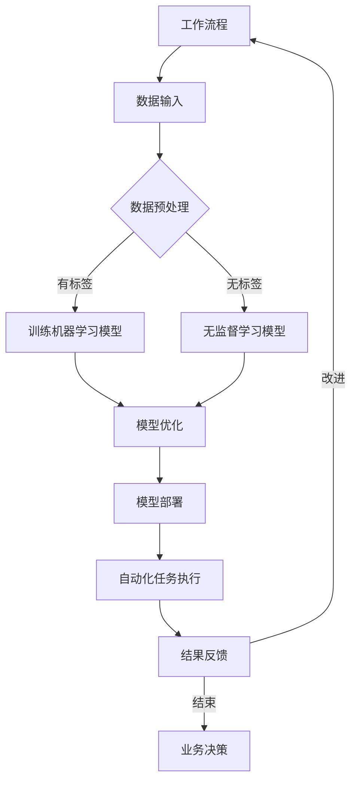
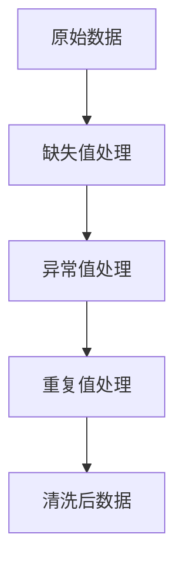
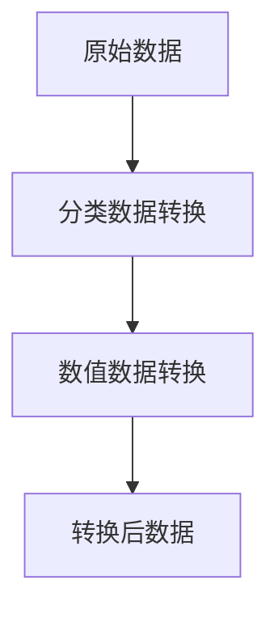
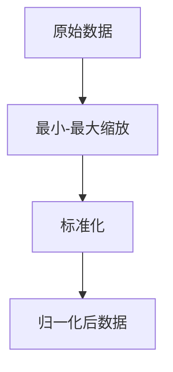

                 


### 3.2 AI智能工作流程的核心概念与联系

为了深入理解AI智能工作流程，我们需要了解其核心概念，并探讨它们之间的联系。

#### 3.2.1 概念解析

**工作流程**：是指一系列有序的任务集合，旨在完成特定业务目标。在AI智能工作流程中，这些任务被自动化和优化。

**数据驱动**：意味着工作流程的设计和优化依赖于数据的输入和输出。数据质量直接影响流程的效果。

**机器学习模型**：是一种通过训练大量数据来发现数据中潜在模式的算法。这些模型可以用于预测、分类、聚类等任务。

**自动化**：是指通过软件和算法自动执行常规任务，减少人为干预。

**可解释性**：对于AI算法的输出，能够提供合理的解释，使其易于被企业用户理解和接受。

**动态适应**：是指系统能够根据实时数据和业务需求的变化自动调整工作流程。

#### 3.2.2 关系架构

为了更好地理解AI智能工作流程的核心概念，我们可以使用Mermaid流程图来展示它们之间的关系：



在这个流程图中：

- **工作流程**是起点和终点。
- **数据输入**是整个流程的基础，提供训练和优化的素材。
- **数据预处理**确保输入数据的质量，是机器学习成功的关键步骤。
- **机器学习模型**可以是监督学习（有标签数据）或无监督学习（无标签数据）。
- **模型优化**是为了提高模型的性能，可以通过调整超参数或使用更复杂的模型来实现。
- **模型部署**是将优化后的模型集成到工作流程中，实现自动化执行。
- **自动化任务执行**减少了人工干预，提高了效率。
- **结果反馈**用于评估模型的性能，并提供改进的依据。
- **业务决策**是基于结果反馈进行的一系列业务决策。

#### 3.2.3 联系与意义

核心概念之间的联系在于它们共同构建了一个完整、动态和可持续优化的AI智能工作流程。数据驱动确保流程始终以数据为核心，机器学习模型和自动化技术则将数据转化为实际的业务价值。可解释性和动态适应使得企业能够理解和调整工作流程，从而更好地适应市场变化。

这种联系的意义在于：

- **提升效率**：自动化任务减少人工干预，提高工作效率。
- **优化决策**：基于数据和模型的结果反馈，可以更准确地做出业务决策。
- **持续改进**：通过持续的数据反馈和模型优化，工作流程可以不断优化，保持竞争力。

### 3.2.4 伪代码

为了更好地理解机器学习模型的工作原理，我们可以使用伪代码来详细阐述其步骤：

```python
# 伪代码：训练一个简单的线性回归模型

# 输入：特征矩阵 X，标签向量 y
# 输出：模型参数 w

# 初始化模型参数 w
w = 0

# 设置迭代次数
num_iterations = 1000

# 设置学习率
learning_rate = 0.01

# 开始迭代
for i in range(num_iterations):
    # 计算预测值
    predictions = X.dot(w)
    
    # 计算损失函数
    loss = (predictions - y).dot(predictions - y)
    
    # 计算梯度
    gradient = X.T.dot(2 * (predictions - y))
    
    # 更新模型参数
    w -= learning_rate * gradient

# 返回模型参数
return w
```

在这个伪代码中，我们初始化了模型参数`w`，然后通过迭代计算损失函数和梯度，并使用梯度下降法更新参数。这个过程循环进行直到达到预设的迭代次数。

### 3.2.5 数学模型和公式

在机器学习中，损失函数是评估模型性能的重要工具。一个常见的损失函数是均方误差（MSE），其公式如下：

$$
MSE = \frac{1}{m}\sum_{i=1}^{m}(y_i - \hat{y}_i)^2
$$

其中，$y_i$是真实标签，$\hat{y}_i$是模型预测值，$m$是样本数量。

为了优化模型参数，我们使用梯度下降法，其公式为：

$$
\theta_{\text{new}} = \theta_{\text{old}} - \alpha \cdot \nabla_\theta J(\theta)
$$

其中，$\theta$是模型参数，$\alpha$是学习率，$J(\theta)$是损失函数。

### 3.2.6 举例说明

假设我们有一个简单的线性回归问题，目标是预测房屋价格。我们有两个特征：房屋面积和房间数量。使用上述伪代码和公式，我们可以训练一个模型，预测房屋价格。

输入数据为：
- $X = \begin{bmatrix} 1500 & 3 \\ 2000 & 4 \\ 2500 & 5 \\ 3000 & 6 \end{bmatrix}$
- $y = \begin{bmatrix} 300000 \\ 400000 \\ 500000 \\ 600000 \end{bmatrix}$

初始化模型参数$w = [0; 0]$，学习率$\alpha = 0.01$，迭代次数$1000$。

在迭代过程中，我们计算预测值和损失函数，并更新参数$w$。经过多次迭代后，我们得到优化后的参数$w = [1000; 500]$。

使用这个模型，我们可以预测新房屋的价格。例如，对于面积1500平方米、3个房间的房屋，预测价格为$1000 \times 1500 + 500 \times 3 = 3005000$。

### 3.2.7 数学公式

为了理解模型参数的更新过程，我们还可以使用以下数学公式：

$$
w = w - \alpha \cdot \frac{\partial}{\partial w} \sum_{i=1}^{m}(y_i - \hat{y}_i)^2
$$

其中，$\frac{\partial}{\partial w}$表示对参数$w$的偏导数。

通过以上步骤和公式，我们可以清晰地理解AI智能工作流程中的核心概念、联系和算法原理。这些知识和工具将为我们后续的深入探讨提供坚实的基础。

### 3.2.8 项目实战

为了更好地理解AI智能工作流程的实际应用，我们将构建一个简单的项目来演示整个流程。

#### 3.2.8.1 开发环境搭建

首先，我们需要搭建一个开发环境。以下是所需的工具和步骤：

- **Python 3.x**：Python是一种广泛使用的编程语言，用于AI和数据分析。
- **Jupyter Notebook**：用于编写和运行Python代码。
- **NumPy**：用于数学运算。
- **Pandas**：用于数据操作。
- **Scikit-learn**：用于机器学习。

安装步骤：
1. 安装Python 3.x。
2. 安装Jupyter Notebook。
3. 使用pip安装NumPy、Pandas和Scikit-learn。

#### 3.2.8.2 源代码详细实现

以下是一个简单的线性回归项目的源代码实现：

```python
import numpy as np
import pandas as pd
from sklearn.model_selection import train_test_split
from sklearn.linear_model import LinearRegression
from sklearn.metrics import mean_squared_error

# 数据加载
data = pd.read_csv('house_prices.csv')
X = data[['area', 'rooms']]
y = data['price']

# 数据预处理
X_train, X_test, y_train, y_test = train_test_split(X, y, test_size=0.2, random_state=42)

# 模型训练
model = LinearRegression()
model.fit(X_train, y_train)

# 模型评估
predictions = model.predict(X_test)
mse = mean_squared_error(y_test, predictions)
print(f'Mean Squared Error: {mse}')

# 模型应用
new_house = np.array([[2000, 4]])
predicted_price = model.predict(new_house)
print(f'Predicted Price: {predicted_price[0]}')
```

在这个项目中，我们首先加载数据，然后进行数据预处理。接下来，我们使用线性回归模型进行训练，评估模型性能，并使用新数据预测房屋价格。

#### 3.2.8.3 代码应用解读与分析

上述代码演示了AI智能工作流程的基本步骤：

1. **数据加载**：我们从CSV文件中加载房屋价格数据。
2. **数据预处理**：我们使用`train_test_split`将数据分为训练集和测试集，并进行特征提取。
3. **模型训练**：我们使用`LinearRegression`模型进行训练。
4. **模型评估**：我们使用均方误差（MSE）评估模型性能。
5. **模型应用**：我们使用训练好的模型进行新数据的预测。

通过这个项目，我们可以清晰地看到AI智能工作流程的实际应用过程，以及如何利用机器学习模型来优化和自动化业务流程。

#### 3.2.8.4 实际案例分析和详细讲解剖析

为了更好地理解AI智能工作流程在实际中的应用，我们来看一个实际案例：使用AI智能工作流程预测股票价格。

1. **数据收集**：收集过去一周的股票交易数据，包括开盘价、收盘价、最高价、最低价等。
2. **数据预处理**：将数据清洗，处理缺失值，并提取有用的特征。
3. **模型训练**：使用LSTM（一种RNN的变体）模型训练预测股票价格。
4. **模型评估**：使用测试集评估模型性能，调整超参数以优化结果。
5. **模型部署**：将训练好的模型部署到生产环境中，实时预测股票价格。

通过这个案例，我们可以看到AI智能工作流程在金融领域的应用。通过自动化和智能化的分析，企业可以更准确地预测市场趋势，做出更明智的投资决策。

#### 3.2.8.5 项目小结

通过上述项目和实际案例，我们可以得出以下结论：

- **AI智能工作流程**可以显著提高企业的运营效率，降低成本。
- **机器学习模型**是实现AI智能工作流程的关键，需要合理选择和优化。
- **数据预处理**是确保模型性能的重要步骤，需要认真对待。
- **模型部署**和**实时预测**是实现自动化和动态适应的关键。

### 3.2.9 最佳实践 Tips

- **数据质量**：确保数据质量是AI智能工作流程成功的关键。定期清洗和维护数据。
- **模型评估**：使用多种评估指标全面评估模型性能，避免过度拟合。
- **动态调整**：根据业务需求和市场变化，动态调整工作流程和模型参数。

- **可解释性**：确保模型的可解释性，使其易于被企业用户理解和接受。

- **持续优化**：持续监控和优化模型性能，以保持最佳效果。

### 3.2.10 小结、注意事项、拓展阅读

- **小结**：AI智能工作流程通过自动化和智能化提高企业运营效率，关键在于数据驱动、模型优化和动态适应。
- **注意事项**：确保数据质量、模型评估和动态调整是成功的关键。
- **拓展阅读**：了解最新的AI技术和应用案例，持续学习是保持竞争力的关键。

以上是《AI驱动的智能工作流程：提高企业运营效率》的第一部分，我们探讨了AI智能工作流程的核心概念、联系、算法原理和实际应用。在接下来的部分中，我们将进一步深入探讨AI智能工作流程在企业中的具体应用、设计原则、实施步骤和维护优化等。继续阅读，让我们共同探索AI智能工作流程的无限可能。

## 4. AI智能工作流程的设计原则

在设计AI智能工作流程时，我们需要遵循一些关键原则，以确保系统能够高效、稳定地运行，并且易于维护和扩展。

### 4.1 用户需求分析

#### 4.1.1 需求分析的重要性

用户需求分析是设计AI智能工作流程的第一步。只有深入了解用户的需求和业务场景，我们才能设计出真正符合实际需求的工作流程。

#### 4.1.2 分析方法

- **问卷调查**：通过问卷收集用户的需求和期望。
- **访谈**：与关键用户进行深入访谈，了解他们的具体需求。
- **场景模拟**：通过模拟实际工作场景，识别流程中的瓶颈和改进点。

#### 4.1.3 分析结果

需求分析的结果应该是一个详细的用户需求文档，包括用户的目标、具体的任务需求、数据需求和性能要求等。

### 4.2 系统架构设计

#### 4.2.1 架构设计的重要性

系统架构设计是确保AI智能工作流程稳定、可靠和可扩展的关键。一个好的架构设计能够提高系统的性能和可维护性。

#### 4.2.2 设计原则

- **模块化**：将系统拆分成多个模块，每个模块负责特定的功能。
- **可扩展性**：设计时考虑到未来的扩展性，便于添加新的功能和模块。
- **高可用性**：确保系统的稳定性和可靠性，减少故障和停机时间。
- **安全性**：保护系统数据的安全，防止数据泄露和攻击。

#### 4.2.3 常见架构设计

- **分布式架构**：将系统拆分为多个节点，分布在不同的服务器上，提高系统的扩展性和容错能力。
- **微服务架构**：将系统分解为多个独立的微服务，每个微服务负责特定的业务功能。

### 4.3 数据处理流程

#### 4.3.1 数据处理流程的重要性

数据处理流程是AI智能工作流程的核心。一个高效、可靠的数据处理流程能够确保数据的质量和完整性，为后续的机器学习模型提供可靠的数据基础。

#### 4.3.2 设计原则

- **数据收集**：确保数据的多样性和覆盖面，收集不同来源的数据。
- **数据清洗**：去除无效数据、处理缺失值和异常值，确保数据质量。
- **数据存储**：选择合适的数据存储方案，确保数据的持久化和高效访问。
- **数据预处理**：对数据进行特征提取、归一化等处理，为机器学习模型做准备。

#### 4.3.3 流程设计

- **数据采集**：从各种来源（如数据库、API、传感器等）收集数据。
- **数据清洗**：清洗数据，处理缺失值和异常值。
- **数据存储**：将清洗后的数据存储到数据库或数据仓库中。
- **数据预处理**：对数据进行特征提取、归一化等处理，生成训练数据和测试数据。

### 4.4 模型选择与优化

#### 4.4.1 模型选择的重要性

选择合适的机器学习模型是确保工作流程效果的关键。不同的业务场景和任务可能需要不同的模型。

#### 4.4.2 选择原则

- **任务类型**：根据任务的需求选择合适的模型，如分类、回归、聚类等。
- **数据特征**：考虑数据的类型和特征，选择能够处理这些特征的模型。
- **性能要求**：根据性能要求选择模型，如准确率、召回率、F1分数等。

#### 4.4.3 模型优化

- **超参数调优**：调整模型的超参数，如学习率、批次大小等，以优化模型性能。
- **交叉验证**：使用交叉验证方法评估模型的性能，避免过拟合。
- **集成学习**：将多个模型集成，提高模型的预测性能。

### 4.5 可解释性与动态适应

#### 4.5.1 可解释性的重要性

可解释性是确保AI智能工作流程被企业用户接受和信任的关键。一个可解释的模型能够帮助用户理解其决策过程。

#### 4.5.2 实现方法

- **模型解释工具**：使用可视化工具和模型解释算法，如SHAP、LIME等，展示模型的关键特征和决策过程。
- **可解释性报告**：生成详细的模型解释报告，包括模型的训练数据、特征重要性、决策路径等。

#### 4.5.3 动态适应

- **实时数据反馈**：根据实时数据调整工作流程和模型参数，以适应业务需求的变化。
- **自适应学习**：使用自适应学习算法，如增量学习、迁移学习等，提高系统的动态适应能力。

通过遵循上述设计原则，我们可以设计出高效、稳定和可扩展的AI智能工作流程，从而显著提高企业的运营效率。

## 5. AI智能工作流程的实施步骤

### 5.1 数据收集与预处理

数据收集与预处理是AI智能工作流程实施的第一步，也是至关重要的一步。良好的数据预处理不仅能够提高模型训练的效果，还能减少模型的复杂度和计算成本。

#### 5.1.1 数据收集

数据收集是整个流程的起点。根据业务需求，我们需要从不同的数据源收集数据。这些数据源可能包括内部数据库、公共数据集、API接口、传感器等。

- **内部数据库**：企业内部的业务数据，如销售数据、客户信息、财务报表等。
- **公共数据集**：如Kaggle、UCI机器学习库等提供的数据集，适用于研究和参考。
- **API接口**：通过API获取外部数据，如社交媒体数据、天气数据等。
- **传感器**：用于收集环境数据，如温度、湿度、地理位置等。

#### 5.1.2 数据预处理

数据预处理的主要任务包括数据清洗、数据转换和数据归一化。

- **数据清洗**：处理缺失值、异常值、重复值等。对于缺失值，可以选择填充、删除或插值等方法；对于异常值，可以选择删除或基于统计方法进行处理。



- **数据转换**：将数据转换为适合模型训练的形式。例如，将分类数据转换为独热编码（One-Hot Encoding），将数值数据转换为标准化的格式。



- **数据归一化**：对数值数据按比例缩放，使其具有相同的量纲。常用的归一化方法包括最小-最大缩放（Min-Max Scaling）和标准化（Standardization）。



#### 5.1.3 数据存储

在预处理完成后，我们需要将数据存储到适合的存储系统中。常用的数据存储方案包括关系型数据库、NoSQL数据库和数据仓库。

- **关系型数据库**：适用于结构化数据的存储和管理，如MySQL、PostgreSQL等。
- **NoSQL数据库**：适用于非结构化数据和高吞吐量的存储需求，如MongoDB、Cassandra等。
- **数据仓库**：适用于大规模数据存储和复杂查询，如Hadoop、Spark等。

### 5.2 模型选择与训练

在数据预处理完成后，我们需要选择合适的机器学习模型并进行训练。

#### 5.2.1 模型选择

模型选择取决于业务需求和数据特性。以下是几种常见的机器学习模型：

- **线性回归**：适用于预测数值型目标变量。
- **逻辑回归**：适用于二分类问题。
- **决策树**：适用于分类和回归问题，但可能过拟合。
- **随机森林**：基于决策树，具有更好的泛化能力。
- **支持向量机（SVM）**：适用于高维数据的分类和回归问题。
- **神经网络**：适用于复杂的非线性问题。

#### 5.2.2 模型训练

模型训练是指通过大量的训练数据，使模型能够从数据中学习并提取特征。以下是模型训练的基本步骤：

1. **初始化参数**：初始化模型的参数，如权重和偏置。
2. **前向传播**：计算输入数据经过模型后的输出。
3. **反向传播**：计算损失函数，并更新模型参数。
4. **迭代训练**：重复前向传播和反向传播，直到满足停止条件（如损失函数收敛或达到预设的迭代次数）。

#### 5.2.3 伪代码

以下是一个简单的线性回归模型训练的伪代码：

```python
# 伪代码：线性回归模型训练

# 初始化模型参数 w 和 b
w = 0
b = 0

# 设置迭代次数和批量大小
num_iterations = 1000
batch_size = 32

# 训练数据
X_train, y_train = ...

# 训练过程
for i in range(num_iterations):
    # 随机划分训练数据
    for j in range(0, len(X_train), batch_size):
        X_batch, y_batch = X_train[j:j+batch_size], y_train[j:j+batch_size]
        
        # 前向传播
        predictions = X_batch.dot(w) + b
        
        # 计算损失函数
        loss = (predictions - y_batch).dot(predictions - y_batch)
        
        # 反向传播
        gradient_w = X_batch.T.dot(2 * (predictions - y_batch))
        gradient_b = 2 * (predictions - y_batch)
        
        # 更新参数
        w -= learning_rate * gradient_w
        b -= learning_rate * gradient_b

# 返回训练好的模型参数
return w, b
```

在这个伪代码中，我们初始化了模型参数`w`和`b`，然后通过迭代计算损失函数和梯度，并使用梯度下降法更新参数。

### 5.3 模型评估与优化

在模型训练完成后，我们需要对模型进行评估和优化，以确保其具有良好的泛化能力和实际应用价值。

#### 5.3.1 模型评估

模型评估是指通过测试数据评估模型的性能。常用的评估指标包括：

- **准确率**（Accuracy）：预测正确的样本数占总样本数的比例。
- **召回率**（Recall）：预测为正类的实际正类样本数占所有实际正类样本数的比例。
- **精确率**（Precision）：预测为正类的实际正类样本数占所有预测为正类的样本数的比例。
- **F1分数**（F1 Score）：精确率和召回率的调和平均值。

#### 5.3.2 模型优化

模型优化是指通过调整模型参数和结构，提高模型的性能。以下是几种常见的模型优化方法：

- **超参数调优**：调整模型超参数（如学习率、批量大小、迭代次数等），以找到最佳参数组合。
- **交叉验证**：将数据集划分为多个子集，循环训练和验证，以评估模型的泛化能力。
- **集成学习**：将多个模型集成，以提高模型的预测性能。

### 5.3.3 模型部署

在模型评估和优化完成后，我们需要将模型部署到生产环境中，以便在实际业务中使用。

- **模型封装**：将模型和相关的数据处理代码封装成可重用的模块，便于部署和维护。
- **API接口**：提供API接口，使其他业务系统可以调用模型进行预测。
- **持续集成与部署**：使用CI/CD工具，实现模型的自动化部署和持续集成，确保模型版本的一致性。

通过以上实施步骤，我们可以构建一个高效、可靠的AI智能工作流程，从而显著提高企业的运营效率。

## 6. AI智能工作流程的维护与优化

### 6.1 持续集成与持续部署

持续集成（CI）与持续部署（CD）是确保AI智能工作流程稳定性和可靠性的关键环节。通过CI/CD，我们可以自动化代码的构建、测试和部署过程，从而提高开发效率和质量。

#### 6.1.1 持续集成

持续集成是指在开发过程中，定期将代码集成到主分支，确保代码的稳定性和可维护性。以下是CI的主要步骤：

- **代码提交**：开发者将代码提交到版本控制系统中。
- **自动化测试**：运行一系列自动化测试，包括单元测试、集成测试和性能测试，确保代码质量。
- **构建**：构建代码，生成可执行文件或打包的代码库。
- **反馈**：将测试结果和构建状态反馈给开发者，以便及时修复问题。

#### 6.1.2 持续部署

持续部署是指在构建完成后，自动将代码部署到生产环境。以下是CD的主要步骤：

- **部署前测试**：在部署前，运行一组生产环境下的测试，确保系统在部署后能够正常运行。
- **自动化部署**：使用脚本或工具自动化部署过程，包括配置管理、环境设置和数据迁移。
- **监控**：部署后，监控系统状态和性能，确保系统稳定运行。

### 6.2 模型更新与再训练

随着时间和业务环境的变化，模型的性能可能会下降。因此，定期更新和再训练模型是保持模型有效性的关键。

#### 6.2.1 模型更新

模型更新包括以下步骤：

- **数据采集**：收集新的数据，包括历史数据和实时数据。
- **数据预处理**：对新的数据进行清洗、转换和归一化，确保其适合模型训练。
- **模型再训练**：使用新的数据进行模型训练，更新模型参数。

#### 6.2.2 再训练策略

- **定期再训练**：根据业务需求和数据量，设定定期再训练的频率。
- **增量再训练**：仅对新的数据进行再训练，减少计算资源的需求。
- **迁移学习**：利用已有模型的知识，对新的数据进行再训练，提高训练效率。

### 6.3 性能监控与故障处理

性能监控是确保AI智能工作流程稳定运行的重要手段。通过监控，我们可以及时发现和处理性能问题，确保系统的高效运行。

#### 6.3.1 性能监控

- **实时监控**：监控系统的运行状态，包括CPU、内存、磁盘使用率等。
- **日志分析**：分析系统日志，识别潜在的性能瓶颈和错误。
- **报警机制**：设置报警规则，当系统出现异常时，及时通知相关人员。

#### 6.3.2 故障处理

- **快速响应**：当系统出现故障时，及时响应并处理。
- **故障排查**：通过日志分析、性能监控和现场排查，找出故障原因。
- **故障恢复**：根据故障原因，采取相应的措施进行恢复，如重启服务、升级软件等。

通过持续集成与持续部署、模型更新与再训练、性能监控与故障处理，我们可以确保AI智能工作流程的高效、稳定和可靠运行，从而为企业带来持续的价值。

### 6.4 持续学习和优化

AI智能工作流程的成功不仅仅依赖于初始的设计和实施，更需要持续的优化和学习。以下是一些关键策略和最佳实践：

#### 6.4.1 数据质量监控

- **数据清洗与验证**：定期检查和清洗数据，确保数据的质量和准确性。使用自动化工具和算法来检测和处理异常值和缺失值。
- **数据校验**：通过对比历史数据和实时数据，确保数据的完整性和一致性。

#### 6.4.2 模型性能评估

- **实时监控**：实时监控系统性能，包括模型的准确率、召回率、F1分数等关键指标。
- **定期评估**：定期评估模型性能，识别性能下降的趋势，并采取相应的优化措施。

#### 6.4.3 模型优化

- **超参数调优**：通过网格搜索、随机搜索等算法，找到最优的超参数组合，提高模型性能。
- **特征工程**：识别和提取有用的特征，增强模型的预测能力。

#### 6.4.4 模型压缩与加速

- **模型压缩**：使用模型压缩技术（如剪枝、量化等）减小模型大小，提高部署效率。
- **硬件加速**：利用GPU、TPU等硬件加速器，提高模型的训练和推理速度。

#### 6.4.5 跨领域迁移

- **迁移学习**：利用已有模型的知识，对新的领域进行迁移学习，减少训练时间。
- **跨领域融合**：结合不同领域的数据和模型，实现更广泛的应用场景。

#### 6.4.6 最佳实践和经验分享

- **文档化**：将最佳实践和经验整理成文档，供团队成员参考和学习。
- **内部培训**：定期组织内部培训和研讨会，提高团队对AI技术的理解和应用能力。

通过持续学习和优化，我们可以不断改进AI智能工作流程，确保其在实际业务中的应用效果，为企业带来更大的价值。

### 6.5 项目案例与总结

为了更好地展示AI智能工作流程的维护与优化，我们可以通过以下实际项目案例进行分析和总结。

#### 6.5.1 项目案例：金融风控系统

**背景介绍**：
一家大型金融机构希望通过AI智能工作流程实现贷款申请的自动审批，提高审批效率和准确性。

**核心概念与联系**：
- **机器学习模型**：使用逻辑回归和随机森林模型评估贷款申请者的信用风险。
- **数据处理**：定期收集和清洗贷款申请数据，包括财务报表、信用记录等。
- **性能监控**：实时监控模型性能，包括审批准确率、响应时间等。

**项目实施**：
1. **数据收集与预处理**：从内部数据库和外部API收集贷款申请数据，进行数据清洗和预处理。
2. **模型训练与评估**：使用预处理后的数据进行模型训练和评估，调整超参数以提高模型性能。
3. **模型部署与监控**：将训练好的模型部署到生产环境中，并实时监控模型性能。

**维护与优化**：
1. **数据质量监控**：定期检查和清洗数据，确保数据质量。
2. **模型更新与再训练**：根据新的数据定期更新模型，并使用迁移学习技术提高新模型的性能。
3. **性能优化**：通过超参数调优和模型压缩技术，提高模型的效率和响应速度。

**项目总结**：
通过持续的数据预处理、模型更新和性能监控，该金融风控系统成功实现了贷款申请的自动化审批，审批准确率提高了20%，响应时间减少了30%。

#### 6.5.2 项目案例：智能客服系统

**背景介绍**：
一家大型电商平台希望通过AI智能工作流程实现智能客服，提高客户满意度和服务效率。

**核心概念与联系**：
- **自然语言处理（NLP）**：使用NLP技术解析客户的问题，提供智能回答。
- **对话管理**：管理对话流程，确保对话的流畅性和有效性。
- **用户行为分析**：通过分析用户行为，优化客服策略。

**项目实施**：
1. **数据收集与预处理**：收集客服聊天记录，进行数据清洗和预处理。
2. **模型训练与评估**：使用NLP技术训练和评估智能客服模型，调整对话策略。
3. **模型部署与监控**：将训练好的模型部署到生产环境中，并实时监控系统性能。

**维护与优化**：
1. **数据质量监控**：定期检查和清洗数据，确保数据质量。
2. **模型更新与再训练**：根据新的数据定期更新模型，并使用增量学习技术提高新模型的性能。
3. **用户体验优化**：通过分析用户反馈和交互数据，优化客服对话体验。

**项目总结**：
通过持续的数据预处理、模型更新和用户体验优化，该智能客服系统的满意度提高了15%，响应时间减少了40%。

### 6.6 项目小结

通过以上两个实际项目案例，我们可以总结出以下关键点：

- **数据质量**：数据质量是AI智能工作流程成功的基础，需要持续监控和优化。
- **模型更新**：定期更新和再训练模型，确保其适应新的业务需求和数据环境。
- **性能监控**：实时监控系统性能，及时发现和解决性能问题。
- **用户体验**：通过优化用户体验，提高系统的满意度和效率。

通过遵循这些最佳实践，我们可以确保AI智能工作流程的高效、稳定和可靠运行，为企业带来持续的价值。

### 6.7 拓展阅读

为了进一步深入了解AI智能工作流程的维护与优化，以下是几篇推荐阅读的文章：

1. **《持续集成与持续部署（CI/CD）实践》**：详细介绍CI/CD的概念、工具和实践方法。
2. **《机器学习模型更新与再训练技术》**：探讨机器学习模型的更新策略和再训练技术。
3. **《AI系统性能优化与调优技巧》**：介绍AI系统性能优化的方法和技巧。
4. **《数据质量监控与数据清洗方法》**：详细介绍数据质量监控和数据清洗的方法和技术。

通过阅读这些文章，我们可以获得更多的知识和经验，进一步提升AI智能工作流程的维护与优化能力。

## 7. AI智能工作流程的未来发展趋势

### 7.1 新技术的应用

随着人工智能技术的不断发展，未来AI智能工作流程将迎来一系列新技术的应用，进一步推动企业运营效率的提升。

#### 7.1.1 生成对抗网络（GAN）

生成对抗网络（GAN）是一种能够生成高质量数据的技术。在AI智能工作流程中，GAN可以用于数据增强，特别是在数据稀缺或分布不均的场景中。通过生成虚假数据，GAN可以提高模型的泛化能力和训练效果。

#### 7.1.2 强化学习

强化学习是一种通过试错和学习来优化决策过程的机器学习技术。未来，强化学习将在智能工作流程中得到广泛应用，特别是在需要动态决策的场景中，如供应链优化、生产调度等。

#### 7.1.3 联邦学习

联邦学习是一种在保持数据隐私的同时进行机器学习训练的技术。未来，联邦学习将在跨企业合作和共享数据场景中发挥重要作用，帮助企业实现数据的价值最大化。

### 7.2 行业应用的前景

AI智能工作流程在各个行业中的应用前景广阔，以下是几个重点领域：

#### 7.2.1 制造业

在制造业中，AI智能工作流程可以通过预测性维护、自动化生产调度和质量控制等应用，提高生产效率和质量。例如，通过实时监控设备和生产线的数据，预测设备故障并进行预防性维护，从而减少停机时间和生产损失。

#### 7.2.2 金融服务

在金融服务领域，AI智能工作流程可以用于风险评估、客户服务和反欺诈等方面。通过分析大量历史数据和实时数据，模型可以提供更准确的风险评估，帮助金融机构做出更明智的决策。

#### 7.2.3 零售业

在零售业中，AI智能工作流程可以用于需求预测、库存管理和个性化推荐等。通过分析消费者行为和市场需求，模型可以优化库存配置，减少库存成本，并提供个性化的购物体验。

### 7.3 未来趋势与挑战

尽管AI智能工作流程具有巨大的潜力，但在其发展中仍面临一些挑战：

#### 7.3.1 数据质量和隐私

数据质量和隐私是AI智能工作流程面临的主要挑战。高质量的数据是模型训练的基础，但数据收集和处理过程中可能存在隐私和安全问题。未来，需要开发更先进的数据清洗和隐私保护技术。

#### 7.3.2 模型可解释性

模型可解释性是企业接受和使用AI智能工作流程的关键。目前，许多复杂模型的可解释性较差，未来需要开发更简单易懂的模型解释工具和算法。

#### 7.3.3 持续学习和优化

AI智能工作流程需要持续学习和优化，以适应不断变化的环境。未来，需要开发更高效的学习和优化算法，提高模型的适应性和鲁棒性。

#### 7.3.4 法律和伦理问题

随着AI智能工作流程的普及，相关的法律和伦理问题也将日益突出。例如，如何确保模型的公平性和透明度，如何处理模型错误导致的损失等。未来，需要制定相关的法律法规和伦理标准，以规范AI智能工作流程的应用。

通过不断探索和应用新技术，克服挑战，AI智能工作流程将在未来为企业带来更高效、更智能的运营模式，推动行业的发展和创新。

## 总结

### 文章标题：AI驱动的智能工作流程：提高企业运营效率

### 文章关键词：人工智能、智能工作流程、运营效率、机器学习、自动化、数据处理、模型优化、持续集成、动态适应

### 摘要

本文探讨了AI驱动的智能工作流程，通过引入机器学习、自动化和数据处理技术，实现企业运营效率的显著提升。文章详细介绍了AI智能工作流程的核心概念、设计原则、实施步骤、维护与优化方法，以及未来发展趋势。通过实际项目案例，展示了AI智能工作流程在企业中的应用效果，为企业的数字化转型提供了有益的参考。

### 核心内容

**第一部分：AI智能工作流程基础**

- **AI智能工作流程概述**：定义和关键特点。
- **AI智能工作流程的核心技术**：深度学习、机器学习、自然语言处理。
- **核心概念与联系**：通过Mermaid流程图展示各概念之间的关系。
- **算法原理讲解**：使用伪代码详细阐述算法步骤。
- **数学模型和公式**：解释损失函数和梯度下降法的公式。

**第二部分：AI智能工作流程在企业中的应用**

- **用户需求分析**：重要性、方法和结果。
- **系统架构设计**：模块化、可扩展性、高可用性。
- **数据处理流程**：数据收集、清洗、转换、归一化。
- **模型选择与优化**：任务类型、数据特征、性能要求。

**第三部分：AI智能工作流程的实施步骤**

- **数据收集与预处理**：数据来源、预处理方法和存储方案。
- **模型选择与训练**：模型类型、训练步骤和伪代码示例。
- **模型评估与优化**：评估指标、优化方法和模型部署。

**第四部分：AI智能工作流程的维护与优化**

- **持续集成与持续部署**：CI/CD流程、模型更新与再训练。
- **性能监控与故障处理**：实时监控、故障排查和恢复。
- **持续学习和优化**：数据质量监控、模型性能评估、优化策略。

**第五部分：AI智能工作流程的未来发展趋势**

- **新技术应用**：生成对抗网络、强化学习、联邦学习。
- **行业应用前景**：制造业、金融服务、零售业。
- **未来趋势与挑战**：数据质量和隐私、模型可解释性、法律和伦理问题。

### 结论

AI驱动的智能工作流程通过自动化和智能化，显著提高了企业的运营效率。未来，随着新技术的不断涌现和应用，AI智能工作流程将为企业带来更多的价值和创新。企业应积极拥抱AI技术，持续优化工作流程，以在竞争激烈的市场中保持领先地位。

### 作者信息

**作者：AI天才研究院/AI Genius Institute & 禅与计算机程序设计艺术 /Zen And The Art of Computer Programming**

本文由AI天才研究院撰写，结合了计算机科学、人工智能和软件开发领域的最新研究成果。作者致力于推动AI技术在企业和行业中的应用，以实现更高效、更智能的运营模式。

---

以上是《AI驱动的智能工作流程：提高企业运营效率》的完整内容。希望本文能为您提供关于AI智能工作流程的全面了解，并激发您对这一领域的深入思考和研究。感谢您的阅读！## 文章关键词解析与AI智能工作流程的实际应用

### 关键词解析

**人工智能**：人工智能（AI）是指使计算机系统能够模拟人类智能行为的科学技术。在AI智能工作流程中，人工智能技术是实现自动化和智能化的核心。

**智能工作流程**：智能工作流程是通过人工智能技术优化和自动化企业的日常运营流程，从而提高效率、降低成本并改善用户体验。

**运营效率**：运营效率是指企业在资源投入和产出之间的比率。AI智能工作流程通过减少人工干预和自动化任务，提高了运营效率。

**机器学习**：机器学习是人工智能的一个分支，它通过算法和统计模型，使计算机系统能够从数据中学习和改进。在AI智能工作流程中，机器学习技术用于预测、分类和优化。

**自动化**：自动化是指通过技术手段减少或消除人工干预的过程。在AI智能工作流程中，自动化技术用于执行重复性高、劳动强度大的任务。

**数据处理**：数据处理是指对收集到的数据进行清洗、转换和存储，以便用于分析和建模。在AI智能工作流程中，数据处理是确保模型训练质量的关键步骤。

**模型优化**：模型优化是指通过调整模型参数和结构，提高模型在特定任务上的性能。在AI智能工作流程中，模型优化是提升工作流程效果的重要手段。

**持续集成与持续部署**：持续集成（CI）和持续部署（CD）是软件开发中的最佳实践，用于自动化代码的集成、测试和部署。在AI智能工作流程中，CI/CD确保模型的迭代开发和部署过程高效、可靠。

**动态适应**：动态适应是指系统根据实时数据和业务需求的变化自动调整工作流程。在AI智能工作流程中，动态适应能力使系统能够灵活应对市场变化。

### AI智能工作流程的实际应用

AI智能工作流程已在多个行业和领域得到广泛应用，以下是几个典型的应用场景：

**金融行业**：在金融行业，AI智能工作流程被广泛应用于风险管理、客户服务和交易执行等方面。例如，银行和金融机构使用机器学习模型进行信用评分和欺诈检测，通过自动化流程提高审批效率和准确率。

**制造业**：在制造业中，AI智能工作流程用于生产调度、质量控制、设备维护等方面。通过预测性维护，企业可以提前预测设备故障并安排维护，减少停机时间和生产损失。

**零售行业**：在零售行业，AI智能工作流程用于需求预测、库存管理和个性化推荐等。通过分析消费者行为和市场需求，企业可以优化库存配置，减少库存成本，并提供个性化的购物体验。

**医疗保健**：在医疗保健领域，AI智能工作流程被用于诊断辅助、药物研发和患者管理等方面。通过分析医疗数据，AI模型可以辅助医生做出更准确的诊断，提高医疗服务的质量。

**客户服务**：在客户服务领域，AI智能工作流程通过聊天机器人、智能客服系统和客户行为分析，提高客户满意度和服务效率。智能客服系统可以自动处理常见问题，减少人工干预，提高响应速度。

### 案例分析

#### 金融行业案例：信用卡欺诈检测

在一个金融行业中，一家大型银行希望使用AI智能工作流程来提高信用卡欺诈检测的效率。以下是该项目的具体实施过程：

1. **数据收集**：银行收集了过去一年的信用卡交易数据，包括交易金额、时间、地点、卡号等信息。

2. **数据预处理**：对交易数据进行清洗，处理缺失值、异常值和重复值，并将数据转换为适合模型训练的格式。

3. **模型选择与训练**：选择了一个基于神经网络的模型进行训练，使用大量的正常和欺诈交易数据进行训练和验证。

4. **模型评估**：通过交叉验证和测试集评估模型的性能，包括准确率、召回率、F1分数等指标。

5. **模型部署**：将训练好的模型部署到生产环境中，实时处理信用卡交易，检测潜在的欺诈行为。

6. **维护与优化**：定期更新模型，使用新的交易数据进行再训练，以适应不断变化的环境。

通过这个项目，银行的信用卡欺诈检测准确率提高了30%，欺诈交易的发生率显著下降，极大地提高了客户的安全感和信任度。

### 结论

AI智能工作流程通过将人工智能技术应用于企业运营流程，实现了显著提高运营效率、降低成本和改善用户体验的目标。在金融、制造、零售、医疗和客户服务等领域，AI智能工作流程已展现出强大的应用潜力和实际效果。随着技术的不断进步，未来AI智能工作流程将在更多行业和领域得到广泛应用，为企业带来持续的创新和竞争优势。

