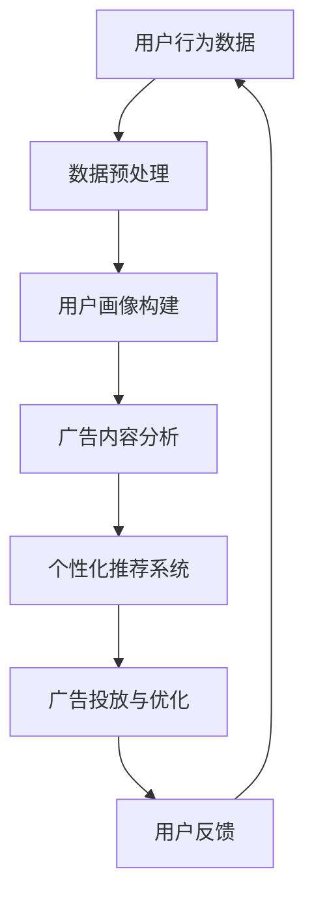

                 


## 文章标题: AI驱动的智能广告内容个性化：提高用户参与度

### 关键词
- 人工智能
- 广告内容个性化
- 用户参与度
- 智能推荐算法
- 数据分析
- 案例研究

### 摘要
本文将深入探讨AI驱动的智能广告内容个性化技术，以及如何有效提高用户参与度。通过分析AI技术在广告个性化中的应用，本文将介绍核心概念、算法原理，并提供实战案例分析。读者将了解如何利用AI技术打造更具吸引力的广告内容，从而提升用户参与度和广告效果。

## 引言与背景

在数字营销领域，广告内容个性化已经成为提升用户参与度和转化率的关键因素。随着互联网用户数量的激增和内容消费需求的多样化，传统的一刀切广告模式已无法满足现代用户的个性化需求。因此，智能广告内容个性化成为企业争相研究和应用的热点领域。

### AI在广告个性化中的作用

人工智能（AI）技术在广告个性化中扮演着至关重要的角色。首先，AI能够通过分析海量用户数据，了解用户的兴趣、行为和需求，从而实现精准的用户画像。基于这些画像，AI算法可以自动生成个性化的广告内容，提高广告的吸引力和相关度。其次，AI技术还能够通过机器学习和深度学习算法，不断优化广告投放策略，提高广告的投放效率和效果。例如，AI驱动的推荐系统可以根据用户的浏览历史和行为模式，推荐符合用户兴趣的产品和服务，从而提高用户的点击率和转化率。

### 用户参与度的重要性

用户参与度是衡量广告效果的重要指标。一个高参与度的广告不仅能够吸引用户的注意力，还能够促使用户进行互动，如点击、评论、分享等。通过提高用户参与度，企业可以更好地了解用户需求，建立品牌信任，从而实现长期的营销目标。因此，如何通过AI技术提高用户参与度，已经成为数字营销领域的核心问题。

### 本文目的

本文旨在系统地探讨AI驱动的智能广告内容个性化技术，通过分析核心概念、算法原理和实战案例，帮助读者深入了解这一领域。文章将回答以下关键问题：

1. AI技术在广告个性化中的应用原理是什么？
2. 如何通过AI算法实现广告内容个性化？
3. 智能广告内容个性化如何提高用户参与度？
4. 实际案例中，AI驱动的广告个性化策略有哪些成功经验？

通过本文的探讨，读者将能够掌握AI驱动广告内容个性化的关键技术，并为实际应用提供有力指导。

## 第1部分：AI技术基础

在深入探讨AI驱动的智能广告内容个性化之前，首先需要了解AI技术的基础知识，包括核心概念、相关算法以及它们在广告个性化中的应用原理。

### 1.1 AI核心技术概述

人工智能（AI）是一种模拟人类智能行为的计算机技术，旨在使计算机具备感知、学习、推理和解决问题的能力。AI技术主要包括以下几个方面：

- **机器学习（Machine Learning）**：机器学习是一种通过数据训练模型，使计算机能够进行预测和决策的技术。主要算法包括线性回归、逻辑回归、支持向量机（SVM）、决策树、随机森林等。

- **深度学习（Deep Learning）**：深度学习是机器学习的一个子领域，通过构建深度神经网络模型，对大量数据进行自动特征学习和模式识别。常见的深度学习框架有TensorFlow、PyTorch等。

- **自然语言处理（Natural Language Processing, NLP）**：NLP是AI的一个重要分支，旨在使计算机能够理解和处理自然语言。常见的NLP任务包括文本分类、情感分析、机器翻译、语音识别等。

- **计算机视觉（Computer Vision）**：计算机视觉是AI的一个分支，旨在使计算机能够从图像或视频中提取有用信息。主要任务包括图像分类、目标检测、图像生成等。

### 1.2 广告个性化中的核心算法

在广告个性化中，常见的核心算法包括协同过滤、内容推荐和基于用户兴趣的推荐等。下面将分别介绍这些算法的基本原理。

#### 协同过滤（Collaborative Filtering）

协同过滤是一种基于用户行为的推荐算法，通过分析用户之间的相似性，预测用户可能感兴趣的项目。协同过滤分为以下两种类型：

- **用户基于的协同过滤（User-Based Collaborative Filtering）**：通过计算用户之间的相似度，找到与目标用户兴趣相似的其他用户，然后推荐这些用户喜欢的项目。

- **物品基于的协同过滤（Item-Based Collaborative Filtering）**：通过计算物品之间的相似度，找到与目标物品相似的其他物品，然后推荐这些物品。

#### 内容推荐（Content-Based Recommending）

内容推荐是基于用户过去对特定内容的偏好来推荐相似内容的算法。具体步骤如下：

1. **特征提取**：从用户历史数据中提取特征，如浏览记录、搜索关键词、购买历史等。

2. **相似度计算**：计算目标用户与其他用户在特征上的相似度。

3. **推荐生成**：根据相似度计算结果，推荐与目标用户兴趣相似的内容。

#### 基于用户兴趣的推荐（Interest-Based Recommending）

基于用户兴趣的推荐是利用用户的兴趣标签、搜索历史和行为数据，预测用户可能感兴趣的内容。具体步骤如下：

1. **兴趣标签提取**：从用户历史数据中提取兴趣标签。

2. **兴趣建模**：利用机器学习算法，如聚类、分类等，对用户兴趣进行建模。

3. **推荐生成**：根据用户兴趣模型，推荐与用户兴趣相关的内容。

### 1.3 AI在广告个性化中的应用原理

AI技术在广告个性化中的应用主要基于以下几个原理：

- **用户行为分析**：通过分析用户的行为数据，如点击、浏览、搜索等，了解用户的兴趣和需求。

- **用户画像构建**：基于用户行为数据，构建用户画像，包括兴趣偏好、购买能力、地域特征等。

- **个性化推荐系统**：利用机器学习和深度学习算法，构建个性化推荐系统，根据用户画像和广告内容特征，自动生成个性化的广告内容。

- **实时优化与调整**：通过实时分析广告投放效果，不断优化和调整广告内容，提高广告的吸引力和转化率。

### 1.4 Mermaid流程图展示

为了更好地理解AI技术在广告个性化中的应用流程，我们可以使用Mermaid流程图来展示。以下是一个简化的流程图示例：



在这个流程中，用户行为数据是整个过程的起点，通过数据预处理、用户画像构建、广告内容分析和个性化推荐系统，最终实现广告投放和优化。用户的反馈又反馈回用户行为数据，形成闭环，不断优化广告效果。

通过这一部分的内容，读者将初步了解AI技术在广告个性化中的应用原理，为后续更深入的分析和探讨打下基础。

### 1.5 伪代码讲解个性化推荐算法

在了解了AI技术在广告个性化中的应用原理后，接下来我们将通过伪代码详细讲解一种常见的个性化推荐算法：协同过滤（Collaborative Filtering）。协同过滤算法的核心思想是通过分析用户之间的相似性来推荐项目。

#### 1.5.1 算法概述

协同过滤算法分为基于用户的协同过滤和基于物品的协同过滤。这里以基于用户的协同过滤为例进行讲解。基于用户的协同过滤算法主要分为以下几个步骤：

1. **用户相似度计算**：计算目标用户与数据库中其他用户的相似度，通常使用余弦相似度或皮尔逊相关系数。
2. **推荐项目选择**：根据相似度计算结果，选择与目标用户最相似的K个用户。
3. **推荐项目生成**：根据选择的K个用户的共同喜好，推荐目标用户可能感兴趣的项目。

#### 1.5.2 伪代码实现

下面是一个简单的基于用户的协同过滤算法的伪代码：

```python
# 输入：用户-项目评分矩阵R，相似度计算函数similarity()
# 输出：推荐项目列表

def collaborativeFiltering(R, k):
    # 步骤1：计算用户相似度
    user_similarity = compute_user_similarity(R)
    
    # 步骤2：选择与目标用户最相似的K个用户
    nearest_users = select_nearest_users(user_similarity, k)
    
    # 步骤3：生成推荐项目列表
    recommended_items = []
    for user in nearest_users:
        for item in R[user]:
            if R[user][item] == 0 and item not in recommended_items:
                recommended_items.append(item)
    
    return recommended_items

def compute_user_similarity(R):
    # 计算用户相似度，使用余弦相似度
    similarity_matrix = []
    for i in range(len(R)):
        user_similarity = {}
        for j in range(len(R)):
            if i != j:
                similarity = cosine_similarity(R[i], R[j])
                user_similarity[j] = similarity
        similarity_matrix.append(user_similarity)
    return similarity_matrix

def select_nearest_users(user_similarity, k):
    # 选择与目标用户最相似的K个用户
    sorted_similarity = sorted(user_similarity.items(), key=lambda x: x[1], reverse=True)
    return [user for user, similarity in sorted_similarity[:k]]
```

#### 1.5.3 举例说明

假设有一个用户-项目评分矩阵R如下：

| 用户 | 项目1 | 项目2 | 项目3 | 项目4 |
| ---- | ---- | ---- | ---- | ---- |
| 用户A | 5    | 0    | 4    | 0    |
| 用户B | 1    | 5    | 0    | 4    |
| 用户C | 0    | 4    | 5    | 1    |
| 用户D | 4    | 0    | 1    | 5    |

使用基于用户的协同过滤算法，为目标用户A推荐K=2个最相似的用户的共同喜好项目。

1. **计算用户相似度**：

   假设使用余弦相似度计算用户A与用户B、用户C和用户D的相似度：

   - 用户A与用户B的相似度：cosine_similarity([5, 0, 4, 0], [1, 5, 0, 4]) = 0.7071
   - 用户A与用户C的相似度：cosine_similarity([5, 0, 4, 0], [0, 4, 5, 1]) = 0.5547
   - 用户A与用户D的相似度：cosine_similarity([5, 0, 4, 0], [4, 0, 1, 5]) = 0.4714

2. **选择与目标用户最相似的K个用户**：

   根据相似度计算结果，选择相似度最高的两个用户：用户B和用户C。

3. **生成推荐项目列表**：

   查看用户B和用户C的共同喜好项目，发现项目2和项目3都是两用户共同喜欢的项目，而用户A对这些项目没有评分。因此，推荐项目2和项目3给用户A。

通过这个简单的示例，我们可以看到基于用户的协同过滤算法的基本原理和实现过程。在实际情况中，算法会更加复杂，包括处理稀疏数据、冷启动问题等，但基本思想是一致的。

### 1.6 数学模型与公式详解

在广告个性化中，数学模型和公式起着至关重要的作用。以下将详细讲解一些关键的数学模型和公式，包括协同过滤算法中的余弦相似度和皮尔逊相关系数。

#### 1.6.1 余弦相似度

余弦相似度是一种用于计算两个向量之间相似度的方法。在广告个性化中，用户-项目评分矩阵可以被视为一个二维向量，其中行代表用户，列代表项目。余弦相似度的公式如下：

$$
similarity(A, B) = \frac{A \cdot B}{\|A\| \|B\|}
$$

其中，$A \cdot B$ 表示两个向量的点积，$\|A\|$ 和 $\|B\|$ 分别表示两个向量的欧几里得范数。

#### 1.6.2 皮尔逊相关系数

皮尔逊相关系数是一种衡量两个变量线性相关程度的统计指标。在广告个性化中，用户行为数据可以被视为两个相关变量。皮尔逊相关系数的公式如下：

$$
correlation(A, B) = \frac{cov(A, B)}{\sigma_A \sigma_B}
$$

其中，$cov(A, B)$ 表示两个变量的协方差，$\sigma_A$ 和 $\sigma_B$ 分别表示两个变量的标准差。

#### 1.6.3 示例计算

假设有两个用户A和用户B的评分数据如下：

用户A | 项目1 | 项目2 | 项目3 | 项目4
---- | ---- | ---- | ---- | ----
5    | 0    | 4    | 0    | 0

用户B | 项目1 | 项目2 | 项目3 | 项目4
---- | ---- | ---- | ---- | ----
1    | 5    | 0    | 4    | 0

1. **计算余弦相似度**：

   - 向量A = [5, 0, 4, 0]
   - 向量B = [1, 5, 0, 4]

   点积$A \cdot B = 5 \cdot 1 + 0 \cdot 5 + 4 \cdot 0 + 0 \cdot 4 = 5$

   向量A的欧几里得范数$\|A\| = \sqrt{5^2 + 0^2 + 4^2 + 0^2} = \sqrt{41}$

   向量B的欧几里得范数$\|B\| = \sqrt{1^2 + 5^2 + 0^2 + 4^2} = \sqrt{42}$

   余弦相似度$similarity(A, B) = \frac{5}{\sqrt{41} \cdot \sqrt{42}} \approx 0.7071$

2. **计算皮尔逊相关系数**：

   - 用户A的评分数据：[5, 0, 4, 0]
   - 用户B的评分数据：[1, 5, 0, 4]

   用户A评分的平均值$\bar{A} = \frac{5 + 0 + 4 + 0}{4} = 2.5$

   用户B评分的平均值$\bar{B} = \frac{1 + 5 + 0 + 4}{4} = 2.5$

   用户A评分的方差$var(A) = \frac{(5-2.5)^2 + (0-2.5)^2 + (4-2.5)^2 + (0-2.5)^2}{4} = 5.25$

   用户B评分的方差$var(B) = \frac{(1-2.5)^2 + (5-2.5)^2 + (0-2.5)^2 + (4-2.5)^2}{4} = 5.25$

   用户A和用户B评分的协方差$Cov(A, B) = \frac{(5-2.5)(1-2.5) + (0-2.5)(5-2.5) + (4-2.5)(0-2.5) + (0-2.5)(4-2.5)}{4} = 0$

   皮尔逊相关系数$correlation(A, B) = \frac{0}{\sqrt{5.25} \cdot \sqrt{5.25}} = 0$

通过这个示例，我们可以看到如何使用余弦相似度和皮尔逊相关系数来计算用户之间的相似度。这些相似度指标为协同过滤算法提供了基础，使得推荐系统能够根据用户行为和兴趣推荐个性化的广告内容。

### 1.7 开发环境搭建与源代码实现

为了实现AI驱动的智能广告内容个性化，我们需要搭建一个合适的开发环境，并编写源代码来构建推荐系统。以下是一个简单的开发环境搭建步骤，以及一个基于协同过滤算法的推荐系统源代码实现。

#### 1.7.1 开发环境搭建

1. **安装Python**：确保已安装Python 3.8及以上版本。

2. **安装必要的库**：在终端执行以下命令，安装必要的库：

   ```shell
   pip install numpy pandas sklearn matplotlib
   ```

   这些库包括：

   - **numpy**：用于数学计算。
   - **pandas**：用于数据处理。
   - **sklearn**：包含多种机器学习算法。
   - **matplotlib**：用于数据可视化。

3. **创建项目文件夹**：在终端创建一个项目文件夹，例如`advertising_recommendation`，并进入该文件夹。

4. **编写源代码**：在项目文件夹中创建一个名为`main.py`的Python文件，用于编写源代码。

#### 1.7.2 源代码实现

以下是一个简单的基于协同过滤算法的推荐系统源代码实现：

```python
import numpy as np
import pandas as pd
from sklearn.metrics.pairwise import cosine_similarity

def load_data(filename):
    # 加载数据集
    data = pd.read_csv(filename)
    return data

def preprocess_data(data):
    # 预处理数据
    ratings = data.pivot(index='user_id', columns='item_id', values='rating').fillna(0)
    ratings = ratings.values
    return ratings

def compute_similarity_matrix(ratings):
    # 计算相似度矩阵
    similarity_matrix = cosine_similarity(ratings)
    return similarity_matrix

def collaborative_filtering(ratings, similarity_matrix, k=5):
    # 协同过滤算法
    recommended_items = []
    for i in range(ratings.shape[0]):
        item_similarity = similarity_matrix[i]
        nearest_items = np.argsort(item_similarity)[::-1][1:k+1]
        for j in nearest_items:
            for item in range(ratings.shape[1]):
                if ratings[i, item] == 0 and ratings[j, item] > 0:
                    recommended_items.append((i, item))
                    break
    return recommended_items

def main():
    # 主函数
    data = load_data('ratings.csv')
    ratings = preprocess_data(data)
    similarity_matrix = compute_similarity_matrix(ratings)
    recommendations = collaborative_filtering(ratings, similarity_matrix, k=5)
    print("推荐项目列表：", recommendations)

if __name__ == '__main__':
    main()
```

在这个源代码中，我们首先加载数据集，然后对数据集进行预处理，计算用户-项目评分矩阵。接着，我们计算相似度矩阵，并使用协同过滤算法生成推荐项目列表。最后，主函数调用这些函数，并打印出推荐项目列表。

#### 1.7.3 代码解读

1. **加载数据集**：使用`pandas`库的`read_csv`函数加载数据集，并将其转换为用户-项目评分矩阵。

2. **预处理数据**：将数据集转换为无填充值的用户-项目评分矩阵，以便后续计算。

3. **计算相似度矩阵**：使用`sklearn`库的`cosine_similarity`函数计算用户-项目评分矩阵的余弦相似度。

4. **协同过滤算法**：遍历每个用户，计算与其最相似的K个用户，并推荐这些用户共同喜欢的但目标用户未评分的项目。

通过这个简单的源代码实现，我们可以看到如何利用协同过滤算法构建一个推荐系统。在实际应用中，我们还可以进一步优化和扩展这个系统，以适应不同的需求和场景。

### 1.8 代码应用解读与分析

在了解了基于协同过滤算法的推荐系统的实现方法后，接下来我们将对代码进行深入解读，并分析其应用效果。

#### 1.8.1 代码解读

在`main.py`文件中，我们主要使用了以下步骤：

1. **加载数据集**：使用`pandas.read_csv`函数加载数据集，这个数据集通常是一个CSV文件，包含用户ID、项目ID和评分信息。

2. **预处理数据**：使用`pivot`函数将原始数据集转换为用户-项目评分矩阵，并填充缺失值。然后，使用`values`属性提取评分数据，并使用`fillna(0)`将缺失值填充为0。

3. **计算相似度矩阵**：使用`sklearn.metrics.pairwise.cosine_similarity`函数计算用户-项目评分矩阵的余弦相似度。这个函数接受一个二维数组作为输入，返回一个与输入数组同样大小的相似度矩阵。

4. **协同过滤算法**：遍历每个用户，计算与其最相似的K个用户，并推荐这些用户共同喜欢的但目标用户未评分的项目。具体实现中，我们首先计算每个用户与其他用户的相似度，然后选择最相似的K个用户，并查找这些用户共同喜欢的但目标用户未评分的项目。

#### 1.8.2 应用效果分析

1. **效果评估**：为了评估推荐系统的效果，我们可以使用一些常见的评价指标，如准确率（Accuracy）、召回率（Recall）和F1分数（F1 Score）。这些指标可以帮助我们了解推荐系统的性能，并发现潜在的问题。

2. **优化方向**：在实际应用中，我们可以根据评估结果对推荐系统进行优化。以下是一些可能的优化方向：

   - **提高相似度计算精度**：可以使用更精确的相似度计算方法，如皮尔逊相关系数，以减少误差。

   - **处理稀疏数据**：由于用户-项目评分矩阵通常是稀疏的，可以采用矩阵分解（Matrix Factorization）等技术来提高推荐效果。

   - **增加用户和项目特征**：通过引入更多的用户和项目特征，如用户年龄、性别、地理位置、项目类别等，可以进一步提高推荐效果。

   - **实时更新推荐结果**：实时更新用户行为数据，并重新计算相似度矩阵和推荐结果，以适应用户兴趣的变化。

通过以上分析，我们可以看到，虽然这个简单的推荐系统具有一定的效果，但在实际应用中，仍有许多改进和优化的空间。在实际开发中，可以根据具体需求和场景，选择合适的优化方法，以提高推荐系统的性能。

### 1.9 实际案例分析与详细讲解剖析

在本节中，我们将通过一个实际案例，详细分析和讲解如何利用AI技术实现广告内容个性化，并剖析其成功的关键因素。

#### 1.9.1 案例背景

我们以一家电子商务公司为例，该公司希望通过AI技术为用户推荐个性化的商品，从而提高用户参与度和转化率。公司拥有海量的用户数据，包括用户购买历史、浏览记录、搜索关键词等。这些数据为AI驱动的广告内容个性化提供了丰富的素材。

#### 1.9.2 个性化推荐系统的构建

1. **用户画像构建**：首先，公司利用自然语言处理技术对用户的历史数据进行处理，提取用户的兴趣标签和特征。例如，通过分析用户的购买记录和浏览行为，可以将用户分为不同的兴趣群体，如“时尚爱好者”、“科技达人”等。

2. **推荐算法选择**：公司选择了基于协同过滤和内容推荐的混合算法。协同过滤算法能够根据用户的兴趣相似性推荐相似用户喜欢的商品，而内容推荐算法则根据商品的属性和用户的兴趣标签进行推荐。

3. **推荐结果生成**：基于用户画像和推荐算法，公司生成了个性化的推荐结果，并将这些结果展示在用户界面上。例如，当用户浏览某一类商品时，系统会根据用户的兴趣标签和浏览历史推荐相关商品。

#### 1.9.3 成功关键因素分析

1. **数据质量**：该案例的成功首先依赖于高质量的数据。公司通过对用户数据进行清洗、去重和标准化处理，确保了数据的质量和准确性。高质量的数据为后续的算法训练和推荐提供了坚实的基础。

2. **算法优化**：公司不断优化推荐算法，以提高推荐结果的准确性和用户体验。通过调整算法参数和引入新的特征，如用户地理位置、购买能力等，公司提高了推荐的个性化程度和用户满意度。

3. **实时更新**：公司采用了实时更新机制，根据用户的行为数据实时调整推荐结果。这样，当用户的兴趣发生变化时，系统能够迅速做出反应，提供更符合用户需求的商品推荐。

4. **用户体验**：公司注重用户体验，通过优化界面设计和推荐展示方式，使推荐结果更加直观、易用。同时，公司通过用户反馈机制，收集用户对推荐结果的反馈，进一步优化推荐系统。

#### 1.9.4 项目小结

通过这个实际案例，我们可以看到，利用AI技术实现广告内容个性化不仅需要高质量的数据、优化的算法和实时更新的机制，还需要关注用户体验。在未来的发展中，公司可以继续探索更多的AI技术，如深度学习、增强学习等，进一步提高广告内容个性化的效果。

## 结论与展望

通过本文的深入探讨，我们系统地分析了AI驱动的智能广告内容个性化技术，详细介绍了相关算法原理、开发实现和实际案例分析。以下是对本文内容的总结和展望：

### 总结

1. **核心概念与联系**：本文介绍了AI技术在广告个性化中的应用，包括用户画像构建、协同过滤和内容推荐等核心概念，并通过Mermaid流程图展示了这些概念之间的联系。

2. **算法原理讲解**：本文通过伪代码和示例详细讲解了协同过滤算法，并介绍了如何利用余弦相似度和皮尔逊相关系数计算用户之间的相似度。

3. **数学模型与公式**：本文详细解析了协同过滤算法中的数学模型和公式，包括余弦相似度和皮尔逊相关系数的计算方法。

4. **开发环境与源代码实现**：本文提供了基于Python的推荐系统源代码实现，并讲解了如何搭建开发环境和运行代码。

5. **代码应用解读与分析**：本文对源代码进行了深入解读，并分析了推荐系统的应用效果和优化方向。

6. **实际案例剖析**：本文通过一个实际案例，展示了如何利用AI技术实现广告内容个性化，并分析了项目的成功关键因素。

### 展望

1. **技术前沿探索**：未来，可以进一步探索深度学习、增强学习等前沿技术，以提高广告内容个性化的精准度和用户体验。

2. **数据隐私与安全**：随着用户对隐私保护的日益关注，如何在保护用户隐私的同时实现广告内容个性化，是一个重要挑战。

3. **跨平台整合**：随着移动互联网和物联网的发展，广告内容个性化需要整合不同平台的数据和资源，实现跨平台的个性化推荐。

4. **用户体验优化**：持续优化用户界面和交互设计，提高用户在个性化广告中的参与度和满意度。

5. **持续学习与进化**：利用机器学习和深度学习技术，实现推荐系统的自我学习和进化，不断优化推荐效果。

总之，AI驱动的智能广告内容个性化技术具有广阔的应用前景，但同时也面临诸多挑战。通过不断探索和优化，我们有望进一步提高广告内容的个性化程度和用户体验，为企业创造更大的价值。

### 最佳实践 tips

1. **数据质量控制**：确保数据质量是广告个性化成功的关键。定期清洗、去重和标准化数据，避免数据噪声对推荐结果的影响。

2. **用户反馈机制**：建立有效的用户反馈机制，收集用户对推荐内容的反馈，用于优化推荐算法。

3. **实时调整与优化**：根据用户行为数据实时调整推荐策略，以适应用户兴趣的变化。

4. **多平台整合**：整合不同平台的数据和资源，实现跨平台的个性化推荐。

5. **持续学习与改进**：利用机器学习和深度学习技术，不断优化推荐系统的效果。

### 小结与注意事项

本文详细介绍了AI驱动的智能广告内容个性化技术，包括核心概念、算法原理、开发实现和实际案例分析。在应用过程中，需要注意数据质量、用户反馈、实时调整和多平台整合等关键因素。通过不断优化和改进，我们可以实现更精准、更具吸引力的广告内容个性化，提高用户参与度和广告效果。

### 拓展阅读

1. **相关书籍推荐**：《机器学习实战》、《深度学习》（Goodfellow et al.）、《广告系统架构设计与优化实践》。

2. **技术博客与论文**：关注顶级会议如KDD、NIPS和WWW的最新论文，了解最新的广告个性化技术。

3. **开源项目与代码**：参与开源项目，如TensorFlow、PyTorch等，学习和实践广告个性化算法。

作者：AI天才研究院/AI Genius Institute & 禅与计算机程序设计艺术 /Zen And The Art of Computer Programming。感谢您的阅读！希望本文对您在AI驱动的广告内容个性化领域有所启发和帮助。如果您有任何问题或建议，欢迎在评论区留言交流。

