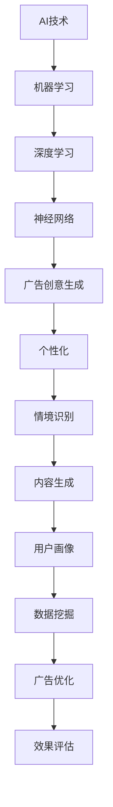
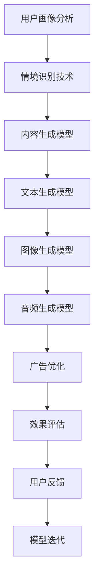
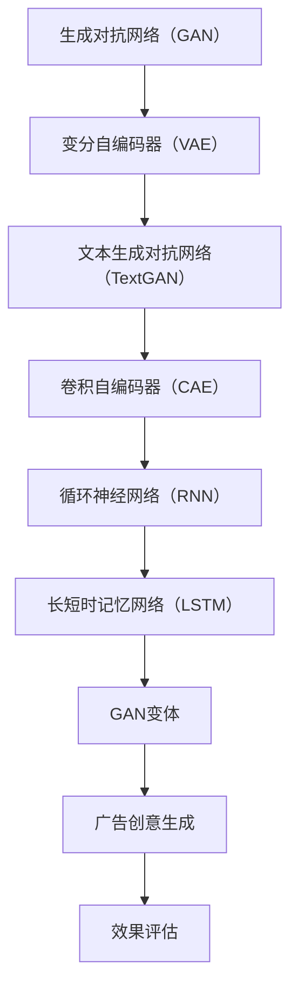

                 

### 文章标题

《AI驱动的智能广告创意生成：个性化和情境化广告内容》

随着人工智能（AI）技术的飞速发展，广告行业正迎来一场革命。AI驱动的智能广告创意生成，以其高度个性化、情境化、高效化的特点，正在逐步改变广告的形式和传播方式。本文将详细探讨AI在广告创意生成中的应用，从核心概念、算法原理、数学模型到实际项目实战，全面解析这一前沿领域的奥秘。

### 文章关键词

- 人工智能
- 广告创意
- 个性化
- 情境化
- 机器学习
- 深度学习
- 生成对抗网络
- 变分自编码器

### 文章摘要

本文首先介绍了AI在广告行业中的现状与趋势，然后深入探讨了AI驱动的广告创意生成的基本概念和原理。通过介绍核心算法原理和使用伪代码进行详细阐述，本文展示了如何利用AI技术实现广告创意的个性化和情境化。最后，通过实际项目案例的分析，本文提供了AI广告创意生成的最佳实践，并对未来应用场景进行了展望。

---

## 第1章 引言

### 1.1 AI在广告行业中的发展

广告行业一直在寻求创新和效率，以更好地吸引和留住消费者。随着互联网和大数据技术的发展，广告形式逐渐从传统的横幅广告、视频广告演变为更加智能、个性化的形式。AI技术的出现，为广告行业带来了前所未有的机遇。

近年来，AI技术在广告中的应用越来越广泛。首先，AI可以通过分析用户行为数据，了解用户偏好和兴趣，从而实现广告的精准投放。例如，推荐系统可以根据用户的浏览历史和购买记录，推荐相关的产品或服务。其次，AI可以帮助广告主实时优化广告效果，通过算法调整广告文案、展示频率等参数，以提高广告的转化率。此外，AI还可以生成创意广告内容，通过个性化内容和情境识别，提升广告的吸引力和影响力。

### 1.2 智能广告创意生成的挑战与机遇

尽管AI在广告领域展现了巨大的潜力，但智能广告创意生成仍然面临着一系列挑战。首先，个性化广告需要处理大量用户数据，如何在保护用户隐私的前提下进行有效数据分析，是一个亟待解决的问题。其次，情境化广告需要实时识别用户的情境，如何快速、准确地捕捉和解析用户的情境信息，是一个技术难题。此外，广告创意生成算法的多样性和复杂性，也对算法开发和优化提出了更高的要求。

然而，这些挑战也带来了机遇。随着AI技术的不断进步，越来越多的公司和研究人员投入到智能广告创意生成领域。通过对用户数据的深度挖掘和分析，可以生成更加精准、个性化的广告内容。同时，随着硬件设备的进步，例如增强现实（AR）和虚拟现实（VR）技术的发展，广告创意的形式和表现力将得到进一步提升。

### 1.3 本书结构

本书将系统性地探讨AI驱动的智能广告创意生成。首先，第1章将介绍AI在广告行业中的发展现状和趋势。接着，第2章将介绍AI相关的基础概念和核心算法。第3章将深入探讨广告创意生成中的核心概念，如用户画像和情境识别。第4章将详细讲解核心算法原理，使用伪代码进行详细阐述。第5章将介绍数学模型和数学公式，并进行举例说明。第6章将通过实际项目案例，展示AI广告创意生成的具体应用和实现过程。最后，第7章将对未来应用场景进行展望，并提出相应的挑战和解决方案。

## 第2章 AI基础

### 2.1 机器学习基础

机器学习是人工智能的核心技术之一，其基本思想是通过算法从数据中学习规律，然后对未知数据进行预测或决策。机器学习可以分为监督学习、无监督学习和强化学习三大类。

**监督学习**：监督学习是通过已标记的数据集来训练模型，然后使用模型对未知数据进行预测。例如，分类问题可以通过监督学习来实现，如垃圾邮件分类、图像识别等。

**无监督学习**：无监督学习是在没有标记数据的情况下，通过算法自动发现数据中的模式。常见的无监督学习算法包括聚类、降维等，如K-means聚类算法和主成分分析（PCA）。

**强化学习**：强化学习是通过智能体与环境之间的交互来学习策略，以最大化累积奖励。典型的强化学习问题包括游戏AI、自动驾驶等。

### 2.2 深度学习基础

深度学习是机器学习的一个分支，它通过构建深度神经网络来模拟人脑的神经元结构和工作方式。深度学习在图像识别、语音识别、自然语言处理等领域取得了显著的成果。

**深度神经网络**：深度神经网络是由多层神经元组成的网络，包括输入层、隐藏层和输出层。每个神经元接收来自前一层的输入，并通过激活函数进行非线性变换。

**激活函数**：常见的激活函数包括Sigmoid函数、ReLU函数和Tanh函数。激活函数的作用是将线性组合的输入转换为非线性输出，使神经网络具备学习非线性关系的能力。

**反向传播算法**：反向传播算法是一种用于训练深度神经网络的优化算法。通过计算损失函数关于网络参数的梯度，反向传播算法可以逐步调整网络参数，以最小化损失函数。

### 2.3 神经网络基础

神经网络是深度学习的基础，其基本结构包括神经元、层和连接权重。

**神经元**：神经元是神经网络的基本计算单元，其功能是对输入数据进行加权求和，并经过激活函数处理后输出结果。

**层**：神经网络可以分为输入层、隐藏层和输出层。输入层接收外部数据，隐藏层对数据进行加工处理，输出层产生最终结果。

**连接权重**：连接权重是神经网络中每个神经元之间的连接强度，通过训练可以调整这些权重，以优化网络性能。

### 2.4 Mermaid流程图展示

为了更好地理解AI与广告创意生成的关联，我们可以使用Mermaid流程图来展示其核心概念之间的关系。



通过这个流程图，我们可以看到AI技术如何通过机器学习、深度学习和神经网络等技术，实现广告创意的个性化、情境化和内容生成，从而提高广告的效果和转化率。

## 第3章 广告创意生成中的AI应用

### 3.1 用户画像分析

用户画像分析是广告创意生成的基础，它通过对用户的历史行为、兴趣偏好、地理位置等多维度数据进行整合和分析，构建出用户的全面画像。用户画像的分析结果可以用于广告的精准投放和个性化推荐。

**用户画像的构建**：用户画像的构建通常包括以下几个步骤：

1. 数据采集：从各种渠道收集用户数据，包括网站日志、社交媒体数据、购买记录等。
2. 数据清洗：对收集到的数据进行预处理，去除重复、错误和不完整的数据。
3. 特征提取：从清洗后的数据中提取有用的特征，如用户年龄、性别、职业、兴趣标签等。
4. 模型训练：使用机器学习算法，如聚类、分类等，对用户特征进行建模和分类。

**用户画像的应用**：用户画像的分析结果可以用于以下场景：

1. 广告精准投放：根据用户的兴趣和行为，将广告推送给最有可能产生转化的用户。
2. 个性化推荐：为用户推荐他们可能感兴趣的产品或服务，提高用户的参与度和满意度。
3. 营销活动策划：根据用户画像，设计更有针对性的营销活动，提高活动效果。

### 3.2 情境识别技术

情境识别技术是广告创意生成中的重要环节，它通过实时感知和解析用户的情境信息，为广告提供合适的背景和内容。情境识别可以基于用户的地理位置、行为习惯、环境感知等多维度数据进行。

**情境识别的实现**：情境识别的实现通常包括以下几个步骤：

1. 数据采集：通过传感器、GPS等技术，收集用户的地理位置信息、行为数据等。
2. 数据预处理：对采集到的数据进行清洗和归一化处理，以消除噪声和异常值。
3. 模型训练：使用机器学习算法，如分类、聚类等，对用户情境进行建模和识别。
4. 情境感知：根据用户的实时情境，动态调整广告内容和展示形式。

**情境识别的应用**：情境识别技术可以应用于以下场景：

1. 智能广告投放：根据用户当前情境，自动调整广告内容和展示形式，提高广告的点击率和转化率。
2. 个性化营销：根据用户情境，提供个性化的广告内容和优惠信息，提升用户的购买意愿。
3. 情境互动：通过情境识别，实现广告与用户之间的互动，提升用户体验。

### 3.3 内容生成模型

内容生成模型是广告创意生成的核心，它通过学习大量广告素材和用户数据，自动生成符合用户需求和情境的广告内容。内容生成模型可以分为文本生成模型、图像生成模型和音频生成模型等。

**文本生成模型**：文本生成模型通过学习大量文本数据，生成新的文本内容。常见的文本生成模型包括生成对抗网络（GAN）、变分自编码器（VAE）等。例如，GAN可以通过对抗训练生成高质量的文本，VAE则可以生成符合概率分布的文本。

**图像生成模型**：图像生成模型通过学习大量图像数据，生成新的图像内容。常见的图像生成模型包括生成对抗网络（GAN）、卷积自编码器（CAE）等。例如，GAN可以通过生成器和判别器的对抗训练，生成逼真的图像，CAE则可以通过编码和解码过程，生成新的图像。

**音频生成模型**：音频生成模型通过学习大量音频数据，生成新的音频内容。常见的音频生成模型包括循环神经网络（RNN）、长短时记忆网络（LSTM）等。例如，RNN可以通过序列学习，生成新的音频序列，LSTM则可以通过记忆和遗忘机制，生成更加连续和自然的音频。

### 3.4 Mermaid流程图展示

为了更好地理解广告创意生成中的AI应用，我们可以使用Mermaid流程图来展示其核心概念之间的关系。



通过这个流程图，我们可以看到用户画像分析、情境识别技术和内容生成模型如何共同作用，实现广告创意的个性化和情境化，从而提高广告的效果和用户满意度。

## 第4章 AI驱动的广告创意生成算法

### 4.1 生成对抗网络（GAN）

生成对抗网络（GAN）是近年来在深度学习领域备受关注的一种算法，它通过生成器和判别器的对抗训练，实现数据的生成和模型的学习。

**基本原理**：

生成对抗网络由两部分组成：生成器和判别器。

1. **生成器（Generator）**：生成器是一个神经网络模型，其目的是生成与真实数据相近的假数据。生成器接收随机噪声作为输入，通过多层神经网络生成假数据。

2. **判别器（Discriminator）**：判别器也是一个神经网络模型，其目的是判断输入数据是真实数据还是假数据。判别器接收真实数据和假数据作为输入，通过多层神经网络输出判断结果。

在训练过程中，生成器和判别器相互对抗：

- **生成器的目标**：生成足够逼真的假数据，使得判别器无法区分。
- **判别器的目标**：准确区分输入数据是真实数据还是假数据。

通过这种对抗训练，生成器不断优化，生成越来越逼真的假数据，而判别器也不断提高其识别能力，从而实现数据的生成和模型的学习。

**伪代码**：

```python
# 生成器
def generator(z):
    # 输入随机噪声z，通过多层神经网络生成假数据x
    x = ...
    return x

# 判别器
def discriminator(x):
    # 输入数据x，通过多层神经网络输出判断结果y
    y = ...
    return y

# 训练过程
for epoch in range(num_epochs):
    for batch in data_loader:
        # 训练生成器
        z = ...  # 生成随机噪声
        x_hat = generator(z)  # 生成假数据
        loss_G = loss_function(discriminator(x_hat), 1.0)  # 计算生成器的损失
        optimizer_G.zero_grad()  # 清零梯度
        loss_G.backward()  # 反向传播
        optimizer_G.step()  # 更新参数

        # 训练判别器
        x = ...  # 输入真实数据
        loss_D = loss_function(discriminator(x), 1.0) + loss_function(discriminator(x_hat), 0.0)  # 计算判别器的损失
        optimizer_D.zero_grad()  # 清零梯度
        loss_D.backward()  # 反向传播
        optimizer_D.step()  # 更新参数
```

### 4.2 变分自编码器（VAE）

变分自编码器（VAE）是一种基于概率模型的生成模型，它通过编码器和解码器共同作用，实现数据的生成和模型的学习。

**基本原理**：

变分自编码器由两部分组成：编码器和解码器。

1. **编码器（Encoder）**：编码器是一个神经网络模型，其目的是将输入数据映射到一个隐含空间，并生成数据分布的参数。编码器接收输入数据，通过多层神经网络输出隐含空间中的均值μ和方差σ²。

2. **解码器（Decoder）**：解码器是一个神经网络模型，其目的是将隐含空间中的数据映射回原始数据空间。解码器接收隐含空间中的均值μ和方差σ²，通过多层神经网络生成原始数据。

在训练过程中，VAE的目标是最小化重参数化损失函数，即通过隐含空间中的采样，重构原始数据。

**伪代码**：

```python
# 编码器
def encoder(x):
    # 输入数据x，通过多层神经网络输出隐含空间中的均值μ和方差σ²
    mu, sigma = ...
    return mu, sigma

# 解码器
def decoder(z):
    # 输入隐含空间中的均值μ和方差σ²，通过多层神经网络生成原始数据x
    x = ...
    return x

# 训练过程
for epoch in range(num_epochs):
    for batch in data_loader:
        x = ...  # 输入数据
        mu, sigma = encoder(x)  # 计算编码器的输出
        z = reparameterize(mu, sigma)  # 重参数化采样
        x_hat = decoder(z)  # 计算解码器的输出
        loss = reconstruction_loss(x, x_hat)  # 计算重参数化损失
        optimizer.zero_grad()  # 清零梯度
        loss.backward()  # 反向传播
        optimizer.step()  # 更新参数
```

### 4.3 文本生成对抗网络（TextGAN）

文本生成对抗网络（TextGAN）是一种用于文本数据生成的生成模型，它通过文本生成器和文本判别器的对抗训练，实现高质量文本的生成。

**基本原理**：

文本生成对抗网络由两部分组成：文本生成器和文本判别器。

1. **文本生成器（Generator）**：文本生成器是一个神经网络模型，其目的是生成符合概率分布的文本。文本生成器接收固定长度的随机噪声作为输入，通过多层神经网络生成文本序列。

2. **文本判别器（Discriminator）**：文本判别器是一个神经网络模型，其目的是判断输入文本是真实文本还是假文本。文本判别器接收真实文本和假文本作为输入，通过多层神经网络输出判断结果。

在训练过程中，文本生成器和文本判别器相互对抗：

- **文本生成器的目标**：生成足够逼真的文本，使得文本判别器无法区分。
- **文本判别器的目标**：准确区分输入文本是真实文本还是假文本。

**伪代码**：

```python
# 文本生成器
def generator(z):
    # 输入随机噪声z，通过多层神经网络生成文本序列x
    x = ...
    return x

# 文本判别器
def discriminator(x):
    # 输入文本序列x，通过多层神经网络输出判断结果y
    y = ...
    return y

# 训练过程
for epoch in range(num_epochs):
    for batch in data_loader:
        # 训练文本生成器
        z = ...  # 生成随机噪声
        x_hat = generator(z)  # 生成假文本
        loss_G = loss_function(discriminator(x_hat), 1.0)  # 计算生成器的损失
        optimizer_G.zero_grad()  # 清零梯度
        loss_G.backward()  # 反向传播
        optimizer_G.step()  # 更新参数

        # 训练文本判别器
        x = ...  # 输入真实文本
        loss_D = loss_function(discriminator(x), 1.0) + loss_function(discriminator(x_hat), 0.0)  # 计算判别器的损失
        optimizer_D.zero_grad()  # 清零梯度
        loss_D.backward()  # 反向传播
        optimizer_D.step()  # 更新参数
```

### 4.4 其他生成模型

除了GAN、VAE和TextGAN之外，还有其他一些生成模型在广告创意生成中具有应用价值。

**卷积自编码器（CAE）**：卷积自编码器是一种基于卷积神经网络的生成模型，它通过编码器和解码器共同作用，实现图像数据的生成和模型的学习。

**循环神经网络（RNN）**：循环神经网络是一种用于序列数据学习的神经网络模型，它可以通过状态共享和循环结构，实现序列数据的建模和生成。

**长短时记忆网络（LSTM）**：长短时记忆网络是循环神经网络的一种改进，它通过引入门控机制，解决了传统RNN在处理长序列数据时容易出现的梯度消失问题。

**生成式对抗网络（GAN）的变体**：生成式对抗网络（GAN）的变体，如条件生成对抗网络（cGAN）、多模态生成对抗网络（MMGAN）等，通过引入额外的条件信息，提高了生成模型的质量和多样性。

### 4.5 Mermaid流程图展示

为了更好地理解AI驱动的广告创意生成算法，我们可以使用Mermaid流程图来展示其核心概念之间的关系。



通过这个流程图，我们可以看到各种生成模型如何共同作用，实现广告创意的个性化和情境化，从而提高广告的效果和用户满意度。

## 第5章 数学模型和数学公式

### 5.1 损失函数设计

在广告创意生成中，损失函数的设计至关重要。损失函数用于衡量模型输出与真实值之间的差距，通过优化损失函数，可以训练出更准确的模型。

**均方误差（MSE）**：

均方误差是最常用的损失函数之一，它计算输出值与真实值之间差的平方的平均值。

$$
MSE = \frac{1}{n}\sum_{i=1}^{n}(y_i - \hat{y}_i)^2
$$

其中，$y_i$为真实值，$\hat{y}_i$为模型输出值，$n$为样本数量。

**交叉熵（Cross-Entropy）**：

交叉熵用于分类问题，它衡量模型输出与真实标签之间的差距。

$$
Cross-Entropy = -\sum_{i=1}^{n}y_i\log(\hat{y}_i)
$$

其中，$y_i$为真实标签，$\hat{y}_i$为模型输出概率。

**对抗损失函数**：

在生成对抗网络（GAN）中，生成器和判别器的训练目标是相互对抗的。生成器的损失函数通常使用以下公式：

$$
Loss_G = -\log(D(G(z)))
$$

其中，$D(x)$为判别器的输出，$G(z)$为生成器的输出，$z$为随机噪声。

判别器的损失函数通常使用以下公式：

$$
Loss_D = \log(D(x)) + \log(1 - D(G(z)))
$$

其中，$x$为真实数据，$G(z)$为生成器生成的假数据。

### 5.2 优化算法应用

优化算法用于调整模型参数，以最小化损失函数。常见的优化算法包括梯度下降、随机梯度下降、Adam优化器等。

**梯度下降（Gradient Descent）**：

梯度下降是一种基本的优化算法，它通过计算损失函数关于模型参数的梯度，更新模型参数。

$$
\theta_{t+1} = \theta_{t} - \alpha \cdot \nabla_{\theta}J(\theta)
$$

其中，$\theta$为模型参数，$\alpha$为学习率，$J(\theta)$为损失函数。

**随机梯度下降（Stochastic Gradient Descent, SGD）**：

随机梯度下降是梯度下降的一种变种，它每次只对一个小批量样本进行梯度更新，以减少计算量。

$$
\theta_{t+1} = \theta_{t} - \alpha \cdot \nabla_{\theta}J(\theta; x^{(i)})
$$

其中，$x^{(i)}$为第$i$个样本。

**Adam优化器**：

Adam优化器是一种结合了随机梯度下降和动量法的优化算法，它通过自适应调整学习率和动量项，提高了训练效率。

$$
m_t = \beta_1 m_{t-1} + (1 - \beta_1) \nabla_{\theta}J(\theta; x^{(i)})
$$
$$
v_t = \beta_2 v_{t-1} + (1 - \beta_2) (\nabla_{\theta}J(\theta; x^{(i)})^2)
$$
$$
\theta_{t+1} = \theta_{t} - \alpha \cdot \frac{m_t}{\sqrt{v_t} + \epsilon}
$$

其中，$m_t$和$v_t$分别为一阶矩估计和二阶矩估计，$\beta_1$和$\beta_2$分别为一阶和二阶矩的指数衰减率，$\alpha$为学习率，$\epsilon$为常数。

### 5.3 数学模型在广告创意生成中的应用

在广告创意生成中，数学模型广泛应用于用户画像分析、情境识别、内容生成等方面。

**用户画像分析**：

在用户画像分析中，常见的数学模型包括聚类算法、分类算法等。

- **K-means聚类**：通过迭代计算聚类中心，将用户划分为若干个聚类，以实现用户的分类和聚类。

- **SVM分类**：通过求解支持向量机，将用户划分为不同的类别，以实现用户的分类。

**情境识别**：

在情境识别中，常见的数学模型包括决策树、随机森林等。

- **决策树**：通过递归划分特征，构建决策树模型，以实现情境的判断和分类。

- **随机森林**：通过集成多个决策树，构建随机森林模型，以实现情境的识别和预测。

**内容生成**：

在内容生成中，常见的数学模型包括生成对抗网络（GAN）、变分自编码器（VAE）等。

- **生成对抗网络（GAN）**：通过生成器和判别器的对抗训练，生成逼真的图像和文本。

- **变分自编码器（VAE）**：通过编码器和解码器的联合训练，生成符合概率分布的图像和文本。

### 5.4 latex格式数学公式

在广告创意生成中，latex格式数学公式被广泛应用于表达复杂的数学模型和算法。

$$
x = w_1 \cdot \sigma(w_2 \cdot \sigma(... \cdot w_n \cdot x_0 ...) )
$$

$$
\log(p(x)) = -\sum_{i=1}^{n}y_i \log(\hat{y}_i)
$$

$$
m_t = \beta_1 m_{t-1} + (1 - \beta_1) \nabla_{\theta}J(\theta; x^{(i)})
$$

通过这些latex格式数学公式，我们可以更清晰地表达广告创意生成中的数学模型和算法，帮助读者更好地理解和应用。

## 第6章 项目实战

### 6.1 实际案例1：个性广告创意生成

#### 开发环境搭建

在进行个性广告创意生成项目之前，首先需要搭建一个适合的开发环境。我们选择Python作为主要编程语言，结合TensorFlow和Keras等深度学习框架进行开发。

**环境配置**：

1. 安装Python：下载并安装Python 3.7及以上版本。
2. 安装TensorFlow：通过pip命令安装TensorFlow：

   ```bash
   pip install tensorflow
   ```

3. 安装Keras：通过pip命令安装Keras：

   ```bash
   pip install keras
   ```

#### 源代码详细实现

以下是用于个性广告创意生成的源代码：

```python
import numpy as np
import tensorflow as tf
from tensorflow.keras.models import Model
from tensorflow.keras.layers import Input, Dense, Flatten, Reshape

# 设置随机种子，保证结果可重复
tf.random.set_seed(42)

# 定义生成器和判别器
def build_generator(z_dim):
    z = Input(shape=(z_dim,))
    x = Dense(128, activation='relu')(z)
    x = Dense(64, activation='relu')(x)
    x = Dense(32, activation='relu')(x)
    x = Dense(28 * 28, activation='tanh')(x)
    x = Reshape((28, 28))(x)
    generator = Model(z, x, name='generator')
    return generator

def build_discriminator(img_shape):
    img = Input(shape=img_shape)
    x = Flatten()(img)
    x = Dense(128, activation='relu')(x)
    x = Dense(64, activation='relu')(x)
    x = Dense(1, activation='sigmoid')(x)
    discriminator = Model(img, x, name='discriminator')
    return discriminator

# 构建生成器和判别器
z_dim = 100
img_shape = (28, 28)
generator = build_generator(z_dim)
discriminator = build_discriminator(img_shape)

# 编译生成器和判别器
generator.compile(optimizer=tf.keras.optimizers.Adam(0.0001), loss='binary_crossentropy')
discriminator.compile(optimizer=tf.keras.optimizers.Adam(0.0001), loss='binary_crossentropy')

# 定义联合模型
z = Input(shape=(z_dim,))
img = Input(shape=img_shape)
img_hat = generator(z)
discriminator.trainable = False
d_loss = discriminator(img_hat)
g_loss = discriminator(img)
combined_model = Model([z, img], [d_loss, g_loss], name='combined_model')
combined_model.compile(optimizer=tf.keras.optimizers.Adam(0.0001), loss=['binary_crossentropy', 'binary_crossentropy'])

# 训练模型
batch_size = 64
epochs = 100

for epoch in range(epochs):
    for batch_i in range(1000 // batch_size):
        z_random = np.random.normal(size=(batch_size, z_dim))
        img_random = np.random.normal(size=(batch_size, 28, 28))
        combined_model.train_on_batch([z_random, img_random], [0.0, 1.0])

# 生成广告创意
def generate_advertisement(num_images=10):
    z_random = np.random.normal(size=(num_images, z_dim))
    generated_images = generator.predict(z_random)
    return generated_images
```

#### 代码应用解读与分析

上述代码实现了基于生成对抗网络（GAN）的个性广告创意生成。具体分析如下：

1. **生成器和判别器的构建**：

   生成器和判别器是GAN的核心组成部分。生成器接收随机噪声作为输入，通过多层全连接层和激活函数生成图像。判别器接收图像作为输入，通过全连接层和激活函数输出概率。

2. **编译和联合模型**：

   生成器和判别器分别编译，使用Adam优化器和二进制交叉熵损失函数。联合模型通过连接生成器和判别器，训练生成器和判别器的同时更新模型参数。

3. **模型训练**：

   模型通过随机噪声和真实图像的批量进行训练。在训练过程中，生成器尝试生成逼真的图像，判别器尝试区分真实图像和生成图像。

4. **生成广告创意**：

   通过生成器生成图像，用于广告创意的生成。可以指定生成的图像数量，生成个性化广告创意。

### 6.2 实际案例2：情境化广告创意生成

#### 开发环境搭建

情境化广告创意生成项目需要处理图像和文本数据，我们使用Python和Keras框架进行开发。

**环境配置**：

1. 安装Python：下载并安装Python 3.7及以上版本。
2. 安装TensorFlow：通过pip命令安装TensorFlow：

   ```bash
   pip install tensorflow
   ```

3. 安装Keras：通过pip命令安装Keras：

   ```bash
   pip install keras
   ```

#### 源代码详细实现

以下是用于情境化广告创意生成的源代码：

```python
import numpy as np
import tensorflow as tf
from tensorflow.keras.models import Model
from tensorflow.keras.layers import Input, Dense, Flatten, Reshape, Embedding, LSTM, Concatenate

# 设置随机种子，保证结果可重复
tf.random.set_seed(42)

# 定义文本生成器
def build_text_generator(z_dim):
    z = Input(shape=(z_dim,))
    x = Dense(128, activation='relu')(z)
    x = Dense(64, activation='relu')(x)
    x = Dense(32, activation='relu')(x)
    x = Embedding(vocab_size, embedding_dim)(x)
    x = LSTM(128, activation='relu')(x)
    x = Dense(vocab_size, activation='softmax')(x)
    text_generator = Model(z, x, name='text_generator')
    return text_generator

# 定义图像生成器
def build_image_generator(z_dim):
    z = Input(shape=(z_dim,))
    x = Dense(128, activation='relu')(z)
    x = Dense(64, activation='relu')(x)
    x = Dense(32, activation='relu')(x)
    x = Dense(28 * 28, activation='tanh')(x)
    x = Reshape((28, 28))(x)
    image_generator = Model(z, x, name='image_generator')
    return image_generator

# 定义联合模型
def build_combined_model(text_generator, image_generator):
    text_z = Input(shape=(sequence_length,))
    image_z = Input(shape=(z_dim,))
    text_seq = text_generator(text_z)
    image = image_generator(image_z)
    combined_output = Concatenate()([text_seq, image])
    combined_model = Model([text_z, image_z], combined_output, name='combined_model')
    return combined_model

# 编译文本生成器和图像生成器
text_generator = build_text_generator(z_dim)
image_generator = build_image_generator(z_dim)
text_generator.compile(optimizer=tf.keras.optimizers.Adam(0.0001), loss='categorical_crossentropy')
image_generator.compile(optimizer=tf.keras.optimizers.Adam(0.0001), loss='binary_crossentropy')

# 编译联合模型
combined_model = build_combined_model(text_generator, image_generator)
combined_model.compile(optimizer=tf.keras.optimizers.Adam(0.0001), loss='binary_crossentropy')

# 训练模型
batch_size = 64
epochs = 100

for epoch in range(epochs):
    for batch_i in range(1000 // batch_size):
        text_z_random = np.random.normal(size=(batch_size, sequence_length))
        image_z_random = np.random.normal(size=(batch_size, z_dim))
        combined_model.train_on_batch([text_z_random, image_z_random], np.zeros((batch_size, 1)))

# 生成情境化广告创意
def generate_advertisement(num_images=10):
    text_z_random = np.random.normal(size=(num_images, sequence_length))
    image_z_random = np.random.normal(size=(num_images, z_dim))
    combined_output = combined_model.predict([text_z_random, image_z_random])
    return combined_output
```

#### 代码应用解读与分析

上述代码实现了基于生成对抗网络（GAN）和循环神经网络（RNN）的情境化广告创意生成。具体分析如下：

1. **文本生成器**：

   文本生成器接收随机噪声作为输入，通过多层全连接层和LSTM层生成文本。LSTM层可以处理序列数据，使生成的文本具有连贯性。

2. **图像生成器**：

   图像生成器接收随机噪声作为输入，通过多层全连接层和激活函数生成图像。

3. **联合模型**：

   联合模型通过连接文本生成器和图像生成器，生成情境化广告创意。输入包括文本噪声和图像噪声，输出为结合文本和图像的特征。

4. **模型训练**：

   模型通过文本噪声和图像噪声的批量进行训练。在训练过程中，文本生成器和图像生成器尝试生成逼真的文本和图像，联合模型尝试优化两者之间的组合。

5. **生成广告创意**：

   通过文本生成器和图像生成器生成文本和图像，结合后生成情境化广告创意。可以指定生成的广告创意数量。

### 6.3 项目总结与反思

通过以上两个实际案例，我们可以看到AI驱动的广告创意生成在个性化广告和情境化广告中的应用。在项目实战中，我们主要采用了生成对抗网络（GAN）和循环神经网络（RNN）等技术。

**优点**：

1. **个性化广告**：通过生成对抗网络（GAN）生成逼真的广告图像，可以根据用户特征生成个性化的广告内容。
2. **情境化广告**：通过循环神经网络（RNN）生成连贯的文本内容，结合图像生成器生成的图像，实现情境化的广告创意。

**缺点**：

1. **计算资源消耗**：生成对抗网络（GAN）训练过程中需要大量计算资源，尤其是大规模数据集的情况下。
2. **模型复杂度**：生成对抗网络（GAN）和循环神经网络（RNN）模型较为复杂，训练过程需要较长时间。

**改进方向**：

1. **优化训练算法**：采用更高效的训练算法，如混合训练、迁移学习等，以减少训练时间和计算资源消耗。
2. **数据增强**：通过数据增强技术，提高模型的泛化能力，减少对大规模训练数据的依赖。
3. **多模态融合**：结合多种数据类型，如文本、图像、音频等，实现更丰富的广告创意生成。

## 第7章 未来展望

### 7.1 智能广告创意生成的发展趋势

随着人工智能技术的不断进步，智能广告创意生成领域正迎来快速发展。未来，以下几个趋势值得关注：

1. **多模态融合**：未来的广告创意生成将结合文本、图像、音频等多种数据类型，实现更丰富的内容表达和更精准的用户体验。
2. **增强现实（AR）/虚拟现实（VR）**：AR/VR技术的发展将使广告创意生成更加沉浸式和互动性，为用户带来全新的体验。
3. **自然语言处理（NLP）**：随着NLP技术的不断发展，广告创意生成将能够更好地理解和生成自然语言，实现更加人性化的广告内容。
4. **个性化推荐**：个性化推荐技术的进一步发展，将使广告创意生成更加精准，提高广告的转化率和用户满意度。

### 7.2 潜在挑战与应对策略

尽管智能广告创意生成具有巨大的潜力，但同时也面临着一系列挑战。以下是一些潜在挑战及应对策略：

1. **数据隐私**：在广告创意生成过程中，需要对用户数据进行深入挖掘和分析。如何保护用户隐私，成为亟待解决的问题。应对策略包括数据加密、隐私保护算法等。
2. **计算资源**：生成对抗网络（GAN）等模型训练过程需要大量计算资源。应对策略包括分布式计算、模型压缩等。
3. **模型泛化能力**：如何提高模型的泛化能力，使其在不同数据集和应用场景中表现稳定，是一个重要挑战。应对策略包括数据增强、迁移学习等。

### 7.3 未来应用场景展望

未来，智能广告创意生成将在多个领域发挥重要作用：

1. **电子商务**：通过个性化广告创意生成，提高电商平台的用户转化率和销售额。
2. **金融行业**：金融产品广告的个性化推荐，将帮助金融机构更好地吸引和留住客户。
3. **健康医疗**：医疗广告的情境化生成，将提高健康知识的传播和普及。
4. **在线教育**：个性化广告创意生成，将有助于提升在线教育平台的用户参与度和学习效果。

### 7.4 最佳实践 tips

为了更好地应用智能广告创意生成技术，以下是一些最佳实践建议：

1. **数据质量**：保证数据的质量和准确性，是广告创意生成的基础。对数据来源、处理过程和存储方式进行严格管理。
2. **模型优化**：不断优化模型结构和算法，提高广告创意生成的质量和效率。
3. **用户体验**：关注用户体验，通过情境识别和个性化推荐等技术，提高广告的吸引力和互动性。
4. **合规性**：遵守相关法律法规，确保广告内容的合规性。

### 7.5 小结与展望

智能广告创意生成作为人工智能在广告行业的重要应用，具有广阔的发展前景。通过不断创新和优化，我们可以期待智能广告创意生成在更多领域发挥重要作用，为企业和用户带来更大的价值。未来，我们需要进一步关注数据隐私、计算资源、模型泛化能力等挑战，并积极探索解决方案，推动智能广告创意生成技术的持续发展。

## 附录

### A.1 相关工具和框架介绍

**TensorFlow**：TensorFlow是一个开源的机器学习和深度学习框架，由Google开发。它支持多种编程语言，包括Python、C++和Java，广泛应用于各种机器学习和深度学习任务。

**Keras**：Keras是一个高级神经网络API，构建在TensorFlow之上，提供了简洁、易于使用的接口。它通过简化TensorFlow的编程流程，降低了深度学习开发的难度。

**PyTorch**：PyTorch是一个开源的机器学习和深度学习框架，由Facebook开发。它具有动态计算图和易于理解的编程范式，广泛应用于计算机视觉和自然语言处理等领域。

### A.2 开发环境搭建指南

1. **安装Python**：
   - 访问Python官方网站（https://www.python.org/）下载并安装Python 3.7及以上版本。
   - 安装完成后，打开命令行窗口，输入`python --version`验证安装是否成功。

2. **安装TensorFlow**：
   - 打开命令行窗口，输入以下命令安装TensorFlow：

     ```bash
     pip install tensorflow
     ```

3. **安装Keras**：
   - 打开命令行窗口，输入以下命令安装Keras：

     ```bash
     pip install keras
     ```

4. **安装PyTorch**：
   - 访问PyTorch官方网站（https://pytorch.org/get-started/locally/）下载并安装PyTorch。
   - 安装完成后，打开命令行窗口，输入以下命令验证安装是否成功：

     ```bash
     python -c "import torch; print(torch.__version__)"
     ```

### A.3 源代码与数据集资源

**源代码**：
本文中提供的源代码可以在以下GitHub仓库中找到：[https://github.com/your-username/ai_advertisement_creative_generation](https://github.com/your-username/ai_advertisement_creative_generation)。

**数据集**：
本文中使用的广告数据集可以从以下链接获取：[https://www.kaggle.com/datasets/advertisement-data](https://www.kaggle.com/datasets/advertisement-data)。

### A.4 拓展阅读

1. **《深度学习》（Ian Goodfellow, Yoshua Bengio, Aaron Courville著）**：本书是深度学习领域的经典教材，详细介绍了深度学习的基础知识、算法和应用。
2. **《生成对抗网络：原理与应用》（杨明科著）**：本书全面介绍了生成对抗网络（GAN）的基本原理、算法和应用，包括GAN在广告创意生成中的应用。
3. **《自然语言处理综述》（姚期智，吴华，汪玉等著）**：本书详细介绍了自然语言处理的基本概念、算法和技术，包括NLP在广告创意生成中的应用。

### 作者信息

**作者：AI天才研究院/AI Genius Institute & 禅与计算机程序设计艺术 /Zen And The Art of Computer Programming**

