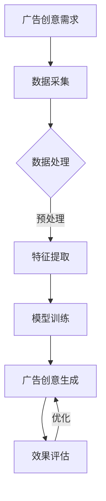

                 

### 文章标题

《AI驱动的智能广告创意生成：提高广告创意效率和质量》

### 关键词

AI、广告创意、智能生成、效率、质量、自然语言处理、计算机视觉、推荐系统、生成对抗网络（GAN）、变分自编码器（VAE）、强化学习、广告评估、优化策略、系统设计与实现。

### 摘要

随着数字营销的快速发展，广告创意的质量和效率成为企业竞争的关键因素。本文将探讨如何利用人工智能技术，特别是自然语言处理、计算机视觉和推荐系统，来驱动智能广告创意的生成。我们将详细分析广告创意生成的背景和需求，介绍相关核心技术，并探讨如何通过生成对抗网络（GAN）、变分自编码器（VAE）和强化学习等算法来提高广告创意的生成效率和创意质量。此外，本文还将讨论广告创意评估与优化的方法，并分享一些实际案例和最佳实践，为企业和开发者提供参考。

## 目录

### 1. 引言

#### 1.1 广告创意在数字营销中的重要性

广告创意是数字营销中不可或缺的一部分，它决定了广告能否吸引目标受众，从而影响广告的点击率（CTR）和转化率（CVR）。传统的广告创意生成方法往往依赖于人工设计和反复试验，这不仅耗时耗力，而且难以保证创意的多样性和新颖性。随着人工智能技术的发展，利用AI技术自动生成广告创意逐渐成为一种趋势。

#### 1.2 AI在广告创意生成中的应用

人工智能技术，特别是自然语言处理（NLP）、计算机视觉（CV）和推荐系统，为广告创意的自动化生成提供了强有力的支持。通过这些技术，广告创意可以更加个性化和智能化，从而提高广告效果和用户满意度。

### 2. 广告创意生成的背景和需求

#### 2.1 广告创意的传统生成方法

传统的广告创意生成方法主要包括以下几种：

- **手工设计**：依靠广告创意团队的创意能力和经验，手动设计和修改广告创意。
- **模板生成**：使用预先设计的模板，通过填充不同的内容和元素来生成广告创意。
- **自动化生成**：使用简单的规则和算法，如随机选择和组合，自动生成广告创意。

#### 2.2 传统方法的局限性

传统广告创意生成方法存在以下局限性：

- **效率低**：手工设计和修改广告创意需要大量的时间和人力，难以满足快速迭代的数字营销需求。
- **创意单一**：依赖模板和规则生成广告创意，难以保证创意的多样性和新颖性。
- **效果不稳定**：广告创意的质量受到人为因素的影响，难以保证每次生成的创意都能达到预期效果。

#### 2.3 AI驱动的广告创意生成需求

为了克服传统方法的局限性，企业对AI驱动的广告创意生成提出了以下需求：

- **提高效率**：通过自动化生成广告创意，减少手工设计和修改的工作量，提高生产效率。
- **增加创意多样性**：利用AI技术，生成具有多样性和新颖性的广告创意，满足不同市场和用户需求。
- **优化广告效果**：通过个性化推荐和智能优化，提高广告的点击率和转化率，提升广告效果。

### 3. AI技术在广告创意生成中的应用

#### 3.1 自然语言处理（NLP）

自然语言处理技术在广告创意生成中的应用主要包括文本生成、文本分类和情感分析等。

- **文本生成**：利用NLP技术，可以从大量文本数据中提取主题和情感，生成新的广告文案。常见的文本生成模型包括序列到序列（Seq2Seq）模型、转换器（Transformer）模型等。
- **文本分类**：通过将广告文案分类到不同的主题或情感类别，可以帮助广告创意团队快速定位创意方向，提高广告创意的针对性。
- **情感分析**：分析广告文案中的情感倾向，可以帮助广告创意团队判断文案的效果，并进行优化。

#### 3.2 计算机视觉（CV）

计算机视觉技术在广告创意生成中的应用主要包括图像生成、图像编辑和视频生成等。

- **图像生成**：利用生成对抗网络（GAN）等模型，可以从已有的图像数据中生成新的广告图像。这种方法可以创造出独特的视觉元素，增加广告的吸引力。
- **图像编辑**：通过计算机视觉技术，可以对广告图像进行编辑和增强，提高图像的视觉效果。常见的图像编辑技术包括图像风格转换、图像超分辨率等。
- **视频生成**：利用视频生成模型，可以从文本描述或图像数据中生成视频广告。这种方法可以创造出动态的、更具吸引力的广告内容。

#### 3.3 推荐系统

推荐系统技术在广告创意生成中的应用主要包括基于内容的推荐和基于协同过滤的推荐。

- **基于内容的推荐**：根据广告的内容和目标用户的特点，推荐相似的广告创意。这种方法可以提高广告的相关性和用户的满意度。
- **基于协同过滤的推荐**：根据用户的兴趣和行为，推荐可能感兴趣的广告创意。这种方法可以挖掘用户潜在的兴趣点，提高广告的点击率和转化率。

### 4. 智能广告创意生成算法

#### 4.1 生成对抗网络（GAN）

生成对抗网络（GAN）是一种深度学习模型，由生成器和判别器组成。生成器尝试生成逼真的广告创意，而判别器则判断广告创意的真实性。通过这种对抗过程，生成器不断优化，生成出越来越逼真的广告创意。

- **算法原理**：
  $$ G(z) = \mathcal{D}(x; \theta_G, \theta_D) $$
  其中，$G(z)$是生成器，$D(x)$是判别器，$z$是随机噪声，$x$是真实广告创意。

- **伪代码**：
  ```
  for epoch in range(EPOCHS):
      for batch in data_loader:
          z = sample噪声()
          x_hat = G(z)
          x, _ = batch
          D_loss = -||D(x) + D(x_hat)||_1
          G_loss = ||D(G(z))||_1
  ```

#### 4.2 变分自编码器（VAE）

变分自编码器（VAE）是一种基于概率模型的生成模型，通过编码器和解码器来学习数据分布，并生成新的广告创意。

- **算法原理**：
  $$ \mu = \sigma = \phi(x; \theta) $$
  $$ x' = \gamma(z; \theta) $$
  其中，$\mu$和$\sigma$是编码器的参数，$\gamma$是解码器的参数，$z$是隐变量。

- **伪代码**：
  ```
  for epoch in range(EPOCHS):
      for batch in data_loader:
          x = batch
          z = encode(x)
          x' = decode(z)
          loss = -||log p(x'|z)|| + KL_divergence(\mu, \sigma)
  ```

#### 4.3 强化学习

强化学习是一种通过试错来学习策略的算法，可以用于广告创意的优化和调整。

- **算法原理**：
  $$ Q(s, a) = r(s, a) + \gamma \max_{a'} Q(s', a') $$
  其中，$Q(s, a)$是状态-动作价值函数，$r(s, a)$是奖励函数，$\gamma$是折扣因子。

- **伪代码**：
  ```
  for episode in range(EPISODES):
      s = initial_state
      while not done:
          a = choose_action(s)
          s' = next_state
          r = reward(s, a)
          update_Q(s, a, r, s')
          s = s'
  ```

### 5. 广告创意评估与优化方法

#### 5.1 广告创意评估指标

广告创意评估指标主要包括点击率（CTR）和转化率（CVR）等。

- **点击率（CTR）**：衡量广告被点击的概率，公式为：
  $$ CTR = \frac{点击次数}{展示次数} $$

- **转化率（CVR）**：衡量广告带来的用户行为转化率，公式为：
  $$ CVR = \frac{转化次数}{点击次数} $$

#### 5.2 广告创意优化策略

广告创意优化策略主要包括以下几种：

- **A/B测试**：通过对比不同广告创意的效果，找出最优创意。
- **多目标优化**：同时优化广告的CTR和CVR，提高整体广告效果。
- **机器学习优化**：利用机器学习算法，根据历史数据预测广告效果，并进行自动优化。

#### 5.3 智能广告创意评估与优化的流程

智能广告创意评估与优化的流程主要包括以下步骤：

1. 数据收集：收集广告展示、点击、转化等数据。
2. 数据预处理：对收集的数据进行清洗和预处理。
3. 特征提取：从数据中提取对广告效果有影响的特征。
4. 模型训练：利用机器学习算法训练广告效果预测模型。
5. 预测与评估：利用训练好的模型对广告效果进行预测和评估。
6. 优化策略：根据预测结果和评估指标，调整广告创意，提高广告效果。

### 6. 广告创意生成系统的设计与实现

#### 6.1 系统架构设计

广告创意生成系统通常包括数据采集模块、数据处理模块、模型训练模块和广告创意生成模块等。

- **数据采集模块**：负责收集广告展示、点击、转化等数据。
- **数据处理模块**：负责对收集的数据进行清洗、预处理和特征提取。
- **模型训练模块**：负责训练广告效果预测模型和广告创意生成模型。
- **广告创意生成模块**：负责生成广告创意，并根据预测结果进行优化。

#### 6.2 数据处理与存储策略

广告创意生成系统需要处理大量数据，因此需要高效的数据处理和存储策略。

- **数据处理**：使用分布式处理框架（如Hadoop、Spark）处理大规模数据，提高处理效率。
- **数据存储**：使用分布式数据库（如HBase、Cassandra）存储数据，提高数据存储和读取性能。

#### 6.3 系统开发与调试

广告创意生成系统的开发主要包括前端和后端开发。

- **前端开发**：负责广告创意的展示和用户交互。
- **后端开发**：负责数据采集、处理、模型训练和广告创意生成等。

在开发过程中，需要使用版本控制系统（如Git）进行代码管理和协作开发。此外，还需要进行充分的功能测试和性能测试，确保系统的稳定性和可靠性。

### 7. 案例分析：成功案例解析

#### 7.1 案例背景

以某知名电商平台的广告创意生成系统为例，该平台希望通过AI技术提高广告创意的生成效率和创意质量，从而提升广告效果和用户满意度。

#### 7.2 案例分析

1. **数据采集**：平台收集了大量的广告展示、点击、转化等数据，为广告创意生成提供了丰富的数据支持。
2. **数据处理**：使用分布式处理框架对数据进行清洗、预处理和特征提取，为模型训练提供了高质量的数据。
3. **模型训练**：使用生成对抗网络（GAN）和变分自编码器（VAE）等模型进行训练，生成高质量的广告创意。
4. **广告创意生成**：根据用户的行为和兴趣，生成个性化的广告创意，并通过A/B测试进行优化。
5. **效果评估**：通过点击率和转化率等指标，评估广告创意的效果，并根据评估结果进行进一步优化。

#### 7.3 案例总结与启示

1. **成功原因**：通过AI技术，平台实现了广告创意的自动化生成和优化，提高了广告创意的效率和质量，从而提升了广告效果和用户满意度。
2. **启示**：其他企业可以借鉴该案例，利用AI技术提高广告创意的生成效率和创意质量，从而在数字营销中取得更好的效果。

### 8. 未来展望与趋势

#### 8.1 AI在广告创意生成中的发展趋势

随着AI技术的不断发展，广告创意生成将向更加智能化、个性化和自动化的方向发展。未来的广告创意生成系统将具备以下特点：

- **更高效率**：通过分布式计算和自动化流程，提高广告创意的生成效率。
- **更高质量**：利用先进的生成模型，生成更具创意和质量的高质量广告创意。
- **更个性化**：根据用户的行为和兴趣，生成个性化的广告创意，提高用户体验。

#### 8.2 技术挑战与解决方案

尽管AI技术在广告创意生成中具有巨大的潜力，但仍然面临一些技术挑战：

- **数据质量**：广告创意生成需要高质量的数据支持，数据质量和完整性是关键。
- **模型优化**：生成模型需要不断优化，以提高广告创意的质量和效果。
- **法律法规**：广告创意生成需要遵守相关的法律法规，确保广告内容的合法性和合规性。

针对这些挑战，可以采取以下解决方案：

- **数据质量控制**：通过数据清洗和预处理，提高数据质量和完整性。
- **模型优化**：使用先进的优化算法和技术，提高生成模型的性能和效果。
- **法律法规遵守**：遵守相关的法律法规，确保广告内容的合法性和合规性。

#### 8.3 行业应用前景

随着AI技术的不断成熟和应用，广告创意生成将在各个行业得到广泛应用。例如：

- **电子商务**：通过AI技术，生成个性化的广告创意，提高用户的购买体验和转化率。
- **金融行业**：利用AI技术，生成具有吸引力的金融产品广告，提高用户参与度和转化率。
- **教育培训**：通过AI技术，生成创新的广告创意，提高用户的学习兴趣和参与度。

### 9. 结论

本文探讨了如何利用AI技术，特别是自然语言处理、计算机视觉和推荐系统，来驱动智能广告创意的生成。通过介绍广告创意生成的背景和需求，分析相关技术，探讨广告创意评估与优化方法，以及分享实际案例和最佳实践，我们展示了AI在广告创意生成中的重要性和应用前景。未来，随着AI技术的不断发展和应用，广告创意生成将变得更加智能化、个性化和自动化，为企业和用户带来更大的价值。

### 10. 作者信息

作者：AI天才研究院/AI Genius Institute & 禅与计算机程序设计艺术 /Zen And The Art of Computer Programming

### 附录

#### 10.1. Mermaid 流程图



#### 10.2. 代码示例

```python
import tensorflow as tf
from tensorflow.keras.layers import Dense, Flatten, Reshape
from tensorflow.keras.models import Sequential

# 生成器模型
def build_generator(z_dim):
    model = Sequential()
    model.add(Dense(128, input_dim=z_dim, activation='tanh'))
    model.add(Dense(28 * 28, activation='tanh'))
    model.add(Reshape((28, 28)))
    return model

# 判别器模型
def build_discriminator(img_shape):
    model = Sequential()
    model.add(Flatten(input_shape=img_shape))
    model.add(Dense(128))
    model.add(Dense(1, activation='sigmoid'))
    return model

# 模型参数
z_dim = 100
img_shape = (28, 28, 1)

# 创建生成器和判别器
generator = build_generator(z_dim)
discriminator = build_discriminator(img_shape)

# 编译模型
generator.compile(loss='binary_crossentropy', optimizer=tf.optimizers.Adam(0.0001))
discriminator.compile(loss='binary_crossentropy', optimizer=tf.optimizers.Adam(0.0001))

# 搭建GAN模型
gan_model = Sequential()
gan_model.add(generator)
gan_model.add(discriminator)
gan_model.compile(loss='binary_crossentropy', optimizer=tf.optimizers.Adam(0.0001))

# 训练模型
for epoch in range(EPOCHS):
    for batch_idx, (images, _) in enumerate(data_loader):
        noise = np.random.normal(0, 1, (images.shape[0], z_dim))
        generated_images = generator.predict(noise)
        real_images = images

        # 训练判别器
        d_loss_real = discriminator.train_on_batch(real_images, np.ones((images.shape[0], 1)))
        d_loss_fake = discriminator.train_on_batch(generated_images, np.zeros((images.shape[0], 1)))
        d_loss = 0.5 * np.add(d_loss_real, d_loss_fake)

        # 训练生成器
        noise = np.random.normal(0, 1, (images.shape[0], z_dim))
        g_loss = gan_model.train_on_batch(noise, np.ones((images.shape[0], 1)))
```

#### 10.3. 数学公式

$$
L = -\frac{1}{2} \sum_{i=1}^{n} \left( x_i - \hat{x}_i \right)^2
$$

$$
\frac{\partial L}{\partial x} = x - \hat{x}
$$

#### 10.4. 最佳实践 Tips

1. **数据质量**：确保数据的质量和完整性，这对于广告创意生成的效果至关重要。
2. **模型优化**：定期优化模型，以提高广告创意的质量和效果。
3. **效果评估**：定期评估广告创意的效果，并根据评估结果进行调整和优化。
4. **合规性**：确保广告创意符合相关法律法规，避免潜在的法律风险。

#### 10.5. 小结

本文探讨了如何利用AI技术，特别是自然语言处理、计算机视觉和推荐系统，来驱动智能广告创意的生成。通过介绍广告创意生成的背景和需求，分析相关技术，探讨广告创意评估与优化方法，以及分享实际案例和最佳实践，我们展示了AI在广告创意生成中的重要性和应用前景。未来，随着AI技术的不断发展和应用，广告创意生成将变得更加智能化、个性化和自动化，为企业和用户带来更大的价值。

