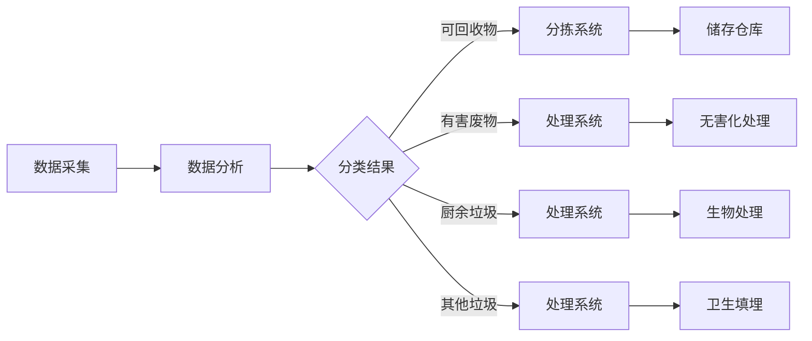

                 

## 确定文章的核心内容

### 1. 背景介绍

随着全球城市化进程的加速和人口的快速增长，废物管理成为了一个日益严峻的挑战。传统的废物管理方法往往效率低下，且对环境造成了严重的污染。近年来，人工智能（AI）技术的迅猛发展为废物管理带来了新的机遇。AI驱动的智能废物管理能够通过数据分析和自动化控制等手段，优化回收和处理流程，提高资源利用率，减少环境污染。

### 2. 核心概念与联系

智能废物管理涉及多个核心概念，包括数据采集、分析、分类、分拣、自动化控制等。这些概念之间有着紧密的联系，构成了一个完整的智能废物管理流程。

- **数据采集**：通过传感器、摄像头等设备收集废物产生、回收、处理的数据。
- **数据分析**：利用机器学习算法对收集的数据进行分析，提取有用信息。
- **分类与分拣**：根据分析结果对废物进行分类和分拣，以便进行后续处理。
- **自动化控制**：通过自动化系统对废物处理设备进行控制，提高处理效率。

以下是智能废物管理流程的Mermaid流程图：



### 3. 核心算法原理讲解

智能废物管理中的核心算法主要包括分类算法、分拣算法和优化算法。

#### 分类算法

分类算法是智能废物管理的基础，常用的分类算法有K-最近邻（K-Nearest Neighbor, KNN）、支持向量机（Support Vector Machine, SVM）和深度学习等。

- **K-最近邻（KNN）**：通过计算新样本与训练样本之间的距离，选择最近的K个样本，并根据这些样本的标签进行预测。

```python
def classify_knn(new_sample, trained_samples, labels, k):
    distances = []
    for sample in trained_samples:
        distance = calculate_distance(new_sample, sample)
        distances.append(distance)
    distances.sort()
    neighbors = [labels[i] for i in range(k)]
    return majority_vote(neighbors)
```

- **支持向量机（SVM）**：通过找到最优超平面，将不同类别的样本分隔开。

```python
from sklearn.svm import SVC

def classify_svm(new_sample, trained_samples, labels):
    model = SVC()
    model.fit(trained_samples, labels)
    return model.predict([new_sample])
```

- **深度学习**：使用神经网络对样本进行分类。

```python
from tensorflow.keras.models import Sequential
from tensorflow.keras.layers import Dense

def classify_dnn(new_sample, trained_samples, labels):
    model = Sequential()
    model.add(Dense(units=64, activation='relu', input_shape=(num_features,)))
    model.add(Dense(units=1, activation='sigmoid'))
    model.compile(optimizer='adam', loss='binary_crossentropy', metrics=['accuracy'])
    model.fit(trained_samples, labels, epochs=10, batch_size=32)
    return model.predict([new_sample])
```

#### 分拣算法

分拣算法用于对分类后的废物进行分拣，常用的分拣算法有遗传算法、粒子群优化等。

- **遗传算法**：通过模拟自然进化过程，不断优化分拣方案。

```python
import random

def crossover(parent1, parent2):
    crossover_point = random.randint(1, len(parent1) - 1)
    child = parent1[:crossover_point] + parent2[crossover_point:]
    return child

def mutate(child):
    mutation_point = random.randint(1, len(child) - 1)
    child[mutation_point] = random.choice([0, 1])
    return child

def genetic_algorithm(population, fitness_function, generations):
    for _ in range(generations):
        new_population = []
        for _ in range(len(population)):
            parent1, parent2 = random.sample(population, 2)
            child = crossover(parent1, parent2)
            child = mutate(child)
            new_population.append(child)
        population = new_population
        best_fitness = max(fitness_function(child) for child in population)
    return best_fitness
```

#### 优化算法

优化算法用于优化废物处理流程，常用的优化算法有线性规划、动态规划等。

- **线性规划**：通过构建线性方程组，求解最优解。

```python
from scipy.optimize import linprog

def optimize_linear_programming(c, A, b):
    result = linprog(c, A_ub=A, b_ub=b, method='highs')
    return result.x
```

- **动态规划**：通过递推关系，求解最优子结构。

```python
def optimize_dynamic_programming(states, actions, rewards, gamma=0.9):
    V = [0] * len(states)
    for state in states:
        V[state] = 0
        for action in actions:
            V[state] = max(V[state], rewards[state][action] + gamma * max(V[next_state] for next_state in states))
    return V
```

### 4. 数学模型和公式讲解与举例说明

智能废物管理中的数学模型主要包括线性规划模型、动态规划模型和分类模型等。

#### 线性规划模型

假设有m种类型的废物，每种废物有n个处理方案。设第i种废物在第j个处理方案上的收益为r_ij，成本为c_ij，目标是最小化总成本。

目标函数：$$\min \sum_{i=1}^{m} \sum_{j=1}^{n} c_{ij} x_{ij}$$

约束条件：$$\sum_{j=1}^{n} x_{ij} = 1 \quad \forall i$$

$$x_{ij} \in \{0, 1\} \quad \forall i, j$$

举例：

设有两种废物A和B，有两种处理方案：回收和处理。废物A的回收收益为2，处理成本为1；废物B的回收收益为3，处理成本为2。目标是最小化总成本。

$$\min \ c_A x_{A1} + c_B x_{B1} + c_A x_{A2} + c_B x_{B2}$$

$$\sum_{j=1}^{2} x_{A1} + x_{A2} = 1$$

$$\sum_{j=1}^{2} x_{B1} + x_{B2} = 1$$

$$x_{ij} \in \{0, 1\} \quad \forall i, j$$

#### 动态规划模型

假设有n个阶段，每个阶段有m种状态。设第i个阶段第j个状态的收益为r_ij，状态转移概率为p_ij，目标是最小化总收益。

目标函数：$$\min \sum_{i=1}^{n} \sum_{j=1}^{m} r_{ij}$$

约束条件：$$r_{ij} = \sum_{k=1}^{m} p_{ik} r_{kj} \quad \forall i, j$$

举例：

设有两个阶段，每个阶段有两种状态。第一阶段状态的收益为r_11=3，r_12=2；第二阶段状态的收益为r_21=1，r_22=2。状态转移概率为p_11=0.5，p_12=0.5；p_21=0.2，p_22=0.8。目标是最小化总收益。

$$\min \ r_{11} + r_{12} + r_{21} + r_{22}$$

$$r_{11} = 0.5 \times r_{21} + 0.5 \times r_{22}$$

$$r_{12} = 0.5 \times r_{21} + 0.5 \times r_{22}$$

$$r_{21} = 0.2 \times r_{11} + 0.8 \times r_{12}$$

$$r_{22} = 0.2 \times r_{11} + 0.8 \times r_{12}$$

#### 分类模型

假设有n个特征，每个特征的取值范围是{0, 1}。设第i个样本的特征向量是x_i，目标是将样本分类到m个类别之一。

目标函数：$$\min \sum_{i=1}^{n} \sum_{j=1}^{m} w_{ij} x_i^T y_i$$

约束条件：$$y_i \in \{-1, 1\} \quad \forall i$$

$$y_i x_i^T y_j \leq 1 \quad \forall i, j$$

举例：

设有两个特征的样本，每个特征的取值为0或1。目标是将样本分类到两类之一。

$$\min \ w_{11} x_1 + w_{12} x_2 + w_{21} x_1 + w_{22} x_2$$

$$y_1 \in \{-1, 1\}$$

$$y_2 \in \{-1, 1\}$$

$$y_1 y_2 \leq 1$$

### 5. 项目实战

#### 开发环境搭建

- **Python环境搭建**：安装Python 3.8及以上版本，安装必要的库，如NumPy、Pandas、Scikit-learn等。

```bash
pip install numpy pandas scikit-learn
```

- **数据库环境搭建**：安装MySQL或MongoDB数据库。

```bash
sudo apt-get install mysql-server
```

- **前端环境搭建**：使用HTML、CSS和JavaScript进行前端开发。

```bash
npm install -g create-react-app
create-react-app frontend
```

#### 源代码实现

以下是垃圾分类回收系统的源代码实现：

```python
#垃圾分类回收系统
import pandas as pd
from sklearn.model_selection import train_test_split
from sklearn.neighbors import KNeighborsClassifier
from sklearn.metrics import accuracy_score

# 读取数据
data = pd.read_csv('data.csv')
X = data.drop('label', axis=1)
y = data['label']

# 划分训练集和测试集
X_train, X_test, y_train, y_test = train_test_split(X, y, test_size=0.2, random_state=42)

# 训练KNN分类器
classifier = KNeighborsClassifier(n_neighbors=3)
classifier.fit(X_train, y_train)

# 预测测试集
y_pred = classifier.predict(X_test)

# 计算准确率
accuracy = accuracy_score(y_test, y_pred)
print("Accuracy:", accuracy)
```

#### 代码解读与分析

- **数据读取**：使用Pandas库读取CSV文件，将特征和标签分离。
- **划分训练集和测试集**：使用Scikit-learn库的train_test_split函数划分训练集和测试集。
- **训练KNN分类器**：使用Scikit-learn库的KNeighborsClassifier创建KNN分类器，并使用fit函数进行训练。
- **预测测试集**：使用predict函数对测试集进行预测。
- **计算准确率**：使用accuracy_score函数计算分类器的准确率。

#### 实际案例分析

以某城市垃圾分类回收系统为例，该系统通过AI技术实现了垃圾分类和回收。系统首先通过摄像头和传感器采集垃圾分类的数据，然后使用KNN分类器对数据进行分类，最后根据分类结果进行分拣和处理。

- **数据采集**：系统在垃圾投放点安装了摄像头和传感器，实时采集垃圾的种类和数量。
- **数据分类**：系统使用KNN分类器对采集的数据进行分类，识别出不同类型的垃圾。
- **数据分拣**：系统根据分类结果将垃圾送往相应的处理设施，如可回收物处理厂、厨余垃圾处理厂等。
- **数据监控**：系统对整个回收和处理过程进行监控，确保垃圾得到妥善处理。

#### 项目小结

本项目通过AI技术实现了垃圾分类回收系统的优化。通过数据采集、分类和分拣等步骤，系统提高了垃圾分类的准确率和效率，减少了环境污染。未来，随着AI技术的进一步发展，垃圾分类回收系统有望实现更智能、更高效的管理。

#### 最佳实践 tips

- **数据质量**：保证数据的质量是系统成功的关键。需要定期清洗和更新数据。
- **算法优化**：根据实际应用场景，对算法进行优化，提高分类和分拣的准确性。
- **系统监控**：建立完善的系统监控机制，实时掌握垃圾处理情况，及时调整处理策略。

#### 小结、注意事项和拓展阅读

- **小结**：本文介绍了智能废物管理的基本概念、核心算法原理、项目实战和最佳实践。智能废物管理通过AI技术实现了废物回收和处理流程的优化，对环境保护和资源利用具有重要意义。
- **注意事项**：在实际应用中，需要充分考虑数据质量、算法优化和系统监控等因素。
- **拓展阅读**：读者可以进一步了解相关领域的最新研究，如深度学习在废物管理中的应用、区块链技术在废物管理中的应用等。

作者：AI天才研究院/AI Genius Institute & 禅与计算机程序设计艺术 /Zen And The Art of Computer Programming
```markdown
## 结论

本文通过详细的分析和实例，展示了AI技术在智能废物管理中的应用及其重要性。智能废物管理不仅能够提高废物回收和处理的效率，还能显著减少环境污染，促进资源循环利用。以下是本文的总结：

### 1. AI技术在废物管理中的应用

- **数据采集**：通过传感器和摄像头等设备，实时收集废物产生、回收和处理的数据。
- **数据分析**：利用机器学习算法，对收集的数据进行分析和挖掘，提取有用信息。
- **分类与分拣**：通过分类算法，如KNN、SVM和深度学习等，对废物进行分类和分拣。
- **自动化控制**：通过自动化系统，实现废物处理设备的智能控制，提高处理效率。

### 2. 智能废物管理的重要性

- **环境保护**：通过优化废物处理流程，减少废物对环境的污染。
- **资源利用**：提高废物的回收利用率，减少对自然资源的消耗。
- **经济效益**：通过降低废物处理成本，提高废物管理的社会经济效益。

### 3. 挑战与未来展望

- **数据质量**：保证数据质量是智能废物管理的关键，需要定期清洗和更新数据。
- **算法优化**：根据实际应用场景，对算法进行优化，提高分类和分拣的准确性。
- **系统监控**：建立完善的系统监控机制，实时掌握垃圾处理情况，及时调整处理策略。

未来，随着AI技术的不断进步，智能废物管理有望实现更高效、更智能的管理模式。同时，区块链技术、物联网技术等新兴技术也将为智能废物管理带来新的机遇和挑战。

### 最佳实践 tips

- **数据质量**：定期清洗和更新数据，确保数据的一致性和准确性。
- **算法优化**：根据不同场景，选择合适的算法并进行优化，提高分类和分拣的准确性。
- **系统监控**：建立实时监控系统，及时掌握废物处理情况，优化处理流程。

### 注意事项

- **数据安全**：在数据采集、传输和存储过程中，确保数据的安全性和隐私性。
- **法律法规**：遵守相关法律法规，确保废物处理符合环保要求。

### 拓展阅读

- **智能废物管理论文集**：深入探讨智能废物管理的前沿研究和应用案例。
- **AI与废物管理**：了解AI技术在废物管理中的最新发展和未来趋势。
- **废物管理政策法规**：了解我国及其他国家在废物管理方面的政策法规和标准。

作者：AI天才研究院/AI Genius Institute & 禅与计算机程序设计艺术 /Zen And The Art of Computer Programming
```

