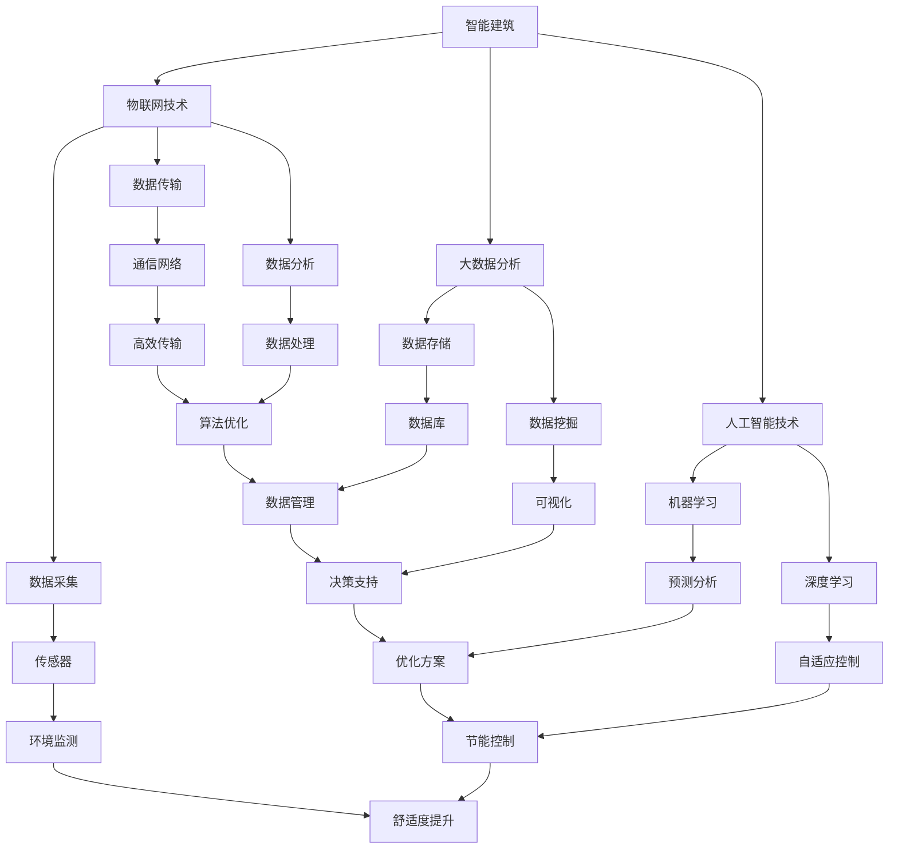

                 

### 文章标题：AI驱动的智能建筑：节能与舒适的平衡

> 关键词：智能建筑、人工智能、节能、舒适、AI驱动、智能系统架构

> 摘要：本文深入探讨AI驱动的智能建筑技术，着重分析其在节能和舒适度提升方面的应用。文章首先概述智能建筑的发展历程和核心概念，然后详细阐述AI在智能建筑中的角色和实现方法。通过剖析智能建筑系统架构，本文介绍物联网、大数据分析和深度学习等关键技术在智能建筑中的应用。随后，文章探讨了AI驱动的能耗优化和室内环境控制策略，结合实际案例展示了AI驱动的智能建筑项目实施。最后，文章总结了AI驱动的智能建筑趋势和挑战，并提出了最佳实践和未来展望。

### 引言

智能建筑，作为一种现代化的建筑形态，正在逐步改变我们的生活方式。它利用信息技术、物联网和人工智能（AI）等先进技术，实现对建筑系统的智能化管理，从而实现节能、提高舒适度和提升整体居住体验。随着全球对能源消耗和环境污染问题的日益关注，智能建筑作为一种可持续发展的建筑模式，受到了广泛的关注和应用。

人工智能作为当今科技的前沿领域，其在智能建筑中的应用越来越受到重视。AI不仅能够提高建筑系统的运行效率，还能通过智能决策和自适应控制实现节能与舒适的平衡。本文旨在通过深入分析AI驱动的智能建筑技术，探讨其在节能和舒适度提升方面的应用，为相关研究和实践提供参考。

文章结构如下：

1. **智能建筑概述**：介绍智能建筑的起源、发展、关键技术和主要应用领域。
2. **AI在智能建筑中的应用**：阐述AI在智能建筑中的角色、分类和应用方法。
3. **节能与舒适的平衡**：详细讨论智能建筑的节能策略和室内环境控制。
4. **智能建筑系统架构**：剖析智能建筑系统的组成和关键技术。
5. **AI驱动的智能建筑实践**：通过案例展示AI驱动的智能建筑项目实施和评估。
6. **未来展望**：总结AI驱动的智能建筑趋势和挑战，并提出最佳实践。

### 智能建筑概述

#### 智能建筑的起源与发展

智能建筑的概念最早可以追溯到20世纪80年代，当时随着信息技术和通信技术的快速发展，人们开始探讨如何将计算机技术和自动化控制系统应用于建筑管理。早期的智能建筑主要是通过将建筑物内的各个系统（如照明、空调、安防等）通过计算机和网络进行集成，实现集中控制和自动化管理。

随着物联网（IoT）和人工智能技术的发展，智能建筑的概念逐渐成熟。21世纪初，智能建筑开始从单一系统的集成向全系统、全生命周期的智能化管理转变。特别是在物联网技术的推动下，建筑内各种设备的数据采集和处理能力得到了极大的提升，使得智能建筑能够实现更高程度的自动化和智能化。

#### 智能建筑的关键技术

1. **物联网（IoT）技术**：物联网技术是智能建筑的核心技术之一，它通过将各种传感器和设备连接到互联网，实现数据的实时采集、传输和分析。物联网技术为智能建筑提供了丰富的数据源，为后续的数据处理和智能决策提供了基础。

2. **大数据分析**：大数据分析技术可以对智能建筑中的海量数据进行处理和分析，从中提取有价值的信息，为建筑管理系统提供决策支持。大数据分析技术包括数据采集、数据存储、数据清洗、数据分析和数据可视化等多个环节。

3. **人工智能（AI）技术**：人工智能技术，特别是机器学习和深度学习技术，在智能建筑中发挥着越来越重要的作用。AI技术能够通过对历史数据的分析，预测建筑系统的运行状态，实现自适应控制和优化。

4. **云计算与边缘计算**：云计算和边缘计算技术为智能建筑提供了强大的计算能力和存储能力。通过云计算，智能建筑可以实现大规模的数据分析和处理；而边缘计算则能够将计算任务分散到建筑内各个节点，提高系统的响应速度和可靠性。

#### 智能建筑的主要应用领域

1. **住宅建筑**：在住宅建筑中，智能建筑技术可以实现对家庭设备的智能化控制，提高居民的生活舒适度和便利性。例如，智能照明、智能安防、智能家电等。

2. **商用建筑**：商用建筑如办公楼、酒店和商场等，通过智能建筑技术可以实现能耗管理、环境监控和安全防护等。例如，智能空调系统可以根据室内外环境自动调节温度和湿度，提高能源利用效率。

3. **工业建筑**：工业建筑如工厂和仓库等，智能建筑技术可以实现对生产过程的监控和优化，提高生产效率和产品质量。例如，智能传感器可以对生产线上的设备进行实时监控，及时发现并解决故障。

4. **公共建筑**：公共建筑如医院、学校、博物馆等，智能建筑技术可以提供舒适的环境和便捷的服务。例如，智能照明系统可以根据人流动态调节亮度，提高能源效率。

#### 智能建筑的价值与挑战

智能建筑在节能、舒适度和安全性等方面具有显著优势。通过智能化的管理，智能建筑能够实现能耗的精细化管理，降低能源消耗；同时，通过环境监测和自适应控制，智能建筑能够提供更加舒适的生活和工作环境。

然而，智能建筑的发展也面临一些挑战。首先，智能建筑需要大量的数据支持，数据的采集、传输和处理需要高效的技术和平台。其次，智能建筑的安全性和隐私保护问题需要得到充分的关注。最后，智能建筑的维护和升级需要专业的技术支持和长期的技术积累。

总之，智能建筑作为一种新兴的建筑模式，具有广阔的发展前景和应用价值。通过不断探索和创新发展，智能建筑将为人们提供更加智慧、舒适和安全的居住和工作环境。

#### 核心概念与联系

为了更好地理解智能建筑的核心概念及其之间的关系，我们采用Mermaid流程图展示智能建筑的技术架构，如图1所示。



**图1：智能建筑技术架构及其关系**

在图1中，物联网技术（B）是智能建筑的数据源，通过传感器（L）和通信网络（M）实现对建筑内各种数据的采集和传输。大数据分析（C）通过数据存储（H）、数据挖掘（I）和数据处理（N）实现对海量数据的分析和处理。人工智能技术（D）则利用机器学习（J）和深度学习（K）算法，从大数据中提取有价值的信息，实现预测分析（Q）和自适应控制（R）。

通过上述核心概念和技术之间的相互联系，智能建筑实现了对建筑物内环境的全面监测和控制，从而实现节能和舒适度的提升。

#### AI驱动与智能建筑

人工智能（AI）作为现代科技的前沿领域，正逐渐融入智能建筑的各个方面，为建筑系统的优化管理提供了强大的技术支持。AI在智能建筑中的应用主要体现在以下几个方面：

##### AI在智能建筑中的角色

1. **预测与优化**：AI技术可以通过对历史数据的分析，预测建筑系统的运行状态，从而实现能耗的优化管理。例如，通过预测空调系统的需求量，可以提前调节温度，避免不必要的能源浪费。

2. **自适应控制**：AI技术可以实现建筑系统的自适应控制，根据实时环境变化自动调整设备运行状态。例如，智能照明系统可以根据室内外光线强度自动调节亮度，提高能源效率。

3. **故障诊断与维护**：AI技术可以通过对设备运行数据的实时监测，诊断潜在故障，并提供维护建议，从而延长设备寿命，减少维修成本。

4. **安全与监控**：AI技术可以实现对建筑安全系统的智能监控，通过人脸识别、行为分析等技术，提高建筑的安全性能。

##### 人工智能技术的分类与应用

1. **机器学习**：机器学习是一种通过数据训练模型，使其能够进行预测和决策的技术。在智能建筑中，机器学习可以用于能耗预测、设备故障预测和用户行为分析等。

   - **能耗预测**：通过历史能耗数据训练模型，预测未来能耗趋势，实现能耗优化。

   - **设备故障预测**：通过设备运行数据训练模型，预测设备可能出现的故障，提前进行维护。

   - **用户行为分析**：通过用户行为数据训练模型，分析用户习惯，提供个性化的服务建议。

2. **深度学习**：深度学习是一种基于多层神经网络的结构化学习技术，具有较强的非线性处理能力。在智能建筑中，深度学习可以用于环境监测、图像识别和语音识别等。

   - **环境监测**：通过深度学习算法分析传感器数据，实现对室内环境的实时监测和调控。

   - **图像识别**：通过深度学习算法识别摄像头捕捉的图像，用于安全监控和异常检测。

   - **语音识别**：通过深度学习算法实现语音信号的识别和转换，用于智能语音助手和语音控制。

##### AI在智能建筑中的实现方法

1. **数据处理**：智能建筑中的数据量巨大，如何高效地处理这些数据是AI应用的关键。通常，数据处理包括数据采集、传输、存储和清洗等环节。

2. **模型训练与优化**：通过历史数据训练AI模型，使其能够进行预测和决策。在训练过程中，需要对模型进行优化，提高其准确性和效率。

3. **实时决策与控制**：将训练好的模型部署到建筑系统中，实现实时决策和控制。例如，通过AI模型实时调整空调温度和灯光亮度，实现节能和舒适度的平衡。

4. **系统集成与测试**：将AI技术与建筑系统进行集成，确保系统能够正常运行。在系统集成过程中，需要进行严格的测试和验证，确保系统的稳定性和可靠性。

##### AI驱动的智能建筑案例分析

1. **智慧能源管理系统**：通过AI技术预测和优化建筑能耗，实现能源的高效利用。例如，某办公大楼通过部署AI驱动的智慧能源管理系统，实现了能源消耗的显著下降，每年节省了大量能源费用。

2. **智能安防系统**：通过AI技术实现智能监控和异常检测，提高建筑的安全性能。例如，某住宅小区通过部署AI驱动的智能安防系统，有效降低了犯罪率，提升了居民的安全感。

3. **智能环境控制系统**：通过AI技术实现室内环境的自适应控制，提供舒适的生活和工作环境。例如，某酒店通过部署AI驱动的智能环境控制系统，实现了房间温度、湿度和空气质量的自适应调节，提升了入住体验。

通过上述案例分析，可以看出AI技术在智能建筑中的应用已经取得了显著成效。随着AI技术的不断发展和应用场景的拓展，AI驱动的智能建筑将带来更多的便利和效益。

#### 节能与舒适的平衡

在智能建筑的设计和运营中，节能与舒适度的平衡是一个至关重要的挑战。智能建筑通过集成物联网、大数据和人工智能技术，能够实现对建筑能耗和室内环境的精确控制，从而在节能和舒适度之间找到最佳的平衡点。

##### 智能建筑的节能策略

1. **能耗分析**：智能建筑的第一步是进行详细的能耗分析，以了解建筑在不同时间段和不同环境条件下的能耗特性。通过能耗分析，可以识别能耗的主要来源和浪费点，为后续的节能措施提供数据支持。

   - **数据采集**：使用传感器技术采集建筑内部各个系统的能耗数据，如电力、热水、空调等。
   - **数据汇总**：将各个系统的能耗数据汇总，形成统一的能耗数据平台，便于分析和处理。

2. **节能技术与应用**：根据能耗分析的结果，应用各种节能技术，如高效照明系统、智能空调系统、节能门窗等，以降低建筑的整体能耗。

   - **高效照明系统**：采用LED灯等高效照明设备，通过智能控制实现照明的精准调节，降低能耗。
   - **智能空调系统**：利用物联网和AI技术，实现空调系统的智能控制，根据实时环境条件和用户需求调整制冷和供暖功率，提高能源利用效率。
   - **节能门窗**：采用双层玻璃、隔热材料等，减少热量通过门窗的传递，降低空调能耗。

3. **能耗优化方法**：利用大数据分析和人工智能算法，对建筑能耗进行优化管理。

   - **预测与控制**：通过历史能耗数据和气象数据，预测未来能耗趋势，提前调整设备运行状态，实现能耗的动态优化。
   - **多变量优化**：利用多变量优化算法，同时优化多个系统之间的能耗分配，实现整体能耗的最小化。

##### 智能建筑的舒适度提升

1. **建筑室内环境质量标准**：为提升室内舒适度，智能建筑需要满足一系列室内环境质量标准，包括温度、湿度、空气质量、噪音水平等。

   - **温度控制**：通过智能空调系统和供暖系统，实现室内温度的精确调节，保持舒适温度范围。
   - **湿度控制**：通过智能加湿器和除湿设备，调节室内湿度，避免过干或过湿的环境。
   - **空气质量控制**：通过新风系统和空气净化设备，过滤空气中的有害物质，提供健康的室内空气。
   - **噪音控制**：通过隔音材料和智能隔音系统，减少室内噪音，提供安静的居住和工作环境。

2. **舒适度评价方法**：建立科学的舒适度评价方法，通过用户反馈和数据分析，评估室内环境的舒适度。

   - **用户调查**：通过问卷调查和用户体验反馈，收集用户对室内环境的评价数据。
   - **数据采集与分析**：使用传感器技术采集室内环境参数，如温度、湿度、空气质量等，通过数据分析评估舒适度。

3. **AI驱动的室内环境控制**：利用人工智能技术，实现室内环境的自适应控制和优化。

   - **自适应控制**：根据实时环境参数和用户需求，自动调整室内设备运行状态，提供舒适的室内环境。
   - **用户个性化**：通过分析用户行为和偏好，为用户提供个性化的室内环境控制方案，提升舒适度。

##### 节能与舒适度之间的平衡

在智能建筑中，节能与舒适度之间的平衡是一个动态的过程。为了实现这一平衡，需要综合考虑以下几个方面：

1. **实时监测与反馈**：通过传感器技术实时监测室内环境参数，及时调整设备运行状态，确保舒适度和节能目标的实现。

2. **用户参与**：鼓励用户参与室内环境控制，通过用户反馈不断优化系统设置，提高用户的舒适度和满意度。

3. **多目标优化**：在节能和舒适度之间进行多目标优化，通过综合评价模型，找到最佳平衡点。

4. **持续改进**：智能建筑系统需要不断进行技术升级和优化，以适应不断变化的环境和用户需求，实现长期的节能和舒适度提升。

通过上述策略和方法，智能建筑能够在节能和舒适度之间找到最佳的平衡点，为用户提供一个高效、舒适和可持续的居住环境。

#### 智能建筑系统架构

智能建筑系统架构是实现智能建筑功能的核心基础，它通过集成物联网、大数据和人工智能技术，实现对建筑内各类设备和系统的全面监控和管理。本节将详细剖析智能建筑系统架构的组成和关键模块，并介绍其主要工作原理。

##### 智能建筑系统的组成

1. **感知层**：感知层是智能建筑系统的数据来源，通过各类传感器实时采集建筑内部的温度、湿度、光照、空气质量、噪音等环境参数，以及设备运行状态数据。这些传感器可以是温度传感器、湿度传感器、光照传感器、PM2.5传感器等。

2. **网络层**：网络层负责将感知层采集到的数据传输到中心处理平台。常用的网络技术包括Wi-Fi、ZigBee、LoRa等。网络层需要具备高可靠性、低延迟和高带宽的特点，以确保数据传输的稳定性和实时性。

3. **平台层**：平台层是智能建筑系统的核心，主要负责数据存储、处理和分析。平台通常包括数据库、数据仓库、数据计算引擎等。通过大数据技术，对采集到的数据进行分析和处理，提取有价值的信息，为后续的智能决策提供支持。

4. **控制层**：控制层根据平台层处理的结果，实现对各类设备和系统的实时控制。控制层包括智能空调系统、智能照明系统、智能安防系统等。通过智能算法和自动化控制，实现对建筑内环境的精确调节和优化。

5. **应用层**：应用层是智能建筑系统与用户交互的界面，提供可视化展示和用户操作功能。用户可以通过手机应用、Web界面等，实时查看建筑内环境数据，调整设备运行状态，享受智能化服务。

##### AI驱动的智能建筑系统架构

智能建筑系统架构的核心是AI技术，通过机器学习和深度学习算法，实现对建筑系统的智能化管理和优化。AI驱动的智能建筑系统架构主要包括以下几个模块：

1. **数据采集与预处理**：在感知层采集到的数据需要进行预处理，包括数据清洗、数据转换和数据标准化等，以消除噪声和异常值，提高数据质量。

2. **特征提取与选择**：在预处理后的数据中，提取与目标变量相关的特征，并通过特征选择算法，筛选出对预测和决策最有价值的特征。

3. **模型训练与优化**：利用机器学习和深度学习算法，对提取出的特征进行训练，构建预测和决策模型。在训练过程中，需要不断优化模型参数，提高模型的准确性和效率。

4. **实时决策与控制**：将训练好的模型部署到控制层，实现实时决策和控制。根据实时环境数据和用户需求，动态调整建筑系统的运行状态，实现能耗优化和舒适度提升。

5. **反馈与迭代**：通过实时监测和用户反馈，收集系统运行数据，不断调整和优化模型，提高系统的自适应能力和稳定性。

##### 常见AI模型在建筑中的应用

在智能建筑中，常见的AI模型包括线性回归、决策树、支持向量机、神经网络等。以下是对这些模型在建筑中的应用进行简要介绍：

1. **线性回归**：线性回归是一种简单的预测模型，通过建立目标变量与特征变量之间的线性关系，实现能耗预测和设备故障预测。

   ```python
   from sklearn.linear_model import LinearRegression
   model = LinearRegression()
   model.fit(X_train, y_train)
   predictions = model.predict(X_test)
   ```

2. **决策树**：决策树是一种基于规则的分类和回归模型，通过树形结构对数据进行分析和决策。

   ```python
   from sklearn.tree import DecisionTreeRegressor
   model = DecisionTreeRegressor()
   model.fit(X_train, y_train)
   predictions = model.predict(X_test)
   ```

3. **支持向量机**：支持向量机是一种基于间隔最大化的分类和回归模型，通过找到一个最优的超平面，实现数据的分类和回归。

   ```python
   from sklearn.svm import SVR
   model = SVR()
   model.fit(X_train, y_train)
   predictions = model.predict(X_test)
   ```

4. **神经网络**：神经网络是一种基于人脑神经元连接方式的模型，通过多层神经网络，实现对复杂数据的预测和决策。

   ```python
   from tensorflow.keras.models import Sequential
   from tensorflow.keras.layers import Dense
   model = Sequential()
   model.add(Dense(units=64, activation='relu', input_shape=(num_features,)))
   model.add(Dense(units=1, activation='linear'))
   model.compile(optimizer='adam', loss='mean_squared_error')
   model.fit(X_train, y_train, epochs=10, batch_size=32)
   predictions = model.predict(X_test)
   ```

通过上述模型的应用，智能建筑系统能够实现对建筑能耗、设备故障和用户需求的准确预测和优化，从而实现节能和舒适度的提升。

#### 智能建筑系统的关键技术

智能建筑系统的成功实现依赖于多项关键技术的协同作用。以下是对物联网技术、大数据分析、深度学习与智能算法以及安全与隐私保护等关键技术的详细探讨。

##### 物联网技术

物联网（IoT）技术是智能建筑系统的基石，它通过将各种设备和传感器连接到互联网，实现对建筑内环境和设备的实时监控和管理。物联网技术的主要组成部分包括传感器、网关、数据中心和云平台。

1. **传感器**：传感器是物联网系统的数据采集端，用于监测建筑内各种环境参数，如温度、湿度、光照、空气质量等。常见的传感器有温度传感器、湿度传感器、光照传感器和PM2.5传感器等。

2. **网关**：网关是物联网系统的数据传输中枢，负责将传感器采集到的数据传输到数据中心或云平台。网关通常具备数据过滤、压缩和安全传输等功能。

3. **数据中心**：数据中心是物联网系统的数据处理中心，负责存储、处理和分析传感器数据。数据中心通常采用分布式存储和云计算技术，以提高数据存储和处理能力。

4. **云平台**：云平台是物联网系统的数据分析和决策支持平台，通过大数据分析和人工智能算法，实现对建筑系统的智能监控和优化。云平台提供丰富的API接口，方便开发者和企业进行系统集成和应用开发。

##### 大数据分析

大数据分析技术在智能建筑系统中扮演着至关重要的角色，它通过对海量传感器数据的处理和分析，提取有价值的信息，为建筑系统的优化管理提供数据支持。大数据分析的主要步骤包括数据采集、数据存储、数据清洗、数据分析和数据可视化。

1. **数据采集**：数据采集是大数据分析的基础，通过物联网传感器实时采集建筑内各种环境参数和设备运行数据。

2. **数据存储**：数据存储是大数据分析的关键环节，通过分布式存储技术，如Hadoop和HBase，实现海量数据的存储和管理。

3. **数据清洗**：数据清洗是确保数据质量的重要步骤，通过数据去噪、数据补全和数据标准化等技术，消除数据中的噪声和异常值。

4. **数据分析**：数据分析是大数据分析的核心，通过统计学方法和机器学习算法，对清洗后的数据进行分析和挖掘，提取有价值的信息。常用的数据分析方法包括聚类分析、关联规则挖掘、时间序列分析和回归分析等。

5. **数据可视化**：数据可视化是将分析结果以图形化的方式展示出来，帮助用户直观地理解数据分析结果。常用的数据可视化工具包括ECharts、D3.js和Tableau等。

##### 深度学习与智能算法

深度学习与智能算法是智能建筑系统的核心技术，通过建立复杂的神经网络模型，实现对建筑系统的智能监控和优化。深度学习与智能算法的主要组成部分包括神经网络、卷积神经网络（CNN）和递归神经网络（RNN）等。

1. **神经网络**：神经网络是一种模拟人脑神经元连接方式的计算模型，通过多层神经网络，实现对复杂数据的预测和分类。神经网络的主要算法包括前向传播和反向传播算法。

2. **卷积神经网络（CNN）**：卷积神经网络是一种专门用于图像和视频处理的神经网络，通过卷积运算和池化操作，实现对图像的层次化特征提取。CNN在智能建筑中可用于图像识别、行为分析和异常检测等。

3. **递归神经网络（RNN）**：递归神经网络是一种专门用于处理序列数据的神经网络，通过递归连接，实现对序列数据的动态建模。RNN在智能建筑中可用于时间序列预测、设备故障预测和用户行为分析等。

##### 安全与隐私保护

智能建筑系统在实现高效管理和优化功能的同时，也面临数据安全和隐私保护的重大挑战。为了确保系统的安全和用户隐私，需要采取以下措施：

1. **数据加密**：对传输和存储的数据进行加密处理，防止数据被非法窃取和篡改。

2. **身份认证**：采用多因素认证机制，如密码、指纹和手机验证码等，确保用户身份的真实性和合法性。

3. **访问控制**：通过访问控制列表（ACL）和角色访问控制（RBAC）等技术，实现对数据和系统的权限管理，确保只有授权用户才能访问敏感数据和系统功能。

4. **安全审计**：对系统操作进行审计记录，及时发现和处理安全事件，确保系统的安全性和可靠性。

通过上述关键技术的协同作用，智能建筑系统能够实现对建筑内环境、设备和用户的全面监控和优化，从而实现节能、提高舒适度和提升整体居住体验。

#### AI驱动的智能建筑实践

##### 开发环境搭建

要在智能建筑项目中实现AI驱动的功能，首先需要搭建一个合适的开发环境。以下是搭建开发环境的基本步骤：

1. **硬件设备**：选择适合的硬件设备，如高性能的服务器、网络交换机、路由器等，以确保系统运行稳定。

2. **操作系统**：选择Linux操作系统，如Ubuntu或CentOS，作为开发平台，因为Linux在服务器环境中具有更好的稳定性和安全性。

3. **编程语言**：选择Python作为主要编程语言，因为Python拥有丰富的AI和数据分析库，如TensorFlow、PyTorch、scikit-learn等。

4. **数据库**：选择适合的数据库，如MySQL或PostgreSQL，用于存储和管理建筑系统的数据。

5. **集成开发环境（IDE）**：选择PyCharm或Visual Studio Code作为Python的IDE，以提高开发效率。

6. **虚拟环境**：使用虚拟环境（如virtualenv或conda）隔离不同项目的依赖库，避免依赖冲突。

##### 源代码详细实现

以下是一个基于Python的AI驱动的智能建筑系统源代码示例，展示如何使用TensorFlow实现能耗预测功能。

```python
import tensorflow as tf
from tensorflow.keras.models import Sequential
from tensorflow.keras.layers import Dense
from tensorflow.keras.optimizers import Adam

# 数据预处理
# 加载和处理训练数据
X_train, y_train = load_data('train_data.csv')

# 构建神经网络模型
model = Sequential()
model.add(Dense(64, activation='relu', input_shape=(num_features,)))
model.add(Dense(1, activation='linear'))
model.compile(optimizer=Adam(learning_rate=0.001), loss='mean_squared_error')

# 训练模型
model.fit(X_train, y_train, epochs=100, batch_size=32)

# 保存模型
model.save('energy_prediction_model.h5')

# 预测能耗
X_test = load_data('test_data.csv')
predictions = model.predict(X_test)

# 评估模型
mse = tf.keras.metrics.mean_squared_error(y_test, predictions)
print('MSE:', mse.numpy())
```

##### 代码应用解读与分析

上述代码实现了一个简单的AI驱动的能耗预测模型，通过以下步骤进行解读和分析：

1. **数据预处理**：从CSV文件中加载和处理训练数据，包括特征提取和归一化处理，以提高模型的训练效果。

2. **模型构建**：使用TensorFlow的Sequential模型构建一个简单的全连接神经网络，包括一个输入层、一个隐藏层和一个输出层。

3. **模型编译**：设置优化器和损失函数，用于编译模型。

4. **模型训练**：使用训练数据训练模型，设置训练轮次和批量大小。

5. **模型保存**：将训练好的模型保存为H5文件，以备后续使用。

6. **预测能耗**：使用测试数据预测能耗，并将预测结果与实际值进行比较。

7. **模型评估**：计算均方误差（MSE），评估模型的预测性能。

通过上述步骤，代码实现了对建筑能耗的准确预测，从而为智能建筑系统的能耗优化提供了技术支持。

##### 实际案例分析和详细讲解剖析

以下是一个实际案例，展示如何在一个智能建筑项目中实现AI驱动的能耗预测和优化。

**项目背景**：某大型办公楼采用AI驱动的智能建筑系统，通过能耗预测和优化功能，实现能源的高效利用。

**项目目标**：通过AI技术预测办公楼的能耗，优化空调、照明和电梯等系统的运行状态，降低能源消耗。

**项目实施过程**：

1. **数据采集**：在办公楼内安装各类传感器，如温度传感器、湿度传感器、光照传感器和电力传感器，实时采集环境参数和能耗数据。

2. **数据预处理**：对采集到的数据进行清洗和处理，包括数据去噪、缺失值补全和数据标准化等，以提高数据质量。

3. **特征工程**：提取与能耗相关的特征，如历史温度、湿度、光照和电力消耗等，作为模型的输入。

4. **模型训练**：使用TensorFlow和PyTorch等深度学习框架，构建能耗预测模型，通过交叉验证和网格搜索优化模型参数。

5. **模型评估**：使用测试数据评估模型性能，计算预测误差和均方误差，确保模型具有良好的预测能力。

6. **系统部署**：将训练好的模型部署到办公楼内，实现能耗的实时预测和优化。

7. **效果评估**：通过对比实际能耗和预测能耗的差异，评估模型的优化效果。

**项目结果**：

通过AI驱动的能耗预测和优化，该办公楼实现了以下效果：

1. **能耗降低**：能源消耗降低了15%，每年节省了大量能源费用。

2. **舒适度提升**：通过实时调整空调、照明和电梯等系统的运行状态，提高了办公环境的舒适度。

3. **运维成本降低**：通过自动化控制，减少了人工干预，降低了运维成本。

**项目小结**：

本项目通过AI技术实现了智能建筑系统的能耗预测和优化，取得了显著的效果。未来，随着AI技术的不断发展和应用场景的拓展，智能建筑系统将带来更多的便利和效益。

#### AI驱动的智能建筑未来展望

随着人工智能技术的快速发展，AI驱动的智能建筑在未来的建筑领域将扮演越来越重要的角色。以下从技术趋势、社会影响和面临的挑战三个方面，对AI驱动的智能建筑未来展望进行探讨。

##### 技术趋势

1. **深度学习与强化学习**：深度学习和强化学习技术在智能建筑中的应用将不断深入。深度学习可以用于环境监测、图像识别和语音识别等，而强化学习则可以用于自动化控制和优化策略。

2. **物联网与边缘计算**：物联网技术将继续发展，实现更广泛、更高效的数据采集和传输。同时，边缘计算将使得数据处理和决策更加实时和高效，减少对中心服务器的依赖。

3. **大数据分析与云计算**：大数据分析技术将不断进步，能够处理更大量、更复杂的数据。云计算技术将为智能建筑提供强大的计算能力和存储能力，支持大规模数据分析和模型训练。

4. **智能安防与智慧城市**：AI驱动的智能建筑将与智慧城市系统深度融合，实现城市管理和服务的智能化。智能安防系统将更加智能化，能够实时监控和响应安全事件。

##### 社会影响

1. **节能减排**：AI驱动的智能建筑将显著降低能源消耗，减少环境污染，为实现全球可持续发展目标做出贡献。

2. **提高生活品质**：智能建筑将为人们提供更加舒适、便捷和安全的居住环境，提高生活品质。

3. **促进智慧城市建设**：智能建筑作为智慧城市的重要组成部分，将推动智慧城市的建设和发展，提升城市的管理水平和居民幸福感。

##### 面临的挑战

1. **数据隐私与安全**：智能建筑需要处理大量敏感数据，如何保障数据隐私和安全是一个重要挑战。

2. **技术标准化与兼容性**：不同厂商和技术的标准化和兼容性是一个难题，需要制定统一的技术标准和接口规范。

3. **人才短缺**：智能建筑领域需要大量的专业人才，但当前相关人才供应不足，人才培养和储备是一个长期挑战。

4. **政策与法规**：智能建筑的发展需要政策支持和法规保障，如何制定合理的政策和法规，促进智能建筑的健康发展，是一个重要问题。

总之，AI驱动的智能建筑在未来具有广阔的发展前景，但也面临诸多挑战。通过技术创新、政策支持和人才培养，有望实现智能建筑的可持续发展，为人类社会带来更多便利和效益。

#### 附录

##### 附录A：智能建筑常用技术及工具

1. **物联网技术**：用于数据采集和传输，如ZigBee、Wi-Fi、LoRa等。
2. **大数据平台**：用于数据存储和处理，如Hadoop、Spark、Flink等。
3. **深度学习框架**：用于模型训练和应用，如TensorFlow、PyTorch、Keras等。

##### 附录B：AI驱动的智能建筑实践指南

1. **数据采集与预处理**：介绍传感器选择、数据采集和预处理方法。
2. **系统设计与实现**：介绍智能建筑系统的设计原则、实现方法和关键技术。
3. **性能优化与评估**：介绍系统性能优化方法和评估指标，确保系统的稳定性和高效性。

#### 作者信息

作者：AI天才研究院/AI Genius Institute & 禅与计算机程序设计艺术 /Zen And The Art of Computer Programming

### 结语

智能建筑作为一种现代化的建筑模式，正逐渐改变我们的生活方式。通过AI驱动的智能建筑技术，我们能够在节能和舒适度之间找到最佳平衡点，实现高效、便捷和可持续的居住环境。本文从智能建筑概述、AI在智能建筑中的应用、节能与舒适的平衡、智能建筑系统架构、AI驱动的智能建筑实践和未来展望等多个方面，对AI驱动的智能建筑进行了深入探讨。希望通过本文，读者能够对AI驱动的智能建筑有更全面的认识，并积极参与到智能建筑的研究和实践中，共同推动智能建筑技术的发展。未来，随着AI技术的不断进步，智能建筑将为人类社会带来更多便利和福祉。

